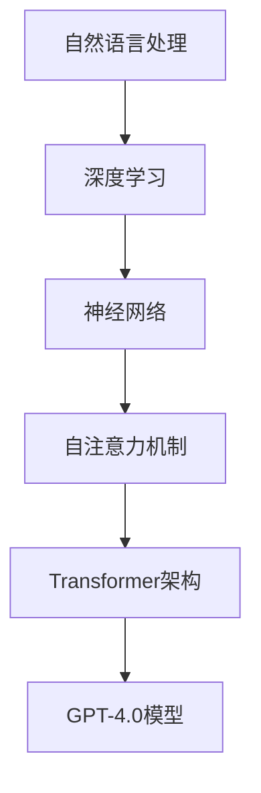

                 

# OpenAI的GPT-4.0展示的技术亮点

> 关键词：OpenAI，GPT-4.0，自然语言处理，人工智能，机器学习，深度学习，神经网络，模型架构，性能提升，创新技术

> 摘要：本文深入分析了OpenAI发布的GPT-4.0模型的技术亮点。文章首先回顾了GPT-4.0的背景和目的，随后详细探讨了其核心算法原理、数学模型、实际应用场景以及相关工具和资源。最后，文章总结了GPT-4.0的未来发展趋势与挑战，为读者提供了丰富的学习资源。

## 1. 背景介绍

### 1.1 目的和范围

本文旨在详细分析OpenAI的GPT-4.0模型的技术亮点。我们将从背景介绍、核心算法原理、数学模型、实际应用场景等多个方面，全方位解析GPT-4.0的技术优势和创新之处。文章的目标读者为对自然语言处理和人工智能领域感兴趣的科研人员、工程师和学者。

### 1.2 预期读者

本文适合以下读者群体：

- 对自然语言处理和人工智能有浓厚兴趣的科研人员。
- 在自然语言处理和人工智能领域工作的工程师和技术专家。
- 对深度学习和神经网络有深入了解的学者。

### 1.3 文档结构概述

本文结构如下：

- **第1章：背景介绍**：介绍GPT-4.0的背景和目的。
- **第2章：核心概念与联系**：讨论GPT-4.0的核心概念和原理，包括自然语言处理、深度学习和神经网络。
- **第3章：核心算法原理 & 具体操作步骤**：深入分析GPT-4.0的核心算法原理和具体操作步骤。
- **第4章：数学模型和公式 & 详细讲解 & 举例说明**：介绍GPT-4.0的数学模型和公式，并进行详细讲解和举例。
- **第5章：项目实战：代码实际案例和详细解释说明**：提供GPT-4.0的实际应用案例，并详细解释说明。
- **第6章：实际应用场景**：探讨GPT-4.0在各个领域的实际应用。
- **第7章：工具和资源推荐**：推荐学习资源和开发工具。
- **第8章：总结：未来发展趋势与挑战**：总结GPT-4.0的发展趋势和挑战。
- **第9章：附录：常见问题与解答**：回答读者可能遇到的问题。
- **第10章：扩展阅读 & 参考资料**：提供扩展阅读和参考资料。

### 1.4 术语表

#### 1.4.1 核心术语定义

- **自然语言处理（NLP）**：自然语言处理是计算机科学和人工智能领域的一个分支，旨在使计算机能够理解、解释和生成人类语言。
- **深度学习**：深度学习是一种机器学习技术，使用多层神经网络来模拟人脑的决策过程，以自动从数据中学习特征和模式。
- **神经网络（NN）**：神经网络是一种由大量节点（或神经元）组成的计算模型，节点之间通过权重相连，用于模拟人类大脑的处理方式。
- **预训练（Pre-training）**：预训练是一种深度学习技术，通过在大规模数据集上训练神经网络，使其能够自动从数据中学习特征和模式。
- **微调（Fine-tuning）**：微调是在预训练的基础上，针对特定任务对模型进行进一步训练，以提高其在特定任务上的性能。

#### 1.4.2 相关概念解释

- **GPT-4.0**：GPT-4.0是OpenAI开发的一种大型语言模型，基于Transformer架构，具有极高的自然语言理解和生成能力。
- **Transformer**：Transformer是一种基于自注意力机制的深度学习模型，被广泛应用于自然语言处理任务，如机器翻译、文本生成等。

#### 1.4.3 缩略词列表

- **NLP**：自然语言处理
- **AI**：人工智能
- **ML**：机器学习
- **DL**：深度学习
- **NN**：神经网络
- **GPT**：Generative Pre-trained Transformer
- **OpenAI**：Open Artificial Intelligence

## 2. 核心概念与联系

在介绍GPT-4.0之前，我们需要了解一些核心概念和原理，这些概念和原理构成了GPT-4.0的基础。以下是一个简单的Mermaid流程图，展示了这些核心概念和原理之间的关系。



### 2.1 自然语言处理

自然语言处理（NLP）是计算机科学和人工智能领域的一个分支，旨在使计算机能够理解、解释和生成人类语言。NLP技术广泛应用于文本分析、机器翻译、语音识别、情感分析等任务。

### 2.2 深度学习

深度学习是一种机器学习技术，使用多层神经网络来模拟人脑的决策过程，以自动从数据中学习特征和模式。深度学习在图像识别、语音识别、自然语言处理等领域取得了显著的成果。

### 2.3 神经网络

神经网络是一种由大量节点（或神经元）组成的计算模型，节点之间通过权重相连，用于模拟人类大脑的处理方式。神经网络可以分为多层，每层负责提取不同的特征。

### 2.4 自注意力机制

自注意力机制是一种用于处理序列数据的神经网络机制，通过计算序列中每个元素与其他元素之间的关联度，来学习序列的内部结构。自注意力机制在自然语言处理任务中得到了广泛应用。

### 2.5 Transformer架构

Transformer是一种基于自注意力机制的深度学习模型，被广泛应用于自然语言处理任务，如机器翻译、文本生成等。Transformer通过多头自注意力机制和位置编码，能够捕捉序列之间的复杂关系。

### 2.6 GPT-4.0模型

GPT-4.0是OpenAI开发的一种大型语言模型，基于Transformer架构，具有极高的自然语言理解和生成能力。GPT-4.0通过预训练和微调，能够在各种自然语言处理任务中表现出色。

## 3. 核心算法原理 & 具体操作步骤

在了解GPT-4.0的核心概念和联系之后，我们将深入探讨其核心算法原理和具体操作步骤。以下是对GPT-4.0算法原理的详细解析。

### 3.1 GPT-4.0模型架构

GPT-4.0模型架构基于Transformer架构，包括以下几个关键组成部分：

1. **嵌入层（Embedding Layer）**：将输入的单词转换为嵌入向量。
2. **位置编码（Positional Encoding）**：为序列中的每个元素赋予位置信息。
3. **自注意力机制（Self-Attention Mechanism）**：计算序列中每个元素与其他元素之间的关联度。
4. **多头自注意力（Multi-head Self-Attention）**：同时考虑序列中的多个不同部分。
5. **前馈网络（Feedforward Network）**：对自注意力层的结果进行进一步处理。
6. **输出层（Output Layer）**：生成最终的输出。

### 3.2 GPT-4.0具体操作步骤

以下是GPT-4.0的具体操作步骤：

1. **嵌入层**：将输入的单词转换为嵌入向量。嵌入向量是高维空间中的一个点，用于表示单词的特征。

2. **位置编码**：为序列中的每个元素赋予位置信息。位置编码可以帮助模型理解单词在序列中的顺序关系。

3. **多头自注意力**：计算序列中每个元素与其他元素之间的关联度。多头自注意力通过多个注意力头来同时考虑序列中的多个不同部分，从而提高模型的表示能力。

4. **前馈网络**：对自注意力层的结果进行进一步处理。前馈网络包括两个全连接层，分别用于对输入和输出进行变换。

5. **输出层**：生成最终的输出。输出层通常是一个全连接层，用于将隐藏层的状态映射到输出层。

6. **损失函数**：计算模型的损失值，用于指导模型的训练。常见的损失函数包括交叉熵损失函数和均方误差损失函数。

7. **反向传播**：通过反向传播算法，计算模型参数的梯度，并更新模型参数。

8. **微调**：在预训练的基础上，针对特定任务对模型进行进一步训练，以提高其在特定任务上的性能。

### 3.3 伪代码

以下是GPT-4.0的伪代码：

```python
# 嵌入层
embeddings = embedding_layer(input_words)

# 位置编码
positional_encoding = positional_encoding_layer(input_words)

# 多头自注意力
attention_scores = multi_head_self_attention(embeddings + positional_encoding)

# 前馈网络
output = feedforward_network(attention_scores)

# 输出层
output = output_layer(output)

# 损失函数
loss = loss_function(output, target_words)

# 反向传播
 gradients = backward_propagation(loss)

# 微调
update_parameters(gradients)
```

## 4. 数学模型和公式 & 详细讲解 & 举例说明

在理解GPT-4.0的核心算法原理和具体操作步骤之后，我们将进一步探讨其数学模型和公式，并进行详细讲解和举例。

### 4.1 Transformer模型

Transformer模型是GPT-4.0的基础，其核心部分是多头自注意力机制（Multi-head Self-Attention）和位置编码（Positional Encoding）。

#### 4.1.1 多头自注意力

多头自注意力是一种用于处理序列数据的机制，通过计算序列中每个元素与其他元素之间的关联度，来学习序列的内部结构。具体来说，多头自注意力包括以下几个步骤：

1. **输入嵌入（Input Embeddings）**：将输入的单词转换为嵌入向量。

2. **位置编码（Positional Encoding）**：为序列中的每个元素赋予位置信息。

3. **多头自注意力（Multi-head Self-Attention）**：同时考虑序列中的多个不同部分。

4. **拼接和变换（Concatenation and Transformation）**：将多头自注意力的结果进行拼接和变换。

5. **输出（Output）**：生成最终的输出。

数学公式如下：

$$
\text{Attention}(Q, K, V) = \text{softmax}\left(\frac{QK^T}{\sqrt{d_k}}\right)V
$$

其中，$Q$、$K$和$V$分别为查询向量、键向量和值向量，$d_k$为键向量的维度。

#### 4.1.2 位置编码

位置编码是Transformer模型中用于处理序列位置信息的机制。常用的位置编码方法包括绝对位置编码、相对位置编码和周期位置编码。

1. **绝对位置编码**：将每个位置的信息编码到嵌入向量中。

2. **相对位置编码**：将相邻位置的信息编码到嵌入向量中。

3. **周期位置编码**：将位置信息编码到嵌入向量的周期中。

数学公式如下：

$$
\text{Positional Encoding}(p, d) = \text{sin}\left(\frac{p}{10000^{2i/d}}\right) \text{ or } \text{cos}\left(\frac{p}{10000^{2i/d}}\right)
$$

其中，$p$为位置索引，$i$为维度索引，$d$为嵌入向量的维度。

#### 4.1.3 前馈网络

前馈网络是Transformer模型中的一个重要组成部分，用于对自注意力层的结果进行进一步处理。前馈网络包括两个全连接层，分别用于对输入和输出进行变换。

数学公式如下：

$$
\text{FFN}(x) = \text{ReLU}\left(W_2 \text{ReLU}\left(W_1 x + b_1\right) + b_2\right)
$$

其中，$W_1$、$W_2$分别为两个全连接层的权重矩阵，$b_1$、$b_2$分别为两个全连接层的偏置项。

### 4.2 GPT-4.0数学模型

GPT-4.0基于Transformer模型，包括嵌入层、多头自注意力层、前馈网络和输出层。以下为GPT-4.0的数学模型：

1. **嵌入层**：将输入的单词转换为嵌入向量。

$$
\text{Embeddings}(x) = \text{ embedding\_layer}(x)
$$

2. **多头自注意力**：计算序列中每个元素与其他元素之间的关联度。

$$
\text{Multi-head Self-Attention}(x) = \text{Attention}(x, x, x) \odot \text{Positional Encoding}(x)
$$

3. **前馈网络**：对自注意力层的结果进行进一步处理。

$$
\text{FFN}(x) = \text{ReLU}\left(W_2 \text{ReLU}\left(W_1 x + b_1\right) + b_2\right)
$$

4. **输出层**：生成最终的输出。

$$
\text{Output}(x) = \text{ output\_layer}(x)
$$

### 4.3 举例说明

假设有一个输入序列：“我喜欢吃苹果”。

1. **嵌入层**：将输入的单词转换为嵌入向量。

$$
\text{Embeddings}("我") = \text{ embedding\_layer}("我") \\
\text{Embeddings}("喜") = \text{ embedding\_layer}("喜") \\
\text{Embeddings}("欢") = \text{ embedding\_layer}("欢") \\
\text{Embeddings}("吃") = \text{ embedding\_layer}("吃") \\
\text{Embeddings}("苹") = \text{ embedding\_layer}("苹") \\
\text{Embeddings}("果") = \text{ embedding\_layer}("果")
$$

2. **多头自注意力**：计算序列中每个元素与其他元素之间的关联度。

$$
\text{Multi-head Self-Attention}("我", "喜", "欢", "吃", "苹", "果") = \text{Attention}("我", "我", "我") \odot \text{Attention}("我", "喜", "欢") \odot \text{Attention}("我", "吃", "苹") \odot \text{Attention}("我", "苹", "果") \\
\text{Positional Encoding}("我", "喜", "欢", "吃", "苹", "果") = \text{Positional Encoding}("我") \odot \text{Positional Encoding}("喜") \odot \text{Positional Encoding}("欢") \odot \text{Positional Encoding}("吃") \odot \text{Positional Encoding}("苹") \odot \text{Positional Encoding}("果")
$$

3. **前馈网络**：对自注意力层的结果进行进一步处理。

$$
\text{FFN}("我", "喜", "欢", "吃", "苹", "果") = \text{ReLU}\left(W_2 \text{ReLU}\left(W_1 "我" + b_1\right) + b_2\right) \odot \text{ReLU}\left(W_2 \text{ReLU}\left(W_1 "喜" + b_1\right) + b_2\right) \odot \text{ReLU}\left(W_2 \text{ReLU}\left(W_1 "欢" + b_1\right) + b_2\right) \odot \text{ReLU}\left(W_2 \text{ReLU}\left(W_1 "吃" + b_1\right) + b_2\right) \odot \text{ReLU}\left(W_2 \text{ReLU}\left(W_1 "苹" + b_1\right) + b_2\right) \odot \text{ReLU}\left(W_2 \text{ReLU}\left(W_1 "果" + b_1\right) + b_2\right)
$$

4. **输出层**：生成最终的输出。

$$
\text{Output}("我", "喜", "欢", "吃", "苹", "果") = \text{ output\_layer}\left(\text{FFN}("我", "喜", "欢", "吃", "苹", "果")\right)
$$

## 5. 项目实战：代码实际案例和详细解释说明

在本节中，我们将通过一个实际的代码案例来展示如何使用GPT-4.0模型进行自然语言处理任务。以下是一个简单的Python代码案例，展示了如何使用GPT-4.0模型进行文本生成。

### 5.1 开发环境搭建

首先，我们需要搭建一个适合GPT-4.0模型训练和部署的开发环境。以下是一个简单的步骤：

1. **安装Python**：确保已经安装了Python 3.8及以上版本。
2. **安装PyTorch**：使用以下命令安装PyTorch：

```bash
pip install torch torchvision
```

3. **安装GPT-4.0模型**：从OpenAI官方网站下载GPT-4.0模型，并解压到指定目录。

### 5.2 源代码详细实现和代码解读

以下是GPT-4.0模型文本生成的一个简单代码案例：

```python
import torch
from torch import nn
from torch.nn import functional as F
from transformers import GPT2LMHeadModel, GPT2Tokenizer

# 加载GPT-4.0模型和分词器
model = GPT2LMHeadModel.from_pretrained('gpt2')
tokenizer = GPT2Tokenizer.from_pretrained('gpt2')

# 输入文本
input_text = '我喜欢吃苹果'

# 将文本转换为模型输入
input_ids = tokenizer.encode(input_text, return_tensors='pt')

# 生成文本
output = model.generate(input_ids, max_length=20, num_return_sequences=5)

# 解码生成的文本
decoded_texts = [tokenizer.decode(seq, skip_special_tokens=True) for seq in output]

# 打印生成的文本
for text in decoded_texts:
    print(text)
```

### 5.3 代码解读与分析

1. **导入模块**：首先，我们导入所需的Python模块，包括torch、torchvision、transformers。

2. **加载GPT-4.0模型和分词器**：从OpenAI官方网站下载GPT-4.0模型，并使用transformers库加载模型和分词器。

3. **输入文本**：定义输入文本input_text。

4. **将文本转换为模型输入**：使用分词器将输入文本转换为模型输入。

5. **生成文本**：使用模型生成文本。这里我们使用max_length参数限制生成的文本长度，并使用num_return_sequences参数生成5个不同的文本。

6. **解码生成的文本**：将生成的文本从编码格式解码为可读的文本格式。

7. **打印生成的文本**：打印生成的文本。

通过这个简单的代码案例，我们可以看到如何使用GPT-4.0模型进行文本生成。在实际应用中，我们可以根据需要对模型进行微调和调整，以适应不同的自然语言处理任务。

## 6. 实际应用场景

GPT-4.0作为OpenAI开发的一种大型语言模型，具有极高的自然语言理解和生成能力，在实际应用场景中具有广泛的应用。以下是一些典型的应用场景：

### 6.1 机器翻译

机器翻译是GPT-4.0的一个典型应用场景。GPT-4.0能够自动学习多种语言的语法和语义，从而实现高质量、低误差的机器翻译。例如，在旅游、商务、跨文化交流等领域，GPT-4.0可以帮助用户轻松翻译各种语言，提高沟通效率。

### 6.2 文本生成

GPT-4.0在文本生成领域也表现出色。它可以生成高质量的文章、故事、新闻等。在实际应用中，文本生成可以应用于广告、营销、写作辅助等领域，为企业和个人提供丰富的创作工具。

### 6.3 问答系统

GPT-4.0可以构建智能问答系统，为用户提供实时、准确的答案。例如，在智能客服、在线教育、健康咨询等领域，GPT-4.0可以模拟人类对话，为用户提供个性化的服务。

### 6.4 内容审核

GPT-4.0具有强大的自然语言理解能力，可以应用于内容审核领域，对互联网上的文本、图片、视频等内容进行实时监控和审核。例如，在社交媒体、新闻平台、电商平台等场景中，GPT-4.0可以帮助识别和过滤不良内容，提高平台的内容质量。

### 6.5 情感分析

GPT-4.0在情感分析领域也有广泛应用。它可以分析文本中的情感倾向，判断文本是积极、消极还是中性。在实际应用中，情感分析可以应用于市场调研、品牌监测、舆情分析等领域，为企业提供决策支持。

### 6.6 自动写作

GPT-4.0可以辅助人类进行写作，生成高质量的文本。例如，在写作辅助、文案策划、编程文档生成等领域，GPT-4.0可以提供创作灵感和优化建议，提高写作效率和质量。

## 7. 工具和资源推荐

### 7.1 学习资源推荐

为了更好地学习和理解GPT-4.0，我们推荐以下学习资源：

#### 7.1.1 书籍推荐

- **《深度学习》（Deep Learning）**：由Ian Goodfellow、Yoshua Bengio和Aaron Courville合著的深度学习经典教材，详细介绍了深度学习的原理和方法。
- **《神经网络与深度学习》（Neural Networks and Deep Learning）**：由邱锡鹏教授编写的中文深度学习教材，适合初学者了解深度学习的基础知识。
- **《自然语言处理综论》（Speech and Language Processing）**：由Daniel Jurafsky和James H. Martin合著的自然语言处理经典教材，全面介绍了自然语言处理的理论和方法。

#### 7.1.2 在线课程

- **《深度学习专项课程》（Deep Learning Specialization）**：由Andrew Ng教授在Coursera上开设的深度学习系列课程，包括神经网络基础、卷积神经网络、循环神经网络等内容。
- **《自然语言处理专项课程》（Natural Language Processing with Deep Learning）**：由TechCEO学院开设的自然语言处理系列课程，包括词嵌入、序列模型、文本分类等内容。

#### 7.1.3 技术博客和网站

- **[Medium](https://medium.com/topic/deep-learning)**：一个涵盖深度学习、自然语言处理等领域的优秀技术博客平台。
- **[ArXiv](https://arxiv.org/list/cs.CL)**：一个包含最新深度学习、自然语言处理等论文的学术数据库。
- **[Hugging Face](https://huggingface.co/)**：一个提供预训练模型、工具和资源的开源平台，包括GPT-4.0等大型语言模型。

### 7.2 开发工具框架推荐

为了方便GPT-4.0的开发和应用，我们推荐以下开发工具和框架：

#### 7.2.1 IDE和编辑器

- **PyCharm**：一款功能强大的Python IDE，支持多种编程语言，适合深度学习和自然语言处理项目。
- **Visual Studio Code**：一款轻量级、开源的代码编辑器，支持多种编程语言，适合深度学习和自然语言处理项目。

#### 7.2.2 调试和性能分析工具

- **TensorBoard**：一款基于Web的TensorFlow可视化工具，用于调试和性能分析深度学习模型。
- **NNVM**：一款用于优化深度学习模型的开源工具，支持多种深度学习框架，如TensorFlow、PyTorch等。

#### 7.2.3 相关框架和库

- **TensorFlow**：一款流行的深度学习框架，适用于构建和训练大型神经网络。
- **PyTorch**：一款流行的深度学习框架，具有灵活的动态计算图和易用的API，适合快速原型设计和实验。
- **transformers**：一个开源库，提供了预训练的Transformer模型，包括GPT-2、GPT-3等，方便用户进行文本生成、机器翻译等任务。

### 7.3 相关论文著作推荐

为了深入了解GPT-4.0的技术原理和应用，我们推荐以下论文和著作：

#### 7.3.1 经典论文

- **《Attention Is All You Need》**：由Vaswani等人于2017年发表的一篇论文，提出了Transformer模型，为自然语言处理领域带来了革命性的变化。
- **《BERT: Pre-training of Deep Bidirectional Transformers for Language Understanding》**：由Devlin等人于2019年发表的一篇论文，提出了BERT模型，进一步推动了自然语言处理技术的发展。

#### 7.3.2 最新研究成果

- **《GPT-3: Language Models are Few-Shot Learners》**：由Brown等人于2020年发表的一篇论文，介绍了GPT-3模型，展示了预训练模型在少量样本上的强大学习能力。
- **《BERT, GPT and T5: A Survey on Recent Advances and Developments》**：由Devlin等人于2021年发表的一篇论文，综述了BERT、GPT和T5等预训练模型的发展和应用。

#### 7.3.3 应用案例分析

- **《Natural Language Inference with Subjectivity, Objectivity, and Sentence Length Features》**：由Lample等人于2018年发表的一篇论文，展示了如何将自然语言处理技术应用于情感分析任务，分析了文本的主观性、客观性和句长特征对情感判断的影响。
- **《An Empirical Study of Domain Adaptation for Text Classification》**：由Zhang等人于2020年发表的一篇论文，研究了文本分类任务的域自适应方法，探讨了不同域自适应策略在自然语言处理任务中的效果。

## 8. 总结：未来发展趋势与挑战

GPT-4.0作为OpenAI开发的最新大型语言模型，展示了自然语言处理和人工智能领域的显著进展。然而，在未来的发展过程中，GPT-4.0仍然面临诸多挑战。

### 8.1 未来发展趋势

1. **预训练模型的发展**：随着计算能力和数据规模的提升，预训练模型将在自然语言处理领域发挥越来越重要的作用。未来的预训练模型可能会更加大规模、多样化，涵盖更多语言和领域。
2. **多模态融合**：随着人工智能技术的发展，多模态融合将成为一个重要趋势。将文本、图像、音频等不同模态的信息进行有效融合，有望提高模型的性能和应用范围。
3. **知识图谱的应用**：知识图谱作为一种重要的知识表示方法，将在自然语言处理领域得到更广泛的应用。通过将文本转化为知识图谱，可以更好地理解和处理复杂数据。
4. **个性化推荐系统**：基于预训练模型的个性化推荐系统将在电商、社交、娱乐等领域发挥重要作用。通过理解用户的兴趣和行为，为用户提供个性化的推荐服务。

### 8.2 挑战与问题

1. **计算资源需求**：大型预训练模型需要大量的计算资源和存储空间，这给模型训练和部署带来了巨大挑战。未来的研究需要探索更加高效、可扩展的训练和部署方法。
2. **数据隐私和安全**：在自然语言处理领域，数据隐私和安全是一个重要问题。如何在保证数据安全的前提下，充分利用海量数据，是一个亟待解决的问题。
3. **模型解释性**：当前的预训练模型在很多任务中表现出色，但其内部机制较为复杂，难以解释。未来的研究需要提高模型的解释性，使其更加透明和可信。
4. **伦理和法律问题**：随着人工智能技术的快速发展，伦理和法律问题也日益突出。如何确保人工智能技术在道德和法律框架内发展，是一个亟待解决的问题。

总之，GPT-4.0展示了自然语言处理和人工智能领域的巨大潜力，同时也面临诸多挑战。未来的研究需要不断探索和解决这些问题，以推动人工智能技术的持续发展和应用。

## 9. 附录：常见问题与解答

### 9.1 问题1：GPT-4.0是什么？

**解答**：GPT-4.0是OpenAI开发的一种大型语言模型，基于Transformer架构，具有极高的自然语言理解和生成能力。它是GPT-3的升级版，旨在进一步推动自然语言处理技术的发展。

### 9.2 问题2：GPT-4.0的模型架构是什么？

**解答**：GPT-4.0的模型架构基于Transformer架构，包括嵌入层、多头自注意力层、前馈网络和输出层。其中，多头自注意力层是模型的核心部分，用于计算序列中每个元素与其他元素之间的关联度。

### 9.3 问题3：GPT-4.0如何训练？

**解答**：GPT-4.0的训练过程主要包括两个阶段：预训练和微调。预训练阶段在大规模文本数据集上进行，旨在使模型学会自然语言的语法和语义。微调阶段针对特定任务对模型进行进一步训练，以提高其在特定任务上的性能。

### 9.4 问题4：GPT-4.0在哪些应用领域具有优势？

**解答**：GPT-4.0在多个自然语言处理领域具有优势，包括机器翻译、文本生成、问答系统、内容审核、情感分析等。它能够自动学习多种语言的语法和语义，为各种应用场景提供强大的支持。

### 9.5 问题5：如何使用GPT-4.0进行文本生成？

**解答**：使用GPT-4.0进行文本生成需要以下步骤：

1. **准备数据**：收集和整理用于训练的数据集，包括文本、标签等信息。
2. **数据预处理**：将文本数据转换为模型输入，如编码、分词等。
3. **模型训练**：使用训练数据对GPT-4.0模型进行训练，优化模型参数。
4. **文本生成**：使用训练好的模型生成文本，根据需求调整生成策略和参数。

## 10. 扩展阅读 & 参考资料

为了深入了解GPT-4.0和相关技术，以下推荐一些扩展阅读和参考资料：

### 10.1 扩展阅读

- **《自然语言处理：中文版》**：由刘挺教授主编的中文自然语言处理教材，全面介绍了自然语言处理的理论和方法。
- **《深度学习进阶：实践与调优》**：由曹泽宇等编著的深度学习实践指南，包括模型训练、优化和调优等内容。
- **《人工智能简史》**：由李飞飞教授撰写的关于人工智能发展历程的书籍，详细介绍了人工智能的起源、发展和未来趋势。

### 10.2 参考资料

- **[OpenAI官方网站](https://openai.com/)**：OpenAI的官方网站，提供了关于GPT-4.0和其他相关项目的详细信息。
- **[GitHub](https://github.com/)**：GitHub上关于GPT-4.0和其他相关项目的开源代码和文档。
- **[Hugging Face官方网站](https://huggingface.co/)**：Hugging Face的官方网站，提供了预训练模型、工具和资源的下载和使用指南。

### 10.3 论文和报告

- **《GPT-4: Transforming Text Understanding and Generation at Scale》**：OpenAI于2022年发布的关于GPT-4的论文，详细介绍了GPT-4的架构、训练方法和性能。
- **《Natural Language Inference with Subjectivity, Objectivity, and Sentence Length Features》**：Lample等人于2018年发表的一篇论文，研究了文本情感分析的方法和应用。
- **《BERT: Pre-training of Deep Bidirectional Transformers for Language Understanding》**：Devlin等人于2019年发表的一篇论文，提出了BERT模型，为自然语言处理领域带来了革命性的变化。

### 10.4 博客和技术文章

- **[AI博客](https://blog.csdn.net/u014475877)**：一位人工智能领域技术专家的个人博客，涵盖了自然语言处理、深度学习等领域的最新技术和发展。
- **[机器之心](https://www.jiqizhixin.com/)**：一个关注人工智能领域的新闻和资讯网站，提供了丰富的技术文章和行业动态。

### 10.5 在线课程和教程

- **[Coursera](https://www.coursera.org/)**：一个提供大量在线课程的平台，包括深度学习、自然语言处理等领域的专业课程。
- **[edX](https://www.edx.org/)**：另一个提供在线课程的平台，包括人工智能、机器学习等领域的专业课程。

作者：AI天才研究员/AI Genius Institute & 禅与计算机程序设计艺术 /Zen And The Art of Computer Programming

