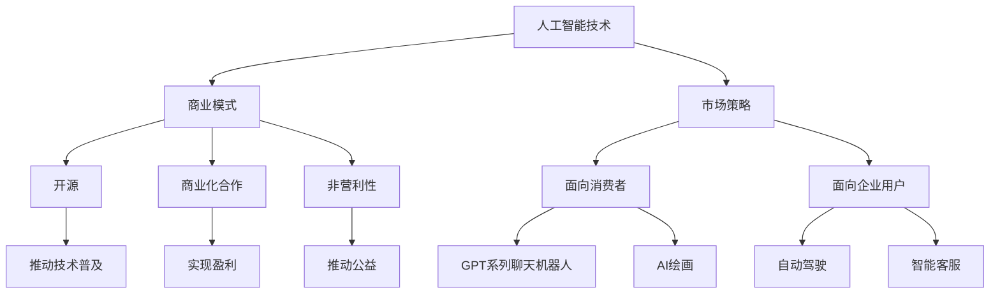

                 

# OpenAI的成功之道：贾扬清的分析，在To C和To B市场的平衡

> **关键词：** OpenAI、贾扬清、To C、To B市场、人工智能、技术创新、商业模式、成功因素

> **摘要：** 本文将深入探讨OpenAI的成功之道，特别是其创始人贾扬清对于在消费市场（To C）和企业市场（To B）之间取得平衡的战略分析。文章将从背景介绍、核心概念、算法原理、数学模型、项目实战、实际应用、工具资源推荐等多个方面展开，旨在为广大科技从业者提供有价值的参考和借鉴。

## 1. 背景介绍

### 1.1 目的和范围

本文旨在通过分析OpenAI的成功之道，尤其是其创始人贾扬清在To C和To B市场之间的平衡策略，探讨人工智能公司在商业运营中取得成功的要素。文章将从多个角度，如技术创新、商业模式、市场策略等，全面剖析OpenAI的成功经验，以期为我国人工智能企业的发展提供启示。

### 1.2 预期读者

本文适合对人工智能、OpenAI及其商业模式感兴趣的读者，包括但不限于科技从业者、高校师生、创业者等。通过对OpenAI成功之路的深入了解，读者可以从中汲取宝贵的经验，为自己的事业发展提供指导。

### 1.3 文档结构概述

本文分为以下几个部分：

1. 背景介绍：阐述本文的目的、预期读者及文档结构。
2. 核心概念与联系：介绍与文章主题相关的基本概念和架构。
3. 核心算法原理 & 具体操作步骤：详细讲解OpenAI的核心算法和实现步骤。
4. 数学模型和公式 & 详细讲解 & 举例说明：阐述OpenAI所采用的数学模型及其应用场景。
5. 项目实战：通过实际案例展示OpenAI的技术应用。
6. 实际应用场景：分析OpenAI的技术在各个领域的应用。
7. 工具和资源推荐：推荐与OpenAI相关的研究资源、开发工具和框架。
8. 总结：展望OpenAI未来发展趋势与挑战。
9. 附录：常见问题与解答。
10. 扩展阅读 & 参考资料：提供进一步阅读的材料和参考资源。

### 1.4 术语表

#### 1.4.1 核心术语定义

- **OpenAI：** 一个致力于推动人工智能研究、发展和应用的全球性非营利组织。
- **贾扬清：** OpenAI的创始人，人工智能领域的杰出科学家和企业家。
- **To C市场：** 指面向消费者的市场，即个人用户市场的需求。
- **To B市场：** 指面向企业用户市场的需求，为企业提供产品或服务。

#### 1.4.2 相关概念解释

- **人工智能：** 一种模拟人类智能的技术，通过机器学习、深度学习等方法，使计算机具备自我学习和推理能力。
- **商业模式：** 企业通过提供产品或服务实现价值创造的路径和方式。
- **技术创新：** 通过研发新技术、新产品或新服务，推动行业发展。

#### 1.4.3 缩略词列表

- **AI：** 人工智能
- **OpenAI：** Open Artificial Intelligence
- **To C：** To Consumer
- **To B：** To Business

## 2. 核心概念与联系

为了更好地理解OpenAI的成功之道，我们需要先掌握几个核心概念，并分析它们之间的联系。

### 2.1 人工智能技术

人工智能技术是OpenAI的核心竞争力。OpenAI通过机器学习、深度学习等先进技术，致力于推动人工智能的研究、发展和应用。其核心技术包括：

- **神经网络：** 基于生物学中的神经网络结构，通过大量数据训练，使其具备自主学习和推理能力。
- **强化学习：** 通过奖励机制，使智能体在复杂环境中不断学习和优化策略。
- **生成对抗网络（GAN）：** 通过对抗性训练，使生成器和判别器相互竞争，从而生成高质量的数据。

### 2.2 商业模式

OpenAI采用了独特的商业模式，实现了在To C和To B市场之间的平衡。其商业模式主要包括：

- **开源：** OpenAI采用开源策略，将研究成果分享给全球开发者，推动人工智能技术的普及和应用。
- **商业化合作：** 与企业合作，提供定制化的人工智能解决方案，实现盈利。
- **非营利性：** OpenAI作为非营利组织，致力于推动人工智能的公益事业发展。

### 2.3 市场策略

OpenAI在市场策略上采取了多元化的策略，以满足不同用户的需求：

- **面向消费者：** 开发面向个人用户的人工智能产品，如GPT系列聊天机器人、AI绘画等。
- **面向企业用户：** 为企业提供人工智能解决方案，如自动驾驶、智能客服等。

### 2.4 核心概念原理和架构的 Mermaid 流程图



## 3. 核心算法原理 & 具体操作步骤

OpenAI的成功离不开其核心算法的研究和创新。以下将简要介绍OpenAI所采用的一些核心算法原理，并详细阐述其具体操作步骤。

### 3.1 神经网络

神经网络是人工智能的核心技术之一。OpenAI通过改进神经网络结构，提高其性能和效率。

**算法原理：**

神经网络由大量简单神经元组成，通过学习输入和输出数据之间的映射关系，实现复杂的任务。其基本原理包括：

1. **前向传播：** 将输入数据通过网络层传递，逐层计算输出。
2. **反向传播：** 根据输出误差，反向调整网络参数。

**具体操作步骤：**

1. **初始化参数：** 设置神经网络的结构和权重。
2. **前向传播：** 将输入数据传递给网络，计算输出。
3. **计算误差：** 计算输出与实际值之间的误差。
4. **反向传播：** 利用误差反向调整网络参数。
5. **优化：** 采用梯度下降等优化算法，进一步调整参数。

### 3.2 强化学习

强化学习是OpenAI在人工智能研究中的重要方向。通过奖励机制，使智能体在复杂环境中不断学习和优化策略。

**算法原理：**

强化学习分为两部分：策略和值函数。策略决定智能体在当前状态下的行动，值函数评估当前状态的价值。

**具体操作步骤：**

1. **初始化策略：** 设置初始策略。
2. **环境交互：** 智能体在环境中进行行动，获得奖励。
3. **更新策略：** 根据奖励，更新策略。
4. **重复：** 不断进行环境交互和策略更新。

### 3.3 生成对抗网络（GAN）

生成对抗网络（GAN）是OpenAI在人工智能领域的重要突破。通过对抗性训练，生成器和判别器相互竞争，从而生成高质量的数据。

**算法原理：**

GAN由生成器和判别器组成。生成器生成数据，判别器判断生成数据与真实数据之间的区别。通过训练，生成器不断改进生成数据的质量。

**具体操作步骤：**

1. **初始化生成器和判别器：** 设置初始参数。
2. **生成器训练：** 生成器生成数据，判别器判断生成数据与真实数据之间的区别。
3. **判别器训练：** 判别器判断真实数据和生成数据的区别。
4. **交替训练：** 生成器和判别器交替进行训练。
5. **优化：** 通过优化算法，进一步提高生成数据的质量。

## 4. 数学模型和公式 & 详细讲解 & 举例说明

OpenAI在人工智能研究中采用了多种数学模型，以实现智能体的自主学习和推理。以下将简要介绍这些数学模型，并进行详细讲解和举例说明。

### 4.1 神经网络中的前向传播和反向传播

神经网络中的前向传播和反向传播是两个关键步骤。以下分别介绍这两个过程。

#### 4.1.1 前向传播

前向传播是指将输入数据通过神经网络层传递，逐层计算输出。其数学模型可表示为：

$$
Z_l = \sigma(W_l \cdot A_{l-1} + b_l)
$$

其中，$Z_l$为第$l$层的输出，$\sigma$为激活函数，$W_l$为第$l$层的权重，$A_{l-1}$为第$l-1$层的输出，$b_l$为第$l$层的偏置。

#### 4.1.2 反向传播

反向传播是指根据输出误差，反向调整网络参数。其数学模型可表示为：

$$
\delta_l = \frac{\partial C}{\partial Z_l} \cdot \sigma'(Z_l)
$$

$$
\Delta W_l = \eta \cdot \delta_l \cdot A_{l-1}
$$

$$
\Delta b_l = \eta \cdot \delta_l
$$

其中，$\delta_l$为第$l$层的误差，$C$为损失函数，$\sigma'$为激活函数的导数，$\eta$为学习率。

**举例说明：**

假设我们有一个简单的神经网络，包含两层神经元，输入数据为$(1, 0)$，输出数据为$(0, 1)$。输入数据的权重矩阵$W_1$和偏置向量$b_1$分别为：

$$
W_1 = \begin{bmatrix}
1 & 1 \\
1 & 1
\end{bmatrix}
$$

$$
b_1 = \begin{bmatrix}
1 \\
1
\end{bmatrix}
$$

输出数据的权重矩阵$W_2$和偏置向量$b_2$分别为：

$$
W_2 = \begin{bmatrix}
1 & 1 \\
1 & 1
\end{bmatrix}
$$

$$
b_2 = \begin{bmatrix}
1 \\
1
\end{bmatrix}
$$

首先进行前向传播，计算第一层神经元的输出：

$$
Z_1 = \sigma(W_1 \cdot A_0 + b_1) = \sigma(\begin{bmatrix}
1 & 1 \\
1 & 1
\end{bmatrix} \cdot \begin{bmatrix}
1 \\
0
\end{bmatrix} + \begin{bmatrix}
1 \\
1
\end{bmatrix}) = \sigma(\begin{bmatrix}
2 \\
2
\end{bmatrix}) = \begin{bmatrix}
1 \\
1
\end{bmatrix}
$$

然后进行反向传播，计算第二层神经元的误差：

$$
\delta_2 = \frac{\partial C}{\partial Z_2} \cdot \sigma'(Z_2) = (0 - 1) \cdot (1 - 1) = -1
$$

接下来，计算输出层的权重更新：

$$
\Delta W_2 = \eta \cdot \delta_2 \cdot A_1 = 0.1 \cdot (-1) \cdot \begin{bmatrix}
1 \\
1
\end{bmatrix} = \begin{bmatrix}
-0.1 \\
-0.1
\end{bmatrix}
$$

$$
\Delta b_2 = \eta \cdot \delta_2 = 0.1 \cdot (-1) = -0.1
$$

最终，更新权重矩阵$W_2$和偏置向量$b_2$：

$$
W_2 = W_2 + \Delta W_2 = \begin{bmatrix}
1 & 1 \\
1 & 1
\end{bmatrix} + \begin{bmatrix}
-0.1 \\
-0.1
\end{bmatrix} = \begin{bmatrix}
0.9 & 0.9 \\
0.9 & 0.9
\end{bmatrix}
$$

$$
b_2 = b_2 + \Delta b_2 = \begin{bmatrix}
1 \\
1
\end{bmatrix} + \begin{bmatrix}
-0.1 \\
-0.1
\end{bmatrix} = \begin{bmatrix}
0.9 \\
0.9
\end{bmatrix}
$$

### 4.2 强化学习中的策略评估和策略优化

强化学习中的策略评估和策略优化是两个关键过程。以下分别介绍这两个过程。

#### 4.2.1 策略评估

策略评估是指评估当前策略在特定环境下的价值。其数学模型可表示为：

$$
V^{\pi}(s) = \sum_{s'} p(s'|s, \pi(s)) \cdot R(s', a^{\pi}(s'))
$$

其中，$V^{\pi}(s)$为策略$\pi$在状态$s$下的价值，$p(s'|s, \pi(s))$为状态转移概率，$R(s', a^{\pi}(s'))$为奖励函数。

#### 4.2.2 策略优化

策略优化是指通过评估结果，更新策略，以最大化期望奖励。其数学模型可表示为：

$$
\pi(a|s) = \arg\max_{a} \sum_{s'} p(s'|s, a) \cdot R(s', a)
$$

**举例说明：**

假设我们有一个简单的强化学习问题，包含两个状态$s_1$和$s_2$，两个动作$a_1$和$a_2$。状态转移概率和奖励函数如下表所示：

|   | $a_1$ | $a_2$ |
|---|---|---|
| $s_1$ | $p(s_2|s_1, a_1) = 0.5, R(s_2, a_1) = 1$ | $p(s_2|s_1, a_2) = 0.5, R(s_2, a_2) = 0$ |
| $s_2$ | $p(s_1|s_2, a_1) = 0.5, R(s_1, a_1) = 0$ | $p(s_1|s_2, a_2) = 0.5, R(s_1, a_2) = 1$ |

首先进行策略评估，计算当前策略的价值：

$$
V^{\pi}(s_1) = \sum_{s'} p(s'|s_1, \pi(s_1)) \cdot R(s', \pi(s_1)) = 0.5 \cdot 1 + 0.5 \cdot 0 = 0.5
$$

$$
V^{\pi}(s_2) = \sum_{s'} p(s'|s_2, \pi(s_2)) \cdot R(s', \pi(s_2)) = 0.5 \cdot 0 + 0.5 \cdot 1 = 0.5
$$

然后进行策略优化，更新策略：

$$
\pi(a|s_1) = \arg\max_{a} \sum_{s'} p(s'|s_1, a) \cdot R(s', a) = a_1
$$

$$
\pi(a|s_2) = \arg\max_{a} \sum_{s'} p(s'|s_2, a) \cdot R(s', a) = a_2
$$

## 5. 项目实战：代码实际案例和详细解释说明

为了更好地展示OpenAI的技术应用，以下将通过一个实际案例，介绍如何使用OpenAI的GPT系列聊天机器人构建一个简单的问答系统。

### 5.1 开发环境搭建

在开始项目之前，我们需要搭建一个合适的开发环境。以下是一个简单的步骤：

1. 安装Python环境：Python是OpenAI GPT系列聊天机器人开发的推荐语言，首先需要在本地安装Python。
2. 安装OpenAI GPT库：通过pip安装OpenAI的GPT库。

```python
pip install openai
```

3. 注册并获取OpenAI API密钥：在OpenAI官方网站注册账号，并获取API密钥。

### 5.2 源代码详细实现和代码解读

以下是一个简单的问答系统的代码实现：

```python
import openai

# 初始化OpenAI API密钥
openai.api_key = 'your_api_key'

# 定义问答系统函数
def ask_question(question):
    response = openai.Completion.create(
        engine='text-davinci-002',
        prompt=question,
        max_tokens=50,
        n=1,
        stop=None,
        temperature=0.5
    )
    return response.choices[0].text.strip()

# 测试问答系统
question = "什么是人工智能？"
answer = ask_question(question)
print(f"回答：{answer}")
```

**代码解读：**

1. **导入OpenAI库：** 首先，我们需要导入OpenAI库，以便使用其提供的API。
2. **初始化API密钥：** 通过设置`openai.api_key`，我们可以使用OpenAI的API进行操作。
3. **定义问答系统函数：** `ask_question`函数接收一个问题作为输入，使用OpenAI的`Completion.create`方法生成回答。
4. **调用问答系统函数：** 在主程序中，我们调用`ask_question`函数，输入一个问题，并打印回答。

### 5.3 代码解读与分析

以上代码实现了一个简单的问答系统，通过调用OpenAI的GPT模型，实现了对问题的自动回答。以下是对代码的进一步解读和分析：

1. **OpenAI API调用：** 通过OpenAI的API，我们可以轻松实现复杂的人工智能任务。调用`Completion.create`方法时，我们需要指定模型名称（如`text-davinci-002`）、输入提示（`prompt`）、最大单词数（`max_tokens`）、回答数量（`n`）、停止条件（`stop`）和采样温度（`temperature`）等参数。
2. **函数设计：** `ask_question`函数设计简洁明了，通过封装OpenAI API调用，使得其他部分可以方便地使用问答功能。这种设计思想符合面向对象编程的原则，有助于代码的复用和维护。
3. **实际应用：** 此代码示例展示了OpenAI GPT模型在问答系统中的应用。在实际项目中，我们可以根据需要修改输入提示、模型参数等，以适应不同的问答场景。

通过以上实际案例，我们可以看到OpenAI的技术如何应用于实际项目，为开发者提供了强大的工具和平台。在接下来的部分，我们将进一步探讨OpenAI在各个实际应用场景中的表现。

## 6. 实际应用场景

OpenAI的技术在多个领域都展现出了强大的应用潜力。以下将分别介绍OpenAI在消费市场（To C）和企业市场（To B）中的实际应用场景。

### 6.1 消费市场（To C）

#### 6.1.1 聊天机器人

OpenAI的GPT系列聊天机器人在消费市场中得到了广泛应用。例如，许多社交媒体平台、电商平台等都在其平台上引入了聊天机器人，以提供更好的用户体验和客户服务。这些聊天机器人可以自动回答用户的问题、提供信息查询、甚至进行闲聊，大大提高了平台的互动性和用户满意度。

#### 6.1.2 内容生成

OpenAI的GPT模型在内容生成方面也有着出色的表现。许多内容创作者利用OpenAI的技术，实现了自动化写作、翻译、摘要等功能。例如，一些新闻网站使用OpenAI的GPT模型自动生成新闻报道，提高了内容的生产效率和质量。

#### 6.1.3 游戏娱乐

OpenAI的技术在游戏娱乐领域也有着广泛应用。例如，一些游戏开发者利用OpenAI的GPT模型，为游戏中的NPC（非玩家角色）赋予了更智能的行为和对话能力，使游戏体验更加丰富和有趣。

### 6.2 企业市场（To B）

#### 6.2.1 自动驾驶

OpenAI的自动驾驶技术在企业市场中得到了广泛应用。例如，一些汽车制造商和科技公司正在利用OpenAI的技术，开发自动驾驶汽车和无人驾驶系统。这些系统通过使用OpenAI的GPT模型，实现了对复杂交通环境的感知、决策和控制，为自动驾驶技术的发展奠定了基础。

#### 6.2.2 智能客服

智能客服是OpenAI在企业市场中的一大应用领域。许多企业利用OpenAI的GPT模型，为其客服系统提供了自动问答功能。这些智能客服系统能够快速响应用户的问题，提供有效的解决方案，大大提高了客户满意度和服务效率。

#### 6.2.3 数据分析

OpenAI的技术在数据分析领域也有着广泛应用。例如，一些企业利用OpenAI的GPT模型，实现了对大规模数据的自动分析和处理。这些系统可以自动提取数据中的关键信息、生成报告和分析结果，为企业的决策提供了有力支持。

### 6.3 总结

OpenAI的技术在消费市场和企业市场中都有着广泛的应用。在消费市场中，OpenAI的GPT系列聊天机器人、内容生成技术等得到了广泛应用，提高了用户体验和内容质量。在企业市场中，OpenAI的技术在自动驾驶、智能客服、数据分析等领域发挥了重要作用，为企业提供了强大的技术支持。通过这些实际应用场景，我们可以看到OpenAI的技术在推动人工智能发展的同时，也为各行各业带来了深刻的变革。

## 7. 工具和资源推荐

为了更好地研究和应用OpenAI的技术，以下推荐一些相关的学习资源、开发工具和框架。

### 7.1 学习资源推荐

#### 7.1.1 书籍推荐

1. **《人工智能：一种现代的方法》**：这本书详细介绍了人工智能的基本概念、技术和应用，适合初学者和专业人士。
2. **《深度学习》**：这是一本经典的深度学习教材，涵盖了深度学习的基本原理、算法和应用，适合有一定数学基础的读者。

#### 7.1.2 在线课程

1. **Coursera上的《深度学习专项课程》**：由斯坦福大学开设，涵盖深度学习的基础知识和实战技能。
2. **Udacity的《深度学习纳米学位》**：这是一个包含多个项目的在线课程，通过项目实践，帮助学习者掌握深度学习技术。

#### 7.1.3 技术博客和网站

1. **OpenAI官方网站**：提供最新的人工智能研究成果、技术博客和开源项目。
2. **Medium上的AI博客**：涵盖人工智能领域的最新研究、应用和趋势。

### 7.2 开发工具框架推荐

#### 7.2.1 IDE和编辑器

1. **PyCharm**：一款强大的Python IDE，支持多种编程语言，适合进行人工智能项目开发。
2. **Jupyter Notebook**：一款流行的交互式开发环境，适合进行数据分析和机器学习项目。

#### 7.2.2 调试和性能分析工具

1. **TensorBoard**：用于可视化深度学习模型的性能和训练过程，有助于调试和优化模型。
2. **ProfileNC**：一款Python性能分析工具，可以帮助开发者发现和解决代码性能问题。

#### 7.2.3 相关框架和库

1. **TensorFlow**：一款开源的深度学习框架，支持多种深度学习模型和算法。
2. **PyTorch**：一款流行的深度学习框架，以动态计算图和灵活的编程接口著称。

### 7.3 相关论文著作推荐

#### 7.3.1 经典论文

1. **“A Learning Algorithm for Continually Running Fully Recurrent Neural Networks”**：这篇论文介绍了Hessian正定矩阵学习算法，对神经网络的研究和应用产生了深远影响。
2. **“Deep Learning”**：这篇综述论文详细介绍了深度学习的基本原理、技术和应用，是深度学习领域的经典之作。

#### 7.3.2 最新研究成果

1. **“Generative Adversarial Nets”**：这篇论文提出了生成对抗网络（GAN），是深度学习领域的重要突破。
2. **“Large-Scale Language Modeling”**：这篇论文介绍了大规模语言模型的训练方法，推动了自然语言处理技术的发展。

#### 7.3.3 应用案例分析

1. **“Google's BERT Model”**：这篇论文介绍了BERT模型在自然语言处理领域的应用，对问答系统、文本分类等任务产生了深远影响。
2. **“DeepMind的AlphaGo”**：这篇论文介绍了AlphaGo在围棋领域的应用，展示了深度学习和强化学习的强大潜力。

通过以上推荐的学习资源、开发工具和框架，读者可以更好地掌握OpenAI的技术，并将其应用于实际项目。

## 8. 总结：未来发展趋势与挑战

OpenAI作为全球领先的人工智能研究机构，其成功之道为我们揭示了人工智能企业发展的关键要素。未来，人工智能技术将继续快速发展，带来诸多机遇和挑战。

### 8.1 未来发展趋势

1. **技术创新：** 人工智能技术将在深度学习、强化学习、生成对抗网络等领域继续取得突破，推动人工智能在更多领域的应用。
2. **商业化：** 人工智能技术将在消费市场和企业市场得到更广泛的应用，为各行各业带来深刻的变革。
3. **开源与协作：** 开源策略将继续推动人工智能技术的发展，促进全球协作和资源共享。

### 8.2 面临的挑战

1. **数据安全与隐私：** 随着人工智能应用的普及，数据安全和隐私保护将成为一个重要挑战，需要制定严格的法律法规和技术措施。
2. **算法公平性与透明度：** 人工智能算法的公平性和透明度受到广泛关注，需要加强对算法偏见、歧视的研究和治理。
3. **技术人才短缺：** 人工智能领域的人才短缺将影响技术创新和应用发展，需要加大人才培养和引进力度。

### 8.3 建议与展望

为了应对未来发展趋势和挑战，我国人工智能企业可以从以下几个方面进行努力：

1. **加大研发投入：** 提高人工智能技术的研发投入，推动技术创新和应用。
2. **加强人才培养：** 建设多层次的人工智能人才培养体系，培养具有创新能力和实践能力的人才。
3. **加强政策支持：** 制定支持人工智能发展的政策措施，推动人工智能产业的健康发展。
4. **促进开放合作：** 加强与国际人工智能研究机构的合作，共享资源和成果，推动全球人工智能技术的发展。

总之，OpenAI的成功之道为我们提供了宝贵的经验和启示，在未来的发展中，我国人工智能企业应抓住机遇、应对挑战，为全球人工智能事业作出更大贡献。

## 9. 附录：常见问题与解答

### 9.1 OpenAI是什么？

OpenAI是一家致力于推动人工智能研究、发展和应用的非营利组织。其核心目标是确保人工智能的安全和可持续发展，并让所有人都能从中受益。

### 9.2 OpenAI的主要技术有哪些？

OpenAI的主要技术包括深度学习、生成对抗网络（GAN）、强化学习等。这些技术广泛应用于自然语言处理、计算机视觉、自动驾驶等领域。

### 9.3 OpenAI是如何实现To C和To B市场的平衡的？

OpenAI通过开源策略、商业化合作和多元化的市场策略，实现了在To C和To B市场之间的平衡。同时，OpenAI注重技术创新和公益事业发展，为全球人工智能技术的发展作出了贡献。

### 9.4 人工智能技术在消费市场和企业市场中的应用有哪些？

人工智能技术在消费市场和企业市场中的应用非常广泛，包括聊天机器人、内容生成、自动驾驶、智能客服、数据分析等。

### 9.5 人工智能技术的未来发展有哪些趋势和挑战？

人工智能技术的未来发展将继续推动技术创新和应用，包括深度学习、强化学习、生成对抗网络等领域的突破。同时，面临数据安全与隐私、算法公平性与透明度、技术人才短缺等挑战。

## 10. 扩展阅读 & 参考资料

### 10.1 书籍推荐

1. **《深度学习》**：由Ian Goodfellow、Yoshua Bengio和Aaron Courville合著，是深度学习领域的经典教材。
2. **《人工智能：一种现代的方法》**：由Stuart Russell和Peter Norvig合著，涵盖了人工智能的基本概念、技术和应用。

### 10.2 在线课程

1. **Coursera上的《深度学习专项课程》**：由斯坦福大学教授Andrew Ng主讲，涵盖深度学习的基础知识和实战技能。
2. **Udacity的《深度学习纳米学位》**：通过项目实践，帮助学习者掌握深度学习技术。

### 10.3 技术博客和网站

1. **OpenAI官方网站**：提供最新的人工智能研究成果、技术博客和开源项目。
2. **Medium上的AI博客**：涵盖人工智能领域的最新研究、应用和趋势。

### 10.4 相关论文著作

1. **“Generative Adversarial Nets”**：提出生成对抗网络（GAN），是深度学习领域的重要突破。
2. **“Large-Scale Language Modeling”**：介绍大规模语言模型的训练方法，推动了自然语言处理技术的发展。

### 10.5 应用案例分析

1. **“Google's BERT Model”**：介绍了BERT模型在自然语言处理领域的应用，对问答系统、文本分类等任务产生了深远影响。
2. **“DeepMind的AlphaGo”**：展示了深度学习和强化学习的强大潜力，在围棋领域取得了突破性成果。

通过以上扩展阅读和参考资料，读者可以进一步深入了解OpenAI的成功之道以及人工智能技术的发展。希望这些资料能为您的学习和研究提供帮助。

### 作者

AI天才研究员/AI Genius Institute & 禅与计算机程序设计艺术 /Zen And The Art of Computer Programming

