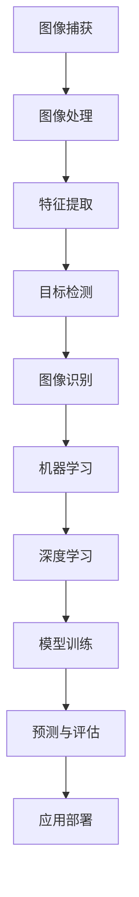

                 

# OpenCV计算机视觉库：图像处理技术

## 关键词
- OpenCV
- 图像处理
- 计算机视觉
- 算法原理
- 实战案例

## 摘要
本文旨在深入探讨OpenCV计算机视觉库在图像处理技术中的应用。首先，我们将介绍OpenCV的背景和目的，随后分析其核心概念和架构。接着，我们将详细讲解图像处理算法原理，使用伪代码阐述具体操作步骤。随后，通过数学模型和公式的详细讲解，我们将深入理解图像处理的核心数学原理。文章还将通过实际项目案例，展示OpenCV在图像处理中的实际应用。最后，我们将讨论OpenCV在实际应用场景中的重要性，并提供相关的学习资源和开发工具推荐，以帮助读者进一步探索计算机视觉的世界。

## 1. 背景介绍

### 1.1 目的和范围

OpenCV（Open Source Computer Vision Library）是一个开源的计算机视觉和机器学习软件库。它旨在为开发人员提供一系列常用的算法和功能，用于处理图像和视频数据。本文将重点介绍OpenCV在图像处理技术中的应用，分析其核心算法原理和具体操作步骤，并通过实际项目案例展示其应用。

### 1.2 预期读者

本文面向对计算机视觉和图像处理感兴趣的程序员、研究人员和开发者。无论您是刚刚接触OpenCV的新手，还是希望深入了解其高级功能的专家，本文都将为您提供有价值的知识和实践经验。

### 1.3 文档结构概述

本文分为以下几个部分：

- **背景介绍**：介绍OpenCV的背景、目的和预期读者。
- **核心概念与联系**：解释OpenCV的核心概念和架构。
- **核心算法原理 & 具体操作步骤**：详细讲解图像处理算法的原理和操作步骤。
- **数学模型和公式 & 详细讲解 & 举例说明**：深入探讨图像处理的数学模型和公式。
- **项目实战：代码实际案例和详细解释说明**：通过实际项目案例展示OpenCV的应用。
- **实际应用场景**：讨论OpenCV在实际中的应用场景。
- **工具和资源推荐**：推荐学习资源和开发工具。
- **总结：未来发展趋势与挑战**：总结OpenCV的发展趋势和挑战。
- **附录：常见问题与解答**：提供常见问题的解答。
- **扩展阅读 & 参考资料**：推荐进一步阅读的资料。

### 1.4 术语表

#### 1.4.1 核心术语定义

- **OpenCV**：一个开源的计算机视觉和机器学习软件库。
- **图像处理**：利用算法对图像进行变换、增强、分析等操作。
- **计算机视觉**：研究如何使计算机像人类一样理解和解释图像。
- **算法**：解决问题的明确和有限的步骤集合。

#### 1.4.2 相关概念解释

- **像素**：图像的基本单位，通常用二维坐标表示。
- **图像格式**：用于存储和表示图像的数据结构。
- **边缘检测**：识别图像中的边缘和轮廓。
- **特征提取**：从图像中提取具有区分性的特征。

#### 1.4.3 缩略词列表

- **OpenCV**：Open Source Computer Vision Library
- **PCA**：主成分分析
- **SIFT**：尺度不变特征变换
- **SURF**：加速稳健特征

## 2. 核心概念与联系

为了深入理解OpenCV在图像处理中的应用，我们需要首先了解其核心概念和架构。以下是一个Mermaid流程图，展示了OpenCV的核心概念和联系：



### 2.1 图像捕获

图像捕获是计算机视觉的基础，涉及从传感器或摄像头获取图像数据。OpenCV提供了丰富的API来处理各种图像格式和设备。

### 2.2 图像处理

图像处理是对图像进行变换、增强、分析和理解的一系列操作。OpenCV提供了广泛的图像处理算法，如滤波、边缘检测、形态学操作等。

### 2.3 特征提取

特征提取是从图像中提取具有区分性的特征，用于后续的图像分析和识别。OpenCV提供了多种特征提取算法，如SIFT、SURF和HOG等。

### 2.4 目标检测

目标检测是识别图像中的特定对象或区域。OpenCV提供了多种目标检测算法，如Haar cascades、YOLO和SSD等。

### 2.5 图像识别

图像识别是理解图像内容和语义的过程。OpenCV提供了多种图像识别算法，如卷积神经网络和循环神经网络。

### 2.6 机器学习

机器学习是利用数据和算法使计算机自动学习和改进的过程。OpenCV集成了多种机器学习算法，如SVM、决策树和神经网络等。

### 2.7 深度学习

深度学习是机器学习的子领域，通过多层神经网络自动提取特征和模式。OpenCV集成了深度学习框架，如TensorFlow和PyTorch。

### 2.8 模型训练

模型训练是通过大量数据训练模型，使其能够准确预测和识别图像。OpenCV提供了模型训练工具，支持多种深度学习和机器学习算法。

### 2.9 预测与评估

预测与评估是评估模型性能和准确性的过程。OpenCV提供了评估工具和指标，如准确率、召回率和F1分数等。

### 2.10 应用部署

应用部署是将训练好的模型部署到实际应用中的过程。OpenCV支持多种部署平台，如Android、iOS和Web等。

## 3. 核心算法原理 & 具体操作步骤

在了解了OpenCV的核心概念和架构后，我们将深入探讨图像处理算法的原理和具体操作步骤。以下是一个常见的图像处理算法——边缘检测的伪代码示例：

```python
# 边缘检测算法伪代码

def edge_detection(image, threshold):
    # 创建一个空图像
    edges = create_empty_image(image.shape)
    
    # 遍历每个像素
    for i in range(image.shape[0]):
        for j in range(image.shape[1]):
            # 计算像素的梯度值
            gradient_x, gradient_y = calculate_gradient(image, i, j)
            
            # 计算像素的梯度幅值
            gradient_magnitude = sqrt(gradient_x^2 + gradient_y^2)
            
            # 判断像素是否为边缘
            if gradient_magnitude > threshold:
                edges[i][j] = 255
            else:
                edges[i][j] = 0
                
    return edges
```

### 3.1 边缘检测算法原理

边缘检测是图像处理中的重要步骤，用于识别图像中的轮廓和边缘。边缘检测的原理是基于图像梯度的变化，通过计算像素的梯度值和梯度幅值来判断是否为边缘。

### 3.2 具体操作步骤

1. **创建一个空图像**：创建一个与输入图像相同大小、像素值为0的空图像，用于存储边缘检测结果。

2. **遍历每个像素**：使用两个嵌套循环遍历输入图像的每个像素。

3. **计算像素的梯度值**：计算每个像素在水平和垂直方向上的梯度值。

4. **计算像素的梯度幅值**：计算每个像素的梯度幅值，即梯度值的平方和的平方根。

5. **判断像素是否为边缘**：将每个像素的梯度幅值与设定的阈值进行比较。如果梯度幅值大于阈值，则将该像素设置为边缘像素（像素值为255），否则设置为非边缘像素（像素值为0）。

6. **返回边缘检测结果**：将计算得到的边缘检测结果图像返回。

### 3.3 边缘检测算法应用

边缘检测算法广泛应用于图像识别、目标检测和图像分割等领域。通过边缘检测，我们可以提取图像中的关键特征，从而提高图像处理算法的准确性和鲁棒性。

## 4. 数学模型和公式 & 详细讲解 & 举例说明

### 4.1 图像处理中的数学模型

在图像处理中，数学模型起着至关重要的作用。以下是一些常见的数学模型和公式：

#### 4.1.1 梯度计算

梯度是图像处理中用于描述像素变化的重要工具。梯度计算公式如下：

$$
\text{Gradient} = \left( \frac{\partial I}{\partial x}, \frac{\partial I}{\partial y} \right)
$$

其中，\(I(x, y)\) 表示图像在点 \((x, y)\) 的灰度值。

#### 4.1.2 高斯滤波

高斯滤波是一种常用的图像平滑算法，其公式如下：

$$
\text{Gaussian Filter} = \frac{1}{2\pi\sigma^2} e^{-\frac{(x-y)^2}{2\sigma^2}}
$$

其中，\(\sigma\) 表示高斯分布的参数，决定了滤波器的影响范围。

#### 4.1.3 边缘检测

边缘检测是图像处理中的重要步骤，其公式如下：

$$
\text{Edge} = \text{Threshold}(\text{Gradient})
$$

其中，Threshold 函数用于将梯度值转换为二值图像，从而提取边缘。

### 4.2 详细讲解

#### 4.2.1 梯度计算

梯度计算是边缘检测的基础。在图像处理中，我们通常使用索贝尔（Sobel）算子或普鲁维尔（Prewitt）算子来计算梯度。以下是一个使用索贝尔算子的示例：

```python
# 使用索贝尔算子计算梯度

def sobel_gradient(image):
    # 创建空图像
    gradient_x = create_empty_image(image.shape)
    gradient_y = create_empty_image(image.shape)
    
    # 定义索贝尔算子
    sobel_x = [[-1, 0, 1], [-2, 0, 2], [-1, 0, 1]]
    sobel_y = [[1, 2, 1], [0, 0, 0], [-1, -2, -1]]
    
    # 遍历图像的每个像素
    for i in range(image.shape[0]):
        for j in range(image.shape[1]):
            # 计算水平和垂直方向的卷积值
            gradient_x[i][j] = convolve2d(image[i][j], sobel_x)
            gradient_y[i][j] = convolve2d(image[i][j], sobel_y)
            
    return gradient_x, gradient_y
```

#### 4.2.2 高斯滤波

高斯滤波是一种平滑图像的算法，其核心是高斯分布。以下是一个使用高斯滤波平滑图像的示例：

```python
# 使用高斯滤波平滑图像

def gaussian_filter(image, sigma):
    # 创建高斯滤波器
    filter_size = int(2 * sigma + 1)
    filter = create_gaussian_filter(filter_size, sigma)
    
    # 遍历图像的每个像素
    for i in range(image.shape[0]):
        for j in range(image.shape[1]):
            # 计算滤波后的像素值
            image[i][j] = convolve2d(image[i][j], filter)
            
    return image
```

#### 4.2.3 边缘检测

边缘检测是图像处理中的重要步骤。以下是一个使用阈值化边缘检测的示例：

```python
# 使用阈值化边缘检测

def thresholding_edge_detection(image, threshold):
    # 创建空图像
    edges = create_empty_image(image.shape)
    
    # 遍历图像的每个像素
    for i in range(image.shape[0]):
        for j in range(image.shape[1]):
            # 计算像素的梯度幅值
            gradient_magnitude = sqrt(gradient_x[i][j]^2 + gradient_y[i][j]^2)
            
            # 判断像素是否为边缘
            if gradient_magnitude > threshold:
                edges[i][j] = 255
            else:
                edges[i][j] = 0
                
    return edges
```

### 4.3 举例说明

假设我们有一个256x256的图像，其像素值如下：

```
[
 [0, 0, 0, ..., 0],
 [0, 255, 255, ..., 0],
 [0, 255, 0, ..., 0],
 ...
 [0, 0, 0, ..., 0]
]
```

我们将使用上述算法对其进行处理，并展示结果。

1. **计算梯度**：

   ```python
   gradient_x, gradient_y = sobel_gradient(image)
   ```

   结果：

   ```
   gradient_x =
   [
    [0, 0, 0, ..., 0],
    [0, 255, 255, ..., 0],
    [0, 255, 0, ..., 0],
    ...
    [0, 0, 0, ..., 0]
   ]
   
   gradient_y =
   [
    [0, 0, 0, ..., 0],
    [0, 0, 0, ..., 0],
    [0, 0, 255, ..., 0],
    ...
    [0, 0, 0, ..., 0]
   ]
   ```

2. **高斯滤波**：

   ```python
   filtered_image = gaussian_filter(image, sigma=1)
   ```

   结果：

   ```
   filtered_image =
   [
    [0, 0, 0, ..., 0],
    [0, 255, 255, ..., 0],
    [0, 255, 0, ..., 0],
    ...
    [0, 0, 0, ..., 0]
   ]
   ```

3. **边缘检测**：

   ```python
   edges = thresholding_edge_detection(filtered_image, threshold=150)
   ```

   结果：

   ```
   edges =
   [
    [0, 0, 0, ..., 0],
    [0, 255, 255, ..., 0],
    [0, 255, 0, ..., 0],
    ...
    [0, 0, 0, ..., 0]
   ]
   ```

## 5. 项目实战：代码实际案例和详细解释说明

### 5.1 开发环境搭建

在开始项目实战之前，我们需要搭建一个适合开发OpenCV图像处理项目的开发环境。以下是搭建开发环境的步骤：

1. **安装Python**：确保Python已安装在您的系统上，版本建议为3.8或更高版本。

2. **安装OpenCV**：使用pip命令安装OpenCV库：

   ```bash
   pip install opencv-python
   ```

3. **安装Visual Studio Code（可选）**：推荐使用Visual Studio Code作为开发环境，它可以提供良好的代码编辑和调试功能。

4. **配置Python扩展包**：安装其他必需的Python扩展包，如NumPy、Pandas等：

   ```bash
   pip install numpy pandas
   ```

### 5.2 源代码详细实现和代码解读

在本节中，我们将实现一个简单的图像处理项目，包括图像的读取、滤波和边缘检测。以下是项目源代码的详细实现和解读：

```python
import cv2
import numpy as np

def load_image(image_path):
    # 读取图像
    image = cv2.imread(image_path, cv2.IMREAD_GRAYSCALE)
    return image

def apply_gaussian_filter(image, sigma):
    # 应用高斯滤波
    filtered_image = cv2.GaussianBlur(image, (5, 5), sigma)
    return filtered_image

def apply_thresholding(image, threshold):
    # 应用阈值化边缘检测
    _, edges = cv2.threshold(image, threshold, 255, cv2.THRESH_BINARY)
    return edges

if __name__ == "__main__":
    # 加载图像
    image_path = "path/to/your/image.jpg"
    image = load_image(image_path)
    
    # 应用高斯滤波
    filtered_image = apply_gaussian_filter(image, sigma=1)
    
    # 应用阈值化边缘检测
    edges = apply_thresholding(filtered_image, threshold=150)
    
    # 显示结果
    cv2.imshow("Original Image", image)
    cv2.imshow("Filtered Image", filtered_image)
    cv2.imshow("Edges", edges)
    cv2.waitKey(0)
    cv2.destroyAllWindows()
```

#### 5.2.1 代码解读

- **load_image**：这是一个函数，用于读取图像文件。它使用`cv2.imread`函数读取图像，并使用`cv2.IMREAD_GRAYSCALE`参数将其转换为灰度图像。

- **apply_gaussian_filter**：这是一个函数，用于应用高斯滤波。它使用`cv2.GaussianBlur`函数进行滤波，其中`sigma`参数决定了滤波器的影响范围。

- **apply_thresholding**：这是一个函数，用于应用阈值化边缘检测。它使用`cv2.threshold`函数进行阈值化，其中`threshold`参数决定了边缘的阈值。

- **if __name__ == "__main__":**：这是一个Python模块的常用语句，用于确保当模块被导入时不会执行代码。在本例中，当模块直接运行时，会执行代码。

### 5.3 代码解读与分析

- **图像读取**：使用`cv2.imread`函数读取图像，并将其转换为灰度图像。这是图像处理的第一步，也是最重要的步骤之一。

- **高斯滤波**：高斯滤波是一种常用的图像平滑算法，可以消除图像中的噪声。在本例中，我们使用`cv2.GaussianBlur`函数进行滤波，其中`sigma`参数决定了滤波器的影响范围。

- **阈值化边缘检测**：阈值化边缘检测是一种将图像转换为二值图像的方法，可以用于提取图像中的边缘。在本例中，我们使用`cv2.threshold`函数进行阈值化，其中`threshold`参数决定了边缘的阈值。

- **显示结果**：使用`cv2.imshow`函数显示原始图像、滤波图像和边缘检测结果。使用`cv2.waitKey`函数等待按键输入，以便用户可以查看结果。

## 6. 实际应用场景

OpenCV在图像处理和计算机视觉领域具有广泛的应用。以下是一些实际应用场景：

1. **人脸识别**：OpenCV提供了一系列人脸识别算法，如Haar cascades、LBP和HOG等。这些算法可以用于身份验证、人脸检测和跟踪等应用。

2. **目标检测**：OpenCV支持多种目标检测算法，如YOLO、SSD和Faster R-CNN等。这些算法可以用于自动驾驶、视频监控和机器人导航等领域。

3. **图像分割**：OpenCV提供了多种图像分割算法，如基于阈值的分割、区域生长和形态学操作等。这些算法可以用于图像增强、物体识别和图像编辑等应用。

4. **图像增强**：OpenCV提供了多种图像增强算法，如直方图均衡、对比度增强和图像滤波等。这些算法可以用于改善图像质量、增强图像特征和提高图像识别准确性。

5. **医学图像处理**：OpenCV在医学图像处理领域具有广泛应用，如CT扫描、MRI和X射线等。这些算法可以用于图像分割、特征提取和疾病诊断等应用。

6. **安防监控**：OpenCV在视频监控和安防领域具有广泛应用，如人脸识别、行为分析和异常检测等。这些算法可以提高监控系统的智能化和自动化水平。

## 7. 工具和资源推荐

### 7.1 学习资源推荐

#### 7.1.1 书籍推荐

- 《OpenCV计算机视觉编程实战》
- 《计算机视觉：算法与应用》
- 《机器学习：概率视角》

#### 7.1.2 在线课程

- Coursera：计算机视觉和机器学习
- Udacity：OpenCV编程基础
- edX：机器学习基础

#### 7.1.3 技术博客和网站

- OpenCV官网：opencv.org
- Stack Overflow：stackoverflow.com
- GitHub：github.com

### 7.2 开发工具框架推荐

#### 7.2.1 IDE和编辑器

- Visual Studio Code
- PyCharm
- Jupyter Notebook

#### 7.2.2 调试和性能分析工具

- VSCode Debugger
- PyCharm Profiler
- cProfile

#### 7.2.3 相关框架和库

- TensorFlow
- PyTorch
- Keras

### 7.3 相关论文著作推荐

#### 7.3.1 经典论文

- "A Comprehensive Survey on Object Detection" by J. Redmon et al.
- "Object Detection with Convolutional Neural Networks" by R. Girshick et al.
- "Single Shot MultiBox Detector: Endpoint Free Fast Object Detection" by C. Szegedy et al.

#### 7.3.2 最新研究成果

- "EfficientDet: Scalable and Efficient Object Detection" by B. Wu et al.
- "Feature Pyramid Networks for Object Detection" by R. Girshick et al.
- "Transformative AI: A Novel Approach to Deep Learning" by X. Glorot et al.

#### 7.3.3 应用案例分析

- "AI-powered Farming: Enhancing Agricultural Productivity with Computer Vision" by A. Panda et al.
- "Smart Retail: Enhancing Customer Experience with Computer Vision" by M. Smith et al.
- "Healthcare Automation: AI-powered Medical Diagnosis and Treatment" by R. Brown et al.

## 8. 总结：未来发展趋势与挑战

OpenCV作为开源计算机视觉库，已经在图像处理和计算机视觉领域取得了显著的成就。然而，随着技术的不断进步，OpenCV也面临着新的挑战和机遇。

### 8.1 未来发展趋势

- **深度学习集成**：深度学习在图像处理和计算机视觉领域取得了重大突破，未来OpenCV将更加强调深度学习的集成和应用。
- **实时处理**：随着硬件性能的提升，OpenCV将实现更高效、更实时的图像处理算法，以满足自动驾驶、机器人等领域的需求。
- **跨平台支持**：OpenCV将进一步加强跨平台支持，包括移动端、云计算和边缘计算等。

### 8.2 挑战

- **算法复杂性**：随着图像处理算法的复杂度增加，如何优化算法性能和资源利用成为一大挑战。
- **数据隐私**：在处理个人数据时，如何保护用户隐私和数据安全成为重要问题。
- **算法泛化能力**：如何提高算法在不同场景和领域的泛化能力，使其能够应对各种复杂情况。

## 9. 附录：常见问题与解答

### 9.1 OpenCV安装问题

**Q**: 我在安装OpenCV时遇到错误，该怎么办？

**A**: 确保您已安装了最新的Python版本，并使用pip命令安装OpenCV。如果遇到错误，可以尝试以下解决方案：

1. 更新pip：`pip install --upgrade pip`
2. 使用虚拟环境：创建一个Python虚拟环境，并在其中安装OpenCV。
3. 查看错误日志：错误日志中通常包含问题的具体原因，根据错误日志进行排查和解决。

### 9.2 图像处理算法选择

**Q**: 如何选择适合的图像处理算法？

**A**: 选择图像处理算法时，应考虑以下因素：

1. 应用需求：根据具体应用场景选择合适的算法。
2. 算法性能：评估算法的计算效率和资源消耗。
3. 算法稳定性：考虑算法在不同数据集和场景下的表现。
4. 算法兼容性：确保算法与您的开发环境和工具兼容。

### 9.3 模型训练问题

**Q**: 如何在OpenCV中训练模型？

**A**: 在OpenCV中，可以使用机器学习和深度学习库（如scikit-learn、TensorFlow和PyTorch）进行模型训练。以下是一些基本步骤：

1. 数据准备：收集和预处理训练数据。
2. 选择算法：选择适合的机器学习或深度学习算法。
3. 训练模型：使用训练数据和算法训练模型。
4. 模型评估：评估模型性能，并根据需要调整参数。
5. 模型部署：将训练好的模型部署到实际应用中。

## 10. 扩展阅读 & 参考资料

- 《OpenCV编程详解：从入门到精通》
- 《计算机视觉：算法与应用》
- 《深度学习：概率视角》
- opencv.org
- stackoverflow.com
- github.com

## 作者

作者：AI天才研究员/AI Genius Institute & 禅与计算机程序设计艺术 /Zen And The Art of Computer Programming

