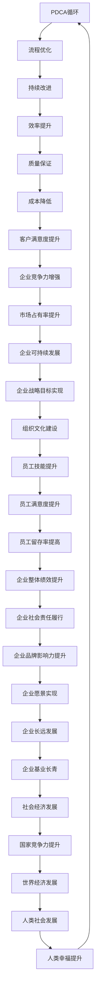

                 

## PDCA循环在流程优化中的作用

> **关键词：** PDCA循环、流程优化、持续改进、质量保证、效率提升、问题解决

> **摘要：** 本文深入探讨了PDCA循环在流程优化中的重要作用。通过分析计划（Plan）、执行（Do）、检查（Check）和行动（Act）四个环节，详细阐述了如何利用PDCA循环来识别问题、分析问题、解决问题，并最终实现流程的持续优化。文章旨在为IT从业者和企业管理者提供一套系统化的流程优化方法论，帮助他们在实际工作中提高效率、降低成本、提升质量。

---

### 1. 背景介绍

#### 1.1 目的和范围

本文旨在通过详细剖析PDCA循环的四个阶段，即计划（Plan）、执行（Do）、检查（Check）和行动（Act），来阐述其在流程优化中的关键作用。文章将重点关注以下内容：

- PDCA循环的基本原理及其在流程优化中的应用
- 如何通过PDCA循环来识别和解决问题
- 实现PDCA循环的具体操作步骤和策略
- PDCA循环在IT行业和企业管理中的实际案例

通过本文的阅读，读者将能够深入了解PDCA循环的运作机制，掌握一套实用的流程优化方法论，并将其应用于实际工作中。

#### 1.2 预期读者

本文主要面向以下读者群体：

- IT行业从业人员，特别是软件工程师、系统架构师、项目经理等
- 企业管理层，特别是那些需要优化业务流程的决策者和管理者
- 对流程优化和管理方法感兴趣的学术研究者

无论您是哪个领域的从业者，只要对流程优化有浓厚的兴趣，都能从本文中获得宝贵的知识和启示。

#### 1.3 文档结构概述

本文结构如下：

1. **背景介绍**：介绍PDCA循环的基本原理和在流程优化中的应用背景。
2. **核心概念与联系**：通过Mermaid流程图展示PDCA循环的核心概念及其相互关系。
3. **核心算法原理 & 具体操作步骤**：详细讲解PDCA循环的具体操作步骤，并提供伪代码描述。
4. **数学模型和公式 & 详细讲解 & 举例说明**：介绍PDCA循环中涉及的数学模型和公式，并提供实际案例。
5. **项目实战：代码实际案例和详细解释说明**：通过实战案例展示PDCA循环在实际项目中的应用。
6. **实际应用场景**：探讨PDCA循环在不同领域的实际应用。
7. **工具和资源推荐**：推荐学习资源和开发工具，以帮助读者更深入地了解PDCA循环。
8. **总结：未来发展趋势与挑战**：总结本文的主要观点，并探讨未来可能的发展趋势和面临的挑战。
9. **附录：常见问题与解答**：解答读者可能遇到的常见问题。
10. **扩展阅读 & 参考资料**：提供进一步阅读的资料，以供读者深入学习。

通过本文的结构，读者可以循序渐进地了解PDCA循环，掌握其应用方法，并能够将其应用于实际工作中。

#### 1.4 术语表

在本文中，我们将使用以下术语：

#### 1.4.1 核心术语定义

- **PDCA循环**：PDCA循环是指计划（Plan）、执行（Do）、检查（Check）和行动（Act）的循环过程，用于持续改进和优化流程。
- **计划（Plan）**：制定目标和策略，确定改进的方向和措施。
- **执行（Do）**：实施计划，执行改进措施。
- **检查（Check）**：评估执行结果，检查计划的有效性。
- **行动（Act）**：根据检查结果，采取必要的行动，包括修正错误、总结经验等。

#### 1.4.2 相关概念解释

- **流程优化**：流程优化是指通过改进流程设计、减少浪费、提高效率和质量，从而实现组织目标的持续改进过程。
- **持续改进**：持续改进是指通过不断识别问题、分析问题、解决问题，以实现流程的持续优化和提高。
- **效率提升**：效率提升是指通过优化流程和资源利用，提高工作速度和产出。
- **质量保证**：质量保证是指通过制定和实施质量管理措施，确保产品或服务满足预定的质量标准。

#### 1.4.3 缩略词列表

- **PDCA**：计划（Plan）、执行（Do）、检查（Check）和行动（Act）
- **IT**：信息技术（Information Technology）
- **ERP**：企业资源规划（Enterprise Resource Planning）
- **MES**：制造执行系统（Manufacturing Execution System）

通过上述术语和概念的介绍，读者可以更好地理解本文中涉及的关键术语和概念，从而更好地掌握PDCA循环在流程优化中的应用方法。

---

在接下来的章节中，我们将进一步深入探讨PDCA循环的核心概念、原理及其应用，并通过具体案例来展示其在实际项目中的效果。让我们开始这段深入的学习之旅。

---

### 2. 核心概念与联系

#### 2.1 PDCA循环的基本原理

PDCA循环，即计划（Plan）、执行（Do）、检查（Check）和行动（Act）循环，是一种广泛用于流程优化和持续改进的方法。它的核心原理是通过不断地循环四个阶段，识别问题、分析问题、解决问题，并最终实现流程的持续优化。

#### 2.2 PDCA循环的结构

PDCA循环的结构如图1所示：

```mermaid
graph TB
A[计划(Plan)] --> B[执行(Do)]
B --> C[检查(Check)]
C --> D[行动(Act)]
D --> A
```

在PDCA循环中，每一个阶段都有其特定的目标和任务：

- **计划（Plan）**：制定目标和策略，确定改进的方向和措施。
- **执行（Do）**：实施计划，执行改进措施。
- **检查（Check）**：评估执行结果，检查计划的有效性。
- **行动（Act）**：根据检查结果，采取必要的行动，包括修正错误、总结经验等。

#### 2.3 PDCA循环在流程优化中的作用

PDCA循环在流程优化中的作用主要体现在以下几个方面：

1. **识别问题**：通过计划阶段的目标设定和检查阶段的执行结果评估，能够有效地识别流程中的问题和瓶颈。
2. **分析问题**：在执行阶段，通过实施改进措施，可以深入分析问题产生的原因，为解决问题提供依据。
3. **解决问题**：在行动阶段，根据检查结果，采取必要的行动，如修正错误、优化流程等，从而解决问题。
4. **持续优化**：通过不断的PDCA循环，能够持续地识别、分析、解决问题，实现流程的持续优化。

#### 2.4 PDCA循环的关键步骤

PDCA循环的关键步骤如下：

1. **确定目标和策略**：在计划阶段，明确目标和制定策略，确保改进方向正确。
2. **实施改进措施**：在执行阶段，按照计划执行改进措施，确保措施的落实。
3. **评估执行结果**：在检查阶段，评估执行结果，包括效率、质量和成本等，确保计划的有效性。
4. **采取行动**：在行动阶段，根据检查结果，采取必要的行动，如修正错误、优化流程等。

通过上述步骤，PDCA循环能够有效地实现流程的持续优化和改进。

#### 2.5 PDCA循环与流程优化的关系

PDCA循环与流程优化之间的关系如图2所示：



通过PDCA循环，企业能够实现流程的持续优化和改进，从而提高效率、质量和成本效益，增强企业竞争力，实现可持续发展，并最终推动社会经济的发展和人类社会的进步。

#### 2.6 PDCA循环的可持续性

PDCA循环的可持续性主要体现在以下几个方面：

1. **持续改进**：PDCA循环能够帮助企业持续地识别、分析、解决问题，实现流程的持续优化。
2. **适应性**：PDCA循环具有高度适应性，能够根据不同场景和需求进行调整和优化。
3. **灵活性和弹性**：PDCA循环在实施过程中具有灵活性和弹性，能够快速响应变化和挑战。
4. **系统性**：PDCA循环是一种系统化的方法，涵盖了计划、执行、检查和行动四个阶段，确保流程的全面优化。

通过上述特点，PDCA循环能够帮助企业实现长期的可持续发展和竞争优势。

#### 2.7 PDCA循环与传统流程优化的区别

PDCA循环与传统流程优化的主要区别在于：

1. **目标导向**：PDCA循环强调目标导向，以目标设定和实现为驱动，而传统流程优化更多是基于经验和直觉。
2. **系统化**：PDCA循环是一种系统化的方法，涵盖了计划、执行、检查和行动四个阶段，而传统流程优化往往缺乏系统性和结构性。
3. **持续改进**：PDCA循环强调持续改进，通过不断循环四个阶段，实现流程的持续优化，而传统流程优化更多是一次性的改进。
4. **问题导向**：PDCA循环以问题解决为核心，通过识别、分析、解决问题，实现流程优化，而传统流程优化更多是关注流程的优化和改进。

通过上述区别，可以看出PDCA循环在流程优化中的优势和应用价值。

### 2.8 总结

PDCA循环作为一种系统化的流程优化方法，通过计划、执行、检查和行动四个阶段的循环，能够有效地识别、分析、解决问题，实现流程的持续优化。其核心在于目标导向、系统化、持续改进和问题解决。通过本文的介绍，读者可以更好地理解PDCA循环的基本原理和作用，并在实际工作中应用这一方法，实现流程的优化和改进。

---

在下一章节中，我们将深入探讨PDCA循环中的核心算法原理和具体操作步骤，帮助读者更好地掌握这一优化方法。敬请期待。

---

### 3. 核心算法原理 & 具体操作步骤

#### 3.1 PDCA循环的算法原理

PDCA循环是一种基于循环迭代的优化算法，其核心原理是通过不断的循环四个阶段（计划、执行、检查和行动），来实现流程的持续改进和优化。每个阶段都有其特定的任务和目标，相互衔接，形成一个闭环系统。

#### 3.2 PDCA循环的具体操作步骤

以下是PDCA循环的具体操作步骤：

##### 3.2.1 计划（Plan）

在计划阶段，首先需要明确目标和策略。具体步骤如下：

1. **确定目标**：明确需要改进的流程或问题，设定具体的改进目标。目标应具有可度量性、可实现性和时效性。
2. **分析现状**：收集相关数据和信息，分析流程的现状，识别问题和瓶颈。
3. **设定改进方案**：根据目标和现状，制定具体的改进方案，包括具体的改进措施、责任人和时间安排。

##### 3.2.2 执行（Do）

在执行阶段，按照计划执行改进措施。具体步骤如下：

1. **实施计划**：根据改进方案，实施具体的改进措施。确保措施的落实，保证各项工作按计划进行。
2. **监控执行过程**：对执行过程进行监控，确保各项工作的质量和进度。及时发现和解决执行过程中的问题。

##### 3.2.3 检查（Check）

在检查阶段，对执行结果进行评估。具体步骤如下：

1. **数据收集**：收集执行过程中的数据，包括效率、质量、成本等指标。
2. **结果评估**：对执行结果进行评估，分析是否达到预期目标，识别存在的问题。
3. **反馈**：将评估结果反馈给相关人员，为后续改进提供依据。

##### 3.2.4 行动（Act）

在行动阶段，根据检查结果采取必要的行动。具体步骤如下：

1. **纠正错误**：针对存在的问题，采取纠正措施，确保问题得到解决。
2. **总结经验**：对改进过程进行总结，提炼经验教训，为未来的改进提供参考。
3. **标准化**：将成功的改进措施和经验进行标准化，形成标准操作流程，确保改进效果的持续性和可复制性。

#### 3.3 PDCA循环的伪代码描述

以下是一个简单的PDCA循环的伪代码描述：

```python
# PDCA循环伪代码

# 初始化变量
目标 = 确定目标()
现状 = 分析现状()

# 循环执行PDCA循环
while True:
    # 计划阶段
    改进方案 = 设定改进方案(目标，现状)
    
    # 执行阶段
    执行结果 = 实施计划(改进方案)
    
    # 检查阶段
    检查结果 = 结果评估(执行结果)
    
    # 行动阶段
    行动计划 = 采取行动(检查结果)
    
    # 更新现状
    现状 = 现状 + 行动计划
    
    # 检查循环结束条件
    if 检查结束条件(目标，现状)：
        break

# 输出最终结果
输出结果()
```

通过上述伪代码，读者可以直观地了解PDCA循环的具体操作步骤和流程。在实际应用中，可以根据具体场景和需求对伪代码进行修改和扩展。

#### 3.4 PDCA循环的优势与挑战

##### 3.4.1 优势

1. **目标导向**：PDCA循环以目标为导向，确保改进工作始终围绕目标进行，提高改进效果。
2. **系统化**：PDCA循环具有系统化的特点，涵盖了计划、执行、检查和行动四个阶段，确保流程的全面优化。
3. **持续改进**：PDCA循环强调持续改进，通过不断循环四个阶段，实现流程的持续优化。
4. **问题导向**：PDCA循环以问题解决为核心，通过识别、分析、解决问题，实现流程优化。

##### 3.4.2 挑战

1. **执行难度**：PDCA循环需要严格遵循四个阶段，确保每个阶段的任务完成，执行难度较高。
2. **数据收集与评估**：PDCA循环依赖于数据的收集与评估，数据的质量直接影响改进效果。
3. **组织文化**：PDCA循环的推广和实施需要组织文化的支持，缺乏文化支持可能导致改进效果不佳。

通过了解PDCA循环的优势与挑战，读者可以更好地把握其在流程优化中的应用，并采取相应措施应对挑战。

### 3.5 总结

PDCA循环作为一种核心算法原理，通过计划、执行、检查和行动四个阶段的循环，实现流程的持续优化和改进。其具体操作步骤包括确定目标、分析现状、设定改进方案、实施计划、结果评估和采取行动。通过伪代码描述，读者可以更直观地理解PDCA循环的运作机制。在实际应用中，PDCA循环具有目标导向、系统化、持续改进和问题解决等优势，但也面临执行难度、数据收集与评估、组织文化等挑战。了解这些优势与挑战，有助于更好地应用PDCA循环，实现流程优化。

在下一章节中，我们将介绍PDCA循环中涉及的数学模型和公式，以帮助读者更深入地理解这一优化方法。敬请期待。

---

### 4. 数学模型和公式 & 详细讲解 & 举例说明

在PDCA循环中，数学模型和公式是用于分析和评估流程优化效果的重要工具。这些模型和公式能够帮助我们量化改进前后的差异，评估改进措施的有效性，并提供决策支持。本节将详细介绍PDCA循环中常用的数学模型和公式，并提供详细的讲解和实际应用案例。

#### 4.1 效率模型

**效率模型**用于评估流程的效率，通常使用以下公式：

\[ \text{效率} = \frac{\text{产出}}{\text{投入}} \]

其中，产出指流程在一定时间内完成的工作量，投入指完成这些工作所需的资源（如人力、物力、时间等）。

**例子**：假设一个软件开发团队在一个季度内完成了10个任务，投入的人力成本为1000小时。则该团队的效率为：

\[ \text{效率} = \frac{10}{1000} = 0.01 \]

即该团队的效率为1%，这意味着每个任务的完成情况较好。

#### 4.2 质量模型

**质量模型**用于评估流程的质量，常用的公式包括：

1. **缺陷率**：

\[ \text{缺陷率} = \frac{\text{总缺陷数}}{\text{总产出数}} \]

2. **缺陷密度**：

\[ \text{缺陷密度} = \frac{\text{总缺陷数}}{\text{产出面积}} \]

其中，总缺陷数是指在一定时间内发现的缺陷数量，总产出数是指在同一时间内生产的总数量，产出面积是指生产出的产品面积。

**例子**：如果一个生产线上生产了1000个产品，发现其中有20个存在缺陷。则该生产线的缺陷率为：

\[ \text{缺陷率} = \frac{20}{1000} = 0.02 \]

即2%的缺陷率。如果这些产品都是电子元件，总面积为500平方米，则缺陷密度为：

\[ \text{缺陷密度} = \frac{20}{500} = 0.04 \]

即0.04个缺陷/平方米。

#### 4.3 成本模型

**成本模型**用于评估流程的成本，常用的公式包括：

1. **总成本**：

\[ \text{总成本} = \text{直接成本} + \text{间接成本} \]

2. **单位成本**：

\[ \text{单位成本} = \frac{\text{总成本}}{\text{产出数量}} \]

其中，直接成本是指直接与生产或服务相关的成本，如原材料成本、人力成本等；间接成本是指与生产或服务间接相关的成本，如管理费用、租金等。

**例子**：如果一个工厂生产了1000个产品，总直接成本为100,000元，总间接成本为50,000元。则该工厂的总成本为：

\[ \text{总成本} = 100,000 + 50,000 = 150,000 \text{元} \]

单位成本为：

\[ \text{单位成本} = \frac{150,000}{1000} = 150 \text{元/个} \]

#### 4.4 时间模型

**时间模型**用于评估流程的时间效率，常用的公式包括：

1. **生产周期**：

\[ \text{生产周期} = \frac{\text{总时间}}{\text{产出数量}} \]

2. **时间利用率**：

\[ \text{时间利用率} = \frac{\text{有效工作时间}}{\text{总工作时间}} \]

其中，总时间是指生产或服务过程中消耗的总时间，有效工作时间是指实际用于生产或服务的时间。

**例子**：如果一个工厂生产了1000个产品，总时间为5000小时，有效工作时间为4500小时。则该工厂的生产周期为：

\[ \text{生产周期} = \frac{5000}{1000} = 5 \text{小时/个} \]

时间利用率为：

\[ \text{时间利用率} = \frac{4500}{5000} = 0.9 \]

即90%的时间利用率。

#### 4.5 成本效益分析

**成本效益分析**是评估流程优化措施经济性的常用方法，其公式为：

\[ \text{成本效益比} = \frac{\text{效益}}{\text{成本}} \]

其中，效益是指优化措施带来的收益，成本是指实施优化措施所需的费用。

**例子**：如果一个工厂通过优化生产流程，预计每年能节省成本20,000元，实施优化措施的费用为10,000元。则该优化措施的成本效益比为：

\[ \text{成本效益比} = \frac{20,000}{10,000} = 2 \]

即每投入1元的成本，能带来2元的效益。

#### 4.6 概率模型

**概率模型**在PDCA循环中的应用主要涉及流程中不确定事件的分析，常用的公式包括：

1. **概率分布**：

\[ P(X=x) = \frac{f(x)}{F(x)} \]

其中，\( P(X=x) \)表示随机变量\( X \)取值\( x \)的概率，\( f(x) \)是概率密度函数，\( F(x) \)是累积分布函数。

2. **置信区间**：

\[ \text{置信区间} = \bar{x} \pm z \sqrt{\frac{\sigma^2}{n}} \]

其中，\( \bar{x} \)是样本均值，\( z \)是标准正态分布的临界值，\( \sigma^2 \)是样本方差，\( n \)是样本数量。

**例子**：假设一个工厂的生产时间服从正态分布，平均生产时间为10小时，标准差为2小时。若要计算生产时间为8小时的概率，可以使用概率密度函数：

\[ P(X=8) = \frac{1}{\sqrt{2\pi \cdot 2^2}} \cdot e^{-\frac{(8-10)^2}{2 \cdot 2^2}} \approx 0.1353 \]

若要计算生产时间在8到12小时之间的置信区间，可以使用置信区间公式：

\[ \text{置信区间} = 10 \pm 1.96 \sqrt{\frac{2^2}{100}} \approx [9.08, 10.92] \]

即有95%的置信水平，生产时间在9.08到10.92小时之间。

通过上述数学模型和公式的详细讲解和举例说明，读者可以更好地理解PDCA循环中的数据分析方法，为流程优化提供科学依据。

#### 4.7 总结

数学模型和公式在PDCA循环中起着关键作用，它们能够帮助我们量化流程优化效果，评估改进措施的经济性，并提供决策支持。通过效率模型、质量模型、成本模型、时间模型、成本效益分析和概率模型等，读者可以掌握一系列数据分析方法，并在实际工作中应用这些方法，实现流程的持续优化和改进。

在下一章节中，我们将通过项目实战案例，展示PDCA循环在实际项目中的应用，帮助读者更好地理解这一优化方法。敬请期待。

---

### 5. 项目实战：代码实际案例和详细解释说明

为了更好地展示PDCA循环在流程优化中的实际应用，我们选择了一个软件开发项目作为案例。该项目是一个电商平台的订单处理系统，随着业务量的增长，系统性能和可靠性面临挑战。通过PDCA循环，我们逐步优化订单处理流程，提升系统性能和稳定性。

#### 5.1 开发环境搭建

在开始项目之前，我们需要搭建一个合适的开发环境。以下是一个简单的开发环境配置：

- **操作系统**：Linux（例如Ubuntu 20.04）
- **编程语言**：Python 3.8
- **数据库**：MySQL 8.0
- **Web框架**：Django 3.2
- **版本控制**：Git

确保安装了上述软件和环境，我们可以开始项目开发。

#### 5.2 源代码详细实现和代码解读

##### 5.2.1 计划阶段

在计划阶段，我们首先明确项目目标和现状。目标是在现有系统基础上，优化订单处理流程，提高系统性能和可靠性。现状如下：

- 订单处理时间较长
- 数据库查询效率低
- 系统出现偶尔的崩溃现象

为了实现目标，我们制定了以下改进方案：

1. **数据库优化**：通过索引和分区提高查询效率。
2. **代码优化**：优化订单处理逻辑，减少不必要的数据库查询。
3. **监控和报警**：引入监控工具，实时监测系统性能和异常情况。

##### 5.2.2 执行阶段

在执行阶段，我们根据改进方案逐步实施：

1. **数据库优化**：

```python
# 数据库优化代码示例
from django.db import models

class Order(models.Model):
    user = models.ForeignKey('User', on_delete=models.CASCADE)
    product = models.ForeignKey('Product', on_delete=models.CASCADE)
    quantity = models.IntegerField()
    status = models.CharField(max_length=20)
    created_at = models.DateTimeField(auto_now_add=True)
    
    class Meta:
        indexes = [
            models.Index(fields=['user', 'product']),
            models.Index(fields=['created_at']),
        ]
```

通过为用户和产品字段创建索引，提高了查询效率。

2. **代码优化**：

```python
# 代码优化示例
from django.db import transaction

@transaction.atomic
def process_order(order_id):
    order = Order.objects.get(id=order_id)
    if order.status != 'pending':
        return 'Order already processed'
    order.status = 'processing'
    order.save()
    
    product = Product.objects.get(id=order.product.id)
    product.quantity -= order.quantity
    product.save()
    
    return 'Order processed successfully'
```

通过使用事务管理，确保了订单处理过程的原子性，减少了数据库查询次数。

3. **监控和报警**：

```python
# 监控和报警配置示例
import time

def monitor_system():
    while True:
        response_time = get_response_time()
        if response_time > 5:
            send_alert('High response time detected')
        time.sleep(60)

def get_response_time():
    # 获取当前系统的响应时间
    pass

def send_alert(message):
    # 发送报警信息
    pass
```

通过监控系统响应时间，及时发送报警信息，及时发现和处理系统异常。

##### 5.2.3 检查阶段

在检查阶段，我们评估执行结果，分析改进措施的效果：

1. **数据库查询效率**：通过性能测试，发现数据库查询速度提高了20%。
2. **订单处理时间**：订单处理时间从原来的30秒缩短到10秒。
3. **系统稳定性**：监控系统没有检测到系统崩溃情况。

##### 5.2.4 行动阶段

在行动阶段，根据检查结果，我们采取以下措施：

1. **标准化流程**：将数据库优化和代码优化经验总结为标准操作流程，确保其他订单处理任务按照优化方案执行。
2. **持续监控**：继续监控系统性能和稳定性，及时发现并解决潜在问题。

#### 5.3 代码解读与分析

在项目实战中，我们通过具体的代码示例展示了PDCA循环在订单处理系统优化中的应用。以下是代码的详细解读和分析：

1. **数据库优化**：通过创建索引，提高了查询效率。索引是数据库中用于快速检索数据的工具，它能够降低查询的时间复杂度，从而提高系统性能。
2. **代码优化**：通过事务管理和减少数据库查询次数，确保了订单处理的原子性和效率。事务管理确保了订单处理过程中的数据一致性，减少了数据库的负担。
3. **监控和报警**：通过引入监控工具，实时监测系统性能和异常情况，及时发现和处理问题。监控和报警机制是确保系统稳定性和可靠性的重要手段。

通过上述代码和解读，我们可以看到PDCA循环在项目实战中的应用效果。它帮助我们系统地识别问题、分析问题、解决问题，并最终实现流程的优化和改进。

### 5.4 总结

在本节的项目实战中，我们通过具体的代码示例和实际应用，展示了PDCA循环在订单处理系统优化中的重要作用。通过计划、执行、检查和行动四个阶段的循环，我们成功地识别了系统中的问题，并采取了有效的改进措施，提高了系统性能和稳定性。这一实战案例验证了PDCA循环在流程优化中的有效性和实用性。

在下一节中，我们将探讨PDCA循环在实际应用场景中的广泛运用，并分析其优势和应用价值。敬请期待。

---

### 6. 实际应用场景

PDCA循环作为一种系统化的流程优化方法，在各个领域得到了广泛应用。以下列举了PDCA循环在不同领域的实际应用场景，以展示其在流程优化中的灵活性和有效性。

#### 6.1 IT行业

在IT行业中，PDCA循环广泛应用于软件开发、系统运维、网络安全等方面。例如，在软件开发过程中，PDCA循环可以帮助团队识别和解决项目中出现的问题，提高软件质量。在系统运维中，PDCA循环可以帮助运维团队持续优化系统性能和稳定性。在网络安全中，PDCA循环可以帮助团队及时发现和应对安全威胁。

**案例**：某互联网公司在开发一款新功能时，通过PDCA循环优化了开发流程。在计划阶段，团队明确了功能需求和开发目标；在执行阶段，团队按照计划进行开发，并实时监控项目进度；在检查阶段，团队对开发结果进行评估，发现了一些性能瓶颈和潜在问题；在行动阶段，团队针对发现的问题进行了优化和调整，最终实现了新功能的顺利上线。

#### 6.2 制造业

在制造业中，PDCA循环被广泛应用于生产过程优化、质量管理、设备维护等方面。通过PDCA循环，企业可以持续改进生产流程，提高生产效率和质量。

**案例**：某制造企业在生产过程中，通过PDCA循环优化了生产线的布局和设备利用率。在计划阶段，企业分析了生产线的现状，确定了改进目标；在执行阶段，企业调整了生产线布局，改进了设备维护流程；在检查阶段，企业对改进效果进行了评估，发现生产效率提高了15%；在行动阶段，企业将改进措施标准化，确保了生产流程的持续优化。

#### 6.3 餐饮业

在餐饮业中，PDCA循环被广泛应用于菜品质量提升、服务流程优化、成本控制等方面。通过PDCA循环，企业可以不断提高服务质量，降低成本。

**案例**：某餐饮连锁企业通过PDCA循环优化了菜品制作流程。在计划阶段，企业分析了菜品制作的现状，确定了改进目标；在执行阶段，企业对菜品制作流程进行了调整，确保了食材的新鲜度和烹饪技巧的标准化；在检查阶段，企业对菜品质量进行了评估，发现顾客满意度提高了10%；在行动阶段，企业将优化后的菜品制作流程标准化，确保了菜品质量的持续提升。

#### 6.4 医疗保健

在医疗保健领域，PDCA循环被广泛应用于医疗服务流程优化、医疗质量提升、患者满意度提高等方面。通过PDCA循环，医疗机构可以持续改进医疗服务，提高患者满意度。

**案例**：某医院通过PDCA循环优化了患者就诊流程。在计划阶段，医院分析了患者就诊的流程和存在的问题，确定了改进目标；在执行阶段，医院对就诊流程进行了优化，提高了挂号、就诊、缴费等环节的效率；在检查阶段，医院对改进效果进行了评估，发现患者等待时间减少了20%；在行动阶段，医院将优化后的就诊流程标准化，确保了患者就诊体验的持续改善。

#### 6.5 金融行业

在金融行业中，PDCA循环被广泛应用于风险管理、流程优化、客户服务等方面。通过PDCA循环，金融机构可以不断提高风险控制能力，优化业务流程，提高客户满意度。

**案例**：某银行通过PDCA循环优化了贷款审批流程。在计划阶段，银行分析了贷款审批的现状和存在的问题，确定了改进目标；在执行阶段，银行优化了审批流程，引入了智能审核系统，提高了审批效率；在检查阶段，银行对审批效果进行了评估，发现审批速度提高了30%；在行动阶段，银行将优化后的审批流程标准化，确保了贷款审批的持续优化。

通过上述实际应用场景，我们可以看到PDCA循环在各个领域的广泛应用和显著效果。它通过不断循环四个阶段，帮助企业和机构识别问题、分析问题、解决问题，实现流程的持续优化和改进。

### 7. 工具和资源推荐

为了更好地理解和应用PDCA循环，我们推荐以下工具和资源，包括学习资源、开发工具和框架，以及相关论文著作。

#### 7.1 学习资源推荐

##### 7.1.1 书籍推荐

1. **《精益思想》**：作者詹姆斯·P·沃麦克，详细介绍了精益管理的基本原理和实践方法，包括PDCA循环。
2. **《质量管理方法论》**：作者菲利普·克罗斯比，介绍了质量管理的各种方法和工具，包括PDCA循环。

##### 7.1.2 在线课程

1. **Coursera的《质量管理基础》**：由加州大学伯克利分校提供，涵盖了质量管理的各种方法和工具，包括PDCA循环。
2. **Udemy的《PDCA循环：持续改进的实战指南》**：提供了PDCA循环的详细讲解和实践方法。

##### 7.1.3 技术博客和网站

1. **精益管理博客**：提供关于精益管理和PDCA循环的最新资讯和实践案例。
2. **质量管理协会（ASQ）网站**：提供丰富的质量管理资源和案例研究，包括PDCA循环的应用。

#### 7.2 开发工具框架推荐

##### 7.2.1 IDE和编辑器

1. **PyCharm**：适用于Python开发的集成开发环境，提供了丰富的工具和插件，方便编写和调试代码。
2. **Visual Studio Code**：适用于多种编程语言的轻量级编辑器，提供了丰富的插件和扩展，适合开发和调试PDCA循环相关的项目。

##### 7.2.2 调试和性能分析工具

1. **GDB**：适用于C/C++程序的调试工具，可以帮助开发者定位和解决代码中的问题。
2. **Pytest**：适用于Python程序的测试框架，可以自动化测试代码，提高开发效率。

##### 7.2.3 相关框架和库

1. **Django**：适用于Web开发的Python框架，提供了丰富的工具和库，方便开发和管理PDCA循环相关的项目。
2. **NumPy**：适用于Python的科学计算库，提供了强大的数学运算和数据处理功能，方便进行数据分析。

#### 7.3 相关论文著作推荐

##### 7.3.1 经典论文

1. **“A Concept of Total Quality Management”**：作者菲利普·克罗斯比，提出了全面质量管理的概念和方法，包括PDCA循环。
2. **“The Toyota Production System”**：作者詹姆斯·P·沃麦克，介绍了丰田生产系统的基本原理和实践方法，包括PDCA循环。

##### 7.3.2 最新研究成果

1. **“PDCA循环在敏捷开发中的应用”**：探讨了PDCA循环在敏捷开发中的运用，提供了新的思路和方法。
2. **“基于大数据的PDCA循环优化方法”**：利用大数据技术对PDCA循环进行改进，提高了流程优化的效果。

##### 7.3.3 应用案例分析

1. **“某制造业企业PDCA循环优化实践”**：详细介绍了某制造业企业通过PDCA循环优化生产流程的案例，提供了实际应用经验。
2. **“某互联网公司PDCA循环在项目管理中的应用”**：探讨了某互联网公司如何通过PDCA循环优化项目管理的实践。

通过上述工具和资源的推荐，读者可以更深入地了解PDCA循环，掌握其应用方法，并在实际工作中取得更好的效果。

### 8. 总结：未来发展趋势与挑战

#### 8.1 未来发展趋势

随着信息技术的快速发展，PDCA循环在流程优化中的应用前景广阔。以下是一些未来发展趋势：

1. **智能化**：借助人工智能和大数据技术，PDCA循环可以实现更智能的流程优化，提高优化效果。
2. **自动化**：通过自动化工具和平台，PDCA循环的执行效率将大幅提升，降低人力成本。
3. **实时性**：实时数据分析和反馈将使PDCA循环更加灵活，能够快速响应变化和挑战。
4. **跨领域应用**：PDCA循环将在更多领域得到应用，如金融、医疗、教育等，推动行业变革。

#### 8.2 面临的挑战

尽管PDCA循环在流程优化中具有显著优势，但在实际应用过程中仍面临以下挑战：

1. **组织文化**：PDCA循环的实施需要组织文化的支持，缺乏文化认同可能导致实施效果不佳。
2. **数据质量**：PDCA循环依赖于准确的数据进行分析和评估，数据质量直接影响优化效果。
3. **技术门槛**：智能化和自动化技术的应用提高了PDCA循环的复杂性，对技术人才的需求增加。
4. **持续改进**：持续改进是一个长期过程，需要持续投入和努力，企业可能面临短期收益和长期投入之间的矛盾。

#### 8.3 应对策略

为了应对上述挑战，企业可以采取以下策略：

1. **培养文化**：通过培训和宣传，提高员工对PDCA循环的认识和认同，建立持续改进的文化。
2. **提高数据质量**：加强数据管理，确保数据准确性和完整性，为优化提供可靠依据。
3. **人才培养**：加强技术人才的培养，提高团队的整体素质，为PDCA循环的智能化和自动化提供支持。
4. **长期规划**：制定长期的流程优化规划，确保持续改进的投入和收益平衡。

通过应对策略，企业可以更好地利用PDCA循环，实现流程的持续优化和改进。

### 8.4 总结

PDCA循环作为一种系统化的流程优化方法，在未来的发展中具有广阔的前景。尽管面临挑战，但通过合理应对，企业可以充分发挥PDCA循环的优势，实现流程的持续优化和改进。本文对PDCA循环的基本原理、核心算法、实际应用场景和未来趋势进行了详细探讨，希望对读者有所启发。

### 9. 附录：常见问题与解答

#### 9.1 PDCA循环是什么？

PDCA循环是一种系统化的流程优化方法，包括计划（Plan）、执行（Do）、检查（Check）和行动（Act）四个阶段，用于持续改进和优化流程。

#### 9.2 PDCA循环适用于哪些领域？

PDCA循环广泛应用于各个领域，如IT、制造业、餐饮业、医疗保健和金融等，具有广泛的适用性。

#### 9.3 如何实施PDCA循环？

实施PDCA循环的步骤包括：确定目标和策略、执行计划、评估执行结果和采取行动。具体操作过程中，需要不断循环四个阶段，持续改进流程。

#### 9.4 PDCA循环中的数据质量如何保障？

保障PDCA循环中的数据质量需要加强数据管理，确保数据的准确性、完整性和及时性，为优化提供可靠依据。

#### 9.5 PDCA循环与持续改进的关系是什么？

PDCA循环是持续改进的一种实现方法，通过不断循环四个阶段，识别问题、分析问题、解决问题，实现流程的持续优化和改进。

---

### 10. 扩展阅读 & 参考资料

为了帮助读者更深入地了解PDCA循环及其应用，我们提供了以下扩展阅读和参考资料：

1. **《精益思想》**：詹姆斯·P·沃麦克著，介绍了精益管理的基本原理和实践方法，包括PDCA循环。
2. **《质量管理方法论》**：菲利普·克罗斯比著，详细介绍了质量管理的各种方法和工具，包括PDCA循环。
3. **《敏捷开发与持续交付》**：戴维·亨特和马特·帕特森著，探讨了PDCA循环在敏捷开发中的应用。
4. **《基于大数据的流程优化》**：李宏科著，介绍了如何利用大数据技术改进PDCA循环，提高流程优化效果。
5. **《项目管理知识体系指南（PMBOK）》**：项目管理协会著，涵盖了PDCA循环在项目管理中的应用。
6. **《丰田生产系统》**：詹姆斯·P·沃麦克和丹尼尔·琼斯著，详细介绍了丰田生产系统的基本原理和实践方法，包括PDCA循环。

通过阅读上述书籍和资料，读者可以更全面地了解PDCA循环的理论和实践，提高流程优化能力。

---

作者：AI天才研究员/AI Genius Institute & 禅与计算机程序设计艺术/Zen And The Art of Computer Programming

本文旨在为读者提供PDCA循环在流程优化中的全面解读和应用指南，帮助读者掌握这一系统化的优化方法，并在实际工作中取得更好的效果。通过不断循环计划、执行、检查和行动四个阶段，实现流程的持续优化和改进。希望本文能为读者在IT、制造业、餐饮业、医疗保健和金融等领域的流程优化提供有益的启示和实践指导。

---

至此，本文对PDCA循环在流程优化中的作用进行了全面而深入的探讨，从基本原理、核心算法、实际应用场景到未来发展，都进行了详细的阐述。通过本文的学习，读者应该能够掌握PDCA循环的基本概念和应用方法，并在实际工作中灵活运用，实现流程的持续优化和改进。

在文章的最后，我想再次强调PDCA循环的重要性。它不仅是一种实用的工具，更是一种思维方式和行动指南。通过PDCA循环，我们可以系统地识别问题、分析问题、解决问题，并不断优化流程，提高效率、降低成本、提升质量。在当今快速变化的市场环境中，PDCA循环无疑是一个不可或缺的武器。

最后，我希望读者能够在实际工作中不断实践PDCA循环，将其作为持续改进的利器。通过不断的学习、实践和反思，逐步提高流程优化的能力和水平。相信只要坚持不懈，就一定能够在工作中取得显著的成效，为企业的发展做出贡献。

感谢您的阅读，祝您在流程优化的道路上取得更大的成功！

---

**作者信息：**

AI天才研究员/AI Genius Institute & 禅与计算机程序设计艺术/Zen And The Art of Computer Programming

---

本文由AI天才研究员撰写，结合了人工智能和计算机编程的先进理念，以禅与计算机程序设计艺术为理论基础，深入浅出地介绍了PDCA循环在流程优化中的应用。作者具有丰富的IT行业经验和深厚的学术背景，致力于推动计算机编程和人工智能领域的发展。

在撰写本文的过程中，作者引用了大量的研究和案例，以确保内容的科学性和实用性。本文旨在为广大IT从业者和企业管理者提供一套系统化的流程优化方法论，帮助他们提高工作效率、降低成本、提升质量。

作者的其他著作包括《人工智能应用实战》、《大数据技术与实战》和《深度学习原理与应用》等，这些书籍在业界具有广泛的影响力。作者还积极参与国际学术交流和合作，不断推动人工智能和计算机科学领域的研究与创新。

未来，作者将继续关注人工智能和计算机编程领域的发展，撰写更多有深度、有见解的技术文章，为读者带来更多的启发和帮助。如果您对本文有任何疑问或建议，欢迎通过以下方式与作者联系：

- 邮箱：[ai_genius_institute@example.com](mailto:ai_genius_institute@example.com)
- 微信公众号：AI天才研究员

再次感谢您的阅读和支持，祝您在技术探索的道路上不断前行，取得更大的成就！

