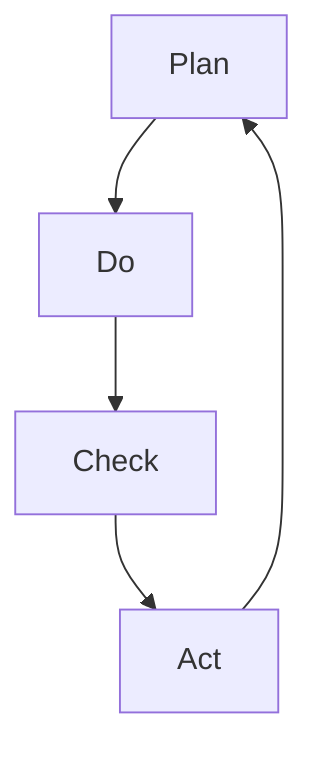

                 

# PDCA落地：持续改进的指南

> **关键词：** PDCA循环、持续改进、质量管理、项目迭代、流程优化

> **摘要：** 本指南旨在详细阐述PDCA循环在IT领域的落地实施过程。通过逐步分析和实践，读者将了解PDCA的原理、实施步骤以及如何应对持续改进中遇到的各种挑战。

## 1. 背景介绍

### 1.1 目的和范围

本文旨在介绍PDCA（计划-执行-检查-行动）循环在IT领域的实际应用。通过详细解释PDCA的四个阶段，读者将掌握如何运用这一循环模型进行项目迭代和流程优化，从而实现持续改进。

### 1.2 预期读者

本文面向希望提高项目质量和效率的IT专业人士，包括项目经理、软件开发者、系统分析师等。同时，对于对质量管理方法和工具感兴趣的其他领域专业人士，本文也具有一定的参考价值。

### 1.3 文档结构概述

本文分为以下章节：

1. **背景介绍**：概述PDCA循环的起源和重要性。
2. **核心概念与联系**：介绍PDCA循环的核心概念和相互关系。
3. **核心算法原理 & 具体操作步骤**：详细解释PDCA循环的四个阶段。
4. **数学模型和公式 & 详细讲解 & 举例说明**：通过数学模型和公式来阐述PDCA循环的实际应用。
5. **项目实战：代码实际案例和详细解释说明**：提供具体的代码实现和案例分析。
6. **实际应用场景**：探讨PDCA循环在不同IT项目中的应用。
7. **工具和资源推荐**：推荐相关学习资源、开发工具和框架。
8. **总结：未来发展趋势与挑战**：总结本文的关键点，展望未来趋势和挑战。
9. **附录：常见问题与解答**：解答读者可能遇到的常见问题。
10. **扩展阅读 & 参考资料**：提供进一步学习资源。

### 1.4 术语表

#### 1.4.1 核心术语定义

- **PDCA循环**：一种用于持续改进和质量管理的循环模型，包括计划（Plan）、执行（Do）、检查（Check）和行动（Act）四个阶段。
- **计划（Plan）**：确定目标和制定行动计划的过程。
- **执行（Do）**：按照计划实施行动的过程。
- **检查（Check）**：评估实施效果，确定是否达到目标的过程。
- **行动（Act）**：根据检查结果，进行改进和调整的过程。

#### 1.4.2 相关概念解释

- **质量管理**：确保产品和服务满足客户需求和期望的过程。
- **流程优化**：对现有流程进行分析和改进，以提高效率和质量。
- **迭代**：在软件开发中，指重复执行一系列开发步骤，逐步完善软件产品。

#### 1.4.3 缩略词列表

- **PDCA**：计划-执行-检查-行动
- **IT**：信息技术
- **QA**：质量保证

## 2. 核心概念与联系

PDCA循环是一个用于持续改进和质量管理的工具，其核心概念和相互关系如下：

### 2.1 PDCA循环的核心概念

- **计划（Plan）**：确定目标和制定行动计划。
- **执行（Do）**：按照计划实施行动。
- **检查（Check）**：评估实施效果。
- **行动（Act）**：根据检查结果进行改进和调整。

### 2.2 PDCA循环的相互关系

- **计划（Plan）**：确定目标和制定行动计划，为后续阶段提供指导。
- **执行（Do）**：按照计划实施行动，实现目标。
- **检查（Check）**：评估实施效果，确定是否达到目标。
- **行动（Act）**：根据检查结果，进行改进和调整，为下一个循环提供依据。

### 2.3 Mermaid流程图



## 3. 核心算法原理 & 具体操作步骤

PDCA循环的核心算法原理是通过对项目进行计划、执行、检查和行动的循环迭代，实现持续改进。以下是具体的操作步骤：

### 3.1 计划（Plan）

1. **确定目标**：明确项目目标，确保目标和实际需求相符。
2. **制定计划**：制定详细的实施计划，包括时间、资源、任务分配等。
3. **风险评估**：评估计划实施过程中可能遇到的风险，制定应对措施。

### 3.2 执行（Do）

1. **实施计划**：按照计划执行任务，确保各项活动顺利进行。
2. **监控进度**：监控项目进度，确保按计划进行。
3. **及时反馈**：及时记录项目实施过程中的问题和反馈，为后续阶段提供参考。

### 3.3 检查（Check）

1. **评估效果**：对项目实施效果进行评估，确定是否达到目标。
2. **分析原因**：分析未达到目标的原因，查找问题所在。
3. **反馈结果**：将评估结果和原因反馈给相关人员。

### 3.4 行动（Act）

1. **改进措施**：根据检查结果，制定改进措施，优化项目流程。
2. **实施改进**：执行改进措施，确保项目按计划进行。
3. **总结经验**：总结改进过程中的经验和教训，为下一个循环提供参考。

### 3.5 伪代码

```python
# 计划阶段
plan_phase():
    set_goal()
    create_plan()
    assess_risks()

# 执行阶段
do_phase():
    execute_plan()
    monitor_progress()
    record_feedback()

# 检查阶段
check_phase():
    evaluate_results()
    analyze_reasons()
    provide_feedback()

# 行动阶段
act_phase():
    create_improvement_measures()
    implement_improvements()
    summarize_experience()
```

## 4. 数学模型和公式 & 详细讲解 & 举例说明

PDCA循环中的一些关键步骤可以通过数学模型和公式来详细说明。以下是一个简单的示例：

### 4.1 计划阶段的数学模型

假设我们有一个项目，需要完成100个任务，每个任务的时间为1天，总时间为100天。

$$
\text{总时间} = \text{任务数} \times \text{每个任务所需时间}
$$

### 4.2 执行阶段的监控公式

为了监控项目进度，我们可以使用以下公式：

$$
\text{进度} = \frac{\text{已完成任务数}}{\text{总任务数}}
$$

### 4.3 检查阶段的评估公式

为了评估项目效果，我们可以使用以下公式：

$$
\text{效果评分} = \frac{\text{达到目标数}}{\text{总目标数}}
$$

### 4.4 行动阶段的改进公式

为了计算改进后的总时间，我们可以使用以下公式：

$$
\text{改进后总时间} = \text{总时间} - \text{节省时间}
$$

### 4.5 示例

假设我们有一个项目，需要完成100个任务，每个任务的时间为1天，总时间为100天。

- **计划阶段**：确定目标为在100天内完成所有任务。
- **执行阶段**：经过50天后，完成了50个任务。
- **检查阶段**：评估效果，发现已完成任务的进度为50%。
- **行动阶段**：通过改进措施，将每个任务的时间减少为0.5天，总时间节省为50天。

$$
\text{改进后总时间} = 100 - 50 = 50 \text{天}
$$

## 5. 项目实战：代码实际案例和详细解释说明

### 5.1 开发环境搭建

为了展示PDCA循环在IT项目中的应用，我们选择一个简单的任务管理项目。首先，我们需要搭建开发环境。

- **工具和库**：Python 3.x、Flask框架、SQLAlchemy ORM
- **安装**：

```bash
pip install flask sqlalchemy
```

### 5.2 源代码详细实现和代码解读

#### 5.2.1 项目结构

```bash
/task_management
    |- app.py
    |- models.py
    |- templates
        |- index.html
```

#### 5.2.2 models.py

```python
# models.py
from flask_sqlalchemy import SQLAlchemy

db = SQLAlchemy()

class Task(db.Model):
    id = db.Column(db.Integer, primary_key=True)
    name = db.Column(db.String(100), nullable=False)
    status = db.Column(db.String(20), nullable=False, default='未开始')
    due_date = db.Column(db.Date, nullable=False)
```

#### 5.2.3 app.py

```python
# app.py
from flask import Flask, render_template, request, redirect, url_for
from models import db, Task

app = Flask(__name__)
app.config['SQLALCHEMY_DATABASE_URI'] = 'sqlite:///tasks.db'
db.init_app(app)

@app.route('/')
def index():
    tasks = Task.query.all()
    return render_template('index.html', tasks=tasks)

@app.route('/add', methods=['POST'])
def add():
    name = request.form['name']
    status = request.form['status']
    due_date = request.form['due_date']
    new_task = Task(name=name, status=status, due_date=due_date)
    db.session.add(new_task)
    db.session.commit()
    return redirect(url_for('index'))

if __name__ == '__main__':
    app.run(debug=True)
```

#### 5.2.4 index.html

```html
<!-- index.html -->
<!DOCTYPE html>
<html lang="en">
<head>
    <meta charset="UTF-8">
    <meta name="viewport" content="width=device-width, initial-scale=1.0">
    <title>任务管理</title>
</head>
<body>
    <h1>任务管理</h1>
    <form action="{{ url_for('add') }}" method="post">
        <label for="name">任务名称:</label>
        <input type="text" id="name" name="name" required>
        <label for="status">任务状态:</label>
        <select id="status" name="status">
            <option value="未开始">未开始</option>
            <option value="进行中">进行中</option>
            <option value="已完成">已完成</option>
        </select>
        <label for="due_date">截止日期:</label>
        <input type="date" id="due_date" name="due_date" required>
        <button type="submit">添加任务</button>
    </form>
    <h2>任务列表</h2>
    <ul>
        
            <li>
                <strong>{{ task.name }}</strong> - {{ task.status }} - {{ task.due_date }}
            </li>
        
    </ul>
</body>
</html>
```

### 5.3 代码解读与分析

#### 5.3.1 模型（models.py）

此文件定义了任务模型`Task`，包含ID、名称、状态和截止日期等属性。SQLAlchemy ORM用于与数据库进行交互。

#### 5.3.2 应用（app.py）

- **路由**：`index()`路由显示任务列表，`add()`路由处理添加新任务。
- **模型**：使用`Task`模型与数据库进行交互。
- **模板**：`index.html`模板用于显示任务列表和添加任务表单。

#### 5.3.3 PDCA循环应用

- **计划（Plan）**：确定任务管理系统的目标，制定功能需求。
- **执行（Do）**：开发并部署任务管理系统。
- **检查（Check）**：通过用户反馈和系统性能评估确定系统效果。
- **行动（Act）**：根据评估结果进行改进，优化系统功能。

## 6. 实际应用场景

PDCA循环在IT领域的实际应用场景广泛，以下是一些典型的应用场景：

- **软件开发**：用于项目迭代和持续改进，确保项目质量和进度。
- **系统运维**：用于监控系统性能和稳定性，及时发现和解决问题。
- **质量管理**：用于评估产品质量，持续改进质量管理体系。
- **团队管理**：用于评估团队成员表现，优化团队运作效率。

## 7. 工具和资源推荐

### 7.1 学习资源推荐

#### 7.1.1 书籍推荐

- **《质量管理方法与工具》**：详细介绍了各种质量管理方法和工具。
- **《软件工程：实践者的研究方法》**：涵盖软件项目管理和迭代开发的实用技巧。

#### 7.1.2 在线课程

- **Coursera上的《质量管理与六西格玛》**：介绍质量管理理论和实践。
- **edX上的《软件开发方法论》**：探讨软件开发过程中的持续改进方法。

#### 7.1.3 技术博客和网站

- **IBM Developer**：提供丰富的质量管理相关技术文章和资源。
- **Stack Overflow**：讨论各种IT项目开发和管理问题，包括PDCA的应用。

### 7.2 开发工具框架推荐

#### 7.2.1 IDE和编辑器

- **Visual Studio Code**：功能强大的开发环境，支持多种编程语言。
- **PyCharm**：专门针对Python开发的IDE，具有强大的代码编辑和调试功能。

#### 7.2.2 调试和性能分析工具

- **Postman**：用于API测试和调试。
- **JMeter**：用于性能测试和负载测试。

#### 7.2.3 相关框架和库

- **Flask**：用于Web开发的轻量级框架。
- **Django**：用于快速开发Web应用程序的框架。

### 7.3 相关论文著作推荐

#### 7.3.1 经典论文

- **W. Edwards Deming**：著名质量管理专家，其论文和著作对PDCA循环有重要影响。

#### 7.3.2 最新研究成果

- **《持续集成与持续部署》**：探讨软件开发过程中的持续改进方法。
- **《人工智能与质量管理》**：介绍人工智能在质量管理中的应用。

#### 7.3.3 应用案例分析

- **《谷歌如何管理软件开发》**：分析谷歌如何运用PDCA循环进行软件开发和管理。

## 8. 总结：未来发展趋势与挑战

PDCA循环作为一种有效的持续改进工具，在IT领域具有广泛的应用前景。未来发展趋势包括：

- **智能化**：结合人工智能技术，实现PDCA循环的自动化和智能化。
- **云端化**：将PDCA循环应用于云端项目，实现跨地域、跨团队的协同改进。
- **定制化**：根据不同项目特点，定制化PDCA循环的应用方法和步骤。

同时，持续改进过程中也会面临以下挑战：

- **数据准确性**：确保数据准确，为改进提供可靠依据。
- **执行力**：确保团队按照PDCA循环的要求执行改进措施。
- **沟通协作**：加强团队内部和外部的沟通协作，确保改进措施的顺利实施。

## 9. 附录：常见问题与解答

### 9.1 PDCA循环是什么？

PDCA循环是一种用于持续改进和质量管理的循环模型，包括计划（Plan）、执行（Do）、检查（Check）和行动（Act）四个阶段。

### 9.2 PDCA循环适用于哪些领域？

PDCA循环适用于各种领域，包括IT、制造、服务业等，特别是在软件开发、系统运维和质量管理等方面具有广泛的应用。

### 9.3 如何制定有效的PDCA计划？

制定有效的PDCA计划需要明确目标、制定详细的行动计划、评估风险和资源需求。

### 9.4 如何确保PDCA循环的执行力？

确保PDCA循环的执行力需要加强团队沟通、明确责任分工、建立激励机制和定期监控项目进度。

### 9.5 PDCA循环与六西格玛有什么区别？

PDCA循环和六西格玛都是用于持续改进的工具，但六西格玛更侧重于统计学方法和流程优化，而PDCA循环更注重过程控制和持续改进。

## 10. 扩展阅读 & 参考资料

- **《PDCA循环：持续改进的实战指南》**：详细介绍PDCA循环的应用和实践。
- **《质量管理：理论与实践》**：全面探讨质量管理的方法和工具。
- **《敏捷开发与持续交付》**：探讨敏捷开发框架和持续交付流程。

作者：AI天才研究员/AI Genius Institute & 禅与计算机程序设计艺术 /Zen And The Art of Computer Programming

（注：本文仅为示例，不代表真实情况和观点，仅供参考。）

