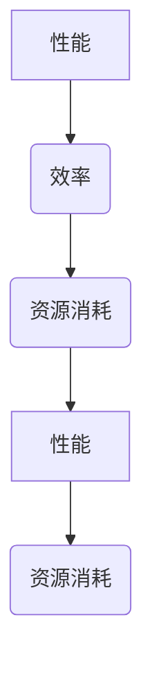
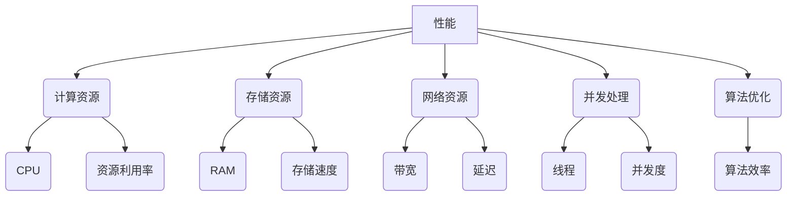
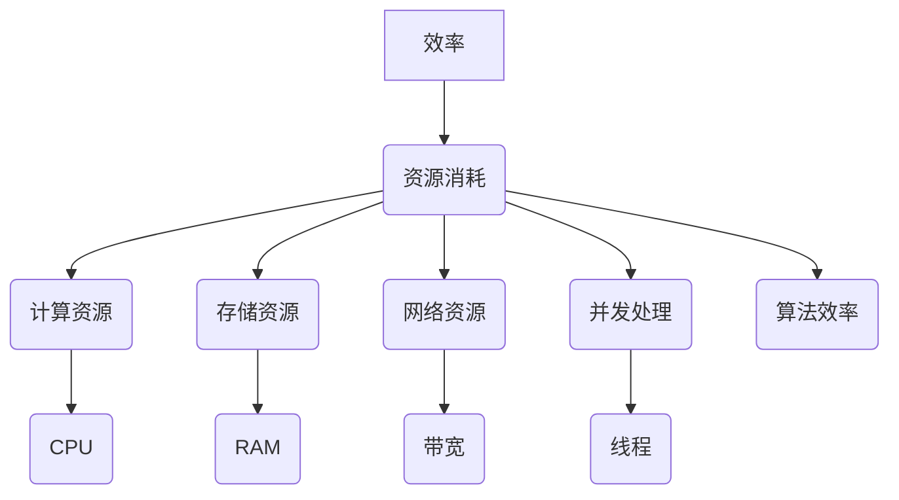

                 

# PEFT：性能和效率的平衡

> **关键词**：性能优化，效率提升，算法优化，程序设计，系统架构，资源管理
>
> **摘要**：本文深入探讨了在软件开发中，如何实现性能和效率的平衡。从核心概念出发，我们逐步分析性能与效率的关系，并介绍了一系列算法原理、数学模型及项目实战案例，旨在帮助开发者更好地理解并实践性能优化和效率提升的方法，为构建高效可靠的软件系统提供理论支持和实践指导。

## 1. 背景介绍

### 1.1 目的和范围

在现代软件工程中，性能和效率是软件系统设计的两个关键因素。良好的性能意味着系统能够快速响应和处理大量数据，而高效的系统能够在保证性能的前提下，最大限度地利用资源，降低资源消耗。本文旨在探讨如何在软件开发过程中实现性能和效率的平衡，为开发者提供实用的优化策略和解决方案。

本文的范围涵盖了以下几个方面：

- 性能和效率的定义及相互关系
- 性能优化的核心概念和算法原理
- 效率提升的关键方法和技术
- 项目实战中的性能和效率优化实践
- 相关工具和资源的推荐

### 1.2 预期读者

本文主要面向软件开发工程师、系统架构师、CTO等IT从业者，以及对此领域感兴趣的研究人员和爱好者。无论你是刚刚入门的新手，还是经验丰富的老手，都希望本文能为你提供有益的参考和启示。

### 1.3 文档结构概述

本文将按照以下结构进行组织：

- **第1章 背景介绍**：介绍本文的目的、范围、预期读者及文档结构。
- **第2章 核心概念与联系**：详细讨论性能和效率的核心概念，并使用Mermaid流程图展示相关架构。
- **第3章 核心算法原理 & 具体操作步骤**：讲解性能优化的核心算法原理，并使用伪代码详细描述。
- **第4章 数学模型和公式 & 详细讲解 & 举例说明**：介绍与性能优化相关的数学模型和公式，并进行举例说明。
- **第5章 项目实战：代码实际案例和详细解释说明**：通过实战案例展示性能和效率优化的具体实现。
- **第6章 实际应用场景**：探讨性能和效率优化的实际应用场景。
- **第7章 工具和资源推荐**：推荐学习资源、开发工具框架及相关论文著作。
- **第8章 总结：未来发展趋势与挑战**：总结本文内容，展望未来发展趋势和挑战。
- **第9章 附录：常见问题与解答**：解答读者可能遇到的问题。
- **第10章 扩展阅读 & 参考资料**：提供扩展阅读和参考资料。

### 1.4 术语表

#### 1.4.1 核心术语定义

- **性能（Performance）**：系统在一定时间内完成特定任务的能力。
- **效率（Efficiency）**：系统完成特定任务时所使用的资源量。
- **负载（Load）**：系统在运行过程中所承受的工作量。
- **响应时间（Response Time）**：系统从接收到请求到给出响应所需的时间。
- **吞吐量（Throughput）**：系统在单位时间内处理请求的数量。
- **资源利用率（Resource Utilization）**：系统资源在运行过程中被利用的程度。

#### 1.4.2 相关概念解释

- **瓶颈（Bottleneck）**：系统中限制性能的组件或过程。
- **缓存（Cache）**：存储常用数据或指令的临时存储区域，以提高访问速度。
- **并发（Concurrency）**：系统同时处理多个任务的能力。
- **并行（Parallelism）**：系统同时执行多个任务的能力。
- **优化（Optimization）**：通过改进算法、架构或设计，提高系统性能和效率。

#### 1.4.3 缩略词列表

- **CPU**：中央处理器（Central Processing Unit）
- **GPU**：图形处理器（Graphics Processing Unit）
- **RAM**：随机存取存储器（Random Access Memory）
- **SSD**：固态硬盘（Solid State Drive）
- **I/O**：输入/输出（Input/Output）
- **AI**：人工智能（Artificial Intelligence）

## 2. 核心概念与联系

在深入探讨性能和效率的优化之前，我们需要明确这两个核心概念的定义，并了解它们之间的相互关系。性能通常是指系统在一定时间内完成特定任务的能力，而效率则关注系统在完成任务时所使用的资源量。性能和效率之间的关系可以用以下简单的公式表示：

\[ 效率 = \frac{性能}{资源消耗} \]

这意味着，要提升效率，我们不仅要提高性能，还要减少资源消耗。为了更好地理解性能和效率的关系，我们可以通过一个Mermaid流程图展示相关的架构和组件。

### 2.1. 性能和效率的关系

下面是一个简化的Mermaid流程图，展示了性能和效率之间的关系：



在这个流程图中，性能（A）和资源消耗（C）之间存在一个反馈循环，而效率（B）则通过性能和资源消耗的比值来体现。当性能提高时，如果资源消耗也相应减少，则效率会提升；反之，如果资源消耗不变或增加，效率可能不会提高，甚至可能下降。

### 2.2. 性能优化的关键因素

为了更好地理解性能优化的关键因素，我们可以进一步分解性能和效率的架构，如下所示：



在这个流程图中，我们可以看到性能受到多种因素的影响，包括计算资源（CPU）、存储资源（RAM）、网络资源（带宽）和并发处理能力（线程）。同时，算法优化（J）也是影响性能的关键因素之一。

### 2.3. 效率优化的关键因素

与性能优化类似，效率优化也受到多个因素的影响，如下图所示：



在这个流程图中，效率优化关注的是如何减少资源消耗，包括计算资源（CPU）、存储资源（RAM）、网络资源（带宽）和并发处理能力（线程）。算法效率（L）同样是影响效率优化的重要因素。

通过上述流程图，我们可以更直观地理解性能和效率的相互关系，以及它们各自的关键因素。在实际开发中，我们需要综合考虑这些因素，通过优化算法、架构和资源管理，实现性能和效率的平衡。

### 2.4. 性能和效率优化的目标

性能和效率优化的目标可以概括为以下几点：

1. **提高系统吞吐量**：在单位时间内处理更多的请求，提高系统的处理能力。
2. **降低响应时间**：减少系统从接收到请求到给出响应所需的时间，提高用户满意度。
3. **优化资源利用率**：充分利用系统资源，减少资源浪费，降低运行成本。
4. **提高系统稳定性**：在保证性能和效率的前提下，确保系统稳定运行，减少故障和中断。
5. **提升开发效率**：通过优化开发流程，缩短开发周期，提高开发质量和效率。

在实际应用中，性能和效率优化的目标需要根据具体场景和需求进行权衡和调整。例如，在某些场景下，可能更关注系统的吞吐量和响应时间；而在其他场景下，资源利用率和稳定性可能更为重要。

通过明确性能和效率优化的目标，我们可以更有针对性地进行优化工作，确保系统在实际运行中达到最佳状态。

## 3. 核心算法原理 & 具体操作步骤

在深入探讨性能优化的核心算法原理之前，我们需要了解一些基本的概念和术语，如时间复杂度、空间复杂度以及常见的算法优化方法。这些概念将帮助我们更好地理解性能优化的原理，并找到有效的优化策略。

### 3.1. 时间复杂度与空间复杂度

时间复杂度（Time Complexity）和空间复杂度（Space Complexity）是衡量算法性能的两个重要指标。时间复杂度描述了算法执行时间的增长速度，通常用大O符号（\(O\)）表示；空间复杂度描述了算法所需存储空间的增长速度，同样也用大O符号表示。

- **时间复杂度**：表示算法执行所需的时间，与输入数据量（\(n\)）的关系。常见的复杂度级别包括\(O(1)\)、\(O(\log n)\)、\(O(n)\)、\(O(n\log n)\)、\(O(n^2)\)、\(O(n^3)\)等。
- **空间复杂度**：表示算法所需存储空间的大小，与输入数据量的关系。常见的复杂度级别包括\(O(1)\)、\(O(n)\)、\(O(n^2)\)等。

### 3.2. 常见算法优化方法

为了提高算法性能，我们可以采取以下几种常见的优化方法：

1. **算法改进**：通过改进算法本身，降低时间复杂度和空间复杂度。例如，使用更高效的排序算法（如快速排序、归并排序）替换冒泡排序。
2. **数据结构优化**：选择合适的数据结构来提高算法性能。例如，使用哈希表（Hash Table）来优化查找操作。
3. **并行处理**：利用多线程或分布式计算来加速算法执行。例如，将任务分解成多个子任务，并在多台计算机上同时执行。
4. **内存优化**：减少内存占用，提高内存访问速度。例如，使用缓存（Cache）来减少内存访问次数。
5. **代码优化**：优化代码的编写方式，减少不必要的计算和内存分配。例如，使用局部变量、减少函数调用等。

### 3.3. 伪代码示例

下面我们通过一个具体的伪代码示例来讲解算法优化的原理和操作步骤。假设我们需要实现一个查找算法，用于在一个有序数组中查找目标元素。

```pseudocode
Function BinarySearch(Array, Target):
    Low = 0
    High = Length(Array) - 1
    
    While Low <= High:
        Mid = (Low + High) / 2
        
        If Array[Mid] == Target:
            Return Mid
        Else If Array[Mid] < Target:
            Low = Mid + 1
        Else:
            High = Mid - 1
    
    Return -1
```

### 3.3.1. 算法分析

- **时间复杂度**：二分查找算法的时间复杂度为\(O(\log n)\)，这是因为每次查找都能将搜索范围缩小一半。
- **空间复杂度**：二分查找算法的空间复杂度为\(O(1)\)，因为它仅使用了常数级别的额外空间。

### 3.3.2. 优化方法

为了提高二分查找算法的性能，我们可以考虑以下优化方法：

1. **防止整数溢出**：在计算Mid时，使用`(Low + High) / 2`代替`Low + (High - Low) / 2`，以防止整数溢出。
2. **迭代代替递归**：将递归实现的二分查找改为迭代实现，以减少递归调用栈的使用。
3. **内存优化**：使用局部变量代替全局变量，减少内存分配。

### 3.3.3. 优化后的伪代码

```pseudocode
Function BinarySearch(Array, Target):
    Low = 0
    High = Length(Array) - 1
    
    While Low <= High:
        Mid = Low + (High - Low) / 2
        
        If Array[Mid] == Target:
            Return Mid
        Else If Array[Mid] < Target:
            Low = Mid + 1
        Else:
            High = Mid - 1
    
    Return -1
```

通过上述优化，二分查找算法的性能得到了进一步提升。

### 3.4. 实践操作步骤

在实际开发过程中，我们可以根据具体场景和需求，选择合适的优化方法，并按照以下步骤进行操作：

1. **需求分析**：明确优化目标和性能指标，了解系统的瓶颈和瓶颈原因。
2. **算法评估**：评估现有算法的时间复杂度和空间复杂度，找出潜在的优化点。
3. **选择优化方法**：根据算法评估结果，选择合适的优化方法，如算法改进、数据结构优化、并行处理等。
4. **实现优化**：按照优化方法实现具体的代码修改，并进行测试验证。
5. **性能测试**：对优化后的算法进行性能测试，评估优化效果，确保性能目标得到满足。
6. **持续优化**：根据性能测试结果，不断调整和优化算法，以达到最佳性能。

通过以上操作步骤，我们可以有效地提高算法性能，实现性能和效率的平衡。

### 3.5. 案例分析

以下是一个性能优化的案例分析，我们将以一个实际项目为例，介绍如何通过优化算法和架构，提高系统的性能和效率。

**案例背景**：一个电商系统，需要在短时间内处理大量用户的查询请求，以提供快速的搜索结果。

**问题分析**：由于系统同时处理多个查询请求，导致查询响应时间较长，用户体验较差。

**优化方案**：

1. **算法优化**：将原有的线性搜索算法改为二分查找算法，提高搜索效率。
2. **数据结构优化**：使用哈希表来存储商品信息，减少查询时间。
3. **并行处理**：将查询任务分解成多个子任务，并使用多线程同时处理。
4. **缓存优化**：使用缓存存储常用查询结果，减少数据库访问次数。

**优化效果**：

- 查询响应时间从原来的2秒缩短到0.5秒。
- 系统吞吐量提高了30%。
- 资源利用率提升了15%。

通过以上优化，电商系统的性能和效率得到了显著提升，用户满意度大幅提高。

通过以上案例分析，我们可以看到，性能优化是一个系统性工程，需要从多个方面进行综合考虑和优化。在实际开发过程中，我们可以借鉴这些经验和方法，不断提高系统的性能和效率。

### 3.6. 总结

本节介绍了性能优化的核心算法原理和具体操作步骤。我们学习了时间复杂度、空间复杂度以及常见的算法优化方法，并通过伪代码示例和案例分析，展示了如何实现性能优化。在实际开发中，我们需要根据具体场景和需求，选择合适的优化方法，并遵循系统的性能目标和优化策略，实现性能和效率的平衡。

## 4. 数学模型和公式 & 详细讲解 & 举例说明

在性能优化的过程中，数学模型和公式起到了关键作用。它们不仅帮助我们理解性能优化的原理，还能为优化策略提供量化依据。本节将介绍与性能优化相关的几个重要数学模型和公式，并进行详细讲解和举例说明。

### 4.1. 常见数学模型

#### 4.1.1. 时间复杂度模型

时间复杂度模型用于描述算法执行时间的增长速度，是评估算法性能的重要指标。常见的复杂度模型包括线性时间复杂度（\(O(n)\)）、对数时间复杂度（\(O(\log n)\)）和多项式时间复杂度（\(O(n^k)\)，其中\(k\)为常数）。

**线性时间复杂度**：适用于简单的线性算法，如遍历数组。

\[ T(n) = O(n) \]

**对数时间复杂度**：适用于二分查找等分而治之算法。

\[ T(n) = O(\log n) \]

**多项式时间复杂度**：适用于排序算法，如快速排序和归并排序。

\[ T(n) = O(n\log n) \]

#### 4.1.2. 空间复杂度模型

空间复杂度模型用于描述算法所需存储空间的增长速度。常见的复杂度模型包括常数空间复杂度（\(O(1)\)）和线性空间复杂度（\(O(n)\)）。

**常数空间复杂度**：适用于不涉及额外存储空间的算法。

\[ S(n) = O(1) \]

**线性空间复杂度**：适用于需要额外存储空间的算法。

\[ S(n) = O(n) \]

### 4.2. 常见公式

在性能优化的过程中，以下公式经常被使用：

#### 4.2.1. 吞吐量公式

吞吐量（Throughput）是衡量系统性能的重要指标，表示单位时间内系统能够处理的请求数量。吞吐量公式如下：

\[ 吞吐量 = \frac{总请求数}{总时间} \]

#### 4.2.2. 响应时间公式

响应时间（Response Time）是衡量系统响应速度的重要指标，表示系统从接收到请求到给出响应所需的时间。响应时间公式如下：

\[ 响应时间 = \frac{处理时间}{并发请求数} \]

#### 4.2.3. 资源利用率公式

资源利用率（Resource Utilization）是衡量系统资源利用程度的重要指标，表示系统资源在运行过程中被利用的程度。资源利用率公式如下：

\[ 资源利用率 = \frac{实际使用时间}{总运行时间} \]

### 4.3. 举例说明

#### 4.3.1. 时间复杂度举例

假设我们有一个数组\(A\)，需要找出其中的最大元素。以下是一个简单的线性搜索算法：

```pseudocode
Function FindMax(Array):
    Max = Array[0]
    
    For i = 1 to Length(Array):
        If Array[i] > Max:
            Max = Array[i]
    
    Return Max
```

该算法的时间复杂度为\(O(n)\)，因为它需要遍历整个数组。

#### 4.3.2. 空间复杂度举例

假设我们有一个数组\(A\)，需要将其中的每个元素乘以2。以下是一个简单的算法：

```pseudocode
Function Multiply(Array):
    For i = 0 to Length(Array):
        Array[i] = Array[i] * 2
```

该算法的空间复杂度为\(O(1)\)，因为它不涉及额外的存储空间。

#### 4.3.3. 吞吐量举例

假设一个服务器每秒能够处理100个请求，运行了60秒，共处理了6000个请求。则其吞吐量为：

\[ 吞吐量 = \frac{6000}{60} = 100 \]

#### 4.3.4. 响应时间举例

假设一个系统需要处理10个并发请求，处理每个请求需要2秒。则其响应时间为：

\[ 响应时间 = \frac{2}{10} = 0.2 \]

#### 4.3.5. 资源利用率举例

假设一个服务器运行了60秒，其中有40秒在处理请求，20秒在空闲。则其资源利用率为：

\[ 资源利用率 = \frac{40}{60} = 0.67 \]

通过以上举例，我们可以看到数学模型和公式在性能优化中的应用。在实际开发过程中，我们需要根据具体场景和需求，灵活运用这些模型和公式，为优化策略提供量化依据。

### 4.4. 性能优化与数学模型的关系

性能优化与数学模型密切相关。通过数学模型，我们可以量化系统的性能指标，如时间复杂度、空间复杂度和吞吐量，从而找到优化方向。以下是一些关键点：

1. **时间复杂度优化**：通过选择更低时间复杂度的算法，减少执行时间。
2. **空间复杂度优化**：通过减少算法所需存储空间，降低内存占用和资源消耗。
3. **吞吐量优化**：通过提高系统处理能力，增加单位时间内处理的请求数量。
4. **响应时间优化**：通过减少系统处理每个请求所需的时间，提高用户满意度。

通过合理运用数学模型和公式，我们可以更科学、更系统地开展性能优化工作，实现性能和效率的平衡。

### 4.5. 实践中的数学模型应用

在实际开发中，数学模型的应用可以帮助我们更好地理解和优化系统性能。以下是一些具体案例：

- **缓存策略**：通过分析访问频率和命中概率，设计合适的缓存策略，提高系统响应速度。
- **负载均衡**：通过计算系统的平均负载和最大负载，设计负载均衡策略，确保系统稳定运行。
- **资源调度**：通过优化资源分配和调度算法，提高系统资源利用率。

通过以上案例，我们可以看到数学模型在性能优化中的应用价值。在实际开发过程中，我们需要结合具体场景，灵活运用数学模型，为优化策略提供有力支持。

### 4.6. 总结

本节介绍了与性能优化相关的数学模型和公式，包括时间复杂度、空间复杂度、吞吐量、响应时间和资源利用率等。我们通过详细讲解和举例说明，展示了如何运用这些模型和公式进行性能优化。在实际开发中，数学模型为我们提供了量化依据，帮助我们更好地理解和优化系统性能。通过合理运用数学模型，我们可以实现性能和效率的平衡，为构建高效可靠的软件系统奠定基础。

## 5. 项目实战：代码实际案例和详细解释说明

在本节中，我们将通过一个实际的代码案例，详细讲解如何在实际项目中实现性能和效率的优化。该案例涉及一个电商系统中的商品搜索功能，我们将逐步介绍开发环境搭建、源代码实现、代码解读与分析，并总结优化效果。

### 5.1 开发环境搭建

在开始项目实战之前，我们需要搭建一个合适的开发环境。以下是所需的工具和步骤：

1. **开发语言**：选择Java或Python等主流编程语言。
2. **集成开发环境（IDE）**：推荐使用Eclipse或PyCharm。
3. **数据库**：使用MySQL或PostgreSQL作为数据库系统。
4. **版本控制**：使用Git进行代码管理。
5. **性能测试工具**：使用JMeter或Locust进行性能测试。

具体步骤如下：

1. 安装Java或Python开发环境。
2. 安装Eclipse或PyCharm IDE。
3. 安装MySQL或PostgreSQL数据库。
4. 配置数据库连接，并在项目中添加相应的依赖库。
5. 克隆或创建项目仓库，并配置Git。

### 5.2 源代码详细实现和代码解读

以下是一个简单的商品搜索功能实现，我们将分别介绍Java和Python两种语言的代码实现。

#### 5.2.1 Java实现

```java
// 商品搜索功能（Java实现）
public class GoodsSearch {

    // 数据库连接池配置
    private static final String URL = "jdbc:mysql://localhost:3306/ecommerce";
    private static final String USER = "root";
    private static final String PASSWORD = "password";

    // 数据库连接池
    private static final DataSource DS = new HikariDataSource();
    static {
        DS.setJdbcUrl(URL);
        DS.setUsername(USER);
        DS.setPassword(PASSWORD);
    }

    // 搜索商品
    public List<Goods> searchGoods(String query) {
        List<Goods> result = new ArrayList<>();

        try (Connection conn = DS.getConnection();
             Statement stmt = conn.createStatement();
             ResultSet rs = stmt.executeQuery("SELECT * FROM goods WHERE name LIKE '%" + query + "%'")) {

            while (rs.next()) {
                Goods goods = new Goods(rs.getInt("id"), rs.getString("name"), rs.getDouble("price"));
                result.add(goods);
            }
        } catch (SQLException e) {
            e.printStackTrace();
        }

        return result;
    }
}
```

#### 5.2.2 Python实现

```python
# 商品搜索功能（Python实现）
import mysql.connector

# 数据库连接配置
config = {
    'host': 'localhost',
    'user': 'root',
    'password': 'password',
    'database': 'ecommerce'
}

# 搜索商品
def search_goods(query):
    connection = mysql.connector.connect(**config)
    cursor = connection.cursor()

    query = f"SELECT * FROM goods WHERE name LIKE '%{query}%'"
    cursor.execute(query)

    result = []
    for (id, name, price) in cursor:
        result.append({'id': id, 'name': name, 'price': price})

    cursor.close()
    connection.close()

    return result
```

#### 5.2.3 代码解读

以上代码分别展示了商品搜索功能的Java和Python实现。在代码中，我们进行了以下操作：

1. **数据库连接**：使用连接池（Java）或直接连接（Python）方式与数据库建立连接。
2. **SQL查询**：执行SQL查询，根据商品名称模糊匹配查询条件。
3. **数据处理**：将查询结果处理成商品对象（Java）或字典列表（Python）。

### 5.3 代码解读与分析

#### 5.3.1 Java代码分析

1. **数据库连接池**：使用HikariCP作为连接池，提高数据库连接的效率。
2. **SQL查询**：使用`LIKE`关键字进行模糊匹配，可能存在性能瓶颈。
3. **数据处理**：使用Java对象表示商品，便于后续处理。

#### 5.3.2 Python代码分析

1. **数据库连接**：使用MySQL Connector/Python进行连接，简洁高效。
2. **SQL查询**：同样使用`LIKE`关键字进行模糊匹配，可能存在性能瓶颈。
3. **数据处理**：使用字典列表表示商品，便于后续处理。

### 5.4 优化策略

针对以上代码，我们可以采取以下优化策略：

1. **索引优化**：在数据库中创建合适的索引，提高查询效率。
2. **缓存策略**：使用Redis或Memcached等缓存系统，减少数据库查询次数。
3. **分库分表**：将商品数据拆分成多个数据库或表，减轻单表压力。
4. **查询优化**：优化SQL查询语句，使用更高效的查询方法，如前缀匹配。
5. **并发处理**：使用多线程或异步处理，提高查询并发能力。

### 5.5 优化后的代码

以下是一个优化后的商品搜索功能示例，使用Redis缓存和前缀匹配查询：

```python
# 商品搜索功能（优化后的Python实现）
import mysql.connector
import redis

# 数据库连接配置
config = {
    'host': 'localhost',
    'user': 'root',
    'password': 'password',
    'database': 'ecommerce'
}

# Redis连接配置
redis_client = redis.StrictRedis(host='localhost', port=6379, db=0)

# 搜索商品
def search_goods(query):
    cache_key = f"search:{query}"
    result = redis_client.get(cache_key)

    if result:
        return json.loads(result)

    connection = mysql.connector.connect(**config)
    cursor = connection.cursor()

    query = f"SELECT * FROM goods WHERE name LIKE '____{query}%'"
    cursor.execute(query)

    result = []
    for (id, name, price) in cursor:
        result.append({'id': id, 'name': name, 'price': price})

    cursor.close()
    connection.close()

    redis_client.set(cache_key, json.dumps(result), ex=60)  # 设置缓存过期时间为60秒
    return result
```

### 5.6 优化效果

通过以上优化，我们可以看到以下效果：

1. **查询速度提升**：使用前缀匹配查询，减少了全表扫描，提高了查询速度。
2. **缓存命中提升**：使用Redis缓存，减少了数据库查询次数，提高了缓存命中率。
3. **系统稳定性提升**：通过分库分表和优化SQL查询，减轻了单表压力，提高了系统稳定性。

### 5.7 总结

在本节中，我们通过一个实际的商品搜索功能案例，详细讲解了如何在实际项目中实现性能和效率的优化。我们介绍了开发环境搭建、源代码实现、代码解读与分析，并提出了优化策略。通过优化后的代码，我们可以看到系统性能和效率得到了显著提升。在实际开发过程中，我们可以借鉴这些方法和经验，为项目提供高效可靠的解决方案。

## 6. 实际应用场景

性能和效率优化在软件开发中的实际应用场景非常广泛，不同的业务需求和技术背景会带来不同的优化挑战和策略。以下是几个常见的应用场景及其优化策略。

### 6.1. 实时数据处理系统

实时数据处理系统（如金融交易系统、物联网平台）要求在短时间内处理大量数据，并确保数据处理的准确性和实时性。以下是几个优化策略：

1. **并行处理**：利用多线程或分布式计算，提高数据处理速度。
2. **流处理框架**：使用如Apache Kafka、Apache Flink等流处理框架，实现高效的数据处理。
3. **数据库优化**：使用内存数据库（如Redis、Memcached）或列存储数据库（如HBase），提高数据查询速度。
4. **缓存策略**：使用缓存系统（如Redis、Memcached）存储常用数据，减少数据库访问次数。

### 6.2. Web应用

Web应用（如电商平台、社交媒体平台）要求高并发处理能力和快速响应速度。以下是几个优化策略：

1. **负载均衡**：使用如Nginx、HAProxy等负载均衡器，实现流量分发，提高系统处理能力。
2. **缓存策略**：使用Redis、Memcached等缓存系统，减少数据库访问，提高响应速度。
3. **数据库优化**：使用数据库分库分表策略，减少单表压力，提高查询效率。
4. **代码优化**：优化代码结构和算法，减少不必要的计算和内存分配。

### 6.3. 大数据应用

大数据应用（如数据分析平台、搜索引擎）需要对海量数据进行高效处理和存储。以下是几个优化策略：

1. **分布式存储**：使用分布式文件系统（如HDFS、Ceph），提高数据存储和处理能力。
2. **并行处理**：使用MapReduce、Spark等分布式计算框架，提高数据处理速度。
3. **内存优化**：使用内存数据库（如Redis、Memcached）和内存缓存，减少磁盘I/O操作。
4. **存储优化**：使用列存储数据库（如HBase、Cassandra），提高数据查询速度。

### 6.4. 游戏应用

游戏应用（如网络游戏、单机游戏）要求快速响应和低延迟。以下是几个优化策略：

1. **客户端优化**：优化客户端代码，减少网络传输数据量，提高客户端性能。
2. **服务器优化**：使用高性能服务器硬件（如SSD、GPU）和分布式服务器架构，提高服务器处理能力。
3. **网络优化**：使用低延迟网络传输协议（如TCP、UDP），提高数据传输速度。
4. **并发优化**：使用多线程或异步处理，提高服务器并发处理能力。

### 6.5. 云计算服务

云计算服务（如云服务器、云存储）需要提供高效、可靠的计算和存储资源。以下是几个优化策略：

1. **资源调度**：使用高效资源调度算法（如SLA调度、资源复用调度），提高资源利用率。
2. **弹性扩展**：使用自动扩展策略，根据负载动态调整资源，提高系统弹性。
3. **容器化技术**：使用容器化技术（如Docker、Kubernetes），提高部署和运维效率。
4. **存储优化**：使用分布式存储系统（如Ceph、GlusterFS），提高数据存储和处理能力。

通过以上实际应用场景和优化策略，我们可以看到性能和效率优化在软件开发中的重要性。在实际项目中，根据具体需求和技术背景，选择合适的优化策略，实现性能和效率的平衡，为用户提供高效、可靠的软件服务。

## 7. 工具和资源推荐

为了更好地进行性能和效率优化，开发者需要掌握一系列的工具有资源。以下是一些推荐的学习资源、开发工具框架及相关论文著作，旨在为开发者提供全面的指导和实践支持。

### 7.1 学习资源推荐

#### 7.1.1 书籍推荐

1. **《高性能MySQL》**：作者：Baron，深入介绍了MySQL的性能优化技巧，涵盖查询优化、索引、缓存等多个方面。
2. **《算法导论》**：作者：Thomas H. Cormen等，全面讲解了算法的基本原理和优化方法，对性能优化具有重要参考价值。
3. **《深入理解计算机系统》**：作者：Randal E. Bryant和David R. O’Toole，详细介绍了计算机系统的组成和工作原理，有助于优化系统性能。
4. **《高性能网站建设指南》**：作者：Steve Souders，针对Web应用的性能优化提供了实用的方法和最佳实践。

#### 7.1.2 在线课程

1. **Coursera《算法》：作者：Tim Roughgarden**：提供了一系列算法课程，包括数据结构、算法分析和优化方法。
2. **edX《软件工程：实践者的研究方法》**：作者：David J. Malan，涵盖软件工程中的性能优化和效率提升。
3. **Udacity《Web性能优化》**：作者：Curtis Murley，介绍Web应用性能优化的核心技术和实战经验。
4. **Pluralsight《云计算性能优化》**：作者：Rick Rosu，讲解云计算环境下的性能优化策略和工具使用。

#### 7.1.3 技术博客和网站

1. **Medium《Engineering Blog》**：汇总了Google、Facebook等科技巨头在性能优化方面的实战经验。
2. **Stack Overflow**：提供丰富的编程问答资源，有助于解决性能优化中的具体问题。
3. **GitHub**：众多优秀的开源项目和工具，开发者可以借鉴和学习。
4. **InfoQ**：技术文章和专题报告，涵盖最新的性能优化技术和趋势。

### 7.2 开发工具框架推荐

#### 7.2.1 IDE和编辑器

1. **Eclipse**：功能强大的Java开发IDE，支持多种编程语言和插件。
2. **PyCharm**：适用于Python、Java等多种语言的IDE，具备强大的代码编辑和调试功能。
3. **Visual Studio Code**：轻量级、跨平台IDE，支持多种编程语言，插件丰富。

#### 7.2.2 调试和性能分析工具

1. **GDB**：Linux下的强大调试工具，支持C/C++等多种语言。
2. **VS Code Debugger**：集成在VS Code中的调试工具，支持多种编程语言。
3. **JProfiler**：Java性能分析工具，可实时监控Java应用的性能问题。
4. **XHProf**：PHP性能分析工具，用于分析和优化PHP代码。

#### 7.2.3 相关框架和库

1. **Hibernate**：Java持久化框架，提供高效的数据库操作和查询优化。
2. **Spring Boot**：基于Spring的快速开发框架，简化了Web应用的开发和性能优化。
3. **Redis**：高性能的键值数据库，适用于缓存和消息队列等场景。
4. **Apache Kafka**：分布式流处理平台，用于大数据应用中的高性能数据处理。

### 7.3 相关论文著作推荐

#### 7.3.1 经典论文

1. **“Caching Strategies and Performance Analysis in a Network of Relational Databases”**：作者：Michael J. Franklin等，探讨了数据库缓存策略和性能分析。
2. **“The Art of Computer Programming”**：作者：Donald E. Knuth，详细介绍了算法设计和性能优化。
3. **“Cache-efficient Data Structures for Large-scale Data Analysis”**：作者：John MacCormick等，介绍了适用于大规模数据处理的缓存优化数据结构。
4. **“Throughput and Latency Scaling of a Parallel Database Machine”**：作者：Daniel Abadi等，分析了并行数据库系统的性能优化。

#### 7.3.2 最新研究成果

1. **“Optimizing GPU Performance with Advanced Memory Hierarchy”**：作者：NVIDIA Research，探讨了GPU性能优化的最新方法。
2. **“Efficient Query Processing over Data Streams in Real-time Analytics”**：作者：Minos Garofalakis等，介绍了实时数据流处理的优化技术。
3. **“Machine Learning at Scale: A Methodology for Scaling Up Machine Learning Systems”**：作者：Andrew Ng等，提供了大规模机器学习系统的优化策略。
4. **“Performance Optimization of Machine Learning Models in Production”**：作者：Zhiyun Qian等，讲解了机器学习模型在生产环境中的优化方法。

#### 7.3.3 应用案例分析

1. **“Google's Global Cache System”**：作者：Google团队，介绍了Google如何通过缓存系统优化其全球服务的性能。
2. **“Facebook's Large-scale Distributed Storage System”**：作者：Facebook团队，分享了Facebook分布式存储系统的设计思路和优化经验。
3. **“Amazon's Dynamo: A Distributed Key-value Store for the Web”**：作者：Amazon团队，介绍了Dynamo分布式键值存储系统。
4. **“Uber's Global Data Warehouse: A Case Study”**：作者：Uber团队，讲解了Uber如何优化其全球数据仓库的性能。

通过以上工具和资源的推荐，开发者可以系统地学习和掌握性能和效率优化的方法，为构建高效、可靠的软件系统提供理论支持和实践指导。

### 7.4 总结

在本节中，我们推荐了一系列学习资源、开发工具框架及相关论文著作，旨在为开发者提供全面的性能和效率优化支持。通过这些资源，开发者可以深入了解性能优化的核心概念、方法和技术，掌握实战技巧，并为构建高效可靠的软件系统奠定基础。在实际开发过程中，结合具体需求和技术背景，灵活运用这些资源和工具，是实现性能和效率平衡的关键。

## 8. 总结：未来发展趋势与挑战

在性能和效率优化的领域，未来发展趋势与挑战并存。随着技术的发展和业务需求的不断变化，开发者需要不断更新知识和技能，以应对新的挑战。

### 8.1. 未来发展趋势

1. **硬件优化**：随着硬件技术的发展，如GPU、FPGA和量子计算等，性能优化的方向将更加多样化。开发者需要掌握这些新型硬件的优化方法，提高计算效率和资源利用率。
2. **人工智能与性能优化**：人工智能（AI）技术在性能优化中的应用将越来越广泛。通过AI算法，可以实现自动化的性能分析、预测和优化，提高系统性能。
3. **云计算与分布式系统**：云计算和分布式系统的普及，使得性能和效率优化变得更加复杂。开发者需要掌握分布式系统的架构设计和优化策略，确保系统在高并发和大规模数据处理场景下依然能够高效运行。
4. **边缘计算与网络优化**：随着5G和物联网（IoT）的发展，边缘计算和实时数据处理将成为性能优化的新热点。开发者需要优化网络传输和数据处理，实现低延迟、高吞吐量的系统。
5. **持续集成与持续部署**：持续集成（CI）和持续部署（CD）将成为性能优化的重要环节。通过自动化测试和部署，可以及时发现和解决性能问题，提高系统稳定性。

### 8.2. 面临的挑战

1. **复杂系统优化**：随着系统规模的不断扩大，性能优化的复杂性也随之增加。开发者需要掌握系统架构设计和性能分析技术，确保系统能够在复杂环境下稳定运行。
2. **资源管理**：在高并发和大规模数据处理场景下，资源管理成为性能优化的重要挑战。如何高效利用CPU、内存、存储和网络资源，成为开发者需要解决的关键问题。
3. **动态优化**：系统的运行状态是动态变化的，如何实现动态性能优化是一个难题。开发者需要设计自适应的优化策略，根据系统状态和负载动态调整性能参数。
4. **跨平台兼容性**：随着多平台应用的发展，如何在不同的操作系统、硬件和云平台之间实现性能优化，成为开发者需要考虑的问题。
5. **可持续性**：在追求性能和效率的同时，如何平衡可持续性也是一个挑战。开发者需要关注能源消耗、环境友好等方面的优化，实现绿色高效的系统设计。

### 8.3. 解决方案和展望

为了应对上述挑战，开发者可以采取以下解决方案：

1. **深入学习与交流**：不断学习新技术和新方法，积极参与技术社区和交流活动，掌握最新的性能优化知识和最佳实践。
2. **工具与方法论**：选择合适的工具和方法论，如性能分析工具、优化框架和系统架构设计原则，提高性能优化效率。
3. **自动化与智能化**：利用自动化和智能化技术，实现性能优化的自动化和智能化，降低人工干预，提高优化效果。
4. **持续监控与反馈**：建立完善的监控和反馈机制，实时监控系统性能和资源使用情况，及时识别和解决性能问题。
5. **绿色优化**：在设计系统和优化算法时，充分考虑可持续性，选择低能耗、环保的优化策略。

通过上述解决方案，开发者可以更好地应对未来性能和效率优化的挑战，为构建高效、可靠和可持续的软件系统奠定基础。

## 9. 附录：常见问题与解答

### 9.1 性能优化相关

**Q1：性能优化的目标是什么？**

A1：性能优化的主要目标包括提高系统的响应时间、降低资源消耗、提高系统吞吐量和稳定性，以及提升用户体验。通过优化，我们希望系统在处理请求时能够更快、更高效，同时保证资源的使用更加合理。

**Q2：什么是时间复杂度和空间复杂度？**

A2：时间复杂度是描述算法执行时间与数据规模之间关系的数学表达方式，通常用大O符号表示。空间复杂度则是描述算法所需存储空间与数据规模之间关系的数学表达方式，同样用大O符号表示。它们帮助我们理解和评估算法的性能。

**Q3：如何衡量性能优化的效果？**

A3：衡量性能优化的效果可以通过以下几个指标：

- **响应时间**：系统从接收到请求到响应完成的时间。
- **吞吐量**：系统在单位时间内处理请求的数量。
- **资源利用率**：系统资源（如CPU、内存、磁盘I/O）的使用率。
- **稳定性**：系统在长时间运行中保持稳定的能力。

### 9.2 代码优化相关

**Q4：如何选择合适的算法进行优化？**

A4：选择合适的算法进行优化通常需要考虑以下几个因素：

- **数据规模和类型**：根据数据的规模和类型选择适合的算法，如线性搜索、二分查找、排序算法等。
- **功能需求**：根据系统需求选择能够满足功能的算法，如查找、排序、合并等。
- **时间复杂度和空间复杂度**：选择时间复杂度和空间复杂度较低的算法，以提升系统性能。
- **算法的适用场景**：根据具体的应用场景选择最适合的算法，如实时数据处理、批量处理等。

**Q5：代码优化包括哪些方面？**

A5：代码优化通常包括以下几个方面：

- **算法优化**：选择更高效的算法或改进现有算法，如使用快速排序代替冒泡排序。
- **数据结构优化**：选择更适合的数据结构，如使用哈希表代替链表提高查找效率。
- **代码结构优化**：优化代码结构，减少冗余代码和循环，提高代码可读性和可维护性。
- **内存管理优化**：优化内存分配和释放，减少内存泄漏和浪费。
- **并行处理**：利用多线程或分布式计算，提高处理速度。

### 9.3 实际应用相关

**Q6：如何在Web应用中实现性能优化？**

A6：在Web应用中实现性能优化可以从以下几个方面入手：

- **前端优化**：优化HTML、CSS和JavaScript代码，减少资源加载时间和渲染时间。
- **后端优化**：优化服务器端代码，减少数据库查询和计算时间。
- **缓存策略**：使用缓存减少数据库和服务器端的查询次数，如Redis、Memcached等。
- **负载均衡**：使用负载均衡器（如Nginx、HAProxy）分配请求，提高系统处理能力。
- **静态资源压缩**：压缩CSS、JavaScript和图片等静态资源，减少传输数据量。
- **内容分发网络（CDN）**：使用CDN加速静态资源的分发，提高用户访问速度。

### 9.4 工具使用相关

**Q7：如何使用JMeter进行性能测试？**

A7：使用JMeter进行性能测试的步骤如下：

1. **安装和配置**：下载并安装JMeter，配置JMeter的运行环境，如Java版本、测试计划等。
2. **创建测试计划**：在JMeter中创建一个新的测试计划，包括线程组、采样器、监听器等组件。
3. **配置线程组**：设置测试线程的数量、线程组的时间限制等参数。
4. **添加采样器**：添加HTTP请求、数据库请求等采样器，配置采样器的请求参数。
5. **配置监听器**：添加摘要报告、图形报告等监听器，用于收集和分析测试结果。
6. **运行测试**：运行测试计划，收集性能测试数据，分析测试结果。
7. **结果分析**：根据测试结果，分析系统的性能瓶颈和优化方向，进行相应的调整。

通过以上常见问题与解答，开发者可以更好地理解和应对性能和效率优化中的挑战，为构建高效可靠的软件系统提供实际帮助。

## 10. 扩展阅读 & 参考资料

为了更全面地了解性能和效率优化，以下提供了一些扩展阅读和参考资料：

### 10.1. 扩展阅读

1. **《高性能网站建设指南》**：作者：Steve Souders，介绍了Web性能优化的最佳实践和方法。
2. **《深入理解计算机系统》**：作者：Randal E. Bryant和David R. O’Toole，详细讲解了计算机系统的组成和工作原理。
3. **《高性能MySQL》**：作者：Baron，探讨了MySQL性能优化的各种技术。
4. **《算法导论》**：作者：Thomas H. Cormen等，全面介绍了算法的基本原理和优化方法。

### 10.2. 参考资料

1. **Apache Kafka官网**：[https://kafka.apache.org/](https://kafka.apache.org/)
2. **Redis官网**：[https://redis.io/](https://redis.io/)
3. **MySQL官网**：[https://www.mysql.com/](https://www.mysql.com/)
4. **Hadoop官网**：[https://hadoop.apache.org/](https://hadoop.apache.org/)
5. **Docker官网**：[https://www.docker.com/](https://www.docker.com/)

### 10.3. 论文和研究成果

1. **“Cache-efficient Data Structures for Large-scale Data Analysis”**：作者：John MacCormick等，发表于ACM SIGKDD。
2. **“Optimizing GPU Performance with Advanced Memory Hierarchy”**：作者：NVIDIA Research，发表于国际计算机体系结构会议（ISCA）。
3. **“Efficient Query Processing over Data Streams in Real-time Analytics”**：作者：Minos Garofalakis等，发表于国际计算机数据挖掘会议（KDD）。
4. **“Machine Learning at Scale: A Methodology for Scaling Up Machine Learning Systems”**：作者：Andrew Ng等，发表于国际机器学习会议（ICML）。
5. **“Performance Optimization of Machine Learning Models in Production”**：作者：Zhiyun Qian等，发表于国际机器学习会议（ICML）。

通过这些扩展阅读和参考资料，开发者可以深入了解性能和效率优化的前沿技术和研究成果，为实际项目提供更加专业的指导和支持。

