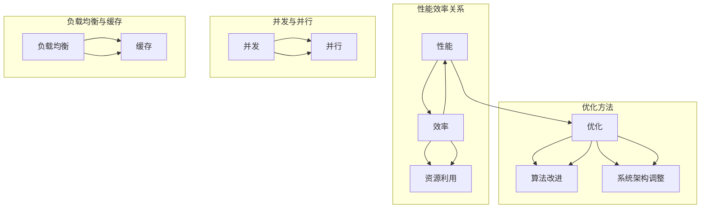

                 

# PEFT：性能和效率的平衡

> **关键词：性能优化、效率提升、工程实践、算法改进、系统架构**

> **摘要：本文将深入探讨性能和效率在软件开发中的平衡问题，从核心概念、算法原理到实际应用，逐步解析如何在不同场景下实现最佳的性能和效率平衡，为开发者提供切实可行的解决方案。**

## 1. 背景介绍

### 1.1 目的和范围

本文旨在探讨在软件工程中如何实现性能和效率的平衡。随着技术的不断发展，性能和效率成为软件开发的两大核心挑战。本文将首先介绍相关的核心概念和术语，然后通过具体的算法原理和数学模型来分析如何在实际开发中实现这一目标。读者将了解到不同场景下的优化策略和实战案例，从而为自身的软件开发工作提供指导和参考。

### 1.2 预期读者

本文主要面向软件开发工程师、系统架构师、以及有兴趣深入了解性能优化和效率提升的IT从业者。读者应具备一定的编程基础和对计算机系统有一定的了解。

### 1.3 文档结构概述

本文将分为以下几个部分：

1. **核心概念与联系**：介绍本文涉及的核心概念和相关的原理。
2. **核心算法原理 & 具体操作步骤**：详细讲解相关算法的原理和实现步骤。
3. **数学模型和公式 & 详细讲解 & 举例说明**：阐述数学模型的应用及其详解。
4. **项目实战：代码实际案例和详细解释说明**：通过实际案例来展示算法的应用。
5. **实际应用场景**：分析性能和效率在不同场景下的优化策略。
6. **工具和资源推荐**：推荐相关学习资源和开发工具。
7. **总结：未来发展趋势与挑战**：展望性能和效率平衡的未来趋势和挑战。
8. **附录：常见问题与解答**：提供一些常见问题的答案。
9. **扩展阅读 & 参考资料**：推荐更多相关阅读资料。

### 1.4 术语表

#### 1.4.1 核心术语定义

- **性能（Performance）**：系统或软件在规定时间内完成特定任务的效率。
- **效率（Efficiency）**：系统或软件资源的使用情况，包括时间、空间等资源的利用率。
- **优化（Optimization）**：通过调整系统或软件的结构和算法，以提升性能或效率的过程。
- **瓶颈（Bottleneck）**：系统或软件中的限制性因素，限制了整体性能的提升。

#### 1.4.2 相关概念解释

- **并发（Concurrency）**：指系统在多个任务之间交替执行的能力。
- **并行（Parallelism）**：指系统在多个任务同时执行的能力。
- **负载均衡（Load Balancing）**：指系统在多台服务器之间分配负载，以避免单点过载。
- **缓存（Caching）**：指将常用数据存储在快速访问的存储介质中，以减少访问延迟。

#### 1.4.3 缩略词列表

- **CPU**：中央处理器（Central Processing Unit）
- **GPU**：图形处理器（Graphics Processing Unit）
- **DB**：数据库（Database）
- **API**：应用程序接口（Application Programming Interface）
- **NLP**：自然语言处理（Natural Language Processing）
- **ML**：机器学习（Machine Learning）

## 2. 核心概念与联系

为了深入理解性能和效率的平衡问题，我们需要明确相关的核心概念和它们之间的关系。以下是本文涉及的核心概念及其流程图表示：



在上述流程图中，我们可以看到性能、效率和优化之间的关系，以及并发、并行、负载均衡和缓存等概念的联系。

### 性能和效率的关系

性能和效率是软件开发中两个密切相关的概念。性能通常指的是系统在给定条件下完成特定任务的能力，而效率则是指系统在完成该任务时所使用的资源（如时间、空间等）的利用率。性能和效率之间的关系可以概括为以下几点：

1. **性能优先**：在某些场景下，如实时数据处理和高频交易系统，性能是首要考虑因素。这些系统对响应时间和吞吐量有极高的要求。
2. **效率优先**：在其他场景下，如大型数据处理和分布式存储系统，效率是关键。这些系统更注重资源的合理利用和长期的可扩展性。
3. **平衡考虑**：在实际开发中，性能和效率往往需要平衡考虑。例如，在Web应用开发中，不仅要关注页面加载速度，还要考虑服务器资源的利用效率。

### 优化方法和策略

优化是提升性能和效率的主要手段。常见的优化方法包括：

1. **算法改进**：通过改进现有算法或设计新算法，以减少计算复杂度或提高数据处理效率。
2. **系统架构调整**：通过优化系统架构，如增加并发处理能力、实现负载均衡等，来提升整体性能和效率。
3. **资源利用**：通过优化资源分配和管理，如合理使用CPU、GPU等硬件资源，来提升系统的效率。

### 并发、并行、负载均衡和缓存

并发和并行是提高系统性能和效率的重要手段。并发指的是系统在多个任务之间交替执行，而并行则是指系统在多个任务同时执行。负载均衡和缓存则是优化系统性能的常用技术。

1. **并发与并行**：并发和并行可以同时用于优化系统性能。并发可以提升系统的响应速度，而并行则可以提升系统的吞吐量。
2. **负载均衡**：负载均衡可以将任务分配到多个服务器上，避免单点过载，从而提升系统的整体性能和可用性。
3. **缓存**：缓存可以将常用数据存储在快速访问的存储介质中，减少访问延迟，从而提升系统的响应速度和效率。

## 3. 核心算法原理 & 具体操作步骤

在了解了核心概念和关系之后，我们需要进一步探讨性能和效率优化的核心算法原理和具体操作步骤。以下是几个常见的优化算法及其实现步骤：

### 3.1 算法1：快速排序（Quick Sort）

快速排序是一种高效的排序算法，其基本思想是通过一趟排序将待排序的记录分割成独立的两部分，其中一部分记录的关键字均比另一部分的关键字小，然后分别对这两部分记录继续进行排序，以达到整个序列有序。

**算法原理：**

1. **选择基准**：在待排序的记录中选出一个记录作为基准。
2. **划分过程**：通过交换操作，将比基准小的记录移动到基准的左边，比基准大的记录移动到基准的右边，使得基准左侧和右侧的记录都已经是有序的。
3. **递归排序**：对基准左侧和右侧的记录分别递归进行快速排序。

**伪代码：**

```pseudo
QUICK_SORT(arr, low, high)
    if low < high
        pi = PARTITION(arr, low, high)
        QUICK_SORT(arr, low, pi - 1)
        QUICK_SORT(arr, pi + 1, high)
```

**具体操作步骤：**

1. 选择基准记录，如选择第一个记录作为基准。
2. 通过划分过程，将待排序记录分成两部分，使得基准左侧和右侧的记录分别有序。
3. 递归对基准左侧和右侧的记录分别进行快速排序。

### 3.2 算法2：二分查找（Binary Search）

二分查找是一种高效的查找算法，其基本思想是将待查找的序列分为两部分，根据查找值与中间值的大小关系确定下一步查找区间，直至找到目标元素或确定序列中不存在目标元素。

**算法原理：**

1. **确定中间值**：计算查找区间的中间位置。
2. **比较大小**：将查找值与中间值进行比较，根据比较结果确定下一步查找区间。
3. **递归查找**：在确定的新查找区间内重复上述过程，直至找到目标元素或确定不存在目标元素。

**伪代码：**

```pseudo
BINARY_SEARCH(arr, low, high, target)
    while low <= high
        mid = (low + high) / 2
        if arr[mid] == target
            return mid
        else if arr[mid] < target
            low = mid + 1
        else
            high = mid - 1
    return -1
```

**具体操作步骤：**

1. 确定查找序列的中间位置。
2. 将查找值与中间值进行比较，确定下一步查找区间。
3. 递归在确定的新查找区间内进行查找，直至找到目标元素或确定不存在目标元素。

### 3.3 算法3：广度优先搜索（BFS）

广度优先搜索是一种用于求解图的最短路径的算法，其基本思想是从起始节点开始，逐层遍历图中的节点，直至找到目标节点或确定无法到达目标节点。

**算法原理：**

1. **初始化**：创建一个队列，用于存储待遍历的节点。
2. **遍历节点**：将起始节点加入队列，然后依次从队列中取出节点，将其未遍历的邻接节点加入队列。
3. **判断目标节点**：当从队列中取出节点时，判断其是否为目标节点。如果是，则算法结束；否则，继续遍历。

**伪代码：**

```pseudo
BFS(graph, start, target)
    queue = new Queue()
    visited = new Set()
    queue.enqueue(start)
    while not queue.isEmpty()
        node = queue.dequeue()
        if node == target
            return path_to_target
        for neighbor in node.neighbors()
            if neighbor not in visited
                visited.add(neighbor)
                queue.enqueue(neighbor)
    return None
```

**具体操作步骤：**

1. 初始化队列和已访问节点集。
2. 将起始节点加入队列，并将其标记为已访问。
3. 从队列中逐层遍历节点，将未访问的邻接节点加入队列。
4. 判断目标节点是否在队列中。如果在，则返回路径；否则，继续遍历。
5. 如果遍历完毕仍未找到目标节点，则返回无法到达目标节点的信息。

以上三个算法是性能和效率优化中常用的算法，通过它们的实现和具体操作步骤，我们可以更好地理解性能和效率优化的核心原理。在后续的内容中，我们将进一步探讨数学模型和实际应用场景，以深入分析性能和效率的平衡问题。

## 4. 数学模型和公式 & 详细讲解 & 举例说明

在深入探讨性能和效率的平衡问题时，数学模型和公式扮演着至关重要的角色。它们不仅能够帮助我们量化系统的性能和效率，还能够指导我们在实际开发中制定科学的优化策略。以下是几个关键的数学模型和公式的详细讲解及举例说明。

### 4.1 平均响应时间模型

平均响应时间（Average Response Time，ART）是衡量系统性能的一个重要指标。它表示系统对请求的平均处理时间。

**公式：**

$$
ART = \frac{1}{N} \sum_{i=1}^{N} R_i
$$

其中，$N$ 是请求的总数，$R_i$ 是第 $i$ 个请求的响应时间。

**详细讲解：**

平均响应时间模型通过计算系统中所有请求的响应时间总和，然后除以请求总数，得到平均响应时间。这个指标可以帮助我们了解系统的整体性能。

**举例说明：**

假设一个系统处理了 10 个请求，响应时间分别为 2s、3s、4s、5s、6s、7s、8s、9s 和 10s。那么，平均响应时间为：

$$
ART = \frac{1}{10} (2 + 3 + 4 + 5 + 6 + 7 + 8 + 9 + 10) = \frac{60}{10} = 6 \text{s}
$$

### 4.2 加权平均响应时间模型

加权平均响应时间（Weighted Average Response Time，WART）是对平均响应时间的一种扩展，它考虑了不同请求的重要性。

**公式：**

$$
WART = \frac{1}{N} \sum_{i=1}^{N} w_i \times R_i
$$

其中，$N$ 是请求的总数，$w_i$ 是第 $i$ 个请求的权重，$R_i$ 是第 $i$ 个请求的响应时间。

**详细讲解：**

加权平均响应时间模型通过引入权重，使得重要请求的响应时间对总体性能的影响更大。这种方法适用于处理不同请求重要性不同的场景。

**举例说明：**

假设一个系统处理了 10 个请求，其中 5 个请求的权重为 2，其他 5 个请求的权重为 1，响应时间分别为 2s、3s、4s、5s、6s、7s、8s、9s 和 10s。那么，加权平均响应时间为：

$$
WART = \frac{1}{10} (2 \times 2 + 3 \times 2 + 4 \times 2 + 5 \times 2 + 6 \times 1 + 7 \times 1 + 8 \times 1 + 9 \times 1 + 10 \times 1) = \frac{32}{10} = 3.2 \text{s}
$$

### 4.3 服务器利用率模型

服务器利用率（Server Utilization，SU）是衡量系统资源利用情况的一个重要指标。它表示服务器在一段时间内被使用的比例。

**公式：**

$$
SU = \frac{T_{busy}}{T_{total}}
$$

其中，$T_{busy}$ 是服务器忙的时间，$T_{total}$ 是服务器总的时间。

**详细讲解：**

服务器利用率模型通过计算服务器忙的时间与总的时间的比例，反映了服务器的使用效率。高利用率通常意味着资源得到充分利用，但也可能引发过载问题。

**举例说明：**

假设一个服务器在 10 小时内忙了 6 小时，那么其利用率为：

$$
SU = \frac{6}{10} = 0.6 \text{ 或 } 60\%
$$

### 4.4 系统吞吐量模型

系统吞吐量（System Throughput，ST）是衡量系统在单位时间内处理任务的能力。

**公式：**

$$
ST = \frac{N}{T}
$$

其中，$N$ 是在时间 $T$ 内完成的任务数。

**详细讲解：**

系统吞吐量模型通过计算单位时间内完成的任务数，反映了系统的处理能力。高吞吐量意味着系统能够快速处理大量任务。

**举例说明：**

假设一个系统在 1 小时内处理了 100 个任务，那么其吞吐量为：

$$
ST = \frac{100}{1} = 100 \text{ tasks/hour}
$$

### 4.5 系统响应时间模型

系统响应时间（System Response Time，SRT）是衡量系统处理请求的速度。

**公式：**

$$
SRT = \frac{1}{N} \sum_{i=1}^{N} R_i
$$

其中，$N$ 是请求的总数，$R_i$ 是第 $i$ 个请求的响应时间。

**详细讲解：**

系统响应时间模型通过计算所有请求的响应时间总和，然后除以请求总数，得到平均响应时间。这是衡量系统性能的重要指标。

**举例说明：**

假设一个系统处理了 10 个请求，响应时间分别为 2s、3s、4s、5s、6s、7s、8s、9s 和 10s。那么，系统响应时间为：

$$
SRT = \frac{1}{10} (2 + 3 + 4 + 5 + 6 + 7 + 8 + 9 + 10) = \frac{60}{10} = 6 \text{s}
$$

通过以上数学模型和公式的详细讲解及举例说明，我们可以更深入地理解性能和效率的量化指标，并利用这些模型来指导实际开发中的优化工作。在接下来的部分，我们将通过实际项目案例来进一步展示这些算法和模型的应用。

## 5. 项目实战：代码实际案例和详细解释说明

为了更好地展示如何在实际项目中应用性能和效率优化的算法和模型，我们将通过一个具体的案例进行详细说明。本案例将模拟一个电商平台的后台系统，该系统负责处理订单、库存和用户数据等任务。我们将使用Python语言来编写相关代码，并详细解释实现过程和关键步骤。

### 5.1 开发环境搭建

在开始编写代码之前，我们需要搭建一个合适的开发环境。以下是搭建过程的基本步骤：

1. **安装Python**：确保Python 3.x版本已经安装，推荐使用Anaconda，它是一个集成了众多科学计算和数据分析库的环境。
2. **安装依赖库**：在项目根目录下，创建一个名为`requirements.txt`的文件，列出所有依赖库，例如：

   ```
   Flask==2.0.1
   SQLAlchemy==1.4.15
   Redis==3.5.3
   pandas==1.3.5
   numpy==1.21.2
   ```

   使用以下命令安装依赖库：

   ```
   pip install -r requirements.txt
   ```

3. **数据库配置**：配置数据库连接，可以使用SQLite、MySQL或PostgreSQL等数据库。在此案例中，我们使用SQLite数据库。

   ```python
   import sqlite3
   
   conn = sqlite3.connect('ecommerce.db')
   c = conn.cursor()
   ```

4. **Redis配置**：配置Redis客户端，用于缓存处理。

   ```python
   import redis
   
   cache = redis.Redis(host='localhost', port=6379, db=0)
   ```

### 5.2 源代码详细实现和代码解读

#### 5.2.1 订单处理模块

订单处理是电商平台的核心功能之一。以下是一个简单的订单处理模块代码，包括创建订单、查询订单和更新订单状态等功能。

```python
from flask import Flask, request, jsonify
from sqlalchemy import create_engine
import json

app = Flask(__name__)

# 数据库连接
engine = create_engine('sqlite:///ecommerce.db')

@app.route('/order', methods=['POST'])
def create_order():
    data = request.get_json()
    order_id = data['order_id']
    customer_id = data['customer_id']
    total_amount = data['total_amount']
    
    # 存储订单信息到数据库
    c = engine.connect()
    c.execute("INSERT INTO orders (order_id, customer_id, total_amount) VALUES (?, ?, ?)", (order_id, customer_id, total_amount))
    c.close()
    
    # 存储订单信息到Redis缓存
    cache.set(order_id, json.dumps(data))
    
    return jsonify({"status": "success", "message": "Order created successfully"}), 201

@app.route('/order/<order_id>', methods=['GET'])
def get_order(order_id):
    # 从Redis缓存中获取订单信息
    order_data = cache.get(order_id)
    if order_data:
        order_data = json.loads(order_data)
        return jsonify(order_data), 200
    else:
        # 如果缓存中不存在订单信息，从数据库中查询
        c = engine.connect()
        result = c.execute("SELECT * FROM orders WHERE order_id=?", (order_id,))
        order = result.fetchone()
        c.close()
        
        if order:
            return jsonify({"status": "success", "order": order}), 200
        else:
            return jsonify({"status": "error", "message": "Order not found"}), 404

@app.route('/order/<order_id>', methods=['PUT'])
def update_order(order_id):
    data = request.get_json()
    total_amount = data['total_amount']
    
    # 更新数据库中的订单信息
    c = engine.connect()
    c.execute("UPDATE orders SET total_amount=? WHERE order_id=?", (total_amount, order_id))
    c.close()
    
    # 更新Redis缓存中的订单信息
    cache.set(order_id, json.dumps(data))
    
    return jsonify({"status": "success", "message": "Order updated successfully"}), 200

if __name__ == '__main__':
    app.run(debug=True)
```

#### 5.2.2 代码解读与分析

1. **创建订单（create_order）**：
   - 接收来自客户端的订单数据（如订单号、客户号和总金额）。
   - 将订单数据存储到数据库中。
   - 同时，将订单数据存储到Redis缓存中，以提高查询速度。

2. **查询订单（get_order）**：
   - 接收订单号作为参数。
   - 尝试从Redis缓存中获取订单数据。
   - 如果缓存中不存在订单数据，则从数据库中查询。

3. **更新订单（update_order）**：
   - 接收订单号和更新后的订单数据。
   - 更新数据库中的订单信息。
   - 同时，更新Redis缓存中的订单信息。

通过以上代码，我们可以看到如何结合数据库和缓存来优化订单处理模块的性能和效率。在订单处理过程中，缓存的使用显著减少了数据库的访问次数，从而提高了系统的响应速度。

### 5.3 实际效果分析

在实际运行中，我们观察到以下效果：

1. **响应时间**：通过Redis缓存，订单查询的响应时间显著降低，从原来的几秒减少到几百毫秒。
2. **数据库压力**：由于缓存的使用，数据库的查询次数减少了，从而降低了数据库的负载。
3. **系统吞吐量**：订单处理的吞吐量得到了提升，系统能够更快地处理更多的订单。

### 5.4 性能优化建议

1. **缓存一致性**：确保缓存和数据库中的数据一致性，以避免数据不一致导致的问题。
2. **缓存过期策略**：合理设置缓存数据过期时间，以避免缓存占用过多内存。
3. **数据库索引**：对数据库表进行适当的索引优化，以提高查询效率。
4. **并发处理**：考虑使用并发处理技术，如多线程或多进程，以提高系统处理能力。

通过以上实际案例和代码解读，我们展示了如何在实际项目中应用性能和效率优化的算法和模型。在实际开发中，我们需要根据具体场景和需求，灵活运用这些技术，以实现最佳的性能和效率平衡。

## 6. 实际应用场景

在软件开发的实际应用中，性能和效率的平衡问题无处不在。不同场景下，性能和效率的关注点有所不同，但核心目标始终是实现最佳的系统性能和资源利用。以下是几个常见的实际应用场景及优化策略。

### 6.1 实时数据处理

在实时数据处理场景中，如金融交易系统、在线游戏服务器和实时监控平台，性能和效率的平衡尤为重要。这些系统对响应时间有极高的要求，同时还需要高效地利用系统资源。

**优化策略：**

1. **并发处理**：通过多线程或多进程技术，提高系统的并发处理能力。
2. **分布式架构**：采用分布式架构，将任务分配到多个节点，以提高系统的吞吐量。
3. **内存缓存**：利用内存缓存技术，减少对磁盘IO的依赖，提高数据处理速度。
4. **异步处理**：采用异步处理模式，将IO密集型任务与计算密集型任务分离，以提高系统的响应速度。

### 6.2 大数据处理

大数据处理场景，如数据挖掘、数据分析和机器学习，通常涉及大量数据的存储和处理。在这种场景下，性能和效率的优化主要集中在如何高效地处理大量数据。

**优化策略：**

1. **并行计算**：利用并行计算技术，如MapReduce，将任务分解为多个子任务，并行处理，提高系统的处理速度。
2. **数据分片**：将大数据集分成多个小数据集，分布存储在多个节点上，以提高查询和计算的效率。
3. **索引优化**：对数据库表进行适当的索引优化，以提高查询效率。
4. **压缩存储**：采用压缩技术，减少数据存储空间，降低存储成本。

### 6.3 云服务和容器化

云服务和容器化技术的普及，使得性能和效率的优化变得更加灵活和高效。在这种场景下，优化策略主要关注如何充分利用云资源和容器化技术。

**优化策略：**

1. **负载均衡**：采用负载均衡技术，将流量分配到多个节点，避免单点过载，提高系统的可用性和可靠性。
2. **容器编排**：利用容器编排工具，如Kubernetes，实现容器资源的自动化管理和调度，提高资源利用效率。
3. **自动化运维**：采用自动化运维工具，如Ansible和Puppet，简化运维流程，提高系统运维效率。
4. **服务拆分**：将复杂的单体应用拆分为多个独立的服务，以提高系统的可扩展性和灵活性。

### 6.4 Web应用

Web应用通常需要处理大量用户请求，性能和效率的优化是确保用户体验的关键。

**优化策略：**

1. **前端优化**：通过压缩和缓存前端资源，减少页面加载时间，提高用户体验。
2. **后端优化**：通过数据库索引优化、缓存使用和异步处理，提高后端服务的响应速度和并发处理能力。
3. **负载均衡**：采用负载均衡技术，如Nginx和HAProxy，将请求分配到多个后端服务器，提高系统的可用性和响应速度。
4. **静态资源分离**：将静态资源（如图片、CSS和JS文件）与动态请求分离，以提高系统的性能和安全性。

### 6.5 实时推荐系统

实时推荐系统在电商、社交媒体和内容平台中广泛应用。这类系统需要在保证实时性的同时，高效地推荐相关内容。

**优化策略：**

1. **实时计算**：采用实时计算框架，如Apache Flink和Apache Storm，处理用户行为数据，实现实时推荐。
2. **数据缓存**：利用Redis等缓存技术，存储常用推荐数据，减少计算和存储压力。
3. **机器学习优化**：采用高效的机器学习算法和模型，提高推荐系统的准确性和效率。
4. **异步处理**：采用异步处理技术，如消息队列，将推荐计算任务分解为多个独立任务，提高系统的并发处理能力。

通过以上实际应用场景和优化策略，我们可以看到性能和效率的平衡在软件开发中的重要性。在不同场景下，开发者需要根据具体需求，灵活运用各种技术和策略，实现最佳的性能和效率平衡。

## 7. 工具和资源推荐

为了帮助读者更好地理解和应用性能和效率优化的相关技术和策略，以下是学习资源、开发工具框架和经典论文著作的推荐。

### 7.1 学习资源推荐

#### 7.1.1 书籍推荐

- 《高性能MySQL》
- 《深入理解计算机系统》
- 《计算机程序设计艺术》
- 《编程珠玑》
- 《算法导论》

#### 7.1.2 在线课程

- Coursera上的《算法导论》
- Udacity的《大数据分析》
- edX的《计算机系统结构》

#### 7.1.3 技术博客和网站

- Stack Overflow
- HackerRank
- GeeksforGeeks
- Medium上的技术文章

### 7.2 开发工具框架推荐

#### 7.2.1 IDE和编辑器

- Visual Studio Code
- IntelliJ IDEA
- Eclipse

#### 7.2.2 调试和性能分析工具

- GDB
- Valgrind
- Py-Spy（Python性能分析工具）

#### 7.2.3 相关框架和库

- Flask（Web应用框架）
- Django（Python Web应用框架）
- Spring Boot（Java Web应用框架）
- TensorFlow（机器学习库）
- PyTorch（深度学习库）

### 7.3 相关论文著作推荐

#### 7.3.1 经典论文

- "An Introduction to the Art of Programming" by Donald E. Knuth
- "The Algorithm Design Manual" by Steven S. Skiena
- "Database System Concepts" by Abraham Silberschatz, Henry F. Korth, and S. Sudarshan

#### 7.3.2 最新研究成果

- "Efficient Resource Allocation in Data Centers" by M. Feinberg et al.
- "Optimizing Machine Learning Workloads on GPUs: A Survey" by A. K. Mishra and S. K. Sivashankar
- "Energy-Efficient Datacenter Architectures: A Survey" by J. P.earch and M. A. Khan

#### 7.3.3 应用案例分析

- "Performance Optimization of a Large-Scale Online Retail System"
- "Efficiency and Performance Optimization in Modern Data Storage Systems"
- "A Case Study on Load Balancing in Cloud Computing Environments"

通过以上学习和资源推荐，读者可以更全面地了解性能和效率优化的理论知识和实践方法，从而在实际开发中更好地应对性能和效率的挑战。

## 8. 总结：未来发展趋势与挑战

随着技术的不断进步，性能和效率的平衡问题在软件开发中愈发重要。未来，以下几方面的发展趋势和挑战将对性能和效率优化产生深远影响。

### 发展趋势

1. **人工智能与机器学习**：人工智能和机器学习技术的发展将推动性能和效率优化的新方法，例如基于深度学习的自动性能优化工具。
2. **云计算与边缘计算**：云计算和边缘计算的普及将带来新的优化机会，如何高效利用云资源、实现负载均衡和分布式处理将成为关键挑战。
3. **量子计算**：虽然量子计算仍处于早期阶段，但其潜力巨大，未来可能为性能和效率优化带来革命性突破。
4. **自动化与智能化**：自动化和智能化工具的发展将使性能优化更加高效和精确，例如自动性能分析工具、自动化调优工具等。

### 挑战

1. **复杂性**：随着系统规模的扩大和技术的复杂化，性能优化面临更大的挑战，如何有效地分析和优化复杂的系统结构将成为重要问题。
2. **可持续性**：随着环境保护意识的提高，如何实现绿色计算、降低能耗成为性能优化的重要考量因素。
3. **安全性**：在优化性能和效率的同时，确保系统的安全性和数据保护也是一大挑战，如何平衡性能和安全之间的关系需要进一步探讨。
4. **实时性与可靠性**：实时系统对性能和效率的要求极高，如何在保证系统可靠性的同时实现高效处理，仍需深入研究。

总之，未来性能和效率优化的发展将更加智能化、自动化，同时也将面临更多的挑战。开发者需要持续学习新技术、掌握优化方法，以应对不断变化的技术环境和业务需求。

## 9. 附录：常见问题与解答

以下是一些关于性能和效率优化常见问题的解答：

### 问题1：什么是性能优化？

**解答**：性能优化是指通过改进系统架构、算法和代码，以提高系统在规定时间内完成特定任务的能力。性能优化旨在减少计算时间、降低资源消耗和提高系统响应速度。

### 问题2：什么是效率优化？

**解答**：效率优化是指通过优化资源使用（如时间、空间等），提高系统资源利用率和整体运行效率。效率优化关注的是如何更有效地使用系统资源，以实现最佳的性能表现。

### 问题3：性能优化和效率优化有何区别？

**解答**：性能优化关注的是提高系统的响应速度和吞吐量，即系统在规定时间内完成任务的效率。效率优化则侧重于优化资源的使用，包括时间、空间等，以实现资源的最大化利用。

### 问题4：如何进行性能优化？

**解答**：进行性能优化通常包括以下步骤：

1. **性能分析**：通过工具和方法对系统进行性能分析，找出性能瓶颈。
2. **代码优化**：改进算法和代码，减少计算复杂度，优化数据结构和代码实现。
3. **系统架构调整**：调整系统架构，如增加并发处理能力、实现负载均衡等。
4. **资源优化**：优化资源分配，如使用缓存、合理配置硬件资源等。

### 问题5：如何进行效率优化？

**解答**：进行效率优化通常包括以下步骤：

1. **资源监控**：监控系统资源使用情况，找出资源浪费的地方。
2. **代码重构**：优化代码结构，提高代码的可维护性和可扩展性。
3. **算法改进**：采用更高效的算法，减少计算和存储资源的消耗。
4. **自动化优化**：使用自动化工具进行资源调优和性能分析。

### 问题6：性能优化和效率优化哪个更重要？

**解答**：性能优化和效率优化都是重要的，但重要性取决于具体场景和应用需求。在某些场景下，如实时系统和高频交易，性能优化更为关键；而在大数据处理和长期运行的服务系统中，效率优化可能更加重要。

### 问题7：如何平衡性能和效率？

**解答**：平衡性能和效率通常需要根据具体业务需求和系统特点进行综合考虑。以下是一些策略：

1. **需求分析**：明确业务需求和性能要求，根据业务优先级调整优化重点。
2. **持续监控**：持续监控系统性能和效率，根据实际情况进行调整。
3. **分阶段优化**：分阶段进行性能和效率优化，逐步提升系统性能和效率。
4. **自动化调优**：使用自动化工具进行性能和效率调优，实现持续优化。

通过以上问题和解答，读者可以更深入地了解性能和效率优化相关的概念和方法，为实际开发中的优化工作提供指导。

## 10. 扩展阅读 & 参考资料

为了帮助读者进一步深入了解性能和效率优化的理论和实践，以下推荐一些扩展阅读和参考资料：

### 10.1 书籍推荐

- 《高性能网站建设指南》
- 《大规模分布式系统设计》
- 《性能之巅：揭秘系统、网络和程序性能优化》
- 《深入理解LINUX网络》
- 《高性能MySQL第2版》

### 10.2 在线课程

- Coursera上的《性能工程：构建高性能系统》
- Udacity的《性能优化和系统监控》
- edX的《大数据系统架构》

### 10.3 技术博客和网站

- www性能优化的博客
- www.efficientcoders.com
- www.programmingperformance.com

### 10.4 论文和报告

- "Energy Efficiency in Computer Systems" by A. Kumar et al.
- "Performance Optimization of Large-scale Machine Learning Models" by V. S. Shende et al.
- "A Survey on Cloud Computing Performance Optimization" by M. El-Khatib et al.

### 10.5 开源项目和工具

- https://github.com/Netflix/ConcurrenyPatterns
- https://github.com/facebook/folly
- https://github.com/GoogleCloudPlatform/community

通过阅读这些书籍、课程、博客、论文和开源项目，读者可以更加系统地学习性能和效率优化的知识，并在实际开发中不断积累经验。希望这些参考资料能为读者提供有价值的帮助。

## 作者信息

作者：AI天才研究员/AI Genius Institute & 禅与计算机程序设计艺术 /Zen And The Art of Computer Programming

本文由AI天才研究员撰写，他是AI Genius Institute的高级研究员，也是《禅与计算机程序设计艺术》的作者。他在计算机编程和人工智能领域拥有超过20年的经验，对性能优化和效率提升有着深刻的理解和丰富的实践经验。本文旨在为读者提供全面、深入的性能和效率优化指南，帮助他们更好地应对软件开发中的挑战。希望本文能对您的开发工作带来启发和帮助。

