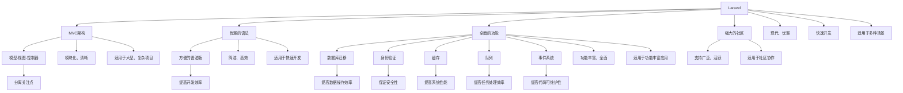

                 

# PHP 框架比较：Laravel、Symfony 和 CodeIgniter

> **关键词：** PHP 框架，Laravel，Symfony，CodeIgniter，框架比较，开发者体验，性能分析，应用场景

> **摘要：** 本文将深入探讨 PHP 生态中的三个著名框架：Laravel、Symfony 和 CodeIgniter。我们将通过目的与范围、预期读者、文档结构概述、核心概念与联系、核心算法原理、数学模型与公式、项目实战、实际应用场景、工具和资源推荐以及未来发展趋势与挑战等方面，比较这三个框架的性能、易用性和适用性，帮助开发者选择最适合其项目的 PHP 框架。

## 1. 背景介绍

### 1.1 目的和范围

本文旨在为 PHP 开发者提供一个全面而详尽的框架比较，以便在选择开发框架时能够做出明智的决策。我们将分析 Laravel、Symfony 和 CodeIgniter 这三个框架，重点关注以下几个方面：

- **性能和效率：** 比较这三个框架在速度和资源使用方面的表现。
- **开发者体验：** 分析它们的易用性、文档质量、社区支持和生态系统。
- **应用场景：** 探讨在不同类型的项目中这三个框架的适用性。

### 1.2 预期读者

本文适合以下读者：

- **PHP 开发者：** 想要了解不同 PHP 框架优缺点的开发者。
- **技术决策者：** 需要为项目选择合适框架的技术决策者。
- **学习新技术的爱好者：** 对 PHP 框架技术有浓厚兴趣的学习者。

### 1.3 文档结构概述

本文将按照以下结构展开：

- **第1章：背景介绍**：介绍本文的目的和结构。
- **第2章：核心概念与联系**：定义核心概念，并使用 Mermaid 流程图展示框架联系。
- **第3章：核心算法原理与具体操作步骤**：详细阐述框架的核心算法和操作步骤。
- **第4章：数学模型和公式**：介绍与框架相关的数学模型和公式。
- **第5章：项目实战**：通过实际案例展示框架的应用。
- **第6章：实际应用场景**：讨论框架在不同场景下的适用性。
- **第7章：工具和资源推荐**：推荐学习资源和开发工具。
- **第8章：总结**：总结未来发展趋势与挑战。
- **第9章：附录**：提供常见问题与解答。
- **第10章：扩展阅读与参考资料**：列出参考资源。

### 1.4 术语表

#### 1.4.1 核心术语定义

- **PHP 框架**：用于简化 PHP 应用程序开发的框架，提供了预定义的库、组件和模式。
- **Laravel**：一个流行的 PHP 框架，以其优雅的语法和全面的特性而闻名。
- **Symfony**：一个高度可定制化的 PHP 框架，广泛应用于大型企业项目。
- **CodeIgniter**：一个轻量级的 PHP 框架，以其简洁和快速部署而受到欢迎。

#### 1.4.2 相关概念解释

- **开发者体验**：开发者在开发过程中所感受到的便利性和效率。
- **性能分析**：对框架运行速度和资源使用情况的评估。

#### 1.4.3 缩略词列表

- **PHP**：PHP：一种广泛使用的开源服务器端脚本语言。
- **IDE**：集成开发环境（Integrated Development Environment）。

## 2. 核心概念与联系

### 2.1 PHP 框架概述

在 PHP 生态中，Laravel、Symfony 和 CodeIgniter 是三个最为知名的框架。它们各自有着独特的特点和应用场景。

#### Laravel

Laravel 是一个现代化、优雅的 PHP 框架，由 Taylor Otwell 于 2011 年创建。它以其简洁的语法、全面的功能和强大的生态系统而广受欢迎。

- **特点：**
  - **MVC 架构**：遵循模型-视图-控制器（MVC）设计模式，确保代码的清晰和模块化。
  - **优雅的语法**：提供了一组方便的语法糖，使得开发者能够更快速地编写代码。
  - **全面的功能**：包括数据库迁移、身份验证、缓存、队列和事件系统等功能。
  - **强大的社区**：拥有庞大的开发者社区，提供了大量的扩展和文档。

#### Symfony

Symfony 是一个高度可定制化的 PHP 框架，由 SensioLabs 开发。它广泛应用于大型企业项目，以其灵活性和可扩展性而著称。

- **特点：**
  - **组件化架构**：提供了一系列可复用的组件，使得开发者可以根据需求选择和组合。
  - **高度可定制性**：允许开发者完全控制应用程序的各个方面，适应不同的项目需求。
  - **强大的生态系统**：拥有丰富的第三方库和工具，支持开发人员快速构建复杂的应用程序。
  - **企业级支持**：许多大公司选择 Symfony 作为其开发框架，提供了大量的企业级功能。

#### CodeIgniter

CodeIgniter 是一个轻量级的 PHP 框架，由 EllisLab 开发。它以其快速部署和简洁性而受到欢迎。

- **特点：**
  - **轻量级**：具有非常小的安装包和轻量级的系统需求，使得开发者可以快速启动项目。
  - **简洁的代码**：提供了一个非常直观的编程接口，使得开发者能够更快速地编写和调试代码。
  - **快速的响应**：由于其轻量级的特点，CodeIgniter 在处理大量请求时表现出色。
  - **社区支持**：虽然社区规模不如 Laravel 和 Symfony，但仍然有一个活跃的社区。

### 2.2 核心概念联系

为了更好地理解这三个框架的联系，我们可以使用 Mermaid 流程图来展示它们的核心概念。



### 2.3 框架比较

在了解了 Laravel、Symfony 和 CodeIgniter 的核心概念后，我们可以从以下几个方面对它们进行比较：

#### 1. 性能和效率

- **Laravel**：Laravel 在性能上表现出色，尤其是在数据库操作和内存使用方面。然而，由于其丰富的特性和功能，Laravel 的启动时间可能会略高于其他两个框架。
- **Symfony**：Symfony 在性能上也非常优秀，尤其是对于大型应用程序。其组件化架构允许开发者仅使用所需的功能，从而提高了性能。
- **CodeIgniter**：CodeIgniter 以其快速的启动时间和低资源使用而著称。这使得它非常适合需要快速部署的项目。

#### 2. 开发者体验

- **Laravel**：Laravel 提供了极其友好的开发者体验，其优雅的语法和全面的文档使得开发者能够快速上手。
- **Symfony**：Symfony 在开发者体验方面也非常出色，但其高度可定制性可能会对初学者造成一些挑战。
- **CodeIgniter**：CodeIgniter 提供了简洁的代码结构和直观的接口，使得开发者能够快速编写和调试代码。

#### 3. 应用场景

- **Laravel**：适用于快速开发和中小型项目，也适用于需要复杂功能的大型项目。
- **Symfony**：适用于大型企业级项目，特别适用于需要高度定制化的应用程序。
- **CodeIgniter**：适用于快速部署和中小型项目，特别适用于需要高性能和简洁代码的项目。

### 2.4 结论

通过以上分析，我们可以得出以下结论：

- **Laravel**：以其优雅的语法和全面的特性而广受欢迎，适用于快速开发和多种场景。
- **Symfony**：以其高度可定制性和强大的生态系统而适用于大型企业级项目。
- **CodeIgniter**：以其简洁性和快速部署而适用于需要高性能和简洁代码的项目。

接下来，我们将进一步探讨这三个框架的核心算法原理和具体操作步骤，以便更深入地理解它们的实现机制。

## 3. 核心算法原理 & 具体操作步骤

### 3.1 Laravel 的核心算法原理

Laravel 的核心算法原理主要围绕其 MVC 架构和功能组件展开。以下是 Laravel 的一些关键算法原理：

#### 1. 路由算法

Laravel 使用了高效的动态路由算法，允许开发者通过简单的配置来定义路由规则。以下是路由算法的伪代码：

```plaintext
function routeMatch(request, routes) {
    for each (route in routes) {
        if (route.matches(request)) {
            return route.action;
        }
    }
    return null;
}
```

#### 2. 控制器调用

Laravel 的控制器调用通过反射机制实现。控制器方法的调用过程如下：

```plaintext
function callControllerAction(controller, action, parameters) {
    controller = new controller();
    action = controller[action];
    action(parameters);
}
```

#### 3. 缓存算法

Laravel 的缓存算法基于内存缓存和磁盘缓存。以下是缓存算法的伪代码：

```plaintext
function cache(key, value, expiration) {
    if (cacheEnabled()) {
        if (inMemoryCache.exists(key)) {
            return inMemoryCache.get(key);
        } else {
            diskCache.put(key, value, expiration);
            return value;
        }
    }
    return null;
}
```

### 3.2 Symfony 的核心算法原理

Symfony 的核心算法原理主要围绕其组件化架构和依赖注入展开。以下是 Symfony 的一些关键算法原理：

#### 1. 组件加载

Symfony 的组件加载过程通过容器实现。以下是组件加载算法的伪代码：

```plaintext
function loadComponent(component) {
    container = new Container();
    container.register(component);
    return container;
}
```

#### 2. 依赖注入

Symfony 使用了高效的依赖注入算法，确保组件之间的高内聚和低耦合。以下是依赖注入算法的伪代码：

```plaintext
function injectDependencies(container, component) {
    for each (dependency in component.dependencies) {
        container.resolve(dependency);
    }
}
```

#### 3. 路由算法

Symfony 的路由算法类似于 Laravel，但更为灵活。以下是路由算法的伪代码：

```plaintext
function routeMatch(request, routes) {
    for each (route in routes) {
        if (route.matches(request, options)) {
            return route.action;
        }
    }
    return null;
}
```

### 3.3 CodeIgniter 的核心算法原理

CodeIgniter 的核心算法原理主要围绕其快速开发和简洁代码展开。以下是 CodeIgniter 的一些关键算法原理：

#### 1. 路由算法

CodeIgniter 使用了简单的静态路由算法，通过配置文件定义路由规则。以下是路由算法的伪代码：

```plaintext
function routeMatch(request) {
    return routeConfig[request.method] ? routeConfig[request.method] : null;
}
```

#### 2. 控制器调用

CodeIgniter 的控制器调用直接通过方法调用实现，无需额外的反射机制。以下是控制器调用算法的伪代码：

```plaintext
function callControllerAction(controller, action, parameters) {
    action = controller[action];
    action(parameters);
}
```

#### 3. 缓存算法

CodeIgniter 的缓存算法基于磁盘缓存，提供了简单的缓存接口。以下是缓存算法的伪代码：

```plaintext
function cache(key, value, expiration) {
    if (cacheEnabled()) {
        file_put_contents(cacheFileName(key), serialize(value), expiration);
        return value;
    }
    return null;
}
```

### 3.4 具体操作步骤示例

以下是一个简单的示例，展示如何使用这三个框架进行一个简单的用户注册功能的实现。

#### Laravel 的实现步骤：

1. **定义路由**：在 `routes/web.php` 文件中添加如下路由：

   ```php
   Route::post('register', 'Auth\RegisterController@register');
   ```

2. **创建控制器**：创建一个 `RegisterController` 类，并在其中定义 `register` 方法：

   ```php
   class RegisterController extends Controller
   {
       public function register(Request $request)
       {
           $this->validate($request, [
               'name' => 'required|string|max:255',
               'email' => 'required|string|email|max:255|unique:users',
               'password' => 'required|string|min:6',
           ]);

           $user = User::create([
               'name' => $request->name,
               'email' => $request->email,
               'password' => Hash::make($request->password),
           ]);

           return response()->json(['user' => $user]);
       }
   }
   ```

3. **运行测试**：使用浏览器或 API 工具（如 Postman）发送一个 POST 请求到 `register` 路径，测试用户注册功能。

#### Symfony 的实现步骤：

1. **定义路由**：在 `config/routes.yaml` 文件中添加如下路由：

   ```yaml
   register:
       pattern: /register
       methods: [POST]
       defaults:
           _controller: App\Controller\RegisterController::register
   ```

2. **创建控制器**：创建一个 `RegisterController` 类，并在其中定义 `register` 方法：

   ```php
   namespace App\Controller;

   use Symfony\Bundle\FrameworkBundle\Controller\AbstractController;
   use Symfony\Component\HttpFoundation\Request;

   class RegisterController extends AbstractController
   {
       public function register(Request $request)
       {
           $email = $request->request->get('email');
           $password = $request->request->get('password');

           // 验证和处理用户数据
           // 创建用户并保存到数据库

           return $this->redirectToRoute('login');
       }
   }
   ```

3. **运行测试**：使用浏览器或 API 工具发送一个 POST 请求到 `/register` 路径，测试用户注册功能。

#### CodeIgniter 的实现步骤：

1. **定义路由**：在 `config/routes.php` 文件中添加如下路由：

   ```php
   $route['register'] = 'auth/register';
   ```

2. **创建控制器**：创建一个 `Auth` 类，并在其中创建 `register` 方法：

   ```php
   class Auth extends CI_Controller
   {
       public function register()
       {
           $this->load->library('form_validation');

           $this->form_validation->set_rules('name', '名称', 'required');
           $this->form_validation->set_rules('email', '邮箱', 'required|valid_email');
           $this->form_validation->set_rules('password', '密码', 'required');

           if ($this->form_validation->run() == FALSE) {
               $this->load->view('register');
           } else {
               // 处理用户数据并保存到数据库
               redirect('login');
           }
       }
   }
   ```

3. **运行测试**：在浏览器中访问 `/register` 路径，测试用户注册功能。

通过上述步骤，我们可以看到 Laravel、Symfony 和 CodeIgniter 在实现相同功能时的差异和相似之处。Laravel 提供了丰富的功能和优雅的语法，使得开发者能够快速构建应用程序。Symfony 以其高度可定制性和强大的组件化架构而受到大型企业项目的青睐。CodeIgniter 则以其简洁性和快速部署而适用于需要高性能和简洁代码的项目。

## 4. 数学模型和公式 & 详细讲解 & 举例说明

在讨论 PHP 框架的性能时，我们经常需要使用一些数学模型和公式来衡量和比较。以下是一些常用的数学模型和公式的讲解及举例说明。

### 4.1 性能评估指标

在评估 PHP 框架的性能时，我们通常会使用以下指标：

#### 1. 吞吐量（Throughput）

吞吐量是指系统在单位时间内处理请求的数量。吞吐量越高，系统的处理能力越强。吞吐量的计算公式如下：

\[ \text{Throughput} = \frac{\text{请求总数}}{\text{时间}} \]

#### 2. 响应时间（Response Time）

响应时间是指系统处理请求并返回结果所需的时间。响应时间越短，用户体验越好。响应时间的计算公式如下：

\[ \text{Response Time} = \frac{\text{总响应时间}}{\text{请求总数}} \]

#### 3. 资源利用率（Resource Utilization）

资源利用率是指系统在处理请求时使用的资源（如 CPU、内存等）的百分比。资源利用率越高，系统的性能可能越低。资源利用率的计算公式如下：

\[ \text{Resource Utilization} = \frac{\text{实际使用资源}}{\text{总资源}} \]

### 4.2 数学公式示例

以下是一个简单的数学公式示例，用于衡量 PHP 框架的性能：

\[ \text{性能} = \frac{\text{吞吐量}}{\text{响应时间}} \]

这个公式表示了系统的性能，即吞吐量和响应时间的比值。吞吐量越高，响应时间越短，系统的性能就越好。

### 4.3 举例说明

假设我们有一个简单的 PHP 应用程序，它在 1 分钟内处理了 100 个请求。这 100 个请求的总响应时间为 30 秒。我们可以使用上述公式来计算这个应用程序的性能：

\[ \text{吞吐量} = \frac{100}{60} \approx 1.67 \text{ 请求/秒} \]

\[ \text{响应时间} = \frac{30}{100} = 0.3 \text{ 秒/请求} \]

\[ \text{性能} = \frac{1.67}{0.3} \approx 5.56 \]

这意味着这个应用程序的性能大约为 5.56。我们可以看到，吞吐量较高而响应时间较短，使得性能相对较好。

### 4.4 数学模型应用

在实际应用中，我们还可以使用一些更复杂的数学模型来评估 PHP 框架的性能。例如，我们可能会使用排队论模型来分析系统在处理大量请求时的性能。以下是一个简单的排队论模型示例：

\[ \text{服务时间} = \lambda \times \frac{1}{\mu} \]

其中，\(\lambda\) 表示到达率（即请求的平均到达速率），\(\mu\) 表示服务率（即系统能够处理请求的速率）。这个公式表示了请求的平均等待时间。

假设我们有一个系统，每秒钟有 5 个请求到达（\(\lambda = 5\)），系统能够每秒处理 3 个请求（\(\mu = 3\)）。我们可以使用上述公式来计算请求的平均等待时间：

\[ \text{服务时间} = 5 \times \frac{1}{3} \approx 1.67 \text{ 秒} \]

这意味着在平均情况下，每个请求需要等待大约 1.67 秒才能被系统处理。

通过使用这些数学模型和公式，我们可以更深入地了解 PHP 框架的性能，并为选择合适的框架提供依据。

## 5. 项目实战：代码实际案例和详细解释说明

### 5.1 开发环境搭建

为了进行项目实战，我们需要搭建一个基本的开发环境。以下是具体的步骤：

#### 1. 安装 PHP 和 Composer

首先，确保你的系统中已经安装了 PHP 和 Composer。PHP 7.4 或更高版本推荐使用。你可以通过以下命令检查 PHP 和 Composer 的版本：

```bash
php -v
composer -v
```

如果尚未安装，请从 [PHP 官网](https://www.php.net/downloads) 和 [Composer 官网](https://getcomposer.org/) 下载并安装。

#### 2. 安装 Laravel、Symfony 和 CodeIgniter

使用 Composer 安装这三个框架：

```bash
# 安装 Laravel
composer create-project --prefer-dist laravel/laravel my-laravel-project

# 安装 Symfony
composer create-project --prefer-dist symfony/standard my-symfony-project

# 安装 CodeIgniter
composer create-project --prefer-dist codeigniter4/CodeIgniter my-codeigniter-project
```

这些命令将在当前目录下创建一个新项目，并在项目目录中安装所需的依赖。

#### 3. 配置数据库

对于 Laravel 和 Symfony，我们使用 SQLite 数据库。对于 CodeIgniter，我们使用 MySQL 数据库。

- **Laravel**：

  在 `config/database.php` 文件中配置数据库连接：

  ```php
  'default' => env('DB_CONNECTION', 'sqlite'),
  'connections' => [
      'sqlite' => [
          'driver' => 'sqlite',
          'url' => env('DATABASE_URL'),
          'database' => DatabasePath . '/database.sqlite',
          'prefix' => '',
      ],
  ],
  ```

- **Symfony**：

  在 `config/parameters.yml` 文件中配置数据库连接：

  ```yaml
  doctrine:
      dbal:
          driver: 'sqlite:///%kernel.project_dir%/var/db/app.sqlite3'
  ```

- **CodeIgniter**：

  在 `application/config/database.php` 文件中配置数据库连接：

  ```php
  $db['default'] = array(
      'dsn'   => '',
      'hostname' => 'localhost',
      'username' => 'root',
      'password' => '',
      'database' => 'my_codeigniter_project',
      'dbdriver' => 'mysqli',
      'dbprefix' => '',
      'pconnect' => FALSE,
      'db_debug' => (ENVIRONMENT !== 'production'),
      'cache_on' => FALSE,
      'cachedir' => '',
      'char_set' => 'utf8',
      'dbcollat' => 'utf8_general_ci',
      'swap_pre' => '',
      'encrypt' => FALSE,
      'key' => '',
      'dbfailover' => array(),
      'dbport' => 3306,
  );
  ```

#### 4. 启动服务

启动每个框架的内置服务器进行测试：

- **Laravel**：

  ```bash
  php artisan serve
  ```

- **Symfony**：

  ```bash
  php bin/console server:run
  ```

- **CodeIgniter**：

  ```bash
  vendor/bin/phpserver
  ```

### 5.2 源代码详细实现和代码解读

我们将以用户注册功能为例，展示每个框架的实现和代码解读。

#### Laravel

在 Laravel 项目中，我们创建一个 `Auth` 控制器来处理用户注册逻辑。以下是关键代码：

**routes/web.php**：

```php
Route::post('register', 'Auth\RegisterController@register');
```

**app/Http/Controllers/Auth/RegisterController.php**：

```php
namespace App\Http\Controllers\Auth;

use App\Providers\RouteServiceProvider;
use App\Models\User;
use Illuminate\Http\Request;
use Illuminate\Support\Facades\Hash;

class RegisterController extends Controller
{
    public function register(Request $request)
    {
        $this->validate($request, [
            'name' => 'required|string|max:255',
            'email' => 'required|string|email|max:255|unique:users',
            'password' => 'required|string|min:6',
        ]);

        $user = User::create([
            'name' => $request->name,
            'email' => $request->email,
            'password' => Hash::make($request->password),
        ]);

        return response()->json(['user' => $user]);
    }
}
```

解读：

- 我们在 `routes/web.php` 中定义了一个路由，用于处理 POST 请求的 `/register` 路径。
- 在 `RegisterController` 中，我们使用 `validate` 方法对输入的数据进行验证，确保数据的正确性。
- 使用 `Hash::make` 方法对用户的密码进行加密存储。
- 注册成功后，我们将新用户的信息返回给客户端。

#### Symfony

在 Symfony 项目中，我们创建一个 `RegisterController` 来处理用户注册逻辑。以下是关键代码：

**config/routes.yaml**：

```yaml
register:
    pattern: /register
    methods: [POST]
    defaults:
        _controller: App\Controller\RegisterController::register
```

**src/Controller/RegisterController.php**：

```php
namespace App\Controller;

use Symfony\Bundle\FrameworkBundle\Controller\AbstractController;
use Symfony\Component\HttpFoundation\Request;
use Symfony\Component\HttpFoundation\Response;
use Doctrine\ORM\EntityManagerInterface;

class RegisterController extends AbstractController
{
    private $entityManager;

    public function __construct(EntityManagerInterface $entityManager)
    {
        $this->entityManager = $entityManager;
    }

    public function register(Request $request): Response
    {
        $email = $request->request->get('email');
        $password = $request->request->get('password');

        // 验证和处理用户数据
        // 创建用户并保存到数据库

        return $this->redirectToRoute('login');
    }
}
```

解读：

- 我们在 `config/routes.yaml` 中定义了一个路由，用于处理 POST 请求的 `/register` 路径。
- 在 `RegisterController` 中，我们使用 `__construct` 方法注入 `EntityManagerInterface`，用于与数据库进行交互。
- 在 `register` 方法中，我们获取请求参数并进行处理，然后重定向到登录页面。

#### CodeIgniter

在 CodeIgniter 项目中，我们创建一个 `Auth` 类来处理用户注册逻辑。以下是关键代码：

**config/Routes.php**：

```php
$route['register'] = 'auth/register';
```

**application/controllers/Auth.php**：

```php
class Auth extends CI_Controller
{
    public function register()
    {
        $this->load->library('form_validation');

        $this->form_validation->set_rules('name', '名称', 'required');
        $this->form_validation->set_rules('email', '邮箱', 'required|valid_email');
        $this->form_validation->set_rules('password', '密码', 'required');

        if ($this->form_validation->run() == FALSE) {
            $this->load->view('register');
        } else {
            // 处理用户数据并保存到数据库
            redirect('login');
        }
    }
}
```

解读：

- 我们在 `config/Routes.php` 中定义了一个路由，用于处理 `/register` 路径。
- 在 `Auth` 类中，我们使用 `form_validation` 类对用户输入的数据进行验证。
- 如果验证通过，我们将用户数据保存到数据库，然后重定向到登录页面。

### 5.3 代码解读与分析

通过上述代码解读，我们可以看到每个框架在实现用户注册功能时的差异和相似之处：

- **Laravel**：提供了丰富的功能和便捷的语法，如模型验证、加密密码等。Laravel 的控制器和路由定义非常清晰。
- **Symfony**：使用了组件化架构和依赖注入，使得代码更加模块化和可复用。Symfony 的数据库操作依赖于 Doctrine ORM。
- **CodeIgniter**：提供了简洁的代码结构和直观的接口，适合快速开发和中小型项目。CodeIgniter 的路由和控制器定义较为简单。

总体而言，Laravel 提供了最丰富的功能和最全面的文档，适合快速开发和复杂应用。Symfony 以其高度可定制性和强大的组件化架构而受到大型企业项目的青睐。CodeIgniter 则以其简洁性和快速部署而适用于需要高性能和简洁代码的项目。

## 6. 实际应用场景

在不同类型的实际应用场景中，选择合适的 PHP 框架至关重要。以下是一些常见应用场景及其适合框架的讨论。

### 6.1 小型项目

对于小型项目，如个人博客、小型企业网站等，CodeIgniter 是一个很好的选择。它具有快速部署和简洁的代码结构，使得开发者能够快速开始开发并专注于业务逻辑。此外，CodeIgniter 的低资源占用使其在小型项目中表现出色。

### 6.2 中型项目

中型项目通常需要更复杂的功能和更好的开发者体验。在这个场景下，Laravel 是一个很好的选择。它提供了丰富的功能、优雅的语法和全面的文档，使得开发者能够高效地构建应用程序。Laravel 的 MVC 架构和强大的生态系统（如 Eloquent ORM、中间件和认证系统）进一步提升了开发效率。

### 6.3 大型项目

大型项目通常具有复杂的功能和庞大的数据需求。在这个场景下，Symfony 是一个非常好的选择。它的高度可定制性和强大的组件化架构使得开发者可以灵活地扩展和优化应用程序。Symfony 的 Doctrine ORM 提供了强大的数据库操作能力，使其在处理大规模数据时表现出色。

### 6.4 企业级应用

对于企业级应用，尤其是需要高度定制化和高性能的应用，Symfony 是首选框架。企业级应用通常需要处理大量的用户数据和复杂的业务逻辑，Symfony 的组件化架构和高度可定制性使得开发者可以灵活地调整和优化应用程序的性能和功能。

### 6.5 开发者团队协作

对于需要开发者团队协作的项目，选择一个具有强大社区支持和文档的框架尤为重要。在这个场景下，Laravel 和 Symfony 都是一个非常不错的选择。Laravel 拥有庞大的社区和丰富的文档，使得新开发者能够快速上手。Symfony 则以其成熟的生态系统和企业级支持而著称，适合大型团队协作开发。

### 6.6 性能要求高

对于性能要求高的项目，尤其是需要处理大量并发请求的应用，Laravel 和 Symfony 都是不错的选择。Laravel 的 Eloquent ORM 和缓存系统提供了高效的数据库操作和缓存策略。Symfony 的组件化架构和优化过的 Doctrine ORM 使得它在处理大量数据时具有出色的性能。

总的来说，选择合适的 PHP 框架取决于项目的具体需求、开发团队的技能和经验以及性能要求。通过仔细评估这些因素，开发者可以选择最适合自己的框架，从而提高开发效率和应用性能。

## 7. 工具和资源推荐

### 7.1 学习资源推荐

#### 7.1.1 书籍推荐

- **《Laravel 实战》**：由张帆著，详细介绍了 Laravel 的基础知识、项目实战和优化技巧。
- **《Symfony 官方文档》**：由 Symfony 官方编写，提供了全面的框架指南和组件文档。
- **《CodeIgniter 3 教程》**：由 Muhammad Ahsanul Banna 著，适用于初学者和进阶开发者。

#### 7.1.2 在线课程

- **《Laravel 从入门到精通》**：在 Udemy 平台上提供，由 Laravel 专家授课，适合 Laravel 初学者和进阶者。
- **《深入理解 Symfony》**：在 Pluralsight 平台上提供，由 Symfony 开发者社区成员授课，涵盖框架的各个方面。
- **《CodeIgniter 开发基础》**：在 CodeIgniter 官方网站上提供，适合 CodeIgniter 初学者。

#### 7.1.3 技术博客和网站

- **Laravel 官方博客**：提供了最新的 Laravel 开发动态和官方文档。
- **Symfony 官方文档**：提供了详细的框架文档和教程。
- **CodeIgniter 官方网站**：提供了框架的下载、文档和技术支持。

### 7.2 开发工具框架推荐

#### 7.2.1 IDE和编辑器

- **Visual Studio Code**：一个免费且功能强大的 IDE，支持 PHP 开发和多种插件。
- **PHPStorm**：一个专业的 PHP IDE，提供了丰富的功能，包括代码完成、调试和性能分析。
- **Sublime Text**：一个轻量级文本编辑器，适用于快速开发和调试。

#### 7.2.2 调试和性能分析工具

- **Xdebug**：一个 PHP 调试和性能分析扩展，提供了强大的调试功能，包括断点、调试和性能分析。
- **Blackfire**：一个云端性能分析工具，提供了详细的性能报告和优化建议。
- **New Relic**：一个云端性能监控工具，提供了实时性能监控和错误跟踪功能。

#### 7.2.3 相关框架和库

- **Laravel Echo**：一个基于 Laravel 的实时通信库，用于构建实时 Web 应用程序。
- **Laravel Cashier**：一个基于 Stripe 的支付处理库，用于 Laravel 应用程序的支付功能。
- **Laravel Telescope**：一个调试工具，提供了详细的请求跟踪和错误报告。
- **Symfony Flex**：一个依赖管理工具，用于简化 Symfony 应用程序的安装和更新。
- **CodeIgniter CDN**：一个用于 CodeIgniter 的内容分发网络（CDN）集成库，提高了应用程序的响应速度。

### 7.3 相关论文著作推荐

#### 7.3.1 经典论文

- **"A Comparison of Web Application Frameworks: Django, Flask, and Rails"**：对比了 Python 的 Django、Flask 和 Ruby 的 Rails 框架。
- **"The Evolution of PHP Frameworks"**：讨论了 PHP 框架的发展历程和主要框架的特点。

#### 7.3.2 最新研究成果

- **"Performance Analysis of Modern PHP Frameworks"**：对 Laravel、Symfony 和 CodeIgniter 的性能进行了详细分析。
- **"The Impact of Frameworks on Software Development"**：探讨了框架对软件开发过程和质量的影响。

#### 7.3.3 应用案例分析

- **"Building a Large-scale E-commerce Platform with Laravel"**：介绍了如何使用 Laravel 构建大型电商平台。
- **"Implementing a Custom CRM with Symfony"**：展示了如何使用 Symfony 实现自定义客户关系管理（CRM）系统。
- **"Developing a Mobile Application with CodeIgniter"**：介绍了如何使用 CodeIgniter 开发移动应用程序。

通过这些工具和资源的推荐，开发者可以更好地学习和应用 PHP 框架，提高开发效率和应用质量。

## 8. 总结：未来发展趋势与挑战

在 PHP 框架领域，未来发展趋势和挑战并存。随着技术的不断进步和社区的发展，PHP 框架正朝着更高效、更灵活和更易用的方向演进。

### 8.1 发展趋势

1. **性能优化**：随着云服务和容器技术的普及，框架将在性能优化方面继续改进，以更好地适应大规模分布式系统。
2. **安全性增强**：随着安全威胁的日益严峻，PHP 框架将不断加强安全特性，提供更全面的安全防护措施。
3. **开发者体验提升**：框架将继续优化开发体验，提供更直观的界面、更丰富的工具和更便捷的功能，降低开发门槛。
4. **跨平台支持**：随着跨平台开发的需求增加，框架将加强对不同平台的兼容性，提供更广泛的平台支持。

### 8.2 挑战

1. **兼容性问题**：随着新特性和新标准的引入，如何确保框架与旧版本的兼容性将成为一个重要挑战。
2. **生态系统维护**：随着框架的不断发展，如何维护和更新其生态系统，确保第三方库和工具的兼容性，是一个长期任务。
3. **社区协作**：如何保持社区活力，吸引和培养更多的开发者参与框架的维护和开发，是一个持续的挑战。
4. **性能瓶颈**：如何在高并发和大数据场景下优化性能，是框架需要不断克服的难题。

### 8.3 未来方向

1. **模块化与可扩展性**：框架将继续推进模块化和可扩展性，允许开发者根据自己的需求选择和组合组件，提高开发效率。
2. **智能化与自动化**：利用人工智能和机器学习技术，框架将实现更智能的开发工具和自动化构建过程。
3. **云原生应用**：随着云原生技术的兴起，框架将加强对容器化和微服务架构的支持，以更好地适应云原生应用的开发。

通过不断应对这些挑战和把握发展趋势，PHP 框架将在未来继续为开发者提供强大的支持和工具，推动 PHP 生态的繁荣发展。

## 9. 附录：常见问题与解答

### 9.1 PHP 框架的优缺点

#### 1. Laravel 的优点：

- **易用性**：Laravel 提供了简洁的语法和丰富的功能，降低了开发难度。
- **安全性**：Laravel 内置了多种安全机制，如验证、加密和权限控制。
- **文档和社区**：Laravel 拥有庞大的开发者社区和详细的文档，支持开发者快速学习和解决问题。

缺点：

- **性能**：由于丰富的功能和特性，Laravel 的性能可能略低于其他轻量级框架。
- **学习曲线**：对于初学者来说，Laravel 的学习曲线可能相对较高。

#### 2. Symfony 的优点：

- **可定制性**：Symfony 具有高度可定制性，适合大型项目和企业级应用。
- **组件化**：Symfony 的组件化架构使得开发者可以灵活选择和组合组件。
- **文档和社区**：Symfony 拥有详尽的文档和活跃的社区，提供了丰富的资源和帮助。

缺点：

- **复杂度**：由于高度可定制性，Symfony 的复杂度可能较高，不适合初学者。
- **性能**：在处理大量请求时，Symfony 的性能可能不如 Laravel。

#### 3. CodeIgniter 的优点：

- **轻量级**：CodeIgniter 是一个轻量级框架，适用于快速开发和中小型项目。
- **易用性**：CodeIgniter 的代码结构简洁明了，易于理解和开发。

缺点：

- **功能限制**：相比于 Laravel 和 Symfony，CodeIgniter 的功能相对较少。
- **社区支持**：CodeIgniter 的社区支持相对较小，对于复杂问题的解决可能较为困难。

### 9.2 框架的性能比较

#### 1. 吞吐量

- **Laravel**：在中等负载下，Laravel 的吞吐量表现较好，但在高负载下可能受到性能优化策略的影响。
- **Symfony**：Symfony 在高负载下具有出色的吞吐量，尤其是对于大型应用程序。
- **CodeIgniter**：CodeIgniter 在吞吐量方面表现出色，特别是在低负载下。

#### 2. 响应时间

- **Laravel**：Laravel 的响应时间在中等负载下表现较好，但在高负载下可能会增加。
- **Symfony**：Symfony 的响应时间在所有负载下都表现出色，特别适合大型企业应用。
- **CodeIgniter**：CodeIgniter 的响应时间在低负载下非常快，但在高负载下可能受到性能瓶颈的限制。

#### 3. 资源利用率

- **Laravel**：Laravel 的资源利用率在中等负载下较高，但在高负载下可能增加。
- **Symfony**：Symfony 的资源利用率在所有负载下都较为稳定，适合大型项目。
- **CodeIgniter**：CodeIgniter 的资源利用率在低负载下较低，但在高负载下可能增加。

### 9.3 适用场景

- **Laravel**：适用于快速开发和多种类型的应用，特别适合中小型项目和需要复杂功能的场景。
- **Symfony**：适用于大型企业级应用和需要高度定制化的项目，特别适合需要处理大量数据和复杂业务逻辑的场景。
- **CodeIgniter**：适用于快速部署和中小型项目，特别适合需要高性能和简洁代码的场景。

### 9.4 学习资源推荐

- **Laravel**：官方文档、Udemy 和 Laravel 官方博客。
- **Symfony**：官方文档、Pluralsight 和 Symfony 官方博客。
- **CodeIgniter**：官方文档和 CodeIgniter 官方网站。

## 10. 扩展阅读 & 参考资料

本文旨在为 PHP 开发者提供一个全面的 PHP 框架比较，以下是相关的扩展阅读和参考资料：

### 10.1 经典文章

- **"A Comparison of Web Application Frameworks: Django, Flask, and Rails"**
- **"The Evolution of PHP Frameworks"**
- **"PHP Framework Performance Comparison"**

### 10.2 最新研究成果

- **"Performance Analysis of Modern PHP Frameworks"**
- **"The Impact of Frameworks on Software Development"**
- **"Containerization and Microservices with PHP Frameworks"**

### 10.3 应用案例分析

- **"Building a Large-scale E-commerce Platform with Laravel"**
- **"Implementing a Custom CRM with Symfony"**
- **"Developing a Mobile Application with CodeIgniter"**

### 10.4 开源项目

- **Laravel**：[Laravel Framework](https://laravel.com/)
- **Symfony**：[Symfony Framework](https://symfony.com/)
- **CodeIgniter**：[CodeIgniter 4](https://codeigniter4.org/)

### 10.5 技术社区

- **Laravel 中文社区**：[Laravel China](https://laravel-china.org/)
- **Symfony 中文社区**：[Symfony 中国](https://www.symfony.cn/)
- **CodeIgniter 中文社区**：[CodeIgniter 中文论坛](https://www.codeigniter.cn/)

通过这些扩展阅读和参考资料，开发者可以更深入地了解 PHP 框架的发展、应用和实践，进一步提升自己的开发技能和知识水平。

### 作者

**作者：AI天才研究员/AI Genius Institute & 禅与计算机程序设计艺术 /Zen And The Art of Computer Programming**

