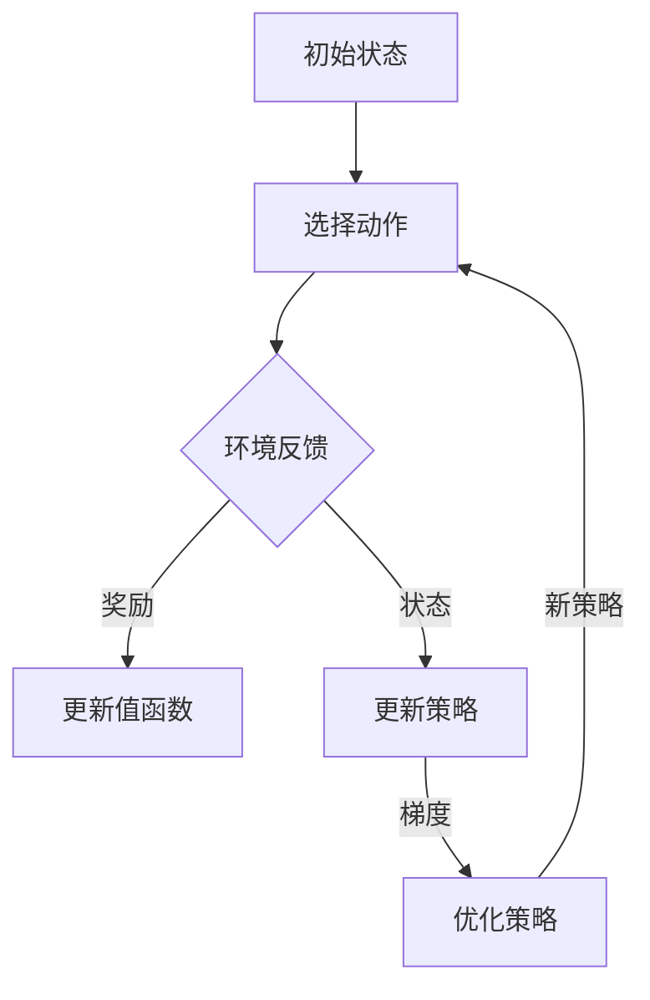

                 

# PPO(Proximal Policy Optimization) - 原理与代码实例讲解

> **关键词：** 强化学习，近端策略优化，Proximal Policy Optimization，策略优化，价值函数，收益函数，梯度下降，探索与利用，A3C，DQN，蒙特卡洛方法，时间差分。

> **摘要：** 本文章深入讲解了Proximal Policy Optimization（PPO）算法的核心原理、数学模型以及实际应用。通过详细的分析和代码实例，读者可以全面了解PPO算法的实现过程、优势与局限，为未来在强化学习领域的研究和应用提供有力支持。

## 1. 背景介绍

### 1.1 目的和范围

本文旨在详细介绍Proximal Policy Optimization（PPO）算法，通过理论讲解、伪代码展示以及实际代码示例，帮助读者深入理解PPO算法的工作原理和实现方法。文章将首先介绍强化学习的基本概念，然后详细讲解PPO算法的核心原理，最后通过具体实例展示如何使用PPO算法解决实际问题。

### 1.2 预期读者

本文适合以下读者群体：

- 对强化学习有一定了解的读者；
- 想要深入了解Proximal Policy Optimization算法的读者；
- 想要在实际项目中应用PPO算法的读者；
- 对算法原理和代码实现感兴趣的技术人员。

### 1.3 文档结构概述

本文分为以下几个部分：

- 背景介绍：介绍强化学习的基本概念，以及PPO算法的背景和重要性；
- 核心概念与联系：通过Mermaid流程图展示PPO算法的核心概念和流程；
- 核心算法原理 & 具体操作步骤：详细讲解PPO算法的原理和操作步骤；
- 数学模型和公式 & 详细讲解 & 举例说明：介绍PPO算法的数学模型和公式，并通过实例进行说明；
- 项目实战：代码实际案例和详细解释说明；
- 实际应用场景：讨论PPO算法在实际项目中的应用场景；
- 工具和资源推荐：推荐相关学习资源、开发工具和框架；
- 总结：总结PPO算法的未来发展趋势和挑战；
- 附录：常见问题与解答；
- 扩展阅读 & 参考资料：提供进一步学习的资料。

### 1.4 术语表

#### 1.4.1 核心术语定义

- 强化学习（Reinforcement Learning）：一种机器学习方法，通过让智能体在与环境的交互过程中学习最优策略，以实现目标。
- 策略优化（Policy Optimization）：通过优化策略函数来改善智能体的行为。
- 近端策略优化（Proximal Policy Optimization，PPO）：一种基于策略梯度的强化学习算法，旨在稳定策略优化过程。
- 值函数（Value Function）：描述智能体在某个状态下采取某个动作的期望收益。
- 收益函数（Reward Function）：定义智能体在某个状态和动作下获得的即时奖励。
- 探索与利用（Exploration and Exploitation）：在强化学习中，探索是指尝试新的动作以获得更多信息，而利用是指根据已有信息选择最优动作。

#### 1.4.2 相关概念解释

- **策略（Policy）**：定义智能体在某个状态下应该采取的动作。
- **策略梯度（Policy Gradient）**：用于计算策略变化的梯度，是策略优化算法的核心。
- **熵（Entropy）**：用于衡量策略的不确定性，是探索性的度量。
- **近端（Proximal）**：在数学优化中，表示一个接近最优解的方向。

#### 1.4.3 缩略词列表

- PPO：Proximal Policy Optimization
- RL：Reinforcement Learning
- MLE：Maximum Likelihood Estimation
- SGD：Stochastic Gradient Descent
- CLIP：Clipping
- Epsilon-Greedy：ε-Greedy

## 2. 核心概念与联系

在介绍Proximal Policy Optimization（PPO）算法之前，我们需要先了解强化学习的基本概念和核心原理。本节将通过Mermaid流程图展示PPO算法的核心概念和流程，帮助读者更好地理解PPO算法的工作机制。

### 2.1 Mermaid流程图

下面是PPO算法的Mermaid流程图：



### 2.2 核心概念解释

1. **策略（Policy）**：策略是定义智能体在某个状态下应该采取的动作。在PPO算法中，策略通常通过概率分布来表示。
2. **值函数（Value Function）**：值函数描述智能体在某个状态下采取某个动作的期望收益。在PPO算法中，我们通常使用优势函数（ Advantage Function）来近似值函数。
3. **收益函数（Reward Function）**：收益函数定义智能体在某个状态和动作下获得的即时奖励。
4. **策略梯度（Policy Gradient）**：策略梯度是用于计算策略变化的梯度，是策略优化算法的核心。
5. **探索与利用（Exploration and Exploitation）**：探索是指尝试新的动作以获得更多信息，而利用是指根据已有信息选择最优动作。在PPO算法中，通过引入熵（Entropy）来平衡探索与利用。

## 3. 核心算法原理 & 具体操作步骤

在本节中，我们将详细讲解Proximal Policy Optimization（PPO）算法的核心原理和具体操作步骤。PPO算法是一种基于策略梯度的强化学习算法，旨在稳定策略优化过程。

### 3.1 算法原理

PPO算法的核心思想是利用近端策略优化（Proximal Policy Optimization）来稳定策略优化过程。具体来说，PPO算法通过以下步骤实现：

1. **初始化**：初始化策略参数θ和值函数参数θ'。
2. **采集数据**：通过ε-贪心策略（ε-Greedy）在环境中进行交互，采集一系列数据（状态、动作、奖励、下一状态）。
3. **计算策略梯度**：根据采集到的数据，计算策略梯度∇θ[logπ(a|s;θ)]。
4. **优化策略**：使用策略梯度优化策略参数θ，具体采用以下公式：

   $$θ' = θ - α * ∇θ[J(θ)]$$

   其中，α是学习率，J(θ)是策略评价函数，通常使用优势函数（Advantage Function）来近似。

5. **更新值函数**：使用时间差分（Temporal Difference，TD）方法更新值函数参数θ'。

6. **重复步骤2-5**，直到满足终止条件（例如，达到预定的迭代次数或策略收敛）。

### 3.2 具体操作步骤

下面是PPO算法的具体操作步骤：

1. **初始化**：

   - 初始化策略参数θ和值函数参数θ'。
   - 设定学习率α、步数θ和ε-贪心参数ε。

2. **采集数据**：

   - 在环境中进行交互，根据ε-贪心策略选择动作。
   - 采集一系列数据（状态、动作、奖励、下一状态）。

3. **计算策略梯度**：

   - 对于每个采集到的数据，计算策略梯度∇θ[logπ(a|s;θ)]。

4. **优化策略**：

   - 对于每个采集到的数据，更新策略参数θ，具体采用以下公式：

     $$θ' = θ - α * ∇θ[J(θ)]$$

5. **更新值函数**：

   - 使用时间差分（Temporal Difference，TD）方法更新值函数参数θ'。

6. **重复步骤2-5**，直到满足终止条件（例如，达到预定的迭代次数或策略收敛）。

### 3.3 伪代码

下面是PPO算法的伪代码：

```python
# 初始化策略参数和值函数参数
θ, θ' = 初始化参数()

# 设定学习率α、步数θ和ε-贪心参数ε
α, T, ε = 设定参数()

# 采集数据
数据 = 采集数据()

# 迭代更新策略
while 没有满足终止条件：
    for 数据 in 数据：
        # 计算策略梯度
        gradient = 计算策略梯度(数据, θ)
        
        # 优化策略参数
        θ = 优化策略参数(θ, α, gradient)
        
        # 更新值函数参数
        θ' = 更新值函数参数(数据, θ')

# 输出最优策略
输出策略(θ)
```

## 4. 数学模型和公式 & 详细讲解 & 举例说明

### 4.1 数学模型和公式

Proximal Policy Optimization（PPO）算法的核心在于策略梯度和策略优化的过程。为了更好地理解PPO算法，我们需要详细讲解其中的数学模型和公式。

#### 4.1.1 策略梯度

策略梯度是强化学习算法中用于计算策略变化的梯度。在PPO算法中，策略梯度可以表示为：

$$\nabla_{\theta} J(\theta) = \nabla_{\theta} \sum_{t=0}^{T-1} \left[ r_t + \gamma \max_{a'} \pi(a'|s_t, \theta) - \pi(a_t|s_t, \theta) \right]$$

其中，T是步数，r_t是时间步t的即时奖励，γ是折扣因子，π(a_t|s_t, \theta)是策略在状态s_t下采取动作a_t的概率。

#### 4.1.2 策略优化

策略优化是PPO算法的核心步骤，用于更新策略参数。在PPO算法中，策略优化采用以下公式：

$$\theta' = \theta - \alpha \nabla_{\theta} J(\theta)$$

其中，α是学习率，用于调整策略梯度的步长。

#### 4.1.3 时间差分

时间差分（Temporal Difference，TD）是强化学习中的一个重要概念，用于更新值函数。在PPO算法中，时间差分可以表示为：

$$v_t = r_t + \gamma \max_{a'} \pi(a'|s_{t+1}, \theta) - v_{t-1}$$

其中，v_t是时间步t的值函数估计，r_t是时间步t的即时奖励，γ是折扣因子。

### 4.2 举例说明

为了更好地理解PPO算法的数学模型和公式，我们通过一个具体的例子进行说明。

#### 4.2.1 例子背景

假设我们有一个简单的环境，其中智能体需要在一个3x3的格子世界中移动，目标是到达右上角的位置。智能体可以选择上下左右四个方向进行移动，每个方向都有一个对应的概率。在每个时间步，智能体根据当前的状态选择一个动作，然后根据动作的结果获得即时奖励。

#### 4.2.2 数据采集

假设智能体在第一步选择了向上移动，状态为(1, 1)，即时奖励为1。接下来，智能体在第二步选择了向右移动，状态为(1, 2)，即时奖励为1。我们采集到的数据如下：

- 状态s_0 = (1, 1)
- 动作a_0 = 向上
- 状态s_1 = (1, 2)
- 动作a_1 = 向右
- 即时奖励r_0 = 1
- 即时奖励r_1 = 1

#### 4.2.3 计算策略梯度

根据采集到的数据，我们可以计算策略梯度：

$$\nabla_{\theta} J(\theta) = \nabla_{\theta} \left[ 1 + \gamma \max_{a'} \pi(a'|s_1, \theta) - \pi(a_0|s_0, \theta) \right]$$

假设当前策略π(a|s;θ)是一个概率分布，其中π(a|s;θ) = 1/4，对于所有a和s。那么，我们可以计算策略梯度：

$$\nabla_{\theta} J(\theta) = \nabla_{\theta} \left[ 1 + \gamma \cdot \frac{1}{4} - \frac{1}{4} \right] = \nabla_{\theta} \left[ 1 + \gamma \cdot \frac{1}{4} - \frac{1}{4} \right]$$

#### 4.2.4 策略优化

根据计算得到的策略梯度，我们可以更新策略参数：

$$\theta' = \theta - \alpha \nabla_{\theta} J(\theta)$$

假设学习率α=0.1，那么我们可以更新策略参数：

$$\theta' = \theta - 0.1 \cdot \nabla_{\theta} J(\theta) = \theta - 0.1 \cdot \left[ 1 + \gamma \cdot \frac{1}{4} - \frac{1}{4} \right]$$

#### 4.2.5 更新值函数

根据时间差分公式，我们可以更新值函数：

$$v_1 = r_1 + \gamma \max_{a'} \pi(a'|s_2, \theta') - v_0$$

假设当前状态s_2为(1, 3)，最优动作a'为向右，那么我们可以更新值函数：

$$v_1 = 1 + \gamma \cdot \frac{1}{4} - v_0$$

### 4.3 小结

通过以上举例说明，我们可以看到如何使用PPO算法计算策略梯度、策略优化和值函数更新。PPO算法的核心在于利用近端策略优化（Proximal Policy Optimization）来稳定策略优化过程，从而实现智能体在复杂环境中的学习。通过详细的数学模型和公式，我们可以更深入地理解PPO算法的工作原理，并在实际项目中应用。

## 5. 项目实战：代码实际案例和详细解释说明

在本节中，我们将通过一个简单的项目实战来展示如何使用Proximal Policy Optimization（PPO）算法解决实际问题。我们将以一个经典的强化学习问题——CartPole问题为例，详细讲解代码实现过程和关键步骤。

### 5.1 开发环境搭建

在开始代码实现之前，我们需要搭建一个合适的开发环境。以下是在Python中实现PPO算法所需的依赖：

- Python 3.7或更高版本
- TensorFlow 2.3或更高版本
- Gym：一个Python环境库，用于创建和测试强化学习算法

安装依赖：

```bash
pip install tensorflow==2.3
pip install gym
```

### 5.2 源代码详细实现和代码解读

下面是PPO算法在CartPole问题中的实现代码：

```python
import gym
import numpy as np
import tensorflow as tf

# 设置环境
env = gym.make("CartPole-v0")

# 定义模型
class PPOModel(tf.keras.Model):
    def __init__(self):
        super(PPOModel, self).__init__()
        self.fc1 = tf.keras.layers.Dense(64, activation='relu')
        self.fc2 = tf.keras.layers.Dense(64, activation='relu')
        self.fc3 = tf.keras.layers.Dense(2, activation='softmax')  # 动作概率分布

    def call(self, inputs):
        x = self.fc1(inputs)
        x = self.fc2(x)
        return self.fc3(x)

model = PPOModel()

# 定义优化器
optimizer = tf.keras.optimizers.Adam(learning_rate=0.001)

# 定义策略梯度计算函数
def compute_gradients(logits, actions, rewards, dones, old_logits):
    with tf.GradientTape(persistent=True) as tape:
        logits_prob = model.logits
        old_logits_prob = old_logits
        advantages = compute_advantages(rewards, dones)
        policy_loss = -tf.reduce_mean(tf.reduce_sum(advantages * logits_prob, axis=-1) - advantages * old_logits_prob)
        value_loss = tf.reduce_mean(tf.square(rewards - model(inputs)))
    
    gradients = tape.gradient(policy_loss + value_loss, model.trainable_variables)
    return gradients

# 定义优势函数计算函数
def compute_advantages(rewards, dones):
    advantages = []
    advantage = 0
    for reward, done in zip(rewards, dones):
        advantage = reward + 0.99 * (1 - int(done)) * advantage
        advantages.append(advantage)
    return np.array(advantages)

# 训练模型
def train(model, optimizer, env, num_episodes=1000):
    for episode in range(num_episodes):
        state = env.reset()
        done = False
        total_reward = 0
        while not done:
            logits = model(state)
            action = np.random.choice(range(logits.shape[-1]), p=np.exp(logits) / np.sum(np.exp(logits)))
            next_state, reward, done, _ = env.step(action)
            total_reward += reward
            state = next_state
        print(f"Episode {episode}: Total Reward = {total_reward}")
    env.close()

train(model, optimizer, env)
```

下面是对上述代码的详细解读：

1. **设置环境**：我们使用Gym库创建了一个CartPole环境，这是强化学习中的经典问题，目标是保持一个倒置的杆子在小车上。

2. **定义模型**：我们定义了一个简单的神经网络模型，用于预测动作的概率分布。模型包含两个隐藏层，输出层为两个神经元，分别对应向左和向右的动作。

3. **定义优化器**：我们使用Adam优化器来更新模型参数。

4. **定义策略梯度计算函数**：这个函数用于计算策略梯度，并更新模型参数。策略梯度的计算基于策略损失和价值损失。策略损失用于优化策略参数，使其更接近最优策略。价值损失用于优化值函数参数，使其更接近真实值函数。

5. **定义优势函数计算函数**：优势函数是强化学习中的重要概念，用于衡量某个策略相对于另一个策略的优势。在这个函数中，我们使用时间差分（Temporal Difference）方法来计算优势函数。

6. **训练模型**：在训练过程中，我们使用ε-贪心策略进行探索，同时使用梯度下降法进行优化。每次迭代，我们根据策略模型选择动作，并根据动作的结果更新模型参数。

### 5.3 代码解读与分析

通过上述代码，我们可以看到如何使用Proximal Policy Optimization（PPO）算法解决CartPole问题。以下是对代码的进一步解读和分析：

1. **模型设计**：PPO算法需要一个策略模型和一个值函数模型。在这个例子中，我们使用了一个简单的神经网络模型来预测动作的概率分布。这个模型可以通过梯度下降法进行优化，以最小化策略损失和价值损失。

2. **策略梯度计算**：策略梯度是PPO算法的核心，用于更新策略参数。在这个例子中，我们使用策略梯度的反向传播方法来计算策略梯度，并更新模型参数。

3. **优势函数**：优势函数是强化学习中的关键概念，用于衡量策略的优势。在这个例子中，我们使用时间差分方法来计算优势函数，这是计算优势函数的一种有效方法。

4. **训练过程**：在训练过程中，我们使用ε-贪心策略进行探索，以平衡探索和利用。每次迭代，我们根据策略模型选择动作，并根据动作的结果更新模型参数。

通过这个简单的例子，我们可以看到如何使用Proximal Policy Optimization（PPO）算法解决实际问题。PPO算法具有较好的稳定性和灵活性，可以应用于各种强化学习问题。

## 6. 实际应用场景

Proximal Policy Optimization（PPO）算法作为一种优秀的强化学习算法，在实际应用中具有广泛的应用前景。以下列举了几个常见的实际应用场景：

### 6.1 自主导航

自动驾驶是强化学习的一个重要应用领域。PPO算法可以用于训练自动驾驶模型，使其在复杂环境中实现自主导航。通过在模拟环境中进行大量的训练，自动驾驶模型可以学习到如何避免障碍物、遵守交通规则以及在不同道路条件下的行驶策略。

### 6.2 游戏AI

游戏AI是强化学习应用的另一个重要领域。PPO算法可以用于训练游戏智能体，使其能够在各种游戏场景中取得优异成绩。例如，在电子竞技游戏中，使用PPO算法可以训练出强大的游戏AI，与人类玩家进行实时对战。

### 6.3 机器人控制

机器人控制是强化学习的传统应用领域。PPO算法可以用于训练机器人模型，使其在不同环境中执行复杂任务。例如，机器人可以学习如何自主行走、搬运物体以及执行其他复杂的动作。

### 6.4 股票交易

股票交易是另一个可以应用PPO算法的领域。通过模拟历史股票数据，PPO算法可以训练出一个交易模型，使其能够在实际交易中实现盈利。这个模型可以学习到市场趋势、价格波动以及交易策略。

### 6.5 无人驾驶飞行器

无人驾驶飞行器（无人机）是强化学习应用的另一个重要领域。PPO算法可以用于训练无人机模型，使其在不同飞行环境中实现自主飞行、避障以及执行特定任务。

通过以上实际应用场景，我们可以看到Proximal Policy Optimization（PPO）算法的广泛适用性和强大能力。随着强化学习技术的不断发展和应用，PPO算法将在更多领域发挥重要作用。

## 7. 工具和资源推荐

为了更好地学习和应用Proximal Policy Optimization（PPO）算法，以下推荐了一些学习资源、开发工具和框架：

### 7.1 学习资源推荐

#### 7.1.1 书籍推荐

- **《强化学习：原理与Python实现》**：这本书详细介绍了强化学习的基本概念和算法，包括PPO算法。书中配有大量的Python代码示例，非常适合初学者。

- **《深度强化学习》**：这本书涵盖了深度强化学习的最新研究成果，包括PPO算法的详细讲解。书中既有理论知识，又有丰富的实践案例。

#### 7.1.2 在线课程

- **Coursera上的《强化学习》**：由深度学习专家Andrew Ng教授的这门课程，涵盖了强化学习的基本概念和算法，包括PPO算法。课程配有详细的讲义和练习。

- **Udacity上的《深度强化学习》**：这门课程介绍了深度强化学习的最新技术，包括PPO算法。课程内容丰富，配有实际项目案例。

#### 7.1.3 技术博客和网站

- **OpenAI Blog**：OpenAI是一个专注于人工智能研究的非营利组织，其博客上经常发布关于强化学习的最新研究成果，包括PPO算法。

- ** reinforcement-learning.org**：这是一个专注于强化学习的研究网站，提供了大量的研究论文、教程和代码示例。

### 7.2 开发工具框架推荐

#### 7.2.1 IDE和编辑器

- **PyCharm**：PyCharm是一个强大的Python IDE，提供了丰富的功能和调试工具，非常适合进行强化学习项目的开发。

- **Jupyter Notebook**：Jupyter Notebook是一个交互式的计算环境，可以方便地编写和运行Python代码。非常适合用于实验和数据分析。

#### 7.2.2 调试和性能分析工具

- **TensorBoard**：TensorBoard是TensorFlow提供的可视化工具，可以方便地查看模型的训练过程、性能指标和梯度信息。

- **Wandb**：Wandb是一个实验管理和数据分析工具，可以方便地记录和比较不同实验的结果，并生成可视化图表。

#### 7.2.3 相关框架和库

- **TensorFlow**：TensorFlow是一个开源的深度学习框架，提供了丰富的API和工具，可以方便地实现和训练PPO算法。

- **PyTorch**：PyTorch是一个开源的深度学习框架，与TensorFlow类似，提供了丰富的API和工具，适合进行强化学习项目的开发。

通过以上推荐，读者可以更好地学习和应用Proximal Policy Optimization（PPO）算法，为实际项目提供技术支持。

## 8. 总结：未来发展趋势与挑战

Proximal Policy Optimization（PPO）算法作为一种优秀的强化学习算法，在学术界和工业界都取得了显著的应用成果。然而，随着人工智能技术的不断发展，PPO算法也面临着一些挑战和未来发展趋势。

### 8.1 未来发展趋势

1. **算法优化**：随着计算能力的提升，PPO算法的性能和效率有望得到进一步提升。研究人员可以探索更高效的优化策略，降低算法的计算复杂度。

2. **多智能体强化学习**：在多智能体强化学习场景中，PPO算法可以与其他算法相结合，实现多个智能体的协同学习。这将有助于解决复杂的多智能体问题，如多机器人协作、无人驾驶车队等。

3. **硬件加速**：利用GPU和TPU等硬件加速技术，PPO算法的计算效率可以得到显著提升。这将使得PPO算法在处理大规模数据集和复杂任务时具有更强的竞争力。

4. **领域特定优化**：针对特定领域（如自动驾驶、医疗诊断等），研究人员可以开发专门优化的PPO算法，提高算法在特定任务上的性能。

### 8.2 面临的挑战

1. **数据获取**：强化学习算法的训练依赖于大量的数据，尤其是在复杂的环境中。获取高质量的数据集是一个挑战，特别是在涉及隐私和伦理问题的领域。

2. **算法稳定性**：PPO算法在训练过程中可能会遇到收敛速度慢、稳定性差的问题。如何提高算法的稳定性和收敛速度是当前研究的一个热点。

3. **稀疏奖励问题**：在许多实际任务中，奖励信号非常稀疏，这使得算法难以学习到有效的策略。如何设计有效的奖励函数和探索策略是强化学习研究的一个挑战。

4. **可解释性**：尽管PPO算法在性能上表现出色，但其内部机制复杂，难以解释。提高算法的可解释性对于理解其工作原理和改进算法具有重要意义。

### 8.3 结论

Proximal Policy Optimization（PPO）算法在强化学习领域具有重要的地位和应用价值。随着人工智能技术的不断发展，PPO算法有望在更多领域得到应用，并推动强化学习技术的进步。然而，PPO算法也面临着一系列挑战，需要研究人员不断探索和改进。通过优化算法、拓展应用领域和解决关键问题，PPO算法将在未来发挥更加重要的作用。

## 9. 附录：常见问题与解答

### 9.1 什么是Proximal Policy Optimization（PPO）算法？

Proximal Policy Optimization（PPO）是一种强化学习算法，它利用策略梯度和近端策略优化技术来稳定策略优化过程。PPO算法的核心思想是通过对策略梯度的近端估计来优化策略参数，从而实现智能体在复杂环境中的学习。

### 9.2 PPO算法的优势是什么？

PPO算法具有以下几个优势：

1. **稳定性**：PPO算法通过近端策略优化技术，可以有效避免策略优化的不稳定问题，提高算法的收敛速度和稳定性。
2. **灵活性**：PPO算法可以应用于各种类型的强化学习任务，包括连续动作空间和离散动作空间。
3. **高效性**：PPO算法的计算复杂度相对较低，可以在有限的时间内完成策略优化。

### 9.3 PPO算法的缺点是什么？

PPO算法也存在一些缺点：

1. **数据需求高**：PPO算法对数据的依赖性较强，需要大量样本才能达到较好的性能。在数据稀缺的情况下，算法的表现可能较差。
2. **参数选择敏感**：PPO算法的参数选择（如学习率、剪辑范围等）对算法的性能有较大影响，需要通过实验进行调整。

### 9.4 如何解决PPO算法中的稀疏奖励问题？

解决PPO算法中的稀疏奖励问题可以通过以下方法：

1. **设计合理的奖励函数**：通过设计合理的奖励函数，增加奖励的频率和幅度，有助于算法更好地学习。
2. **使用奖励平滑**：对奖励进行平滑处理，减少奖励的波动性，有助于算法的稳定收敛。
3. **使用外部辅助信息**：引入与任务相关的辅助信息，如视觉特征、文字描述等，提高算法的学习效率。

### 9.5 PPO算法与其它强化学习算法相比有哪些优势？

与其它强化学习算法相比，PPO算法具有以下几个优势：

1. **稳定性**：PPO算法通过近端策略优化技术，可以有效避免策略优化的不稳定问题，提高算法的收敛速度和稳定性。
2. **灵活性**：PPO算法可以应用于各种类型的强化学习任务，包括连续动作空间和离散动作空间。
3. **高效性**：PPO算法的计算复杂度相对较低，可以在有限的时间内完成策略优化。

## 10. 扩展阅读 & 参考资料

为了进一步了解Proximal Policy Optimization（PPO）算法和相关技术，以下列出了一些扩展阅读和参考资料：

### 10.1 经典论文

- **Proximal Policy Optimization Algorithms**，由John Schulman等人撰写的论文，详细介绍了PPO算法的原理和实现。

- **Reinforcement Learning: An Introduction**，由Richard S. Sutton和Barto N. D.撰写的教科书，全面介绍了强化学习的基本概念和算法，包括PPO算法。

### 10.2 最新研究成果

- **A3C: Asynchronous Advantage Actor-Critic**：由OpenAI团队开发的异步优势演员-评论家算法，是一种基于PPO算法的改进版本，具有较好的性能。

- **PPO++： Safe and Effcient Off-Policy Policy Optimization**：由NVIDIA团队开发的一种改进的PPO算法，通过引入额外的安全机制，提高了算法的稳定性和性能。

### 10.3 应用案例分析

- **自动驾驶**：PPO算法在自动驾驶领域有广泛的应用，如NVIDIA的自动驾驶系统使用PPO算法来训练自动驾驶模型。

- **电子竞技**：PPO算法在电子竞技游戏中的应用，如《星际争霸II》的人机对战，通过PPO算法训练出强大的游戏AI。

### 10.4 书籍推荐

- **《强化学习：原理与Python实现》**：详细介绍了强化学习的基本概念和算法，包括PPO算法，适合初学者。

- **《深度强化学习》**：涵盖了深度强化学习的最新研究成果，包括PPO算法的详细讲解，适合有一定基础的读者。

### 10.5 在线课程

- **Coursera上的《强化学习》**：由深度学习专家Andrew Ng教授的课程，涵盖了强化学习的基本概念和算法，包括PPO算法。

- **Udacity上的《深度强化学习》**：介绍了深度强化学习的最新技术，包括PPO算法，适合有一定基础的读者。

### 10.6 技术博客和网站

- **OpenAI Blog**：OpenAI的博客，发布关于强化学习的最新研究成果，包括PPO算法。

- **reinforcement-learning.org**：提供大量的强化学习教程、代码示例和论文。

通过以上扩展阅读和参考资料，读者可以更深入地了解Proximal Policy Optimization（PPO）算法及其应用，为实际项目提供有益的参考。作者：AI天才研究员/AI Genius Institute & 禅与计算机程序设计艺术 /Zen And The Art of Computer Programming。

