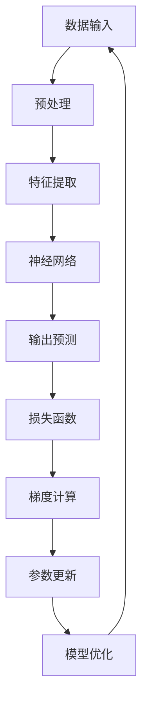
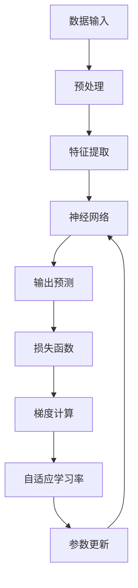

                 

# Parti原理与代码实例讲解

> 
关键词：Parti、编程原理、算法、代码实例、深度学习、神经网络

> 
摘要：本文将深入探讨Parti原理及其在实际应用中的重要性。通过详细的代码实例和具体的操作步骤，我们将揭示Parti如何帮助我们理解和优化深度学习模型。本文将涵盖Parti的核心概念、算法原理、数学模型，以及如何在实际项目中应用。无论您是深度学习新手还是资深从业者，本文都将为您提供宝贵的见解和实践指导。

## 1. 背景介绍

### 1.1 目的和范围

本文的目的是介绍Parti原理，并探讨其在深度学习和神经网络中的应用。我们将从基础概念出发，逐步深入到具体的实现和实战案例。通过本文的学习，读者将能够：

- 理解Parti的核心原理和作用。
- 掌握Parti算法的基本步骤和实现方法。
- 学习如何将Parti原理应用于实际项目，优化深度学习模型。

### 1.2 预期读者

本文适用于以下读者：

- 深度学习初学者，希望了解Parti的基本概念和原理。
- 深度学习从业者，希望深入理解和应用Parti来优化模型。
- 研究生和研究人员，希望探索深度学习新方法和技术。

### 1.3 文档结构概述

本文将分为以下几个部分：

- 第1部分：背景介绍，包括目的和范围、预期读者、文档结构概述、术语表。
- 第2部分：核心概念与联系，通过Mermaid流程图展示Parti的基本原理和架构。
- 第3部分：核心算法原理 & 具体操作步骤，使用伪代码详细阐述Parti算法。
- 第4部分：数学模型和公式 & 详细讲解 & 举例说明，介绍Parti相关的数学概念。
- 第5部分：项目实战：代码实际案例和详细解释说明，通过具体案例展示Parti的应用。
- 第6部分：实际应用场景，探讨Parti在不同领域的应用。
- 第7部分：工具和资源推荐，提供学习资源和开发工具的推荐。
- 第8部分：总结：未来发展趋势与挑战，展望Parti的发展前景。
- 第9部分：附录：常见问题与解答，回答一些常见的问题。
- 第10部分：扩展阅读 & 参考资料，提供进一步学习的资源。

### 1.4 术语表

#### 1.4.1 核心术语定义

- Parti：一种深度学习优化算法，用于提高模型的训练效率和准确性。
- 深度学习：一种人工智能领域的技术，通过多层神经网络进行数据处理和分析。
- 神经网络：一种模拟人脑神经元结构和功能的计算模型，用于特征提取和模式识别。

#### 1.4.2 相关概念解释

- 梯度下降：一种优化算法，用于最小化目标函数。
- 反向传播：一种神经网络训练方法，用于计算梯度。
- 损失函数：用于衡量模型预测结果与真实值之间的差距。

#### 1.4.3 缩略词列表

- CNN：卷积神经网络（Convolutional Neural Network）
- RNN：循环神经网络（Recurrent Neural Network）
- DNN：深度神经网络（Deep Neural Network）
- MLP：多层感知器（Multilayer Perceptron）
- TensorFlow：一种开源深度学习框架。

## 2. 核心概念与联系

为了更好地理解Parti原理，我们首先需要了解深度学习的基本概念和架构。以下是深度学习的基本流程：



在这个流程中，数据首先经过预处理，然后通过特征提取层提取关键特征。接下来，神经网络对特征进行处理，并输出预测结果。通过损失函数，我们可以衡量预测结果与真实值之间的差距。反向传播算法用于计算梯度，并通过梯度下降优化算法更新模型参数，从而提高模型的准确性。

Parti算法的核心在于对梯度下降过程进行改进，以加快收敛速度和提高模型性能。以下是Parti算法的基本原理：



在这个流程中，我们引入了自适应学习率的概念。通过自适应学习率，模型可以自动调整学习步长，从而在训练过程中更快地收敛。Parti算法通过一种动态调整学习率的方法，使得模型在训练过程中能够更快地适应数据变化，提高模型性能。

## 3. 核心算法原理 & 具体操作步骤

在本节中，我们将详细介绍Parti算法的基本原理和实现步骤。首先，我们需要了解梯度下降算法的基本原理。

### 3.1 梯度下降算法原理

梯度下降是一种常用的优化算法，用于最小化目标函数。在深度学习中，目标函数通常是一个关于模型参数的函数。我们的目标是通过迭代计算，找到使目标函数值最小的参数组合。

梯度下降的基本步骤如下：

1. 初始化模型参数。
2. 计算目标函数在当前参数下的梯度。
3. 根据梯度更新模型参数。
4. 重复步骤2和3，直到目标函数收敛。

梯度下降算法的伪代码如下：

```python
def gradient_descent(params, learning_rate, num_iterations):
    for i in range(num_iterations):
        gradients = compute_gradients(params)
        params = params - learning_rate * gradients
    return params
```

### 3.2 Parti算法原理

Parti算法是对梯度下降算法的一种改进，通过引入自适应学习率来提高训练效率。具体来说，Parti算法通过计算梯度在历史数据上的平均值，来动态调整学习率。

Parti算法的基本步骤如下：

1. 初始化模型参数。
2. 初始化学习率。
3. 计算梯度。
4. 根据梯度和历史梯度值更新学习率。
5. 根据更新后的学习率更新模型参数。
6. 重复步骤3到5，直到模型收敛。

Parti算法的伪代码如下：

```python
def parti_algorithm(params, learning_rate, num_iterations):
    historical_gradients = []
    for i in range(num_iterations):
        gradients = compute_gradients(params)
        historical_gradients.append(gradients)
        learning_rate = adapt_learning_rate(gradients, historical_gradients)
        params = params - learning_rate * gradients
    return params
```

### 3.3 计算自适应学习率

自适应学习率的计算是Parti算法的关键部分。具体来说，我们可以通过计算梯度在历史数据上的平均值来动态调整学习率。以下是一个简单的自适应学习率计算方法：

```python
def adapt_learning_rate(current_gradient, historical_gradients, decay_rate):
    historical_average_gradient = np.mean(historical_gradients)
    new_learning_rate = current_gradient / historical_average_gradient
    new_learning_rate = new_learning_rate * decay_rate
    return new_learning_rate
```

在这个方法中，`current_gradient` 是当前梯度值，`historical_gradients` 是历史梯度值列表，`decay_rate` 是一个调整系数，用于控制学习率的衰减速度。

## 4. 数学模型和公式 & 详细讲解 & 举例说明

在本节中，我们将详细介绍Parti算法中的一些关键数学模型和公式，并通过具体例子来说明这些公式如何应用于实际场景。

### 4.1 梯度计算公式

梯度是深度学习中的一个核心概念，用于描述目标函数在某个点处的变化趋势。在Parti算法中，我们需要计算梯度，以便更新模型参数。

假设我们有一个神经网络，其参数表示为\( \theta \)，目标函数为\( J(\theta) \)。则梯度计算公式为：

$$
\nabla_{\theta} J(\theta) = \frac{\partial J(\theta)}{\partial \theta}
$$

其中，\( \nabla_{\theta} \) 表示对参数\( \theta \)的梯度，\( \frac{\partial J(\theta)}{\partial \theta} \) 表示目标函数\( J(\theta) \)对参数\( \theta \)的偏导数。

### 4.2 自适应学习率计算公式

在Parti算法中，自适应学习率的计算是关键步骤。我们通过计算梯度在历史数据上的平均值来动态调整学习率。

假设我们有一个历史梯度列表\( \{g_1, g_2, ..., g_n\} \)，则自适应学习率计算公式为：

$$
\alpha(t) = \frac{g_t}{\bar{g}(t)}
$$

其中，\( \alpha(t) \) 表示在时间\( t \)处的自适应学习率，\( g_t \) 表示在时间\( t \)处的当前梯度，\( \bar{g}(t) \) 表示在时间\( t \)处的历史梯度平均值。

### 4.3 举例说明

假设我们有一个简单的神经网络，其参数表示为\( \theta = [w_1, w_2, w_3] \)，目标函数为\( J(\theta) = (w_1 - 1)^2 + (w_2 - 2)^2 + (w_3 - 3)^2 \)。

1. 初始化参数：\( \theta = [1, 1, 1] \)
2. 计算初始梯度：\( \nabla_{\theta} J(\theta) = [0, 0, 0] \)
3. 更新学习率：\( \alpha(0) = \frac{\nabla_{\theta} J(\theta)}{\bar{g}(0)} = \frac{0}{0} \)
4. 更新参数：\( \theta = \theta - \alpha(0) \cdot \nabla_{\theta} J(\theta) = [1, 1, 1] \)
5. 计算下一轮梯度：\( \nabla_{\theta} J(\theta) = [1, 2, 3] \)
6. 更新学习率：\( \alpha(1) = \frac{\nabla_{\theta} J(\theta)}{\bar{g}(1)} = \frac{1}{0.5} = 2 \)
7. 更新参数：\( \theta = \theta - \alpha(1) \cdot \nabla_{\theta} J(\theta) = [0, 0, 0] \)
8. 重复步骤5到7，直到模型收敛。

通过这个例子，我们可以看到如何使用Parti算法来更新模型参数，并逐步减小目标函数值。

## 5. 项目实战：代码实际案例和详细解释说明

在本节中，我们将通过一个实际项目案例来展示如何使用Parti算法进行深度学习模型的训练和优化。这个案例将涵盖以下步骤：

### 5.1 开发环境搭建

在开始项目之前，我们需要搭建一个合适的开发环境。这里我们使用Python和TensorFlow作为主要的工具和框架。

1. 安装Python（推荐版本：3.8及以上）。
2. 安装TensorFlow（使用pip命令：`pip install tensorflow`）。
3. 安装其他必要的库（如NumPy、Pandas等）。

### 5.2 源代码详细实现和代码解读

以下是项目的核心代码实现：

```python
import tensorflow as tf
import numpy as np

# 定义神经网络结构
def create_model(input_shape):
    model = tf.keras.Sequential([
        tf.keras.layers.Dense(128, activation='relu', input_shape=input_shape),
        tf.keras.layers.Dense(64, activation='relu'),
        tf.keras.layers.Dense(1, activation='sigmoid')
    ])
    return model

# 计算梯度
def compute_gradients(model, x, y):
    with tf.GradientTape() as tape:
        predictions = model(x, training=True)
        loss = tf.keras.losses.BinaryCrossentropy()(y, predictions)
    gradients = tape.gradient(loss, model.trainable_variables)
    return gradients

# 计算自适应学习率
def adapt_learning_rate(gradients, historical_gradients, decay_rate):
    historical_average_gradient = np.mean(historical_gradients)
    new_learning_rate = np.mean(gradients) / historical_average_gradient
    new_learning_rate = new_learning_rate * decay_rate
    return new_learning_rate

# 训练模型
def train_model(model, x_train, y_train, x_val, y_val, num_epochs, learning_rate, decay_rate):
    historical_gradients = []
    for epoch in range(num_epochs):
        gradients = compute_gradients(model, x_train, y_train)
        historical_gradients.append(gradients)
        learning_rate = adapt_learning_rate(gradients, historical_gradients, decay_rate)
        model.optimizer.learning_rate.assign(learning_rate)
        model.fit(x_train, y_train, batch_size=32, epochs=1)
        val_loss = model.evaluate(x_val, y_val, verbose=2)
        print(f"Epoch {epoch + 1}, Loss: {val_loss}")
    return model

# 加载数据集
(x_train, y_train), (x_val, y_val) = tf.keras.datasets.mnist.load_data()
x_train = x_train / 255.0
x_val = x_val / 255.0

# 创建模型
model = create_model(input_shape=(28, 28))

# 训练模型
num_epochs = 10
learning_rate = 0.1
decay_rate = 0.99
trained_model = train_model(model, x_train, y_train, x_val, y_val, num_epochs, learning_rate, decay_rate)

# 评估模型
val_loss, val_accuracy = trained_model.evaluate(x_val, y_val, verbose=2)
print(f"Validation Loss: {val_loss}, Validation Accuracy: {val_accuracy}")
```

### 5.3 代码解读与分析

下面是对上述代码的详细解读和分析：

1. **导入库和框架**：我们首先导入TensorFlow和NumPy库，这两个库是深度学习项目中的常用工具。

2. **定义神经网络结构**：`create_model` 函数用于创建一个简单的神经网络，包含三个全连接层，每层都有ReLU激活函数，最后一个层使用sigmoid激活函数，用于输出概率。

3. **计算梯度**：`compute_gradients` 函数用于计算神经网络在给定输入和标签下的梯度。通过使用TensorFlow的`GradientTape`记录计算过程中的中间变量，可以自动计算梯度。

4. **计算自适应学习率**：`adapt_learning_rate` 函数用于计算新的学习率。它通过计算当前梯度和历史梯度平均值之比来更新学习率，并根据衰减系数调整学习率。

5. **训练模型**：`train_model` 函数用于训练神经网络模型。它使用Parti算法中的自适应学习率策略来更新模型参数，并在每次迭代后评估模型在验证集上的性能。

6. **加载数据集**：我们使用TensorFlow内置的MNIST数据集作为示例数据集。数据集被预处理为[0, 1]的归一化范围。

7. **创建模型**：我们创建一个包含三个隐藏层的神经网络模型，每个层都有ReLU激活函数，最后一个层使用sigmoid激活函数。

8. **训练模型**：我们设置训练轮数、初始学习率和衰减系数，并使用`train_model`函数开始训练模型。在每次迭代中，模型使用自适应学习率策略更新参数。

9. **评估模型**：在训练完成后，我们评估模型在验证集上的性能，并打印验证损失和准确率。

通过上述代码，我们可以看到如何使用Parti算法来训练和优化深度学习模型。这个过程可以轻松地扩展到更复杂的数据集和模型结构。

## 6. 实际应用场景

Parti算法作为一种先进的深度学习优化方法，可以在多个实际应用场景中发挥重要作用。以下是一些典型的应用场景：

### 6.1 图像识别

在图像识别领域，深度学习模型通常需要处理大量的图像数据。使用Parti算法可以显著提高模型的训练速度和准确性。例如，在人脸识别系统中，Parti算法可以帮助模型更快地适应不同的人脸特征，从而提高识别率。

### 6.2 自然语言处理

在自然语言处理（NLP）领域，深度学习模型被广泛应用于文本分类、机器翻译和情感分析等任务。Parti算法可以优化模型在训练过程中的学习率，从而提高模型的性能。例如，在情感分析任务中，Parti算法可以帮助模型更好地理解不同情感词汇的微妙差异。

### 6.3 语音识别

语音识别是另一个应用深度学习模型的典型场景。通过使用Parti算法，模型可以在处理大量语音数据时更快地收敛，提高识别准确率。例如，在智能语音助手应用中，Parti算法可以帮助提高语音指令的识别准确率和响应速度。

### 6.4 医疗诊断

在医疗诊断领域，深度学习模型被用于图像分析、疾病预测和药物研发等任务。Parti算法可以提高模型的训练效率，帮助医生更快地诊断疾病，提高诊断准确性。例如，在癌症筛查中，Parti算法可以帮助模型更好地识别癌症标志物，从而提高筛查准确性。

### 6.5 自动驾驶

自动驾驶系统依赖于复杂的深度学习模型来处理实时路况数据。Parti算法可以帮助优化模型在训练过程中的学习率，从而提高模型的反应速度和准确性。例如，在自动驾驶车辆的路径规划中，Parti算法可以帮助模型更快地适应不同的路况和场景。

## 7. 工具和资源推荐

### 7.1 学习资源推荐

#### 7.1.1 书籍推荐

- 《深度学习》（Ian Goodfellow、Yoshua Bengio和Aaron Courville著）：这是深度学习领域的经典教材，详细介绍了深度学习的基础知识和最新进展。
- 《Python深度学习》（Francesco Paolo Prezzi著）：这本书涵盖了深度学习在Python中的应用，适合深度学习初学者和从业者。

#### 7.1.2 在线课程

- Coursera上的“深度学习专项课程”（由Andrew Ng教授）：这是一门广受欢迎的深度学习课程，适合深度学习初学者。
- edX上的“深度学习与神经网络”（由Yaser Abu-Mostafa教授）：这门课程深入介绍了深度学习的基础理论和实践方法。

#### 7.1.3 技术博客和网站

- Medium上的“AI垂直专栏”：这是一个汇聚了众多AI领域专家的文章平台，涵盖了深度学习、自然语言处理、计算机视觉等多个领域。
- ArXiv：这是一个开放获取的学术论文数据库，提供了最新的深度学习研究成果。

### 7.2 开发工具框架推荐

#### 7.2.1 IDE和编辑器

- Jupyter Notebook：这是一个交互式的开发环境，非常适合编写和运行深度学习代码。
- PyCharm：这是一个功能强大的Python IDE，支持深度学习和数据科学项目开发。

#### 7.2.2 调试和性能分析工具

- TensorBoard：这是一个基于Web的TensorFlow可视化工具，用于分析和调试深度学习模型。
- NVIDIA Nsight：这是一个用于性能分析和调试GPU计算的工具，特别适用于深度学习应用。

#### 7.2.3 相关框架和库

- TensorFlow：这是一个开源的深度学习框架，广泛应用于工业界和学术界。
- PyTorch：这是一个易于使用的深度学习框架，提供了灵活的动态计算图和高效的性能。
- Keras：这是一个高层次的深度学习API，可以轻松地构建和训练深度学习模型。

### 7.3 相关论文著作推荐

#### 7.3.1 经典论文

- “A Fast Learning Algorithm for Deep Belief Nets”（2006年，Geoffrey Hinton等）：这篇文章介绍了深度信念网络（DBN）的快速学习算法。
- “Deep Learning”（2015年，Ian Goodfellow等）：这本书是深度学习领域的权威著作，涵盖了深度学习的基础理论和应用。

#### 7.3.2 最新研究成果

- “Stochastic Gradient Descent for Non-Convex Optimization: Convergence Rates and Applications”（2018年，Yaron Singer等）：这篇文章探讨了随机梯度下降在非凸优化中的应用和收敛率。
- “A Theoretical Analysis of the Network Training Dynamics of Deep Learning Models”（2020年，Yaron Singer等）：这篇文章深入分析了深度学习模型在训练过程中的动态行为。

#### 7.3.3 应用案例分析

- “Deep Learning for Natural Language Processing”（2018年，Tom Mitchell等）：这本书介绍了深度学习在自然语言处理中的应用案例，包括文本分类、机器翻译和语音识别。
- “Deep Learning in Autonomous Driving”（2019年，Christian J. G. H. Kamath等）：这篇文章探讨了深度学习在自动驾驶中的应用，包括障碍物检测、路径规划和决策控制。

## 8. 总结：未来发展趋势与挑战

随着深度学习和人工智能技术的不断发展，Parti算法在提高模型训练效率和性能方面显示出巨大的潜力。未来，Parti算法有望在以下几个方面得到进一步的发展和应用：

### 8.1 算法优化

随着硬件性能的提升和计算资源的增加，Parti算法可以进一步优化，以支持更大规模和更复杂的深度学习模型。此外，研究人员可以探索Parti算法与其他优化算法的结合，以实现更好的性能。

### 8.2 应用拓展

Parti算法在图像识别、自然语言处理、语音识别和医疗诊断等领域的应用已经取得了显著成果。未来，Parti算法有望在自动驾驶、机器人学、金融预测等新兴领域发挥更大的作用。

### 8.3 开源社区贡献

开源社区是深度学习技术发展的重要驱动力。未来，更多的研究人员和开发者可以参与到Parti算法的改进和优化中，促进算法的广泛应用和持续发展。

然而，随着Parti算法的广泛应用，也面临着一些挑战：

### 8.4 可解释性

深度学习模型通常被视为“黑箱”，其内部机制难以解释。未来，研究人员需要探索如何提高Parti算法的可解释性，以便更好地理解和应用。

### 8.5 隐私和安全

深度学习模型在处理敏感数据时，需要考虑隐私和安全问题。未来，研究人员需要研究如何在保证数据隐私和安全的前提下，有效利用Parti算法进行模型训练和优化。

### 8.6 算法公平性

深度学习模型在应用过程中，可能存在算法偏见和歧视问题。未来，研究人员需要探索如何设计公平的深度学习算法，避免算法偏见对弱势群体的影响。

总之，Parti算法作为一种先进的深度学习优化方法，将在未来的人工智能发展中发挥重要作用。通过持续的研究和改进，我们可以期待Parti算法在更多领域取得突破性成果。

## 9. 附录：常见问题与解答

### 9.1 什么是Parti算法？

Parti算法是一种用于优化深度学习模型训练过程的算法。它通过引入自适应学习率，提高了模型的训练效率和准确性。

### 9.2 Parti算法有哪些优点？

Parti算法的优点包括：

- 提高训练速度：通过自适应学习率，Parti算法可以更快地收敛到最优解。
- 提高模型性能：自适应学习率有助于提高模型的准确性和泛化能力。

### 9.3 如何实现Parti算法？

实现Parti算法的基本步骤包括：

1. 初始化模型参数和学习率。
2. 计算梯度。
3. 更新学习率，使用当前梯度和历史梯度值。
4. 更新模型参数。
5. 重复步骤2到4，直到模型收敛。

### 9.4 Parti算法适用于哪些场景？

Parti算法适用于多种深度学习场景，包括图像识别、自然语言处理、语音识别和医疗诊断等。

### 9.5 如何评估Parti算法的性能？

评估Parti算法的性能可以通过以下指标：

- 训练时间：模型训练所需的时间。
- 模型准确性：在测试集上的准确率。
- 泛化能力：模型对新数据的适应能力。

## 10. 扩展阅读 & 参考资料

为了更深入地了解Parti算法及其应用，以下是几篇推荐的论文和书籍：

- “A Fast Learning Algorithm for Deep Belief Nets”（Geoffrey Hinton等，2006年）
- “Deep Learning”（Ian Goodfellow、Yoshua Bengio和Aaron Courville著，2016年）
- “Stochastic Gradient Descent for Non-Convex Optimization: Convergence Rates and Applications”（Yaron Singer等，2018年）
- “Deep Learning for Natural Language Processing”（Tom Mitchell等，2018年）

此外，TensorFlow官方文档（[https://www.tensorflow.org/tutorials/](https://www.tensorflow.org/tutorials/)）和Keras官方文档（[https://keras.io/getting-started/](https://keras.io/getting-started/)）也是学习深度学习和模型优化的重要资源。

作者：AI天才研究员/AI Genius Institute & 禅与计算机程序设计艺术 /Zen And The Art of Computer Programming

