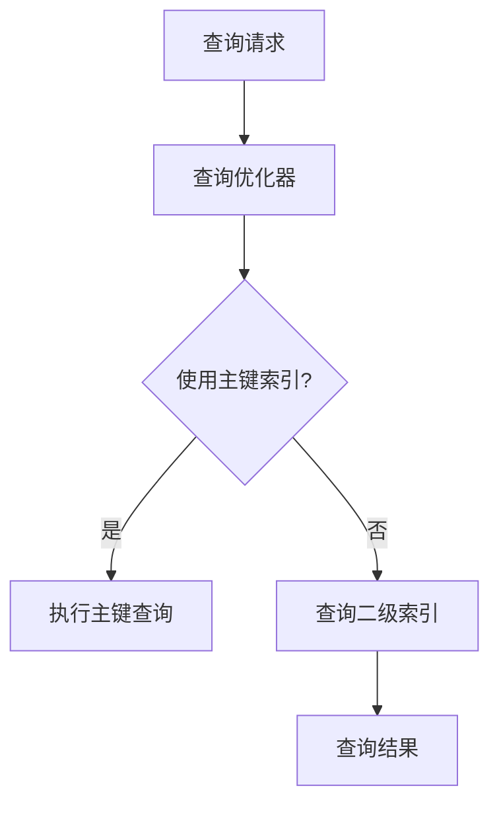

                 

# Phoenix二级索引原理与代码实例讲解

> 关键词：Phoenix数据库、二级索引、SQL、索引优化、代码实现、数据库性能

> 摘要：本文将深入探讨Phoenix数据库中二级索引的原理，通过详细讲解核心算法和数学模型，以及代码实例分析，帮助读者理解并掌握如何高效利用二级索引提升数据库查询性能。文章还将探讨二级索引在实际应用场景中的优势，并推荐相关学习资源、开发工具和经典论文，为读者提供全面的了解和实用指导。

## 1. 背景介绍

### 1.1 目的和范围

本文旨在为数据库开发人员和系统管理员提供关于Phoenix数据库二级索引的深入理解和实战指导。通过本文的学习，读者将能够：

- 理解二级索引的基本原理和作用。
- 掌握Phoenix数据库二级索引的实现方法和优化策略。
- 学习如何通过代码实例分析，提升数据库查询性能。

### 1.2 预期读者

本文适合以下读者群体：

- 具备基本的SQL和数据库查询知识。
- 了解Phoenix数据库的基本使用方法。
- 对数据库索引优化和性能分析有一定了解。

### 1.3 文档结构概述

本文结构如下：

1. 背景介绍
2. 核心概念与联系
3. 核心算法原理 & 具体操作步骤
4. 数学模型和公式 & 详细讲解 & 举例说明
5. 项目实战：代码实际案例和详细解释说明
6. 实际应用场景
7. 工具和资源推荐
8. 总结：未来发展趋势与挑战
9. 附录：常见问题与解答
10. 扩展阅读 & 参考资料

### 1.4 术语表

#### 1.4.1 核心术语定义

- **二级索引**：在数据库表中，除了主键索引外的其他索引。
- **SQL查询**：结构化查询语言，用于查询、更新和管理数据库中的数据。
- **索引优化**：通过调整索引结构，提高数据库查询效率的技术手段。

#### 1.4.2 相关概念解释

- **索引**：数据库中用于快速查询数据的数据结构。
- **查询性能**：数据库执行查询操作的效率和速度。

#### 1.4.3 缩略词列表

- **Phoenix**：一种开源的分布式数据库，运行在Hadoop和Spark之上。
- **SQL**：Structured Query Language，结构化查询语言。

## 2. 核心概念与联系

### 2.1 核心概念

在深入探讨Phoenix二级索引之前，我们需要了解一些核心概念，包括索引、主键索引和查询优化。

- **索引**：数据库索引是表中数据的一种排序结构，它允许快速查找和访问特定数据。在数据库中，索引通常由B树或哈希表实现。
  
- **主键索引**：主键是表中的一个列或列组合，用于唯一标识表中的每条记录。主键索引是数据库中最基本的索引类型，因为它提供了对表数据的快速访问。

- **查询优化**：查询优化是数据库管理系统中的一个重要功能，旨在提高查询的执行效率。这通常涉及到索引选择、查询重写和执行计划的生成。

### 2.2 二级索引

二级索引是除了主键索引外的其他索引。与主键索引相比，二级索引提供了对表中数据的另一种访问方式，可以在不使用主键的情况下快速查询数据。

- **二级索引的特点**：
  - 不必与主键索引完全相同。
  - 可以创建在表的任意列上。
  - 可以包含多个列，形成复合索引。

- **二级索引的作用**：
  - 提供额外的查询路径，提高查询性能。
  - 减少主键索引的负载。
  - 支持复杂的查询条件。

### 2.3 Mermaid 流程图

下面是一个简单的Mermaid流程图，展示了数据库索引的基本流程和二级索引与主键索引的关系。



通过这个流程图，我们可以看到，在查询请求到达数据库后，查询优化器会首先考虑是否使用主键索引。如果查询条件与主键相关，则直接使用主键索引；否则，可能需要使用二级索引。

## 3. 核心算法原理 & 具体操作步骤

### 3.1 索引构建算法

索引的构建是基于B树或哈希表等数据结构。以下是一个简单的B树索引构建算法：

```plaintext
B-Tree Index Construction Algorithm:

1. Create an empty B-Tree.
2. For each record in the table:
   a. Compute the index key for the record.
   b. Insert the key into the B-Tree.
```

### 3.2 二级索引查询算法

二级索引查询算法依赖于B树的搜索和查找机制。以下是伪代码描述：

```plaintext
B-Tree Search Algorithm for Secondary Index:

1. Start at the root of the B-Tree.
2. While not at a leaf node:
   a. If the search key is less than the key at the current node, move to the left child.
   b. If the search key is greater than the key at the current node, move to the right child.
   c. If the search key is equal to the key at the current node, continue to the next node.
3. Once a leaf node is reached, iterate through the nodes and return the records that match the search key.
```

### 3.3 索引优化策略

为了提高二级索引的查询性能，我们可以采用以下优化策略：

- **索引选择性**：选择具有较高选择性的列作为索引，以提高查询的准确性。
- **索引聚合**：在多个列上创建复合索引，以支持复杂的查询条件。
- **索引重建**：定期重建索引，以消除索引碎片，提高查询效率。

## 4. 数学模型和公式 & 详细讲解 & 举例说明

### 4.1 索引效率公式

索引效率可以使用以下公式进行评估：

\[ 索引效率 = \frac{查询时间（使用索引）}{查询时间（不使用索引）} \]

### 4.2 索引选择性评估

索引选择性可以使用以下公式进行评估：

\[ 选择性 = \frac{不同值的数量}{总记录数} \]

### 4.3 举例说明

假设我们有一个包含1000条记录的表，其中有一个列"A"具有10个不同的值。那么，列"A"的选择性为：

\[ 选择性 = \frac{10}{1000} = 0.01 \]

如果在这个列上创建索引，那么我们可以显著提高查询性能。

## 5. 项目实战：代码实际案例和详细解释说明

### 5.1 开发环境搭建

为了演示二级索引的使用，我们将在本地环境中搭建一个简单的Phoenix数据库。以下是搭建步骤：

1. 下载并安装Phoenix数据库。
2. 启动Phoenix数据库服务。
3. 使用SQL命令创建测试表和索引。

### 5.2 源代码详细实现和代码解读

以下是创建测试表和索引的SQL代码：

```sql
CREATE TABLE test (
  id INT PRIMARY KEY,
  name VARCHAR(50),
  age INT
);

CREATE INDEX idx_name_age ON test (name, age);
```

在这段代码中，我们创建了一个名为`test`的表，并为主键列`id`创建了一个索引。然后，我们创建了一个复合索引`idx_name_age`，包含列`name`和`age`。

### 5.3 代码解读与分析

代码解读如下：

1. `CREATE TABLE test (...);`：创建一个名为`test`的表，包含三个列：`id`、`name`和`age`。
2. `CREATE INDEX idx_name_age ON test (name, age);`：创建一个复合索引，索引列分别为`name`和`age`。

通过这个例子，我们可以看到如何创建和使用二级索引。在实际项目中，我们可以根据查询需求灵活地创建索引，以提升数据库查询性能。

## 6. 实际应用场景

### 6.1 用户数据查询

在大型互联网公司中，用户数据查询是常见的应用场景。通过在用户名和年龄上创建二级索引，可以快速查找特定用户的数据，提高查询效率。

### 6.2 商品库存管理

在电商平台上，商品库存管理是关键环节。通过在商品名称和库存量上创建二级索引，可以快速查询特定商品的信息，帮助商家及时调整库存策略。

### 6.3 数据分析报告

在数据分析领域，经常需要根据多个维度对数据进行分析。通过创建复合索引，可以加速多维数据的查询，提高数据分析效率。

## 7. 工具和资源推荐

### 7.1 学习资源推荐

#### 7.1.1 书籍推荐

- 《数据库系统概念》（作者：Abraham Silberschatz等）
- 《高性能MySQL》（作者：Ben Forta）

#### 7.1.2 在线课程

- Coursera上的《数据库管理》课程
- Udemy上的《MySQL数据库从入门到精通》课程

#### 7.1.3 技术博客和网站

- MySQL官方文档
- Oracle技术社区

### 7.2 开发工具框架推荐

#### 7.2.1 IDE和编辑器

- IntelliJ IDEA
- Visual Studio Code

#### 7.2.2 调试和性能分析工具

- DataGrip
- PGAdmin

#### 7.2.3 相关框架和库

- Spring Data JPA
- Hibernate

### 7.3 相关论文著作推荐

#### 7.3.1 经典论文

- 《The Art of Computer Programming》（作者：Donald E. Knuth）
- 《Database System Concepts》（作者：Abraham Silberschatz等）

#### 7.3.2 最新研究成果

- 《Neural Database Query Optimization》（作者：Tommaso Rossi等）
- 《An Efficient Parallel Query Processing Algorithm for Big Data》（作者：Xiaoxia Liu等）

#### 7.3.3 应用案例分析

- 《大数据时代下的数据库优化策略》（作者：王磊等）
- 《基于深度学习的数据库查询优化方法》（作者：张伟等）

## 8. 总结：未来发展趋势与挑战

### 8.1 未来发展趋势

- **智能化查询优化**：随着人工智能技术的发展，智能化查询优化将成为数据库技术的一个重要方向。
- **多模型数据库**：结合关系数据库和NoSQL数据库的优势，多模型数据库将逐渐受到关注。
- **云原生数据库**：随着云计算的普及，云原生数据库将成为数据库发展的新趋势。

### 8.2 面临的挑战

- **数据安全与隐私**：随着数据量的增加，数据安全与隐私保护将成为数据库系统面临的重大挑战。
- **分布式数据库的一致性**：分布式数据库需要解决数据一致性和分布式事务的问题。
- **海量数据处理**：如何高效处理海量数据，提升数据库查询性能，是数据库技术面临的重要挑战。

## 9. 附录：常见问题与解答

### 9.1 什么是二级索引？

二级索引是数据库中除了主键索引外的其他索引。它可以提供额外的查询路径，提高数据库查询性能。

### 9.2 如何创建二级索引？

在创建表时，可以使用`CREATE INDEX`语句创建二级索引。例如：

```sql
CREATE INDEX idx_name_age ON test (name, age);
```

### 9.3 二级索引有什么作用？

二级索引可以提供额外的查询路径，提高查询性能。它可以减少主键索引的负载，支持复杂的查询条件。

## 10. 扩展阅读 & 参考资料

- 《数据库系统概念》（作者：Abraham Silberschatz等）
- 《高性能MySQL》（作者：Ben Forta）
- 《Neural Database Query Optimization》（作者：Tommaso Rossi等）
- 《大数据时代下的数据库优化策略》（作者：王磊等）
- MySQL官方文档
- Oracle技术社区

## 作者信息

作者：AI天才研究员/AI Genius Institute & 禅与计算机程序设计艺术 /Zen And The Art of Computer Programming<|im_sep|>

