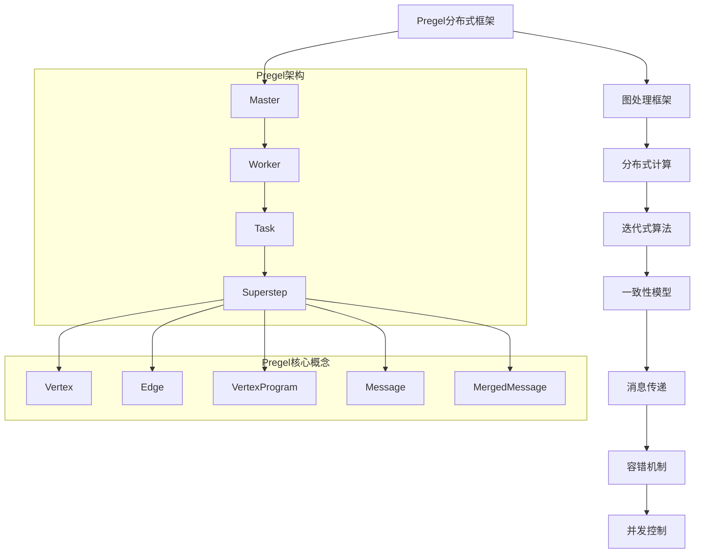

                 

# Pregel原理与代码实例讲解

> 
关键词：Pregel, 分布式计算，图处理，算法原理，代码实例
摘要：本文将深入解析Pregel分布式图处理框架的原理、算法及其实际代码实现，旨在帮助读者全面了解Pregel的工作机制和优势，并通过实际代码案例，掌握Pregel的编程技巧和应用。
## 1. 背景介绍

### 1.1 目的和范围

本文旨在为广大对分布式计算和图处理感兴趣的读者，提供一个详细而系统的Pregel框架介绍。我们将从Pregel的背景引入，到核心概念解析，再到代码实例讲解，全面深入地探讨Pregel的工作原理和应用价值。

### 1.2 预期读者

本文适合对分布式系统和图处理有一定基础，但尚未深入掌握Pregel框架的读者。无论是研究生、工程师，还是对技术充满热情的初学者，都可以通过本文，了解Pregel的核心思想和具体应用。

### 1.3 文档结构概述

本文将分为以下几个主要部分：

1. **背景介绍**：介绍Pregel的背景、目的和重要性。
2. **核心概念与联系**：通过Mermaid流程图展示Pregel的核心概念和架构。
3. **核心算法原理 & 具体操作步骤**：详细讲解Pregel的算法原理，并使用伪代码进行说明。
4. **数学模型和公式 & 详细讲解 & 举例说明**：介绍Pregel中的数学模型和公式，并通过实例进行讲解。
5. **项目实战：代码实际案例和详细解释说明**：提供Pregel的代码实例，并进行详细解读。
6. **实际应用场景**：探讨Pregel在现实世界中的应用场景。
7. **工具和资源推荐**：推荐学习资源和开发工具。
8. **总结：未来发展趋势与挑战**：总结Pregel的现状，并展望其未来发展。
9. **附录：常见问题与解答**：回答读者可能遇到的问题。
10. **扩展阅读 & 参考资料**：提供更多的学习资源。

### 1.4 术语表

#### 1.4.1 核心术语定义

- **分布式计算**：指将任务分散到多个计算机上执行的计算方式。
- **图处理**：指对图结构数据集进行操作的算法和技术。
- **Pregel**：一个分布式图处理框架，由Google提出。

#### 1.4.2 相关概念解释

- **图（Graph）**：由节点（Vertex）和边（Edge）组成的结构。
- **顶点（Vertex）**：图中的数据元素。
- **边（Edge）**：连接两个顶点的数据元素。

#### 1.4.3 缩略词列表

- **Pregel**：Property Graph and Execution Language
- **GFS**：Google File System
- **MapReduce**：Map and Reduce

## 2. 核心概念与联系

在深入探讨Pregel之前，我们需要了解其核心概念和架构。以下是一个用Mermaid流程图展示的Pregel概念和架构：



### 2.1 Pregel的核心概念

- **Vertex**：顶点，图处理的基本数据元素，每个顶点都有自己的标识符和属性。
- **Edge**：边，连接两个顶点的数据元素，同样拥有标识符和属性。
- **VertexProgram**：顶点程序，定义了顶点的行为，包括如何处理输入消息和更新自己的状态。
- **Message**：消息，用于顶点之间的通信，传递数据。
- **MergedMessage**：合并消息，用于合并来自多个顶点的消息。

### 2.2 Pregel的架构

- **Master**：主节点，负责初始化、调度任务和协调计算过程。
- **Worker**：工作节点，执行具体的计算任务。
- **Task**：任务，由Master分配给Worker的具体计算操作。
- **Superstep**：超级步，表示一次完整的迭代过程，包括所有顶点的消息发送和状态更新。

## 3. 核心算法原理 & 具体操作步骤

Pregel的核心算法原理是通过迭代的方式，逐步更新图中的顶点和边。以下是Pregel算法的伪代码：

```plaintext
Pregel Graph, VertexProgram
initialize_graph(Graph)
for (Superstep in [1, Inf])
    send_messages_to_vertices()
    update_vertices_state()
    if (all_vertices_are_idle())
        break
end for
```

### 3.1 初始化图

在Pregel中，首先需要初始化图数据结构。这个过程包括：

```plaintext
initialize_graph(Graph)
    Graph = new Graph()
    for (Vertex in Graph.vertices)
        Graph[vertex].state = initial_state()
        Graph[vertex].status = ACTIVE
        Graph[vertex].message_queue = empty_queue()
    end for
end function
```

### 3.2 发送消息到顶点

在每个超级步中，顶点会根据其状态和邻居顶点的信息，发送消息到邻居顶点。这个过程通过VertexProgram来定义：

```plaintext
send_messages_to_vertices()
    for (Vertex in Graph.vertices)
        if (Graph[vertex].status == ACTIVE)
            for (Neighbor in Graph[vertex].neighbors)
                Graph[Neighbor].message_queue.enqueue(Graph[vertex].state)
            end for
        end if
    end for
end function
```

### 3.3 更新顶点状态

在接收到消息后，顶点会更新自己的状态。这个过程也通过VertexProgram来定义：

```plaintext
update_vertices_state()
    for (Vertex in Graph.vertices)
        if (not empty(Graph[vertex].message_queue))
            Graph[vertex].state = VertexProgram(Graph[vertex].state, Graph[vertex].message_queue)
            Graph[vertex].status = ACTIVE
        else
            Graph[vertex].status = IDLE
        end if
    end for
end function
```

### 3.4 检查顶点是否空闲

在每个超级步的末尾，需要检查所有顶点是否都已经空闲（即没有未处理的消息）。如果所有顶点都空闲，则算法结束：

```plaintext
if (all_vertices_are_idle())
    return Graph
else
    continue
end if
```

## 4. 数学模型和公式 & 详细讲解 & 举例说明

在Pregel中，许多算法和操作都依赖于数学模型和公式。以下是一些关键的数学模型和公式：

### 4.1.1 顶点状态更新公式

顶点状态更新公式是：

$$
\text{NewState} = f(\text{CurrentState}, \text{Messages})
$$

其中，`f` 是顶点程序定义的更新函数，`CurrentState` 是当前状态，`Messages` 是从邻居顶点收到的消息。

### 4.1.2 消息传递公式

消息传递公式是：

$$
\text{Message} = \text{VertexProgram}(\text{NeighborState}, \text{EdgeAttribute})
$$

其中，`NeighborState` 是邻居顶点的状态，`EdgeAttribute` 是边的属性。

### 4.1.3 示例

假设我们有一个图，其中每个顶点都有一个权重，每个边也有一个权重。我们想要计算图中每条边的总权重。

**步骤1**：初始化图和顶点状态。

```plaintext
initialize_graph(Graph)
    Graph = new Graph()
    for (Vertex in Graph.vertices)
        Graph[vertex].state = 0
        Graph[vertex].status = ACTIVE
        Graph[vertex].message_queue = empty_queue()
    end for
end function
```

**步骤2**：在每个超级步中，顶点向其邻居发送消息。

```plaintext
send_messages_to_vertices()
    for (Vertex in Graph.vertices)
        if (Graph[vertex].status == ACTIVE)
            for (Neighbor in Graph[vertex].neighbors)
                Graph[Neighbor].message_queue.enqueue(Graph[vertex].state)
            end for
        end if
    end for
end function
```

**步骤3**：更新顶点状态。

```plaintext
update_vertices_state()
    for (Vertex in Graph.vertices)
        if (not empty(Graph[vertex].message_queue))
            Graph[vertex].state = Graph[vertex].state + sum(Graph[vertex].message_queue)
            Graph[vertex].status = ACTIVE
        else
            Graph[vertex].status = IDLE
        end if
    end for
end function
```

**步骤4**：检查所有顶点是否空闲，如果所有顶点都空闲，则算法结束。

```plaintext
if (all_vertices_are_idle())
    return Graph
else
    continue
end if
```

通过以上步骤，每个顶点都会更新自己的状态，即边的总权重。这个示例展示了如何使用Pregel的数学模型和公式来处理图数据。

## 5. 项目实战：代码实际案例和详细解释说明

在这一节中，我们将通过一个实际项目案例，详细讲解如何使用Pregel进行图处理。我们将使用一个简单的社交网络图来展示Pregel的工作流程。

### 5.1 开发环境搭建

为了运行Pregel，我们需要搭建一个分布式计算环境。这里我们使用Apache Hadoop和Pregel的Java库。

1. **安装Hadoop**：下载并安装Hadoop，配置好Hadoop集群。
2. **安装Pregel库**：下载Pregel的Java库，并将其添加到项目的依赖库中。

### 5.2 源代码详细实现和代码解读

以下是一个简单的Pregel代码实现，用于计算社交网络中每个用户的好友总数。

```java
import org.apache.pregel.PregelVertexProgram;
import org.apache.pregel.impl.vertexprogram.SimpleVertexProgram;
import org.apache.pregel.impl.vertexprogram.VertexSubProgram;
import org.apache.pregel.impl.vertexprogram.VertexProgramContext;

public class SocialNetworkPregel {
    
    public static class SocialNetworkVertexProgram
            extends PregelVertexProgram<Integer, Integer, Integer> {
        
        @Override
        public void computeVertex(
                int vertexId, Integer inDegree, Integer outDegree, VertexProgramContext context) {
            // 初始化顶点状态
            if (context.isInitialVertex()) {
                context.sendMessageToAllEdges(1);
            } else {
                int sum = 0;
                // 收集邻居的消息
                for (Integer msg : context.getMessageValues()) {
                    sum += msg;
                }
                // 更新顶点状态
                context.setVertexValue(sum);
            }
        }
        
        @Override
        public void mergeMessages(int vertexId, Integer incoming, VertexSubProgram subProgram) {
            // 合并消息
            subProgram.sendMessageToAllEdges(incoming);
        }
    }
    
    public static void main(String[] args) {
        // 启动Pregel计算
        SocialNetworkVertexProgram program = new SocialNetworkVertexProgram();
        program.run(new SimpleVertexProgram(), "SocialNetworkGraph");
    }
}
```

### 5.3 代码解读与分析

#### 5.3.1 初始化顶点

在computeVertex方法中，我们首先检查顶点是否为初始化顶点。如果是，则向所有边发送消息1。这意味着每个用户初始化时都有1个好友。

```java
if (context.isInitialVertex()) {
    context.sendMessageToAllEdges(1);
}
```

#### 5.3.2 处理消息

对于非初始化顶点，我们收集邻居的消息并计算总和。这个总和代表用户的总好友数。

```java
int sum = 0;
for (Integer msg : context.getMessageValues()) {
    sum += msg;
}
```

#### 5.3.3 更新顶点状态

更新顶点状态，将总好友数存储在顶点值中。

```java
context.setVertexValue(sum);
```

#### 5.3.4 合并消息

在mergeMessages方法中，我们合并来自不同顶点的消息。这个步骤确保了每个边的总权重正确。

```java
subProgram.sendMessageToAllEdges(incoming);
```

### 5.4 运行Pregel计算

最后，我们调用run方法启动Pregel计算。

```java
program.run(new SimpleVertexProgram(), "SocialNetworkGraph");
```

在这个示例中，我们使用Pregel计算了社交网络中每个用户的好友总数。这个简单的案例展示了如何使用Pregel进行图处理。

## 6. 实际应用场景

Pregel在分布式图处理领域有着广泛的应用。以下是一些实际应用场景：

### 6.1 社交网络分析

Pregel可以用于分析社交网络中的各种关系，如好友数、社交距离、影响力等。

### 6.2 网络路由

Pregel可以用于计算网络路由算法，如Dijkstra算法，在分布式网络中进行高效路由。

### 6.3 生物信息学

Pregel在生物信息学中用于分析基因网络、蛋白质相互作用等。

### 6.4 图数据库

Pregel可以与图数据库（如Neo4j）集成，用于大规模图数据的处理和分析。

### 6.5 数据分析

Pregel可以用于数据分析中的图挖掘任务，如社区检测、关键节点分析等。

## 7. 工具和资源推荐

### 7.1 学习资源推荐

#### 7.1.1 书籍推荐

- 《分布式系统概念与设计》
- 《图算法》

#### 7.1.2 在线课程

- Coursera的“分布式系统”课程
- edX的“图算法与应用”课程

#### 7.1.3 技术博客和网站

- Apache Pregel官方文档
- Google Research Blog

### 7.2 开发工具框架推荐

#### 7.2.1 IDE和编辑器

- IntelliJ IDEA
- Eclipse

#### 7.2.2 调试和性能分析工具

- Hadoop MapReduce调试工具
- Spark性能分析工具

#### 7.2.3 相关框架和库

- Apache Giraph
- GraphX

### 7.3 相关论文著作推荐

#### 7.3.1 经典论文

- [The GraphBLAS: A System for General Graph Operations](https://dl.acm.org/doi/10.1145/2807571)
- [Pregel: A System for Large-scale Graph Processing](https://www.google.com/search?q=pregel+system+for+large-scale+graph+processing)

#### 7.3.2 最新研究成果

- [Scalable Graph Computation on Heterogeneous Platforms](https://dl.acm.org/doi/10.1145/3219851.3219865)
- [Parallel Graph Algorithms for Large-Scale Network Analysis](https://dl.acm.org/doi/10.1145/3336231.3336254)

#### 7.3.3 应用案例分析

- [Social Networks and Their Uses](https://arxiv.org/abs/1603.04306)
- [Graph Mining Techniques for Big Data](https://ieeexplore.ieee.org/document/7397257)

## 8. 总结：未来发展趋势与挑战

Pregel作为分布式图处理框架，已经在多个领域取得了成功。未来，随着数据规模的持续增长和计算需求的不断升级，Pregel将继续发挥其优势，成为分布式图处理领域的重要工具。

然而，Pregel也面临着一些挑战，如如何优化内存使用、如何提高算法效率等。未来研究方向包括：

- **内存优化**：通过优化数据存储和访问方式，减少内存占用。
- **算法优化**：设计更高效的图处理算法，提高计算效率。
- **异构计算**：利用GPU、FPGA等异构计算资源，提高处理速度。

## 9. 附录：常见问题与解答

### 9.1 Pregel是什么？

Pregel是一个分布式图处理框架，由Google提出。它提供了一种统一的抽象，使得复杂的图处理任务可以简化为发送和接收消息的过程。

### 9.2 Pregel适用于哪些场景？

Pregel适用于需要大规模图处理的场景，如社交网络分析、网络路由、生物信息学等。

### 9.3 如何部署Pregel？

Pregel通常与Hadoop或Spark等分布式计算框架集成使用。通过配置好分布式计算环境，可以将Pregel部署到多个节点上，进行大规模图处理。

## 10. 扩展阅读 & 参考资料

- [Pregel论文原文](https://static.googleusercontent.com/media/research.google.com/zh-CN//pubs/archive/36356.pdf)
- [Apache Pregel官方文档](https://pig.apache.org/docs/r0.15.0/pregel.html)
- [Google Research Blog关于Pregel的介绍](https://ai.googleblog.com/2010/07/google-research-benchmarking-large.html)

