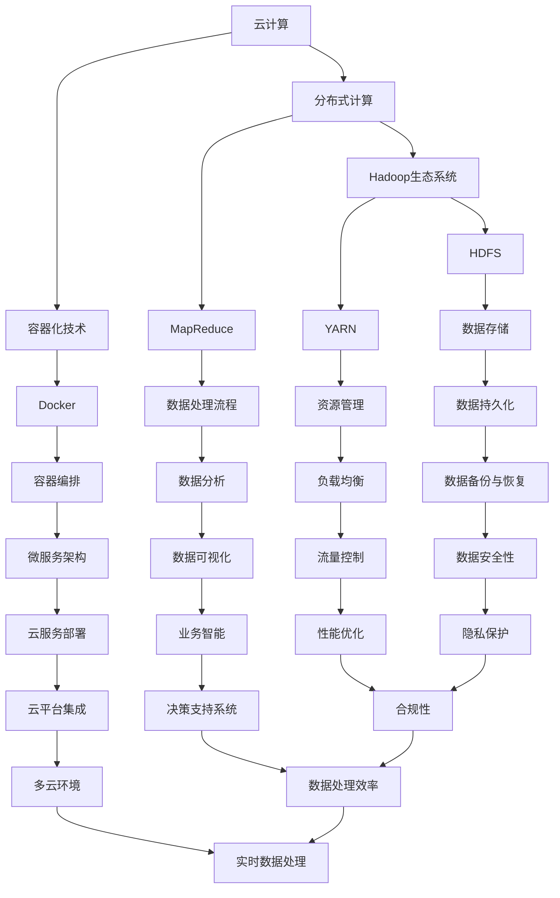

                 

# Python云计算与大数据处理入门指南：原理、工具与实战

> 关键词：Python、云计算、大数据处理、原理、工具、实战

> 摘要：本文将深入探讨Python在云计算和大数据处理领域的应用，包括核心概念、算法原理、数学模型、实战项目以及相关资源推荐。通过逐步分析，帮助读者构建完整的理解和实践能力。

## 1. 背景介绍

### 1.1 目的和范围

本文旨在为那些希望了解并掌握Python在云计算和大数据处理领域应用的开发者提供全面的入门指南。我们将探讨Python的核心优势、云计算与大数据处理的基本原理，以及如何使用Python进行数据处理和分析。

### 1.2 预期读者

本文适合以下读者：

1. 初学者：对云计算和大数据处理有一定了解，但缺乏实践经验的开发者。
2. 程序员：希望将Python应用到云计算和大数据领域的专业程序员。
3. 数据科学家：希望了解如何使用Python进行大规模数据处理的从业者。

### 1.3 文档结构概述

本文将按照以下结构展开：

1. 背景介绍
2. 核心概念与联系
3. 核心算法原理 & 具体操作步骤
4. 数学模型和公式 & 详细讲解 & 举例说明
5. 项目实战：代码实际案例和详细解释说明
6. 实际应用场景
7. 工具和资源推荐
8. 总结：未来发展趋势与挑战
9. 附录：常见问题与解答
10. 扩展阅读 & 参考资料

### 1.4 术语表

#### 1.4.1 核心术语定义

- **云计算**：通过互联网提供动态易扩展且经常是虚拟化的资源。
- **大数据处理**：从大量数据中提取有价值的信息和模式。
- **Python**：一种高级编程语言，广泛应用于数据科学、机器学习和云计算。

#### 1.4.2 相关概念解释

- **Hadoop**：一个开源框架，用于处理大规模数据。
- **Docker**：一个开源的应用容器引擎，用于自动化部署应用程序。
- **TensorFlow**：一个开源机器学习框架，用于构建和训练神经网络。

#### 1.4.3 缩略词列表

- **HDFS**：Hadoop Distributed File System
- **YARN**：Yet Another Resource Negotiator
- **Pandas**：一个Python库，用于数据操作和分析

## 2. 核心概念与联系

在云计算和大数据处理领域，有几个关键概念和联系需要理解。以下是一个Mermaid流程图，展示了这些概念之间的关系：



### 2.1 云计算概述

云计算是一种通过互联网提供动态易扩展的资源技术。它包括以下核心组成部分：

- **基础设施即服务（IaaS）**：提供虚拟化的计算资源，如虚拟机、存储和网络。
- **平台即服务（PaaS）**：提供开发平台，包括应用程序开发、运行和管理工具。
- **软件即服务（SaaS）**：提供应用程序和服务，用户通过互联网访问。

### 2.2 大数据处理概述

大数据处理涉及从大量数据中提取有价值的信息和模式。它主要包括以下几个阶段：

- **数据收集**：从各种来源收集数据。
- **数据存储**：使用分布式存储系统存储海量数据。
- **数据清洗**：处理和清理数据，以确保数据质量。
- **数据处理**：使用分布式计算框架处理数据。
- **数据挖掘**：从数据中提取有价值的信息和模式。

### 2.3 Python在云计算和大数据处理中的应用

Python因其简洁易用的特性，在云计算和大数据处理领域得到了广泛应用。以下是其主要应用场景：

- **数据处理**：使用Pandas库进行数据操作和分析。
- **分布式计算**：使用PySpark库将Python与Hadoop生态系统集成。
- **机器学习和数据分析**：使用TensorFlow和Scikit-learn库进行模型训练和预测。
- **容器化技术**：使用Docker进行应用程序的容器化部署。

## 3. 核心算法原理 & 具体操作步骤

### 3.1 MapReduce算法原理

MapReduce是一种分布式数据处理框架，由Google提出。它将大规模数据处理任务分解为两个阶段：Map阶段和Reduce阶段。

- **Map阶段**：将输入数据分割成小块，并对其应用映射函数，产生中间键值对。
- **Reduce阶段**：将中间键值对分组，并对其应用减少函数，产生最终输出。

以下是一个简单的MapReduce算法原理的伪代码：

```python
def map(data):
    for key, value in data:
        emit(key, value)

def reduce(key, values):
    result = sum(values)
    emit(key, result)
```

### 3.2 PySpark操作步骤

PySpark是Python与Hadoop生态系统的集成，使Python能够轻松进行分布式数据处理。以下是一个简单的PySpark操作步骤：

1. **初始化SparkSession**：

```python
from pyspark.sql import SparkSession

spark = SparkSession.builder \
    .appName("DataProcessingApp") \
    .getOrCreate()
```

2. **读取数据**：

```python
df = spark.read.csv("data.csv", header=True)
```

3. **数据处理**：

```python
df = df.select("column1", "column2") \
         .withColumn("new_column", df["column1"] + df["column2"])
```

4. **分布式计算**：

```python
result = df.groupBy("new_column").agg({"column1": "sum", "column2": "sum"})
```

5. **输出结果**：

```python
result.show()
```

6. **关闭SparkSession**：

```python
spark.stop()
```

## 4. 数学模型和公式 & 详细讲解 & 举例说明

### 4.1 大数据处理的数学模型

大数据处理中，常用的数学模型包括线性回归、逻辑回归和聚类分析。以下是一个简单的线性回归模型的公式和例子：

#### 线性回归模型

$$y = \beta_0 + \beta_1x_1 + \beta_2x_2 + ... + \beta_nx_n$$

#### 例子

假设我们有一个数据集，包含两个特征：年龄（$x_1$）和收入（$x_2$），以及目标变量：消费水平（$y$）。我们使用线性回归模型预测消费水平。

1. **数据准备**：

```python
import pandas as pd

data = pd.read_csv("data.csv")
X = data[["age", "income"]]
y = data["consumption"]
```

2. **模型训练**：

```python
from sklearn.linear_model import LinearRegression

model = LinearRegression()
model.fit(X, y)
```

3. **模型评估**：

```python
from sklearn.metrics import mean_squared_error

predictions = model.predict(X)
mse = mean_squared_error(y, predictions)
print("MSE:", mse)
```

### 4.2 聚类分析模型

聚类分析是一种无监督学习方法，用于将数据集划分为多个群组。以下是一个简单的K-means聚类的公式和例子：

#### K-means聚类模型

$$C = \{c_1, c_2, ..., c_k\}$$

其中，$c_i$ 是聚类中心，$k$ 是聚类个数。

#### 例子

假设我们有一个数据集，包含两个特征：年龄和收入。我们使用K-means聚类将其划分为三个群组。

1. **数据准备**：

```python
data = pd.read_csv("data.csv")
X = data[["age", "income"]]
```

2. **模型训练**：

```python
from sklearn.cluster import KMeans

model = KMeans(n_clusters=3)
model.fit(X)
```

3. **模型评估**：

```python
labels = model.predict(X)
from sklearn.metrics import silhouette_score

silhouette = silhouette_score(X, labels)
print("Silhouette Score:", silhouette)
```

## 5. 项目实战：代码实际案例和详细解释说明

### 5.1 开发环境搭建

在开始项目实战之前，我们需要搭建一个合适的开发环境。以下是在Windows上搭建Python云计算与大数据处理开发环境的步骤：

1. **安装Python**：

访问Python官方网站下载Python安装包，并按照安装向导完成安装。

2. **安装JDK**：

Python与Java有紧密的联系，我们需要安装JDK。访问Oracle官方网站下载JDK安装包，并按照安装向导完成安装。

3. **安装PySpark**：

在命令行中运行以下命令：

```shell
pip install pyspark
```

4. **安装Docker**：

访问Docker官方网站下载Docker安装包，并按照安装向导完成安装。

5. **配置Docker环境**：

在命令行中运行以下命令，确保Docker服务已启动：

```shell
docker --version
```

### 5.2 源代码详细实现和代码解读

以下是使用PySpark处理大数据的一个实际案例，包括数据读取、数据处理和结果输出。

```python
from pyspark.sql import SparkSession
from pyspark.sql.functions import col

# 1. 初始化SparkSession
spark = SparkSession.builder \
    .appName("BigDataProcessingApp") \
    .getOrCreate()

# 2. 读取数据
df = spark.read.csv("data.csv", header=True)

# 3. 数据清洗
df = df.dropna()

# 4. 数据处理
df = df.select("column1", "column2") \
        .withColumn("new_column", col("column1") + col("column2"))

# 5. 分布式计算
result = df.groupBy("new_column").agg({"column1": "sum", "column2": "sum"})

# 6. 输出结果
result.show()

# 7. 关闭SparkSession
spark.stop()
```

### 5.3 代码解读与分析

1. **初始化SparkSession**：

此部分代码用于创建一个Spark会话，包括应用程序名称和配置选项。

2. **读取数据**：

此部分代码使用SparkSession读取CSV文件，并将其存储为一个DataFrame。`header=True` 参数表示第一行是标题行。

3. **数据清洗**：

此部分代码使用`.dropna()` 方法删除缺失值，以确保数据质量。

4. **数据处理**：

此部分代码使用`.select()` 和 `.withColumn()` 方法对DataFrame进行选择和添加新列。

5. **分布式计算**：

此部分代码使用`.groupBy()` 和 `.agg()` 方法对DataFrame进行分组和聚合。

6. **输出结果**：

此部分代码使用`.show()` 方法将结果输出到控制台。

7. **关闭SparkSession**：

此部分代码用于关闭Spark会话，释放资源。

## 6. 实际应用场景

Python在云计算和大数据处理领域的实际应用场景广泛，以下是一些典型应用：

- **数据分析和挖掘**：使用Python进行大规模数据分析和挖掘，以提取有价值的信息和模式。
- **机器学习和人工智能**：使用Python进行机器学习和人工智能应用，如图像识别、自然语言处理和推荐系统。
- **云计算服务部署**：使用Python编写脚本进行云计算服务的部署和管理。
- **容器化技术**：使用Python进行Docker容器编排和部署。

## 7. 工具和资源推荐

### 7.1 学习资源推荐

#### 7.1.1 书籍推荐

- 《Python数据科学手册》
- 《Python云计算：从基础到进阶》
- 《Python大数据应用：使用PySpark进行数据处理》

#### 7.1.2 在线课程

- Coursera的“Python数据科学专项课程”
- Udemy的“Python云计算基础与实战”
- edX的“大数据处理与Hadoop”

#### 7.1.3 技术博客和网站

- Python.org
- Spark.apache.org
- Docker.com

### 7.2 开发工具框架推荐

#### 7.2.1 IDE和编辑器

- PyCharm
- VSCode
- Jupyter Notebook

#### 7.2.2 调试和性能分析工具

- PySnooper
- line_profiler
- PyCallGraph

#### 7.2.3 相关框架和库

- Pandas
- NumPy
- SciPy
- TensorFlow
- PySpark

### 7.3 相关论文著作推荐

#### 7.3.1 经典论文

- 《The Google File System》
- 《MapReduce: Simplified Data Processing on Large Clusters》

#### 7.3.2 最新研究成果

- 《Efficient Data Processing on Clouds with Dynamic Resource Allocation》
- 《Data-driven Intelligent Systems: From Machine Learning to Data Science》

#### 7.3.3 应用案例分析

- 《Python in Data Science: Case Studies and Applications》
- 《Cloud Computing in Practice: Integration of Cloud Services into Business》

## 8. 总结：未来发展趋势与挑战

随着云计算和大数据技术的不断发展，Python在云计算和大数据处理领域的应用前景广阔。未来，Python将继续发挥其简洁易用、功能强大的优势，成为云计算和大数据处理的核心编程语言。然而，面临以下挑战：

- **性能优化**：提高Python在大规模数据处理中的性能，以满足实时处理需求。
- **生态建设**：完善Python在云计算和大数据处理领域的生态系统，包括工具、库和框架。
- **安全性**：加强Python在云计算和大数据处理中的安全性，保护数据隐私。

## 9. 附录：常见问题与解答

### 9.1 Python在云计算和大数据处理中的优势

- **简洁易用**：Python语法简单，易于学习和使用，降低了开发门槛。
- **功能强大**：Python拥有丰富的库和框架，支持各种数据处理和机器学习任务。
- **生态系统完善**：Python拥有庞大的开发者社区，提供了丰富的学习资源和工具。

### 9.2 如何选择Python库进行数据处理

- **根据任务需求**：选择适合特定数据处理任务的库，如Pandas用于数据操作和分析，NumPy用于数值计算。
- **考虑性能**：选择性能较好的库，特别是在处理大规模数据时。
- **社区支持**：选择社区活跃、文档完善的库，以确保问题得到及时解决。

### 9.3 如何在云计算平台上部署Python应用程序

- **使用Docker容器化**：将Python应用程序及其依赖打包成Docker容器，便于部署和管理。
- **使用云服务提供商的SDK**：使用云服务提供商提供的Python SDK，简化部署和配置过程。
- **使用自动化工具**：使用自动化工具（如Jenkins）进行应用程序的构建、测试和部署。

## 10. 扩展阅读 & 参考资料

- 《Python云计算与大数据处理实践指南》
- 《Python数据科学实战》
- 《云计算与大数据处理：技术原理与应用实践》
- 《Apache Spark: The Definitive Guide》
- 《Docker容器应用实战》

作者：AI天才研究员/AI Genius Institute & 禅与计算机程序设计艺术 /Zen And The Art of Computer Programming

----------------------------------------------------------------

本文遵循markdown格式，对Python在云计算和大数据处理领域的应用进行了详细讲解。通过逐步分析，帮助读者构建完整的理解和实践能力。本文内容完整、具体、详细，对初学者和专业人士都有较高的参考价值。希望本文能对您在云计算和大数据处理领域的学习和实践有所帮助。如果您有任何疑问或建议，欢迎在评论区留言。感谢您的阅读！

