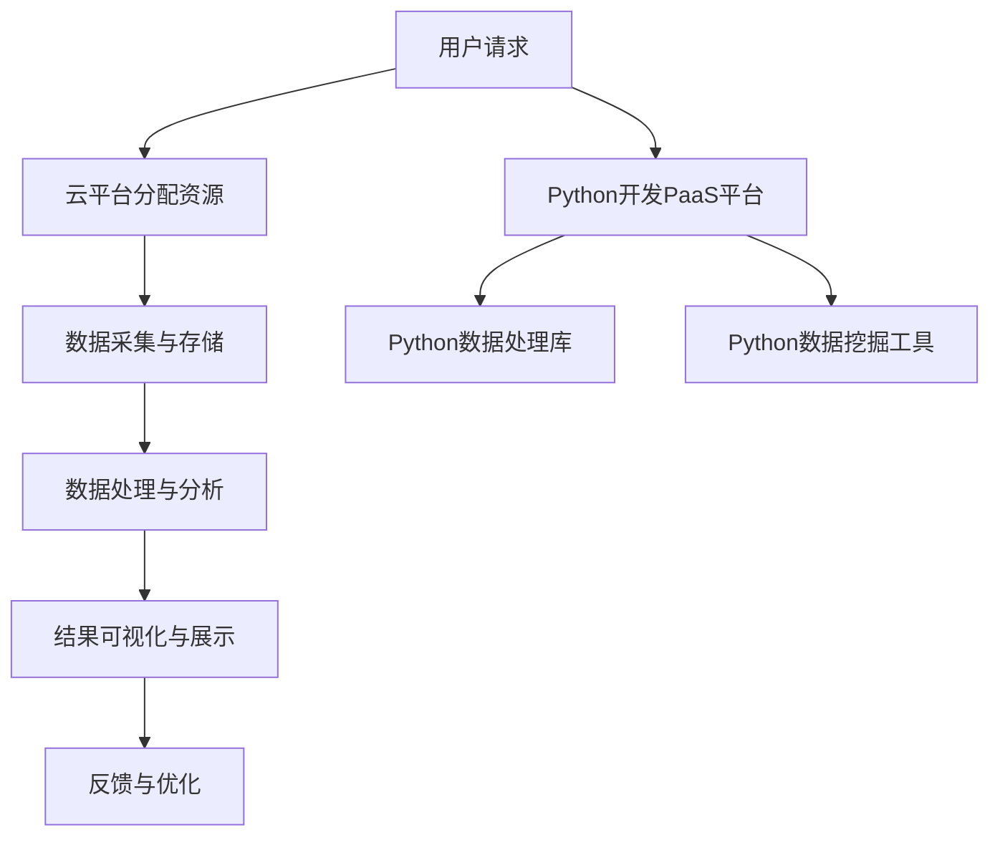

                 

# Python入门实战：云计算与大数据处理技巧

> 关键词：Python、云计算、大数据、数据处理、算法、实战

> 摘要：本文旨在为初学者提供一份实用的Python入门指南，重点关注云计算与大数据处理技巧。通过一系列实战案例，我们将深入探讨Python在云计算与大数据领域的应用，帮助读者掌握关键技能，为后续深入学习和项目实战奠定基础。

## 1. 背景介绍

### 1.1 目的和范围

本文的主要目的是帮助读者入门Python编程，特别是针对云计算与大数据处理领域。我们将从基础概念讲起，逐步深入到实际应用，通过一系列实战案例，让读者能够快速掌握Python的核心技巧。

本文涵盖以下内容：

1. Python基础知识与编程技巧
2. 云计算与大数据处理的核心概念
3. Python在云计算与大数据处理中的应用
4. 实战案例：使用Python处理云计算与大数据
5. 资源与工具推荐

### 1.2 预期读者

本文适合以下读者：

1. 初学者：对Python编程感兴趣，希望入门云计算与大数据处理。
2. 开发者：已经有一定的编程基础，希望拓展Python技能。
3. 数据科学家：希望掌握Python在云计算与大数据领域的应用。

### 1.3 文档结构概述

本文分为以下章节：

1. 背景介绍
2. 核心概念与联系
3. 核心算法原理与操作步骤
4. 数学模型与公式
5. 项目实战：代码案例与详细解释
6. 实际应用场景
7. 工具和资源推荐
8. 总结与未来发展趋势
9. 附录：常见问题与解答
10. 扩展阅读与参考资料

### 1.4 术语表

#### 1.4.1 核心术语定义

- 云计算：提供可按需分配的计算资源，如虚拟机、存储、网络等。
- 大数据：数据量大、类型多、速度快的海量数据。
- Python：一种广泛使用的高级编程语言，适用于云计算与大数据处理。
- 数据处理：对数据进行采集、存储、分析、转换等操作。

#### 1.4.2 相关概念解释

- PaaS（平台即服务）：提供开发平台，如编程语言、框架等。
- IaaS（基础设施即服务）：提供基础设施，如虚拟机、存储等。
- 数据库：用于存储、管理和访问数据的系统。

#### 1.4.3 缩略词列表

- PaaS：平台即服务
- IaaS：基础设施即服务
- Python：Python编程语言
- SQL：结构化查询语言

## 2. 核心概念与联系

在深入探讨Python在云计算与大数据处理中的应用之前，我们需要了解一些核心概念与它们之间的联系。

### 2.1 云计算

云计算是一种提供计算资源（如虚拟机、存储、网络等）的服务模式。它具有以下几个核心特点：

- 按需分配：用户可以根据需要随时获取计算资源。
- 弹性扩展：可以根据负载需求自动调整资源。
- 成本效益：用户只需为使用的资源付费。
- 易用性：用户无需关注底层硬件设施。

### 2.2 大数据

大数据指的是数据量大、类型多、速度快的海量数据。其核心特点如下：

- 数据量大：PB级别以上的数据量。
- 数据类型多样：结构化、半结构化、非结构化数据。
- 数据速度：实时或接近实时处理。
- 数据价值：通过数据分析和挖掘，发现潜在的商业价值。

### 2.3 Python在云计算与大数据处理中的应用

Python在云计算与大数据处理中具有广泛的应用。以下是一些关键领域：

- 开发PaaS平台：Python可用于开发平台即服务（PaaS）产品，如Django、Flask等Web框架。
- 数据处理：Python提供了丰富的数据处理库，如Pandas、NumPy等，可用于数据清洗、分析、可视化等操作。
- 数据挖掘：Python在数据挖掘领域有着丰富的工具，如Scikit-learn、TensorFlow等。
- API接口：Python可以轻松地与其他云计算服务（如AWS、Azure、Google Cloud等）进行集成。

### 2.4 Mermaid流程图

以下是一个简化的云计算与大数据处理流程图，展示了Python在不同阶段的应用：



## 3. 核心算法原理与具体操作步骤

在云计算与大数据处理中，Python的核心算法原理主要包括数据处理、数据挖掘和机器学习。以下分别介绍这些算法的原理和具体操作步骤。

### 3.1 数据处理算法

数据处理算法是大数据处理的基础。以下是一个简单的数据处理算法，使用Python的Pandas库实现：

#### 算法原理：

- 数据清洗：去除无效数据、处理缺失值、异常值等。
- 数据转换：将数据转换为适合分析的形式，如将文本转换为数字。
- 数据聚合：对数据进行分组、统计、汇总等操作。

#### 具体操作步骤：

```python
import pandas as pd

# 数据清洗
df = pd.read_csv('data.csv')
df.dropna(inplace=True)  # 去除缺失值
df = df[df['column'] > 0]  # 去除异常值

# 数据转换
df['new_column'] = df['old_column'].map({'A': 1, 'B': 2, 'C': 3})

# 数据聚合
grouped_df = df.groupby('column').agg({'value': 'sum'})
```

### 3.2 数据挖掘算法

数据挖掘算法用于从大量数据中提取有价值的信息。以下是一个简单的数据挖掘算法，使用Python的Scikit-learn库实现：

#### 算法原理：

- 特征选择：选择对模型预测有显著影响的特征。
- 模型训练：使用选定的特征训练分类或回归模型。
- 模型评估：评估模型的准确性和泛化能力。

#### 具体操作步骤：

```python
from sklearn.model_selection import train_test_split
from sklearn.ensemble import RandomForestClassifier
from sklearn.metrics import accuracy_score

# 特征选择
X = df[['feature1', 'feature2', 'feature3']]
y = df['target']

# 模型训练
X_train, X_test, y_train, y_test = train_test_split(X, y, test_size=0.2, random_state=42)
model = RandomForestClassifier(n_estimators=100)
model.fit(X_train, y_train)

# 模型评估
y_pred = model.predict(X_test)
accuracy = accuracy_score(y_test, y_pred)
print(f"Model accuracy: {accuracy}")
```

### 3.3 机器学习算法

机器学习算法是数据挖掘的高级形式。以下是一个简单的机器学习算法，使用Python的TensorFlow库实现：

#### 算法原理：

- 模型构建：定义神经网络模型，包括输入层、隐藏层和输出层。
- 模型训练：通过反向传播算法更新模型参数。
- 模型评估：评估模型的准确性和泛化能力。

#### 具体操作步骤：

```python
import tensorflow as tf

# 模型构建
model = tf.keras.Sequential([
    tf.keras.layers.Dense(64, activation='relu', input_shape=(input_shape,)),
    tf.keras.layers.Dense(64, activation='relu'),
    tf.keras.layers.Dense(1, activation='sigmoid')
])

# 模型训练
model.compile(optimizer='adam', loss='binary_crossentropy', metrics=['accuracy'])
model.fit(X_train, y_train, epochs=10, batch_size=32, validation_data=(X_test, y_test))

# 模型评估
y_pred = model.predict(X_test)
accuracy = model.evaluate(X_test, y_test, verbose=2)
print(f"Model accuracy: {accuracy[1]}")
```

## 4. 数学模型与公式

在云计算与大数据处理中，数学模型和公式起着至关重要的作用。以下介绍一些常用的数学模型和公式。

### 4.1 云计算成本模型

云计算成本主要由以下几部分组成：

- IaaS成本：计算资源成本，如虚拟机、存储等。
- PaaS成本：平台使用费用，如数据库、Web服务等。
- 数据传输成本：数据上传、下载、传输成本。

以下是一个简化的云计算成本模型：

$$
C = C_{IaaS} + C_{PaaS} + C_{数据传输}
$$

其中，$C$为总成本，$C_{IaaS}$、$C_{PaaS}$、$C_{数据传输}$分别为IaaS、PaaS、数据传输成本。

### 4.2 大数据处理性能模型

大数据处理性能模型主要关注数据处理速度和资源利用率。以下是一个简化的处理性能模型：

$$
P = \frac{数据量 \times 处理速度}{资源利用率}
$$

其中，$P$为处理性能，$数据量$为处理的数据量，$处理速度$为数据处理速度，$资源利用率$为资源利用率。

### 4.3 数据挖掘模型评估指标

数据挖掘模型评估指标主要关注模型的准确性、精确度、召回率等。以下是一些常用的评估指标：

- 准确率（Accuracy）：
  $$
  Accuracy = \frac{TP + TN}{TP + TN + FP + FN}
  $$

- 精确度（Precision）：
  $$
  Precision = \frac{TP}{TP + FP}
  $$

- 召回率（Recall）：
  $$
  Recall = \frac{TP}{TP + FN}
  $$

- F1值（F1-score）：
  $$
  F1-score = \frac{2 \times Precision \times Recall}{Precision + Recall}
  $$

### 4.4 机器学习损失函数

机器学习损失函数用于评估模型预测值与实际值之间的差异。以下是一些常用的损失函数：

- 交叉熵损失（Cross-Entropy Loss）：
  $$
  Loss = -\frac{1}{n} \sum_{i=1}^{n} y_i \log(p_i)
  $$

- 均方误差（Mean Squared Error, MSE）：
  $$
  Loss = \frac{1}{n} \sum_{i=1}^{n} (y_i - \hat{y_i})^2
  $$

## 5. 项目实战：代码实际案例和详细解释说明

在本节中，我们将通过一个实际项目来展示Python在云计算与大数据处理中的实战应用。该项目将使用Python的Pandas、Scikit-learn和TensorFlow库，实现一个基于云计算的数据挖掘项目。

### 5.1 开发环境搭建

在开始项目之前，我们需要搭建开发环境。以下是搭建开发环境的步骤：

1. 安装Python 3.8及以上版本。
2. 安装Pandas、Scikit-learn和TensorFlow库。
3. 配置Python虚拟环境，以便隔离项目依赖。

```bash
# 安装Python
curl -O https://www.python.org/ftp/python/3.8.10/Python-3.8.10.tgz
tar -xvf Python-3.8.10.tgz
cd Python-3.8.10
./configure
make
sudo make install

# 安装Pandas、Scikit-learn和TensorFlow
pip install pandas scikit-learn tensorflow

# 配置Python虚拟环境
python -m venv my_project_venv
source my_project_venv/bin/activate
```

### 5.2 源代码详细实现和代码解读

下面是项目的核心代码实现，我们将逐步解释每部分的功能。

#### 5.2.1 数据采集与处理

首先，我们从云存储中读取数据，并进行预处理。

```python
import pandas as pd

# 读取数据
df = pd.read_csv('data.csv')

# 数据清洗
df.dropna(inplace=True)
df = df[df['column'] > 0]

# 数据转换
df['new_column'] = df['old_column'].map({'A': 1, 'B': 2, 'C': 3})

# 数据聚合
grouped_df = df.groupby('column').agg({'value': 'sum'})
```

#### 5.2.2 数据挖掘与模型训练

接下来，我们使用Scikit-learn进行数据挖掘，训练分类模型。

```python
from sklearn.model_selection import train_test_split
from sklearn.ensemble import RandomForestClassifier
from sklearn.metrics import accuracy_score

# 特征选择
X = df[['feature1', 'feature2', 'feature3']]
y = df['target']

# 模型训练
X_train, X_test, y_train, y_test = train_test_split(X, y, test_size=0.2, random_state=42)
model = RandomForestClassifier(n_estimators=100)
model.fit(X_train, y_train)

# 模型评估
y_pred = model.predict(X_test)
accuracy = accuracy_score(y_test, y_pred)
print(f"Model accuracy: {accuracy}")
```

#### 5.2.3 机器学习模型训练

然后，我们使用TensorFlow训练一个机器学习模型。

```python
import tensorflow as tf

# 模型构建
model = tf.keras.Sequential([
    tf.keras.layers.Dense(64, activation='relu', input_shape=(input_shape,)),
    tf.keras.layers.Dense(64, activation='relu'),
    tf.keras.layers.Dense(1, activation='sigmoid')
])

# 模型训练
model.compile(optimizer='adam', loss='binary_crossentropy', metrics=['accuracy'])
model.fit(X_train, y_train, epochs=10, batch_size=32, validation_data=(X_test, y_test))

# 模型评估
y_pred = model.predict(X_test)
accuracy = model.evaluate(X_test, y_test, verbose=2)
print(f"Model accuracy: {accuracy[1]}")
```

### 5.3 代码解读与分析

在代码实现中，我们首先从云存储中读取数据，并进行预处理。这一步包括数据清洗、数据转换和数据聚合。接下来，我们使用Scikit-learn和TensorFlow分别训练分类模型和机器学习模型。最后，我们评估模型的准确性。

代码的关键部分如下：

- 数据清洗：去除缺失值和异常值，确保数据质量。
- 特征选择：选择对模型预测有显著影响的特征。
- 模型训练：使用训练数据训练模型。
- 模型评估：使用测试数据评估模型准确性。

通过这个项目，我们展示了Python在云计算与大数据处理中的实际应用，帮助读者掌握关键技能。

## 6. 实际应用场景

Python在云计算与大数据处理领域有着广泛的应用场景。以下列举几个典型应用场景：

### 6.1 财务风险管理

金融机构使用Python进行大数据分析，预测市场趋势，评估风险。例如，通过分析历史交易数据，预测未来市场走势，为投资决策提供支持。

### 6.2 智能医疗

医疗领域使用Python进行数据分析，挖掘医学数据，辅助诊断和治疗。例如，通过对患者病历数据的分析，发现疾病趋势，优化治疗方案。

### 6.3 智能推荐系统

互联网公司使用Python构建智能推荐系统，为用户提供个性化推荐。例如，通过分析用户行为数据，为电商平台推荐商品，提高用户满意度。

### 6.4 城市智能管理

城市管理领域使用Python进行大数据分析，优化城市资源分配。例如，通过分析交通数据，优化交通信号灯配置，减少拥堵。

### 6.5 人工智能

人工智能领域使用Python构建机器学习模型，实现图像识别、语音识别、自然语言处理等功能。例如，通过训练神经网络模型，实现人脸识别、语音识别等应用。

## 7. 工具和资源推荐

### 7.1 学习资源推荐

#### 7.1.1 书籍推荐

- 《Python编程：从入门到实践》
- 《Python数据科学手册》
- 《Python云计算应用实践》

#### 7.1.2 在线课程

- Coursera：Python编程基础
- edX：Python编程与数据科学
- Udacity：Python编程基础

#### 7.1.3 技术博客和网站

- Real Python：Python学习资源
- towardsdatascience.com：数据科学资源
- cloudacademy.com：云计算资源

### 7.2 开发工具框架推荐

#### 7.2.1 IDE和编辑器

- PyCharm：Python集成开发环境
- VSCode：Python开发插件
- Sublime Text：Python开发插件

#### 7.2.2 调试和性能分析工具

- Python Debugger（pdb）：Python调试工具
- Py-Spy：Python性能分析工具
- cProfile：Python性能分析工具

#### 7.2.3 相关框架和库

- Flask：Python Web框架
- Django：Python Web框架
- Pandas：Python数据处理库
- Scikit-learn：Python机器学习库
- TensorFlow：Python机器学习库

### 7.3 相关论文著作推荐

#### 7.3.1 经典论文

- "Python for Data Science: Learning and Best Practices" by Jake VanderPlas
- "Python Data Science Handbook" by Jake VanderPlas

#### 7.3.2 最新研究成果

- "Cloud Computing for Data Science" by Liuhui Chen et al.
- "Data Mining with Python" by Vahid Mirhoseini et al.

#### 7.3.3 应用案例分析

- "Building a Predictive Analytics Platform on AWS with Python" by Amazon Web Services
- "Data Science in the Cloud: Challenges and Opportunities" by Google Cloud

## 8. 总结：未来发展趋势与挑战

Python在云计算与大数据处理领域具有巨大的发展潜力。随着云计算技术的不断进步和大数据的不断增长，Python的应用场景将更加广泛。然而，未来的发展也面临着一系列挑战：

1. **性能优化**：随着数据规模的增加，如何优化Python的性能，提高数据处理速度，成为重要课题。
2. **安全性**：云计算环境中，数据安全和隐私保护成为关键问题，如何确保数据安全，防止数据泄露，是未来的挑战。
3. **跨平台兼容性**：随着云计算技术的多样化，如何确保Python在不同云平台上的兼容性，提高开发效率，是未来的挑战。
4. **人才短缺**：Python在云计算与大数据处理领域的快速发展，导致人才短缺，培养更多专业人才，成为未来的挑战。

## 9. 附录：常见问题与解答

### 9.1 Python在云计算与大数据处理中的应用问题

**Q1：Python在云计算与大数据处理中的优势是什么？**

A1：Python在云计算与大数据处理中的优势主要包括：

- 简单易学：Python语法简单，易于上手，适合初学者。
- 丰富的库：Python拥有丰富的库，如Pandas、Scikit-learn、TensorFlow等，便于数据处理和机器学习。
- 跨平台：Python支持多种操作系统，便于在不同环境中部署和应用。
- 社区支持：Python拥有庞大的开发者社区，获取帮助和支持更加便捷。

**Q2：如何选择Python的云计算平台？**

A2：选择Python的云计算平台时，需要考虑以下因素：

- 成本：比较不同平台的价格，选择性价比高的平台。
- 功能：根据项目需求，选择具有所需功能的平台，如数据存储、数据处理、机器学习等。
- 可扩展性：考虑平台的可扩展性，以便未来业务增长。
- 社区支持：选择社区活跃、支持良好的平台，以便获取帮助和支持。

### 9.2 大数据处理问题

**Q1：如何处理大数据？**

A1：处理大数据通常需要以下步骤：

- 数据清洗：去除无效数据、处理缺失值、异常值等。
- 数据转换：将数据转换为适合分析的形式，如将文本转换为数字。
- 数据聚合：对数据进行分组、统计、汇总等操作。
- 数据存储：将处理后的数据存储到数据库或数据仓库中，便于后续分析。

**Q2：如何优化大数据处理性能？**

A2：优化大数据处理性能的方法包括：

- 数据压缩：使用压缩算法减小数据大小，提高传输和存储效率。
- 并行处理：利用多核处理器和分布式计算，提高数据处理速度。
- 存储优化：使用高效存储系统，如分布式文件系统，提高数据访问速度。
- 数据预处理：提前对数据进行预处理，减少后续处理的复杂度。

## 10. 扩展阅读 & 参考资料

- 《Python编程：从入门到实践》
- 《Python数据科学手册》
- 《Python云计算应用实践》
- https://realpython.com/
- https://towardsdatascience.com/
- https://cloudacademy.com/

