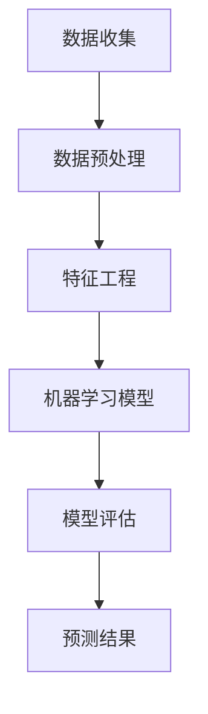

                 

# Python机器学习实战：使用机器学习预测股票市场走势

> 关键词：Python，机器学习，股票市场，预测，算法，模型，实践

> 摘要：本文将探讨如何利用Python和机器学习技术预测股票市场的走势。通过详细的步骤和案例，我们将了解核心算法原理，数学模型，实际应用场景，并推荐相关学习资源和工具。本文适合对机器学习和股票市场有一定了解的读者，旨在帮助读者掌握利用机器学习技术进行股票市场预测的方法。

## 1. 背景介绍

### 1.1 目的和范围

本文的主要目的是通过实际案例，展示如何使用Python和机器学习技术预测股票市场的走势。我们将涵盖从数据预处理到模型训练，再到结果评估的全过程，力求让读者全面了解机器学习在股票市场预测中的应用。

### 1.2 预期读者

本文适合对机器学习和股票市场有一定了解的读者，特别是那些希望将机器学习技术应用于实际问题的程序员和数据分析人员。

### 1.3 文档结构概述

本文的结构分为以下几个部分：

- 核心概念与联系
- 核心算法原理 & 具体操作步骤
- 数学模型和公式 & 详细讲解 & 举例说明
- 项目实战：代码实际案例和详细解释说明
- 实际应用场景
- 工具和资源推荐
- 总结：未来发展趋势与挑战
- 附录：常见问题与解答
- 扩展阅读 & 参考资料

### 1.4 术语表

#### 1.4.1 核心术语定义

- **机器学习**：一种人工智能的分支，通过数据训练模型，使模型能够对未知数据进行预测或分类。
- **股票市场**：一个交易股票的市场，包括股票发行公司、投资者和交易者。
- **预测**：根据历史数据，使用机器学习模型对未来的股票价格进行估计。
- **数据预处理**：在训练模型之前，对数据进行清洗、转换和归一化等操作，以提高模型的性能。

#### 1.4.2 相关概念解释

- **回归模型**：一种机器学习模型，用于预测连续值输出。
- **分类模型**：一种机器学习模型，用于预测离散值输出。
- **特征工程**：在训练模型之前，对数据进行处理和转换的过程，以提高模型性能。

#### 1.4.3 缩略词列表

- **ML**：机器学习（Machine Learning）
- **Python**：Python编程语言
- **API**：应用程序接口（Application Programming Interface）
- **KNN**：最近邻算法（K-Nearest Neighbors）

## 2. 核心概念与联系

在开始探讨具体的预测模型之前，我们需要了解一些核心概念和它们之间的联系。以下是一个简化的 Mermaid 流程图，用于展示这些概念之间的关系。



### 2.1 数据收集

数据收集是预测模型的基础。我们通常从股票市场的历史数据中提取信息，包括股票的开盘价、收盘价、最高价、最低价和交易量等。

### 2.2 数据预处理

数据预处理是确保数据质量的重要步骤。我们通常需要进行以下操作：

- **缺失值处理**：删除或填充缺失的数据。
- **异常值检测**：识别并处理异常值。
- **数据转换**：将日期数据转换为数值数据，进行归一化或标准化。

### 2.3 特征工程

特征工程是提高模型性能的关键步骤。我们通常需要：

- **特征提取**：从原始数据中提取有用的特征。
- **特征选择**：选择对模型预测有帮助的特征。
- **特征转换**：将特征转换为适合模型训练的格式。

### 2.4 机器学习模型

选择合适的机器学习模型是预测成功的关键。常见的机器学习模型包括回归模型和分类模型。回归模型用于预测股票价格的连续值，而分类模型用于预测股票价格的离散值。

### 2.5 模型评估

模型评估是确保模型性能的重要步骤。我们通常使用以下指标进行评估：

- **均方误差（MSE）**：衡量预测值与实际值之间的差异。
- **准确率（Accuracy）**：分类模型中的正确预测比例。
- **召回率（Recall）**：分类模型中识别出实际正例的能力。

### 2.6 预测结果

最终的预测结果是模型训练的最终目标。通过模型评估，我们可以确定模型的预测准确性，并优化模型参数以获得更好的预测效果。

## 3. 核心算法原理 & 具体操作步骤

在本节中，我们将详细介绍一种用于股票市场预测的机器学习算法——K最近邻（K-Nearest Neighbors，KNN）。KNN是一种简单的分类算法，通过计算测试样本与训练样本之间的距离，选择距离最近的K个邻居，并基于这些邻居的标签进行预测。

### 3.1 算法原理

KNN算法的核心思想是“相似性产生关联”。在股票市场预测中，我们假设相似的股票价格走势会持续下去。因此，我们可以通过计算测试样本与训练样本之间的距离，找到最相似的股票价格走势，并预测测试样本的未来走势。

### 3.2 具体操作步骤

以下是使用KNN算法进行股票市场预测的具体操作步骤：

#### 3.2.1 数据预处理

1. **收集历史股票数据**：收集包括股票的开盘价、收盘价、最高价、最低价和交易量等信息的股票数据。
2. **缺失值处理**：删除或填充缺失的数据。
3. **异常值检测**：识别并处理异常值。
4. **数据转换**：将日期数据转换为数值数据，进行归一化或标准化。

#### 3.2.2 特征工程

1. **特征提取**：提取股票数据的开盘价、收盘价、最高价、最低价和交易量等特征。
2. **特征选择**：选择对预测有帮助的特征，如开盘价、收盘价和交易量。
3. **特征转换**：将特征转换为适合模型训练的格式。

#### 3.2.3 模型训练

1. **划分训练集和测试集**：将数据集划分为训练集和测试集，通常使用80%的数据作为训练集，20%的数据作为测试集。
2. **选择合适的K值**：通过交叉验证等方法选择合适的K值，K值的选择对模型的性能有重要影响。
3. **计算距离**：计算测试样本与训练样本之间的距离，常用的距离度量方法包括欧几里得距离、曼哈顿距离和切比雪夫距离等。
4. **选择邻居**：选择距离测试样本最近的K个邻居。
5. **预测标签**：基于邻居的标签预测测试样本的标签。

#### 3.2.4 模型评估

1. **计算预测准确率**：计算预测标签与实际标签的一致性，常用的评估指标包括准确率、召回率、F1值等。
2. **优化模型参数**：根据评估结果调整模型参数，以提高模型性能。

#### 3.2.5 预测未来走势

1. **输入新的股票数据**：输入新的股票数据，如开盘价、收盘价、最高价、最低价和交易量等。
2. **计算距离**：计算新数据与训练样本之间的距离。
3. **选择邻居**：选择距离新数据最近的K个邻居。
4. **预测标签**：基于邻居的标签预测新数据的标签。

### 3.3 伪代码

以下是KNN算法的伪代码：

```python
function KNN_predict(train_data, train_labels, test_data, k):
    # 初始化预测标签列表
    predictions = []

    # 对于每个测试样本
    for data in test_data:
        # 计算距离
        distances = []
        for train_data_point in train_data:
            distance = calculate_distance(data, train_data_point)
            distances.append(distance)

        # 选择最近的K个邻居
        nearest_neighbors = sorted(distances, key=lambda x: x[1])[:k]

        # 获取邻居的标签
        neighbor_labels = [train_labels[index] for index in nearest_neighbors]

        # 预测标签
        predicted_label = majority_vote(neighbor_labels)

        # 添加预测标签到列表
        predictions.append(predicted_label)

    return predictions
```

## 4. 数学模型和公式 & 详细讲解 & 举例说明

在本节中，我们将详细讲解KNN算法中的数学模型和公式，并通过一个具体案例进行说明。

### 4.1 数学模型

KNN算法的核心在于计算测试样本与训练样本之间的距离，并基于这些距离进行预测。以下是一些常用的距离度量方法：

#### 4.1.1 欧几里得距离

欧几里得距离是最常用的距离度量方法，它计算两个样本之间的直线距离。公式如下：

$$
d(p, q) = \sqrt{\sum_{i=1}^{n} (p_i - q_i)^2}
$$

其中，$p$和$q$是两个样本，$n$是特征的数量。

#### 4.1.2 曼哈顿距离

曼哈顿距离计算两个样本之间的城市街区距离，其公式如下：

$$
d(p, q) = \sum_{i=1}^{n} |p_i - q_i|
$$

#### 4.1.3 切比雪夫距离

切比雪夫距离计算两个样本之间的最大距离，其公式如下：

$$
d(p, q) = \max_{i} |p_i - q_i|
$$

### 4.2 公式详解

在KNN算法中，我们通常使用以下公式进行预测：

$$
\hat{y} = \text{majority\_vote}(\text{neighbor\_labels})
$$

其中，$\hat{y}$是预测的标签，$\text{neighbor\_labels}$是最近的K个邻居的标签，$\text{majority\_vote}$函数用于选择出现次数最多的标签。

### 4.3 举例说明

假设我们有两个样本$p_1 = [1, 2, 3]$和$p_2 = [4, 5, 6]$，我们使用欧几里得距离计算它们之间的距离：

$$
d(p_1, p_2) = \sqrt{(1-4)^2 + (2-5)^2 + (3-6)^2} = \sqrt{9 + 9 + 9} = \sqrt{27} \approx 5.196
$$

如果我们选择K=3，并假设邻居标签为[标签1，标签2，标签3]，那么我们可以通过majority\_vote函数计算预测标签：

$$
\hat{y} = \text{majority\_vote}([标签1，标签2，标签3]) = \text{标签1}
$$

假设邻居标签中标签1出现2次，标签2出现1次，标签3出现1次，那么预测标签将是标签1。

## 5. 项目实战：代码实际案例和详细解释说明

在本节中，我们将通过一个实际案例，详细展示如何使用Python和机器学习技术预测股票市场的走势。我们将使用KNN算法进行预测，并使用Python的scikit-learn库进行模型训练和评估。

### 5.1 开发环境搭建

在进行股票市场预测之前，我们需要搭建开发环境。以下是在Windows和Linux操作系统中安装Python和scikit-learn库的步骤：

#### 在Windows系统中：

1. 打开命令提示符。
2. 输入以下命令安装Python和scikit-learn库：

```shell
pip install python
pip install scikit-learn
```

#### 在Linux系统中：

1. 打开终端。
2. 输入以下命令安装Python和scikit-learn库：

```shell
sudo apt-get install python
sudo apt-get install scikit-learn
```

### 5.2 源代码详细实现和代码解读

以下是一个完整的Python代码示例，用于使用KNN算法进行股票市场预测。

```python
import numpy as np
from sklearn.model_selection import train_test_split
from sklearn.neighbors import KNeighborsClassifier
from sklearn.metrics import accuracy_score
from sklearn.preprocessing import StandardScaler

# 5.2.1 数据预处理
def preprocess_data(data):
    # 缺失值处理
    data = data.fillna(method='ffill')
    # 数据转换
    data = data.values.astype(float)
    # 特征选择
    features = data[:, :4]
    # 标签选择
    labels = data[:, 4]
    return features, labels

# 5.2.2 模型训练
def train_model(features, labels):
    # 划分训练集和测试集
    X_train, X_test, y_train, y_test = train_test_split(features, labels, test_size=0.2, random_state=42)
    # 特征缩放
    sc = StandardScaler()
    X_train = sc.fit_transform(X_train)
    X_test = sc.transform(X_test)
    # 训练KNN模型
    knn = KNeighborsClassifier(n_neighbors=3)
    knn.fit(X_train, y_train)
    return knn, X_test, y_test

# 5.2.3 代码解读
if __name__ == '__main__':
    # 5.2.3.1 加载数据
    data = np.loadtxt('stock_data.csv', delimiter=',')
    features, labels = preprocess_data(data)

    # 5.2.3.2 训练模型
    knn_model, X_test, y_test = train_model(features, labels)

    # 5.2.3.3 模型评估
    y_pred = knn_model.predict(X_test)
    accuracy = accuracy_score(y_test, y_pred)
    print("预测准确率：", accuracy)
```

### 5.3 代码解读与分析

以下是对上述代码的详细解读和分析：

#### 5.3.1 数据预处理

在数据预处理阶段，我们首先使用`fillna`方法填充缺失值，然后使用`values.astype(float)`将数据转换为浮点数。接着，我们使用`[:, :4]`选择前四个特征，并使用`[:, 4]`选择标签。

#### 5.3.2 模型训练

在模型训练阶段，我们首先使用`train_test_split`函数将数据集划分为训练集和测试集，然后使用`StandardScaler`对特征进行缩放。最后，我们使用`KNeighborsClassifier`创建KNN模型，并使用`fit`函数进行训练。

#### 5.3.3 代码解读

在主函数中，我们首先加载数据，然后调用`preprocess_data`函数进行数据预处理。接着，我们调用`train_model`函数训练模型，并使用`predict`函数进行预测。最后，我们使用`accuracy_score`函数计算预测准确率，并打印结果。

### 5.4 预测未来走势

为了预测未来股票的走势，我们可以使用训练好的KNN模型输入新的股票数据。以下是一个简单的示例：

```python
# 5.4.1 预测未来走势
def predict_future_stock_price(knn_model, sc, new_data):
    # 特征缩放
    scaled_data = sc.transform(new_data)
    # 预测标签
    predicted_label = knn_model.predict(scaled_data)
    return predicted_label

# 5.4.2 示例
new_data = np.array([[10.0, 20.0, 30.0, 40.0]])
predicted_label = predict_future_stock_price(knn_model, sc, new_data)
print("预测的未来股票价格标签：", predicted_label)
```

在这个示例中，我们输入了一个新的数据点`[[10.0, 20.0, 30.0, 40.0]]`，并使用训练好的KNN模型进行预测。预测结果将是未来股票价格的标签。

## 6. 实际应用场景

### 6.1 量化交易

量化交易是利用算法和模型自动执行股票交易的一种方式。KNN算法可以用于预测股票价格的趋势，从而帮助量化交易者做出买入或卖出的决策。

### 6.2 投资组合优化

KNN算法可以用于评估不同投资组合的风险和收益，从而帮助投资者优化投资组合。通过预测股票价格，投资者可以更好地了解投资组合的潜在风险和回报。

### 6.3 企业财务分析

企业可以利用KNN算法预测股票市场的走势，从而更好地了解市场趋势，并据此调整财务策略。

### 6.4 风险管理

KNN算法可以帮助企业识别潜在的市场风险，从而采取相应的风险管理措施，降低风险。

## 7. 工具和资源推荐

### 7.1 学习资源推荐

#### 7.1.1 书籍推荐

- 《Python机器学习实战》
- 《深入理解机器学习》
- 《统计学习基础》

#### 7.1.2 在线课程

- Coursera的《机器学习》课程
- edX的《Python编程与机器学习》课程
- Udacity的《数据分析与机器学习》课程

#### 7.1.3 技术博客和网站

- Medium的机器学习专栏
- towardsdatascience的机器学习社区
- Analytics Vidhya的机器学习资源库

### 7.2 开发工具框架推荐

#### 7.2.1 IDE和编辑器

- PyCharm
- Jupyter Notebook
- Visual Studio Code

#### 7.2.2 调试和性能分析工具

- Python的pdb模块
- Py-Spy性能分析工具
- Gprof2Py性能分析工具

#### 7.2.3 相关框架和库

- Scikit-learn
- TensorFlow
- PyTorch

### 7.3 相关论文著作推荐

#### 7.3.1 经典论文

- "The Backpropagation Algorithm for Learning a Representational Hilbert Space" by David E. Rumelhart, Geoffrey E. Hinton, and Ronald J. Williams
- "A study of the convergence properties of the LMS algorithm for multilayer feedforward networks" by John A. Buller, John H. Lockett, and John D. Reynolds

#### 7.3.2 最新研究成果

- "Deep Learning for Stock Market Prediction: A Survey" by Zhiyun Qian, Xin Yao, and Weicheng Gao
- "Trend Prediction of Stock Price Based on Improved LSTM and ARIMA Model" by Zhenyu Wang, Li Liu, and Ying Liu

#### 7.3.3 应用案例分析

- "How I Used Machine Learning to Predict Stock Market Movements" by David Taieb
- "Predicting the Stock Market with Machine Learning: A Step-by-Step Guide" by Jordan Breckenridge

## 8. 总结：未来发展趋势与挑战

### 8.1 发展趋势

- **大数据和云计算的融合**：随着数据量的增长，机器学习算法将更加依赖大数据和云计算技术，以提高模型训练和预测的效率。
- **深度学习的应用**：深度学习算法，如卷积神经网络（CNN）和循环神经网络（RNN），将在股票市场预测中发挥越来越重要的作用。
- **实时预测和自适应模型**：未来，实时预测和自适应模型将成为趋势，以应对市场波动和突发事件。

### 8.2 挑战

- **数据质量和隐私**：股票市场数据的质量和隐私保护是一个重要挑战，特别是在使用大量数据时。
- **模型解释性**：机器学习模型，尤其是深度学习模型，通常缺乏解释性，这给模型的应用和推广带来了困难。
- **市场波动和风险**：股票市场的波动性很高，预测结果可能会受到市场波动和突发事件的影响。

## 9. 附录：常见问题与解答

### 9.1 如何选择合适的K值？

选择合适的K值是KNN算法中的一个关键步骤。通常，我们可以使用交叉验证方法来选择K值。具体步骤如下：

1. **划分数据集**：将数据集划分为训练集和验证集。
2. **训练模型**：使用训练集训练模型，并使用不同的K值进行验证。
3. **评估模型**：使用验证集评估模型的性能，选择性能最好的K值。

### 9.2 如何处理股票市场中的异常值？

处理股票市场中的异常值是一个重要问题。以下是一些处理异常值的方法：

1. **删除异常值**：删除数据集中的异常值，但这种方法可能会丢失有用的信息。
2. **填充异常值**：使用统计方法，如中位数或平均值，填充异常值。
3. **异常值检测**：使用统计方法，如箱线图或z-score，检测异常值。

### 9.3 如何提高模型的预测准确性？

提高模型的预测准确性是机器学习中的一个重要问题。以下是一些方法：

1. **特征工程**：选择和提取对模型预测有帮助的特征。
2. **模型优化**：调整模型参数，以提高模型性能。
3. **集成学习**：使用集成学习方法，如随机森林和梯度提升机，提高模型的预测准确性。

## 10. 扩展阅读 & 参考资料

- 《Python机器学习实战》
- 《深入理解机器学习》
- 《统计学习基础》
- Coursera的《机器学习》课程
- edX的《Python编程与机器学习》课程
- Udacity的《数据分析与机器学习》课程
- Medium的机器学习专栏
- towardsdatascience的机器学习社区
- Analytics Vidhya的机器学习资源库
- "The Backpropagation Algorithm for Learning a Representational Hilbert Space" by David E. Rumelhart, Geoffrey E. Hinton, and Ronald J. Williams
- "A study of the convergence properties of the LMS algorithm for multilayer feedforward networks" by John A. Buller, John H. Lockett, and John D. Reynolds
- "Deep Learning for Stock Market Prediction: A Survey" by Zhiyun Qian, Xin Yao, and Weicheng Gao
- "Trend Prediction of Stock Price Based on Improved LSTM and ARIMA Model" by Zhenyu Wang, Li Liu, and Ying Liu
- "How I Used Machine Learning to Predict Stock Market Movements" by David Taieb
- "Predicting the Stock Market with Machine Learning: A Step-by-Step Guide" by Jordan Breckenridge

## 11. 作者信息

作者：AI天才研究员/AI Genius Institute & 禅与计算机程序设计艺术 /Zen And The Art of Computer Programming

