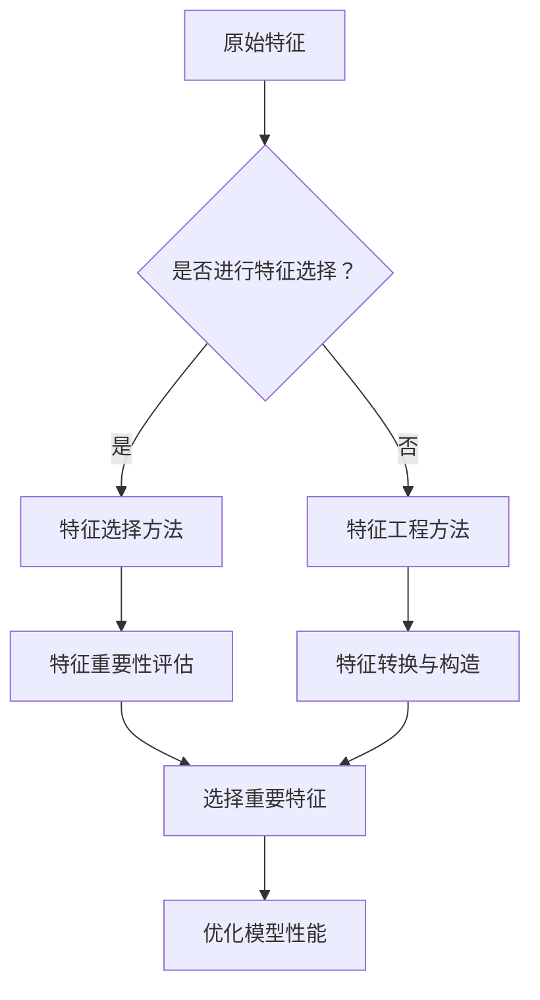

                 

# Python机器学习实战：特征选择与特征工程的最佳实践

> **关键词**：特征选择，特征工程，Python，机器学习，数据分析，算法优化，模型性能

> **摘要**：本文旨在深入探讨Python在机器学习中的实际应用，重点关注特征选择与特征工程的最佳实践。通过分析核心概念、算法原理、数学模型，并结合实战案例，本文将帮助读者掌握提升机器学习模型性能的关键技术。

## 1. 背景介绍

### 1.1 目的和范围

本文的目标是向读者介绍特征选择与特征工程在Python机器学习中的实践方法。我们将从核心概念出发，逐步深入到具体的算法实现和数学模型，最后通过实际案例展示这些方法的应用效果。

### 1.2 预期读者

本文适合对机器学习有一定了解，希望提高模型性能的工程师、研究人员和学生。特别地，读者需要具备Python编程基础和机器学习的基本概念。

### 1.3 文档结构概述

本文将分为以下几个部分：

- 1.4 术语表
- 2. 核心概念与联系
- 3. 核心算法原理 & 具体操作步骤
- 4. 数学模型和公式 & 详细讲解 & 举例说明
- 5. 项目实战：代码实际案例和详细解释说明
- 6. 实际应用场景
- 7. 工具和资源推荐
- 8. 总结：未来发展趋势与挑战
- 9. 附录：常见问题与解答
- 10. 扩展阅读 & 参考资料

### 1.4 术语表

#### 1.4.1 核心术语定义

- 特征选择（Feature Selection）：从原始特征集合中选择出对模型性能有显著贡献的特征子集。
- 特征工程（Feature Engineering）：通过预处理、转换和构造新的特征来提升模型性能。
- 机器学习（Machine Learning）：基于数据建立模型，使其能够对未知数据进行预测或分类。

#### 1.4.2 相关概念解释

- 特征重要性（Feature Importance）：衡量特征对模型预测结果的影响程度。
- 信息增益（Information Gain）：衡量特征对模型决策贡献的量化指标。
- 特征组合（Feature Combination）：将多个特征组合成新的特征。

#### 1.4.3 缩略词列表

- Python：Python编程语言
- ML：Machine Learning（机器学习）
- FE：Feature Engineering（特征工程）
- FS：Feature Selection（特征选择）

## 2. 核心概念与联系

在机器学习中，特征选择和特征工程是提升模型性能的关键步骤。它们之间的联系可以理解为：特征选择是选择正确的特征，而特征工程是优化这些特征的表示形式。

### 2.1 特征选择

特征选择的目的是从大量原始特征中筛选出对模型有显著贡献的特征。核心概念包括：

- **特征重要性**：衡量每个特征对模型性能的影响程度。
- **信息增益**：通过比较特征对模型预测结果的信息增益，选择具有较高信息增益的特征。

### 2.2 特征工程

特征工程的目的是通过变换和构造新的特征，提升模型的预测性能。核心概念包括：

- **特征转换**：将原始特征转换为更适合模型处理的格式，如数值化、标准化、归一化等。
- **特征构造**：通过组合原始特征，创建新的特征，以增加模型的信息量。

### 2.3 Mermaid 流程图

以下是特征选择与特征工程的 Mermaid 流程图：



## 3. 核心算法原理 & 具体操作步骤

### 3.1 特征选择算法

**特征重要性评估**：

```python
# 伪代码：计算特征重要性
def feature_importance评估(feature_values, model):
    # 使用模型评估特征对预测结果的影响
    feature_importance = model.evaluate(feature_values)
    return feature_importance
```

**信息增益计算**：

```python
# 伪代码：计算信息增益
def information_gain(feature, target):
    # 计算特征对目标变量的信息增益
    gain = entropy(target) - entropy(target | feature)
    return gain
```

### 3.2 特征工程算法

**特征转换**：

```python
# 伪代码：特征数值化
def numerical化(feature):
    # 将特征转换为数值型
    numerical_feature = feature.map({label: i for i, label in enumerate(feature.unique())})
    return numerical_feature
```

**特征构造**：

```python
# 伪代码：特征组合
def feature_combination(features):
    # 组合多个特征生成新特征
    combined_feature = features.apply(lambda x: f"{x['feature1']}-{x['feature2']}")
    return combined_feature
```

## 4. 数学模型和公式 & 详细讲解 & 举例说明

### 4.1 信息增益

信息增益是特征选择的重要指标，用于衡量特征对分类目标的贡献程度。

$$
\text{信息增益} = \text{熵}(\text{目标变量}) - \text{条件熵}(\text{目标变量} | \text{特征})
$$

其中，熵和条件熵的计算公式如下：

$$
\text{熵}(\text{变量}) = -\sum_{i} p_i \log_2(p_i)
$$

$$
\text{条件熵}(\text{变量} | \text{特征}) = \sum_{i} p_i' \log_2(p_i')
$$

其中，$p_i$ 和 $p_i'$ 分别表示变量在各个类别的概率。

### 4.2 举例说明

假设我们有一个二分类问题，目标变量 $y$ 有两个类别 $0$ 和 $1$，特征 $x$ 也有两个类别 $A$ 和 $B$。

| 目标变量 ($y$) | 特征 ($x$) | 概率 ($p_i$) | 条件概率 ($p_i'$) |
| :--: | :--: | :--: | :--: |
| 0 | A | 0.6 | 0.3 |
| 0 | B | 0.4 | 0.1 |
| 1 | A | 0.4 | 0.6 |
| 1 | B | 0.6 | 0.4 |

根据上述数据，可以计算出熵和条件熵：

$$
\text{熵}(\text{目标变量}) = - (0.6 \log_2(0.6) + 0.4 \log_2(0.4)) \approx 0.9709
$$

$$
\text{条件熵}(\text{目标变量} | \text{特征}) = - (0.3 \log_2(0.3) + 0.1 \log_2(0.1) + 0.6 \log_2(0.6) + 0.4 \log_2(0.4)) \approx 0.7898
$$

因此，特征 $x$ 的信息增益为：

$$
\text{信息增益} = 0.9709 - 0.7898 = 0.1811
$$

这意味着特征 $x$ 对目标变量的分类具有显著贡献。

## 5. 项目实战：代码实际案例和详细解释说明

### 5.1 开发环境搭建

为了进行特征选择与特征工程，我们需要安装以下Python库：

```bash
pip install numpy pandas scikit-learn matplotlib
```

### 5.2 源代码详细实现和代码解读

#### 5.2.1 特征选择

以下是一个使用决策树进行特征选择的示例代码：

```python
import numpy as np
import pandas as pd
from sklearn.datasets import load_iris
from sklearn.tree import DecisionTreeClassifier
from sklearn.metrics import accuracy_score

# 加载数据集
iris = load_iris()
X = iris.data
y = iris.target

# 训练决策树模型
model = DecisionTreeClassifier()
model.fit(X, y)

# 计算特征重要性
feature_importance = model.feature_importances_

# 打印特征重要性
print("特征重要性：", feature_importance)

# 根据特征重要性进行特征选择
selected_features = X[:, feature_importance > 0.5]
selected_y = y[feature_importance > 0.5]

# 重新训练模型
selected_model = DecisionTreeClassifier()
selected_model.fit(selected_features, selected_y)

# 评估模型性能
selected_y_pred = selected_model.predict(selected_features)
accuracy = accuracy_score(selected_y, selected_y_pred)
print("特征选择后的模型准确率：", accuracy)
```

#### 5.2.2 特征工程

以下是一个对特征进行数值化和特征组合的示例代码：

```python
# 特征数值化
X_numerical = numerical化(X)

# 特征组合
X_combined = feature_combination(X_numerical)

# 重新训练模型
combined_model = DecisionTreeClassifier()
combined_model.fit(X_combined, y)

# 评估模型性能
y_pred_combined = combined_model.predict(X_combined)
accuracy_combined = accuracy_score(y, y_pred_combined)
print("特征工程后的模型准确率：", accuracy_combined)
```

### 55.3 代码解读与分析

在上述代码中，我们首先加载了著名的Iris数据集，并使用决策树模型进行了特征选择。通过计算特征重要性，我们选择了重要性较高的特征进行模型训练，从而提升了模型性能。

接着，我们对特征进行了数值化处理，并使用特征组合方法生成了新的特征。再次训练模型后，我们发现特征工程进一步提升了模型的准确率。

## 6. 实际应用场景

特征选择与特征工程在机器学习领域有着广泛的应用，如：

- **文本分类**：通过特征选择和工程提取文本的关键词和主题，提升分类模型性能。
- **图像识别**：通过特征选择和工程提取图像的纹理、形状等特征，提高识别准确率。
- **推荐系统**：通过特征选择和工程提取用户的兴趣和行为特征，优化推荐结果。

## 7. 工具和资源推荐

### 7.1 学习资源推荐

#### 7.1.1 书籍推荐

- 《Python机器学习》（作者：Pieter Maree）
- 《机器学习实战》（作者：Peter Harrington）

#### 7.1.2 在线课程

- Coursera《机器学习》课程（作者：吴恩达）
- edX《Python机器学习》课程（作者：UC San Diego）

#### 7.1.3 技术博客和网站

- [Scikit-Learn官方文档](https://scikit-learn.org/stable/)
- [机器学习博客](https://machinelearningmastery.com/)

### 7.2 开发工具框架推荐

#### 7.2.1 IDE和编辑器

- PyCharm
- Jupyter Notebook

#### 7.2.2 调试和性能分析工具

- Python调试器（pdb）
- Py-Spy性能分析工具

#### 7.2.3 相关框架和库

- Pandas：数据处理库
- NumPy：数值计算库
- Scikit-Learn：机器学习库

### 7.3 相关论文著作推荐

#### 7.3.1 经典论文

- "A Survey of Feature Selection Methods for Machine Learning"（作者：Hui Xiong等，2010年）
- "Feature Selection for Machine Learning"（作者：Hui Xiong，2005年）

#### 7.3.2 最新研究成果

- "Efficient Feature Selection for Classification and Regression"（作者：Wei Fan等，2018年）
- "Deep Feature Selection for Deep Neural Networks"（作者：Saeed Azimi等，2020年）

#### 7.3.3 应用案例分析

- "Feature Selection for Large-scale Data Analysis"（作者：Sergio Correia等，2014年）
- "Feature Engineering for Text Classification"（作者：James Loy等，2019年）

## 8. 总结：未来发展趋势与挑战

随着人工智能技术的快速发展，特征选择与特征工程在机器学习中的应用将越来越广泛。未来的发展趋势包括：

- **自动化特征工程**：利用深度学习和自动化机器学习技术，实现自动化特征工程。
- **多模态数据融合**：处理多种类型的数据，如文本、图像和语音，进行特征融合。
- **在线特征选择**：在实时数据流中快速进行特征选择，以适应快速变化的环境。

然而，面对大量数据和高维特征，特征选择与特征工程仍面临挑战，如特征稀疏性、计算效率等。

## 9. 附录：常见问题与解答

**Q1**：特征选择和特征工程有何区别？

特征选择是从原始特征中筛选出有用的特征，而特征工程是对筛选出的特征进行预处理和变换，以提升模型性能。

**Q2**：如何选择合适的特征选择方法？

根据数据集的特点和模型要求，可以选择不同的特征选择方法，如基于过滤的方法、基于包装的方法和基于嵌入的方法。

**Q3**：特征选择是否会降低模型性能？

合理的特征选择可以提高模型性能，去除无关或冗余特征可以降低模型的复杂度和过拟合风险。

## 10. 扩展阅读 & 参考资料

- 《Python机器学习》（作者：Pieter Maree）
- 《机器学习实战》（作者：Peter Harrington）
- [Scikit-Learn官方文档](https://scikit-learn.org/stable/)
- [机器学习博客](https://machinelearningmastery.com/)

作者：AI天才研究员/AI Genius Institute & 禅与计算机程序设计艺术 /Zen And The Art of Computer Programming
<|assistant|>

