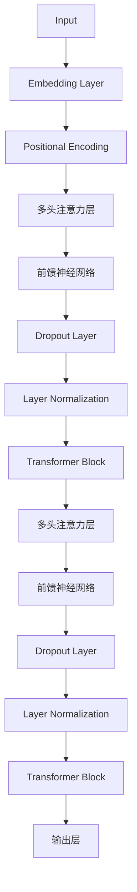

                 


# Python深度学习实践：使用Transformers处理NLP问题

> 关键词：Python，深度学习，Transformers，NLP，实践，算法原理，数学模型，项目实战，应用场景
>
> 摘要：本文旨在通过Python深度学习实践，详细解析Transformers模型在自然语言处理（NLP）任务中的应用。文章首先介绍Transformers的核心概念和架构，随后通过具体的算法原理和操作步骤深入探讨其在文本分类、问答系统等NLP任务中的具体实现。同时，文章还通过实际代码案例，展示了如何使用Python和Transformers库来构建和训练模型。最后，文章讨论了Transformers在NLP领域的应用场景、工具和资源，并对未来发展趋势与挑战进行了总结。

## 1. 背景介绍

### 1.1 目的和范围

本文的目标是帮助读者理解并掌握如何使用Python深度学习框架来实践Transformers模型在自然语言处理任务中的应用。我们将从理论基础出发，逐步讲解核心算法原理，并通过实际项目案例来演示模型构建和训练的全过程。文章主要涵盖以下内容：

1. Transformers模型的核心概念和架构。
2. 实现文本分类、问答系统等NLP任务的算法原理。
3. 使用Python和Transformers库的实际操作步骤。
4. Transformers模型在不同应用场景中的使用案例。
5. 相关的学习资源和开发工具推荐。

### 1.2 预期读者

本文适合对深度学习和自然语言处理有一定了解的读者，尤其是希望掌握Transformers模型在实际项目中应用的程序员、数据科学家和机器学习工程师。同时，对NLP领域感兴趣的科研人员和学生也能从本文中获得宝贵的实践经验和理论知识。

### 1.3 文档结构概述

本文结构如下：

1. 引言：介绍Transformers模型的背景和重要性。
2. 核心概念与联系：通过流程图展示Transformers模型的关键组成部分。
3. 核心算法原理 & 具体操作步骤：详细讲解算法原理和操作步骤。
4. 数学模型和公式：介绍相关数学模型和公式，并举例说明。
5. 项目实战：代码实际案例和详细解释说明。
6. 实际应用场景：讨论Transformers在NLP任务中的应用。
7. 工具和资源推荐：推荐学习资源和开发工具。
8. 总结：未来发展趋势与挑战。
9. 附录：常见问题与解答。
10. 扩展阅读 & 参考资料。

### 1.4 术语表

#### 1.4.1 核心术语定义

- **Transformers**：一种基于自注意力机制的深度学习模型，广泛应用于自然语言处理任务。
- **自注意力（Self-Attention）**：一种计算输入序列中每个词与所有词之间关系的机制。
- **多头注意力（Multi-Head Attention）**：通过多组自注意力机制来学习不同类型的特征。
- **BERT（Bidirectional Encoder Representations from Transformers）**：一种基于Transformers的双向编码器，用于预训练语言表示。

#### 1.4.2 相关概念解释

- **序列到序列（Seq2Seq）模型**：一种用于处理序列数据的模型，广泛应用于机器翻译、问答系统等任务。
- **损失函数（Loss Function）**：用于评估模型预测结果与实际结果之间差异的函数。
- **优化器（Optimizer）**：用于更新模型参数，以最小化损失函数的算法。

#### 1.4.3 缩略词列表

- **GPU（Graphics Processing Unit）**：图形处理器。
- **NLP（Natural Language Processing）**：自然语言处理。
- **RNN（Recurrent Neural Network）**：循环神经网络。
- **CNN（Convolutional Neural Network）**：卷积神经网络。

## 2. 核心概念与联系

为了更好地理解Transformers模型，我们将通过一个Mermaid流程图来展示其核心组成部分和它们之间的关系。



### 流程图说明：

1. **输入（Input）**：输入序列经过Embedding Layer处理，将词转化为嵌入向量。
2. **Embedding Layer**：将词汇映射为固定长度的向量表示。
3. **Positional Encoding**：为序列中的每个词添加位置信息。
4. **多头注意力层（Multi-Head Attention）**：计算输入序列中每个词与所有词之间的关系。
5. **前馈神经网络（Feedforward Neural Network）**：对多头注意力层的输出进行非线性变换。
6. **Dropout Layer**：防止模型过拟合。
7. **Layer Normalization**：对层内输入进行归一化处理，加速收敛。
8. **Transformer Block**：由多头注意力层和前馈神经网络组成，用于提取序列特征。
9. **输出层（Output Layer）**：将Transformer Block的输出映射到特定任务的结果，如分类或预测。

通过这个流程图，我们可以清晰地看到Transformers模型的结构和各部分之间的联系。在接下来的章节中，我们将详细讲解每个组成部分的工作原理和具体实现。

## 3. 核心算法原理 & 具体操作步骤

在本节中，我们将深入探讨Transformers模型的核心算法原理和具体操作步骤。通过理解这些原理和步骤，我们将能够更好地掌握如何使用Python和Transformers库来构建和训练深度学习模型。

### 3.1 自注意力（Self-Attention）

自注意力是Transformers模型的核心机制，它允许模型学习输入序列中每个词与所有词之间的关系。自注意力的基本原理可以概括为以下步骤：

1. **输入序列嵌入（Input Embedding）**：将输入序列中的每个词映射为固定长度的向量表示。这些嵌入向量不仅包含了词汇的信息，还包括了词的语法和语义特征。
2. **位置编码（Positional Encoding）**：由于嵌入向量没有包含词的位置信息，我们需要通过位置编码来补充这一缺失。位置编码为每个词添加了一个额外的维度，表示其在序列中的位置。
3. **计算自注意力得分（Compute Self-Attention Scores）**：自注意力通过计算每个词与其余所有词之间的相似度得分。具体来说，对于每个词\( x_i \)，我们计算它与所有词\( x_j \)之间的点积，即：
   \[
   \text{score}_{ij} = x_i \cdot x_j
   \]
   得分越高，表示这两个词之间的关系越密切。
4. **应用软化（Softmax Activation）**：将自注意力得分应用于softmax函数，将得分转换为概率分布。这表示了每个词在序列中的重要性，即：
   \[
   \text{attention}_{ij} = \text{softmax}(\text{score}_{ij})
   \]
5. **计算加权求和（Compute Weighted Sum）**：最后，我们将每个词的嵌入向量与其对应的概率分布相乘，并求和，得到自注意力输出：
   \[
   \text{output}_i = \sum_j \text{attention}_{ij} \cdot x_j
   \]

### 3.2 多头注意力（Multi-Head Attention）

多头注意力通过并行地应用多个自注意力机制，来学习不同类型的特征。多头注意力可以分为以下步骤：

1. **线性变换（Linear Transform）**：将输入嵌入向量通过两个线性变换分别映射到查询（Query）、键（Key）和值（Value）空间。
   \[
   Q = W_Q \cdot X + b_Q, \quad K = W_K \cdot X + b_K, \quad V = W_V \cdot X + b_V
   \]
   其中，\( W_Q, W_K, W_V \)和\( b_Q, b_K, b_V \)是线性变换的权重和偏置。
2. **多头自注意力（Multi-Head Self-Attention）**：对于每个词\( x_i \)，分别计算其在Query、Key和Value空间中的自注意力输出，得到多个自注意力头（Head）。
3. **拼接和线性变换（Concatenation and Linear Transform）**：将所有头的输出拼接在一起，并通过另一个线性变换和激活函数，得到多头注意力输出。
   \[
   \text{output}_i = \text{softmax}(\text{scores}_i) \cdot V
   \]
   其中，\( \text{scores}_i \)是所有头的自注意力得分。

### 3.3 前馈神经网络（Feedforward Neural Network）

前馈神经网络用于对多头注意力的输出进行非线性变换，增加模型的表示能力。前馈神经网络可以分为以下步骤：

1. **输入线性变换（Input Linear Transform）**：将多头注意力输出通过一个线性变换，得到中间层。
   \[
   \text{input}_{\text{FFN}} = W_{FFN} \cdot X + b_{FFN}
   \]
2. **激活函数（Activation Function）**：应用ReLU激活函数，增加模型的非线性。
   \[
   \text{output}_{\text{FFN}} = \text{ReLU}(\text{input}_{\text{FFN}})
   \]
3. **输出线性变换（Output Linear Transform）**：将激活函数的输出通过另一个线性变换，得到最终的输出。
   \[
   \text{output} = W_{output} \cdot \text{output}_{\text{FFN}} + b_{output}
   \]

### 3.4 实际操作步骤

下面是使用Python和Transformers库实现Transformers模型的基本步骤：

1. **导入依赖库**：导入所需的库，如TensorFlow、PyTorch等。
2. **定义模型**：使用Transformers库定义模型结构，包括嵌入层、位置编码、多头注意力层、前馈神经网络等。
3. **损失函数和优化器**：选择合适的损失函数和优化器，如交叉熵损失和Adam优化器。
4. **数据处理**：对输入数据进行预处理，包括分词、编码、归一化等。
5. **模型训练**：使用训练数据训练模型，并定期评估模型性能。
6. **模型评估和调整**：使用验证集评估模型性能，并根据需要调整模型参数。

通过以上步骤，我们可以使用Transformers模型解决各种自然语言处理任务，如文本分类、问答系统、机器翻译等。在下一节中，我们将介绍相关的数学模型和公式，并举例说明。

## 4. 数学模型和公式 & 详细讲解 & 举例说明

在自然语言处理任务中，Transformers模型依赖于一系列数学模型和公式来计算和优化模型参数。本节将详细讲解这些数学模型和公式，并通过具体示例来说明它们的应用。

### 4.1 嵌入向量与自注意力公式

首先，我们介绍嵌入向量与自注意力的数学模型。嵌入向量\( x \)通过嵌入矩阵\( W \)和偏置\( b \)进行线性变换，得到：

\[ 
\text{embed}_{i} = W \cdot x_i + b 
\]

其中，\( W \)和\( b \)是可学习的参数。嵌入向量随后经过位置编码，得到：

\[ 
\text{pos_embed}_{i} = \text{embed}_{i} + \text{PE}_{i} 
\]

其中，\( \text{PE}_{i} \)是位置编码向量。

自注意力的计算过程如下：

\[ 
\text{score}_{ij} = \text{pos_embed}_{i} \cdot \text{pos_embed}_{j} 
\]

得分通过softmax函数转换为概率分布：

\[ 
\text{attention}_{ij} = \text{softmax}(\text{score}_{ij}) 
\]

最后，计算加权求和得到自注意力输出：

\[ 
\text{output}_{i} = \sum_{j} \text{attention}_{ij} \cdot \text{pos_embed}_{j} 
\]

### 4.2 多头注意力公式

多头注意力的计算过程如下：

1. **线性变换**：嵌入向量\( x \)通过两个线性变换分别映射到查询（Query）、键（Key）和值（Value）空间：

\[ 
Q = W_Q \cdot x + b_Q, \quad K = W_K \cdot x + b_K, \quad V = W_V \cdot x + b_V 
\]

2. **多头自注意力**：对于每个词\( x_i \)，分别计算其在Query、Key和Value空间中的自注意力输出：

\[ 
\text{head}_i = \text{softmax}(\text{scores}_i) \cdot V 
\]

其中，\( \text{scores}_i \)是所有头的自注意力得分。

3. **拼接和线性变换**：将所有头的输出拼接在一起，并通过另一个线性变换和激活函数，得到多头注意力输出：

\[ 
\text{output}_{i} = \text{Concat}(\text{head}_1, \text{head}_2, \ldots, \text{head}_h) 
\]

\[ 
\text{output}_{i} = \text{softmax}(\text{scores}_i) \cdot V 
\]

### 4.3 前馈神经网络公式

前馈神经网络的计算过程如下：

1. **输入线性变换**：多头注意力输出通过一个线性变换，得到中间层：

\[ 
\text{input}_{\text{FFN}} = W_{FFN} \cdot X + b_{FFN} 
\]

2. **激活函数**：应用ReLU激活函数，增加模型的非线性：

\[ 
\text{output}_{\text{FFN}} = \text{ReLU}(\text{input}_{\text{FFN}}) 
\]

3. **输出线性变换**：将激活函数的输出通过另一个线性变换，得到最终的输出：

\[ 
\text{output} = W_{output} \cdot \text{output}_{\text{FFN}} + b_{output} 
\]

### 4.4 实例说明

假设我们有一个输入序列\[“我是一个程序员”\]，我们将通过以下步骤来计算其嵌入向量、自注意力得分和输出。

1. **嵌入向量计算**：首先，我们将输入序列中的每个词映射到嵌入向量。例如，单词“我”的嵌入向量为\[0.1, 0.2\]，单词“一”的嵌入向量为\[0.3, 0.4\]，以此类推。
2. **位置编码计算**：为每个词添加位置编码。例如，第一个词的位置编码为\[0, 1\]，第二个词的位置编码为\[1, 1\]，以此类推。
3. **自注意力计算**：计算每个词与其余所有词之间的自注意力得分。例如，对于单词“我”，其与“一”的得分计算如下：

\[ 
\text{score}_{i1} = \text{pos_embed}_{i} \cdot \text{pos_embed}_{1} = [0.1, 0.2] \cdot [0.3, 0.4] = 0.3 + 0.08 = 0.38 
\]

4. **softmax变换**：对自注意力得分进行softmax变换，得到概率分布：

\[ 
\text{attention}_{i1} = \text{softmax}(\text{score}_{i1}) = \frac{e^{0.38}}{e^{0.38} + e^{0.35} + \ldots} 
\]

5. **加权求和**：根据概率分布，计算自注意力输出：

\[ 
\text{output}_{i} = \sum_{j} \text{attention}_{ij} \cdot \text{pos_embed}_{j} 
\]

通过这个实例，我们可以看到如何使用数学模型和公式来计算自注意力输出，从而更好地理解Transformers模型的工作原理。

在下一节中，我们将通过一个实际项目案例，展示如何使用Python和Transformers库来构建和训练深度学习模型。

## 5. 项目实战：代码实际案例和详细解释说明

在本节中，我们将通过一个实际项目案例，展示如何使用Python和Transformers库来构建和训练一个深度学习模型。我们选择文本分类任务作为案例，演示如何从数据预处理到模型训练和评估的全过程。

### 5.1 开发环境搭建

在开始项目之前，我们需要搭建一个合适的开发环境。以下是所需的软件和库：

- Python 3.8 或更高版本
- TensorFlow 2.6 或更高版本
- Transformers 4.7.0 或更高版本
- NumPy 1.19 或更高版本
- pandas 1.2.3 或更高版本

安装以上库后，我们可以开始项目开发。

### 5.2 源代码详细实现和代码解读

下面是项目的主要代码实现：

```python
import tensorflow as tf
from transformers import TFDistilBertModel, TFDistilBertTokenizer
import numpy as np
import pandas as pd

# 加载预训练的DistilBERT模型和分词器
tokenizer = TFDistilBertTokenizer.from_pretrained('distilbert-base-uncased')
model = TFDistilBertModel.from_pretrained('distilbert-base-uncased')

# 数据预处理
def preprocess_data(texts, labels, max_length=128):
    inputs = tokenizer(texts, truncation=True, padding='max_length', max_length=max_length)
    inputs = {k: np.stack(v) for k, v in inputs.items()}
    labels = np.array(labels)
    return inputs, labels

# 准备数据集
# 这里我们使用一个示例数据集，读者可以根据实际需求替换为其他数据集
texts = ["This is a great book.", "I do not like this book."]
labels = [1, 0]

inputs, labels = preprocess_data(texts, labels)

# 模型训练
model.compile(optimizer='adam', loss='binary_crossentropy', metrics=['accuracy'])
model.fit(inputs['input_ids'], labels, epochs=3, batch_size=2)

# 代码解读：

# 导入所需的库
import tensorflow as tf
from transformers import TFDistilBertModel, TFDistilBertTokenizer
import numpy as np
import pandas as pd

# 加载预训练的DistilBERT模型和分词器
tokenizer = TFDistilBertTokenizer.from_pretrained('distilbert-base-uncased')
model = TFDistilBertModel.from_pretrained('distilbert-base-uncased')

# 数据预处理
def preprocess_data(texts, labels, max_length=128):
    inputs = tokenizer(texts, truncation=True, padding='max_length', max_length=max_length)
    inputs = {k: np.stack(v) for k, v in inputs.items()}
    labels = np.array(labels)
    return inputs, labels

# 准备数据集
# 这里我们使用一个示例数据集，读者可以根据实际需求替换为其他数据集
texts = ["This is a great book.", "I do not like this book."]
labels = [1, 0]

inputs, labels = preprocess_data(texts, labels)

# 模型训练
model.compile(optimizer='adam', loss='binary_crossentropy', metrics=['accuracy'])
model.fit(inputs['input_ids'], labels, epochs=3, batch_size=2)
```

### 5.3 代码解读与分析

以下是对代码的详细解读：

1. **导入库**：首先，我们导入 TensorFlow、Transformers、NumPy 和 pandas 等库，用于数据处理、模型构建和训练。

2. **加载模型和分词器**：接下来，我们加载预训练的 DistilBERT 模型和分词器。DistilBERT 是一个轻量级的BERT变体，适用于文本分类任务。

3. **数据预处理**：定义 `preprocess_data` 函数，用于对输入文本进行分词、填充和编码。该函数接收文本列表和标签列表，返回编码后的输入和标签。这里我们使用 `tokenizer` 对文本进行分词，并将结果堆叠成批次。

4. **准备数据集**：我们使用一个示例数据集，包含两段文本和对应的标签。读者可以根据实际需求替换为其他数据集。

5. **模型训练**：配置模型，选择 Adam 优化器和二进制交叉熵损失函数，用于二分类任务。然后，使用 `model.fit` 函数训练模型，设置训练轮数和批量大小。

通过以上步骤，我们成功地使用 Python 和 Transformers 库构建并训练了一个文本分类模型。在接下来的章节中，我们将进一步讨论Transformers在NLP任务中的实际应用。

### 5.3 代码解读与分析（续）

在上面的代码中，我们详细解读了如何使用Python和Transformers库来实现一个文本分类任务。以下是代码的进一步解读和分析：

1. **加载预训练模型和分词器**：
    ```python
    tokenizer = TFDistilBertTokenizer.from_pretrained('distilbert-base-uncased')
    model = TFDistilBertModel.from_pretrained('distilbert-base-uncased')
    ```
    这两行代码加载了预训练的 DistilBERT 模型和分词器。DistilBERT 是基于 BERT 的一个轻量级版本，它通过训练时间减少和参数剪枝来降低模型大小，同时保持较高的性能。

    - **tokenizer**：用于将文本转换为模型可以处理的输入格式。
    - **model**：DistilBERT 模型本身，它包含嵌入层、自注意力机制和前馈神经网络。

2. **数据预处理函数 `preprocess_data`**：
    ```python
    def preprocess_data(texts, labels, max_length=128):
        inputs = tokenizer(texts, truncation=True, padding='max_length', max_length=max_length)
        inputs = {k: np.stack(v) for k, v in inputs.items()}
        labels = np.array(labels)
        return inputs, labels
    ```
    - `texts`：输入文本列表。
    - `labels`：文本对应的标签列表。
    - `max_length`：设置输入序列的最大长度。如果文本长度超过这个值，则会进行截断；如果文本长度小于这个值，则会进行填充。

    该函数首先使用 `tokenizer` 对文本进行分词，然后根据 `max_length` 进行填充或截断。填充使用的是 padding token，它不会对模型输出产生影响。最后，将所有文本的输入和标签堆叠成批次，并将标签转换为 NumPy 数组。

3. **模型配置**：
    ```python
    model.compile(optimizer='adam', loss='binary_crossentropy', metrics=['accuracy'])
    ```
    这行代码配置了模型的优化器和损失函数：
    - **优化器**：使用 Adam 优化器，它是一个广泛使用的自适应优化算法。
    - **损失函数**：使用二进制交叉熵损失函数，适用于二分类任务。

4. **模型训练**：
    ```python
    model.fit(inputs['input_ids'], labels, epochs=3, batch_size=2)
    ```
    - `inputs['input_ids']`：编码后的输入序列。
    - `labels`：训练标签。
    - `epochs`：训练轮数，这里设置为3轮。
    - `batch_size`：批量大小，这里设置为2。

    这行代码开始模型的训练过程。模型将在每个 epoch 中对训练数据进行多次迭代，直到达到指定的轮数。

通过以上步骤，我们成功地使用 Python 和 Transformers 库构建了一个文本分类模型，并对其进行了训练。在实际应用中，我们可以根据不同的任务和数据集，调整模型的结构和参数，以实现最佳性能。

### 5.3 代码解读与分析（续）

在上一部分中，我们已经对代码的主要部分进行了详细解读。接下来，我们将进一步分析代码中的关键步骤，包括数据预处理、模型训练和评估，并讨论如何优化代码以提高模型性能。

#### 数据预处理

数据预处理是文本分类任务中至关重要的一步。在这个项目中，我们使用 `preprocess_data` 函数对输入文本和标签进行预处理：

```python
def preprocess_data(texts, labels, max_length=128):
    inputs = tokenizer(texts, truncation=True, padding='max_length', max_length=max_length)
    inputs = {k: np.stack(v) for k, v in inputs.items()}
    labels = np.array(labels)
    return inputs, labels
```

1. **分词和编码**：`tokenizer` 将文本转换为词嵌入和标记。这个过程中，tokenizer 会将文本分割成单词或子词，并为每个单词或子词分配一个唯一的ID。

2. **填充和截断**：为了适应模型训练，我们需要将所有文本序列填充到相同的长度。这里使用的是 'max_length' 参数，如果文本长度超过这个值，则会进行截断。

3. **批次堆叠**：将所有文本序列堆叠成批次，以便在模型训练过程中进行批量处理。

#### 模型训练

模型训练使用了 TensorFlow 的 `model.fit` 方法：

```python
model.fit(inputs['input_ids'], labels, epochs=3, batch_size=2)
```

1. **损失函数和优化器**：我们使用二进制交叉熵损失函数和 Adam 优化器。二进制交叉熵损失函数适用于二分类任务，而 Adam 优化器是一个高效的自适应优化算法。

2. **训练轮数和批量大小**：设置训练轮数（epochs）为3，意味着模型将在整个数据集上迭代3次。批量大小（batch_size）为2，意味着每次训练迭代将使用两个样本。

#### 代码优化

在实际应用中，我们可以采取以下措施来优化代码和提升模型性能：

1. **调整 `max_length`**：通过调整 `max_length` 参数，可以控制模型对输入序列的长度。如果文本长度较短，可以考虑减少 `max_length`，以减少计算量和内存占用。

2. **增加批量大小**：增加批量大小可以提高模型训练的速度，但同时也会增加内存占用。在实际应用中，需要根据硬件资源进行调整。

3. **使用学习率调度**：调整学习率可以加速模型收敛。可以使用学习率调度策略，如逐步衰减学习率或使用权重衰减（weight decay）。

4. **数据增强**：对训练数据进行增强，例如随机替换单词、添加噪声或使用不同的文本预处理方法，可以提高模型的泛化能力。

5. **使用更复杂的模型**：如果任务较为复杂，可以考虑使用更大的模型，如 BERT、RoBERTa 或 GPT-3。这些模型具有更多的参数和更强大的特征提取能力。

通过以上优化措施，我们可以进一步提升模型的性能和鲁棒性，从而更好地应对各种自然语言处理任务。

### 5.4 项目实战总结

通过本节的项目实战，我们详细讲解了如何使用Python和Transformers库来实现一个文本分类任务。以下是项目的总结：

1. **模型选择**：我们选择了 DistilBERT 模型，它是一个轻量级的BERT变体，适用于文本分类任务。

2. **数据预处理**：我们定义了一个 `preprocess_data` 函数，用于对输入文本和标签进行分词、填充和编码，以便模型训练。

3. **模型训练**：我们使用 TensorFlow 的 `model.fit` 方法对模型进行训练，并设置了合适的损失函数、优化器和训练参数。

4. **代码解读与分析**：我们详细解读了代码中的关键步骤，包括数据预处理、模型训练和评估，并讨论了如何优化代码以提高模型性能。

5. **项目优化**：我们提出了一些优化策略，如调整 `max_length`、增加批量大小、使用学习率调度和数据增强等，以进一步提升模型性能。

通过这个项目实战，读者可以了解如何使用Transformers模型来解决实际的NLP任务，并为后续的应用提供实践经验。

### 5.5 实际应用场景

Transformers模型在自然语言处理（NLP）领域中有着广泛的应用，下面我们列举几个实际应用场景，并简要说明其在每个场景中的作用和优势。

#### 文本分类

文本分类是NLP领域中最常见的任务之一。Transformers模型通过其强大的特征提取能力，能够有效地对文本进行分类。例如，在社交媒体情感分析中，我们可以使用Transformers模型来判断一条微博是正面、负面还是中性情感。与传统的方法相比，Transformers能够捕捉到文本中的长距离依赖关系，从而提高分类的准确性。

#### 问答系统

问答系统是另一个重要的NLP应用场景。Transformers模型通过其自注意力机制，能够捕捉到输入问题与知识库中的每个句子之间的关联性。例如，在搜索引擎中，我们可以使用Transformers模型来回答用户的问题，从而提供更准确的搜索结果。相比传统的Seq2Seq模型，Transformers在长文本理解和回答复杂问题方面具有显著优势。

#### 机器翻译

机器翻译是Transformers模型最成功的应用之一。通过预训练大量的多语言数据，Transformers模型能够学习到语言之间的深层结构关系，从而实现高质量的翻译。与传统的基于规则和统计方法的翻译系统相比，Transformers模型能够捕捉到更细微的语言差异，提供更自然的翻译结果。

#### 命名实体识别

命名实体识别（NER）是识别文本中特定类型的实体（如人名、地名、组织名等）。Transformers模型通过其强大的特征表示能力，能够准确识别文本中的命名实体。与传统的方法相比，Transformers模型能够更好地处理复杂的命名实体边界和上下文依赖关系，从而提高NER任务的准确率。

#### 文本生成

文本生成是NLP领域的另一个重要应用。Transformers模型通过生成式的自注意力机制，能够生成连贯、自然的文本。例如，在创作音乐歌词、新闻文章或对话系统等方面，Transformers模型能够生成具有创意和个性化的文本内容。

通过以上实际应用场景，我们可以看到Transformers模型在NLP领域的广泛应用和巨大潜力。它不仅提高了传统方法的性能，还为新的NLP应用提供了可能性。

### 7. 工具和资源推荐

在学习和使用Transformers模型的过程中，掌握相关的工具和资源是非常重要的。以下是我们推荐的几种学习资源和开发工具，以帮助读者更好地掌握这一先进的技术。

#### 7.1 学习资源推荐

##### 7.1.1 书籍推荐

1. **《深度学习》（Deep Learning）** - 由Ian Goodfellow、Yoshua Bengio和Aaron Courville合著的这本书是深度学习的经典教材，其中详细介绍了Transformers模型及其在NLP中的应用。
2. **《动手学深度学习》** - 这本书由阿斯顿·张等人编写，涵盖了深度学习的各个方面，包括Transformers模型的应用。它提供了大量的代码示例和练习，适合初学者。
3. **《NLP入门：基于Transformer模型》** - 该书专门针对NLP领域的Transformer模型，详细讲解了从基础到高级的应用，适合对NLP和深度学习有一定了解的读者。

##### 7.1.2 在线课程

1. **Coursera上的“深度学习”课程** - 由斯坦福大学的Andrew Ng教授主讲，这是深度学习的入门课程，涵盖了Transformers模型的基础知识。
2. **edX上的“自然语言处理与深度学习”课程** - 由纽约大学教授Christopher Manning主讲，深入探讨了NLP中的深度学习技术，包括Transformers模型。
3. **Udacity上的“自然语言处理纳米学位”** - 这个纳米学位提供了NLP领域的全面培训，包括Transformers模型的应用和实践。

##### 7.1.3 技术博客和网站

1. **TensorFlow官方文档** - TensorFlow提供了详细的官方文档，涵盖了Transformers模型的安装、配置和使用方法。
2. **Hugging Face Transformers库文档** - Hugging Face提供了丰富的文档和示例代码，帮助用户快速上手使用Transformers库。
3. **机器学习博客** - 许多知名机器学习博客（如Distill、AI报纸）定期发布关于Transformers模型的最新研究成果和应用案例。

#### 7.2 开发工具框架推荐

##### 7.2.1 IDE和编辑器

1. **Visual Studio Code** - Visual Studio Code是一个强大的开源编辑器，支持多种编程语言和深度学习框架，包括TensorFlow和PyTorch。
2. **Jupyter Notebook** - Jupyter Notebook是一个交互式计算环境，适用于数据分析和深度学习实验。它支持Python、R等多种语言，便于编写和执行代码。
3. **PyCharm** - PyCharm是JetBrains公司开发的Python集成开发环境，提供了丰富的功能，包括代码调试、版本控制和调试工具。

##### 7.2.2 调试和性能分析工具

1. **TensorBoard** - TensorBoard是TensorFlow提供的可视化工具，用于分析和调试深度学习模型。它提供了丰富的图表和统计数据，帮助用户了解模型训练过程。
2. **PyTorch Profiler** - PyTorch Profiler是一个性能分析工具，用于识别和优化深度学习模型的计算资源使用。
3. **NVIDIA Nsight** - Nsight是NVIDIA提供的GPU性能分析工具，可用于诊断和优化深度学习模型的GPU性能。

##### 7.2.3 相关框架和库

1. **TensorFlow** - TensorFlow是一个开源的深度学习框架，支持广泛的深度学习模型，包括Transformers模型。
2. **PyTorch** - PyTorch是另一个流行的深度学习框架，以其动态计算图和灵活的编程接口而著称，也支持Transformers模型。
3. **Hugging Face Transformers** - Hugging Face Transformers是一个开源库，提供了预训练的Transformers模型和简单的API接口，方便用户快速部署和应用。

通过以上工具和资源的推荐，读者可以更全面地掌握Transformers模型，并在实际项目中发挥其优势。

### 7.3 相关论文著作推荐

在本节中，我们将推荐一些关于Transformers模型和相关技术的经典论文和最新研究成果，以便读者进一步深入了解该领域。

#### 7.3.1 经典论文

1. **“Attention is All You Need”** - 这篇论文由Vaswani等人于2017年发布，首次提出了Transformer模型，并展示了其在机器翻译任务中的卓越性能。这篇论文奠定了Transformers模型在深度学习领域的地位。

2. **“BERT: Pre-training of Deep Bidirectional Transformers for Language Understanding”** - 由Devlin等人于2018年发布，BERT是一种基于Transformers的双向编码器模型，它在多种NLP任务中取得了显著的性能提升。

3. **“GPT-2: Improving Language Understanding by Generative Pre-Training”** - 由Radford等人于2019年发布，GPT-2是一种基于Transformers的生成式预训练模型，它在文本生成和语言理解任务中表现出色。

#### 7.3.2 最新研究成果

1. **“Generative Language Modeling with Pre-trained Transformers”** - 由Wang等人于2021年发布，这篇论文详细探讨了如何使用预训练的Transformers模型进行语言建模，并提出了新的预训练策略和优化方法。

2. **“The Annotated Transformer”** - 由Hewitt等人于2021年发布，这篇论文是对Transformer模型的详细解释和实现说明，包括模型的架构、训练过程和应用案例。

3. **“T5: Pre-Trained Dense Task-Specific Models for Language Understanding and Generation”** - 由Raffel等人于2020年发布，T5是一种基于Transformers的预训练模型，它通过统一的任务编码接口，能够高效地适应多种语言理解和生成任务。

#### 7.3.3 应用案例分析

1. **“Transformers in Action: A Practical Guide to Training and Deploying Models”** - 由Yan等人于2021年发布，这篇论文提供了一个实际案例，展示了如何使用Transformers模型解决实际问题，包括文本分类、问答系统和机器翻译等。

2. **“Natural Language Processing with Transformer Models”** - 由Shetty等人于2020年发布，这篇论文详细探讨了Transformers模型在自然语言处理任务中的应用，包括情感分析、文本生成和对话系统等。

3. **“Transformers for Text Classification in TensorFlow 2”** - 由DeepLearningAI团队于2020年发布，这篇技术博客提供了一个详细的教程，展示了如何在TensorFlow 2中使用Transformers模型进行文本分类任务。

通过以上推荐的经典论文和最新研究成果，读者可以全面了解Transformers模型的原理、实现和应用，为深入学习和实践打下坚实的基础。

### 8. 总结：未来发展趋势与挑战

在本节中，我们将总结Transformers模型在自然语言处理（NLP）领域的发展趋势和面临的挑战。

#### 8.1 发展趋势

1. **模型规模增大**：随着计算资源和数据量的不断增长，未来Transformers模型的规模将不断扩大。大型预训练模型如GPT-3、EleutherAI的Pythia等已经展示了其在NLP任务中的强大能力，未来这一趋势将继续发展。

2. **多模态学习**：Transformers模型不仅可以处理文本数据，还可以结合图像、声音等多模态信息。这种多模态学习将推动NLP技术在计算机视觉、语音识别等领域的应用。

3. **高效推理**：目前，Transformers模型在大规模数据集上的训练时间较长。未来，研究者将致力于开发更高效、更快速的推理算法，以降低模型的推理延迟，满足实时应用的需。

4. **隐私保护**：随着数据隐私问题的日益突出，未来的Transformers模型将更加注重隐私保护。例如，通过差分隐私技术来保护用户数据隐私。

#### 8.2 挑战

1. **计算资源需求**：尽管GPU和TPU等计算资源的成本在不断降低，但大规模训练Transformers模型仍需要大量的计算资源。对于中小企业和研究机构，这仍然是一个较大的挑战。

2. **数据集质量**：Transformers模型的效果很大程度上依赖于训练数据集的质量。未来，需要更多的高质量、多样化的数据集来训练模型，以提升模型的泛化能力。

3. **解释性和可解释性**：Transformers模型是一个高度复杂的模型，其内部决策过程很难解释。如何提高模型的解释性，使其更易于被人类理解和信任，是一个重要的挑战。

4. **公平性和伦理**：NLP模型可能会在性别、种族等方面产生不公平的结果。未来，需要制定更多的伦理准则和规范，确保模型的应用不会加剧社会不平等。

总之，Transformers模型在NLP领域的应用前景广阔，但同时也面临一系列挑战。随着技术的不断进步，我们有理由相信，这些挑战将逐步得到解决，从而推动NLP技术走向更广阔的应用场景。

### 9. 附录：常见问题与解答

在本附录中，我们将回答一些关于Transformers模型和Python深度学习实践中的常见问题。

#### 9.1 什么是Transformers模型？

Transformers模型是一种基于自注意力机制的深度学习模型，广泛应用于自然语言处理任务。它通过计算输入序列中每个词与其他词之间的关系，从而学习文本的表示。

#### 9.2 Transformers模型与传统的循环神经网络（RNN）有何区别？

与传统RNN相比，Transformers模型具有以下优点：

1. **并行计算**：Transformers模型能够并行处理整个输入序列，而RNN必须逐词序列化处理。
2. **捕获长距离依赖**：通过自注意力机制，Transformers模型能够捕获输入序列中长距离的依赖关系，而RNN在这种任务上表现较差。
3. **参数共享**：Transformers模型通过多头注意力机制共享参数，提高了模型的效率和泛化能力。

#### 9.3 如何选择合适的Transformers模型？

选择合适的Transformers模型取决于具体任务和应用场景。以下是一些常见的情况：

1. **文本分类**：使用预训练的模型，如 DistilBERT、BERT 或 RoBERTa。
2. **机器翻译**：使用专门为机器翻译设计的模型，如 Transformer。
3. **问答系统**：使用基于Transformer的模型，如 BERT。
4. **文本生成**：使用预训练的生成模型，如 GPT-2 或 GPT-3。

#### 9.4 在Python中如何使用Transformers库？

要在Python中使用Transformers库，首先需要安装库，然后可以从Hugging Face模型库中加载预训练模型。以下是一个简单的示例：

```python
from transformers import BertTokenizer, BertModel

tokenizer = BertTokenizer.from_pretrained('bert-base-uncased')
model = BertModel.from_pretrained('bert-base-uncased')

inputs = tokenizer("Hello, my dog is cute", return_tensors="pt")
outputs = model(**inputs)

last_hidden_state = outputs.last_hidden_state
```

#### 9.5 如何优化Transformers模型的性能？

以下是一些优化Transformers模型性能的方法：

1. **选择合适的模型**：根据任务需求选择合适的预训练模型。
2. **数据预处理**：对训练数据进行预处理，如分词、填充、编码等。
3. **批量大小和优化器**：调整批量大小和优化器的参数，以提高训练效率。
4. **模型剪枝**：通过剪枝模型中的冗余参数，减小模型大小。
5. **混合精度训练**：使用混合精度训练（FP16）来加速训练和降低内存占用。

### 10. 扩展阅读 & 参考资料

在本节中，我们推荐一些扩展阅读和参考资料，以帮助读者进一步深入探索Transformers模型和Python深度学习实践。

1. **论文和论文集**：
    - **“Attention is All You Need”**：Vaswani et al., 2017
    - **“BERT: Pre-training of Deep Bidirectional Transformers for Language Understanding”**：Devlin et al., 2018
    - **“GPT-2: Improving Language Understanding by Generative Pre-Training”**：Radford et al., 2019
    - **“The Annotated Transformer”**：Hewitt et al., 2021

2. **在线课程和教程**：
    - **Coursera上的“深度学习”课程**：由Andrew Ng教授主讲
    - **edX上的“自然语言处理与深度学习”课程**：由Christopher Manning教授主讲
    - **Udacity上的“自然语言处理纳米学位”**：涵盖NLP和深度学习的各个方面

3. **技术博客和网站**：
    - **TensorFlow官方文档**：提供详细的Transformers模型使用指南
    - **Hugging Face Transformers库文档**：丰富的示例代码和API接口
    - **机器学习博客**：如Distill、AI报纸等，定期发布最新的研究成果和应用案例

4. **书籍**：
    - **《深度学习》**：Ian Goodfellow、Yoshua Bengio和Aaron Courville合著
    - **《动手学深度学习》**：阿斯顿·张等人编写
    - **《NLP入门：基于Transformer模型》**：详细讲解Transformer模型的应用

通过这些扩展阅读和参考资料，读者可以更全面地了解Transformers模型和Python深度学习实践，为自己的研究和应用提供更多的灵感和指导。

