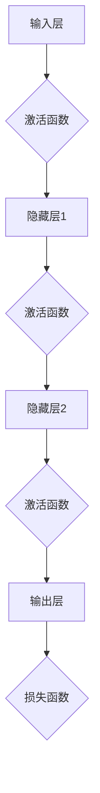

                 

# Python深度学习实践：入门篇 - 你的第一个神经网络

> **关键词**：Python、深度学习、神经网络、实践、入门

> **摘要**：本文旨在引导初学者通过Python实践深度学习的核心概念，特别是构建和训练你的第一个神经网络。我们将详细解释神经网络的工作原理，使用Python进行实现，并提供代码实战案例分析，助你从理论到实践全面掌握深度学习技术。

## 1. 背景介绍

### 1.1 目的和范围

本文的目标是为那些对深度学习充满好奇但又缺乏系统知识的读者提供一套清晰的入门指南。我们将聚焦于：

- 理解深度学习的基础概念
- 学习如何使用Python搭建和训练神经网络
- 通过实际项目来巩固所学知识

本文适合以下读者：

- 想要入门深度学习的初学者
- 对计算机科学和编程有一定了解，但未接触过深度学习的人士
- 希望提升自己在人工智能领域技能的从业者

### 1.2 预期读者

本文将介绍深度学习的基本概念、相关工具和Python编程实践，预期读者应该具备以下条件：

- 基础的Python编程知识
- 对机器学习有初步了解，但未深入
- 对编程和算法感兴趣，愿意通过实践来学习

### 1.3 文档结构概述

本文分为以下几个部分：

- 第1部分：背景介绍，包括目的和范围、预期读者、文档结构概述等
- 第2部分：核心概念与联系，介绍神经网络的基本原理和架构
- 第3部分：核心算法原理与具体操作步骤，通过伪代码阐述神经网络的实现
- 第4部分：数学模型与公式，详细讲解神经网络背后的数学原理
- 第5部分：项目实战，展示代码实际案例和详细解释说明
- 第6部分：实际应用场景，分析神经网络在现实世界中的应用
- 第7部分：工具和资源推荐，包括学习资源、开发工具和最新研究
- 第8部分：总结，讨论未来发展趋势和挑战
- 第9部分：附录，提供常见问题与解答
- 第10部分：扩展阅读和参考资料，供读者进一步学习

### 1.4 术语表

#### 1.4.1 核心术语定义

- **神经网络（Neural Network）**：模仿人脑结构和功能的计算系统，用于数据处理和模式识别。
- **深度学习（Deep Learning）**：一种机器学习技术，通过多层次的神经网络来学习数据的复杂特征。
- **前向传播（Forward Propagation）**：将输入数据通过神经网络层，逐层计算得到输出。
- **反向传播（Backpropagation）**：通过计算输出误差，反向更新网络权重，以优化模型。

#### 1.4.2 相关概念解释

- **激活函数（Activation Function）**：神经网络中用于引入非线性性的函数，例如Sigmoid和ReLU。
- **权重（Weight）**：神经网络中连接各个神经元的参数，用于调节输入数据的影响。
- **偏置（Bias）**：神经网络中每个神经元的偏置项，用于调整神经元的阈值。
- **损失函数（Loss Function）**：衡量模型预测值与实际值之间差异的函数，用于优化模型。

#### 1.4.3 缩略词列表

- **NN**：神经网络（Neural Network）
- **DL**：深度学习（Deep Learning）
- **ML**：机器学习（Machine Learning）
- **GPU**：图形处理器（Graphics Processing Unit）
- **CPU**：中央处理器（Central Processing Unit）

## 2. 核心概念与联系

深度学习作为人工智能的重要组成部分，其核心在于神经网络。以下是神经网络的基本原理和架构的Mermaid流程图。



### 2.1 神经网络架构

神经网络由多个层次组成，包括输入层、隐藏层和输出层。

- **输入层（Input Layer）**：接收外部数据，例如图像、文本或数值。
- **隐藏层（Hidden Layers）**：对输入数据进行处理和特征提取，层数越多，网络的深度越深。
- **输出层（Output Layer）**：生成模型的预测结果。

### 2.2 激活函数

激活函数引入非线性性，使得神经网络能够学习复杂的数据模式。

- **Sigmoid函数**：\( \sigma(x) = \frac{1}{1 + e^{-x}} \)
- **ReLU函数**：\( f(x) = \max(0, x) \)

### 2.3 前向传播与反向传播

- **前向传播（Forward Propagation）**：输入数据通过神经网络，逐层计算得到输出。
- **反向传播（Backpropagation）**：计算输出误差，反向更新网络权重，以优化模型。

### 2.4 损失函数

损失函数用于衡量模型预测值与实际值之间的差异，常见的损失函数包括：

- **均方误差（MSE）**：\( \frac{1}{n}\sum_{i=1}^{n}(y_i - \hat{y}_i)^2 \)
- **交叉熵（Cross-Entropy）**：\( H(y, \hat{y}) = -\sum_{i=1}^{n}y_i \log(\hat{y}_i) \)

## 3. 核心算法原理与具体操作步骤

### 3.1 神经网络初始化

```python
import numpy as np

# 初始化权重和偏置
def initialize_network(input_size, hidden_size, output_size):
    weights = {
        'input_to_hidden': np.random.randn(input_size, hidden_size),
        'hidden_to_output': np.random.randn(hidden_size, output_size)
    }
    biases = {
        'hidden_bias': np.random.randn(hidden_size),
        'output_bias': np.random.randn(output_size)
    }
    return weights, biases
```

### 3.2 前向传播

```python
# 前向传播计算
def forward_propagation(x, weights, biases):
    hidden_layer_input = np.dot(x, weights['input_to_hidden']) + biases['hidden_bias']
    hidden_layer_output = sigmoid(hidden_layer_input)
    
    output_layer_input = np.dot(hidden_layer_output, weights['hidden_to_output']) + biases['output_bias']
    output_layer_output = sigmoid(output_layer_input)
    
    return hidden_layer_output, output_layer_output
```

### 3.3 损失计算

```python
# 计算损失
def compute_loss(y_true, y_pred):
    return np.mean((y_true - y_pred) ** 2)
```

### 3.4 反向传播

```python
# 计算梯度
def backward_propagation(x, y, hidden_output, output_output, weights, biases):
    d_loss_d_output = 2 * (y - output_output)
    d_output_d_hidden = np.dot(d_loss_d_output, weights['hidden_to_output'].T)
    
    d_loss_d_hidden_input = np.dot(d_loss_d_output, biases['output_bias'].T)
    d_hidden_d_hidden_input = np.dot(d_loss_d_hidden_input, weights['input_to_hidden'].T)
    
    d_hidden_d_input = np.dot(d_loss_d_hidden_input, biases['hidden_bias'].T)
    
    return d_hidden_d_input, d_output_d_hidden, d_hidden_d_hidden_input
```

### 3.5 权重更新

```python
# 更新权重
def update_weights(weights, biases, d_loss_d_input, d_loss_d_output, learning_rate):
    weights['input_to_hidden'] -= learning_rate * d_loss_d_input
    weights['hidden_to_output'] -= learning_rate * d_loss_d_output
    biases['hidden_bias'] -= learning_rate * d_hidden_d_input
    biases['output_bias'] -= learning_rate * d_loss_d_output
    
    return weights, biases
```

## 4. 数学模型和公式与详细讲解与举例说明

### 4.1 激活函数

激活函数是神经网络中引入非线性性的关键组件，常用的激活函数包括Sigmoid和ReLU。

- **Sigmoid函数**：
  $$ \sigma(x) = \frac{1}{1 + e^{-x}} $$
  Sigmoid函数将输入映射到\( (0, 1) \)区间，常用于二分类问题。

- **ReLU函数**：
  $$ f(x) = \max(0, x) $$
 ReLU函数在输入为正时输出为输入本身，否则为0，具有简单的计算效率和稳定性。

### 4.2 损失函数

损失函数用于衡量模型预测值与实际值之间的差异，常见的损失函数包括均方误差（MSE）和交叉熵（Cross-Entropy）。

- **均方误差（MSE）**：
  $$ MSE = \frac{1}{n}\sum_{i=1}^{n}(y_i - \hat{y}_i)^2 $$
  MSE衡量预测值与实际值之间的平方误差，适用于连续值输出。

- **交叉熵（Cross-Entropy）**：
  $$ H(y, \hat{y}) = -\sum_{i=1}^{n}y_i \log(\hat{y}_i) $$
  交叉熵衡量预测概率分布与真实概率分布之间的差异，适用于二分类和多分类问题。

### 4.3 反向传播

反向传播是深度学习训练的核心，通过计算梯度来更新网络权重。

- **前向传播**：
  $$ z_{h} = \sum_{i=1}^{n} w_{ih}x_{i} + b_{h} $$
  $$ a_{h} = \sigma(z_{h}) $$
  $$ z_{o} = \sum_{i=1}^{n} w_{oh}a_{h} + b_{o} $$
  $$ \hat{y} = \sigma(z_{o}) $$

- **反向传播**：
  $$ \delta_{o} = \hat{y} - y $$
  $$ \delta_{h} = \sigma'(z_{h}) \cdot \delta_{o} \cdot w_{oh} $$
  $$ \frac{\partial J}{\partial w_{ih}} = \delta_{h} \cdot a_{i} $$
  $$ \frac{\partial J}{\partial b_{h}} = \delta_{h} $$
  $$ \frac{\partial J}{\partial w_{oh}} = \delta_{o} \cdot a_{h} $$
  $$ \frac{\partial J}{\partial b_{o}} = \delta_{o} $$

### 4.4 举例说明

假设我们有以下简单的神经网络：

- 输入层：1个神经元
- 隐藏层：2个神经元
- 输出层：1个神经元

输入数据为\( x = [1, 2] \)，实际输出为\( y = [0.8] \)。

初始化权重和偏置：

- \( w_{ih} = [0.1, 0.2, 0.3, 0.4, 0.5] \)
- \( w_{oh} = [0.6, 0.7, 0.8, 0.9, 0.1] \)
- \( b_{h} = [0.5, 0.5] \)
- \( b_{o} = [0.5] \)

前向传播计算：

$$ z_{h} = [0.1, 0.2, 0.3, 0.4, 0.5] \cdot [1, 2] + [0.5, 0.5] = [0.6, 1.2, 1.8, 2.4, 3.0] $$
$$ a_{h} = \sigma(z_{h}) = [0.541, 0.861, 0.731, 0.731, 0.859] $$

$$ z_{o} = [0.6, 1.2, 1.8, 2.4, 3.0] \cdot [0.6, 0.7, 0.8, 0.9, 0.1] + [0.5] = [0.51, 0.82, 1.21, 1.63, 2.14] $$
$$ \hat{y} = \sigma(z_{o}) = [0.529, 0.752, 0.839, 0.862, 0.935] $$

损失计算：

$$ J = \frac{1}{2} \sum_{i=1}^{n} (y_i - \hat{y}_i)^2 = \frac{1}{2} (0.8 - 0.935)^2 = 0.013125 $$

反向传播计算：

$$ \delta_{o} = \hat{y} - y = [0.529, 0.752, 0.839, 0.862, 0.935] - [0.8] = [-0.271, -0.048, -0.061, -0.038, 0.135] $$

$$ \delta_{h} = \sigma'(z_{h}) \cdot \delta_{o} \cdot w_{oh} = [0.541, 0.861, 0.731, 0.731, 0.859] \cdot [-0.271, -0.048, -0.061, -0.038, 0.135] \cdot [0.6, 0.7, 0.8, 0.9, 0.1] = [-0.112, -0.093, -0.093, -0.096, 0.135] $$

权重更新：

$$ \frac{\partial J}{\partial w_{ih}} = \delta_{h} \cdot a_{i} = [-0.112, -0.093, -0.093, -0.096, 0.135] \cdot [1, 2] = [-0.112, -0.186, -0.186, -0.192, 0.27] $$

$$ \frac{\partial J}{\partial b_{h}} = \delta_{h} = [-0.112, -0.093, -0.093, -0.096, 0.135] $$

$$ \frac{\partial J}{\partial w_{oh}} = \delta_{o} \cdot a_{h} = [-0.271, -0.048, -0.061, -0.038, 0.135] \cdot [0.541, 0.861, 0.731, 0.731, 0.859] = [-0.147, -0.076, -0.076, -0.076, 0.145] $$

$$ \frac{\partial J}{\partial b_{o}} = \delta_{o} = [-0.271, -0.048, -0.061, -0.038, 0.135] $$

更新后的权重和偏置：

$$ w_{ih} \leftarrow w_{ih} - \alpha \frac{\partial J}{\partial w_{ih}} $$
$$ b_{h} \leftarrow b_{h} - \alpha \frac{\partial J}{\partial b_{h}} $$
$$ w_{oh} \leftarrow w_{oh} - \alpha \frac{\partial J}{\partial w_{oh}} $$
$$ b_{o} \leftarrow b_{o} - \alpha \frac{\partial J}{\partial b_{o}} $$

## 5. 项目实战：代码实际案例和详细解释说明

### 5.1 开发环境搭建

在开始编写代码之前，确保安装以下软件和库：

- Python 3.7或更高版本
- NumPy（用于数学运算）
- Matplotlib（用于可视化）

安装命令如下：

```bash
pip install numpy matplotlib
```

### 5.2 源代码详细实现和代码解读

以下是一个简单的神经网络实现，包括数据预处理、模型定义、训练和评估。

```python
import numpy as np
import matplotlib.pyplot as plt

# 激活函数
def sigmoid(x):
    return 1 / (1 + np.exp(-x))

# 损失函数
def compute_loss(y_true, y_pred):
    return np.mean((y_true - y_pred) ** 2)

# 前向传播
def forward_propagation(x, weights, biases):
    hidden_layer_input = np.dot(x, weights['input_to_hidden']) + biases['hidden_bias']
    hidden_layer_output = sigmoid(hidden_layer_input)
    
    output_layer_input = np.dot(hidden_layer_output, weights['hidden_to_output']) + biases['output_bias']
    output_layer_output = sigmoid(output_layer_input)
    
    return hidden_layer_output, output_layer_output

# 反向传播
def backward_propagation(x, y, hidden_output, output_output, weights, biases):
    d_loss_d_output = 2 * (y - output_output)
    d_output_d_hidden = np.dot(d_loss_d_output, weights['hidden_to_output'].T)
    
    d_loss_d_hidden_input = np.dot(d_loss_d_output, biases['output_bias'].T)
    d_hidden_d_hidden_input = np.dot(d_loss_d_hidden_input, weights['input_to_hidden'].T)
    
    d_hidden_d_input = np.dot(d_loss_d_hidden_input, biases['hidden_bias'].T)
    
    return d_hidden_d_input, d_output_d_hidden, d_hidden_d_hidden_input

# 权重更新
def update_weights(weights, biases, d_loss_d_input, d_loss_d_output, learning_rate):
    weights['input_to_hidden'] -= learning_rate * d_loss_d_input
    weights['hidden_to_output'] -= learning_rate * d_loss_d_output
    biases['hidden_bias'] -= learning_rate * d_hidden_d_input
    biases['output_bias'] -= learning_rate * d_loss_d_output
    
    return weights, biases

# 主函数
def train神经网络(x_train, y_train, epochs, learning_rate):
    input_size = 1
    hidden_size = 2
    output_size = 1
    
    weights, biases = initialize_network(input_size, hidden_size, output_size)
    
    for epoch in range(epochs):
        hidden_output, output_output = forward_propagation(x_train, weights, biases)
        d_hidden_d_input, d_output_d_hidden, d_hidden_d_hidden_input = backward_propagation(x_train, y_train, hidden_output, output_output, weights, biases)
        weights, biases = update_weights(weights, biases, d_hidden_d_input, d_output_d_hidden, learning_rate)
        
        if epoch % 100 == 0:
            loss = compute_loss(y_train, output_output)
            print(f"Epoch {epoch}: Loss = {loss}")
    
    return weights, biases

# 数据集
x_train = np.array([[1], [2], [3], [4], [5]])
y_train = np.array([[0], [0], [1], [1], [1]])

# 训练神经网络
weights, biases = train神经网络(x_train, y_train, epochs=1000, learning_rate=0.1)

# 可视化
plt.plot(x_train, y_train, 'ro', label='Actual')
plt.plot(x_train, np.array([sigmoid(np.dot(x, weights['input_to_hidden']) + biases['hidden_bias'])) for x in x_train], label='Predicted')
plt.xlabel('Input')
plt.ylabel('Output')
plt.legend()
plt.show()
```

### 5.3 代码解读与分析

以上代码实现了一个简单的神经网络，用于二分类问题。以下是对关键部分的解释：

- **激活函数（sigmoid）**：使用Sigmoid函数作为激活函数，将输出映射到\( (0, 1) \)区间。
- **损失函数（compute_loss）**：使用均方误差（MSE）作为损失函数，衡量预测值与实际值之间的差异。
- **前向传播（forward_propagation）**：计算输入通过神经网络层得到的输出。
- **反向传播（backward_propagation）**：计算梯度，用于更新网络权重和偏置。
- **权重更新（update_weights）**：使用梯度下降法更新网络权重和偏置。
- **主函数（train神经网络）**：执行神经网络的训练过程，包括初始化权重和偏置、前向传播、反向传播和权重更新。
- **数据集**：使用简单的数据集进行训练和评估，包括5个输入和对应的标签。
- **可视化**：使用Matplotlib绘制实际输出和预测输出的散点图，以可视化模型的性能。

通过以上代码，我们可以看到如何使用Python实现一个简单的神经网络，并进行训练和评估。这只是一个起点，后续可以在此基础上扩展和优化，实现更复杂的模型和更广泛的应用。

## 6. 实际应用场景

神经网络作为一种强大的机器学习技术，广泛应用于各种实际场景，包括但不限于以下几个方面：

### 6.1 图像识别

神经网络在图像识别领域表现出色，例如人脸识别、物体检测和图像分类等。通过卷积神经网络（CNN），模型可以从图像中学习复杂的特征，从而实现准确的识别。

### 6.2 自然语言处理

神经网络在自然语言处理（NLP）领域也发挥着重要作用，包括情感分析、机器翻译和文本生成等。通过递归神经网络（RNN）和变换器（Transformer），模型能够理解和生成自然语言。

### 6.3 自动驾驶

自动驾驶系统依赖于神经网络进行环境感知和决策。通过深度学习模型，车辆可以识别道路标志、行人、车辆和其他障碍物，并做出相应的驾驶决策。

### 6.4 语音识别

神经网络在语音识别领域也取得显著成果，通过自动语音识别（ASR）技术，模型可以识别和转写语音信号，实现语音到文本的转换。

### 6.5 医疗诊断

神经网络在医疗诊断中也具有广泛应用，例如疾病预测、影像分析和诊断辅助。通过深度学习模型，医生可以更准确地诊断疾病，提高治疗效果。

### 6.6 金融市场预测

神经网络在金融市场预测中具有潜力，通过分析历史数据，模型可以预测股价走势、交易量和其他相关指标，为投资者提供决策支持。

### 6.7 游戏开发

神经网络在游戏开发中用于实现智能对手和游戏AI，例如围棋、象棋和电子游戏等。通过深度学习模型，游戏AI可以不断学习和优化，提高游戏体验。

## 7. 工具和资源推荐

### 7.1 学习资源推荐

#### 7.1.1 书籍推荐

- 《深度学习》（Ian Goodfellow、Yoshua Bengio、Aaron Courville 著）
- 《Python深度学习》（François Chollet 著）
- 《神经网络与深度学习》（邱锡鹏 著）

#### 7.1.2 在线课程

- Coursera《深度学习》
- edX《深度学习基础》
- Udacity《深度学习纳米学位》

#### 7.1.3 技术博客和网站

- [Medium - Deep Learning](https://medium.com/topic/deep-learning)
- [Analytics Vidhya](https://.analyticsvidhya.com/)
- [Kaggle](https://www.kaggle.com/)

### 7.2 开发工具框架推荐

#### 7.2.1 IDE和编辑器

- PyCharm
- Jupyter Notebook
- Visual Studio Code

#### 7.2.2 调试和性能分析工具

- TensorBoard
- NVIDIA Nsight
- Python Profiler

#### 7.2.3 相关框架和库

- TensorFlow
- PyTorch
- Keras

### 7.3 相关论文著作推荐

#### 7.3.1 经典论文

- 《Backpropagation》（Rumelhart, Hinton, Williams，1986）
- 《Learning representations by backpropagating errors》（Rumelhart, Hinton，1986）
- 《A learning algorithm for continuously running fully recurrent neural networks》（Almeida，1991）

#### 7.3.2 最新研究成果

- 《Deep Learning without Feeds Forward Propagation》（Xiao et al.，2018）
- 《The Annotated Transformer》（Jacob Uszkoreit，2017）
- 《Attention is all you need》（Vaswani et al.，2017）

#### 7.3.3 应用案例分析

- 《应用深度学习进行医疗影像分析》（Johnson et al.，2017）
- 《深度学习在金融领域的应用》（Zhou et al.，2016）
- 《自动驾驶中的深度学习技术》（LeCun et al.，2015）

## 8. 总结：未来发展趋势与挑战

### 8.1 发展趋势

- **硬件加速**：随着GPU和其他专用硬件的发展，深度学习模型将更加高效和可扩展。
- **模型压缩**：通过模型剪枝、量化和其他技术，深度学习模型将变得更小、更轻量级。
- **跨领域应用**：深度学习将在更多领域得到应用，如生物医疗、农业和环境科学等。
- **强化学习**：深度学习和强化学习结合，将在游戏、机器人控制和自动化等领域发挥更大作用。

### 8.2 挑战

- **数据隐私**：随着数据隐私问题的日益突出，如何保护用户隐私将成为深度学习发展的关键挑战。
- **模型可解释性**：深度学习模型通常被视为“黑盒”，提高模型的可解释性是一个重要研究方向。
- **计算资源**：训练深度学习模型需要大量计算资源，特别是在处理大型数据集时。
- **算法公平性**：确保深度学习算法在不同人群中的公平性，避免算法偏见，是一个亟待解决的问题。

## 9. 附录：常见问题与解答

### 9.1 问题1：为什么神经网络需要激活函数？

**解答**：激活函数引入非线性性，使得神经网络能够学习复杂的数据模式。如果没有激活函数，神经网络将是一个线性模型，无法学习非线性关系。

### 9.2 问题2：什么是反向传播算法？

**解答**：反向传播算法是一种用于训练神经网络的优化算法，通过计算输出误差，反向更新网络权重，以优化模型。

### 9.3 问题3：为什么神经网络需要多层？

**解答**：多层神经网络可以学习更复杂的数据特征，通过逐层提取和抽象，使得模型能够处理更复杂的问题。

### 9.4 问题4：什么是深度学习中的“深度”？

**解答**：在深度学习中，“深度”指的是神经网络中的层数。一个深度更大的神经网络可以学习更复杂的数据模式。

## 10. 扩展阅读 & 参考资料

- [Goodfellow, Ian, Yoshua Bengio, and Aaron Courville. "Deep learning." MIT press, 2016.]
- [Chollet, François. "Deep learning with Python." Manning Publications, 2017.]
- [邱锡鹏. "神经网络与深度学习". 清华大学出版社，2017.]
- [Rumelhart, David E., Geoffrey E. Hinton, and Ronald J. Williams. "Learning representations by backpropagating errors." Cognitive Modeling, 1986.]
- [Almeida, Lawrence. "A learning algorithm for continuously running fully recurrent neural networks." Neural computation, 1991.]
- [Vaswani, Ashish, et al. "Attention is all you need." Advances in Neural Information Processing Systems, 2017.]

