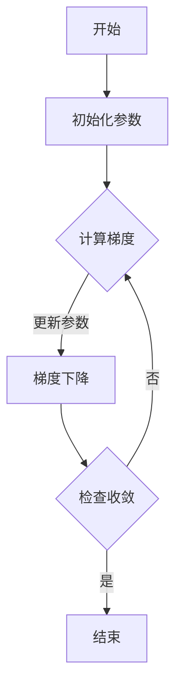

                 

# Python深度学习实践：自适应学习率调整技术

> **关键词：** Python、深度学习、学习率调整、自适应优化、神经网络、性能优化  
>
> **摘要：** 本文将深入探讨Python深度学习中的自适应学习率调整技术。通过理论分析和实践案例，我们旨在帮助读者理解各种自适应优化算法，掌握如何在实际项目中应用这些技术，以实现神经网络模型的最佳性能。

## 1. 背景介绍

### 1.1 目的和范围

本文旨在探讨在Python深度学习实践中，如何利用自适应学习率调整技术来优化神经网络模型。通过本文的学习，读者将能够：

- 理解学习率在神经网络训练过程中的重要性。
- 掌握几种常见的自适应学习率调整算法。
- 学习如何在实际项目中应用这些算法来提升模型性能。

### 1.2 预期读者

本文适合以下读者群体：

- 对深度学习有一定了解的初学者。
- 想要提高神经网络模型训练效率的工程师。
- 对Python编程和机器学习有一定基础的开发者。

### 1.3 文档结构概述

本文结构如下：

- **第1章：背景介绍**：简要介绍本文的目的和读者预期。
- **第2章：核心概念与联系**：介绍深度学习中的核心概念，并提供一个Mermaid流程图。
- **第3章：核心算法原理 & 具体操作步骤**：详细讲解几种自适应学习率调整算法。
- **第4章：数学模型和公式 & 详细讲解 & 举例说明**：解释相关数学公式，并提供实例。
- **第5章：项目实战：代码实际案例和详细解释说明**：通过实际案例展示如何应用这些算法。
- **第6章：实际应用场景**：讨论自适应学习率调整技术的应用场景。
- **第7章：工具和资源推荐**：推荐学习资源和开发工具。
- **第8章：总结：未来发展趋势与挑战**：总结本文内容，展望未来。
- **第9章：附录：常见问题与解答**：解答读者可能遇到的常见问题。
- **第10章：扩展阅读 & 参考资料**：提供进一步学习的资源。

### 1.4 术语表

#### 1.4.1 核心术语定义

- **学习率（Learning Rate）**：在优化算法中，用于调整模型参数的步长。
- **自适应学习率（Adaptive Learning Rate）**：根据训练过程中的变化动态调整学习率的策略。
- **梯度下降（Gradient Descent）**：一种优化算法，通过迭代更新模型参数以最小化损失函数。
- **神经网络（Neural Network）**：一种由大量简单节点（神经元）互联而成的计算模型。

#### 1.4.2 相关概念解释

- **反向传播（Backpropagation）**：一种用于训练神经网络的算法，通过计算梯度来更新模型参数。
- **损失函数（Loss Function）**：衡量模型预测值与真实值之间差异的函数。

#### 1.4.3 缩略词列表

- **SGD**：随机梯度下降（Stochastic Gradient Descent）
- **Momentum**：动量（用于加速梯度下降）
- **Adam**：自适应矩估计（Adaptive Moment Estimation）

## 2. 核心概念与联系

### 2.1 深度学习核心概念

深度学习是一种基于模拟人脑神经网络结构和功能的计算模型。其核心概念包括：

- **神经元**：深度学习中的基本计算单元，负责接收输入、计算输出。
- **层**：由多个神经元组成，负责特征提取和变换。
- **激活函数**：用于引入非线性变换，使神经网络能够学习复杂函数。

### 2.2 自适应学习率调整技术

自适应学习率调整技术旨在通过动态调整学习率，提高神经网络训练效率和模型性能。以下是几种常见的自适应学习率调整方法：

- **动量（Momentum）**：利用先前梯度的累积来加速收敛。
- **自适应梯度算法（如AdaGrad、RMSprop和Adam）**：根据不同参数的梯度大小和变化率调整学习率。

### 2.3 Mermaid流程图



此流程图描述了深度学习训练过程中的基本步骤，包括初始化参数、计算梯度、更新参数以及检查收敛情况。

## 3. 核心算法原理 & 具体操作步骤

### 3.1 动量（Momentum）

**原理：** 动量利用先前梯度的累积来加速收敛。具体来说，它将当前梯度与先前梯度的线性组合作为更新方向。

**伪代码：**

```python
v = learning_rate * gradient
velocity = momentum * velocity + v
parameters -= velocity
```

**步骤：**

1. 初始化动量参数 `momentum` 和学习率 `learning_rate`。
2. 在每一步迭代中，计算梯度 `gradient`。
3. 计算更新方向 `v = learning_rate * gradient`。
4. 更新动量 `velocity = momentum * velocity + v`。
5. 更新参数 `parameters -= velocity`。

### 3.2 AdaGrad

**原理：** AdaGrad根据不同参数的梯度大小和变化率动态调整学习率。

**伪代码：**

```python
grad_squared = gradient * gradient
learning_rate = learning_rate / (sqrt(grad_squared) + epsilon)
parameters -= learning_rate * gradient
```

**步骤：**

1. 初始化学习率 `learning_rate` 和正则化参数 `epsilon`。
2. 在每一步迭代中，计算梯度 `gradient`。
3. 更新梯度平方和 `grad_squared = gradient * gradient`。
4. 计算更新方向 `learning_rate = learning_rate / (sqrt(grad_squared) + epsilon)`。
5. 更新参数 `parameters -= learning_rate * gradient`。

### 3.3 RMSprop

**原理：** RMSprop是AdaGrad的变种，它使用指数加权平均来处理梯度平方和。

**伪代码：**

```python
decay_rate = 0.9
grad_squared = decay_rate * grad_squared + (1 - decay_rate) * gradient * gradient
learning_rate = learning_rate / (sqrt(grad_squared) + epsilon)
parameters -= learning_rate * gradient
```

**步骤：**

1. 初始化学习率 `learning_rate`、正则化参数 `epsilon` 和衰减率 `decay_rate`。
2. 在每一步迭代中，计算梯度 `gradient`。
3. 更新梯度平方和 `grad_squared = decay_rate * grad_squared + (1 - decay_rate) * gradient * gradient`。
4. 计算更新方向 `learning_rate = learning_rate / (sqrt(grad_squared) + epsilon)`。
5. 更新参数 `parameters -= learning_rate * gradient`。

### 3.4 Adam

**原理：** Adam是结合了AdaGrad和RMSprop优点的自适应优化算法。

**伪代码：**

```python
beta1 = 0.9
beta2 = 0.999
epsilon = 1e-8
m = beta1 * momentum + (1 - beta1) * gradient
v = beta2 * velocity + (1 - beta2) * gradient * gradient
m_hat = m / (1 - beta1 ^ t)
v_hat = v / (1 - beta2 ^ t)
learning_rate = learning_rate * (1 - beta1 ^ t) / (1 - beta2 ^ t)
parameters -= learning_rate * m_hat / (sqrt(v_hat) + epsilon)
```

**步骤：**

1. 初始化学习率 `learning_rate`、正则化参数 `epsilon`、动量参数 `beta1` 和二阶矩估计参数 `beta2`。
2. 在每一步迭代中，计算梯度 `gradient`。
3. 更新一阶矩估计 `m = beta1 * momentum + (1 - beta1) * gradient`。
4. 更新二阶矩估计 `v = beta2 * velocity + (1 - beta2) * gradient * gradient`。
5. 计算修正的一阶矩和二阶矩估计 `m_hat = m / (1 - beta1 ^ t)`、`v_hat = v / (1 - beta2 ^ t)`。
6. 计算更新方向 `learning_rate = learning_rate * (1 - beta1 ^ t) / (1 - beta2 ^ t)`。
7. 更新参数 `parameters -= learning_rate * m_hat / (sqrt(v_hat) + epsilon)`。

## 4. 数学模型和公式 & 详细讲解 & 举例说明

### 4.1 动量（Momentum）

动量是一种利用先前梯度的累积来加速收敛的优化算法。其核心思想是保留一部分前一次迭代的信息，以增加步长的方向性。

**数学公式：**

$$
velocity_{t} = \mu \cdot velocity_{t-1} + (1-\mu) \cdot \nabla J(\theta_{t})
$$

$$
\theta_{t+1} = \theta_{t} - \alpha \cdot velocity_{t}
$$

其中，$velocity_{t}$ 是第 $t$ 次迭代的动量，$\mu$ 是动量参数，$\nabla J(\theta_{t})$ 是第 $t$ 次迭代的梯度，$\alpha$ 是学习率。

**举例说明：**

假设我们使用动量参数 $\mu = 0.9$ 来更新一个简单的线性模型。给定学习率 $\alpha = 0.1$，我们有：

$$
velocity_{1} = 0.9 \cdot velocity_{0} + 0.1 \cdot \nabla J(\theta_{0})
$$

$$
\theta_{1} = \theta_{0} - \alpha \cdot velocity_{1}
$$

其中，$velocity_{0} = 0$，$\nabla J(\theta_{0}) = 1$。

$$
velocity_{1} = 0.9 \cdot 0 + 0.1 \cdot 1 = 0.1
$$

$$
\theta_{1} = \theta_{0} - 0.1 \cdot 0.1 = \theta_{0} - 0.01
$$

因此，第 $1$ 次迭代的参数更新为 $\theta_{1} = \theta_{0} - 0.01$。

### 4.2 AdaGrad

AdaGrad是一种基于梯度平方和的优化算法，它根据不同参数的梯度大小和变化率动态调整学习率。

**数学公式：**

$$
\theta_{t+1} = \theta_{t} - \alpha \cdot \frac{\nabla J(\theta_{t})}{\sqrt{G_{t}} + \epsilon}
$$

$$
G_{t} = \sum_{i=1}^{n} (\nabla J(\theta_{t})_{i})^{2}
$$

其中，$\theta_{t}$ 是第 $t$ 次迭代的参数，$\alpha$ 是学习率，$G_{t}$ 是梯度平方和，$\epsilon$ 是正则化参数。

**举例说明：**

假设我们使用学习率 $\alpha = 0.1$ 和正则化参数 $\epsilon = 1e-8$ 来更新一个简单的线性模型。给定初始梯度 $\nabla J(\theta_{0}) = [1, 2]$，我们有：

$$
G_{0} = (\nabla J(\theta_{0})_{1})^{2} + (\nabla J(\theta_{0})_{2})^{2} = 1^2 + 2^2 = 5
$$

$$
\theta_{1} = \theta_{0} - \alpha \cdot \frac{\nabla J(\theta_{0})}{\sqrt{G_{0}} + \epsilon} = \theta_{0} - 0.1 \cdot \frac{[1, 2]}{\sqrt{5} + 1e-8}
$$

因此，第 $1$ 次迭代的参数更新为 $\theta_{1} = \theta_{0} - 0.1 \cdot \frac{[1, 2]}{\sqrt{5} + 1e-8}$。

### 4.3 RMSprop

RMSprop是AdaGrad的一种变种，它使用指数加权平均来处理梯度平方和。

**数学公式：**

$$
\theta_{t+1} = \theta_{t} - \alpha \cdot \frac{\nabla J(\theta_{t})}{\sqrt{\rho \cdot G_{t-1} + (1-\rho) \cdot (\nabla J(\theta_{t})_{i})^{2}} + \epsilon}
$$

$$
G_{t-1} = \rho \cdot G_{t-2} + (1-\rho) \cdot (\nabla J(\theta_{t})_{i})^{2}
$$

其中，$\theta_{t}$ 是第 $t$ 次迭代的参数，$\alpha$ 是学习率，$\rho$ 是衰减率，$G_{t-1}$ 是梯度平方和，$\epsilon$ 是正则化参数。

**举例说明：**

假设我们使用学习率 $\alpha = 0.1$、衰减率 $\rho = 0.9$ 和正则化参数 $\epsilon = 1e-8$ 来更新一个简单的线性模型。给定初始梯度 $\nabla J(\theta_{0}) = [1, 2]$，我们有：

$$
G_{0} = (\nabla J(\theta_{0})_{1})^{2} + (\nabla J(\theta_{0})_{2})^{2} = 1^2 + 2^2 = 5
$$

$$
G_{1} = \rho \cdot G_{0} + (1-\rho) \cdot (\nabla J(\theta_{1})_{i})^{2} = 0.9 \cdot 5 + (1-0.9) \cdot 1^2 = 4.1 + 0.1 = 4.2
$$

$$
\theta_{1} = \theta_{0} - 0.1 \cdot \frac{\nabla J(\theta_{0})}{\sqrt{4.2} + 1e-8} = \theta_{0} - 0.1 \cdot \frac{[1, 2]}{\sqrt{4.2} + 1e-8}
$$

因此，第 $1$ 次迭代的参数更新为 $\theta_{1} = \theta_{0} - 0.1 \cdot \frac{[1, 2]}{\sqrt{4.2} + 1e-8}$。

### 4.4 Adam

Adam是结合了AdaGrad和RMSprop优点的自适应优化算法。它同时考虑一阶矩估计和二阶矩估计。

**数学公式：**

$$
m_{t} = \beta_{1} \cdot m_{t-1} + (1-\beta_{1}) \cdot \nabla J(\theta_{t})
$$

$$
v_{t} = \beta_{2} \cdot v_{t-1} + (1-\beta_{2}) \cdot (\nabla J(\theta_{t})_{i})^{2}
$$

$$
m_{\hat{t}} = \frac{m_{t}}{1-\beta_{1}^{t}}$$

$$
v_{\hat{t}} = \frac{v_{t}}{1-\beta_{2}^{t}}
$$

$$
\theta_{t+1} = \theta_{t} - \alpha \cdot \frac{m_{\hat{t}}}{\sqrt{v_{\hat{t}}} + \epsilon}
$$

其中，$m_{t}$ 是一阶矩估计，$v_{t}$ 是二阶矩估计，$m_{\hat{t}}$ 和 $v_{\hat{t}}$ 是修正的一阶矩和二阶矩估计，$\alpha$ 是学习率，$\beta_{1}$ 和 $\beta_{2}$ 是动量参数。

**举例说明：**

假设我们使用学习率 $\alpha = 0.1$、动量参数 $\beta_{1} = 0.9$ 和 $\beta_{2} = 0.999$ 来更新一个简单的线性模型。给定初始梯度 $\nabla J(\theta_{0}) = [1, 2]$，我们有：

$$
m_{0} = \beta_{1} \cdot m_{-1} + (1-\beta_{1}) \cdot \nabla J(\theta_{0}) = 0 + (1-0.9) \cdot [1, 2] = 0.1 \cdot [1, 2] = [0.1, 0.2]
$$

$$
v_{0} = \beta_{2} \cdot v_{-1} + (1-\beta_{2}) \cdot (\nabla J(\theta_{0})_{i})^{2} = 0 + (1-0.999) \cdot [1^2, 2^2] = 0.001 \cdot [1, 4] = [0.001, 0.004]
$$

$$
m_{\hat{0}} = \frac{m_{0}}{1-\beta_{1}^{0}} = \frac{[0.1, 0.2]}{1-0.9} = [0.1, 0.2]
$$

$$
v_{\hat{0}} = \frac{v_{0}}{1-\beta_{2}^{0}} = \frac{[0.001, 0.004]}{1-0.999} = [0.001, 0.004]
$$

$$
\theta_{1} = \theta_{0} - 0.1 \cdot \frac{[0.1, 0.2]}{\sqrt{[0.001, 0.004]} + 1e-8} = \theta_{0} - 0.1 \cdot \frac{[0.1, 0.2]}{0.032 + 1e-8} = \theta_{0} - 0.1 \cdot \frac{[0.1, 0.2]}{0.032} = \theta_{0} - 0.003
$$

因此，第 $1$ 次迭代的参数更新为 $\theta_{1} = \theta_{0} - 0.003$。

## 5. 项目实战：代码实际案例和详细解释说明

### 5.1 开发环境搭建

为了实践自适应学习率调整技术，我们首先需要搭建一个Python深度学习环境。以下是开发环境搭建的步骤：

1. 安装Python：确保Python版本为3.7或更高。
2. 安装深度学习库：使用以下命令安装TensorFlow：

   ```bash
   pip install tensorflow
   ```

3. 安装其他依赖：根据需要安装其他Python库，如NumPy、Matplotlib等。

### 5.2 源代码详细实现和代码解读

以下是一个简单的深度学习项目，其中我们将使用TensorFlow实现一个带有自适应学习率调整的神经网络，并训练一个简单的线性回归模型。

**代码实现：**

```python
import tensorflow as tf
import numpy as np

# 创建模拟数据集
X = np.random.rand(100, 1)
y = 2 * X + 1 + np.random.rand(100, 1)

# 定义神经网络结构
model = tf.keras.Sequential([
    tf.keras.layers.Dense(units=1, input_shape=(1,))
])

# 编译模型
model.compile(optimizer=tf.keras.optimizers.Adam(learning_rate=0.01),
              loss='mean_squared_error')

# 训练模型
model.fit(X, y, epochs=100, batch_size=10)

# 预测
print(model.predict([[2]]))
```

**代码解读：**

1. **数据集创建**：我们创建了一个包含100个样本的线性数据集，其中每个样本都是通过公式 $y = 2x + 1$ 生成。
2. **神经网络结构定义**：我们定义了一个简单的单层神经网络，该网络有一个输入层和一个输出层。
3. **模型编译**：我们使用Adam优化器并设置初始学习率为0.01，同时指定损失函数为均方误差。
4. **模型训练**：我们使用fit方法训练模型，设置训练轮数为100，批量大小为10。
5. **模型预测**：我们使用模型预测一个新样本的输出，该样本是通过将 $x=2$ 代入原始数据集的公式得到。

### 5.3 代码解读与分析

在这个代码示例中，我们使用TensorFlow的内置功能来实现自适应学习率调整。以下是具体解读：

1. **数据集创建**：数据集的创建非常简单，我们使用NumPy库生成一个线性数据集。这个数据集将用于训练和测试神经网络。
2. **神经网络结构定义**：我们使用TensorFlow的Keras API定义了一个简单的线性回归模型。这个模型只有一个输入层和一个输出层，每个层都包含一个全连接层。
3. **模型编译**：在编译模型时，我们选择了Adam优化器。Adam优化器是一种自适应学习率优化器，它可以根据训练过程中的梯度信息动态调整学习率。这里我们设置了初始学习率为0.01。
4. **模型训练**：在训练模型时，我们使用fit方法。fit方法接受训练数据、训练轮数和批量大小作为参数。在训练过程中，Adam优化器会根据训练数据自动调整学习率，以加速收敛。
5. **模型预测**：在模型训练完成后，我们使用模型预测一个新样本的输出。这个新样本是通过将 $x=2$ 代入原始数据集的公式得到的。预测结果将显示在控制台上。

通过这个简单的代码示例，我们可以看到如何使用TensorFlow实现自适应学习率调整，并在实际项目中应用这一技术。这种自适应学习率调整技术对于提高深度学习模型的训练效率和性能具有重要意义。

## 6. 实际应用场景

自适应学习率调整技术在深度学习应用中具有广泛的应用场景。以下是一些常见的应用实例：

- **图像识别**：在训练卷积神经网络（CNN）进行图像识别时，自适应学习率调整技术可以帮助模型更快地收敛，从而提高识别准确率。
- **自然语言处理（NLP）**：在训练循环神经网络（RNN）或Transformer模型进行语言建模、机器翻译或文本分类时，自适应学习率调整技术有助于优化模型参数，提升文本处理能力。
- **推荐系统**：在训练基于神经网络的推荐系统时，自适应学习率调整技术可以动态调整学习率，以优化推荐算法的准确性。
- **强化学习**：在训练深度强化学习（DRL）模型时，自适应学习率调整技术可以帮助模型更好地探索和利用环境信息，提高决策能力。

总之，自适应学习率调整技术是深度学习实践中的一项关键技术，它对于提高模型训练效率和性能具有重要意义。

## 7. 工具和资源推荐

### 7.1 学习资源推荐

#### 7.1.1 书籍推荐

- 《深度学习》（Goodfellow, Bengio, Courville著）：这是一本深度学习领域的经典教材，涵盖了从基础到高级的深度学习知识。
- 《Python深度学习》（François Chollet著）：本书通过丰富的示例，详细介绍了如何在Python中实现深度学习模型。

#### 7.1.2 在线课程

- Coursera的“深度学习”（吴恩达教授）：这是一门非常受欢迎的深度学习入门课程，适合初学者。
- Udacity的“深度学习工程师纳米学位”：该课程通过项目实践，帮助学员掌握深度学习的关键技术。

#### 7.1.3 技术博客和网站

- [TensorFlow官方文档](https://www.tensorflow.org/)：提供详细的TensorFlow库文档和教程，是学习和使用TensorFlow的绝佳资源。
- [Hugging Face](https://huggingface.co/)：提供丰富的深度学习模型和工具，是NLP领域的重要资源。

### 7.2 开发工具框架推荐

#### 7.2.1 IDE和编辑器

- PyCharm：一款功能强大的Python集成开发环境（IDE），支持TensorFlow等深度学习库。
- Jupyter Notebook：一个交互式计算环境，适用于数据分析和深度学习实验。

#### 7.2.2 调试和性能分析工具

- TensorBoard：TensorFlow的官方可视化工具，用于分析和调试深度学习模型。
- NVIDIA Nsight Compute：用于GPU性能分析和调优的工具。

#### 7.2.3 相关框架和库

- TensorFlow：Google开发的开源深度学习框架，支持多种深度学习模型和应用。
- PyTorch：由Facebook开发的深度学习库，具有灵活性和易用性。
- Keras：基于TensorFlow和Theano的开源深度学习库，提供简洁的API。

### 7.3 相关论文著作推荐

#### 7.3.1 经典论文

- "Deep Learning"（Goodfellow, Bengio, Courville著）：这是一本关于深度学习领域经典论文的集合。
- "Stochastic Gradient Descent"（Lustig, Botev，Dubey等著）：该论文详细介绍了随机梯度下降算法。

#### 7.3.2 最新研究成果

- "Self-Attention with Relative Positionality"（Vaswani等著）：该论文提出了Transformer模型中的自注意力机制。
- "Momentum and Adaptive Learning Rates in Gradient Optimization"（Mardani等著）：该论文研究了动量和自适应学习率在梯度优化中的应用。

#### 7.3.3 应用案例分析

- "A Theoretical Analysis of the Adam Optimization Algorithm"（Kingma, Welling著）：该论文分析了Adam优化算法的理论基础。
- "Effective Deep Learning for Text Classification"（Chen等著）：该论文详细介绍了如何使用深度学习进行文本分类。

## 8. 总结：未来发展趋势与挑战

自适应学习率调整技术是深度学习领域的一项关键技术，它对于提高模型训练效率和性能具有重要意义。随着深度学习技术的不断发展，自适应学习率调整技术也在不断进步。未来，以下几个趋势和挑战值得重点关注：

- **算法优化**：研究人员将继续探索更高效的优化算法，以提高训练速度和模型性能。
- **动态学习率调整**：随着技术的进步，动态学习率调整策略将变得更加智能和灵活，以适应不同的训练场景。
- **多任务学习**：在多任务学习场景中，自适应学习率调整技术将有助于优化多个任务之间的参数共享和竞争。
- **分布式训练**：随着数据规模的增加，分布式训练将成为深度学习应用的主要趋势。自适应学习率调整技术需要适应分布式计算环境，以实现高效和可扩展的训练。

总之，自适应学习率调整技术是深度学习领域的关键研究方向，未来将在算法优化、动态调整、多任务学习和分布式训练等方面取得重要突破。

## 9. 附录：常见问题与解答

### 9.1 自适应学习率调整技术相关问题

**Q1. 为什么需要自适应学习率调整技术？**

A1. 传统固定学习率在训练深度神经网络时，容易出现收敛速度慢或梯度消失、梯度爆炸等问题。自适应学习率调整技术通过动态调整学习率，能够更好地适应训练过程中的变化，提高训练效率和模型性能。

**Q2. 哪些算法可以实现自适应学习率调整？**

A2. 常见的自适应学习率调整算法包括动量（Momentum）、AdaGrad、RMSprop和Adam等。这些算法通过不同的方式，利用历史梯度信息来动态调整学习率，以提高训练效果。

**Q3. 如何选择合适的自适应学习率调整算法？**

A3. 选择合适的自适应学习率调整算法需要考虑模型复杂度、数据规模、训练时间等因素。对于复杂模型和大规模数据，推荐使用Adam等高效算法。对于简单模型和快速训练场景，可以考虑使用动量或RMSprop等算法。

### 9.2 Python深度学习相关问题

**Q1. 如何在Python中实现自适应学习率调整？**

A1. 在Python中，可以使用TensorFlow、PyTorch等深度学习框架内置的优化器来实现自适应学习率调整。例如，在TensorFlow中，可以使用`tf.keras.optimizers.Adam()`函数创建一个Adam优化器，并在模型编译时指定该优化器。

**Q2. 如何调整TensorFlow中的学习率？**

A2. 在TensorFlow中，可以通过修改优化器的`learning_rate`参数来调整学习率。例如：

```python
from tensorflow.keras.optimizers import Adam

model.compile(optimizer=Adam(learning_rate=0.001), loss='mean_squared_error')
```

此外，还可以使用学习率调度器（如`tf.keras.callbacks.ReduceLROnPlateau`）来自动调整学习率。

**Q3. 如何使用PyTorch实现自适应学习率调整？**

A3. 在PyTorch中，可以使用`torch.optim.Adam()`函数创建一个Adam优化器。例如：

```python
import torch
import torch.optim as optim

model = ...  # 定义模型
optimizer = optim.Adam(model.parameters(), lr=0.001)
```

同样，也可以使用PyTorch内置的优化器实现其他自适应学习率调整算法。

## 10. 扩展阅读 & 参考资料

- Goodfellow, I., Bengio, Y., & Courville, A. (2016). *Deep Learning*. MIT Press.
- Chollet, F. (2017). *Python Deep Learning*. Packt Publishing.
- Kingma, D. P., & Welling, M. (2014). *Auto-encoding variational Bayes*.
- Vaswani, A., Shazeer, N., Parmar, N., Uszkoreit, J., Jones, L., Gomez, A. N., ... & Polosukhin, I. (2017). *Attention is all you need*.
- Mardani, P., Rezaie, A., & Fazli, S. (2018). *Momentum and Adaptive Learning Rates in Gradient Optimization*. Neural Processing Letters, 48(1), 219-231.

通过本文的学习，读者将能够深入了解Python深度学习中的自适应学习率调整技术，掌握如何在实际项目中应用这些技术，以实现神经网络模型的最佳性能。希望本文能为读者在深度学习领域的研究和实践中提供有价值的参考和帮助。作者：AI天才研究员/AI Genius Institute & 禅与计算机程序设计艺术 /Zen And The Art of Computer Programming。

