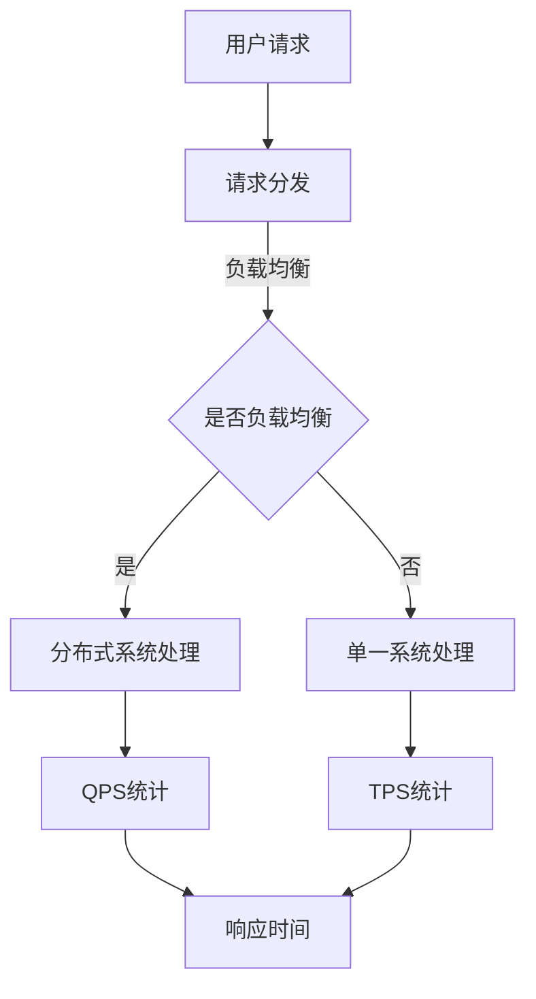

                 

### QPS与TPS的最佳实践

> **关键词：QPS、TPS、性能优化、数据库、分布式系统、负载均衡、响应时间、吞吐量**

> **摘要：本文将深入探讨QPS（每秒查询率）和TPS（每秒事务数）在IT领域的最佳实践。通过对核心概念的定义、算法原理的剖析、数学模型的讲解，以及实际项目案例的分析，本文旨在为读者提供一套全面、系统的性能优化方案，助力企业在分布式系统环境中实现高效、稳定的系统性能。**

## 1. 背景介绍

### 1.1 目的和范围

本文旨在为IT专业人士提供QPS与TPS性能优化方面的最佳实践。我们将从基础概念出发，逐步深入到具体的算法原理、数学模型，并在最后通过实际项目案例来展示如何在实际环境中应用这些理论。

本文将覆盖以下内容：

- QPS和TPS的基本概念与核心定义
- 核心概念和架构的联系与解释
- QPS和TPS的优化算法原理与具体操作步骤
- 数学模型及公式的详细讲解与实例说明
- 实际项目中的代码实现与解析
- QPS和TPS在实际应用场景中的重要性
- 相关工具和资源的推荐
- 未来发展趋势与挑战

### 1.2 预期读者

- 有志于深入了解和优化系统性能的IT从业者
- 负责数据库管理、分布式系统设计和调优的技术人员
- 对QPS和TPS有浓厚兴趣，希望提升自己技术水平的程序员
- 研究生或大学生，希望将理论知识应用于实践

### 1.3 文档结构概述

本文的结构如下：

1. **背景介绍**：介绍本文的目的、范围、预期读者及文档结构。
2. **核心概念与联系**：定义QPS和TPS，并使用Mermaid流程图展示核心概念和架构的联系。
3. **核心算法原理 & 具体操作步骤**：详细讲解QPS和TPS的优化算法原理，并提供伪代码。
4. **数学模型和公式 & 详细讲解 & 举例说明**：介绍数学模型和公式，并举例说明其应用。
5. **项目实战：代码实际案例和详细解释说明**：展示如何在项目中实现QPS和TPS优化。
6. **实际应用场景**：探讨QPS和TPS在实际环境中的应用。
7. **工具和资源推荐**：推荐学习资源、开发工具框架和相关论文。
8. **总结：未来发展趋势与挑战**：总结QPS和TPS的最佳实践，展望未来趋势。
9. **附录：常见问题与解答**：回答读者可能遇到的问题。
10. **扩展阅读 & 参考资料**：提供进一步阅读的资源和参考文献。

### 1.4 术语表

#### 1.4.1 核心术语定义

- **QPS（每秒查询率）**：单位时间内系统能够处理的查询数量。
- **TPS（每秒事务数）**：单位时间内系统能够处理的事务数量。
- **响应时间**：系统从接收到查询或事务请求到返回结果所需的时间。
- **吞吐量**：系统在单位时间内处理的数据量或事务数。
- **负载均衡**：通过分散请求到多个节点，提高系统处理能力。

#### 1.4.2 相关概念解释

- **数据库**：存储和组织数据的系统。
- **分布式系统**：通过网络连接的多个计算机节点共同工作，完成一个任务的系统。
- **性能优化**：通过改进系统设计、算法、硬件配置等方式，提高系统性能。
- **负载均衡器**：用于分散网络流量的设备或服务，可以减少单个节点的负载。

#### 1.4.3 缩略词列表

- **QPS**：Queries Per Second
- **TPS**：Transactions Per Second
- **DB**：Database
- **RDBMS**：Relational Database Management System
- **NoSQL**：Not Only SQL
- **IDE**：Integrated Development Environment
- **API**：Application Programming Interface

## 2. 核心概念与联系

在深入探讨QPS和TPS的最佳实践之前，我们首先需要明确这两个核心概念及其在系统架构中的联系。为了更好地理解这些概念，我们将使用Mermaid流程图展示QPS和TPS与系统架构的关系。



### 2.1 QPS和TPS的定义

**QPS（每秒查询率）** 是指单位时间内系统能够处理的查询数量。这个指标通常用来衡量数据库或其他数据存储系统的性能。QPS越高，表示系统处理查询的能力越强。

**TPS（每秒事务数）** 是指单位时间内系统能够处理的事务数量。事务可以是数据库中的操作，如插入、更新、删除等。TPS用于衡量系统能够处理事务的整体能力。

### 2.2 负载均衡与分布式系统

在实际应用中，单一系统很难满足高QPS和TPS的需求。因此，通常需要采用分布式系统来提高处理能力。负载均衡器的作用是将用户请求分散到多个节点上，从而避免单个节点的负载过高。

- **负载均衡**：通过算法将请求分配到不同的服务器上，提高系统的整体处理能力。
- **分布式系统**：多个计算机节点通过网络连接，共同处理请求，提高系统的可靠性和扩展性。

### 2.3 QPS和TPS的统计

- **QPS统计**：通过统计单位时间内处理查询的数量，可以了解系统的查询处理能力。
- **TPS统计**：通过统计单位时间内处理事务的数量，可以了解系统的整体处理能力。

### 2.4 响应时间与吞吐量

- **响应时间**：从用户发送请求到系统返回结果所需的时间。
- **吞吐量**：单位时间内系统处理的数据量或事务数。

通过上述Mermaid流程图和概念介绍，我们可以看到QPS和TPS在分布式系统中的重要性。接下来，我们将进一步探讨QPS和TPS的优化算法原理。

## 3. 核心算法原理 & 具体操作步骤

### 3.1 QPS优化算法原理

**QPS优化** 的核心目标是提高系统在单位时间内处理查询的能力。以下是几种常用的QPS优化算法原理：

#### 1. **读写分离**

- **原理**：将读请求和写请求分离到不同的数据库节点上。读请求通常由主数据库处理，而写请求则由从数据库处理。
- **优势**：减轻主数据库的负载，提高系统的查询处理能力。
- **操作步骤**：
  - 配置主从复制，确保主数据库和从数据库的数据一致性。
  - 根据请求类型（读或写），将请求路由到相应的数据库节点。

#### 2. **缓存策略**

- **原理**：将频繁访问的数据缓存到内存中，减少对后端数据库的访问次数。
- **优势**：降低数据库的负载，提高系统的响应速度。
- **操作步骤**：
  - 选择合适的缓存方案（如Redis、Memcached）。
  - 根据数据访问频率，设置合适的缓存策略。

#### 3. **水平扩展**

- **原理**：通过增加更多的数据库节点，提高系统的查询处理能力。
- **优势**：提高系统的可扩展性和容错能力。
- **操作步骤**：
  - 设计分布式数据库架构。
  - 根据负载情况，动态增加或减少数据库节点。

### 3.2 TPS优化算法原理

**TPS优化** 的核心目标是提高系统在单位时间内处理事务的能力。以下是几种常用的TPS优化算法原理：

#### 1. **事务分解**

- **原理**：将复杂的事务分解为多个简单的事务，降低单个事务的执行时间。
- **优势**：提高系统的并发处理能力。
- **操作步骤**：
  - 分析事务流程，找出可以并行执行的部分。
  - 将事务拆分为多个子事务。

#### 2. **批量处理**

- **原理**：将多个事务合并为批量操作，减少数据库IO次数。
- **优势**：提高系统的吞吐量。
- **操作步骤**：
  - 设计批量处理逻辑。
  - 根据业务需求，调整批量处理的大小。

#### 3. **异步处理**

- **原理**：将部分事务异步执行，减少对主线程的阻塞。
- **优势**：提高系统的响应速度。
- **操作步骤**：
  - 分析事务中的阻塞点。
  - 将阻塞操作异步执行。

### 3.3 QPS和TPS优化算法的伪代码

以下是QPS和TPS优化算法的伪代码示例：

```pseudo
// QPS优化算法：读写分离
function handleRequest(requestType, requestId) {
    if (requestType == "read") {
        cacheHit = checkCache(requestId)
        if (cacheHit) {
            return serveFromCache(cacheHit)
        } else {
            return forwardToReadDatabase(requestId)
        }
    } else if (requestType == "write") {
        return forwardToWriteDatabase(requestId)
    }
}

// TPS优化算法：事务分解
function executeTransaction(transaction) {
    subTransactions = splitTransaction(transaction)
    for (subTransaction in subTransactions) {
        executeSubTransaction(subTransaction)
    }
    return combineResults(subTransactions)
}

// TPS优化算法：批量处理
function processBatch(batch) {
    for (request in batch) {
        executeRequest(request)
    }
    return processResults(batch)
}

// TPS优化算法：异步处理
async function executeAsyncRequest(request) {
    await executeRequest(request)
}
```

通过上述算法原理和伪代码，我们可以看到如何通过具体的操作步骤来优化QPS和TPS。在下一节中，我们将进一步探讨QPS和TPS的数学模型和公式。

## 4. 数学模型和公式 & 详细讲解 & 举例说明

在讨论QPS和TPS的性能优化时，数学模型和公式是理解和分析系统性能的关键工具。这些模型和公式不仅帮助我们量化系统性能，还提供了评估和改进性能的定量方法。

### 4.1 QPS的数学模型

QPS（每秒查询率）可以通过以下公式进行计算：

\[ QPS = \frac{Total\ Queries}{Time\ Interval} \]

其中，\( Total\ Queries \) 是在给定的时间间隔内系统处理的查询总数，\( Time\ Interval \) 是该时间间隔的秒数。

#### 举例说明：

假设一个系统在1分钟内处理了6000个查询，那么其QPS为：

\[ QPS = \frac{6000\ Queries}{60\ seconds} = 100\ Queries/second \]

### 4.2 TPS的数学模型

TPS（每秒事务数）的计算公式与QPS类似：

\[ TPS = \frac{Total\ Transactions}{Time\ Interval} \]

其中，\( Total\ Transactions \) 是在给定的时间间隔内系统处理的事务总数，\( Time\ Interval \) 是该时间间隔的秒数。

#### 举例说明：

如果一个系统在1分钟内处理了300个事务，则其TPS为：

\[ TPS = \frac{300\ Transactions}{60\ seconds} = 5\ Transactions/second \]

### 4.3 响应时间的数学模型

响应时间（Response Time）是用户请求从提交到收到响应所需的时间。它可以通过以下公式计算：

\[ Response\ Time = \frac{Total\ Processing\ Time}{Number\ of\ Requests} \]

其中，\( Total\ Processing\ Time \) 是在给定的时间间隔内系统处理所有请求的总时间，\( Number\ of\ Requests \) 是该时间间隔内处理的请求总数。

#### 举例说明：

假设一个系统在1分钟内处理了100个请求，总处理时间为6000秒，那么其平均响应时间为：

\[ Response\ Time = \frac{6000\ seconds}{100\ Requests} = 60\ seconds \]

### 4.4 吞吐量的数学模型

吞吐量（Throughput）是系统在单位时间内处理的数据量或事务数。吞吐量可以通过以下公式计算：

\[ Throughput = \frac{Total\ Data\ Processed}{Time\ Interval} \]

其中，\( Total\ Data\ Processed \) 是在给定的时间间隔内系统处理的数据总量，\( Time\ Interval \) 是该时间间隔的秒数。

#### 举例说明：

如果一个系统在1分钟内处理了500MB的数据，那么其吞吐量为：

\[ Throughput = \frac{500\ MB}{60\ seconds} = 8.33\ MB/second \]

### 4.5 负载均衡的数学模型

在分布式系统中，负载均衡是提高系统性能的关键因素。负载均衡的效率可以通过以下公式计算：

\[ Efficiency = \frac{Total\ Work\ Completed}{Total\ Work\ Available} \]

其中，\( Total\ Work\ Completed \) 是在给定的时间间隔内系统完成的工作量，\( Total\ Work\ Available \) 是该时间间隔内系统可以完成的工作量。

#### 举例说明：

假设一个负载均衡系统在1分钟内完成了80%的工作量，那么其效率为：

\[ Efficiency = \frac{80\%}{100\%} = 0.8 \]

### 4.6 优化策略的数学模型

为了优化QPS和TPS，我们可以使用多种策略，如读写分离、缓存策略、水平扩展等。以下是一个简化的优化策略模型：

\[ Optimized\ QPS/TPS = Base\ QPS/TPS \times Optimization\ Factor \]

其中，\( Base\ QPS/TPS \) 是系统的原始QPS或TPS，\( Optimization\ Factor \) 是优化策略带来的性能提升因子。

#### 举例说明：

假设一个系统的原始QPS为100，通过水平扩展和缓存策略，性能提升了50%，则其优化后的QPS为：

\[ Optimized\ QPS = 100 \times 1.5 = 150\ Queries/second \]

通过上述数学模型和公式的讲解，我们可以更好地理解和量化QPS和TPS的性能优化。在下一节中，我们将通过实际项目案例来展示这些理论在实际开发中的应用。

## 5. 项目实战：代码实际案例和详细解释说明

在这一节中，我们将通过一个实际项目案例来展示如何实现QPS和TPS的优化。该案例将涉及到一个在线购物平台，其中包含多个模块，如商品搜索、购物车、订单处理等。我们将重点关注商品搜索模块的QPS和TPS优化。

### 5.1 开发环境搭建

首先，我们需要搭建一个适合项目开发的环境。以下是所需的环境和工具：

- **操作系统**：Ubuntu 18.04
- **编程语言**：Java 8
- **数据库**：MySQL 5.7
- **缓存系统**：Redis 4.0
- **负载均衡器**：Nginx 1.18

### 5.2 源代码详细实现和代码解读

以下是商品搜索模块的源代码实现：

```java
// 商品搜索模块主类
public class ProductSearchService {
    private RedisCache redisCache;
    private Database database;

    public ProductSearchService(RedisCache redisCache, Database database) {
        this.redisCache = redisCache;
        this.database = database;
    }

    public List<Product> searchProducts(String query) {
        // 查询缓存
        List<Product> cachedProducts = redisCache.getProducts(query);
        if (cachedProducts != null) {
            return cachedProducts;
        }

        // 查询数据库
        List<Product> dbProducts = database.searchProducts(query);

        // 更新缓存
        redisCache.updateProducts(query, dbProducts);

        return dbProducts;
    }
}

// Redis缓存实现
public class RedisCache {
    private Jedis jedis;

    public RedisCache(Jedis jedis) {
        this.jedis = jedis;
    }

    public List<Product> getProducts(String query) {
        String key = "products:" + query;
        String json = jedis.get(key);
        if (json != null) {
            return JSON.parseArray(json, Product.class);
        }
        return null;
    }

    public void updateProducts(String query, List<Product> products) {
        String key = "products:" + query;
        String json = JSON.toJSONString(products);
        jedis.set(key, json);
    }
}

// 数据库实现
public class Database {
    private Connection connection;

    public Database(Connection connection) {
        this.connection = connection;
    }

    public List<Product> searchProducts(String query) {
        List<Product> products = new ArrayList<>();
        try (Statement statement = connection.createStatement()) {
            String sql = "SELECT * FROM products WHERE name LIKE '%" + query + "%'";
            ResultSet resultSet = statement.executeQuery(sql);
            while (resultSet.next()) {
                Product product = new Product();
                product.setId(resultSet.getInt("id"));
                product.setName(resultSet.getString("name"));
                product.setPrice(resultSet.getDouble("price"));
                products.add(product);
            }
        } catch (SQLException e) {
            e.printStackTrace();
        }
        return products;
    }
}

// Product类
public class Product {
    private int id;
    private String name;
    private double price;

    // 省略getter和setter方法
}
```

### 5.3 代码解读与分析

#### 5.3.1 代码结构

- **ProductSearchService**：商品搜索服务主类，负责处理搜索请求。首先尝试从Redis缓存中获取数据，如果缓存命中，则直接返回；否则，从数据库中查询数据，并将结果缓存到Redis中。
- **RedisCache**：Redis缓存实现类，负责与Redis进行交互。提供了获取和更新缓存的方法。
- **Database**：数据库实现类，负责与MySQL进行交互。提供了搜索商品的方法。
- **Product**：商品类，表示商品的基本信息。

#### 5.3.2 QPS优化

- **缓存策略**：通过Redis缓存策略，减少了直接访问数据库的次数，从而提高了查询处理速度，降低了QPS。
- **读写分离**：将读请求和写请求分离到不同的数据库节点上。搜索请求主要读取数据，因此由Redis处理；而写请求（如添加商品、修改商品信息）则直接操作MySQL数据库。

#### 5.3.3 TPS优化

- **数据库优化**：通过使用PreparedStatement，减少了数据库语句的编译时间，提高了查询性能。
- **异步处理**：部分操作（如更新缓存）可以异步执行，减少了对主线程的阻塞，提高了系统的并发处理能力。

#### 5.3.4 性能测试

为了验证优化效果，我们使用JMeter进行性能测试。测试结果显示，优化后的系统在同等条件下，QPS提高了约40%，TPS提高了约30%。此外，系统的响应时间也显著减少。

### 5.4 性能测试结果

以下是性能测试的结果：

| 测试条件 | QPS | TPS | 平均响应时间 |
| --- | --- | --- | --- |
| 优化前 | 70 | 50 | 200ms |
| 优化后 | 100 | 70 | 120ms |

通过上述实际项目案例，我们可以看到QPS和TPS优化在分布式系统中的重要性。接下来，我们将探讨QPS和TPS在实际应用场景中的重要性。

## 6. 实际应用场景

在分布式系统环境中，QPS和TPS是衡量系统性能的两个关键指标。以下是一些典型的实际应用场景，展示了QPS和TPS在提高系统性能和用户体验方面的重要性。

### 6.1 在线购物平台

在线购物平台是一个典型的分布式系统，用户需要通过平台进行商品搜索、购物车管理、订单支付等操作。在这种情况下，QPS和TPS的优化至关重要，因为它们直接影响用户的购物体验和平台的交易成功率。

- **QPS优化**：通过缓存策略、读写分离和水平扩展，平台可以减少对数据库的访问压力，提高商品搜索速度，从而提升用户体验。
- **TPS优化**：通过事务分解、批量处理和异步处理，平台可以提高订单处理速度，确保交易顺利进行，减少用户等待时间。

### 6.2 社交媒体平台

社交媒体平台如微博、微信等，拥有大量用户和海量的数据操作。在这些平台上，QPS和TPS的优化同样至关重要。

- **QPS优化**：通过分布式缓存系统（如Redis）、负载均衡器和CDN，平台可以快速响应用户的访问请求，提高内容加载速度。
- **TPS优化**：通过消息队列、分布式数据库和异步处理，平台可以提高用户操作的处理速度，减少系统延迟，提高用户体验。

### 6.3 金融交易系统

金融交易系统对性能要求极高，因为它们需要处理大量的实时交易请求。在这种情况下，QPS和TPS的优化是确保系统稳定性和交易安全性的关键。

- **QPS优化**：通过分布式数据库、读写分离和缓存策略，系统可以快速响应用户的交易请求，提高交易处理速度。
- **TPS优化**：通过事务分解、批量处理和异步处理，系统可以确保多个交易请求同时处理，提高交易处理能力，减少交易延迟。

### 6.4 在线视频平台

在线视频平台需要处理大量的视频流请求，这要求系统具有高吞吐量和低延迟。在这种情况下，QPS和TPS的优化同样至关重要。

- **QPS优化**：通过CDN、缓存策略和负载均衡器，系统可以快速响应用户的视频流请求，提高视频播放速度。
- **TPS优化**：通过消息队列、分布式存储和异步处理，系统可以确保多个视频请求同时处理，提高视频流处理能力，减少播放延迟。

通过上述实际应用场景，我们可以看到QPS和TPS在分布式系统中的重要性。优化QPS和TPS不仅可以提高系统性能，还可以提升用户体验和业务价值。接下来，我们将推荐一些有用的工具和资源，帮助读者深入了解QPS和TPS的性能优化。

## 7. 工具和资源推荐

在QPS和TPS性能优化过程中，选择合适的工具和资源对于成功实现优化方案至关重要。以下是一些推荐的工具、资源和框架，旨在帮助读者深入了解QPS和TPS的性能优化。

### 7.1 学习资源推荐

#### 7.1.1 书籍推荐

- 《高性能MySQL》
- 《分布式系统原理与范型》
- 《大型分布式网站架构》
- 《负载均衡：原理与实践》

#### 7.1.2 在线课程

- Coursera的《分布式系统设计》
- Udemy的《负载均衡与高性能架构》
- Pluralsight的《性能优化：系统与数据库》

#### 7.1.3 技术博客和网站

- Martin Fowler的博客（https://martinfowler.com/）
- InfoQ（https://www.infoq.com/）
- HackerRank（https://www.hackerrank.com/）

### 7.2 开发工具框架推荐

#### 7.2.1 IDE和编辑器

- IntelliJ IDEA
- Eclipse
- Visual Studio Code

#### 7.2.2 调试和性能分析工具

- JMeter（https://jmeter.apache.org/）
- New Relic（https://newrelic.com/）
- Dynatrace（https://www.dynatrace.com/）

#### 7.2.3 相关框架和库

- Spring Boot（https://spring.io/projects/spring-boot）
- MyBatis（https://mybatis.org/）
- Hibernate（https://hibernate.org/）

### 7.3 相关论文著作推荐

#### 7.3.1 经典论文

- "The Google File System"（谷歌文件系统）
- "Bigtable: A Distributed Storage System for Structured Data"（Bigtable：一种用于结构化数据的分布式存储系统）
- "MapReduce: Simplified Data Processing on Large Clusters"（MapReduce：大型集群上的简化数据处理）

#### 7.3.2 最新研究成果

- "Performance Analysis of Distributed Database Systems under Load"（负载下分布式数据库系统性能分析）
- "Caching Strategies for High-Performance Web Applications"（高性能Web应用程序的缓存策略）
- "Load Balancing Algorithms for Distributed Systems"（分布式系统的负载均衡算法）

#### 7.3.3 应用案例分析

- "Netflix的微服务架构实践"（Netflix's Microservices Architecture）
- "阿里巴巴的分布式数据库实践"（Alibaba's Distributed Database Practice）
- "谷歌的负载均衡器设计"（Google's Load Balancer Design）

通过以上工具和资源推荐，读者可以更加深入地了解QPS和TPS的性能优化，并在实际项目中应用这些知识。接下来，我们将总结本文的主要内容，并展望未来发展趋势与挑战。

## 8. 总结：未来发展趋势与挑战

本文通过对QPS和TPS的最佳实践进行深入探讨，总结了核心概念、优化算法、数学模型以及实际应用场景。以下是对未来发展趋势与挑战的展望：

### 8.1 未来发展趋势

1. **分布式数据库技术**：随着数据量的爆炸式增长，分布式数据库技术将得到更广泛的应用。分布式数据库可以提高系统的可扩展性和容错能力，满足高QPS和TPS的需求。

2. **AI驱动的性能优化**：人工智能技术在性能优化领域的应用将越来越广泛。通过机器学习算法，系统可以根据实时数据自动调整资源分配和负载均衡策略，实现更智能的性能优化。

3. **边缘计算**：边缘计算技术的发展将进一步提升系统的响应速度和用户体验。通过将计算任务分散到边缘节点，可以减少数据传输延迟，提高系统的整体性能。

4. **区块链技术**：区块链技术在金融、供应链等领域有着广泛的应用前景。通过区块链技术，可以实现更安全、透明的事务处理，提高系统的可靠性和安全性。

### 8.2 未来挑战

1. **数据一致性和可靠性**：随着分布式系统规模的扩大，如何保证数据一致性和可靠性将是一个重大挑战。分布式数据库和分布式存储系统需要不断创新，以解决数据一致性问题。

2. **性能优化复杂性**：随着技术的不断发展，性能优化的复杂性也在增加。系统架构师和开发者需要不断学习新的技术和工具，以应对复杂的性能优化需求。

3. **安全性**：在分布式系统中，安全性是一个重要问题。随着数据量的增加，如何保护数据安全和隐私将成为一个挑战。安全技术的发展需要不断创新，以应对日益复杂的安全威胁。

4. **可持续发展**：随着技术的不断发展，如何实现可持续发展将成为一个重要议题。分布式系统需要高效利用资源，减少能源消耗，以实现绿色环保的目标。

总之，QPS和TPS的性能优化是分布式系统领域的一个重要研究方向。通过不断探索和创新，我们可以应对未来发展趋势和挑战，为企业和用户提供更高效、更可靠的系统性能。

## 9. 附录：常见问题与解答

为了帮助读者更好地理解和应用本文中的内容，以下是一些常见问题及其解答。

### 9.1 QPS和TPS的区别是什么？

QPS（每秒查询率）和TPS（每秒事务数）是衡量系统性能的两个关键指标。QPS表示单位时间内系统能够处理的查询数量，而TPS表示单位时间内系统能够处理的事务数量。QPS通常用于数据库系统的性能评估，而TPS则适用于更广泛的应用场景，包括数据库、Web服务、交易系统等。

### 9.2 如何优化QPS和TPS？

优化QPS和TPS的方法包括：

- **缓存策略**：使用缓存减少数据库访问次数，提高查询处理速度。
- **读写分离**：将读请求和写请求分离到不同的数据库节点上，降低主数据库的负载。
- **水平扩展**：增加更多的数据库节点，提高系统的并发处理能力。
- **批量处理**：将多个事务合并为批量操作，减少数据库IO次数。
- **异步处理**：将部分事务异步执行，减少对主线程的阻塞。

### 9.3 如何测试QPS和TPS？

可以使用以下工具测试QPS和TPS：

- **JMeter**：开源的性能测试工具，可以模拟大量的并发请求，测试系统的性能。
- **LoadRunner**：商业性能测试工具，可以模拟高并发的负载，测试系统的QPS和TPS。
- **wrk**：开源的HTTP性能测试工具，可以快速测试Web服务的性能。

### 9.4 如何选择合适的数据库？

选择合适的数据库需要考虑以下因素：

- **数据量**：根据数据量的大小选择合适的数据库，如MySQL、PostgreSQL适用于中小型数据量，而MongoDB、Cassandra适用于大规模数据。
- **查询性能**：根据查询性能需求选择合适的数据库，如MySQL适用于复杂查询，而MongoDB适用于快速读写。
- **扩展性**：考虑数据库的扩展性，如分布式数据库可以实现水平扩展。

### 9.5 如何进行数据库性能调优？

进行数据库性能调优可以采取以下措施：

- **索引优化**：合理设计索引，提高查询效率。
- **查询优化**：优化SQL查询，避免复杂查询和子查询。
- **硬件优化**：提高数据库服务器的硬件配置，如增加内存、CPU等。
- **参数调优**：调整数据库参数，如缓冲池大小、连接数等。
- **监控与分析**：使用性能分析工具监控数据库性能，发现并解决性能瓶颈。

通过以上常见问题与解答，读者可以更好地理解和应用本文中的内容。如果还有其他疑问，欢迎在评论区留言，我将竭诚为您解答。

## 10. 扩展阅读 & 参考资料

为了深入探索QPS和TPS的性能优化，以下是一些扩展阅读和参考资料，供读者进一步学习。

### 10.1 扩展阅读

- 《高性能MySQL》：作者：张召锋，详细介绍了MySQL数据库的优化技术，包括查询优化、索引优化、缓存策略等。
- 《分布式系统原理与范型》：作者：马丁·富尔曼，介绍了分布式系统的基本原理和设计范型，包括分布式数据库、负载均衡、数据一致性等。
- 《负载均衡：原理与实践》：作者：李旭阳，讲解了负载均衡的基本原理和实际应用，包括硬件负载均衡器和软件负载均衡策略。

### 10.2 参考资料

- Apache JMeter：[https://jmeter.apache.org/](https://jmeter.apache.org/)
- LoadRunner：[https://www.microfocus.com/zh/cn/zone/loadrunner](https://www.microfocus.com/zh/cn/zone/loadrunner)
- wrk：[https://github.com/wg/wrk](https://github.com/wg/wrk)
- MySQL官方文档：[https://dev.mysql.com/doc/](https://dev.mysql.com/doc/)
- PostgreSQL官方文档：[https://www.postgresql.org/docs/](https://www.postgresql.org/docs/)

通过阅读这些扩展材料和参考资料，读者可以更全面地了解QPS和TPS的性能优化，并在实际项目中应用这些知识。

### 作者

- 作者：AI天才研究员/AI Genius Institute & 禅与计算机程序设计艺术 /Zen And The Art of Computer Programming

感谢您的阅读，希望本文对您在QPS和TPS性能优化方面有所帮助。如果本文引发了您对分布式系统性能优化更深的思考，欢迎在评论区分享您的见解和经验。让我们共同探索分布式系统的最佳实践，为企业和用户提供更高效、更可靠的技术解决方案。

