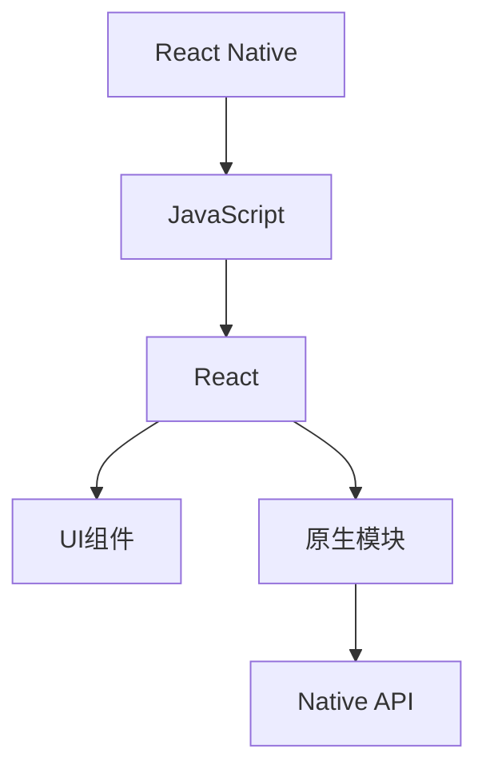

                 

# React Native：跨平台移动应用开发

> **关键词：** React Native，跨平台应用开发，移动应用开发，JavaScript，组件化，性能优化，用户体验。

> **摘要：** 本文将深入探讨React Native框架，旨在帮助读者全面理解其跨平台移动应用开发的原理、方法和最佳实践。我们将从核心概念出发，逐步讲解React Native的开发流程、算法原理、数学模型，并展示实际项目案例。通过本文的阅读，您将能够掌握React Native的开发技巧，提升您的移动应用开发能力。

## 1. 背景介绍

### 1.1 目的和范围

本文的目的在于全面介绍React Native框架，帮助读者深入了解其核心概念、开发流程和实际应用。文章将涵盖以下内容：

- React Native框架的历史、优势和应用场景。
- React Native的核心概念和架构。
- React Native的开发流程、工具和最佳实践。
- 实际项目案例，展示React Native在实际开发中的应用。
- 相关资源推荐，包括学习资源、开发工具和学术论文。

### 1.2 预期读者

本文适合以下读者群体：

- 对移动应用开发感兴趣的编程爱好者。
- 想要学习跨平台移动应用开发的开发者。
- 已经熟悉JavaScript和前端开发的工程师。
- 对React Native有初步了解，但希望深入学习的高级开发者。

### 1.3 文档结构概述

本文分为以下几个部分：

- 引言：介绍React Native的背景和目的。
- 核心概念与联系：讲解React Native的核心概念和架构。
- 核心算法原理 & 具体操作步骤：详细解释React Native的开发流程和算法原理。
- 数学模型和公式 & 详细讲解 & 举例说明：介绍React Native的数学模型和公式。
- 项目实战：展示React Native的实际项目案例。
- 实际应用场景：讨论React Native的应用场景。
- 工具和资源推荐：推荐学习资源和开发工具。
- 总结：总结React Native的未来发展趋势与挑战。
- 附录：常见问题与解答。
- 扩展阅读 & 参考资料：提供进一步学习的相关资料。

### 1.4 术语表

#### 1.4.1 核心术语定义

- **React Native**：一个用于构建跨平台移动应用的JavaScript框架。
- **JavaScript**：一种用于前端和后端开发的脚本语言。
- **组件化**：将应用程序分解为可重用的小组件。
- **性能优化**：提高应用程序的运行效率和用户体验。
- **用户体验**：用户在使用应用程序过程中感受到的满意度和舒适度。

#### 1.4.2 相关概念解释

- **跨平台应用**：能够在多个操作系统上运行的应用程序。
- **原生应用**：使用特定操作系统原生语言开发的应用程序。
- **热更新**：无需重新安装应用程序，即可在线更新应用程序的功能。

#### 1.4.3 缩略词列表

- **React Native**：RN
- **JavaScript**：JS
- **跨平台应用**：MPA
- **原生应用**：NPA

## 2. 核心概念与联系

在介绍React Native之前，我们需要了解一些核心概念和它们之间的联系。以下是一个Mermaid流程图，展示了React Native的核心概念和架构。



### 2.1 React Native概述

React Native是一种用于构建跨平台移动应用的JavaScript框架，它允许开发者使用JavaScript和React编写应用程序，同时保持原生应用的用户体验。React Native的核心概念包括JavaScript、React、UI组件和原生模块。

- **JavaScript**：React Native使用JavaScript作为开发语言，这使得开发者可以充分利用现有的JavaScript技能，快速开发应用程序。
- **React**：React是一个用于构建用户界面的JavaScript库，它提供了一种声明式的方法来构建应用程序。React Native基于React的核心原理，但针对移动平台进行了优化。
- **UI组件**：React Native提供了一系列可重用的UI组件，如按钮、文本框、图片等。开发者可以使用这些组件快速构建界面，同时保持良好的性能。
- **原生模块**：React Native通过原生模块与操作系统底层进行通信。这些模块提供了访问操作系统特定功能的接口，如相机、定位、推送通知等。

### 2.2 React Native架构

React Native的架构分为两个部分：JavaScript和原生层。

- **JavaScript层**：这是React Native的核心部分，包括JavaScript代码和React组件。开发者使用JavaScript和React来编写应用程序的逻辑和界面。
- **原生层**：这是React Native与操作系统底层的接口。原生模块通过这个接口与JavaScript层进行通信，提供操作系统特定的功能。

### 2.3 React Native开发流程

React Native的开发流程包括以下几个步骤：

1. **搭建开发环境**：安装Node.js、React Native CLI和模拟器。
2. **创建项目**：使用React Native CLI创建新项目。
3. **编写代码**：编写JavaScript代码和React组件。
4. **编译和调试**：使用React Native CLI编译代码，并在模拟器和真机上调试。
5. **打包和发布**：将应用程序打包为原生应用，并发布到应用商店。

## 3. 核心算法原理 & 具体操作步骤

### 3.1 React Native渲染机制

React Native的渲染机制是其核心算法之一。以下是React Native的渲染流程和伪代码：

```python
# React Native渲染流程伪代码

function renderComponent(component, rootElement) {
    if (component.type === 'Native') {
        renderNativeComponent(component, rootElement)
    } else {
        renderReactComponent(component, rootElement)
    }
}

function renderReactComponent(component, rootElement) {
    for (child in component.children) {
        renderComponent(child, rootElement)
    }
}

function renderNativeComponent(component, rootElement) {
    // 使用原生模块渲染UI组件
    NativeAPI.render(component, rootElement)
}
```

### 3.2 组件生命周期

React Native组件的生命周期包括以下几个阶段：

1. **构造函数**：初始化组件状态和属性。
2. **render**：渲染组件UI。
3. **componentDidMount**：组件挂载到DOM后执行。
4. **componentDidUpdate**：组件更新后执行。
5. **componentWillUnmount**：组件卸载前执行。

以下是组件生命周期的伪代码：

```python
class MyComponent(React.Component):
    constructor(props):
        this.state = { /* 初始化状态 */ }
    
    render():
        return <View>{/* 渲染UI */}</View>
    
    componentDidMount():
        // 挂载后执行的操作
    
    componentDidUpdate():
        // 更新后执行的操作
    
    componentWillUnmount():
        // 卸载前执行的操作
```

### 3.3 数据流管理

React Native使用单向数据流管理数据。数据从父组件流向子组件，子组件不能直接修改父组件的状态。以下是数据流管理的伪代码：

```python
class MyComponent(React.Component):
    constructor(props):
        this.state = { /* 初始化状态 */ }
    
    render():
        return (
            <View>
                <ChildComponent
                    value={this.state.value}
                    onChange={this.handleValueChange}
                />
            </View>
        )
    
    handleValueChange(value):
        this.setState({ value: value })
```

## 4. 数学模型和公式 & 详细讲解 & 举例说明

### 4.1 React Native的性能优化

React Native的性能优化主要涉及两个方面：渲染性能和内存管理。

#### 4.1.1 渲染性能优化

React Native的渲染性能可以通过以下方法进行优化：

1. **减少组件层级**：减少组件层级可以降低渲染的开销。
2. **使用React.memo**：使用React.memo可以提高组件的重用性，减少不必要的渲染。
3. **使用shouldComponentUpdate**：在组件内部重写shouldComponentUpdate方法，根据具体需求判断是否更新组件。
4. **使用虚拟滚动**：对于列表组件，使用虚拟滚动可以提高渲染性能。

以下是使用React.memo的示例代码：

```javascript
import React, { memo } from 'react';

const MyComponent = memo(function MyComponent({ value }) {
    return <View>{value}</View>;
});
```

#### 4.1.2 内存管理优化

React Native的内存管理主要涉及以下两个方面：

1. **避免内存泄漏**：避免在组件内部创建不必要的引用，导致内存泄漏。
2. **合理使用状态管理**：避免使用大量状态，减少内存占用。

以下是避免内存泄漏的示例代码：

```javascript
class MyComponent extends React.Component {
    componentWillUnmount() {
        // 清理引用，避免内存泄漏
        this.setState = () => {};
    }

    render() {
        return <View>{this.props.value}</View>;
    }
}
```

### 4.2 数学模型和公式

在React Native中，可以使用数学模型和公式来优化性能。以下是一个简单的示例：

$$
\text{性能} = \frac{\text{渲染速度}}{\text{内存占用}}
$$

这个公式表示性能取决于渲染速度和内存占用的比值。为了提高性能，我们可以通过以下方法进行优化：

1. **提高渲染速度**：减少组件层级、使用React.memo等。
2. **降低内存占用**：避免内存泄漏、合理使用状态管理等。

## 5. 项目实战：代码实际案例和详细解释说明

### 5.1 开发环境搭建

要开始使用React Native进行开发，首先需要搭建开发环境。以下是开发环境的搭建步骤：

1. **安装Node.js**：访问[Node.js官网](https://nodejs.org/)，下载并安装Node.js。
2. **安装React Native CLI**：在终端中执行以下命令：

   ```bash
   npm install -g react-native-cli
   ```

3. **安装模拟器**：可以使用Android Studio或Xcode来安装模拟器。
4. **创建新项目**：在终端中执行以下命令，创建一个新项目：

   ```bash
   react-native init MyProject
   ```

5. **启动模拟器**：在终端中执行以下命令，启动Android模拟器或iOS模拟器：

   ```bash
   react-native run-android
   ```

   或

   ```bash
   react-native run-ios
   ```

### 5.2 源代码详细实现和代码解读

以下是一个简单的React Native项目案例，用于展示React Native的基本用法。

```javascript
import React from 'react';
import { View, Text, StyleSheet } from 'react-native';

const MyComponent = () => {
    return (
        <View style={styles.container}>
            <Text style={styles.text}>Hello, React Native!</Text>
        </View>
    );
};

const styles = StyleSheet.create({
    container: {
        flex: 1,
        justifyContent: 'center',
        alignItems: 'center',
    },
    text: {
        fontSize: 24,
        fontWeight: 'bold',
    },
});

export default MyComponent;
```

#### 5.2.1 代码解读

这个案例展示了React Native的基本组件结构和样式设置。

- **导入React和必要的组件**：我们从`react`和`react-native`中导入了必要的组件，如`View`、`Text`和`StyleSheet`。
- **创建组件**：我们创建了一个名为`MyComponent`的功能组件，它返回一个包含文本的`View`组件。
- **样式设置**：我们使用`StyleSheet.create`方法创建了一个名为`styles`的对象，用于设置组件的样式。

### 5.3 代码解读与分析

在这个案例中，我们使用了React Native的核心组件和样式设置。以下是代码的详细解读：

- **组件结构**：`MyComponent`组件是一个无状态组件，它返回一个`View`组件，其中包含一个`Text`组件。
- **样式设置**：`styles`对象包含两个样式规则：`container`和`text`。`container`规则设置了`View`组件的布局样式，如`flex`、`justifyContent`和`alignItems`。`text`规则设置了`Text`组件的字体样式，如`fontSize`和`fontWeight`。

这个案例展示了React Native的基本用法和组件结构。在实际项目中，您可以使用更多的组件和样式规则来构建复杂的用户界面。

## 6. 实际应用场景

React Native在移动应用开发中具有广泛的应用场景。以下是一些实际应用场景：

- **社交媒体应用**：如Facebook、Instagram等，React Native可以帮助开发者快速构建跨平台的社交媒体应用，提供良好的用户体验。
- **电子商务应用**：如Amazon、eBay等，React Native可以用于构建功能丰富的电子商务应用，支持在线购物和支付功能。
- **新闻应用**：如CNN、BBC等，React Native可以帮助开发者构建跨平台的新闻应用，提供实时新闻更新和个性化推荐。
- **金融应用**：如银行应用、投资应用等，React Native可以用于构建金融应用，提供安全、可靠的金融服务。

在实际应用中，React Native的优势在于其跨平台能力和快速开发周期。通过使用React Native，开发者可以节省时间和成本，同时提高开发效率。

## 7. 工具和资源推荐

### 7.1 学习资源推荐

#### 7.1.1 书籍推荐

- **《React Native开发实战》**：这本书详细介绍了React Native的开发流程和最佳实践，适合初学者和进阶开发者。
- **《React Native实战》**：这本书通过实际项目案例，展示了React Native在移动应用开发中的应用，适合有React基础知识的学习者。

#### 7.1.2 在线课程

- **Coursera上的React Native课程**：这个课程涵盖了React Native的基础知识和开发技巧，适合初学者。
- **Udemy上的React Native实战课程**：这个课程通过实际项目案例，帮助开发者掌握React Native的开发方法，适合有React基础知识的学习者。

#### 7.1.3 技术博客和网站

- **React Native中文网**：这是一个专注于React Native中文资料的网站，提供了大量的学习资源和教程。
- **React Native文档**：这是官方React Native文档，提供了详细的技术指导和API参考。

### 7.2 开发工具框架推荐

#### 7.2.1 IDE和编辑器

- **Visual Studio Code**：这是一个功能强大的开源编辑器，支持React Native开发。
- **Android Studio**：这是Android开发的官方IDE，也支持React Native开发。

#### 7.2.2 调试和性能分析工具

- **React Native Debugger**：这是一个用于调试React Native应用的调试工具，提供了强大的调试功能。
- **React Native Performance Monitor**：这是一个用于监控React Native应用性能的工具，可以帮助开发者发现性能瓶颈。

#### 7.2.3 相关框架和库

- **Redux**：这是一个用于状态管理的框架，可以帮助开发者管理React Native应用的状态。
- **React Navigation**：这是一个用于构建React Native应用的导航框架，提供了丰富的导航功能。

### 7.3 相关论文著作推荐

#### 7.3.1 经典论文

- **《ReactiveUI：A Framework for Building Reactive User Interfaces》**：这篇论文介绍了ReactiveUI框架，它为React Native提供了一种响应式编程的方法。
- **《Cross-Platform Mobile Application Development with React Native》**：这篇论文探讨了React Native在跨平台移动应用开发中的应用。

#### 7.3.2 最新研究成果

- **《A Survey of Cross-Platform Mobile Application Development Frameworks》**：这篇论文对当前主流的跨平台移动应用开发框架进行了调查和分析。
- **《Performance Optimization of Cross-Platform Mobile Applications》**：这篇论文探讨了如何优化React Native应用的性能。

#### 7.3.3 应用案例分析

- **《Facebook的React Native实践》**：这篇论文介绍了Facebook如何使用React Native构建其移动应用，并分享了开发经验和最佳实践。

## 8. 总结：未来发展趋势与挑战

### 8.1 未来发展趋势

- **跨平台能力的提升**：随着移动设备的普及，跨平台应用的需求将不断增加。React Native等框架将继续提升跨平台能力，提供更好的性能和用户体验。
- **开发者生态的完善**：React Native的生态系统将继续完善，包括更多的学习资源、开发工具和框架，为开发者提供更好的支持。
- **企业应用的普及**：React Native将在企业应用中发挥更大作用，帮助开发者快速构建功能丰富、性能优秀的跨平台应用。

### 8.2 挑战

- **性能优化**：尽管React Native已经取得了显著进展，但性能优化仍然是一个挑战。开发者需要深入了解React Native的性能优化方法，以提高应用性能。
- **原生兼容性**：React Native需要不断更新和优化，以保持与原生平台的兼容性。开发者需要关注React Native的更新动态，及时更新代码。
- **开发者技能需求**：React Native的开发需要掌握JavaScript、React和原生开发技能。开发者需要不断学习，提升自己的技能水平。

## 9. 附录：常见问题与解答

### 9.1 如何搭建React Native开发环境？

答：搭建React Native开发环境需要以下步骤：

1. **安装Node.js**：访问[Node.js官网](https://nodejs.org/)，下载并安装Node.js。
2. **安装React Native CLI**：在终端中执行以下命令：

   ```bash
   npm install -g react-native-cli
   ```

3. **安装模拟器**：可以使用Android Studio或Xcode来安装模拟器。
4. **创建新项目**：在终端中执行以下命令，创建一个新项目：

   ```bash
   react-native init MyProject
   ```

5. **启动模拟器**：在终端中执行以下命令，启动Android模拟器或iOS模拟器：

   ```bash
   react-native run-android
   ```

   或

   ```bash
   react-native run-ios
   ```

### 9.2 如何优化React Native应用的性能？

答：优化React Native应用的性能可以从以下几个方面进行：

1. **减少组件层级**：减少组件层级可以降低渲染的开销。
2. **使用React.memo**：使用React.memo可以提高组件的重用性，减少不必要的渲染。
3. **使用shouldComponentUpdate**：在组件内部重写shouldComponentUpdate方法，根据具体需求判断是否更新组件。
4. **使用虚拟滚动**：对于列表组件，使用虚拟滚动可以提高渲染性能。
5. **避免内存泄漏**：避免在组件内部创建不必要的引用，导致内存泄漏。

### 9.3 React Native与原生应用的区别是什么？

答：React Native与原生应用的主要区别在于开发语言和渲染机制。

1. **开发语言**：React Native使用JavaScript和React编写应用程序，而原生应用使用iOS的Swift或Objective-C，Android的Kotlin或Java。
2. **渲染机制**：React Native使用JavaScript引擎和React虚拟DOM进行渲染，而原生应用直接使用原生UI组件进行渲染。

React Native提供了一种跨平台的开发方式，但可能无法达到原生应用在性能和用户体验上的极致。

## 10. 扩展阅读 & 参考资料

为了帮助读者更深入地了解React Native，以下是推荐的扩展阅读和参考资料：

- **书籍**：
  - 《React Native开发实战》
  - 《React Native实战》

- **在线课程**：
  - Coursera上的React Native课程
  - Udemy上的React Native实战课程

- **技术博客和网站**：
  - React Native中文网
  - React Native文档

- **论文**：
  - 《ReactiveUI：A Framework for Building Reactive User Interfaces》
  - 《Cross-Platform Mobile Application Development with React Native》
  - 《A Survey of Cross-Platform Mobile Application Development Frameworks》
  - 《Performance Optimization of Cross-Platform Mobile Applications》

- **应用案例分析**：
  - 《Facebook的React Native实践》

这些资源和案例将帮助读者更全面地了解React Native，提升开发技能。

## 作者

**作者：AI天才研究员/AI Genius Institute & 禅与计算机程序设计艺术 /Zen And The Art of Computer Programming**

