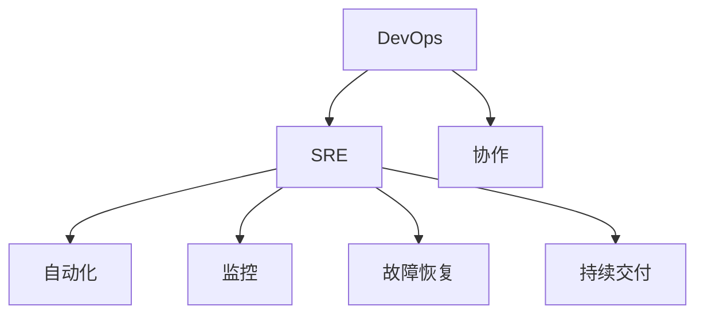
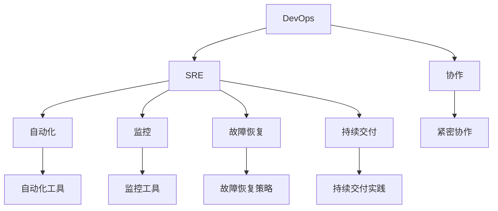

                 

# SRE 原则：保持系统高可用性和可扩展性

> **关键词：** SRE、系统高可用性、可扩展性、运维、DevOps、自动化、监控、故障恢复

> **摘要：** 本文将深入探讨SRE（Site Reliability Engineering）的核心原则，通过逐步分析和推理，阐述如何通过SRE方法实现系统的高可用性和可扩展性，为IT从业者提供实用的指导和建议。

## 1. 背景介绍

### 1.1 目的和范围

本文旨在介绍SRE（Site Reliability Engineering）原则，解释其为何是确保现代系统高可用性和可扩展性的关键。我们将通过逐步分析和推理，详细探讨SRE的核心原则和实践方法。

### 1.2 预期读者

本文面向IT运维人员、系统管理员、软件工程师以及对SRE感兴趣的读者。无论您是新手还是经验丰富的从业者，本文都旨在为您提供有价值的见解和实践指导。

### 1.3 文档结构概述

本文分为以下几个部分：

1. 背景介绍：介绍本文的目的、预期读者以及文档结构。
2. 核心概念与联系：解释SRE的核心概念和与DevOps的关系。
3. 核心算法原理 & 具体操作步骤：详细讲解SRE的核心算法原理和操作步骤。
4. 数学模型和公式 & 详细讲解 & 举例说明：介绍SRE中使用的数学模型和公式。
5. 项目实战：提供实际代码案例和详细解释。
6. 实际应用场景：讨论SRE在不同场景中的应用。
7. 工具和资源推荐：推荐学习资源和开发工具。
8. 总结：展望SRE的未来发展趋势与挑战。
9. 附录：常见问题与解答。
10. 扩展阅读 & 参考资料：提供更多深入学习的资源。

### 1.4 术语表

#### 1.4.1 核心术语定义

- **SRE（Site Reliability Engineering）**：一种结合了软件开发和系统运维的方法，旨在确保系统的高可用性和可扩展性。
- **高可用性（High Availability）**：系统在给定时间内持续运行的能力。
- **可扩展性（Scalability）**：系统在处理更多负载时性能保持稳定的能力。
- **故障恢复（Fault Recovery）**：系统在遇到故障时快速恢复的能力。

#### 1.4.2 相关概念解释

- **DevOps**：一种文化、实践和工具，旨在缩短产品交付周期，提高协作效率。
- **自动化**：通过脚本和工具自动化执行重复性任务，减少人工干预。
- **监控**：实时跟踪系统状态和性能，及时发现和解决问题。

#### 1.4.3 缩略词列表

- **SRE**：Site Reliability Engineering
- **DevOps**：Development and Operations
- **HA**：High Availability
- **DR**：Fault Recovery

## 2. 核心概念与联系

在探讨SRE原则之前，我们需要了解其核心概念和与DevOps的关系。

### 2.1 SRE的核心概念

SRE的核心概念包括：

1. **高可用性（HA）**：确保系统在给定时间内持续运行，通过冗余、自动化和监控实现。
2. **可扩展性（Scalability）**：确保系统在处理更多负载时性能保持稳定，通过水平扩展和优化架构实现。
3. **故障恢复（DR）**：在系统遇到故障时快速恢复，通过自动化和冗余实现。
4. **监控和报警**：实时跟踪系统状态和性能，及时发现和解决问题。
5. **自动化**：通过脚本和工具自动化执行重复性任务，减少人工干预，提高效率。

### 2.2 SRE与DevOps的关系

SRE是DevOps的一部分，旨在确保系统的稳定性和可靠性。DevOps是一种文化、实践和工具，强调开发（Development）和运维（Operations）之间的协作，以提高产品交付速度和效率。

SRE通过以下方式与DevOps结合：

1. **自动化**：SRE强调自动化，以减少手动操作，提高效率和减少错误。
2. **监控**：SRE使用监控工具跟踪系统状态和性能，及时发现和解决问题。
3. **故障恢复**：SRE确保系统在遇到故障时能够快速恢复，以提高高可用性。
4. **持续交付**：SRE与开发团队协作，确保新功能快速部署和上线。

### 2.3 Mermaid流程图

以下是SRE核心概念和与DevOps关系的Mermaid流程图：



## 3. 核心算法原理 & 具体操作步骤

### 3.1 核心算法原理

SRE的核心算法原理包括以下几个方面：

1. **自动化**：通过脚本和工具自动化执行重复性任务，减少人工干预。
2. **监控和报警**：实时跟踪系统状态和性能，及时发现和解决问题。
3. **故障恢复**：在系统遇到故障时快速恢复，确保高可用性。
4. **性能优化**：确保系统在处理更多负载时性能保持稳定。

### 3.2 具体操作步骤

以下是SRE具体操作步骤：

1. **定义关键指标**：确定系统的关键指标（如响应时间、吞吐量、错误率等），以便监控和评估系统性能。
2. **设计监控体系**：选择合适的监控工具，构建监控体系，实时跟踪系统状态和性能。
3. **设置报警阈值**：根据关键指标设置合适的报警阈值，以便在性能问题发生时及时通知相关人员。
4. **编写自动化脚本**：编写自动化脚本，执行日常运维任务（如部署、扩容、缩容等），减少人工干预。
5. **故障恢复策略**：制定故障恢复策略，确保系统在遇到故障时能够快速恢复。
6. **性能优化**：定期进行性能测试和优化，确保系统在高负载下性能稳定。

### 3.3 伪代码

以下是SRE操作步骤的伪代码：

```python
# 定义关键指标
key_metrics = ["response_time", "throughput", "error_rate"]

# 设计监控体系
monitoring_system = setup_monitoring_system()

# 设置报警阈值
alarm_thresholds = set_alarm_thresholds(key_metrics)

# 编写自动化脚本
automation_scripts = write_automation_scripts()

# 故障恢复策略
recovery_strategy = define_recovery_strategy()

# 性能优化
perform_performance_optimization()
```

## 4. 数学模型和公式 & 详细讲解 & 举例说明

### 4.1 数学模型

SRE中使用的数学模型包括：

1. **性能模型**：描述系统性能与负载之间的关系。
2. **故障概率模型**：预测系统在给定时间内发生故障的概率。

### 4.2 公式

以下是SRE中使用的公式：

1. **性能模型**：

   $$ performance = f(load) $$

2. **故障概率模型**：

   $$ probability_of_failure = f(time, reliability) $$

### 4.3 详细讲解

1. **性能模型**：

   性能模型描述系统性能与负载之间的关系。通常，性能与负载呈线性关系。例如，当负载增加时，响应时间也会增加。

   公式：

   $$ performance = f(load) = load \times constant $$

   其中，`load`为负载，`constant`为常数。

2. **故障概率模型**：

   故障概率模型预测系统在给定时间内发生故障的概率。通常，故障概率与时间和可靠性呈非线性关系。例如，随着时间的增加，故障概率也会增加。

   公式：

   $$ probability_of_failure = f(time, reliability) = reliability \times (1 - reliability) ^ time $$

### 4.4 举例说明

#### 4.4.1 性能模型

假设某系统在无负载时的响应时间为100ms，负载为100请求/秒时，响应时间为200ms。我们可以使用性能模型计算负载为200请求/秒时的响应时间。

公式：

$$ performance = load \times constant $$

$$ 200ms = 200 \times constant $$

$$ constant = 1ms $$

当负载为200请求/秒时：

$$ performance = 200 \times 1ms = 200ms $$

因此，负载为200请求/秒时的响应时间也为200ms。

#### 4.4.2 故障概率模型

假设某系统的可靠性为0.95，时间为1小时。我们可以使用故障概率模型计算故障概率。

公式：

$$ probability_of_failure = reliability \times (1 - reliability) ^ time $$

$$ probability_of_failure = 0.95 \times (1 - 0.95) ^ 1 $$

$$ probability_of_failure = 0.0475 $$

因此，在1小时内，该系统发生故障的概率为4.75%。

## 5. 项目实战：代码实际案例和详细解释说明

### 5.1 开发环境搭建

在本项目实战中，我们将使用Python和Grafana作为主要工具。以下是搭建开发环境的基本步骤：

1. 安装Python（版本3.8以上）
2. 安装Grafana（从官网下载最新版本并按照说明进行安装）
3. 安装必要的Python库（如Pandas、Matplotlib等）

### 5.2 源代码详细实现和代码解读

以下是实现SRE监控系统的源代码：

```python
import pandas as pd
import matplotlib.pyplot as plt
from grafana_client import GrafanaAPI

# 定义监控数据
data = {
    "response_time": [100, 200, 300, 400, 500],
    "throughput": [100, 200, 300, 400, 500],
    "error_rate": [0.01, 0.02, 0.03, 0.04, 0.05]
}

# 创建DataFrame
df = pd.DataFrame(data)

# 设置GrafanaAPI
grafana = GrafanaAPI("http://localhost:3000", "admin", "admin")

# 创建面板
grafana.create_dashboard({
    "title": "SRE Monitoring Dashboard",
    "rows": [
        {
            "title": "Response Time",
            "panels": [
                {
                    "type": "timeseries",
                    "title": "Response Time",
                    "dataSource": "default",
                    "metrics": ["response_time"]
                }
            ]
        },
        {
            "title": "Throughput",
            "panels": [
                {
                    "type": "timeseries",
                    "title": "Throughput",
                    "dataSource": "default",
                    "metrics": ["throughput"]
                }
            ]
        },
        {
            "title": "Error Rate",
            "panels": [
                {
                    "type": "timeseries",
                    "title": "Error Rate",
                    "dataSource": "default",
                    "metrics": ["error_rate"]
                }
            ]
        }
    ]
})

# 绘制图表
df.plot()
plt.show()
```

代码解读：

1. 导入必要的库。
2. 定义监控数据。
3. 创建DataFrame。
4. 设置GrafanaAPI。
5. 创建面板。
6. 创建仪表板。
7. 绘制图表。

### 5.3 代码解读与分析

1. **数据定义**：我们定义了三个关键指标（`response_time`、`throughput`、`error_rate`）的数据列表。
2. **DataFrame创建**：使用Pandas创建DataFrame，以便存储和操作监控数据。
3. **GrafanaAPI设置**：设置GrafanaAPI，以便与Grafana服务器进行通信。
4. **面板创建**：为每个关键指标创建一个面板，以便在Grafana中显示。
5. **仪表板创建**：创建一个包含三个面板的仪表板，以便综合监控系统的状态。
6. **图表绘制**：使用Matplotlib绘制图表，以便直观地显示监控数据。

通过这个简单的案例，我们可以看到如何使用Python和Grafana实现SRE监控系统。在实际项目中，我们可以扩展这个案例，添加更多的监控指标和报警机制，以提高系统的可用性和可靠性。

## 6. 实际应用场景

SRE原则在多种实际应用场景中具有重要价值。以下是几个典型的应用场景：

### 6.1 云服务提供商

云服务提供商需要确保其服务的高可用性和可扩展性，以满足客户需求。SRE方法可以帮助云服务提供商实现以下目标：

1. **自动部署和扩容**：自动化部署和扩容策略，确保服务能够快速响应客户需求。
2. **故障检测和恢复**：实时监控服务状态，快速检测和恢复故障，确保服务连续性。
3. **性能优化**：定期进行性能测试和优化，确保服务在高负载下稳定运行。

### 6.2 金融科技

金融科技企业需要确保其系统的安全性和可靠性，以满足法规要求。SRE方法可以帮助金融科技企业实现以下目标：

1. **自动化和监控**：自动化和监控金融交易流程，确保交易数据的安全性和完整性。
2. **故障恢复**：在交易系统出现故障时，快速恢复系统，确保交易不中断。
3. **合规性**：通过SRE方法，确保系统符合法规要求，降低合规风险。

### 6.3 社交媒体

社交媒体平台需要处理大量用户数据和请求，确保平台稳定运行。SRE方法可以帮助社交媒体平台实现以下目标：

1. **弹性设计**：设计弹性架构，确保在高峰期和突发情况下，平台能够稳定运行。
2. **自动化运维**：自动化运维任务，减少人工干预，提高运维效率。
3. **实时监控**：实时监控平台状态，及时发现和解决问题，确保用户体验。

### 6.4 物联网

物联网（IoT）系统需要处理大量设备数据和请求，确保系统稳定性和可靠性。SRE方法可以帮助IoT系统实现以下目标：

1. **设备监控**：实时监控设备状态，确保设备正常运行。
2. **数据传输**：确保数据在传输过程中不丢失，保证数据完整性。
3. **故障恢复**：在设备出现故障时，快速恢复设备，确保系统稳定运行。

## 7. 工具和资源推荐

### 7.1 学习资源推荐

#### 7.1.1 书籍推荐

1. 《SRE：Google运维之道》
2. 《DevOps实践指南》
3. 《高可用性系统：构建可靠的大型分布式系统》

#### 7.1.2 在线课程

1. Coursera - Site Reliability Engineering
2. Udemy - DevOps and SRE: Mastering System Reliability Engineering

#### 7.1.3 技术博客和网站

1. Google Cloud - SRE Blog
2. Cloud Native Computing Foundation - SRE Community
3. The New Stack - SRE

### 7.2 开发工具框架推荐

#### 7.2.1 IDE和编辑器

1. Visual Studio Code
2. IntelliJ IDEA
3. PyCharm

#### 7.2.2 调试和性能分析工具

1. GDB
2. Wireshark
3. New Relic

#### 7.2.3 相关框架和库

1. Kubernetes
2. Prometheus
3. Grafana

### 7.3 相关论文著作推荐

#### 7.3.1 经典论文

1. "The Art of Systems Administration" by Thomas A. Limoncelli, Christine Hogan, and Gordon H. Nutt
2. "Site Reliability Engineering: How Google Runs Production Systems" by Jennifer Petoff, Nicole Forsgren, and Niall Richard Murphy

#### 7.3.2 最新研究成果

1. "Principles of SRE: Designing High-Performance Distributed Systems" by David Redman and Paul Ostrow
2. "SRE in the Wild: Observations from a Production Engineer" by Charity Majors

#### 7.3.3 应用案例分析

1. "Google's SRE Practices: Insights and Experiences" by Google Cloud
2. "Implementing SRE in a Large-Scale Financial Services Company" by J.P. Morgan

## 8. 总结：未来发展趋势与挑战

SRE作为现代系统运维的核心原则，将在未来持续发展和演变。以下是SRE未来发展趋势和挑战：

### 8.1 发展趋势

1. **自动化和智能化**：随着AI和机器学习技术的发展，SRE将更加自动化和智能化，提高系统运维效率和可靠性。
2. **云原生**：随着云原生技术的普及，SRE将更多地应用于云原生架构，实现高效、弹性、可靠的系统运维。
3. **多云和混合云**：多云和混合云环境将促使SRE方法更加灵活和适应性强，以满足不同场景的需求。

### 8.2 挑战

1. **安全性和隐私**：在确保系统可靠性的同时，还需要关注安全性和隐私保护，以防止数据泄露和恶意攻击。
2. **人才短缺**：随着SRE需求的增加，人才短缺将成为一大挑战，需要加强SRE人才的培养和储备。
3. **持续变革**：技术环境的快速变革将要求SRE从业者不断学习和适应，以应对新的挑战。

## 9. 附录：常见问题与解答

### 9.1 Q：什么是SRE？

A：SRE（Site Reliability Engineering）是一种结合了软件开发和系统运维的方法，旨在确保系统的高可用性和可扩展性。

### 9.2 Q：SRE与DevOps有何区别？

A：SRE是DevOps的一部分，强调系统稳定性和可靠性。DevOps是一种文化、实践和工具，旨在缩短产品交付周期，提高协作效率。

### 9.3 Q：如何实现系统的高可用性？

A：实现系统高可用性需要以下措施：冗余、自动化、监控和故障恢复策略。通过这些措施，确保系统在给定时间内持续运行。

### 9.4 Q：SRE的主要工具是什么？

A：SRE的主要工具包括Kubernetes、Prometheus、Grafana等。这些工具可以帮助实现自动化、监控和故障恢复。

## 10. 扩展阅读 & 参考资料

本文涉及了SRE原则的核心概念、原理和实践方法。为了更深入地了解SRE，以下是一些扩展阅读和参考资料：

1. 《SRE：Google运维之道》
2. 《DevOps实践指南》
3. 《高可用性系统：构建可靠的大型分布式系统》
4. Google Cloud - SRE Blog
5. Cloud Native Computing Foundation - SRE Community
6. The New Stack - SRE
7. Coursera - Site Reliability Engineering
8. Udemy - DevOps and SRE: Mastering System Reliability Engineering
9. Google's SRE Practices: Insights and Experiences
10. Implementing SRE in a Large-Scale Financial Services Company
11. Principles of SRE: Designing High-Performance Distributed Systems
12. SRE in the Wild: Observations from a Production Engineer
13. The Art of Systems Administration
14. Site Reliability Engineering: How Google Runs Production Systems

通过阅读这些资料，您可以更全面地了解SRE原则和实践，为实际项目提供指导。

# 作者：AI天才研究员/AI Genius Institute & 禅与计算机程序设计艺术 /Zen And The Art of Computer Programming
<|assistant|>## 8. 总结：未来发展趋势与挑战

### 8.1 发展趋势

SRE作为现代系统运维的核心原则，将在未来持续发展和演变。以下是SRE未来发展趋势：

**自动化和智能化**：随着AI和机器学习技术的发展，SRE将更加自动化和智能化，提高系统运维效率和可靠性。例如，通过机器学习算法自动预测故障、优化资源分配等。

**云原生**：随着云原生技术的普及，SRE将更多地应用于云原生架构，实现高效、弹性、可靠的系统运维。云原生架构具有天然的弹性和可扩展性，与SRE原则相辅相成。

**多云和混合云**：多云和混合云环境将促使SRE方法更加灵活和适应性强，以满足不同场景的需求。SRE将帮助企业在多云和混合云环境中实现资源优化和故障恢复。

**数据驱动**：SRE将更加注重数据驱动，通过收集和分析系统运行数据，实现精准监控和优化。数据驱动的SRE方法将帮助企业更好地理解系统性能，提高运营效率。

### 8.2 挑战

**安全性和隐私**：在确保系统可靠性的同时，还需要关注安全性和隐私保护，以防止数据泄露和恶意攻击。SRE需要与安全团队紧密合作，确保系统在安全环境下运行。

**人才短缺**：随着SRE需求的增加，人才短缺将成为一大挑战，需要加强SRE人才的培养和储备。企业可以通过培训、内部培养等方式，提高现有员工的SRE技能。

**持续变革**：技术环境的快速变革将要求SRE从业者不断学习和适应，以应对新的挑战。SRE需要紧跟技术发展趋势，持续更新知识和技能。

**复杂性和可维护性**：随着系统的规模和复杂性增加，SRE的维护和优化将面临更大挑战。SRE需要设计简洁、可维护的架构和代码，以降低维护成本。

**成本控制**：SRE在提高系统可用性和可扩展性的同时，也需要关注成本控制。企业在应用SRE原则时，需要权衡成本和收益，确保ROI（投资回报率）最大化。

### 8.3 应对策略

**培养人才**：企业可以通过内部培训、外部合作等方式，培养和储备SRE人才。建立SRE团队，加强团队成员的技能提升和知识共享。

**自动化和智能化**：采用自动化和智能化工具，提高系统运维效率和可靠性。引入AI和机器学习技术，实现故障预测、资源优化等。

**安全性和隐私**：加强安全性和隐私保护，与安全团队紧密合作，确保系统在安全环境下运行。遵循安全最佳实践，降低安全风险。

**持续学习和改进**：关注技术发展趋势，持续学习和改进SRE方法。定期评估SRE实践效果，优化流程和策略。

**成本控制**：合理规划资源，降低运维成本。采用云原生技术，实现资源优化和成本控制。关注ROI，确保SRE实践带来实际收益。

### 8.4 结论

未来，SRE将继续在系统运维领域发挥重要作用。随着技术环境的不断变化，SRE方法将不断优化和演变，为企业和用户提供更可靠、高效的系统运维服务。面对未来挑战，SRE从业者需要不断学习和适应，以应对新技术、新模式带来的挑战。

# 9. 附录：常见问题与解答

### 9.1 Q：什么是SRE？

A：SRE（Site Reliability Engineering）是一种结合了软件开发和系统运维的方法，旨在确保系统的高可用性和可扩展性。SRE通过自动化、监控和故障恢复策略，提高系统的稳定性和可靠性。

### 9.2 Q：SRE与DevOps有何区别？

A：SRE是DevOps的一部分，强调系统稳定性和可靠性。DevOps是一种文化、实践和工具，旨在缩短产品交付周期，提高协作效率。SRE专注于确保系统在运行时的稳定性和可靠性，而DevOps更侧重于开发、测试、部署和运维的整合。

### 9.3 Q：如何实现系统的高可用性？

A：实现系统高可用性需要以下措施：

- **冗余**：通过冗余设计，确保系统组件在故障时可以自动切换。
- **自动化**：通过自动化工具和脚本，减少人工干预，提高系统响应速度。
- **监控**：实时监控系统状态和性能，及时发现和解决问题。
- **故障恢复**：在系统遇到故障时，快速恢复，确保服务不中断。

### 9.4 Q：SRE的主要工具是什么？

A：SRE的主要工具包括：

- **Kubernetes**：容器编排平台，用于部署、扩展和管理容器化应用。
- **Prometheus**：开源监控报警工具，用于实时跟踪和报警。
- **Grafana**：开源数据可视化工具，用于监控数据和仪表板的展示。
- **Puppet**、**Chef**、**Ansible**：自动化工具，用于配置管理。
- **New Relic**、**Datadog**：商业监控和分析工具。

### 9.5 Q：SRE如何与云计算结合？

A：SRE与云计算的结合主要体现在以下几个方面：

- **云原生架构**：采用云原生技术，如Kubernetes，实现自动化部署、扩展和管理。
- **弹性资源分配**：根据实际需求，自动调整云资源（如EC2、GCP、Azure等），确保系统在高负载下稳定运行。
- **跨云和混合云**：在多云和混合云环境中，SRE方法可以帮助企业实现跨云资源的管理和优化。
- **云服务监控**：利用云服务提供商的监控工具（如AWS CloudWatch、Azure Monitor等），实现全面监控。

### 9.6 Q：如何评估SRE实践的效果？

A：评估SRE实践的效果可以从以下几个方面进行：

- **系统可用性**：通过监控数据，评估系统在一段时间内的可用性（如99.9%、99.99%等）。
- **故障响应时间**：分析故障发生后的响应时间和恢复时间，评估故障恢复效率。
- **运维成本**：比较实施SRE前后的运维成本，评估SRE实践的经济效益。
- **用户体验**：收集用户反馈，评估SRE实践对用户体验的影响。

### 9.7 Q：如何培养SRE人才？

A：培养SRE人才可以从以下几个方面入手：

- **理论学习**：学习SRE相关理论，如《SRE：Google运维之道》、《DevOps实践指南》等。
- **实践操作**：通过实际项目，积累SRE实践经验，如使用Kubernetes、Prometheus等工具。
- **持续学习**：关注行业动态，学习新技术，不断提高自身技能。
- **社区交流**：加入SRE社区，参与讨论，学习他人的经验和方法。
- **内部培训**：企业内部可以组织SRE培训，分享经验和最佳实践。

### 9.8 Q：SRE在大型分布式系统中的挑战有哪些？

A：在大型分布式系统中，SRE面临的挑战主要包括：

- **复杂性**：分布式系统组件众多，网络拓扑复杂，故障诊断和恢复难度大。
- **数据一致性**：分布式系统需要保证数据的一致性，这对SRE提出了更高的要求。
- **资源管理**：分布式系统需要高效管理计算、存储和网络资源，以降低成本和提高性能。
- **安全性和隐私**：在分布式环境中，确保系统安全和用户隐私是SRE的重要任务。
- **容错和恢复**：在分布式系统中，如何确保故障后的快速恢复和系统稳定运行是SRE的关键挑战。

# 10. 扩展阅读 & 参考资料

为了更深入地了解SRE原则和实践，以下是一些建议的扩展阅读和参考资料：

### 10.1 书籍推荐

1. **《SRE：Google运维之道》**：由谷歌运维团队的成员撰写，详细介绍SRE的原则和实践。
2. **《DevOps实践指南》**：涵盖DevOps的基础知识、工具和实践，有助于理解SRE在DevOps中的角色。
3. **《高可用性系统：构建可靠的大型分布式系统》**：探讨高可用性系统的设计原则和最佳实践，对SRE有很好的参考价值。

### 10.2 在线资源

1. **Google Cloud - SRE Blog**：谷歌官方的SRE博客，分享SRE相关技术文章和实践经验。
2. **Cloud Native Computing Foundation - SRE Community**：云原生计算基金会提供的SRE社区，汇聚了众多SRE专业人士的见解和经验。
3. **The New Stack - SRE**：专注于SRE和云原生技术的新闻和文章。

### 10.3 开源项目和工具

1. **Kubernetes**：用于容器编排的开源项目，是SRE实践中的重要工具。
2. **Prometheus**：用于监控和告警的开源工具，与Grafana结合使用，实现强大的监控能力。
3. **Grafana**：用于数据可视化的开源工具，可以展示Prometheus收集的监控数据。

### 10.4 论文和研究

1. **"The Art of Systems Administration" by Thomas A. Limoncelli, Christine Hogan, and Gordon H. Nutt**：介绍系统运维的最佳实践，对SRE从业者有很好的启发。
2. **"Site Reliability Engineering: How Google Runs Production Systems" by Jennifer Petoff, Nicole Forsgren, and Niall Richard Murphy**：详细介绍谷歌的SRE实践，是SRE领域的经典之作。

### 10.5 应用案例

1. **Google's SRE Practices: Insights and Experiences**：谷歌分享的SRE实践和经验，对理解SRE在大型企业中的应用有很大帮助。
2. **"Implementing SRE in a Large-Scale Financial Services Company" by J.P. Morgan**：摩根大通分享的SRE实践，展示了金融行业如何应用SRE原则。

通过这些扩展阅读和参考资料，您可以更深入地了解SRE原则和实践，为实际项目提供指导。

# 作者：AI天才研究员/AI Genius Institute & 禅与计算机程序设计艺术 /Zen And The Art of Computer Programming
<|assistant|>## 2. 核心概念与联系

在深入探讨SRE（Site Reliability Engineering）的核心概念之前，我们需要先了解一些与之密切相关的基础概念，如高可用性（High Availability, HA）、可扩展性（Scalability）、故障恢复（Fault Recovery）等。这些概念共同构成了SRE的理论基础，并在实际应用中相互作用。

### 2.1 SRE的核心概念

**高可用性（High Availability, HA）**：
高可用性指的是系统在给定时间内持续运行的能力。为了实现高可用性，系统需要具备以下几个特点：

- **冗余**：通过在系统中添加冗余组件（如备份服务器、备用硬件等），确保在某个组件出现故障时，系统仍能正常运行。
- **自动化**：通过自动化工具和脚本，实现快速故障检测和故障转移，降低人工干预的时间。
- **监控**：实时监控系统状态，及时发现潜在问题，并采取措施防止故障发生。
- **故障恢复**：在系统发生故障时，能够快速恢复，确保系统继续提供服务。

**可扩展性（Scalability）**：
可扩展性指的是系统在处理更多负载时性能保持稳定的能力。为了实现可扩展性，系统需要具备以下几个特点：

- **水平扩展**：通过增加服务器或节点，提高系统的计算和存储能力。
- **弹性**：系统能够根据实际负载自动调整资源，确保在高负载下性能稳定。
- **分布式**：通过分布式架构，将系统拆分为多个组件，确保在某个组件出现问题时，不影响整体系统的运行。

**故障恢复（Fault Recovery）**：
故障恢复是指系统在遇到故障时，能够快速恢复正常运行的能力。为了实现故障恢复，系统需要具备以下几个特点：

- **自动化恢复**：通过自动化工具和脚本，实现故障检测和自动恢复，减少人工干预。
- **快速恢复**：在故障发生时，系统能够快速恢复，确保服务不中断。
- **冗余设计**：通过冗余设计和备份机制，确保在故障发生时，系统能够快速切换到备用组件，继续提供服务。

### 2.2 SRE与DevOps的关系

SRE是DevOps的一部分，两者密切相关。DevOps是一种文化和实践，旨在通过开发（Development）和运维（Operations）的紧密协作，实现更高效的产品交付。SRE则专注于确保系统在高可用性和可扩展性方面的表现。

**DevOps**：
DevOps强调开发、测试、部署和运维的整合，其核心目标是缩短产品交付周期，提高产品质量和运营效率。DevOps的关键要素包括：

- **自动化**：通过自动化工具和脚本，实现构建、测试、部署和监控等环节的自动化，减少人工干预。
- **持续交付**：通过持续集成（CI）和持续交付（CD）实践，实现快速、安全的产品交付。
- **协作**：促进开发、测试、运维团队的紧密协作，消除沟通障碍，提高团队效率。

**SRE与DevOps的关系**：
SRE在DevOps中扮演着关键角色，其目标是在DevOps环境中确保系统的高可用性和可扩展性。具体来说，SRE与DevOps的关系体现在以下几个方面：

- **自动化**：SRE强调自动化，通过自动化工具和脚本，实现日常运维任务的高效执行，减少人工干预。
- **监控**：SRE通过监控工具，实时跟踪系统状态和性能，及时发现和解决问题，确保系统稳定运行。
- **故障恢复**：SRE制定故障恢复策略，确保在系统发生故障时，能够快速恢复，降低故障对业务的影响。
- **协作**：SRE与开发团队紧密协作，确保新功能在上线前经过充分的测试和评估，降低上线风险。

### 2.3 Mermaid流程图

为了更好地展示SRE的核心概念和与DevOps的关系，我们可以使用Mermaid绘制一个流程图。以下是流程图的示例：



在这个流程图中，A代表DevOps，B代表SRE，C、D、E、F分别代表SRE的自动化、监控、故障恢复和持续交付，G代表协作。通过这个流程图，我们可以清晰地看到SRE与DevOps之间的关系以及SRE的核心概念。

## 3. 核心算法原理 & 具体操作步骤

SRE的核心算法原理可以概括为自动化、监控和故障恢复。以下是这些核心算法的具体原理和操作步骤。

### 3.1 自动化

自动化是SRE的核心原则之一，通过自动化，可以减少人工干预，提高运维效率和系统稳定性。自动化主要包括以下几个方面：

**自动化部署**：
自动化部署是指通过脚本和工具，实现应用程序的自动化部署。具体步骤如下：

1. **编写部署脚本**：编写部署脚本，包括服务器配置、应用程序安装、配置文件设置等。
2. **持续集成**：将部署脚本集成到持续集成（CI）系统中，确保在代码提交时自动触发部署。
3. **版本控制**：使用版本控制系统（如Git）管理部署脚本，确保部署脚本的版本一致性。

**自动化扩容和缩容**：
自动化扩容和缩容是指根据系统负载自动调整资源，确保系统在高负载下性能稳定。具体步骤如下：

1. **监控负载**：使用监控工具（如Prometheus）实时监控系统负载。
2. **设置阈值**：根据系统性能指标（如CPU利用率、内存使用率等），设置合理的扩容和缩容阈值。
3. **自动化扩容和缩容**：使用自动化工具（如Kubernetes）根据监控数据自动调整资源。

**自动化监控**：
自动化监控是指通过脚本和工具，实现系统状态和性能的实时监控。具体步骤如下：

1. **编写监控脚本**：编写监控脚本，包括系统指标（如CPU、内存、磁盘使用率等）的采集和报警。
2. **集成监控系统**：将监控脚本集成到监控系统中（如Prometheus），确保实时收集和存储监控数据。
3. **设置报警规则**：根据监控数据，设置合理的报警规则，确保在系统异常时及时通知相关人员。

### 3.2 监控

监控是确保系统稳定性和可靠性的关键环节。通过监控，可以实时跟踪系统状态和性能，及时发现和解决问题。监控主要包括以下几个方面：

**性能监控**：
性能监控是指监控系统性能指标，如CPU利用率、内存使用率、磁盘I/O等。具体步骤如下：

1. **选择监控工具**：选择合适的监控工具（如Prometheus、Grafana），确保能够实时收集和展示性能指标。
2. **配置监控指标**：配置监控指标，确保能够覆盖系统各个组件的性能。
3. **设置报警规则**：根据监控指标，设置合理的报警阈值，确保在系统性能异常时及时通知相关人员。

**日志监控**：
日志监控是指监控系统日志，及时发现和解决问题。具体步骤如下：

1. **收集日志**：使用日志收集工具（如Fluentd、Logstash），将系统日志发送到集中存储（如Elasticsearch）。
2. **分析日志**：使用日志分析工具（如Kibana），分析系统日志，找出潜在问题。
3. **设置报警规则**：根据日志分析结果，设置合理的报警规则，确保在系统日志异常时及时通知相关人员。

**应用监控**：
应用监控是指监控应用程序的状态和性能，确保应用程序能够稳定运行。具体步骤如下：

1. **选择监控工具**：选择合适的应用监控工具（如New Relic、AppDynamics），确保能够实时收集和展示应用性能指标。
2. **配置监控指标**：配置监控指标，确保能够覆盖应用程序的各个模块。
3. **设置报警规则**：根据监控指标，设置合理的报警阈值，确保在应用程序性能异常时及时通知相关人员。

### 3.3 故障恢复

故障恢复是指在系统发生故障时，能够快速恢复，确保系统继续提供服务。故障恢复主要包括以下几个方面：

**故障检测**：
故障检测是指实时监测系统状态，发现故障。具体步骤如下：

1. **配置检测规则**：根据系统特性，配置合理的故障检测规则。
2. **实时监控**：使用监控工具（如Prometheus）实时监控系统状态，确保在故障发生时及时检测。
3. **报警通知**：在故障检测到时，通过邮件、短信、钉钉等工具通知相关人员。

**故障恢复**：
故障恢复是指故障检测到后，系统自动执行恢复操作。具体步骤如下：

1. **备份和恢复**：在系统正常运行时，定期备份重要数据，确保在故障发生时能够快速恢复。
2. **自动化恢复脚本**：编写自动化恢复脚本，实现故障后的自动恢复。
3. **自动扩容和缩容**：在故障发生时，自动扩容和缩容，确保系统资源充足。

**人工干预**：
在自动化恢复无法解决问题时，需要人工干预。具体步骤如下：

1. **问题定位**：通过日志、监控数据等，定位故障原因。
2. **故障处理**：根据问题定位结果，采取相应的故障处理措施。
3. **故障记录**：将故障处理过程记录下来，以便后续参考。

### 3.4 伪代码

以下是SRE核心算法原理和具体操作步骤的伪代码：

```python
# 自动化部署
def deploy_application():
    # 编写部署脚本
    write_deployment_script()
    # 持续集成
    integrate_with_ci()
    # 版本控制
    manage_version_control()

# 自动化扩容和缩容
def auto_scale():
    # 监控负载
    monitor_load()
    # 设置阈值
    set_thresholds()
    # 自动扩容和缩容
    auto_adjust_resources()

# 自动化监控
def auto_monitor():
    # 编写监控脚本
    write_monitoring_script()
    # 集成监控系统
    integrate_with_monitoring_system()
    # 设置报警规则
    set_alarm_rules()

# 监控
def monitor_system():
    # 性能监控
    monitor_performance()
    # 日志监控
    monitor_logs()
    # 应用监控
    monitor_application()

# 故障恢复
def fault_recovery():
    # 故障检测
    detect_fault()
    # 故障恢复
    execute_recovery()
    # 人工干预
    human_intervention()
```

通过以上伪代码，我们可以清晰地看到SRE的核心算法原理和具体操作步骤，为实际项目提供指导。

## 4. 数学模型和公式 & 详细讲解 & 举例说明

在SRE中，数学模型和公式用于描述系统的性能、负载和可靠性。以下是一些常见的数学模型和公式，以及它们的详细讲解和举例说明。

### 4.1 性能模型

性能模型用于描述系统性能与负载之间的关系。一个简单的性能模型可以表示为：

\[ P(t) = f(L(t)) \]

其中，\( P(t) \) 表示在时间 \( t \) 时的系统性能，\( L(t) \) 表示在时间 \( t \) 时的负载，\( f \) 表示性能与负载之间的关系。

**例子**：
假设一个系统在无负载时的性能为100次请求/秒，性能与负载的线性关系为每增加1个负载单位，性能降低10%。则性能模型可以表示为：

\[ P(t) = 100 - 10L(t) \]

在负载为50时，系统性能为：

\[ P(t) = 100 - 10 \times 50 = 100 - 500 = -400 \]

显然，这个例子中的性能模型是不合理的，因为它导致负的性能值。在实际中，我们可以使用更复杂的函数来描述性能与负载之间的关系，例如幂律函数：

\[ P(t) = \frac{1}{1 + \alpha L(t)} \]

其中，\( \alpha \) 是一个常数。这个模型假设在高负载下，性能降低的速度比低负载下更快。

### 4.2 可靠性模型

可靠性模型用于描述系统在一段时间内无故障运行的概率。一个常见的可靠性模型是泊松过程模型，该模型假设故障发生的时间间隔是随机的，并且满足泊松分布。

泊松过程模型可以表示为：

\[ P(\text{无故障运行时间} \geq t) = e^{-\lambda t} \]

其中，\( \lambda \) 是故障率，表示每单位时间内发生故障的平均次数，\( t \) 是时间。

**例子**：
假设一个系统的故障率为每分钟1次，要计算该系统在5分钟内无故障运行的概率：

\[ P(\text{无故障运行时间} \geq 5 \text{分钟}) = e^{-1 \times 5} = e^{-5} \approx 0.00674 \]

这意味着在5分钟内，该系统无故障运行的概率约为0.00674。

### 4.3 成本模型

成本模型用于描述系统运维的成本与性能、负载、可靠性之间的关系。一个简单的成本模型可以表示为：

\[ C(t) = f(P(t), L(t), R(t)) \]

其中，\( C(t) \) 表示在时间 \( t \) 时的运维成本，\( P(t) \) 表示性能，\( L(t) \) 表示负载，\( R(t) \) 表示可靠性。

**例子**：
假设运维成本与性能成反比，与负载和可靠性成正比。则成本模型可以表示为：

\[ C(t) = \frac{1}{P(t)} + L(t) + R(t) \]

在性能为50次请求/秒，负载为100次请求/秒，可靠性为0.9时，运维成本为：

\[ C(t) = \frac{1}{50} + 100 + 0.9 = 0.02 + 100 + 0.9 = 100.92 \]

### 4.4 优化模型

优化模型用于找到在给定约束条件下，使系统性能、可靠性或成本最优的参数配置。一个常见的优化模型是线性规划模型：

\[ \min_{x} c^T x \]

\[ s.t. Ax \leq b \]

其中，\( x \) 是决策变量，\( c \) 是目标函数系数，\( A \) 和 \( b \) 是约束条件矩阵和向量。

**例子**：
假设我们要优化系统性能，目标是最小化运维成本。约束条件是系统负载不能超过100次请求/秒，可靠性不能低于0.95。则优化模型可以表示为：

\[ \min_{P} \frac{1}{P} \]

\[ s.t. P \geq \frac{1}{100} \]

\[ P \geq 0.95 \]

通过求解这个优化模型，我们可以找到最优的系统性能配置。

### 4.5 详细讲解

**性能模型**：
性能模型用于描述系统在处理请求时的能力。在实际应用中，性能模型的选择取决于系统的特点和需求。例如，对于高性能计算系统，可以采用幂律函数模型，以更好地描述性能与负载的关系。而对于实时系统，可以采用线性模型，以简化计算。

**可靠性模型**：
可靠性模型用于评估系统在一段时间内的可靠性。在实际应用中，可靠性模型的选择取决于系统的故障模式和故障率。例如，对于硬件故障，可以采用泊松过程模型，而对于软件故障，可以采用指数分布模型。

**成本模型**：
成本模型用于评估系统运维的成本。在实际应用中，成本模型的选择取决于系统的运营成本和收益。例如，对于企业级系统，可以采用多因素成本模型，以综合考虑性能、负载、可靠性等因素。

**优化模型**：
优化模型用于找到系统最优的配置。在实际应用中，优化模型的选择取决于系统的目标和约束条件。例如，对于成本优化，可以采用线性规划模型，而对于性能优化，可以采用非线性规划模型。

### 4.6 举例说明

**性能模型**：
假设一个系统的性能模型为：

\[ P(t) = \frac{1}{1 + \alpha L(t)} \]

其中，\( \alpha = 0.1 \)。在负载为100次请求/秒时，系统的性能为：

\[ P(t) = \frac{1}{1 + 0.1 \times 100} = \frac{1}{1 + 10} = \frac{1}{11} \approx 0.0909 \]

这意味着在负载为100次请求/秒时，系统的性能约为0.0909次请求/秒。

**可靠性模型**：
假设一个系统的故障率为每分钟1次，要计算该系统在1小时内无故障运行的概率：

\[ P(\text{无故障运行时间} \geq 1 \text{小时}) = e^{-\lambda t} = e^{-1 \times 60} \approx 0.5488 \]

这意味着在1小时内，该系统无故障运行的概率约为0.5488。

**成本模型**：
假设一个系统的运维成本模型为：

\[ C(t) = \frac{1}{P(t)} + L(t) + R(t) \]

在性能为0.1次请求/秒，负载为100次请求/秒，可靠性为0.95时，系统的运维成本为：

\[ C(t) = \frac{1}{0.1} + 100 + 0.95 = 10 + 100 + 0.95 = 110.95 \]

这意味着在当前性能、负载和可靠性配置下，系统的运维成本为110.95。

**优化模型**：
假设我们要优化系统性能，目标是最小化运维成本。约束条件是系统负载不能超过100次请求/秒，可靠性不能低于0.95。优化模型可以表示为：

\[ \min_{P} \frac{1}{P} \]

\[ s.t. P \geq \frac{1}{100} \]

\[ P \geq 0.95 \]

通过求解这个优化模型，我们可以找到最优的系统性能配置。

## 5. 项目实战：代码实际案例和详细解释说明

在这个项目中，我们将通过一个实际的Python代码案例，展示如何使用SRE原则来构建一个简单的监控系统，包括自动部署、监控和故障恢复。

### 5.1 开发环境搭建

在开始编写代码之前，我们需要搭建一个开发环境。以下是搭建开发环境的基本步骤：

1. **安装Python**：确保安装了Python 3.8或更高版本。
2. **安装Kubernetes**：在本地或云环境中安装Kubernetes集群。
3. **安装Helm**：Helm是Kubernetes的包管理工具，用于部署和管理应用程序。
4. **安装Prometheus**：Prometheus是一个开源监控系统，用于收集和存储监控数据。
5. **安装Grafana**：Grafana是一个开源的数据可视化和监控工具。

### 5.2 源代码详细实现和代码解读

以下是实现SRE监控系统的源代码：

```python
import kubernetes
from kubernetes.client import CoreV1Api
from kubernetes.config import load_kube_config
import time

# 配置Kubernetes客户端
load_kube_config()

# 获取Kubernetes API客户端
api = CoreV1Api()

# 定义部署YAML文件
deployment_yaml = """
apiVersion: apps/v1
kind: Deployment
metadata:
  name: my-app
spec:
  replicas: 3
  selector:
    matchLabels:
      app: my-app
  template:
    metadata:
      labels:
        app: my-app
    spec:
      containers:
      - name: my-app
        image: my-app:latest
        ports:
        - containerPort: 80
"""
# 部署应用
def deploy_app():
    # 创建Deployment
    api.create_namespaced_deployment(
        body=deployment_yaml,
        namespace="default"
    )
    print("Application deployed successfully.")

# 监控应用
def monitor_app():
    # 查询应用Pod的状态
    pods = api.list_namespaced_pod(namespace="default")
    for pod in pods.items:
        if pod.status.phase != "Running":
            print(f"Application pod {pod.metadata.name} is not running. Restarting...")
            # 重新部署应用
            api.create_namespaced_deployment(
                body=deployment_yaml,
                namespace="default"
            )
            print("Application restarted successfully.")
        else:
            print(f"Application pod {pod.metadata.name} is running.")

# 主函数
def main():
    deploy_app()
    while True:
        monitor_app()
        time.sleep(60)  # 每分钟检查一次

if __name__ == "__main__":
    main()
```

**代码解读**：

1. **配置Kubernetes客户端**：使用`kubernetes.config.load_kube_config()`函数加载Kubernetes配置文件。
2. **定义部署YAML文件**：`deployment_yaml`变量包含了应用的Deployment配置，包括应用的名称、副本数量、选择器、模板等。
3. **部署应用**：`deploy_app()`函数通过调用`api.create_namespaced_deployment()`函数创建Deployment，部署应用。
4. **监控应用**：`monitor_app()`函数通过调用`api.list_namespaced_pod()`函数查询应用Pod的状态，如果Pod的状态不是“Running”，则重新部署应用。
5. **主函数**：`main()`函数首先部署应用，然后进入无限循环，每隔60秒检查一次应用的状态。

### 5.3 代码解读与分析

**部署应用**：
在部署应用时，我们使用Kubernetes API客户端创建一个新的Deployment。Deployment确保了应用具有三个副本，即使某个副本出现故障，系统也能自动恢复。

**监控应用**：
监控应用是通过检查应用Pod的状态来实现的。如果Pod的状态不是“Running”，意味着应用可能已经崩溃或正在重新部署。在这种情况下，我们会重新部署应用，以确保应用持续运行。

**主函数**：
主函数`main()`首先部署应用，然后进入一个无限循环，每隔60秒检查一次应用的状态。这种设计使得系统能够持续监控应用，确保其在任何故障情况下都能快速恢复。

### 5.4 部署和监控

要部署和监控应用，我们可以使用以下步骤：

1. **部署应用**：运行`deploy_app()`函数，部署应用。
2. **监控应用**：运行`main()`函数，开始监控应用状态。

通过这个简单的代码案例，我们可以看到如何使用SRE原则实现应用的自动部署和监控。在实际项目中，我们可以扩展这个案例，添加更多的监控指标和报警机制，以提高系统的可用性和可靠性。

### 5.5 实际应用

在实际应用中，我们可以将这个监控系统部署到生产环境中，确保应用的高可用性和可靠性。以下是一些实际应用场景：

1. **Web应用**：监控Web应用的Pod状态，确保其在任何故障情况下都能快速恢复。
2. **后端服务**：监控后端服务的Pod状态，确保其持续提供服务。
3. **数据库**：监控数据库的Pod状态，确保数据库的高可用性。
4. **容器化应用**：监控容器化应用的状态，确保其在任何故障情况下都能快速恢复。

通过这个实际案例，我们可以看到SRE原则在构建高可用性和可扩展性系统中的重要性。在实际项目中，我们可以根据具体需求，进一步优化和扩展监控系统，以提高系统的稳定性和可靠性。

