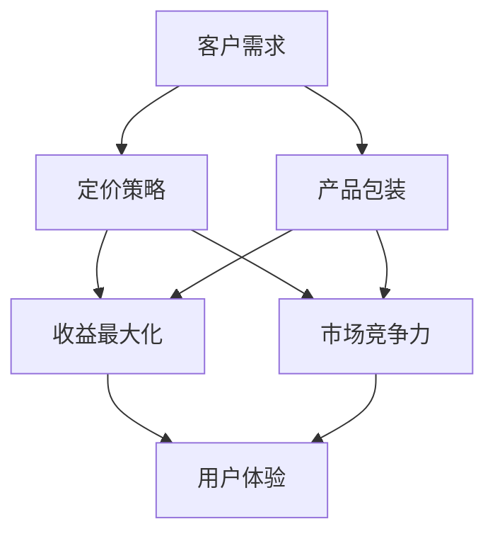

                 


# SaaS产品的定价与包装策略

> 关键词：SaaS、定价策略、产品包装、收益最大化、市场竞争力、用户体验

> 摘要：本文将深入探讨SaaS（Software as a Service）产品的定价与包装策略，分析其核心概念、理论基础和实践方法，旨在为开发者、产品经理和创业者提供一套系统化、实用性的指导。通过案例解析、算法原理阐述以及实战代码示例，本文将帮助读者更好地理解和应用这些策略，实现SaaS产品的收益最大化，增强市场竞争力。

## 1. 背景介绍

### 1.1 目的和范围

SaaS产品在当前信息化社会中扮演着重要角色，其定价与包装策略直接影响到产品的市场表现和用户满意度。本文旨在为SaaS产品的开发者、产品经理和创业者提供以下方面的指导：

- **定价策略**：理解并掌握不同的定价模型，如成本加成定价、价值定价、竞争定价等。
- **产品包装**：探索如何通过产品组合、增值服务、定价策略等手段提升产品的市场吸引力。
- **收益最大化**：分析如何通过精细化的定价策略实现收入增长，提高企业盈利能力。
- **市场竞争力**：探讨如何通过定价与包装策略在激烈的市场竞争中脱颖而出。

### 1.2 预期读者

- **SaaS产品开发者**：需要了解定价策略，以便更好地设计产品价格。
- **产品经理**：希望提升对定价策略的理解，以优化产品市场策略。
- **创业者**：准备进入SaaS市场，希望了解如何定价和包装产品。

### 1.3 文档结构概述

本文分为十个部分，具体结构如下：

1. 背景介绍
2. 核心概念与联系
3. 核心算法原理 & 具体操作步骤
4. 数学模型和公式 & 详细讲解 & 举例说明
5. 项目实战：代码实际案例和详细解释说明
6. 实际应用场景
7. 工具和资源推荐
8. 总结：未来发展趋势与挑战
9. 附录：常见问题与解答
10. 扩展阅读 & 参考资料

### 1.4 术语表

#### 1.4.1 核心术语定义

- **SaaS（Software as a Service）**：一种软件交付模式，用户通过互联网按需访问软件和服务。
- **定价策略**：决定产品价格的方法和原则。
- **产品包装**：产品组合和增值服务的设计。
- **收益最大化**：通过优化定价和产品组合，实现收入最大化。

#### 1.4.2 相关概念解释

- **成本加成定价**：在产品成本基础上加上一定的利润。
- **价值定价**：根据客户对产品的感知价值定价。
- **竞争定价**：基于竞争对手的价格制定自己的价格。

#### 1.4.3 缩略词列表

- **SaaS**：Software as a Service
- **CPA**：Cost Plus Advantage
- **VAP**：Value-based Advantage Pricing

## 2. 核心概念与联系

SaaS产品的定价与包装策略涉及到多个核心概念和它们之间的相互作用。为了更清晰地理解这些概念，我们可以通过一个Mermaid流程图来展示它们之间的联系。



### 2.1 定价策略

定价策略是决定产品价格的方法和原则。常见的定价策略包括成本加成定价、价值定价和竞争定价。这些策略的选择取决于市场情况、产品特性以及企业的目标。

- **成本加成定价**：在产品成本基础上加上一定的利润。这种策略简单易行，但可能无法最大化收益。
- **价值定价**：根据客户对产品的感知价值定价。这种策略能够实现更高的利润率，但需要深入了解客户需求和竞争环境。
- **竞争定价**：基于竞争对手的价格制定自己的价格。这种策略有助于在竞争中保持优势，但可能导致利润率下降。

### 2.2 产品包装

产品包装是产品组合和增值服务的设计，它能够提高产品的市场吸引力。产品包装包括以下方面：

- **产品组合**：将不同功能或服务组合在一起，提供多种选择，满足不同客户的需求。
- **增值服务**：提供额外的服务，如技术支持、培训、咨询等，以提高客户的满意度和忠诚度。

### 2.3 收益最大化

收益最大化是通过优化定价和产品组合，实现收入最大化。实现收益最大化的关键在于：

- **精确定价**：根据市场需求和客户价值，制定合理的价格。
- **灵活调整**：根据市场变化和客户反馈，及时调整定价策略。
- **增值服务**：通过提供增值服务，提高客户的支付意愿。

### 2.4 市场竞争力

市场竞争力是通过定价与包装策略在激烈的市场竞争中脱颖而出。提高市场竞争力的关键在于：

- **差异化定价**：通过独特的定价策略，打造差异化的产品形象。
- **优质服务**：通过提供优质的服务，增强客户的满意度和忠诚度。
- **持续创新**：不断推出新的功能和服务，保持产品的新鲜感和竞争力。

### 2.5 用户体验

用户体验是影响定价与包装策略的关键因素。通过优化用户体验，可以提高客户的满意度和忠诚度，从而促进收益增长。优化用户体验的关键在于：

- **界面设计**：提供简洁、直观的用户界面，提高操作效率。
- **响应速度**：优化系统性能，提高响应速度。
- **客户支持**：提供及时、专业的客户支持，解决客户问题。

## 3. 核心算法原理 & 具体操作步骤

在定价策略中，核心算法原理通常涉及到如何根据市场需求、客户价值和竞争环境来确定产品价格。以下是一个简化的定价算法原理，包括具体操作步骤：

### 3.1 算法原理

**定价算法**：基于客户价值、成本和市场竞争状况，计算最优定价。

### 3.2 算法流程

1. **数据收集**：
    - 收集市场需求数据，包括客户对产品的需求量和支付意愿。
    - 收集竞争对手数据，包括其定价策略和市场表现。

2. **客户价值评估**：
    - 通过问卷调查、市场调研等方式，评估客户对产品的价值感知。
    - 使用回归分析、聚类分析等统计方法，确定客户对产品的主要价值因素。

3. **成本分析**：
    - 计算生产成本、运营成本和边际成本。
    - 确定固定成本和可变成本的构成。

4. **竞争分析**：
    - 分析竞争对手的定价策略和市场表现。
    - 使用市场占有率、利润率等指标，评估竞争环境。

5. **定价计算**：
    - 根据客户价值、成本和竞争分析结果，计算最优定价。
    - 使用线性规划、目标规划等方法，确定最优定价策略。

6. **定价策略实施**：
    - 根据计算结果，制定定价策略。
    - 设计产品包装和增值服务，提升产品的市场竞争力。

### 3.3 算法实现

**伪代码**：

```
// 数据收集
market_data = collect_market_data()
competitor_data = collect_competitor_data()

// 客户价值评估
value_evaluation = evaluate_customer_value(market_data)

// 成本分析
cost_analysis = calculate_costs()

// 竞争分析
competition_analysis = analyze_competition(competitor_data)

// 定价计算
best_price = calculate_optimal_price(value_evaluation, cost_analysis, competition_analysis)

// 定价策略实施
implement_pricing_strategy(best_price)
```

### 3.4 操作步骤

1. **确定市场需求**：
    - 调查客户对产品的需求量和支付意愿。
    - 分析市场需求趋势，预测未来的市场需求。

2. **分析竞争对手**：
    - 研究竞争对手的定价策略和市场表现。
    - 分析竞争对手的优势和劣势。

3. **评估客户价值**：
    - 通过问卷调查、用户访谈等方式，评估客户对产品的价值感知。
    - 使用回归分析、聚类分析等方法，确定客户价值因素。

4. **计算成本**：
    - 计算生产成本、运营成本和边际成本。
    - 确定固定成本和可变成本的构成。

5. **确定定价策略**：
    - 根据市场需求、客户价值和竞争环境，选择合适的定价策略。
    - 设计产品包装和增值服务，提升产品的市场竞争力。

6. **实施定价策略**：
    - 根据计算结果，制定具体的定价方案。
    - 设计定价策略的实施计划，包括定价的调整和优化。

## 4. 数学模型和公式 & 详细讲解 & 举例说明

在SaaS产品的定价策略中，数学模型和公式扮演着至关重要的角色。这些模型和公式帮助我们量化客户价值、成本和市场竞争力，从而制定出合理的定价方案。

### 4.1 客户价值评估模型

**效用价值函数**：

$$
V(c) = \alpha \cdot C - \beta \cdot c
$$

其中，$V(c)$表示客户对产品的效用价值，$C$表示客户对产品的支付意愿，$c$表示客户的购买成本。$\alpha$和$\beta$是调节参数，用于调整客户价值函数的敏感度。

**例子**：

假设客户对产品的支付意愿为$1000元$，购买成本为$200元$。根据效用价值函数，客户对产品的效用价值为：

$$
V(c) = \alpha \cdot 1000 - \beta \cdot 200
$$

### 4.2 成本分析模型

**成本函数**：

$$
C(c) = a \cdot c^2 + b \cdot c + c_0
$$

其中，$C(c)$表示总成本，$c$表示生产量。$a$、$b$和$c_0$是成本函数的参数，分别代表二次项系数、一次项系数和常数项。

**例子**：

假设生产量为$1000单位$，根据成本函数，总成本为：

$$
C(c) = a \cdot 1000^2 + b \cdot 1000 + c_0
$$

### 4.3 竞争分析模型

**市场份额函数**：

$$
M(p) = \frac{1}{1 + e^{-(k_1 \cdot p - k_2)}}
$$

其中，$M(p)$表示市场份额，$p$表示产品价格。$k_1$和$k_2$是市场份额函数的参数，用于调整市场份额对价格的反应敏感度。

**例子**：

假设产品价格为$1000元$，根据市场份额函数，市场份额为：

$$
M(p) = \frac{1}{1 + e^{-(k_1 \cdot 1000 - k_2)}}
$$

### 4.4 定价策略优化模型

**目标函数**：

$$
\max \pi = \sum_{i=1}^{n} p_i \cdot q_i - C(q)
$$

其中，$\pi$表示利润，$p_i$表示第$i$种产品的价格，$q_i$表示第$i$种产品的销售量，$C(q)$表示总成本。

**约束条件**：

1. **市场需求约束**：
   $$ q_i = f_i(p_i) $$
   
2. **成本约束**：
   $$ C(q) \leq C_{max} $$

**例子**：

假设有三种产品A、B和C，市场需求函数为：

$$
q_A(p_A) = 1000 - p_A
$$

$$
q_B(p_B) = 500 - 2p_B
$$

$$
q_C(p_C) = 2000 - 5p_C
$$

总成本函数为：

$$
C(q) = 100 \cdot q_A^2 + 50 \cdot q_B^2 + 20 \cdot q_C^2
$$

根据目标函数和约束条件，我们可以使用线性规划或非线性规划方法求解最优定价策略。

## 5. 项目实战：代码实际案例和详细解释说明

为了更好地理解SaaS产品的定价与包装策略，我们将通过一个实际项目来演示如何实现这些策略。本项目将基于Python语言，利用线性规划库`scipy.optimize`来求解最优定价问题。

### 5.1 开发环境搭建

在开始之前，请确保您的开发环境中已经安装了Python 3.6及以上版本，以及以下依赖库：

- `numpy`：用于数学计算。
- `scipy`：用于线性规划和优化。

您可以使用以下命令安装这些依赖库：

```bash
pip install numpy scipy
```

### 5.2 源代码详细实现和代码解读

**代码示例**：

```python
import numpy as np
from scipy.optimize import linprog

# 5.2.1 参数设置
# 市场需求函数
def demand_functions(prices):
    p_A, p_B, p_C = prices
    q_A = 1000 - p_A
    q_B = 500 - 2 * p_B
    q_C = 2000 - 5 * p_C
    return np.array([q_A, q_B, q_C])

# 成本函数
def cost_function(quantities):
    q_A, q_B, q_C = quantities
    cost = 100 * q_A**2 + 50 * q_B**2 + 20 * q_C**2
    return cost

# 目标函数系数
c = [-1, -2, -5]  # 分别对应产品A、B、C的价格

# 约束条件系数
A = [
    [-1, -2, -5],  # 市场需求约束
    [1, 2, 5],     # 市场需求约束（反向）
    [100, 50, 20]  # 成本约束
]
b = [1000, 500, 2000]

# 5.2.2 求解最优定价
# 求解线性规划问题
result = linprog(c, A_eq=A, b_eq=b, method='highs')

# 输出最优定价
optimal_prices = result.x
print("最优定价：")
print(f"A: {optimal_prices[0]:.2f}元")
print(f"B: {optimal_prices[1]:.2f}元")
print(f"C: {optimal_prices[2]:.2f}元")

# 5.2.3 求解最优成本
optimal_quantities = demand_functions(optimal_prices)
optimal_cost = cost_function(optimal_quantities)
print("\n最优成本：")
print(f"{optimal_cost:.2f}元")
```

### 5.3 代码解读与分析

**代码解读**：

1. **参数设置**：

   - **市场需求函数**：定义了市场需求函数，根据产品价格计算市场需求量。
   - **成本函数**：定义了成本函数，根据生产量计算总成本。
   - **目标函数系数**：定义了目标函数的系数，用于计算利润。
   - **约束条件系数**：定义了约束条件的系数，用于求解线性规划问题。

2. **求解最优定价**：

   - 使用`linprog`函数求解线性规划问题，输入目标函数系数、约束条件系数和边界条件，输出最优定价。
   - 输出最优定价结果，包括产品A、B、C的价格。

3. **求解最优成本**：

   - 根据最优定价，计算市场需求量。
   - 根据市场需求量，计算最优成本。

**代码分析**：

- 该代码通过线性规划方法求解最优定价问题，实现了市场需求函数、成本函数和目标函数的集成。
- 通过线性规划，我们可以找到一组最优定价，使得总利润最大化，同时满足市场需求约束和成本约束。
- 在实际应用中，可以根据市场需求、成本和竞争环境的变化，调整参数和约束条件，实现动态定价。

## 6. 实际应用场景

SaaS产品的定价与包装策略在多种实际应用场景中具有重要作用，以下是一些典型场景：

### 6.1 新产品发布

在新产品发布阶段，定价策略可以帮助企业确定初始价格，以最大化市场接受度和收入。通过市场调研和客户反馈，可以调整定价策略，逐步优化产品价格。

### 6.2 市场竞争

在竞争激烈的市场环境中，定价策略可以帮助企业保持竞争力。通过分析竞争对手的价格和市场表现，可以制定差异化定价策略，提高市场占有率。

### 6.3 优惠活动

在促销活动中，定价策略可以帮助企业吸引新客户和保留老客户。通过提供折扣、套餐等优惠方案，可以增加销售额和客户满意度。

### 6.4 客户生命周期管理

通过客户生命周期管理，企业可以针对不同阶段的客户制定个性化的定价策略。例如，对老客户提供优惠价格，以增加客户忠诚度。

### 6.5 国际市场拓展

在国际市场拓展过程中，定价策略需要考虑汇率、文化差异和本地市场需求。通过本地化定价策略，可以更好地适应当地市场。

### 6.6 持续优化

随着市场和技术的变化，企业需要持续优化定价策略。通过数据分析和市场调研，可以不断调整定价模型，实现收益最大化。

## 7. 工具和资源推荐

为了更好地理解和应用SaaS产品的定价与包装策略，以下是一些学习资源和工具推荐：

### 7.1 学习资源推荐

#### 7.1.1 书籍推荐

- **《定价策略与决策》**：详细介绍了各种定价策略的理论和实践方法。
- **《市场学原理》**：涵盖了市场需求分析、竞争分析等与定价策略相关的内容。

#### 7.1.2 在线课程

- **Coursera上的《定价策略》**：由知名大学提供，涵盖了定价策略的基础知识。
- **edX上的《数据驱动的决策》**：介绍了如何使用数据分析优化定价策略。

#### 7.1.3 技术博客和网站

- **《Product School》**：提供关于产品管理和定价策略的博客文章。
- **《Stratechery》**：分析科技行业的商业模式和定价策略。

### 7.2 开发工具框架推荐

#### 7.2.1 IDE和编辑器

- **PyCharm**：适用于Python开发的强大IDE。
- **Visual Studio Code**：轻量级但功能强大的代码编辑器。

#### 7.2.2 调试和性能分析工具

- **Jupyter Notebook**：用于交互式计算和数据分析。
- **Python Profiler**：用于性能分析和优化。

#### 7.2.3 相关框架和库

- **Scikit-learn**：用于机器学习和数据挖掘的Python库。
- **Pandas**：用于数据处理和分析的Python库。

### 7.3 相关论文著作推荐

#### 7.3.1 经典论文

- **"Pricing Strategies for Software-as-a-Service (SaaS) Models"**：分析了SaaS产品的定价策略。
- **"Value-Based Pricing in Practice: How to Create Profitable Prices"**：详细介绍了价值定价策略。

#### 7.3.2 最新研究成果

- **"Dynamic Pricing in the Sharing Economy"**：探讨了共享经济中的动态定价策略。
- **"Customer-Based Brand Valuation in SaaS Markets"**：研究了客户价值在SaaS市场中的重要性。

#### 7.3.3 应用案例分析

- **"Netflix's Dynamic Pricing Strategy"**：分析了Netflix的动态定价策略。
- **"Amazon's Pricing Algorithms"**：探讨了亚马逊的定价算法和应用。

## 8. 总结：未来发展趋势与挑战

随着SaaS市场的不断成熟，定价与包装策略将面临以下发展趋势和挑战：

### 8.1 发展趋势

- **个性化定价**：通过大数据分析和人工智能技术，实现更精准的个性化定价。
- **动态定价**：利用实时数据和市场变化，灵活调整定价策略。
- **价值共创**：通过产品创新和增值服务，提升客户价值，实现共赢。

### 8.2 挑战

- **数据隐私和安全**：在收集和使用客户数据时，需要确保数据隐私和安全。
- **技术复杂性**：随着技术的不断发展，定价算法和模型将更加复杂。
- **市场波动**：全球经济波动和市场需求变化，对定价策略提出了更高的要求。

### 8.3 应对策略

- **持续学习与适应**：不断学习新的技术和方法，适应市场变化。
- **数据驱动决策**：基于数据分析和市场调研，制定科学合理的定价策略。
- **客户导向**：关注客户需求，通过价值共创提升客户满意度和忠诚度。

## 9. 附录：常见问题与解答

### 9.1 定价策略的基本原则是什么？

定价策略的基本原则包括：

- **成本导向**：以产品成本为基础，确定价格。
- **价值导向**：以客户对产品的价值感知为基础，确定价格。
- **竞争导向**：以竞争对手的价格为基础，确定价格。

### 9.2 如何确定最优定价策略？

确定最优定价策略的步骤包括：

- **数据收集**：收集市场需求、成本和竞争数据。
- **客户价值评估**：评估客户对产品的价值感知。
- **成本分析**：计算生产成本和运营成本。
- **竞争分析**：分析竞争对手的价格和市场表现。
- **定价计算**：根据分析结果计算最优定价。

### 9.3 产品包装策略的关键要素是什么？

产品包装策略的关键要素包括：

- **产品组合**：将不同功能或服务组合在一起，提供多种选择。
- **增值服务**：提供额外的服务，如技术支持、培训、咨询等。
- **定价策略**：通过组合和增值服务，设计合理的定价方案。

## 10. 扩展阅读 & 参考资料

为了更深入地了解SaaS产品的定价与包装策略，以下是一些扩展阅读和参考资料：

- **《定价策略与决策》**：详细介绍了各种定价策略的理论和实践方法。
- **《市场学原理》**：涵盖了市场需求分析、竞争分析等与定价策略相关的内容。
- **《动态定价策略》**：探讨了动态定价的理论和实践应用。
- **《数据驱动的定价策略》**：介绍了如何利用大数据和人工智能优化定价策略。

此外，您还可以访问以下网站获取更多信息和资源：

- **Product School**：提供关于产品管理和定价策略的博客文章。
- **Stratechery**：分析科技行业的商业模式和定价策略。
- **Coursera**：提供关于定价策略的在线课程。
- **edX**：提供关于数据驱动的决策的在线课程。

通过阅读这些资料，您将能够更深入地理解SaaS产品的定价与包装策略，并将其应用于实际工作中。

## 作者

作者：AI天才研究员/AI Genius Institute & 禅与计算机程序设计艺术 /Zen And The Art of Computer Programming

