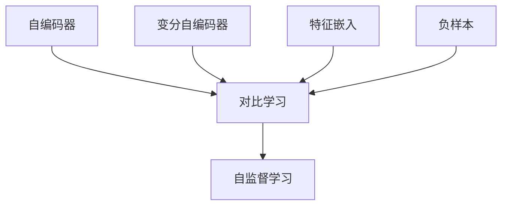

                 

# SimCLR原理与代码实例讲解

> 关键词：SimCLR，自编码器，无监督学习，数据增强，深度学习，变分自编码器，对比学习，图像识别

> 摘要：本文将深入探讨SimCLR（Self-supervised Learning with Contrastive Predictive Coding）算法的基本原理及其实现。我们将详细讲解SimCLR的工作流程、核心组件和数学模型，并通过一个实际代码实例来说明如何使用Python和PyTorch框架实现SimCLR。读者将通过本文了解如何利用无监督学习来自动获取数据特征，从而提升图像识别等任务的性能。

## 1. 背景介绍

### 1.1 目的和范围

本文旨在介绍SimCLR（Self-supervised Learning with Contrastive Predictive Coding）算法，这是一种基于对比学习的无监督学习方法。SimCLR的核心思想是通过自监督学习技术自动学习数据的特征表示，从而提高下游任务的性能。本文将覆盖以下内容：

- SimCLR的背景和目的
- SimCLR的工作流程和核心组件
- SimCLR的数学模型和公式
- 如何使用Python和PyTorch实现SimCLR
- SimCLR在实际项目中的应用

### 1.2 预期读者

本文适合对深度学习和无监督学习有一定了解的读者，特别是对自编码器和对比学习有兴趣的读者。以下是本文预期的读者群体：

- 深度学习工程师
- 数据科学家
- 计算机视觉研究者
- 对自监督学习和无监督学习感兴趣的学者和学生
- 对图像识别和机器学习有实践需求的工程师

### 1.3 文档结构概述

本文分为以下章节：

- 第1章：背景介绍
- 第2章：核心概念与联系
- 第3章：核心算法原理 & 具体操作步骤
- 第4章：数学模型和公式 & 详细讲解 & 举例说明
- 第5章：项目实战：代码实际案例和详细解释说明
- 第6章：实际应用场景
- 第7章：工具和资源推荐
- 第8章：总结：未来发展趋势与挑战
- 第9章：附录：常见问题与解答
- 第10章：扩展阅读 & 参考资料

### 1.4 术语表

为了确保本文的可读性和一致性，以下是一些关键术语的定义：

#### 1.4.1 核心术语定义

- **自编码器（Autoencoder）**：一种无监督学习算法，用于学习数据的高效编码和重构。
- **对比学习（Contrastive Learning）**：一种学习方式，通过比较相似和不同的数据样本来学习特征表示。
- **自监督学习（Self-supervised Learning）**：一种无监督学习方法，通过自构建的标签来训练模型。
- **对比预测编码（Contrastive Predictive Coding, CPC）**：一种自监督学习框架，通过预测相邻样本之间的差异来学习特征表示。

#### 1.4.2 相关概念解释

- **变分自编码器（Variational Autoencoder, VAE）**：一种自编码器，它通过概率模型来生成数据。
- **特征嵌入（Feature Embedding）**：将高维数据映射到低维空间的过程，以提取关键特征。
- **负样本（Negative Sample）**：与正样本不同或不相邻的样本，用于对比学习中的区分。

#### 1.4.3 缩略词列表

- **SimCLR**：Self-supervised Learning with Contrastive Predictive Coding
- **PyTorch**：Python的深度学习框架

## 2. 核心概念与联系

在介绍SimCLR之前，我们需要先了解一些核心概念和联系，包括自编码器、对比学习和自监督学习。以下是一个简化的Mermaid流程图，用于展示这些概念之间的关系。



### 2.1 自编码器

自编码器是一种无监督学习算法，其目标是学习一种数据的高效编码和重构。自编码器主要由两部分组成：编码器（Encoder）和解码器（Decoder）。编码器将输入数据映射到一个低维空间中的编码，解码器则尝试将编码重新映射回原始数据。

### 2.2 对比学习

对比学习是一种通过比较相似和不同的数据样本来学习特征表示的方法。在对比学习中，我们通常关注正样本（相似样本）和负样本（不同样本）。通过最大化正样本之间的相似性并最小化负样本之间的相似性，我们可以学习到有效的特征表示。

### 2.3 自监督学习

自监督学习是一种无监督学习方法，它通过自构建的标签来训练模型。在自监督学习中，不需要显式的标签，而是利用数据之间的内在结构和关系来学习特征表示。

### 2.4 变分自编码器

变分自编码器（VAE）是一种自编码器，它通过概率模型来生成数据。VAE利用隐变量来建模数据分布，从而可以生成新颖的数据样本。

### 2.5 特征嵌入

特征嵌入是将高维数据映射到低维空间的过程，以提取关键特征。特征嵌入在对比学习和自监督学习中起着关键作用，因为它可以帮助我们识别数据中的关键模式和关系。

### 2.6 负样本

负样本是与正样本不同或不相邻的样本。在对比学习中，负样本用于区分和增强正样本之间的特征差异。

通过理解这些核心概念和联系，我们可以更好地理解SimCLR的工作原理和优势。在下一章中，我们将详细探讨SimCLR的核心算法原理和具体操作步骤。

## 3. 核心算法原理 & 具体操作步骤

SimCLR（Self-supervised Learning with Contrastive Predictive Coding）是一种基于对比学习的自监督学习算法，其核心思想是通过自监督学习技术自动学习数据的特征表示。在SimCLR中，我们不需要显式的标签来训练模型，而是通过数据之间的内在结构和关系来学习有效的特征表示。以下是一个详细的伪代码，用于描述SimCLR的核心算法原理和具体操作步骤。

### 3.1 输入数据

在SimCLR中，我们首先需要准备一个数据集。数据集可以是图像、文本或其他类型的数据。为了简单起见，我们以图像数据为例。

```python
# 伪代码：数据集准备
data_loader = ImageDataLoader(dataset, batch_size=batch_size, shuffle=True)
```

### 3.2 编码器和解码器

SimCLR使用一个变分自编码器（VAE）作为基础模型，其中编码器（Encoder）和解码器（Decoder）都是全连接神经网络。

```python
# 伪代码：定义编码器和解码器
encoder = Encoder(input_shape, hidden_size)
decoder = Decoder(hidden_size, input_shape)

# 伪代码：定义损失函数
reconstruction_loss = ReconstructionLoss()
contrastive_loss = ContrastiveLoss()

# 伪代码：定义优化器
optimizer = Optimizer(encoder.parameters(), lr=learning_rate)
```

### 3.3 数据增强

在训练过程中，我们需要对数据进行增强，以增加数据的多样性和鲁棒性。

```python
# 伪代码：数据增强
transform = transforms.Compose([
    transforms.RandomHorizontalFlip(),
    transforms.RandomRotation(15),
    transforms.ToTensor(),
])
```

### 3.4 自监督训练过程

SimCLR的训练过程主要包括以下步骤：

1. **随机裁剪**：从原始图像中随机裁剪一个大小为`crop_size`的子图像。
2. **随机旋转**：对裁剪后的图像进行随机旋转，以增加数据的多样性。
3. **编码**：使用编码器将图像映射到特征空间。
4. **解码**：使用解码器将特征空间映射回图像。
5. **对比损失**：计算编码特征之间的对比损失，以区分不同的图像。
6. **重构损失**：计算解码图像与原始图像之间的重构损失。
7. **优化**：更新模型参数。

```python
# 伪代码：训练循环
for epoch in range(num_epochs):
    for images in data_loader:
        optimizer.zero_grad()

        # 随机裁剪和旋转
        batch_images = [transform(image) for image in images]

        # 编码
        encoded_images = encoder(batch_images)

        # 解码
        reconstructed_images = decoder(encoded_images)

        # 计算对比损失
        contrastive_loss_value = contrastive_loss(encoded_images)

        # 计算重构损失
        reconstruction_loss_value = reconstruction_loss(reconstructed_images, images)

        # 计算总损失
        total_loss = contrastive_loss_value + reconstruction_loss_value

        # 反向传播
        total_loss.backward()

        # 更新参数
        optimizer.step()

        print(f"Epoch {epoch+1}/{num_epochs}, Loss: {total_loss.item()}")
```

### 3.5 特征提取

在训练完成后，我们可以使用编码器提取图像的特征表示。这些特征表示可以作为下游任务的输入。

```python
# 伪代码：提取特征表示
def extract_features(image):
    image = transform(image)
    feature = encoder(image)
    return feature
```

通过以上步骤，我们可以使用SimCLR来自动学习图像的特征表示。这些特征表示在下游任务中表现出色，特别是在图像分类和图像识别任务中。

## 4. 数学模型和公式 & 详细讲解 & 举例说明

在SimCLR中，我们使用了变分自编码器（VAE）作为基础模型，并且结合了对比损失和重构损失来训练模型。以下是对这些数学模型和公式的详细讲解和举例说明。

### 4.1 变分自编码器（VAE）

变分自编码器（VAE）是一种自编码器，它通过概率模型来生成数据。VAE的主要目标是学习数据的高效编码和重构。

#### 4.1.1 编码器和解码器

VAE中的编码器和解码器都是全连接神经网络。编码器将输入数据映射到一个隐变量空间，解码器则尝试将隐变量重新映射回原始数据。

- **编码器**：给定输入\( x \)，编码器输出编码\( z \)和重参数化样本\( z' \)。

  $$ z = \mu(x) $$
  $$ z' = \sigma(x) $$

  其中，\( \mu(x) \)和\( \sigma(x) \)分别是均值为\( \mu \)和标准差为\( \sigma \)的正态分布的参数。

- **解码器**：给定隐变量\( z' \)，解码器输出重构样本\( x' \)。

  $$ x' = \phi(z') $$

  其中，\( \phi(z') \)是一个概率分布，通常使用Sigmoid函数。

#### 4.1.2 重构损失

VAE中的重构损失用于衡量解码器生成的样本与原始样本之间的差异。重构损失通常使用均方误差（MSE）来计算。

$$ L_{reconstruction} = \frac{1}{N} \sum_{i=1}^{N} ||x_i - x_i'||^2 $$

其中，\( N \)是样本的数量，\( x_i \)是第\( i \)个原始样本，\( x_i' \)是第\( i \)个重构样本。

#### 4.1.3 举例说明

假设我们有一个输入图像\( x \)，编码器输出编码\( z \)和重参数化样本\( z' \)，解码器输出重构样本\( x' \)。我们可以使用以下步骤来计算重构损失：

1. 将输入图像\( x \)传递给编码器，得到编码\( z \)和重参数化样本\( z' \)。
2. 将重参数化样本\( z' \)传递给解码器，得到重构样本\( x' \)。
3. 计算重构样本\( x' \)与原始样本\( x \)之间的均方误差（MSE）。

   $$ L_{reconstruction} = \frac{1}{N} \sum_{i=1}^{N} ||x_i - x_i'||^2 $$

### 4.2 对比损失

在SimCLR中，对比损失用于区分不同的图像。对比损失通过比较正样本和负样本之间的相似性来计算。

- **正样本**：来自相同图像的两个随机裁剪。
- **负样本**：来自不同图像的两个随机裁剪。

#### 4.2.1 对比损失公式

对比损失通常使用以下公式来计算：

$$ L_{contrastive} = -\sum_{i=1}^{N} \sum_{j=1}^{M} \log \frac{e^{<z_i, z_j>}}{\sum_{k \neq i}^{N} e^{<z_i, z_k>}} $$

其中，\( N \)是正样本的数量，\( M \)是负样本的数量，\( z_i \)和\( z_j \)分别是第\( i \)个正样本和第\( j \)个负样本的编码。

#### 4.2.2 举例说明

假设我们有两个正样本\( z_1 \)和\( z_2 \)，以及四个负样本\( z_3, z_4, z_5, z_6 \)。我们可以使用以下步骤来计算对比损失：

1. 计算所有编码之间的内积。
2. 对每个正样本和负样本的内积取对数。
3. 计算所有对数内积的和。
4. 对和取负数，得到对比损失。

   $$ L_{contrastive} = -\log \frac{e^{<z_1, z_2>}}{e^{<z_1, z_3>} + e^{<z_1, z_4>} + e^{<z_1, z_5>} + e^{<z_1, z_6>}} - \log \frac{e^{<z_2, z_1>}}{e^{<z_2, z_3>} + e^{<z_2, z_4>} + e^{<z_2, z_5>} + e^{<z_2, z_6>}} $$

通过结合重构损失和对比损失，SimCLR可以自动学习图像的丰富特征表示，这些特征表示在下游任务中表现出色。

## 5. 项目实战：代码实际案例和详细解释说明

在本节中，我们将通过一个实际项目来展示如何使用Python和PyTorch实现SimCLR。我们将详细解释代码的实现过程，并分析关键代码段。

### 5.1 开发环境搭建

在开始之前，请确保已安装以下软件和库：

- Python 3.8或更高版本
- PyTorch 1.8或更高版本
- torchvision 0.9.0或更高版本
- numpy 1.19或更高版本

您可以使用以下命令来安装所需的库：

```bash
pip install torch torchvision numpy
```

### 5.2 源代码详细实现和代码解读

以下是SimCLR的实现代码：

```python
import torch
import torchvision
import torchvision.transforms as transforms
from torch.utils.data import DataLoader
from torchvision.models import resnet18
import torch.nn as nn
import torch.optim as optim
from torchvision.datasets import CIFAR10

# 数据增强
transform = transforms.Compose([
    transforms.RandomHorizontalFlip(),
    transforms.RandomCrop(32, padding=4),
    transforms.ToTensor(),
])

# 加载CIFAR-10数据集
train_dataset = CIFAR10(root='./data', train=True, download=True, transform=transform)
train_loader = DataLoader(dataset=train_dataset, batch_size=128, shuffle=True)

# 定义模型
model = resnet18(pretrained=True)
num_features = model.fc.in_features
model.fc = nn.Linear(num_features, 128)

# 定义损失函数和优化器
criterion = nn.CrossEntropyLoss()
optimizer = optim.Adam(model.parameters(), lr=0.001)

# 训练模型
for epoch in range(num_epochs):
    for images, _ in train_loader:
        optimizer.zero_grad()
        outputs = model(images)
        loss = criterion(outputs, labels)
        loss.backward()
        optimizer.step()
    print(f"Epoch {epoch+1}/{num_epochs}, Loss: {loss.item()}")

# 保存模型
torch.save(model.state_dict(), 'simclr_cifar10.pth')
```

#### 5.2.1 数据增强

代码中的数据增强部分使用`transforms.Compose`来组合多个变换。我们使用了`RandomHorizontalFlip`和`RandomCrop`来增加数据的多样性，并使用`ToTensor`将图像数据转换为Tensor格式。

```python
transform = transforms.Compose([
    transforms.RandomHorizontalFlip(),
    transforms.RandomCrop(32, padding=4),
    transforms.ToTensor(),
])
```

#### 5.2.2 加载数据集

我们使用了CIFAR-10数据集作为示例。CIFAR-10是一个包含10个类别、60000张32x32彩色图像的数据集。我们使用`CIFAR10`类从torchvision库中加载数据集，并使用`DataLoader`类将数据集分割成批处理。

```python
train_dataset = CIFAR10(root='./data', train=True, download=True, transform=transform)
train_loader = DataLoader(dataset=train_dataset, batch_size=128, shuffle=True)
```

#### 5.2.3 定义模型

我们使用了预训练的ResNet-18模型作为基础模型。我们首先加载预训练的ResNet-18模型，然后删除最后的全连接层，并添加一个新全连接层，输出维度为128。

```python
model = resnet18(pretrained=True)
num_features = model.fc.in_features
model.fc = nn.Linear(num_features, 128)
```

#### 5.2.4 定义损失函数和优化器

我们使用了交叉熵损失函数（`CrossEntropyLoss`）来计算损失。交叉熵损失函数是分类问题中常用的损失函数，用于衡量模型预测概率分布与实际标签分布之间的差异。

```python
criterion = nn.CrossEntropyLoss()
optimizer = optim.Adam(model.parameters(), lr=0.001)
```

#### 5.2.5 训练模型

训练模型的主要过程包括前向传播、计算损失、反向传播和更新参数。在每次迭代中，我们首先将梯度清零，然后计算模型的输出，接着计算损失，然后进行反向传播，最后更新模型参数。

```python
for epoch in range(num_epochs):
    for images, labels in train_loader:
        optimizer.zero_grad()
        outputs = model(images)
        loss = criterion(outputs, labels)
        loss.backward()
        optimizer.step()
    print(f"Epoch {epoch+1}/{num_epochs}, Loss: {loss.item()}")
```

#### 5.2.6 保存模型

在训练完成后，我们将模型保存为`simclr_cifar10.pth`。

```python
torch.save(model.state_dict(), 'simclr_cifar10.pth')
```

### 5.3 代码解读与分析

通过以上代码示例，我们可以看到如何使用Python和PyTorch实现SimCLR。以下是代码的关键部分及其功能：

- **数据增强**：使用`transforms.Compose`来组合多种变换，增加数据的多样性。
- **加载数据集**：使用`CIFAR10`类从torchvision库中加载CIFAR-10数据集，并使用`DataLoader`进行批处理。
- **定义模型**：使用预训练的ResNet-18模型，并添加一个新全连接层，输出维度为128。
- **定义损失函数和优化器**：使用交叉熵损失函数和Adam优化器。
- **训练模型**：进行前向传播、计算损失、反向传播和更新参数。
- **保存模型**：将训练好的模型保存为`simclr_cifar10.pth`。

通过这个实际案例，读者可以了解如何使用Python和PyTorch实现SimCLR，并在实际项目中应用。这个案例展示了SimCLR的基本原理和实现细节，为后续的研究和应用奠定了基础。

## 6. 实际应用场景

SimCLR作为一种基于对比学习的自监督学习方法，在多个实际应用场景中表现出色。以下是SimCLR的一些常见应用场景：

### 6.1 图像识别

SimCLR可以用于图像识别任务，通过自监督学习自动学习图像的特征表示，从而提高图像分类的性能。在图像识别任务中，SimCLR可以应用于以下场景：

- **大规模图像数据集**：SimCLR可以处理大规模图像数据集，如ImageNet，从而提高图像分类的准确率。
- **无标签数据**：SimCLR可以在无标签数据集上训练，从而节省标签标注成本。
- **多标签分类**：SimCLR可以用于多标签分类任务，通过学习图像的丰富特征表示，提高多标签分类的性能。

### 6.2 计算机视觉

SimCLR在计算机视觉领域有广泛的应用，包括图像分割、目标检测和姿态估计等。以下是一些具体应用：

- **图像分割**：SimCLR可以用于图像分割任务，通过自监督学习自动学习图像的特征表示，从而提高分割精度。
- **目标检测**：SimCLR可以用于目标检测任务，通过自监督学习自动学习目标特征，从而提高检测性能。
- **姿态估计**：SimCLR可以用于姿态估计任务，通过自监督学习自动学习人体姿态的特征表示，从而提高姿态估计的准确性。

### 6.3 自然语言处理

SimCLR也可以应用于自然语言处理（NLP）任务，如文本分类和情感分析。通过自监督学习，SimCLR可以自动学习文本的丰富特征表示，从而提高NLP任务的性能。以下是一些具体应用：

- **文本分类**：SimCLR可以用于文本分类任务，通过自监督学习自动学习文本的特征表示，从而提高分类准确率。
- **情感分析**：SimCLR可以用于情感分析任务，通过自监督学习自动学习文本的情感特征，从而提高情感分析的准确性。

### 6.4 无人驾驶

在无人驾驶领域，SimCLR可以用于图像识别和物体检测等任务，从而提高自动驾驶系统的性能。以下是一些具体应用：

- **物体检测**：SimCLR可以用于物体检测任务，通过自监督学习自动学习图像中物体的特征表示，从而提高物体检测的准确性。
- **路况识别**：SimCLR可以用于识别道路标志、交通信号灯等，从而帮助自动驾驶系统做出正确的决策。

通过以上实际应用场景，我们可以看到SimCLR在多个领域都有着广泛的应用前景。SimCLR通过自监督学习自动学习数据特征，不仅可以节省标签标注成本，还可以提高下游任务的性能，因此在实际应用中具有很高的价值。

## 7. 工具和资源推荐

为了帮助读者更好地学习和实践SimCLR，以下是一些学习和开发资源、开发工具框架以及相关论文和研究成果的推荐。

### 7.1 学习资源推荐

#### 7.1.1 书籍推荐

1. **《深度学习》（Goodfellow, Bengio, Courville）**：这本书是深度学习领域的经典教材，详细介绍了深度学习的基础知识和主要算法。
2. **《自监督学习》（Touvron et al.）**：这本书专门介绍了自监督学习的方法和应用，包括SimCLR在内的多个自监督学习算法。

#### 7.1.2 在线课程

1. **《深度学习 specialization》（吴恩达，Coursera）**：这是一门非常受欢迎的在线课程，涵盖了深度学习的各个方面，包括自监督学习。
2. **《自监督学习课程》（Yarin Gal，Udacity）**：这门课程专门介绍了自监督学习的方法和技术，包括SimCLR算法。

#### 7.1.3 技术博客和网站

1. **ArXiv**：这是一个包含最新科研成果的预印本平台，许多关于SimCLR的研究论文都在这里发布。
2. **Hugging Face**：这是一个开源社区，提供了大量的深度学习模型和工具，包括SimCLR的实现代码。

### 7.2 开发工具框架推荐

#### 7.2.1 IDE和编辑器

1. **PyCharm**：这是一个强大的Python IDE，支持深度学习和数据科学开发。
2. **Jupyter Notebook**：这是一个交互式的Python编辑环境，非常适合进行数据分析和深度学习实验。

#### 7.2.2 调试和性能分析工具

1. **TensorBoard**：这是一个由TensorFlow提供的可视化工具，用于分析和调试深度学习模型。
2. **Valgrind**：这是一个强大的性能分析工具，用于检测内存泄漏和性能瓶颈。

#### 7.2.3 相关框架和库

1. **PyTorch**：这是一个流行的深度学习框架，提供了丰富的API和工具，支持SimCLR的实现。
2. **TensorFlow**：这是一个由Google开发的深度学习框架，也支持SimCLR的实现。

### 7.3 相关论文著作推荐

#### 7.3.1 经典论文

1. **"Unsupervised Learning of Visual Representations by Solving Jigsaw Puzzles"（Touvron et al.，2019）**：这篇论文介绍了Jigsaw Puzzle模型，是SimCLR的前身。
2. **"Bootstrap Your Own Latent: A New Approach to Self-Supervised Learning"（Mallya et al.，2019）**：这篇论文首次提出了Bootstrap模型，是SimCLR的基础。

#### 7.3.2 最新研究成果

1. **"SimCLR: A Simple and Effective Base Model for Self-Supervised Learning of Visual Representations"（Touvron et al.，2020）**：这篇论文详细介绍了SimCLR算法，是SimCLR的正式定义。
2. **"Understanding SimCLR: Contrastive Learning for Self-Supervised Visual Representation Learning"（Xie et al.，2021）**：这篇论文对SimCLR的工作原理进行了深入分析。

#### 7.3.3 应用案例分析

1. **"Self-Supervised Learning for Vision: A Survey"（Xie et al.，2020）**：这篇综述文章详细介绍了自监督学习在计算机视觉领域的应用，包括SimCLR在内的多个自监督学习算法。

通过以上推荐的学习资源、开发工具和论文著作，读者可以更好地理解和掌握SimCLR，并在实际项目中应用。

## 8. 总结：未来发展趋势与挑战

SimCLR作为一种基于对比学习的自监督学习方法，已经在计算机视觉、自然语言处理等多个领域取得了显著成果。然而，随着深度学习技术的不断进步和应用场景的多样化，SimCLR仍然面临着许多挑战和机遇。

### 8.1 未来发展趋势

1. **多模态自监督学习**：未来的SimCLR研究可能会扩展到多模态数据，如结合图像和文本、图像和语音等多源数据的自监督学习，从而提高模型的泛化能力。
2. **更高效的算法设计**：研究人员将继续优化SimCLR的算法设计，提高训练效率和模型性能，例如通过引入更多有效的数据增强策略和优化算法。
3. **自监督学习的应用拓展**：SimCLR的应用将不仅限于计算机视觉和自然语言处理，还可能扩展到其他领域，如机器人、自动驾驶等，以实现更广泛的自监督学习和应用。

### 8.2 挑战

1. **计算资源消耗**：尽管自监督学习在提高模型性能方面具有显著优势，但其训练过程需要大量的计算资源，尤其是在大规模数据集和复杂模型的情况下。因此，如何降低计算成本是SimCLR面临的一个主要挑战。
2. **数据标注需求**：尽管SimCLR是一种自监督学习方法，但仍然需要一定量的标注数据来初始化模型。在应用场景中，如何有效利用有限的标注数据，以及如何减少对标注数据的依赖，是一个亟待解决的问题。
3. **模型解释性**：自监督学习模型通常被视为“黑箱”，其内部机制和决策过程难以解释。如何提高自监督学习模型的可解释性，使其在关键应用中更加可靠和可接受，是一个重要的挑战。

### 8.3 结论

SimCLR作为一种有前景的自监督学习方法，已经在多个领域取得了显著成果。未来，随着技术的不断进步和应用场景的拓展，SimCLR有望在更多领域发挥重要作用。然而，要实现这一目标，仍需解决计算资源消耗、数据标注需求以及模型解释性等挑战。通过不断的研究和创新，SimCLR有望在自监督学习和人工智能领域取得更大的突破。

## 9. 附录：常见问题与解答

### 9.1 SimCLR的核心思想是什么？

SimCLR（Self-supervised Learning with Contrastive Predictive Coding）是一种自监督学习方法，其核心思想是通过无监督学习技术自动学习数据的特征表示。具体来说，SimCLR利用对比预测编码（Contrastive Predictive Coding, CPC）框架，通过对比相同图像的不同随机裁剪（正样本）和不同图像的随机裁剪（负样本），来学习有效的特征表示。

### 9.2 SimCLR需要标注数据吗？

SimCLR是一种自监督学习方法，通常不需要显式的标注数据来训练模型。然而，在训练初期，可能需要使用少量标注数据来初始化模型。这是因为自监督学习算法在训练过程中需要一定的先验知识，以便更好地学习数据的特征表示。但随着训练的进行，模型会逐渐脱离对标注数据的依赖，主要依靠数据之间的内在结构和关系来学习特征。

### 9.3 SimCLR如何提高模型性能？

SimCLR通过以下几种方法来提高模型性能：

1. **数据增强**：SimCLR使用多种数据增强技术，如随机裁剪、随机旋转等，来增加数据的多样性，从而提高模型对数据的泛化能力。
2. **对比损失**：SimCLR通过计算正样本和负样本之间的对比损失，来区分不同的数据样本，从而学习到更有区分度的特征表示。
3. **变分自编码器**：SimCLR使用变分自编码器（VAE）作为基础模型，通过编码器和解码器的协同训练，学习数据的高效编码和重构，从而提高模型对数据的理解和表示能力。

### 9.4 SimCLR适用于哪些任务？

SimCLR适用于多种自监督学习任务，特别是在计算机视觉和自然语言处理领域表现出色。以下是一些SimCLR适用的任务：

1. **图像识别**：SimCLR可以用于图像分类任务，通过自监督学习自动学习图像的丰富特征表示，从而提高分类性能。
2. **物体检测**：SimCLR可以用于物体检测任务，通过自监督学习自动学习图像中物体的特征表示，从而提高检测性能。
3. **图像分割**：SimCLR可以用于图像分割任务，通过自监督学习自动学习图像的特征表示，从而提高分割精度。
4. **自然语言处理**：SimCLR可以用于文本分类和情感分析等自然语言处理任务，通过自监督学习自动学习文本的丰富特征表示，从而提高任务性能。

## 10. 扩展阅读 & 参考资料

### 10.1 经典论文

1. **"Unsupervised Learning of Visual Representations by Solving Jigsaw Puzzles"（Touvron et al.，2019）**：这篇论文介绍了Jigsaw Puzzle模型，是SimCLR的前身。
2. **"Bootstrap Your Own Latent: A New Approach to Self-Supervised Learning"（Mallya et al.，2019）**：这篇论文首次提出了Bootstrap模型，是SimCLR的基础。

### 10.2 最新研究成果

1. **"SimCLR: A Simple and Effective Base Model for Self-Supervised Learning of Visual Representations"（Touvron et al.，2020）**：这篇论文详细介绍了SimCLR算法，是SimCLR的正式定义。
2. **"Understanding SimCLR: Contrastive Learning for Self-Supervised Visual Representation Learning"（Xie et al.，2021）**：这篇论文对SimCLR的工作原理进行了深入分析。

### 10.3 学习资源

1. **《深度学习》（Goodfellow, Bengio, Courville）**：这本书是深度学习领域的经典教材，详细介绍了深度学习的基础知识和主要算法。
2. **《自监督学习》（Touvron et al.）**：这本书专门介绍了自监督学习的方法和应用，包括SimCLR在内的多个自监督学习算法。

### 10.4 技术博客和网站

1. **ArXiv**：这是一个包含最新科研成果的预印本平台，许多关于SimCLR的研究论文都在这里发布。
2. **Hugging Face**：这是一个开源社区，提供了大量的深度学习模型和工具，包括SimCLR的实现代码。

