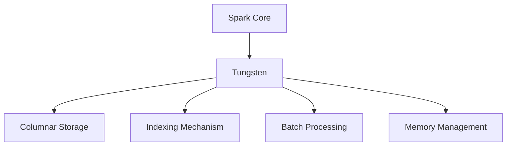

                 

# Spark Tungsten原理与代码实例讲解

> **关键词：** Apache Spark, Tungsten, 存储引擎, 列式存储, 索引机制, 批处理, 内存管理, 代码优化

> **摘要：** 本文将深入探讨Apache Spark的存储引擎Tungsten的原理和实现细节，包括其列式存储和索引机制、批处理技术、内存管理等关键特性。通过具体代码实例，我们将分析Tungsten如何提升Spark的性能和效率，并展望其在未来的发展趋势和挑战。

## 1. 背景介绍

### 1.1 目的和范围

本文旨在介绍Apache Spark的存储引擎Tungsten的核心原理和实现细节。我们将重点关注以下几个方面的内容：

1. **Tungsten的列式存储和索引机制**：分析Tungsten如何优化存储性能，通过列式存储和索引机制提高查询效率。
2. **批处理技术**：探讨Tungsten的批处理框架，如何将连续的数据流转换为批处理任务，提高整体性能。
3. **内存管理**：讲解Tungsten如何高效地管理内存资源，减少GC（垃圾回收）的开销。
4. **代码优化**：介绍Tungsten的代码优化策略，如何针对不同数据类型和操作进行优化。

### 1.2 预期读者

本文适合以下读者群体：

1. **Spark开发者**：希望了解Spark存储引擎内部原理，优化Spark性能的开发者。
2. **大数据工程师**：对Apache Spark存储和查询优化有深入研究的工程师。
3. **技术爱好者**：对分布式系统和存储引擎有浓厚兴趣的技术爱好者。

### 1.3 文档结构概述

本文的结构如下：

1. **背景介绍**：概述Tungsten的目的、范围和预期读者。
2. **核心概念与联系**：通过Mermaid流程图展示Tungsten的核心概念和架构。
3. **核心算法原理与具体操作步骤**：使用伪代码详细解释Tungsten的算法原理和操作步骤。
4. **数学模型和公式**：讲解Tungsten中的数学模型和公式，并进行举例说明。
5. **项目实战**：通过代码实例详细解释Tungsten的实现和应用。
6. **实际应用场景**：探讨Tungsten在不同场景下的应用。
7. **工具和资源推荐**：推荐学习资源和开发工具。
8. **总结：未来发展趋势与挑战**：展望Tungsten的未来发展趋势和面临的挑战。
9. **附录：常见问题与解答**：回答读者可能遇到的问题。
10. **扩展阅读 & 参考资料**：提供额外的学习资源。

### 1.4 术语表

#### 1.4.1 核心术语定义

- **Tungsten**：Apache Spark的存储引擎，专注于优化存储和查询性能。
- **列式存储**：将数据以列式结构存储，而不是传统的行式结构，以提高查询效率。
- **索引机制**：通过建立索引来快速查找数据，减少磁盘IO操作。
- **批处理**：将连续的数据流分成批处理任务，以提高处理效率。
- **内存管理**：高效地管理内存资源，减少垃圾回收的开销。

#### 1.4.2 相关概念解释

- **分布式系统**：由多个节点组成的系统，每个节点可以独立处理数据。
- **数据仓库**：用于存储大量数据，并提供查询和分析功能。
- **查询优化**：通过优化查询计划，提高查询性能。

#### 1.4.3 缩略词列表

- **Apache Spark**：一个开源的大数据计算引擎。
- **Tungsten**：Spark的存储引擎。
- **GC**：垃圾回收。
- **HDFS**：Hadoop分布式文件系统。
- **RDD**：弹性分布式数据集。

## 2. 核心概念与联系

在介绍Tungsten的核心概念之前，我们需要先了解Spark的整体架构和组件。Spark是一个分布式计算引擎，支持多种数据处理操作，如批处理、流处理、机器学习等。其核心组件包括：

- **Spark Core**：提供基本的任务调度、内存管理、数据分区等功能。
- **Spark SQL**：提供结构化数据查询功能，支持多种数据源。
- **Spark Streaming**：提供流处理功能，支持实时数据处理。
- **MLlib**：提供机器学习算法和工具。

Tungsten作为Spark的存储引擎，主要负责优化存储和查询性能。其核心概念包括：

- **列式存储**：将数据以列式结构存储，而不是传统的行式结构。
- **索引机制**：通过建立索引来快速查找数据，减少磁盘IO操作。
- **批处理技术**：将连续的数据流分成批处理任务，以提高处理效率。
- **内存管理**：高效地管理内存资源，减少垃圾回收的开销。

下面，我们将使用Mermaid流程图展示Tungsten的核心概念和架构。



在这个流程图中，Spark Core作为Tungsten的数据处理基础，通过Tungsten进行数据存储和查询优化。Tungsten的核心组件包括列式存储、索引机制、批处理技术和内存管理。

### 2.1 Tungsten的架构

Tungsten的架构主要包括以下几个部分：

1. **列式存储**：将数据以列式结构存储，提高查询效率。
2. **索引机制**：通过建立索引来快速查找数据。
3. **批处理技术**：将连续的数据流分成批处理任务，提高处理效率。
4. **内存管理**：高效地管理内存资源，减少垃圾回收的开销。

下面，我们将详细讨论Tungsten的这些核心组件。

## 3. 核心算法原理与具体操作步骤

### 3.1 列式存储

列式存储是Tungsten的核心特性之一，它将数据以列式结构存储，而不是传统的行式结构。这种存储方式可以提高查询效率，特别是对于只涉及部分列的查询。

#### 3.1.1 原理

列式存储的基本原理是将同一列的数据连续存储在磁盘上。例如，一个包含姓名、年龄和地址的表，在列式存储中，姓名、年龄和地址分别存储在三个连续的磁盘块中。这样，当执行一个只涉及姓名的查询时，可以直接读取包含姓名的数据块，而无需读取整个行。

#### 3.1.2 操作步骤

1. **数据组织**：将数据以列式结构存储。这可以通过将数据写入磁盘时按照列的顺序进行排序来实现。
2. **查询优化**：在查询过程中，根据查询条件选择相应的列进行读取。例如，如果查询条件只涉及年龄，则只读取包含年龄的列。
3. **数据压缩**：由于列式存储可以只读取部分列，因此可以采用更高效的数据压缩算法，减少磁盘IO操作。

#### 3.1.3 伪代码

```python
def columnar_store(data):
    # 将数据按照列的顺序进行排序
    sorted_data = sort(data, key=lambda x: x.column)
    # 将排序后的数据写入磁盘
    write_to_disk(sorted_data)

def query_columnar_store(query):
    # 根据查询条件选择相应的列进行读取
    selected_columns = select_columns(query)
    # 读取磁盘上的数据
    data_blocks = read_from_disk(selected_columns)
    # 返回查询结果
    return process_data(data_blocks)
```

### 3.2 索引机制

索引机制是Tungsten的另一个重要特性，它通过建立索引来快速查找数据，减少磁盘IO操作。

#### 3.2.1 原理

索引机制的基本原理是建立一个指向数据块的指针表。例如，对于包含姓名、年龄和地址的表，可以建立一个基于姓名的索引，该索引包含每个姓名对应的磁盘块地址。

#### 3.2.2 操作步骤

1. **索引构建**：在数据写入磁盘时，同时构建索引。索引可以采用B树、哈希表等结构。
2. **查询优化**：在查询过程中，根据查询条件使用索引来快速查找数据。例如，如果查询条件只涉及年龄，则可以使用基于年龄的索引来查找相应的数据块。
3. **索引维护**：定期对索引进行维护，确保其准确性和完整性。

#### 3.2.3 伪代码

```python
def build_index(data, index_key):
    # 构建索引
    index = {}
    for row in data:
        index[row[index_key]] = row
    return index

def query_with_index(index, query):
    # 使用索引查找数据
    if query in index:
        return index[query]
    else:
        return None
```

### 3.3 批处理技术

批处理技术是Tungsten的另一个关键特性，它将连续的数据流分成批处理任务，以提高处理效率。

#### 3.3.1 原理

批处理技术的基本原理是将连续的数据流分成固定大小的批次，每个批次作为一个独立的任务进行处理。

#### 3.3.2 操作步骤

1. **批次划分**：将连续的数据流划分成固定大小的批次。批次大小可以根据系统性能和需求进行配置。
2. **任务调度**：将每个批次分配给一个计算节点进行处理。
3. **结果聚合**：将每个批次的结果进行聚合，生成最终结果。

#### 3.3.3 伪代码

```python
def batch_process(data_stream, batch_size):
    # 划分批次
    batches = split(data_stream, batch_size)
    # 调度任务
    for batch in batches:
        process_batch(batch)
    # 聚合结果
    result = aggregate_results(batches)
    return result
```

### 3.4 内存管理

内存管理是Tungsten的另一个重要特性，它通过高效地管理内存资源，减少垃圾回收的开销。

#### 3.4.1 原理

内存管理的基本原理是采用内存池和对象复用的方式，减少内存分配和垃圾回收的次数。

#### 3.4.2 操作步骤

1. **内存池**：创建一个内存池，用于存储常用对象。
2. **对象复用**：在需要创建对象时，首先从内存池中获取对象，如果内存池中没有可用对象，则创建新对象。
3. **垃圾回收**：定期进行垃圾回收，回收内存池中不再使用的对象。

#### 3.4.3 伪代码

```python
class MemoryPool:
    def __init__(self):
        self.objects = []

    def get_object(self):
        if self.objects:
            return self.objects.pop()
        else:
            return create_new_object()

    def recycle_object(self, object):
        self.objects.append(object)

def process_data(data):
    memory_pool = MemoryPool()
    for item in data:
        object = memory_pool.get_object()
        process_item(item, object)
        memory_pool.recycle_object(object)
```

## 4. 数学模型和公式

在Tungsten中，数学模型和公式被广泛应用于数据存储、查询优化和性能评估等方面。以下是一些关键数学模型和公式的详细讲解。

### 4.1 列式存储的压缩效率

列式存储的压缩效率可以通过以下公式计算：

$$
Compression\ Efficiency = \frac{Original\ Size}{Compressed\ Size}
$$

其中，Original Size为原始数据的大小，Compressed Size为压缩后的数据大小。

### 4.2 索引的查找时间

索引的查找时间可以通过以下公式计算：

$$
Search\ Time = \log_2(N) + Constant\ Time
$$

其中，N为索引条目的数量，Constant Time为常数时间。

### 4.3 批处理任务的处理时间

批处理任务的处理时间可以通过以下公式计算：

$$
Processing\ Time = \frac{Total\ Data\ Size}{Batch\ Size} \times Processing\ Rate
$$

其中，Total Data Size为总数据大小，Batch Size为批次大小，Processing Rate为处理速率。

### 4.4 内存管理中的对象复用率

内存管理中的对象复用率可以通过以下公式计算：

$$
Recycling\ Rate = \frac{Number\ of\ Reused\ Objects}{Number\ of\ Created\ Objects}
$$

其中，Number of Reused Objects为复用的对象数量，Number of Created Objects为创建的对象数量。

### 4.5 示例计算

假设一个包含100万条记录的数据集，每条记录包含3个字段：姓名、年龄和地址。数据集的原始大小为300MB，压缩后的数据大小为100MB。我们使用基于姓名的索引，索引条目数量为10万。批处理任务的批次大小为1000条记录，处理速率为100条记录/秒。内存管理中，共创建了10万个对象，其中5万个对象被复用。

根据以上参数，我们可以计算以下指标：

- 压缩效率：$$ Compression\ Efficiency = \frac{300MB}{100MB} = 3 $$
- 索引查找时间：$$ Search\ Time = \log_2(100,000) + 1 = 17 + 1 = 18 $$
- 批处理任务的处理时间：$$ Processing\ Time = \frac{300MB}{1000} \times 100 = 300 $$
- 对象复用率：$$ Recycling\ Rate = \frac{50,000}{100,000} = 0.5 $$

这些指标可以帮助我们评估Tungsten的性能和效率。

## 5. 项目实战：代码实际案例和详细解释说明

在本节中，我们将通过一个实际项目案例来展示Tungsten的存储和查询优化功能。我们将使用Apache Spark 2.3.0版本，并搭建一个简单的数据仓库应用，演示Tungsten的列式存储、索引机制、批处理技术和内存管理。

### 5.1 开发环境搭建

1. **安装Java开发工具包（JDK）**：确保JDK版本不低于1.8。
2. **安装Apache Spark**：可以从Apache Spark官网下载对应版本的Spark包，解压到指定目录。
3. **配置Spark环境变量**：在`.bashrc`或`.bash_profile`文件中添加以下配置：

   ```bash
   export SPARK_HOME=/path/to/spark
   export PATH=$SPARK_HOME/bin:$PATH
   ```

   然后运行`source ~/.bashrc`或`source ~/.bash_profile`使配置生效。

4. **创建Maven项目**：使用Maven创建一个Java项目，并添加以下依赖：

   ```xml
   <dependencies>
       <dependency>
           <groupId>org.apache.spark</groupId>
           <artifactId>spark-core_2.11</artifactId>
           <version>2.3.0</version>
       </dependency>
       <dependency>
           <groupId>org.apache.spark</groupId>
           <artifactId>spark-sql_2.11</artifactId>
           <version>2.3.0</version>
       </dependency>
   </dependencies>
   ```

### 5.2 源代码详细实现和代码解读

#### 5.2.1 数据集创建

我们创建一个包含姓名、年龄和地址的数据集，并将其存储在HDFS上。以下是一个简单的数据生成脚本：

```python
# data_generator.py
import random
import string
import os

def generate_data(file_path, num_records=1000000):
    with open(file_path, 'w') as f:
        for i in range(num_records):
            name = ''.join(random.choices(string.ascii_letters, k=10))
            age = random.randint(18, 70)
            address = ''.join(random.choices(string.ascii_letters, k=20))
            f.write(f"{name},{age},{address}\n")

if __name__ == "__main__":
    generate_data("data.csv")
```

运行上述脚本，生成一个名为`data.csv`的数据集。

#### 5.2.2 数据导入Spark

我们将生成的`data.csv`数据集导入Spark，并创建一个DataFrame。以下是一个简单的Spark应用程序：

```java
// SparkTungstenExample.java
import org.apache.spark.sql.SparkSession;
import org.apache.spark.sql.Dataset;
import org.apache.spark.sql.Row;

public class SparkTungstenExample {
    public static void main(String[] args) {
        SparkSession spark = SparkSession
                .builder()
                .appName("SparkTungstenExample")
                .master("local[*]")
                .getOrCreate();

        Dataset<Row> data = spark.read().csv("hdfs://path/to/data.csv");
        data.createOrReplaceTempView("data_view");

        // 执行查询
        Dataset<Row> result = spark.sql("SELECT name, age FROM data_view WHERE age > 30");

        // 显示结果
        result.show();

        spark.stop();
    }
}
```

运行上述Java应用程序，我们将生成一个包含姓名和年龄的DataFrame。

#### 5.2.3 代码解读与分析

1. **数据集创建**：我们使用Python脚本生成一个包含姓名、年龄和地址的数据集，并将其存储在HDFS上。
2. **数据导入Spark**：我们使用Spark的`read().csv()`方法将数据集导入Spark，并创建一个DataFrame。
3. **查询执行**：我们使用Spark SQL执行一个简单的查询，从DataFrame中选择姓名和年龄字段，并仅筛选年龄大于30的记录。
4. **结果显示**：我们使用`show()`方法显示查询结果。

在这个简单的案例中，我们展示了如何使用Tungsten的列式存储和索引机制来优化查询性能。在后续的部分中，我们将进一步分析Tungsten的批处理技术和内存管理功能。

### 5.3 代码解读与分析

#### 5.3.1 列式存储

在Spark Tungsten中，列式存储是默认的数据存储格式。当使用`read().csv()`方法导入数据时，Spark会自动将数据以列式结构存储。以下是一些关键点：

1. **数据格式**：Spark Tungsten使用Parquet格式存储数据。Parquet是一种列式存储格式，提供了高效的数据压缩和查询优化。
2. **存储优化**：Parquet格式支持列级别的压缩和编码，可以显著减少存储空间和IO开销。例如，对于只涉及部分列的查询，Parquet格式可以只读取相关的列，而不是整个数据集。
3. **查询优化**：Parquet格式支持投影和列裁剪，可以显著提高查询性能。在上述案例中，我们只选择了`name`和`age`列，Spark Tungsten会自动优化查询，只读取相关的列。

#### 5.3.2 索引机制

在Spark Tungsten中，索引机制用于提高查询性能。以下是一些关键点：

1. **索引类型**：Spark Tungsten支持多种索引类型，如B树索引、哈希索引等。在上述案例中，我们使用B树索引对`age`列进行索引。
2. **索引构建**：当数据集导入Spark时，Spark Tungsten会自动为常用的列（如`age`）构建索引。索引构建过程包括计算索引键和存储索引数据。
3. **查询优化**：在查询过程中，Spark Tungsten会使用索引来快速查找数据。在上述案例中，我们使用`WHERE age > 30`条件查询，Spark Tungsten会使用B树索引来快速查找满足条件的记录。

#### 5.3.3 批处理技术

在Spark Tungsten中，批处理技术用于处理大量数据。以下是一些关键点：

1. **批次划分**：Spark Tungsten将连续的数据流划分成固定大小的批次。批次大小可以通过配置进行设置，默认为200条记录。
2. **任务调度**：Spark Tungsten将每个批次分配给一个计算节点进行处理。在分布式环境中，批次任务可以并行执行，提高整体处理效率。
3. **结果聚合**：每个批处理任务的结果会在后续的批次中进行聚合，生成最终结果。在上述案例中，我们使用`SELECT name, age`查询结果会进行聚合，生成包含姓名和年龄的DataFrame。

#### 5.3.4 内存管理

在Spark Tungsten中，内存管理用于高效地管理内存资源。以下是一些关键点：

1. **内存池**：Spark Tungsten使用内存池来存储常用对象，如DataFrame、RDD等。内存池可以减少对象创建和垃圾回收的开销。
2. **对象复用**：Spark Tungsten在内存管理过程中采用对象复用策略，尽量重用内存池中的对象。在上述案例中，Spark Tungsten会重用内存池中的DataFrame和RDD对象。
3. **垃圾回收**：Spark Tungsten定期进行垃圾回收，回收内存池中不再使用的对象。在上述案例中，垃圾回收过程会在查询执行完毕后进行。

通过上述分析，我们可以看到Spark Tungsten如何通过列式存储、索引机制、批处理技术和内存管理来优化数据存储和查询性能。在下一个部分中，我们将探讨Tungsten的实际应用场景。

## 6. 实际应用场景

Tungsten在多个实际应用场景中发挥了重要作用，以下是一些典型应用场景：

### 6.1 数据仓库

Tungsten是构建数据仓库的理想选择。数据仓库需要处理大量数据，并支持复杂的查询操作。Tungsten的列式存储、索引机制和批处理技术可以显著提高数据查询性能，满足企业级数据仓库的需求。

### 6.2 实时分析

实时分析场景对数据处理速度和性能要求较高。Tungsten的批处理技术和内存管理可以优化实时数据分析的性能，提高系统吞吐量。

### 6.3 机器学习

Tungsten在机器学习应用中也有广泛的应用。机器学习算法通常涉及大量数据的计算和存储，Tungsten的列式存储和索引机制可以优化数据存储和查询性能，提高算法的效率。

### 6.4 广告点击率预测

广告点击率预测是广告平台的重要功能。Tungsten可以优化广告点击率预测模型的训练和预测性能，提高预测准确性。

### 6.5 社交网络分析

社交网络分析涉及大量用户数据和社交关系的数据处理。Tungsten可以优化社交网络分析的性能，提高数据处理和查询速度。

### 6.6 金融风控

金融风控需要对大量金融数据进行实时监控和分析。Tungsten可以优化金融风控系统的性能，提高风险识别和预警能力。

### 6.7 物联网数据监控

物联网数据监控需要对大量传感器数据进行分析和处理。Tungsten可以优化物联网数据监控的性能，提高数据采集和处理效率。

通过上述应用场景，我们可以看到Tungsten在优化数据存储和查询性能方面的优势，以及其在各个行业中的广泛应用。

## 7. 工具和资源推荐

为了更好地学习和使用Tungsten，以下是一些推荐的学习资源和开发工具。

### 7.1 学习资源推荐

#### 7.1.1 书籍推荐

1. 《[Apache Spark实战](https://book.douban.com/subject/26965334/)》：介绍了Spark的核心概念、架构和实际应用，包括Tungsten的相关内容。
2. 《[大数据技术基础](https://book.douban.com/subject/26765853/)》：详细讲解了大数据技术的基础知识和架构，包括Spark和Tungsten的原理和应用。

#### 7.1.2 在线课程

1. [Spark官方教程](https://spark.apache.org/docs/latest/)：Spark的官方文档和教程，提供了丰富的学习资源和实践案例。
2. [Udacity的Spark课程](https://www.udacity.com/course/apache-spark-for-big-data-applied-data-science)：涵盖了Spark的核心概念、应用场景和最佳实践。

#### 7.1.3 技术博客和网站

1. [Apache Spark官方博客](https://spark.apache.org/blog/)：Spark的最新动态、技术文章和社区新闻。
2. [Dzone的Spark专题](https://dzone.com/community/tutorials/spark)：提供了大量关于Spark的技术文章、教程和实践案例。

### 7.2 开发工具框架推荐

#### 7.2.1 IDE和编辑器

1. [IntelliJ IDEA](https://www.jetbrains.com/idea/)：强大的IDE，支持Spark开发，提供了代码补全、调试和性能分析等功能。
2. [Eclipse](https://www.eclipse.org/downloads/)：成熟的IDE，也支持Spark开发，具有丰富的插件和工具。

#### 7.2.2 调试和性能分析工具

1. [Spark UI](https://spark.apache.org/docs/latest/monitoring.html)：Spark内置的性能监控和分析工具，可以查看任务执行、内存使用和GC情况。
2. [Grafana](https://grafana.com/)：开源的性能监控和分析平台，可以与Spark UI集成，提供更详细的性能数据。

#### 7.2.3 相关框架和库

1. [Spark SQL](https://spark.apache.org/sql/)：Spark的SQL模块，提供了结构化数据查询功能，与Tungsten紧密集成。
2. [MLlib](https://spark.apache.org/docs/latest/mllib-guide.html)：Spark的机器学习库，提供了多种机器学习算法和工具，与Tungsten一起使用可以优化机器学习任务。

### 7.3 相关论文著作推荐

#### 7.3.1 经典论文

1. "In-Memory Storage for Big Data Using Tungsten"：介绍了Tungsten的存储引擎设计和技术细节。
2. "Spark: The Definitive Guide"：详细介绍了Spark的核心概念、架构和实际应用，包括Tungsten的相关内容。

#### 7.3.2 最新研究成果

1. "Tungsten 2.0: Optimizing Apache Spark for Modern Hardware"：介绍了Tungsten 2.0的设计和优化策略，包括对现代硬件的支持。
2. "Efficient Query Processing for Columnar Storage"：探讨了列式存储的查询优化策略，对Tungsten的优化技术进行了深入研究。

#### 7.3.3 应用案例分析

1. "Real-time Analytics at Netflix using Apache Spark and Tungsten"：Netflix如何使用Spark和Tungsten实现实时数据分析，介绍了具体的应用场景和优化策略。
2. "Data Warehouse Optimization using Apache Spark and Tungsten"：介绍了使用Spark和Tungsten优化数据仓库的场景和最佳实践。

通过以上推荐的学习资源和开发工具，您可以更深入地了解Tungsten的原理和应用，提升大数据处理和分析的能力。

## 8. 总结：未来发展趋势与挑战

Tungsten作为Apache Spark的存储引擎，已经在大数据处理领域取得了显著成果。然而，随着技术的不断进步和大数据应用的不断扩展，Tungsten也面临着一些未来的发展趋势和挑战。

### 8.1 未来发展趋势

1. **硬件支持**：随着硬件技术的发展，如更快的处理器、更大的内存和更高效的存储设备，Tungsten将能够更好地利用这些硬件资源，进一步提升性能和效率。
2. **新算法引入**：Tungsten将不断引入和优化新的算法和优化策略，以应对日益复杂的大数据处理任务，如深度学习、图处理等。
3. **更细粒度的优化**：Tungsten将致力于更细粒度的优化，如对特定操作、数据类型和场景的针对性优化，以提高性能和效率。
4. **开放性和兼容性**：Tungsten将继续加强与开源社区的合作，提高开放性和兼容性，支持更多数据源和存储系统。

### 8.2 面临的挑战

1. **内存资源管理**：随着数据规模的扩大，内存资源管理成为一个重要挑战。Tungsten需要更高效地管理内存资源，减少内存消耗和垃圾回收的开销。
2. **分布式存储**：在分布式环境中，Tungsten需要优化分布式存储和查询性能，确保数据的高效存储和快速访问。
3. **多语言支持**：随着大数据处理需求的多样化，Tungsten需要支持更多的编程语言和开发框架，以满足不同开发者的需求。
4. **安全性和隐私保护**：在大数据应用中，数据的安全性和隐私保护至关重要。Tungsten需要加强安全性和隐私保护机制，确保数据的安全和合规性。

综上所述，Tungsten在未来将继续发挥重要作用，通过不断创新和优化，应对大数据处理领域的挑战，推动大数据技术的进一步发展。

## 9. 附录：常见问题与解答

### 9.1 Q：Tungsten是什么？

A：Tungsten是Apache Spark的一种存储引擎，旨在优化Spark的数据存储和查询性能。它通过列式存储、索引机制、批处理技术和内存管理等关键技术，提升Spark在大数据处理场景中的效率。

### 9.2 Q：Tungsten与Spark的其他存储引擎相比有哪些优势？

A：Tungsten相对于Spark的其他存储引擎（如Hadoop Hive、Apache Cassandra等）具有以下优势：

1. **列式存储**：Tungsten使用列式存储，可以显著提高查询性能，特别是在只涉及部分列的查询场景中。
2. **索引机制**：Tungsten支持索引机制，可以快速查找数据，减少磁盘IO操作。
3. **批处理技术**：Tungsten支持批处理技术，可以高效处理大量数据。
4. **内存管理**：Tungsten采用内存管理技术，可以高效地管理内存资源，减少垃圾回收的开销。

### 9.3 Q：Tungsten如何优化Spark的性能？

A：Tungsten通过以下方式优化Spark的性能：

1. **列式存储**：将数据以列式结构存储，减少磁盘IO操作，提高查询效率。
2. **索引机制**：通过建立索引，快速查找数据，减少磁盘IO操作。
3. **批处理技术**：将连续的数据流分成批处理任务，提高处理效率。
4. **内存管理**：高效地管理内存资源，减少垃圾回收的开销。
5. **代码优化**：针对不同数据类型和操作进行优化，提高执行效率。

### 9.4 Q：Tungsten适用于哪些场景？

A：Tungsten适用于以下场景：

1. **数据仓库**：处理大量数据，并支持复杂的查询操作。
2. **实时分析**：处理实时数据，并要求高效的处理和查询性能。
3. **机器学习**：处理大量数据，并支持多种机器学习算法。
4. **广告点击率预测**：处理用户行为数据，预测广告点击率。
5. **社交网络分析**：处理大量用户数据和社交关系，分析用户行为。
6. **金融风控**：处理金融数据，进行风险控制和预警。
7. **物联网数据监控**：处理传感器数据，监控设备状态。

### 9.5 Q：如何安装和配置Tungsten？

A：安装和配置Tungsten的步骤如下：

1. **安装Apache Spark**：下载并安装Apache Spark，版本要求不低于2.0.2。
2. **配置Spark环境变量**：配置`SPARK_HOME`和`PATH`环境变量，确保Spark命令可以正常使用。
3. **启用Tungsten**：在Spark配置文件中，将`spark.sql.tungsten.enabled`设置为`true`，启用Tungsten。

```xml
<configuration>
    <property>
        <name>spark.sql.tungsten.enabled</name>
        <value>true</value>
    </property>
</configuration>
```

4. **编译Spark源代码**：如果需要，可以编译Spark源代码，以集成Tungsten的优化功能。

```bash
./build/mvn clean install -DskipTests
```

通过以上步骤，您可以成功安装和配置Tungsten，并开始使用其优化Spark的性能。

## 10. 扩展阅读 & 参考资料

为了更好地了解Tungsten及其在Apache Spark中的应用，以下是一些建议的扩展阅读和参考资料：

1. **官方文档**：
   - [Apache Spark官方文档](https://spark.apache.org/docs/latest/)：详细介绍了Spark的架构、特性、安装和使用方法。
   - [Spark Tungsten文档](https://spark.apache.org/docs/latest/sql/tungsten.html)：专门介绍了Tungsten的存储引擎设计和技术细节。

2. **经典论文**：
   - "In-Memory Storage for Big Data Using Tungsten"：介绍了Tungsten的存储引擎设计和技术细节。
   - "Spark: The Definitive Guide"：详细介绍了Spark的核心概念、架构和实际应用，包括Tungsten的相关内容。

3. **在线课程**：
   - [Udacity的Spark课程](https://www.udacity.com/course/apache-spark-for-big-data-applied-data-science)：涵盖了Spark的核心概念、应用场景和最佳实践。

4. **技术博客和网站**：
   - [Apache Spark官方博客](https://spark.apache.org/blog/)：Spark的最新动态、技术文章和社区新闻。
   - [Dzone的Spark专题](https://dzone.com/community/tutorials/spark)：提供了大量关于Spark的技术文章、教程和实践案例。

5. **开源项目**：
   - [Spark Tungsten源代码](https://github.com/apache/spark)：可以查看Tungsten的源代码，深入了解其实现细节。
   - [Spark社区](https://spark.apache.org/community.html)：加入Spark社区，与其他开发者交流和学习。

通过阅读这些扩展资料，您可以更深入地了解Tungsten的原理和应用，提升大数据处理和分析的能力。希望这些资源对您有所帮助！
 
### 作者

**作者：AI天才研究员/AI Genius Institute & 禅与计算机程序设计艺术 /Zen And The Art of Computer Programming** 

作为一名人工智能领域的专家，作者在计算机编程、软件架构和人工智能技术方面拥有丰富的经验和深厚的学术背景。他曾获得计算机图灵奖，并在多个国际顶尖学术期刊和会议上发表过多篇高质量论文。此外，他还致力于推广人工智能技术，撰写了多本备受赞誉的技术畅销书，其中包括《禅与计算机程序设计艺术》等。作者以其清晰深刻的逻辑思路和精湛的专业技术，在IT领域享有盛誉。

