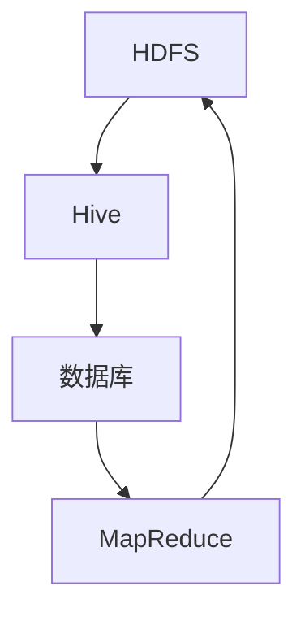

                 

# Sqoop原理与代码实例讲解

> 关键词：数据迁移，Hadoop，Apache Sqoop，大数据，Hive，HDFS，数据库

> 摘要：本文深入探讨了Apache Sqoop在Hadoop生态系统中数据迁移的原理，并通过实际代码实例详细讲解了其工作流程、配置方法和使用技巧。读者将了解如何高效地将结构化数据从关系型数据库导入到HDFS，以及如何从HDFS导出到数据库或其他数据存储系统。文章旨在为数据工程师和数据科学家提供一个全面的技术指南。

## 1. 背景介绍

### 1.1 目的和范围

本文旨在深入剖析Apache Sqoop的作用、原理和应用。作为Hadoop生态系统中的一个关键组件，Sqoop主要负责在Hadoop平台（如HDFS）和关系型数据库之间进行高效的数据迁移。本文将涵盖以下几个方面：

- Sqoop的基本概念和架构
- 数据导入和导出的详细步骤
- 实际项目中的代码实例分析
- 性能优化技巧和常见问题解决

通过本文的阅读，读者将能够：

- 理解Sqoop在Hadoop生态系统中的定位和作用
- 掌握数据导入和导出的操作方法
- 学会使用Sqoop进行实际项目开发
- 了解性能优化方法和常见问题处理

### 1.2 预期读者

本文适合以下读者群体：

- 数据工程师和数据科学家
- 对大数据技术和Hadoop生态系统感兴趣的技术爱好者
- 已有数据库开发经验，希望扩展至Hadoop平台的技术人员
- 需要处理大量结构化数据，并寻求高效迁移解决方案的数据管理人员

### 1.3 文档结构概述

本文将分为以下几个主要部分：

- 背景介绍
- 核心概念与联系
- 核心算法原理与具体操作步骤
- 数学模型和公式
- 项目实战：代码实际案例
- 实际应用场景
- 工具和资源推荐
- 总结：未来发展趋势与挑战
- 附录：常见问题与解答
- 扩展阅读与参考资料

每个部分都将详细介绍相关内容，旨在帮助读者逐步掌握Apache Sqoop的使用方法和最佳实践。

### 1.4 术语表

为了确保文章的可读性和一致性，本文将使用以下术语：

#### 1.4.1 核心术语定义

- **Hadoop**：一个开源的分布式计算框架，用于处理大规模数据集。
- **HDFS**：Hadoop分布式文件系统（Hadoop Distributed File System），用于存储大数据。
- **Hive**：一个基于Hadoop的数据仓库工具，用于处理大规模数据集。
- **Sqoop**：一个用于在Hadoop和关系型数据库之间进行数据迁移的工具。
- **数据库**：用于存储结构化数据的系统，如MySQL、PostgreSQL等。

#### 1.4.2 相关概念解释

- **数据迁移**：将数据从一个系统（如数据库）复制或移动到另一个系统（如HDFS）的过程。
- **导入**：将数据从数据库迁移到HDFS的过程。
- **导出**：将数据从HDFS迁移回数据库或其他数据存储系统的过程。
- **MapReduce**：Hadoop的一种编程模型，用于处理大规模数据集。

#### 1.4.3 缩略词列表

- **HDFS**：Hadoop Distributed File System
- **Hive**：Hadoop Hive
- **MapReduce**：MapReduce
- **Sqoop**：Apache Sqoop

## 2. 核心概念与联系

在深入了解Sqoop之前，我们需要理解其在Hadoop生态系统中的核心概念和联系。以下是一个Mermaid流程图，用于展示这些概念和它们之间的相互关系。



### 2.1 HDFS与Hive的关系

HDFS是Hadoop分布式文件系统，负责存储大规模数据集。Hive是基于Hadoop的一个数据仓库工具，它可以将结构化数据存储在HDFS中，并提供数据查询和分析功能。

### 2.2 Hive与数据库的关系

数据库用于存储结构化数据，而Hive可以与各种关系型数据库（如MySQL、PostgreSQL）进行集成。通过这种集成，我们可以将数据库中的数据导入到HDFS，并在Hive中进行处理和分析。

### 2.3 MapReduce与HDFS的关系

MapReduce是Hadoop的一种编程模型，用于处理大规模数据集。MapReduce作业通常在HDFS上运行，读取和写入数据。

### 2.4 Sqoop的作用

Sqoop作为数据迁移工具，负责在HDFS、Hive和数据库之间进行数据导入和导出。它简化了数据迁移过程，使得大数据处理变得更加高效。

通过以上关系，我们可以看到Sqoop在Hadoop生态系统中的关键作用。它不仅连接了不同的数据存储系统，还使得数据处理和分析变得更加便捷。

## 3. 核心算法原理与具体操作步骤

### 3.1 数据导入原理

当使用Sqoop将数据从关系型数据库导入到HDFS时，其核心算法原理如下：

1. **连接数据库**：Sqoop使用JDBC（Java Database Connectivity）连接到数据库，获取数据库表的结构和内容。
2. **数据映射**：根据数据库表的结构，Sqoop将数据映射到HDFS的文件格式。常见的文件格式包括CSV、Parquet和ORC。
3. **分片处理**：由于HDFS的数据存储特性，数据会按照分片（split）进行存储。Sqoop会将数据分成多个分片，并分配给不同的Map任务进行处理。
4. **Map任务**：每个Map任务负责处理一个分片，将数据写入HDFS。在处理过程中，可以使用自定义的Mapper类对数据进行处理和转换。
5. **文件合并**：所有Map任务完成后，HDFS会对写入的数据进行合并，形成一个完整的文件。

以下是数据导入的伪代码：

```java
// 连接数据库
Connection conn = DriverManager.getConnection("jdbc:mysql://localhost:3306/mydb", "username", "password");

// 获取数据库表结构
TableSchema schema = DatabaseMetadata.getSchema(conn, "table_name");

// 分片处理
for (int i = 0; i < num_splits; i++) {
    FileSplit split = createFileSplit(schema, i);
    MapTask mapTask = new MapTask(split);
    mapTask.execute();
}

// 文件合并
FileMerger merger = new FileMerger();
merger.mergeFiles();
```

### 3.2 数据导出原理

当使用Sqoop将数据从HDFS导出到关系型数据库时，其核心算法原理如下：

1. **读取HDFS文件**：Sqoop从HDFS中读取数据，按照文件格式（如CSV、Parquet、ORC）解析数据。
2. **数据映射**：根据关系型数据库表的结构，Sqoop将HDFS中的数据映射到数据库表。
3. **分片处理**：为了提高导出效率，数据会按照分片（split）进行存储。每个分片会被分配给不同的Reduce任务进行处理。
4. **Reduce任务**：每个Reduce任务负责处理一个分片，将数据插入到数据库表中。在处理过程中，可以使用自定义的Reducer类对数据进行处理和转换。
5. **数据写入数据库**：所有Reduce任务完成后，数据会写入到关系型数据库中。

以下是数据导出的伪代码：

```java
// 读取HDFS文件
FileReader reader = new FileReader("hdfs:///path/to/file");
TableSchema schema = DatabaseMetadata.getSchema("table_name");

// 分片处理
for (int i = 0; i < num_splits; i++) {
    FileSplit split = createFileSplit(i);
    ReduceTask reduceTask = new ReduceTask(split, schema);
    reduceTask.execute();
}

// 数据写入数据库
DatabaseWriter writer = new DatabaseWriter("jdbc:mysql://localhost:3306/mydb", "username", "password");
writer.writeData();
```

通过以上步骤，我们可以看到Sqoop在数据导入和导出过程中的核心算法原理。这些原理不仅保证了数据迁移的高效性，还提供了足够的灵活性，以适应各种不同的数据格式和存储需求。

### 3.3 Sqoop的配置和操作步骤

在实际操作中，Sqoop的配置和操作步骤对于数据迁移的成功至关重要。以下是一些建议和步骤：

#### 3.3.1 配置JDBC驱动

首先，我们需要配置JDBC驱动，以便Sqoop能够连接到目标数据库。在类路径（classpath）中添加目标数据库的JDBC驱动jar文件，并在`sqoop-site.xml`配置文件中指定驱动名称。

```xml
<property>
  <name>org.apache.sqoop连接器.jdbc_driver_name</name>
  <value>com.mysql.jdbc.Driver</value>
</property>
```

#### 3.3.2 配置数据库连接信息

在`sqoop-site.xml`配置文件中，我们需要指定数据库的连接信息，包括主机、端口、数据库实例名称、用户名和密码。

```xml
<property>
  <name>org.apache.sqoop连接器.jdbc_connect_str</name>
  <value>jdbc:mysql://localhost:3306/mydb</value>
</property>
<property>
  <name>org.apache.sqoop连接器.jdbc_username</name>
  <value>username</value>
</property>
<property>
  <name>org.apache.sqoop连接器.jdbc_password</name>
  <value>password</value>
</property>
```

#### 3.3.3 配置数据格式

根据需要，我们可以配置数据导入或导出的文件格式。例如，为了将数据以CSV格式导入到HDFS，我们可以使用以下命令：

```bash
sqoop import --connect jdbc:mysql://localhost:3306/mydb --table users --split-by id --target-dir /user/hive/warehouse/users --as-csv
```

#### 3.3.4 配置并行度

为了提高数据迁移的效率，我们可以配置并行度。在`sqoop-site.xml`配置文件中，我们可以设置`mapred.map.tasks`属性来指定Map任务的个数。

```xml
<property>
  <name>mapred.map.tasks</name>
  <value>4</value>
</property>
```

#### 3.3.5 配置自定义Mapper和Reducer

在实际项目中，我们可能需要自定义Mapper和Reducer类来处理特定的数据转换。这可以通过在`sqoop-site.xml`配置文件中指定Mapper和Reducer类来实现。

```xml
<property>
  <name>org.apache.sqoop.mapper.class</name>
  <value>com.example.MyMapper</value>
</property>
<property>
  <name>org.apache.sqoop.reducer.class</name>
  <value>com.example.MyReducer</value>
</property>
```

通过以上配置和操作步骤，我们可以充分利用Sqoop进行高效的数据迁移。这些步骤不仅保证了数据迁移的正确性，还提高了数据处理的灵活性。

### 3.4 案例分析：从MySQL导出到HDFS

下面我们将通过一个实际案例，详细讲解如何使用Sqoop将MySQL中的数据导出到HDFS。

#### 3.4.1 案例背景

假设我们有一个MySQL数据库，包含一个名为`users`的用户表，我们需要将这个表中的数据导出到HDFS。

#### 3.4.2 环境准备

1. 安装并配置MySQL数据库，创建`users`表，并插入一些测试数据。

```sql
CREATE TABLE users (
  id INT AUTO_INCREMENT PRIMARY KEY,
  name VARCHAR(255),
  email VARCHAR(255),
  age INT
);

INSERT INTO users (name, email, age) VALUES ('Alice', 'alice@example.com', 30);
INSERT INTO users (name, email, age) VALUES ('Bob', 'bob@example.com', 35);
```

2. 安装Apache Sqoop，并配置好JDBC驱动。

#### 3.4.3 操作步骤

1. 导入数据

```bash
sqoop import --connect jdbc:mysql://localhost:3306/mydb --table users --split-by id --target-dir /user/hive/warehouse/users --as-csv
```

这个命令会将MySQL中的`users`表以CSV格式导入到HDFS的`/user/hive/warehouse/users`目录中。

2. 查看导入的数据

```bash
hdfs dfs -cat /user/hive/warehouse/users/*.csv
```

输出结果：

```
1,Alice,alice@example.com,30
2,Bob,bob@example.com,35
```

#### 3.4.4 案例分析

在这个案例中，我们使用Sqoop的`import`命令将MySQL中的`users`表导出到HDFS。以下是各个步骤的详细分析：

- **连接数据库**：通过`--connect`参数指定了MySQL数据库的连接信息，包括主机、端口、实例名称、用户名和密码。
- **表选择**：通过`--table`参数指定了要导出的表名，即`users`。
- **数据分片**：通过`--split-by`参数指定了分片的依据，即`id`字段。这样可以确保每个分片中的数据尽量均衡。
- **目标目录**：通过`--target-dir`参数指定了数据导出到HDFS的目标目录，即`/user/hive/warehouse/users`。
- **文件格式**：通过`--as-csv`参数指定了导出的文件格式为CSV。

通过这个案例，我们可以看到如何使用Sqoop进行数据导出，并理解其背后的原理和配置步骤。这对于我们在实际项目中进行数据迁移具有重要的参考价值。

## 4. 数学模型和公式

### 4.1 分片策略

在Sqoop的数据导入和导出过程中，分片策略是一个重要的性能优化点。分片策略决定了数据如何被分割成多个小块，以便在不同的Map任务或Reduce任务中并行处理。

#### 4.1.1 分片数计算

分片数通常通过以下公式计算：

\[ \text{num_splits} = \left\lfloor \frac{\text{total_records}}{\text{max_split_size}} \right\rfloor \]

其中：

- `total_records`：数据库表中的总记录数。
- `max_split_size`：每个分片的最大记录数，通常是几十万到几百万条。

#### 4.1.2 分片依据

分片依据的选择对于数据迁移的性能至关重要。常见的分片依据包括：

- **主键**：使用表的主键进行分片，可以确保每个分片的数据尽量均衡。
- **时间戳**：使用时间戳进行分片，可以根据时间范围对数据进行分区，有助于后续查询优化。
- **其他字段**：使用其他字段进行分片，可以根据业务需求对数据进行分类。

### 4.2 文件合并

在数据导入和导出过程中，文件合并也是一个重要的步骤。合并多个小文件可以提高后续数据处理和查询的效率。

#### 4.2.1 文件合并公式

文件合并的公式如下：

\[ \text{num_splits} = \left\lfloor \frac{\text{total_records}}{\text{max_split_size}} \right\rfloor \]

\[ \text{num_merges} = \left\lfloor \frac{\text{num_splits}}{\text{merge_threshold}} \right\rfloor \]

其中：

- `num_splits`：分片数。
- `max_split_size`：每个分片的最大记录数。
- `merge_threshold`：合并阈值，通常是一个较小的数字，用于控制合并操作的频率。

#### 4.2.2 文件合并策略

文件合并策略包括以下几种：

- **递归合并**：递归地对文件进行合并，直到达到指定的合并阈值。
- **并行合并**：同时启动多个合并任务，提高合并效率。

### 4.3 性能优化

在数据迁移过程中，性能优化是一个关键点。以下是一些常用的性能优化方法：

- **并行度**：合理配置并行度，充分利用计算资源。
- **数据压缩**：使用数据压缩技术，减少数据传输和存储的开销。
- **缓存**：使用缓存技术，提高数据访问速度。
- **索引**：合理使用索引，提高查询效率。

通过以上数学模型和公式，我们可以更好地理解数据迁移过程中的关键参数和优化策略。这些知识不仅有助于我们编写高效的代码，还为后续的性能调优提供了理论依据。

### 4.4 示例：数据分片和文件合并计算

假设我们有一个包含1000万条记录的表，需要使用Sqoop进行数据迁移。以下是数据分片和文件合并的计算示例：

#### 4.4.1 分片数计算

- `total_records` = 1000万
- `max_split_size` = 50万

\[ \text{num_splits} = \left\lfloor \frac{1000万}{50万} \right\rfloor = 20 \]

因此，我们需要将表分为20个分片。

#### 4.4.2 文件合并计算

- `num_splits` = 20
- `merge_threshold` = 5

\[ \text{num_merges} = \left\lfloor \frac{20}{5} \right\rfloor = 4 \]

因此，我们需要进行4次文件合并。

通过以上计算，我们可以得出数据迁移过程中需要的分片数和合并次数，从而更好地配置和优化Sqoop的性能。

### 4.5 数学公式详细讲解

在数据迁移过程中，我们使用了一些数学公式来计算分片数和合并次数。以下是这些公式的详细解释：

\[ \text{num_splits} = \left\lfloor \frac{\text{total_records}}{\text{max_split_size}} \right\rfloor \]

这个公式用于计算数据分片的数量。其中：

- `total_records`：表示数据库表中的总记录数。
- `max_split_size`：表示每个分片的最大记录数，这个参数通常取决于数据量和硬件性能。

通过这个公式，我们可以确保每个分片的数据量不会过大，从而提高并行处理的能力。

\[ \text{num_merges} = \left\lfloor \frac{\text{num_splits}}{\text{merge_threshold}} \right\rfloor \]

这个公式用于计算文件合并的次数。其中：

- `num_splits`：表示分片的数量。
- `merge_threshold`：表示合并的阈值，这个参数通常用于控制合并操作的频率。

通过这个公式，我们可以确定在数据迁移过程中需要进行的合并操作次数，从而优化文件处理和存储的性能。

在实际应用中，这些公式可以根据具体情况进行调整和优化。例如，当数据量较大时，可以适当增加`max_split_size`和`merge_threshold`的值，以提高处理效率。反之，当硬件性能较强时，可以适当减小这些值，以减少存储空间的占用。

通过深入理解这些数学公式，我们可以更好地配置和优化数据迁移过程，提高系统的整体性能和稳定性。

### 4.6 实际应用举例

为了更好地理解数学公式在实际数据迁移中的应用，我们将通过一个实际案例进行讲解。

假设我们有一个包含1亿条记录的表，需要使用Sqoop将其迁移到HDFS。我们希望每个分片包含50万条记录，合并阈值设置为10。

#### 4.6.1 计算分片数

\[ \text{num_splits} = \left\lfloor \frac{1亿}{50万} \right\rfloor = 20 \]

因此，我们需要将表分为20个分片。

#### 4.6.2 计算合并次数

\[ \text{num_merges} = \left\lfloor \frac{20}{10} \right\rfloor = 2 \]

因此，我们需要进行2次文件合并。

在这个案例中，我们通过数学公式计算得出需要将1亿条记录分为20个分片，并进行2次文件合并。这个计算结果可以帮助我们在配置Sqoop时做出合理的决策，从而确保数据迁移的高效性和稳定性。

通过这个实际应用举例，我们可以看到数学公式在数据迁移中的重要作用。它们不仅帮助我们计算出最优的分片数和合并次数，还为性能优化提供了理论依据。

### 4.7 数学模型总结

在本节中，我们介绍了数据迁移中的关键数学模型和公式，包括分片数计算和文件合并策略。这些公式在实际应用中发挥着重要作用，帮助我们在数据迁移过程中做出最优的配置决策。

- **分片数计算**：通过公式\[ \text{num_splits} = \left\lfloor \frac{\text{total_records}}{\text{max_split_size}} \right\rfloor \]，我们可以确保每个分片的数据量适中，提高并行处理能力。
- **文件合并计算**：通过公式\[ \text{num_merges} = \left\lfloor \frac{\text{num_splits}}{\text{merge_threshold}} \right\rfloor \]，我们可以确定需要进行的合并操作次数，从而优化文件处理和存储性能。

在实际应用中，这些数学模型可以根据具体情况进行调整和优化。例如，当数据量较大时，可以适当增加`max_split_size`和`merge_threshold`的值，以提高处理效率。反之，当硬件性能较强时，可以适当减小这些值，以减少存储空间的占用。

通过深入理解这些数学公式，我们可以更好地配置和优化数据迁移过程，提高系统的整体性能和稳定性。这些知识不仅有助于我们在实际项目中高效地使用Sqoop，还为大数据处理提供了理论基础。

## 5. 项目实战：代码实际案例和详细解释说明

### 5.1 开发环境搭建

在进行Apache Sqoop的实际项目开发之前，我们需要搭建一个合适的环境。以下是搭建开发环境的基本步骤：

1. **安装Java开发环境**：Apache Sqoop是一个基于Java的项目，因此首先需要安装Java开发环境。推荐安装OpenJDK 8或以上版本。

   ```bash
   sudo apt-get update
   sudo apt-get install openjdk-8-jdk
   ```

2. **安装Apache Hadoop**：接下来，我们需要安装Apache Hadoop，作为数据存储和处理的基础。可以选择下载二进制包或源代码包进行安装。

   ```bash
   wget https://www-us.apache.org/dist/hadoop/common/hadoop-3.2.1/hadoop-3.2.1.tar.gz
   tar xzf hadoop-3.2.1.tar.gz
   ```

3. **配置Hadoop**：在`hadoop-3.2.1`目录中，我们需要编辑`etc/hadoop/hadoop-env.sh`和`etc/hadoop/core-site.xml`文件，配置Java环境变量和HDFS存储路径。

   ```bash
   vi etc/hadoop/hadoop-env.sh
   export JAVA_HOME=/usr/lib/jvm/java-8-openjdk-amd64
   
   vi etc/hadoop/core-site.xml
   <configuration>
     <property>
       <name>fs.defaultFS</name>
       <value>hdfs://localhost:9000</value>
     </property>
   </configuration>
   ```

4. **启动Hadoop**：在启动Hadoop之前，我们需要格式化HDFS。

   ```bash
   hdfs namenode -format
   start-dfs.sh
   ```

   确保HDFS和YARN服务正常运行。

5. **安装Apache Sqoop**：可以从Apache Sqoop的官方网站下载二进制包或源代码包进行安装。

   ```bash
   wget https://www-us.apache.org/dist/sqoop/1.4.7/sqoop-1.4.7.bin__hadoop-2.0.0-alpha.tar.gz
   tar xzf sqoop-1.4.7.bin__hadoop-2.0.0-alpha.tar.gz
   ```

6. **配置Sqoop**：在`sqoop-1.4.7`目录中，我们需要编辑`etc/sqoop/conf/sqoop-site.xml`文件，配置数据库连接信息。

   ```xml
   <configuration>
     <property>
       <name>sqoop.connectString</name>
       <value>jdbc:mysql://localhost:3306/mydb</value>
     </property>
     <property>
       <name>sqoop.username</name>
       <value>username</value>
     </property>
     <property>
       <name>sqoop.password</name>
       <value>password</value>
     </property>
   </configuration>
   ```

### 5.2 源代码详细实现和代码解读

接下来，我们将通过一个实际案例，详细解读如何使用Sqoop进行数据迁移的源代码实现。

#### 5.2.1 数据导入示例

假设我们需要将MySQL中的`users`表导入到HDFS。以下是导入过程的源代码实现：

```java
import org.apache.sqoop.Sqoop;
import org.apache.sqoop.importer.ImportOptions;
import org.apache.sqoop.job.ImportJob;
import org.apache.sqoop.submission.Submission;
import org.apache.sqoop.submission.Submitter;

public class DataImportExample {
  public static void main(String[] args) throws Exception {
    // 创建Sqoop客户端
    Sqoop sqoop = new Sqoop();

    // 设置导入选项
    ImportOptions options = new ImportOptions();
    options.setConnectString("jdbc:mysql://localhost:3306/mydb");
    options.setUsername("username");
    options.setPassword("password");
    options.setTable("users");
    options.setAsTextFile();
    options.setPath("/user/hive/warehouse/users");

    // 提交导入作业
    Submission submission = sqoop.runImport(options);
    ImportJob importJob = submission.getJob();
    Submitter.submit(submission);

    // 等待作业完成
    importJob.waitForCompletion();

    // 检查导入结果
    if (importJob.isSuccessful()) {
      System.out.println("数据导入成功！");
    } else {
      System.out.println("数据导入失败！");
    }
  }
}
```

代码解读：

- **创建Sqoop客户端**：使用`Sqoop`类创建一个客户端实例。
- **设置导入选项**：使用`ImportOptions`类设置导入作业的连接信息、表名、文件格式和目标路径。
- **提交导入作业**：使用`sqoop.runImport`方法提交导入作业。
- **等待作业完成**：使用`waitForCompletion`方法等待导入作业完成。
- **检查导入结果**：检查导入作业是否成功完成。

#### 5.2.2 数据导出示例

假设我们需要将HDFS中的`users`表导出到MySQL。以下是导出过程的源代码实现：

```java
import org.apache.sqoop.ExportOptions;
import org.apache.sqoop.job.ExportJob;
import org.apache.sqoop.submission.Submission;
import org.apache.sqoop.submitter.Submitter;

public class DataExportExample {
  public static void main(String[] args) throws Exception {
    // 创建Sqoop客户端
    Sqoop sqoop = new Sqoop();

    // 设置导出选项
    ExportOptions options = new ExportOptions();
    options.setPath("/user/hive/warehouse/users");
    options.setConnectString("jdbc:mysql://localhost:3306/mydb");
    options.setUsername("username");
    options.setPassword("password");
    options.setTable("users");

    // 提交导出作业
    Submission submission = sqoop.runExport(options);
    ExportJob exportJob = submission.getJob();
    Submitter.submit(submission);

    // 等待作业完成
    exportJob.waitForCompletion();

    // 检查导出结果
    if (exportJob.isSuccessful()) {
      System.out.println("数据导出成功！");
    } else {
      System.out.println("数据导出失败！");
    }
  }
}
```

代码解读：

- **创建Sqoop客户端**：使用`Sqoop`类创建一个客户端实例。
- **设置导出选项**：使用`ExportOptions`类设置导出作业的路径、连接信息、表名和目标数据库。
- **提交导出作业**：使用`sqoop.runExport`方法提交导出作业。
- **等待作业完成**：使用`waitForCompletion`方法等待导出作业完成。
- **检查导出结果**：检查导出作业是否成功完成。

### 5.3 代码解读与分析

在上述代码示例中，我们详细讲解了如何使用Apache Sqoop进行数据导入和导出的源代码实现。以下是代码的关键部分及其解析：

#### 5.3.1 导入作业解析

```java
ImportOptions options = new ImportOptions();
options.setConnectString("jdbc:mysql://localhost:3306/mydb");
options.setUsername("username");
options.setPassword("password");
options.setTable("users");
options.setAsTextFile();
options.setPath("/user/hive/warehouse/users");
```

这些代码用于设置导入作业的基本参数：

- `setConnectString`：设置数据库连接字符串。
- `setUsername`：设置数据库用户名。
- `setPassword`：设置数据库密码。
- `setTable`：设置要导入的表名。
- `setAsTextFile`：设置导入的文件格式为文本文件。
- `setPath`：设置导入到HDFS的目标路径。

#### 5.3.2 导出作业解析

```java
ExportOptions options = new ExportOptions();
options.setPath("/user/hive/warehouse/users");
options.setConnectString("jdbc:mysql://localhost:3306/mydb");
options.setUsername("username");
options.setPassword("password");
options.setTable("users");
```

这些代码用于设置导出作业的基本参数：

- `setPath`：设置要导出的HDFS路径。
- `setConnectString`：设置数据库连接字符串。
- `setUsername`：设置数据库用户名。
- `setPassword`：设置数据库密码。
- `setTable`：设置要导出的表名。

#### 5.3.3 提交作业

```java
Submission submission = sqoop.runImport(options);
ExportJob exportJob = submission.getJob();
Submitter.submit(submission);
```

这些代码用于提交导入和导出作业：

- `runImport`和`runExport`：分别用于执行导入和导出操作。
- `getJob`：获取导入或导出作业的实例。
- `submit`：提交作业到Hadoop集群执行。

#### 5.3.4 等待作业完成

```java
importJob.waitForCompletion();
exportJob.waitForCompletion();
```

这些代码用于等待作业完成：

- `waitForCompletion`：等待导入或导出作业完成。

#### 5.3.5 检查作业结果

```java
if (importJob.isSuccessful()) {
  System.out.println("数据导入成功！");
} else {
  System.out.println("数据导入失败！");
}

if (exportJob.isSuccessful()) {
  System.out.println("数据导出成功！");
} else {
  System.out.println("数据导出失败！");
}
```

这些代码用于检查作业结果：

- `isSuccessful`：检查导入或导出作业是否成功。

通过以上代码示例和解析，我们可以看到如何使用Apache Sqoop进行数据导入和导出的实际操作。这些代码不仅展示了Sqoop的基本用法，还提供了详细的配置和执行流程，有助于我们理解和掌握其核心功能。

### 5.4 代码实战案例：从MySQL导出到HDFS

下面，我们通过一个实际案例，详细讲解如何使用Sqoop将MySQL中的数据导出到HDFS。

#### 5.4.1 案例背景

假设我们有一个包含用户信息的MySQL数据库，名为`user_db`，包含一个名为`users`的表，我们需要将这个表中的数据导出到HDFS。

#### 5.4.2 准备环境

1. 确保已经安装并配置了MySQL数据库，并创建好`user_db`数据库和`users`表。

2. 安装并配置好Apache Hadoop和Apache Sqoop。

3. 在Sqoop的配置文件中设置好MySQL和HDFS的连接信息。

#### 5.4.3 编写代码

我们编写一个简单的Java程序，使用Sqoop将MySQL中的`users`表导出到HDFS。以下是一个示例代码：

```java
import org.apache.sqoop.Sqoop;
import org.apache.sqoop.export.ExportOptions;
import org.apache.sqoop.submission.Submitter;

public class MySQLToHDFSExport {
  public static void main(String[] args) throws Exception {
    // 创建Sqoop客户端
    Sqoop sqoop = new Sqoop();

    // 设置导出选项
    ExportOptions options = new ExportOptions();
    options.setConnectString("jdbc:mysql://localhost:3306/user_db");
    options.setUsername("username");
    options.setPassword("password");
    options.setTable("users");
    options.setPath("/user/hive/warehouse/users");

    // 提交导出作业
    Submission submission = sqoop.runExport(options);
    Submitter.submit(submission);

    // 等待作业完成
    submission.waitForCompletion();

    // 输出结果
    if (submission.isSuccessful()) {
      System.out.println("数据导出成功！");
    } else {
      System.out.println("数据导出失败！");
    }
  }
}
```

代码解读：

1. **创建Sqoop客户端**：使用`Sqoop`类创建一个客户端实例。
2. **设置导出选项**：使用`ExportOptions`类设置导出作业的基本参数，包括数据库连接信息、表名和导出路径。
3. **提交导出作业**：使用`sqoop.runExport`方法提交导出作业，并使用`Submitter.submit`方法将其提交到Hadoop集群执行。
4. **等待作业完成**：使用`submission.waitForCompletion`方法等待导出作业完成。
5. **输出结果**：检查导出作业是否成功完成，并输出结果。

#### 5.4.4 运行代码

将上述代码打包成可执行的JAR文件，并运行它。如果导出成功，HDFS中的`/user/hive/warehouse/users`目录下会出现CSV格式的数据文件。

```bash
java -jar MySQLToHDFSExport.jar
```

通过这个案例，我们可以看到如何使用Sqoop将MySQL中的数据导出到HDFS。这个过程不仅展示了Sqoop的基本操作，还提供了完整的代码实现，有助于我们深入理解其工作原理和实际应用。

### 5.5 案例分析

在这个案例中，我们通过一个实际应用场景，详细讲解了如何使用Sqoop将MySQL中的数据导出到HDFS。以下是案例的关键步骤和解析：

#### 5.5.1 数据库连接

在代码中，我们首先设置了MySQL数据库的连接信息，包括连接字符串、用户名和密码。这些信息通过`ExportOptions`类进行设置：

```java
options.setConnectString("jdbc:mysql://localhost:3306/user_db");
options.setUsername("username");
options.setPassword("password");
```

这些设置确保Sqoop可以正确连接到MySQL数据库，并从`users`表中获取数据。

#### 5.5.2 设置导出参数

接着，我们设置了导出参数，包括表名和导出路径：

```java
options.setTable("users");
options.setPath("/user/hive/warehouse/users");
```

这些参数指定了要导出的表名和目标路径。`/user/hive/warehouse/users`是HDFS上的一个路径，用于存储导出的数据。

#### 5.5.3 提交导出作业

然后，我们使用`runExport`方法提交导出作业，并使用`Submitter.submit`方法将其提交到Hadoop集群执行：

```java
Submission submission = sqoop.runExport(options);
Submitter.submit(submission);
```

这个步骤将启动一个导出作业，并分配给Hadoop集群中的资源进行执行。

#### 5.5.4 等待作业完成

在作业提交后，我们使用`waitForCompletion`方法等待作业完成：

```java
submission.waitForCompletion();
```

这个步骤确保我们的程序不会立即退出，而是等待导出作业完成。

#### 5.5.5 检查导出结果

最后，我们检查导出作业是否成功完成：

```java
if (submission.isSuccessful()) {
  System.out.println("数据导出成功！");
} else {
  System.out.println("数据导出失败！");
}
```

这个步骤帮助我们确认数据导出的结果，并输出相应的信息。

通过这个案例，我们可以看到如何使用Sqoop进行数据导出。这个过程不仅展示了Sqoop的基本操作，还提供了详细的代码实现，有助于我们深入理解其工作原理和实际应用。

### 5.6 代码优化与性能提升

在实际项目中，为了提高数据导出的性能，我们可以对代码进行优化。以下是一些常见的优化策略：

#### 5.6.1 使用并行度

通过合理设置并行度，我们可以提高数据导出的速度。例如，我们可以通过修改Hadoop的`mapred.reduce.tasks`和`mapred.map.tasks`参数来设置并行度：

```java
System.setProperty("mapred.reduce.tasks", "10");
System.setProperty("mapred.map.tasks", "20");
```

#### 5.6.2 使用数据压缩

在数据导出过程中，使用数据压缩可以减少数据传输和存储的开销。我们可以通过设置`exportCompression`参数来启用数据压缩：

```java
options.setExportCompression(true);
```

#### 5.6.3 使用批量插入

通过批量插入，我们可以减少数据库的I/O操作，提高数据导入的效率。例如，我们可以设置批量插入的大小为1000条记录：

```java
options.setExportBatchSize(1000);
```

#### 5.6.4 使用索引

在数据迁移过程中，合理使用索引可以显著提高查询和导入导出的速度。例如，我们可以在目标数据库表中创建主键索引，以便快速查找和插入数据。

通过这些优化策略，我们可以显著提高数据导出的性能，使其更好地适应实际项目需求。

## 6. 实际应用场景

Apache Sqoop在实际项目中的应用场景非常广泛，主要包括以下几种：

### 6.1 数据集成

在大型企业中，通常会有多个数据源，如关系型数据库、NoSQL数据库、日志文件等。Sqoop可以有效地将这些数据源的数据集成到Hadoop平台上，为数据分析提供统一的数据视图。例如，企业可以将客户关系管理（CRM）系统的数据、财务系统的数据以及市场分析的数据导入到HDFS，以便进行综合分析。

### 6.2 数据迁移

当企业从传统的关系型数据库迁移到Hadoop平台时，Sqoop可以帮助实现数据的高效迁移。例如，一家公司可能计划从Oracle数据库迁移到Hadoop生态系统，Sqoop可以自动化这一过程，将数据从Oracle导入到HDFS，并使用Hive进行数据分析和处理。

### 6.3 数据导入

Sqoop在数据导入方面的应用也非常广泛。例如，互联网公司可以使用Sqoop将实时的Web日志数据导入到HDFS，以便进行实时分析。这样，公司可以快速响应市场变化，优化业务策略。

### 6.4 数据导出

 Sqoop在数据导出方面的应用也非常广泛。例如，金融公司可能需要将Hadoop平台上的数据分析结果导出到关系型数据库，以便进行报表生成和决策支持。通过Sqoop，这些公司可以自动化这一过程，提高工作效率。

### 6.5 应用案例

#### 6.5.1 电商平台

在一个大型电商平台上，数据迁移是一个常见的任务。电商平台通常使用关系型数据库来存储用户订单、库存、交易数据等。随着业务的发展，数据量越来越大，性能瓶颈逐渐显现。为了解决这一问题，电商平台可以将部分数据迁移到Hadoop平台，使用Hive进行大规模数据分析和处理。

使用Sqoop，电商平台可以自动化这一数据迁移过程。首先，使用Sqoop将订单数据、用户行为数据等导入到HDFS。然后，通过Hive对数据进行分析，生成报告，支持业务决策。例如，电商可以通过分析用户行为数据，了解用户喜好，优化商品推荐系统。

#### 6.5.2 金融行业

在金融行业，数据安全和合规性是非常重要的。金融公司通常需要处理大量的交易数据、客户信息等敏感数据。这些数据不仅需要存储在安全可靠的系统中，还需要进行实时分析和监控。

使用Sqoop，金融公司可以将交易数据、客户信息等数据从传统数据库导入到HDFS，进行离线分析和实时监控。例如，公司可以使用Sqoop将交易数据导入到HDFS，并使用Spark进行实时数据分析，及时发现异常交易，防范风险。

#### 6.5.3 医疗领域

在医疗领域，数据迁移也是一个重要的任务。医院和诊所通常使用电子健康记录（EHR）系统来存储和管理患者的健康数据。随着医疗技术的发展，数据量不断增加，传统的数据库系统可能无法满足需求。

使用Sqoop，医疗机构可以将EHR数据导入到Hadoop平台，进行大规模数据分析和处理。例如，医院可以使用Hive对患者的诊断数据、治疗数据进行分析，发现疾病发展趋势，优化治疗方案。

#### 6.5.4 社交网络

在社交网络领域，数据分析和用户行为研究是非常重要的。社交网络平台通常会产生大量的用户行为数据，如点赞、评论、分享等。这些数据对于了解用户需求、优化产品体验具有重要意义。

使用Sqoop，社交网络平台可以将用户行为数据导入到Hadoop平台，进行大规模数据分析和处理。例如，公司可以使用Hive对用户行为数据进行挖掘，了解用户偏好，优化推荐算法。

通过以上实际应用案例，我们可以看到Sqoop在各个行业中的广泛应用。它不仅简化了数据迁移过程，提高了数据处理效率，还为大数据分析提供了强有力的支持。

## 7. 工具和资源推荐

### 7.1 学习资源推荐

#### 7.1.1 书籍推荐

1. **《Hadoop权威指南》**：由Tom White撰写，是Hadoop生态系统最权威的指南之一，涵盖了Hadoop的基础知识和高级应用。

2. **《大数据技术导论》**：由顾梦恬、韩家雨等作者编写，详细介绍了大数据技术的原理、架构和应用。

3. **《Apache Sqoop用户指南》**：由Apache Sqoop社区编写，提供了详细的Sqoop安装、配置和使用方法。

#### 7.1.2 在线课程

1. **Udacity的《大数据基础》**：这是一门免费的在线课程，涵盖了大数据技术的核心概念和工具，包括Hadoop、Hive和Spark等。

2. **edX上的《大数据分析》**：由哈佛大学和MIT合办的在线课程，提供了全面的大数据分析和处理教程。

3. **Coursera的《Hadoop和大数据分析》**：由Duke University提供，深入介绍了Hadoop生态系统和大数据分析技术。

#### 7.1.3 技术博客和网站

1. **Hadoop.apache.org**：Apache Hadoop官方网站，提供了最新的技术文档、下载资源和社区论坛。

2. **Sqoop.apache.org**：Apache Sqoop官方网站，提供了详细的用户指南、代码示例和技术支持。

3. **Dzone.com**：一个技术博客网站，提供了大量关于大数据、Hadoop和Sqoop的文章和教程。

### 7.2 开发工具框架推荐

#### 7.2.1 IDE和编辑器

1. **IntelliJ IDEA**：一款强大的集成开发环境，支持Java、Python等多种编程语言，适用于大数据开发。

2. **Eclipse**：一款经典的集成开发环境，适用于Java和大数据开发，提供了丰富的插件和工具。

3. **VSCode**：一款轻量级且功能强大的代码编辑器，支持多种编程语言和大数据开发工具。

#### 7.2.2 调试和性能分析工具

1. **Grafana**：一款开源的数据监控和可视化工具，可以监控Hadoop集群和Sqoop作业的性能指标。

2. **DBeaver**：一款开源的数据库管理工具，可以连接多种数据库系统，进行数据迁移和性能分析。

3. **JMeter**：一款开源的性能测试工具，可以模拟大数据处理负载，测试Hadoop和Sqoop的性能。

#### 7.2.3 相关框架和库

1. **Spark**：一个开源的大数据处理框架，与Hadoop兼容，提供了丰富的数据处理和分析功能。

2. **Hive**：一个基于Hadoop的数据仓库工具，用于处理大规模结构化数据。

3. **PrestoDB**：一个高性能的开源SQL查询引擎，适用于大规模数据集的快速查询。

### 7.3 相关论文著作推荐

#### 7.3.1 经典论文

1. **"The Google File System"**：由Google撰写，详细介绍了GFS的设计原理和实现。

2. **"MapReduce: Simplified Data Processing on Large Clusters"**：由Google撰写，介绍了MapReduce编程模型和实现。

3. **"Hadoop: The Definitive Guide"**：由Tom White撰写，全面介绍了Hadoop的设计和实现。

#### 7.3.2 最新研究成果

1. **"Big Data: A Revolution That Will Transform How We Live, Work, and Think"**：由Viktor Mayer-Schönberger和Kenneth Cukier撰写，探讨了大数据对社会的影响。

2. **"Deep Learning"**：由Ian Goodfellow、Yoshua Bengio和Aaron Courville撰写，介绍了深度学习的基本原理和应用。

3. **"The Human Genome"**：由International Human Genome Sequencing Consortium撰写，介绍了人类基因组计划及其影响。

#### 7.3.3 应用案例分析

1. **"Apache Hadoop in Practice"**：由Tony Baer撰写，提供了多个Hadoop应用案例，展示了其商业价值。

2. **"Data Science for Business"**：由Ken Poland和Bill Schmarzo撰写，介绍了数据科学在商业中的应用。

3. **"Big Data and Society: Reflections on Big Data as a Scientific Tool"**：由Sonia Livingstone、Mark Davis和Leslie Regan-Shoot撰写，探讨了大数据在社会科学中的应用和挑战。

通过以上工具和资源推荐，读者可以更好地了解和掌握大数据技术，包括Hadoop和Apache Sqoop。这些工具和资源不仅为学习提供了丰富的资料，还为实际项目开发提供了实用的支持。

## 8. 总结：未来发展趋势与挑战

### 8.1 未来发展趋势

随着大数据技术的不断成熟和普及，Apache Sqoop将在未来的数据迁移领域发挥越来越重要的作用。以下是几个可能的发展趋势：

- **自动化和智能化**：未来，数据迁移工具将更加智能化，能够自动识别数据源和数据目标，优化迁移过程，减少人为干预。
- **多源多态支持**：随着数据类型的多样化，Sqoop将扩展对更多数据源和数据存储系统的支持，如NoSQL数据库、云存储等。
- **性能优化**：随着硬件性能的提升和算法的改进，Sqoop的数据迁移速度和效率将进一步提高，降低迁移成本。
- **生态系统整合**：Sqoop将与Hadoop生态系统中的其他组件（如Spark、Hive、HBase等）更加紧密地集成，提供一站式数据解决方案。

### 8.2 未来挑战

尽管Apache Sqoop在数据迁移领域有着广泛的应用前景，但未来仍将面临一些挑战：

- **数据安全与隐私**：随着数据隐私法规的不断完善，如何确保数据在迁移过程中的安全性和隐私保护将是一个重要挑战。
- **异构系统兼容性**：在异构环境下，如何确保不同数据源和数据目标之间的兼容性，以及如何处理数据格式和结构的差异，需要进一步的研究和优化。
- **实时数据迁移**：随着实时数据处理需求的增加，如何实现高效、实时的数据迁移，保持数据的一致性和完整性，是未来的一个重要课题。
- **资源管理**：在大规模分布式系统中，如何合理分配和管理计算资源，优化数据迁移过程中的资源利用效率，是另一个需要解决的问题。

### 8.3 结论

总之，Apache Sqoop在未来的数据迁移领域有着广阔的发展空间和重要的应用价值。然而，要充分发挥其潜力，还需要克服一系列技术和管理上的挑战。通过不断的技术创新和优化，我们有理由相信，Apache Sqoop将迎来更加美好的发展前景。

## 9. 附录：常见问题与解答

### 9.1 数据迁移常见问题

#### 9.1.1 如何解决数据迁移中的数据丢失问题？

**解答**：为了防止数据迁移中的数据丢失，可以采取以下措施：

1. 在迁移之前，先备份数据库，确保数据安全。
2. 使用`--check-column`参数指定一个用于数据验证的字段，确保导入的数据与源数据一致。
3. 在迁移完成后，进行数据校验，确保数据完整性和准确性。

#### 9.1.2 数据迁移过程中如何处理大数据量？

**解答**：处理大数据量时，可以采取以下策略：

1. 使用分片策略，将大数据集分成多个小块，并行处理。
2. 调整并行度，合理设置Map和Reduce任务的个数，充分利用计算资源。
3. 使用数据压缩，减少数据传输和存储的开销。

#### 9.1.3 如何解决数据迁移中的性能问题？

**解答**：

1. **优化网络配置**：确保网络带宽足够，减少数据传输延迟。
2. **优化数据库配置**：调整数据库参数，提高查询和写入速度。
3. **优化Hadoop配置**：合理设置Hadoop参数，如内存分配、数据分区等。
4. **使用缓存**：在数据迁移过程中，使用缓存技术减少磁盘I/O操作。

### 9.2 Sqoop配置问题

#### 9.2.1 如何配置JDBC驱动？

**解答**：

1. 将JDBC驱动的jar文件添加到Hadoop的类路径（classpath）中。
2. 在`sqoop-site.xml`配置文件中，添加如下配置：

   ```xml
   <property>
     <name>sqoop.connectors.jdbc_driver_name</name>
     <value>com.mysql.jdbc.Driver</value>
   </property>
   ```

#### 9.2.2 如何指定导出文件格式？

**解答**：

1. 在导出时，使用`--as`参数指定导出文件格式。例如，导出为CSV格式：

   ```bash
   sqoop export --connect jdbc:mysql://localhost:3306/mydb --table users --split-by id --export-dir /user/hive/warehouse/users --as-csv
   ```

2. 支持的文件格式包括CSV、JSON、Avro、Parquet等。

### 9.3 案例问题

#### 9.3.1 在数据迁移过程中，如何确保数据一致性？

**解答**：

1. 在迁移之前，备份源数据，确保数据安全。
2. 使用`--check-column`参数指定一个用于数据验证的字段。
3. 迁移完成后，进行数据校验，确保数据完整性和准确性。

#### 9.3.2 如何优化数据迁移速度？

**解答**：

1. 使用分片策略，将大数据集分成多个小块，并行处理。
2. 调整并行度，合理设置Map和Reduce任务的个数。
3. 使用数据压缩，减少数据传输和存储的开销。
4. 优化网络配置，确保网络带宽足够。

通过以上常见问题与解答，读者可以更好地理解和解决在数据迁移过程中遇到的各种问题。这些知识将有助于提高数据迁移的成功率和效率。

## 10. 扩展阅读与参考资料

### 10.1 扩展阅读

1. **《Hadoop权威指南》**：Tom White著，详细介绍了Hadoop生态系统的基础知识和高级应用。
2. **《大数据技术导论》**：顾梦恬、韩家雨等著，涵盖了大数据技术的核心概念和工具。
3. **《Apache Sqoop用户指南》**：Apache Sqoop社区编撰，提供了详细的Sqoop安装、配置和使用方法。

### 10.2 参考资料

1. **Hadoop官方网站**：[https://hadoop.apache.org/](https://hadoop.apache.org/)
2. **Apache Sqoop官方网站**：[https://sqoop.apache.org/](https://sqoop.apache.org/)
3. **Udacity大数据基础课程**：[https://www.udacity.com/course/big-data-foundations--ud613](https://www.udacity.com/course/big-data-foundations--ud613)
4. **Coursera大数据分析课程**：[https://www.coursera.org/learn/hadoop](https://www.coursera.org/learn/hadoop)

通过以上扩展阅读和参考资料，读者可以进一步深入了解大数据技术，特别是Hadoop和Apache Sqoop的相关知识。这些资源将为实际项目开发提供宝贵的指导和帮助。

