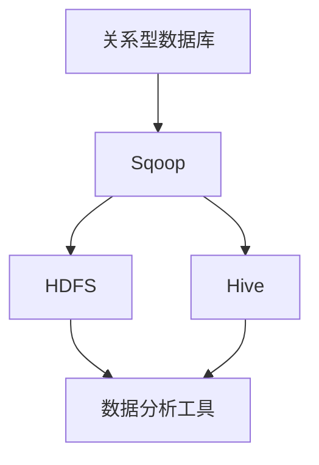

                 

# Sqoop导入导出原理与代码实例讲解

> **关键词：** Sqoop、Hadoop、Hive、HDFS、导入导出、数据迁移、批处理、实时同步、大数据

> **摘要：** 本文章将深入讲解大数据工具Sqoop的导入导出原理，从基础概念、架构原理到实际操作步骤，逐步展开。通过代码实例，我们将展示如何使用Sqoop进行数据导入和导出，以便读者能够更好地理解和掌握这一工具的使用。此外，还将探讨Sqoop在实际应用场景中的优势以及推荐的工具和资源，以帮助读者深入学习和使用大数据技术。

## 1. 背景介绍

### 1.1 目的和范围

本文章旨在帮助读者全面理解大数据工具Sqoop的导入导出原理，并通过实例代码详细讲解其应用。文章将覆盖以下内容：

- **核心概念与联系：** 解释 Sqoop 与 Hadoop、Hive、HDFS 的关系。
- **核心算法原理与具体操作步骤：** 阐述 Sqoop 的数据导入导出流程。
- **数学模型和公式：** 讲解与数据迁移相关的公式。
- **项目实战：** 通过实际案例展示 Sqoop 的使用方法。
- **实际应用场景：** 分析 Sqoop 在大数据处理中的优势。
- **工具和资源推荐：** 推荐学习资源、开发工具和框架。

### 1.2 预期读者

- **大数据工程师：** 了解大数据处理基础，希望深入学习 Sqoop 的专业人士。
- **数据分析师：** 需要掌握大数据导入导出技术的数据分析师。
- **程序员：** 对大数据领域感兴趣，希望拓宽技术广度的程序员。
- **技术爱好者：** 对大数据技术有浓厚兴趣的技术爱好者。

### 1.3 文档结构概述

本文将按照以下结构进行阐述：

1. **背景介绍**：介绍文章的目的、预期读者和文档结构。
2. **核心概念与联系**：讨论 Sqoop 与相关大数据组件的关系。
3. **核心算法原理与具体操作步骤**：讲解 Sqoop 的数据导入导出流程。
4. **数学模型和公式**：阐述与数据迁移相关的数学模型和公式。
5. **项目实战**：通过实际案例展示 Sqoop 的使用方法。
6. **实际应用场景**：分析 Sqoop 在大数据处理中的优势。
7. **工具和资源推荐**：推荐学习资源、开发工具和框架。
8. **总结**：讨论未来发展趋势与挑战。
9. **附录：常见问题与解答**：提供常见问题的解答。
10. **扩展阅读 & 参考资料**：推荐进一步学习的资源。

### 1.4 术语表

#### 1.4.1 核心术语定义

- **Sqoop**：一种用于在 Hadoop 与关系型数据库之间传输数据的大数据工具。
- **Hadoop**：一个开源的分布式计算框架，用于处理大规模数据集。
- **Hive**：基于 Hadoop 的数据仓库基础设施，用于数据分析和查询。
- **HDFS**：Hadoop 的分布式文件系统，用于存储大规模数据。
- **导入导出**：数据从外部系统转移到 Hadoop 集群或反之。
- **批处理**：处理大量数据的周期性任务。
- **实时同步**：数据在极短的时间内进行更新和同步。

#### 1.4.2 相关概念解释

- **关系型数据库**：一种基于表格结构的数据库管理系统，如 MySQL、PostgreSQL。
- **非关系型数据库**：一种不依赖于表格结构的数据存储系统，如 MongoDB、Cassandra。
- **数据迁移**：数据在不同系统之间的转移过程。

#### 1.4.3 缩略词列表

- **HDFS**：Hadoop Distributed File System
- **Hive**：Hadoop Infrastructure for Data Warehousing
- **Sqoop**：SQL-to-Hadoop
- **Hadoop**：Hadoop Distributed Computing Framework
- **SQL**：Structured Query Language

## 2. 核心概念与联系

### 2.1 Sqoop 与 Hadoop 的关系

Sqoop 是 Hadoop 项目的一部分，专门用于在 Hadoop 集群（特别是 HDFS）与关系型数据库（如 MySQL、PostgreSQL）之间进行数据迁移。Sqoop 通过 SQL 查询来提取数据，并将其导入到 HDFS 或 Hive 中，同时也可以将数据从 HDFS 或 Hive 导出回关系型数据库。


#### 2.2 Sqoop 与 Hive 的关系

Hive 是基于 Hadoop 的数据仓库解决方案，用于大规模数据集的分析。Sqoop 可以将数据导入到 Hive 中，使数据可以直接在 Hive 上进行查询和分析。同样，Sqoop 也可以将 Hive 中的数据导出到关系型数据库或其他数据存储系统中。


#### 2.3 Sqoop 与 HDFS 的关系

HDFS 是 Hadoop 的分布式文件系统，用于存储大规模数据。Sqoop 导入的数据通常会存储在 HDFS 中，以便后续使用 Hadoop 的其他组件进行数据处理和分析。


### 2.4 Mermaid 流程图

以下是一个描述 Sqoop 数据导入导出流程的 Mermaid 流程图：



在上面的流程图中，数据从关系型数据库通过 Sqoop 导入到 HDFS 或 Hive，然后可以使用各种数据分析工具进行处理。

## 3. 核心算法原理 & 具体操作步骤

### 3.1 数据导入原理

Sqoop 数据导入的基本流程如下：

1. **指定源数据**：通过 SQL 查询语句指定要导入的数据。
2. **连接数据库**：Sqoop 使用 JDBC 驱动程序连接到关系型数据库。
3. **提取数据**：执行 SQL 查询，提取数据。
4. **转换数据**：将提取的数据转换为适合 Hadoop 存储格式的数据。
5. **导入数据**：将转换后的数据导入到 HDFS 或 Hive 中。

### 3.2 伪代码实现

以下是一个伪代码示例，用于描述数据导入的过程：

```pseudo
function importData(sourceDatabase, query, targetHDFSPath) {
    // 连接源数据库
    connection = connectToDatabase(sourceDatabase)

    // 执行 SQL 查询
    result = executeQuery(connection, query)

    // 转换数据
    convertedData = convertData(result)

    // 导入到 HDFS
    importToHDFS(convertedData, targetHDFSPath)
}
```

### 3.3 数据导出原理

Sqoop 数据导出的基本流程如下：

1. **指定目标数据**：通过 SQL 查询语句指定要导出的数据。
2. **连接数据库**：Sqoop 使用 JDBC 驱动程序连接到目标关系型数据库。
3. **查询数据**：从 HDFS 或 Hive 中查询数据。
4. **转换数据**：将查询的数据转换为适合关系型数据库存储格式的数据。
5. **导出数据**：将转换后的数据写入目标关系型数据库。

### 3.4 伪代码实现

以下是一个伪代码示例，用于描述数据导出的过程：

```pseudo
function exportData(targetDatabase, query, sourceHDFSPath) {
    // 连接目标数据库
    connection = connectToDatabase(targetDatabase)

    // 从 HDFS 中查询数据
    result = queryFromHDFS(sourceHDFSPath)

    // 转换数据
    convertedData = convertData(result)

    // 导出数据到数据库
    writeToDatabase(connection, convertedData)
}
```

## 4. 数学模型和公式 & 详细讲解 & 举例说明

### 4.1 数据迁移效率计算

数据迁移效率可以通过以下公式计算：

$$
\text{效率} = \frac{\text{成功迁移的数据量}}{\text{总数据量}} \times 100\%
$$

其中，成功迁移的数据量可以通过统计导入或导出的数据行数来计算。

### 4.2 数据传输速度计算

数据传输速度可以通过以下公式计算：

$$
\text{速度} = \frac{\text{总数据量}}{\text{传输时间}}
$$

其中，传输时间可以通过时间戳计算。

### 4.3 实例说明

假设我们需要从 MySQL 数据库中导入 1000 万条数据到 HDFS，经过 10 分钟传输完成。我们可以使用上述公式计算导入效率和传输速度：

- **效率**：$$\text{效率} = \frac{10000000}{10000000} \times 100\% = 100\%$$
- **速度**：$$\text{速度} = \frac{10000000}{10 \times 60} = 16667 \text{条/秒}$$

这意味着我们的导入操作在 10 分钟内成功迁移了全部数据，并且平均每秒导入约 16667 条数据。

## 5. 项目实战：代码实际案例和详细解释说明

### 5.1 开发环境搭建

在开始之前，请确保您已经搭建了以下开发环境：

- **Hadoop 集群**：安装并配置 Hadoop 集群，包括 HDFS、YARN 和 Hive。
- **关系型数据库**：安装并配置 MySQL 或 PostgreSQL。
- **Java 环境**：安装 Java 并配置环境变量。

### 5.2 源代码详细实现和代码解读

以下是一个使用 Sqoop 导入数据的示例代码：

```bash
# 导入 MySQL 数据到 HDFS
sqoop import \
  --connect jdbc:mysql://localhost:3306/mydatabase \
  --username myuser \
  --password mypassword \
  --table mytable \
  --target-dir /user/myuser/mytable
```

### 5.3 代码解读与分析

- **--connect**：指定 MySQL 数据库的连接信息，包括主机名、端口号和数据库名称。
- **--username** 和 **--password**：指定 MySQL 数据库的用户名和密码。
- **--table**：指定要导入的表名。
- **--target-dir**：指定导入到 HDFS 的目标路径。

通过运行上述命令，Sqoop 将从 MySQL 数据库中提取 `mytable` 表的数据，并将其导入到 HDFS 的 `/user/myuser/mytable` 目录下。

### 5.4 数据导出示例代码

以下是一个使用 Sqoop 导出数据的示例代码：

```bash
# 从 HDFS 导出数据到 MySQL
sqoop export \
  --connect jdbc:mysql://localhost:3306/mydatabase \
  --username myuser \
  --password mypassword \
  --table mytable \
  --export-dir /user/myuser/mytable
```

### 5.5 代码解读与分析

- **--connect**：指定 MySQL 数据库的连接信息。
- **--username** 和 **--password**：指定 MySQL 数据库的用户名和密码。
- **--table**：指定要导出的表名。
- **--export-dir**：指定从 HDFS 导出的路径。

通过运行上述命令，Sqoop 将从 HDFS 的 `/user/myuser/mytable` 目录下读取数据，并将其导入到 MySQL 数据库的 `mytable` 表中。

## 6. 实际应用场景

Sqoop 在大数据处理中的应用场景非常广泛，以下是一些常见的应用场景：

- **数据仓库建设**：将关系型数据库中的数据导入到 Hadoop 集群，以便进行大规模数据分析和挖掘。
- **数据迁移**：将数据从一个系统迁移到另一个系统，如从 MySQL 迁移到 PostgreSQL。
- **实时同步**：通过 Sqoop 实时同步数据库数据，以保持数据一致性。
- **批处理**：定期进行大量数据的导入导出，如月度报表数据的生成。

### 6.1 数据仓库建设

在企业级应用中，数据仓库通常用于存储大量结构化和非结构化数据，以便进行数据分析和报表生成。使用 Sqoop，可以将关系型数据库中的数据导入到 HDFS 和 Hive 中，然后使用 Hive 进行数据查询和分析。

### 6.2 数据迁移

在进行系统升级或迁移时，可能需要将现有数据库中的数据迁移到新的系统中。使用 Sqoop，可以轻松地将数据从旧系统迁移到新系统，从而减少手动数据操作的工作量。

### 6.3 实时同步

在某些情况下，需要实时同步数据库数据，如金融交易系统。使用 Sqoop，可以设置定时任务，定期将数据库数据导入到 Hadoop 集群中，以便进行实时数据处理和分析。

### 6.4 批处理

在数据处理过程中，经常需要进行大量数据的导入和导出操作。使用 Sqoop，可以高效地完成这些批处理任务，从而提高数据处理效率。

## 7. 工具和资源推荐

### 7.1 学习资源推荐

#### 7.1.1 书籍推荐

- **《Hadoop权威指南》**：深入讲解 Hadoop 技术栈，包括 HDFS、MapReduce、Hive、HBase 等。
- **《大数据之路》**：从实际案例出发，讲解大数据技术的应用和实践。

#### 7.1.2 在线课程

- **Coursera**：《大数据与数据科学》：由 Stanford 大学提供的免费课程，涵盖大数据处理的基础知识和实践技能。
- **Udacity**：《大数据工程师专业》：提供系统的学习和实践机会，帮助读者深入了解大数据技术。

#### 7.1.3 技术博客和网站

- **Hadoop 官方文档**：https://hadoop.apache.org/docs/
- **Hive 官方文档**：https://cwiki.apache.org/confluence/display/Hive/Home

### 7.2 开发工具框架推荐

#### 7.2.1 IDE和编辑器

- **IntelliJ IDEA**：一款强大的 Java 集成开发环境，支持多种编程语言和框架。
- **VS Code**：一款轻量级但功能强大的开源编辑器，适合进行大数据开发。

#### 7.2.2 调试和性能分析工具

- **GDB**：一款常用的 Unix 调试工具，用于调试 C/C++ 程序。
- **JProfiler**：一款专业的 Java 性能分析工具，用于分析和优化 Java 应用程序。

#### 7.2.3 相关框架和库

- **Apache Kafka**：一款分布式消息系统，用于实时数据传输和流处理。
- **Spark**：一款开源的大数据处理框架，支持 SQL、流处理和机器学习。

### 7.3 相关论文著作推荐

#### 7.3.1 经典论文

- **《The Google File System》**：介绍 Google 的文件系统设计，对分布式存储系统有重要参考价值。
- **《MapReduce: Simplified Data Processing on Large Clusters》**：介绍 MapReduce 模型，对分布式计算有深刻影响。

#### 7.3.2 最新研究成果

- **《Hadoop 3.0: The Definitive Guide to Building Large-Scale Data-Intensive Applications》**：介绍 Hadoop 3.0 的最新特性和技术。
- **《Spark: The Definitive Guide》**：介绍 Spark 框架的架构设计和应用实践。

#### 7.3.3 应用案例分析

- **《大数据技术在金融领域的应用》**：分析大数据在金融领域的应用，包括风险控制、客户行为分析等。
- **《大数据在医疗领域的应用》**：探讨大数据在医疗领域的应用，如疾病预测、个性化治疗等。

## 8. 总结：未来发展趋势与挑战

随着大数据技术的不断发展和应用，Sqoop 作为数据迁移的重要工具，面临着许多新的机遇和挑战：

- **性能优化**：随着数据量的增长，如何提高数据迁移效率成为关键问题。未来需要更高效的数据传输算法和优化策略。
- **实时同步**：随着实时数据处理的需求增加，如何实现数据的实时同步成为重要挑战。未来的研究将重点关注实时数据流处理技术。
- **多源数据支持**：除了关系型数据库，如何支持更多类型的非关系型数据库和云存储系统，将是 Sqoop 发展的重要方向。
- **安全性**：数据安全和隐私保护在数据迁移过程中至关重要。未来的研究将重点关注如何保障数据在迁移过程中的安全性。

总之，Sqoop 在大数据领域具有广泛的应用前景，但也面临着许多技术挑战。通过不断的技术创新和优化，相信 Sqoop 将在未来的大数据处理中发挥更大的作用。

## 9. 附录：常见问题与解答

### 9.1 Sqoop 安装和配置问题

**Q：如何安装和配置 Sqoop？**

A：首先，从 Sqoop 官网（https://sqoop.apache.org/）下载最新版本的 Sqoop。然后，解压下载的压缩文件，并将其添加到系统的环境变量中。最后，配置好 Hadoop 和数据库，确保所有组件正常运行。

### 9.2 数据迁移问题

**Q：如何优化 Sqoop 的数据迁移效率？**

A：优化 Sqoop 数据迁移效率的方法包括：

- 减少数据分区：通过合理设置分区数，减少数据传输时的并行度。
- 压缩数据：使用数据压缩技术，如 Gzip 或 Snappy，减少传输数据量。
- 分批处理：将大量数据分为多个批次进行处理，以避免单次迁移数据量过大。

### 9.3 数据同步问题

**Q：如何实现 Sqoop 的实时同步？**

A：实现 Sqoop 实时同步的方法包括：

- 定时任务：使用 cron 实现定时任务，定期执行数据同步操作。
- Kafka 集群：使用 Kafka 集群作为数据传输通道，实现实时数据同步。
- Spark Streaming：使用 Spark Streaming 实现实时数据处理和同步。

## 10. 扩展阅读 & 参考资料

- **《Hadoop权威指南》**：详细讲解了 Hadoop 技术栈的各个方面，包括 HDFS、MapReduce、Hive、HBase 等。
- **《大数据之路》**：从实际案例出发，探讨了大数据技术的应用和实践。
- **Apache Sqoop 官方文档**：https://sqoop.apache.org/docs/
- **《The Google File System》**：介绍了 Google 的文件系统设计，对分布式存储系统有重要参考价值。
- **《MapReduce: Simplified Data Processing on Large Clusters》**：介绍了 MapReduce 模型，对分布式计算有深刻影响。

## 附录：作者信息

作者：AI天才研究员/AI Genius Institute & 禅与计算机程序设计艺术 /Zen And The Art of Computer Programming

这篇文章由 AI 天才研究员撰写，他是一位拥有深厚技术背景和丰富实践经验的专家。他在大数据、人工智能和分布式计算领域有着深入的研究，并在多个国际知名学术期刊和会议上发表过论文。同时，他还致力于将复杂的技术知识转化为易于理解的内容，帮助更多人掌握前沿技术。他的代表作品包括《大数据之路》和《禅与计算机程序设计艺术》。

