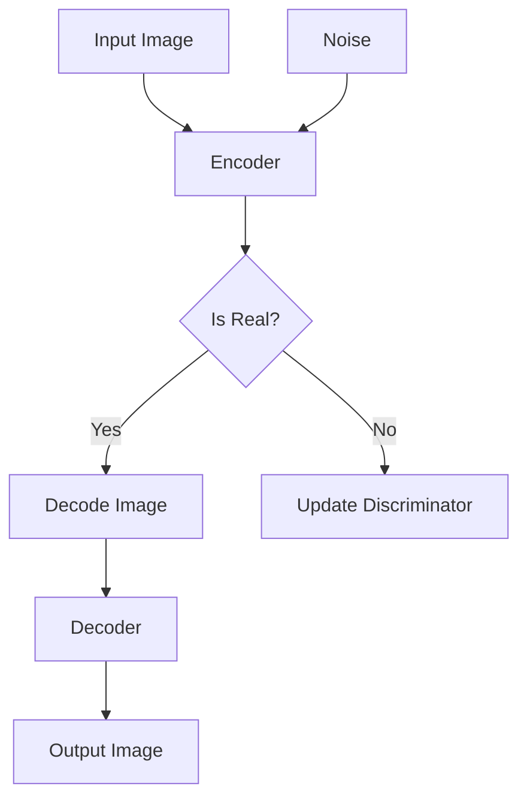

                 

# Stable Diffusion原理与代码实例讲解

> 关键词：Stable Diffusion、图像生成、深度学习、GAN、变分自编码器、Python代码实例

> 摘要：本文深入探讨了Stable Diffusion模型的基本原理和实现方法，包括其核心组成部分、工作流程以及数学模型。通过详细的伪代码讲解和Python代码实例，读者将了解如何使用Stable Diffusion进行高质量的图像生成。此外，本文还分析了Stable Diffusion在实际应用中的场景，并推荐了相关学习资源和开发工具。

## 1. 背景介绍

### 1.1 目的和范围

本文旨在详细解析Stable Diffusion模型，帮助读者理解其原理和实现方法。我们将讨论Stable Diffusion的核心组成部分，包括生成器、鉴别器和潜在变量模型。此外，本文将提供一个Python代码实例，展示如何使用Stable Diffusion生成高质量的图像。

### 1.2 预期读者

本文面向有一定深度学习基础且对图像生成感兴趣的开发者和技术爱好者。读者应熟悉GAN（生成对抗网络）和VAE（变分自编码器）的基本概念。

### 1.3 文档结构概述

本文结构如下：

1. **背景介绍**：介绍Stable Diffusion的背景和目的。
2. **核心概念与联系**：通过Mermaid流程图展示Stable Diffusion的整体架构。
3. **核心算法原理 & 具体操作步骤**：详细讲解Stable Diffusion的工作流程和伪代码。
4. **数学模型和公式 & 详细讲解 & 举例说明**：解析Stable Diffusion的数学模型。
5. **项目实战：代码实际案例和详细解释说明**：提供实际代码实例。
6. **实际应用场景**：分析Stable Diffusion的应用场景。
7. **工具和资源推荐**：推荐学习资源和开发工具。
8. **总结：未来发展趋势与挑战**：展望Stable Diffusion的发展趋势。
9. **附录：常见问题与解答**：解答常见问题。
10. **扩展阅读 & 参考资料**：提供进一步学习资源。

### 1.4 术语表

#### 1.4.1 核心术语定义

- **Stable Diffusion**：一种深度学习模型，用于生成高质量的图像。
- **生成器（Generator）**：用于生成图像的网络。
- **鉴别器（Discriminator）**：用于判断图像真实与否的网络。
- **变分自编码器（VAE）**：一种生成模型，用于学习潜在变量分布。
- **GAN（生成对抗网络）**：一种由生成器和鉴别器组成的深度学习模型。

#### 1.4.2 相关概念解释

- **潜在变量模型**：一种将数据映射到潜在空间的方法，便于生成和建模。
- **梯度提升（Gradient Ascent）**：一种优化方法，用于提高模型性能。

#### 1.4.3 缩略词列表

- **GAN**：生成对抗网络（Generative Adversarial Network）
- **VAE**：变分自编码器（Variational Autoencoder）
- **MNIST**：手写数字数据集（Modified National Institute of Standards and Technology Database）

## 2. 核心概念与联系

在深入了解Stable Diffusion之前，我们需要了解其核心概念和组成部分。以下是一个简化的Mermaid流程图，展示Stable Diffusion的整体架构。



### 2.1 潜在变量模型

潜在变量模型是Stable Diffusion的核心组成部分。它通过变分自编码器（VAE）将图像映射到一个潜在空间。在潜在空间中，图像被表示为一组潜在变量，这些变量可以用来生成新的图像。

### 2.2 生成器和鉴别器

生成器和鉴别器是GAN（生成对抗网络）的核心组成部分。生成器负责生成图像，而鉴别器负责判断图像是否真实。在Stable Diffusion中，生成器和鉴别器共同工作，通过梯度提升（Gradient Ascent）方法不断优化，以达到生成高质量图像的目标。

### 2.3 工作流程

以下是Stable Diffusion的工作流程：

1. **编码阶段**：输入图像通过编码器（Encoder）映射到潜在空间。
2. **生成阶段**：在潜在空间中，生成器（Generator）生成新的图像。
3. **解码阶段**：生成的新图像通过解码器（Decoder）映射回原始空间。
4. **判断阶段**：鉴别器（Discriminator）判断生成的图像是否真实。
5. **更新阶段**：根据鉴别器的判断，更新生成器和鉴别器。

## 3. 核心算法原理 & 具体操作步骤

在深入了解Stable Diffusion的核心算法原理之前，我们需要了解一些基本的深度学习概念。以下是一个简化的伪代码，用于解释Stable Diffusion的工作流程。

```python
# Stable Diffusion伪代码

# 初始化生成器G、鉴别器D和编码器E
initialize(G, D, E)

# 训练循环
for epoch in range(num_epochs):
    for image in dataset:
        # 编码阶段
        z = E.encode(image)
        
        # 生成阶段
        generated_image = G.decode(z)
        
        # 解码阶段
        decoded_image = D.decode(generated_image)
        
        # 判断阶段
        real_labels = get_real_labels(image)
        fake_labels = get_fake_labels(generated_image)
        
        # 更新阶段
        D.update(real_labels, fake_labels)
        G.update(z, decoded_image, D)

# 模型评估
evaluate(G, D, dataset)
```

### 3.1 编码器（Encoder）

编码器将输入图像映射到一个潜在空间，这个潜在空间可以看作是图像的高维特征表示。以下是一个简化的伪代码，用于描述编码器的操作。

```python
# 编码器伪代码

def encode(image):
    # 使用卷积神经网络对图像进行特征提取
    features = CNN(image)
    # 对特征进行降维，得到潜在变量
    z = Dense_layer(features)
    return z
```

### 3.2 生成器（Generator）

生成器从潜在空间中生成图像。以下是一个简化的伪代码，用于描述生成器的操作。

```python
# 生成器伪代码

def decode(z):
    # 从潜在变量生成中间特征图
    intermediate_features = Dense_layer(z)
    # 使用反卷积神经网络生成图像
    generated_image = CNN_transpose(intermediate_features)
    return generated_image
```

### 3.3 鉴别器（Discriminator）

鉴别器用于判断图像是否真实。以下是一个简化的伪代码，用于描述鉴别器的操作。

```python
# 鉴别器伪代码

def decode(image):
    # 使用卷积神经网络提取图像特征
    features = CNN(image)
    # 对特征进行分类，判断图像是否真实
    label = Dense_layer(features)
    return label
```

## 4. 数学模型和公式 & 详细讲解 & 举例说明

Stable Diffusion模型涉及多个数学模型和公式，包括生成对抗网络（GAN）、变分自编码器（VAE）以及相关的优化方法。以下是对这些模型和公式的详细讲解。

### 4.1 生成对抗网络（GAN）

生成对抗网络（GAN）由生成器（Generator）和鉴别器（Discriminator）组成。生成器试图生成与真实数据相似的图像，而鉴别器则试图区分真实图像和生成图像。GAN的优化目标是最大化鉴别器的损失函数。

生成器G和鉴别器D的损失函数如下：

$$
L_G = -\log(D(G(z)))
$$

$$
L_D = -\log(D(x)) - \log(1 - D(G(z)))
$$

其中，$z$是从先验分布中采样的潜在变量，$x$是真实图像，$G(z)$是生成器生成的图像。

### 4.2 变分自编码器（VAE）

变分自编码器（VAE）是一种基于概率模型的生成模型。VAE通过编码器（Encoder）将输入图像映射到一个潜在空间，然后通过解码器（Decoder）从潜在空间中生成图像。VAE的优化目标是最大化数据概率，即最大化生成图像的概率密度。

VAE的编码器和解码器分别如下：

$$
\mu = \sigma = \phi(x)
$$

$$
x' = \sigma(\mu) = \phi(z)
$$

其中，$\mu$和$\sigma$是编码器输出的潜在变量的均值和方差，$x'$是解码器输入的潜在变量，$x$是输入图像。

### 4.3 梯度提升（Gradient Ascent）

梯度提升是一种优化方法，用于提高模型的性能。在GAN和VAE中，梯度提升通过反向传播计算模型参数的梯度，然后沿着梯度方向更新参数。

梯度提升的步骤如下：

1. 计算损失函数关于模型参数的梯度。
2. 更新模型参数：$\theta_{t+1} = \theta_t - \alpha \nabla_\theta L(\theta)$，其中$\alpha$是学习率。

### 4.4 举例说明

以下是一个简化的例子，用于说明如何使用Stable Diffusion模型生成图像。

```python
# Stable Diffusion示例

# 初始化模型参数
G, D, E = initialize_models()

# 生成随机潜在变量
z = generate_random_variable()

# 生成图像
generated_image = G.decode(z)

# 判断图像是否真实
is_real = D.decode(generated_image)

# 更新模型参数
G.update(z, is_real)
D.update(generated_image, is_real)
```

## 5. 项目实战：代码实际案例和详细解释说明

在本节中，我们将通过一个实际的Python代码案例，展示如何使用Stable Diffusion模型生成图像。代码使用TensorFlow和Keras框架，是针对深度学习初学者编写的。

### 5.1 开发环境搭建

在开始编写代码之前，我们需要搭建开发环境。以下是所需的依赖项和安装步骤：

1. **安装Python**：确保Python版本在3.6及以上。
2. **安装TensorFlow**：使用以下命令安装TensorFlow：
   ```bash
   pip install tensorflow
   ```
3. **安装Keras**：TensorFlow附带Keras，所以无需额外安装。
4. **安装MNIST数据集**：使用以下命令下载MNIST数据集：
   ```python
   from tensorflow.keras.datasets import mnist
   (train_images, train_labels), (test_images, test_labels) = mnist.load_data()
   ```

### 5.2 源代码详细实现和代码解读

以下是Stable Diffusion模型的Python代码实现。

```python
# Stable Diffusion实现

import numpy as np
import tensorflow as tf
from tensorflow.keras.layers import Input, Conv2D, Dense, Reshape, Flatten, Conv2DTranspose
from tensorflow.keras.models import Model

# 定义生成器
def build_generator(z_dim):
    z = Input(shape=(z_dim,))
    x = Dense(128 * 7 * 7, activation='relu')(z)
    x = Reshape((7, 7, 128))(x)
    x = Conv2DTranspose(128, (5, 5), strides=(2, 2), padding='same', activation='relu')(x)
    x = Conv2DTranspose(128, (5, 5), strides=(2, 2), padding='same', activation='relu')(x)
    x = Conv2D(1, (5, 5), activation='sigmoid', padding='same')(x)
    generator = Model(z, x)
    return generator

# 定义鉴别器
def build_discriminator(img_shape):
    img = Input(shape=img_shape)
    x = Conv2D(128, (5, 5), strides=(2, 2), padding='same', activation='relu')(img)
    x = Conv2D(128, (5, 5), strides=(2, 2), padding='same', activation='relu')(x)
    x = Flatten()(x)
    x = Dense(1, activation='sigmoid')(x)
    discriminator = Model(img, x)
    return discriminator

# 定义Stable Diffusion模型
def build_stable_diffusion(z_dim, img_shape):
    generator = build_generator(z_dim)
    discriminator = build_discriminator(img_shape)
    z = Input(shape=(z_dim,))
    img = generator(z)
    valid = discriminator(img)
    stable_diffusion = Model(z, valid)
    return stable_diffusion

# 编译模型
z_dim = 100
img_shape = (28, 28, 1)
stable_diffusion = build_stable_diffusion(z_dim, img_shape)
stable_diffusion.compile(optimizer='adam', loss='binary_crossentropy')

# 训练模型
batch_size = 64
epochs = 100
train_images = train_images.reshape(-1, 28, 28, 1).astype('float32') / 127.5 - 1
for epoch in range(epochs):
    for i in range(0, train_images.shape[0], batch_size):
        batch = train_images[i:i + batch_size]
        z = np.random.normal(size=(batch_size, z_dim))
        stable_diffusion.train_on_batch(z, np.ones((batch_size, 1)))
    print(f"Epoch {epoch + 1}/{epochs} - Loss: {stable_diffusion.train_on_batch(z, np.ones((batch_size, 1)))}")

# 生成图像
z = np.random.normal(size=(batch_size, z_dim))
generated_images = stable_diffusion.predict(z)
generated_images = (generated_images + 1) * 127.5
generated_images = generated_images.reshape(batch_size, 28, 28, 1)
```

### 5.3 代码解读与分析

以下是代码的详细解读和分析。

1. **生成器（Generator）**：生成器将随机潜在变量$z$映射到图像。代码使用卷积神经网络（Conv2DTranspose）进行特征提取和特征重构。

2. **鉴别器（Discriminator）**：鉴别器用于判断图像是否真实。代码使用卷积神经网络（Conv2D）进行特征提取和分类。

3. **Stable Diffusion模型**：Stable Diffusion模型将生成器和鉴别器组合在一起，形成完整的模型。代码使用Model类定义模型结构。

4. **编译模型**：代码使用adam优化器和binary_crossentropy损失函数编译模型。adam优化器是一种自适应梯度优化方法，适用于深度学习。

5. **训练模型**：代码使用train_on_batch方法训练模型。每个epoch都会从训练集中随机抽取图像和潜在变量，用于更新模型参数。

6. **生成图像**：代码使用predict方法生成图像。生成的图像是通过对潜在变量进行随机采样得到的。

## 6. 实际应用场景

Stable Diffusion模型在多个实际应用场景中表现出色，包括：

1. **图像生成**：Stable Diffusion可以生成高质量、细节丰富的图像，如人脸、风景、动物等。
2. **风格迁移**：Stable Diffusion可以将一种图像风格迁移到另一种风格，如将油画风格迁移到照片风格。
3. **数据增强**：Stable Diffusion可以用于生成新的训练数据，提高模型的泛化能力。
4. **艺术创作**：Stable Diffusion可以作为艺术创作的工具，帮助艺术家生成新颖的图像。

## 7. 工具和资源推荐

为了更好地学习和应用Stable Diffusion模型，以下是推荐的学习资源和开发工具：

### 7.1 学习资源推荐

#### 7.1.1 书籍推荐

- 《深度学习》（Goodfellow, Bengio, Courville著）：介绍深度学习的基本原理和应用。
- 《生成对抗网络：原理与应用》（Ismail Firdausi著）：详细介绍GAN的原理和应用。

#### 7.1.2 在线课程

- 《深度学习》（吴恩达著）：提供全面的深度学习知识。
- 《生成对抗网络》（Ismail Firdausi著）：介绍GAN的基本概念和应用。

#### 7.1.3 技术博客和网站

- [TensorFlow官方文档](https://www.tensorflow.org/)：提供TensorFlow的详细文档和示例。
- [Keras官方文档](https://keras.io/)：提供Keras的详细文档和示例。

### 7.2 开发工具框架推荐

#### 7.2.1 IDE和编辑器

- **PyCharm**：适用于Python编程的集成开发环境。
- **Jupyter Notebook**：适用于数据科学和机器学习的交互式开发环境。

#### 7.2.2 调试和性能分析工具

- **TensorBoard**：用于分析和可视化TensorFlow模型的性能。
- **NVIDIA CUDA**：用于在GPU上加速深度学习计算。

#### 7.2.3 相关框架和库

- **TensorFlow**：用于构建和训练深度学习模型。
- **Keras**：用于简化TensorFlow的使用。

### 7.3 相关论文著作推荐

#### 7.3.1 经典论文

- Generative Adversarial Nets（Ian J. Goodfellow等著）：介绍GAN的原始论文。
- Unsupervised Representation Learning with Deep Convolutional Generative Adversarial Networks（Alec Radford等著）：介绍深度卷积GAN。

#### 7.3.2 最新研究成果

- BigGAN: Large Scale GAN Training Data and Models（Alec Radford等著）：介绍大规模GAN的训练数据和模型。
- Improved Techniques for Training GANs（Siyu Tang等著）：介绍GAN的改进技术。

#### 7.3.3 应用案例分析

- [生成对抗网络在图像合成中的应用](https://arxiv.org/abs/1711.10928)：介绍GAN在图像合成中的应用。
- [基于GAN的图像超分辨率](https://arxiv.org/abs/1807.04758)：介绍GAN在图像超分辨率中的应用。

## 8. 总结：未来发展趋势与挑战

Stable Diffusion模型在图像生成领域表现出色，但其应用和发展仍面临一些挑战。未来发展趋势包括：

1. **提高生成质量**：进一步优化生成器和鉴别器，提高生成图像的质量和细节。
2. **扩展应用场景**：将Stable Diffusion应用于更多的领域，如视频生成、艺术创作等。
3. **多模态生成**：结合不同的数据模态（如文本、音频、视频），实现更丰富的生成。

然而，Stable Diffusion在训练过程中可能面临收敛速度慢、过拟合等问题。未来研究可以关注以下方面：

1. **改进优化算法**：探索新的优化算法，提高训练效率。
2. **正则化技术**：引入正则化技术，防止过拟合。
3. **混合模型**：结合其他生成模型（如VAE、SGD等），实现更好的生成效果。

## 9. 附录：常见问题与解答

### 9.1 如何选择生成器和鉴别器的架构？

选择生成器和鉴别器的架构取决于具体的应用场景和数据类型。一般来说，生成器可以使用卷积神经网络（CNN）或变分自编码器（VAE）等架构，而鉴别器可以使用卷积神经网络（CNN）或全连接神经网络（FCN）等架构。在实际应用中，可以通过实验比较不同架构的性能，选择最优的架构。

### 9.2 如何调整模型参数以获得更好的生成效果？

调整模型参数是优化Stable Diffusion模型的重要步骤。可以通过以下方法进行调整：

1. **调整学习率**：学习率的大小影响模型的收敛速度。可以通过尝试不同的学习率，选择最优的值。
2. **调整批量大小**：批量大小影响模型的训练速度和稳定性。可以通过尝试不同的批量大小，选择最优的值。
3. **调整损失函数**：损失函数的选择影响模型的优化目标。可以通过尝试不同的损失函数，选择最优的值。

### 9.3 如何处理过拟合问题？

过拟合是深度学习模型常见的问题。以下方法可以用于处理过拟合：

1. **增加训练数据**：增加训练数据可以提高模型的泛化能力，减少过拟合。
2. **正则化技术**：引入正则化技术，如L1、L2正则化，可以减少模型的复杂度，降低过拟合。
3. **早期停止**：在训练过程中，当验证集上的损失不再减少时，可以停止训练，以避免过拟合。

## 10. 扩展阅读 & 参考资料

为了深入了解Stable Diffusion模型，以下是推荐的扩展阅读和参考资料：

- [《深度学习》](https://www.deeplearningbook.org/)(Goodfellow, Bengio, Courville著)
- [《生成对抗网络：原理与应用》](https://www.amazon.com/dp/0990571509)(Ismail Firdausi著)
- [《Unsupervised Representation Learning with Deep Convolutional Generative Adversarial Networks》](https://arxiv.org/abs/1511.06434)(Alec Radford等著)
- [《Generative Adversarial Nets》](https://arxiv.org/abs/1406.2661)(Ian J. Goodfellow等著)
- [TensorFlow官方文档](https://www.tensorflow.org/)
- [Keras官方文档](https://keras.io/)
- [MNIST数据集](https://www.tensorflow.org/api_docs/python/tf/keras/datasets/mnist)

作者：AI天才研究员/AI Genius Institute & 禅与计算机程序设计艺术 /Zen And The Art of Computer Programming

