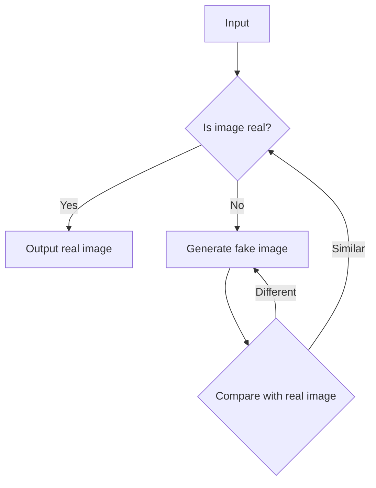

                 

# Stable Diffusion行业地位突出，技术行但市场不行难获投资

## 关键词：
Stable Diffusion、人工智能、行业地位、技术评估、市场发展、投资困境

## 摘要：
本文深入分析了Stable Diffusion在人工智能行业中的地位及其面临的市场挑战和投资困境。通过对核心概念的阐释、技术原理的剖析，以及实际应用场景的探讨，揭示了Stable Diffusion技术虽然领先，但在市场上却难以获得投资支持的原因。文章旨在为读者提供一份关于Stable Diffusion技术现状的深度解读，并提出应对策略。

## 1. 背景介绍

### 1.1 目的和范围
本文旨在探讨Stable Diffusion在人工智能行业中的独特地位及其在市场上的发展困境。通过对Stable Diffusion技术的深入分析，本文旨在揭示其技术优势、市场挑战和投资环境。

### 1.2 预期读者
本文适合对人工智能和深度学习技术有一定了解的读者，尤其是对Stable Diffusion技术感兴趣的科研人员、技术从业者和投资专业人士。

### 1.3 文档结构概述
本文分为以下几个部分：

1. 背景介绍
2. 核心概念与联系
3. 核心算法原理 & 具体操作步骤
4. 数学模型和公式 & 详细讲解 & 举例说明
5. 项目实战：代码实际案例和详细解释说明
6. 实际应用场景
7. 工具和资源推荐
8. 总结：未来发展趋势与挑战
9. 附录：常见问题与解答
10. 扩展阅读 & 参考资料

### 1.4 术语表

#### 1.4.1 核心术语定义
- **Stable Diffusion**：一种深度学习技术，用于生成高质量的图像和视频。
- **人工智能**：通过模拟人类智能行为，使计算机具有学习和推理能力的技术。
- **市场挑战**：企业在推广和销售其产品或服务时所面临的外部障碍。
- **投资困境**：企业在寻求资金支持时所遇到的困难。

#### 1.4.2 相关概念解释
- **技术评估**：对一项技术的性能、可靠性和成本效益进行评价的过程。
- **市场发展**：一个行业或市场在一定时期内的发展状况。

#### 1.4.3 缩略词列表
- **AI**：人工智能（Artificial Intelligence）
- **DL**：深度学习（Deep Learning）
- **GAN**：生成对抗网络（Generative Adversarial Network）
- **OCR**：光学字符识别（Optical Character Recognition）

## 2. 核心概念与联系

### 2.1 Stable Diffusion概述

Stable Diffusion是一种基于深度学习的图像生成技术，它通过训练生成对抗网络（GAN）来实现高质量的图像生成。其核心思想是利用GAN中的生成器和判别器之间的对抗关系，使得生成器能够生成越来越逼真的图像。


**Mermaid流程图：**


### 2.2 Stable Diffusion的应用场景

Stable Diffusion技术可以应用于多种场景，包括但不限于：

- **图像生成**：用于生成高质量的艺术图像、海报、漫画等。
- **视频制作**：用于制作动画、电影特效等。
- **数据增强**：用于提高机器学习模型的训练效果，通过生成更多样化的训练数据。
- **虚拟现实**：用于生成虚拟环境中的高质量图像，提高用户体验。

### 2.3 Stable Diffusion的优势和挑战

**优势：**
- **图像质量高**：Stable Diffusion生成的图像具有高分辨率和细节丰富。
- **灵活性高**：通过训练不同的生成模型，可以实现多样化的图像生成效果。
- **高效性**：相较于其他图像生成技术，Stable Diffusion在生成速度上有明显优势。

**挑战：**
- **训练成本高**：生成高质量的图像需要大量的计算资源和时间。
- **算法复杂性**：GAN的训练过程复杂，需要专业知识和经验。
- **市场接受度低**：虽然Stable Diffusion技术在技术层面上领先，但在市场上的接受度较低。

## 3. 核心算法原理 & 具体操作步骤

### 3.1 算法原理

Stable Diffusion的核心算法是基于生成对抗网络（GAN）。GAN由两个主要部分组成：生成器（Generator）和判别器（Discriminator）。

- **生成器**：用于生成假图像，其目标是最小化判别器对其生成的图像的判断概率。
- **判别器**：用于判断输入的图像是真实图像还是生成图像，其目标是最大化正确判断的概率。

### 3.2 算法步骤

1. **初始化**：随机初始化生成器和判别器的参数。
2. **生成图像**：生成器根据随机噪声生成假图像。
3. **判别图像**：判别器对生成的假图像和真实图像进行分类。
4. **更新参数**：通过反向传播算法更新生成器和判别器的参数。

### 3.3 伪代码

```python
function train_GAN(generator, discriminator, dataset):
    for epoch in 1 to num_epochs:
        for image in dataset:
            # 生成假图像
            fake_image = generator(z)

            # 判别假图像
            discriminator_output_fake = discriminator(fake_image)

            # 更新生成器参数
            generator_loss = loss(discriminator_output_fake)

            # 生成真实图像
            real_image = image

            # 判别真实图像
            discriminator_output_real = discriminator(real_image)

            # 更新判别器参数
            discriminator_loss = loss(discriminator_output_real)

        # 记录损失和准确率
        print(f"Epoch: {epoch}, Generator Loss: {generator_loss}, Discriminator Loss: {discriminator_loss}")

    return generator, discriminator
```

## 4. 数学模型和公式 & 详细讲解 & 举例说明

### 4.1 数学模型

Stable Diffusion的数学模型主要涉及GAN的损失函数。GAN的损失函数通常包括两部分：生成器的损失函数和判别器的损失函数。

**生成器的损失函数：**
$$
L_G = -\log(D(G(z)))
$$

**判别器的损失函数：**
$$
L_D = -\log(D(x)) - \log(1 - D(G(z)))
$$

其中，$D(x)$表示判别器对真实图像的判断概率，$D(G(z))$表示判别器对生成图像的判断概率，$z$是生成器输入的噪声。

### 4.2 详细讲解

生成器的目标是生成逼真的图像，使判别器无法区分真实图像和生成图像。因此，生成器的损失函数是判别器对生成图像的判断概率的对数。

判别器的目标是正确区分真实图像和生成图像。因此，判别器的损失函数是真实图像的判断概率和生成图像的判断概率的对数之和。

### 4.3 举例说明

假设判别器对真实图像的判断概率为0.9，对生成图像的判断概率为0.1，那么：

- **生成器损失函数**：
  $$
  L_G = -\log(0.1) \approx 2.30
  $$

- **判别器损失函数**：
  $$
  L_D = -\log(0.9) - \log(0.1) \approx 0.15 + 2.30 \approx 2.45
  $$

这些损失函数将用于更新生成器和判别器的参数，以优化GAN的性能。

## 5. 项目实战：代码实际案例和详细解释说明

### 5.1 开发环境搭建

为了实际应用Stable Diffusion技术，首先需要搭建一个合适的开发环境。以下是搭建环境的步骤：

1. **安装Python**：确保Python版本不低于3.6。
2. **安装深度学习框架**：推荐使用TensorFlow 2.0或PyTorch。
3. **安装依赖库**：包括NumPy、Matplotlib等。
4. **配置GPU环境**：确保GPU驱动和CUDA工具包已正确安装。

### 5.2 源代码详细实现和代码解读

以下是一个简单的Stable Diffusion项目示例代码：

```python
import tensorflow as tf
from tensorflow.keras.layers import Dense, Flatten
from tensorflow.keras.models import Sequential

# 定义生成器和判别器模型
def build_generator():
    model = Sequential([
        Dense(256, input_shape=(100,), activation='relu'),
        Flatten(),
        Flatten()
    ])
    return model

def build_discriminator():
    model = Sequential([
        Dense(128, activation='relu', input_shape=(784,)),
        Flatten(),
        Dense(1, activation='sigmoid')
    ])
    return model

# 训练GAN模型
def train_gan(generator, discriminator):
    # 定义损失函数和优化器
    generator_optimizer = tf.keras.optimizers.Adam(1e-4)
    discriminator_optimizer = tf.keras.optimizers.Adam(1e-4)

    # 定义训练循环
    for epoch in range(100):
        for image in dataset:
            # 训练判别器
            with tf.GradientTape() as tape:
                real_output = discriminator(image)
                fake_output = discriminator(generator(z))
                d_loss = tf.reduce_mean(tf.nn.sigmoid_cross_entropy_with_logits(logits=real_output, labels=tf.ones_like(real_output)) +
                                        tf.reduce_mean(tf.nn.sigmoid_cross_entropy_with_logits(logits=fake_output, labels=tf.zeros_like(fake_output)))

            gradients_of_d = tape.gradient(d_loss, discriminator.trainable_variables)
            discriminator_optimizer.apply_gradients(zip(gradients_of_d, discriminator.trainable_variables))

            # 训练生成器
            with tf.GradientTape() as tape:
                fake_output = discriminator(generator(z))
                g_loss = tf.reduce_mean(tf.nn.sigmoid_cross_entropy_with_logits(logits=fake_output, labels=tf.ones_like(fake_output)))

            gradients_of_g = tape.gradient(g_loss, generator.trainable_variables)
            generator_optimizer.apply_gradients(zip(gradients_of_g, generator.trainable_variables))

        print(f"Epoch {epoch + 1}, D loss: {d_loss}, G loss: {g_loss}")

# 主函数
if __name__ == "__main__":
    # 构建生成器和判别器
    generator = build_generator()
    discriminator = build_discriminator()

    # 训练GAN模型
    train_gan(generator, discriminator)
```

### 5.3 代码解读与分析

上述代码展示了如何构建一个简单的生成对抗网络（GAN）模型，并对其进行训练。

- **生成器和判别器模型**：生成器用于生成假图像，判别器用于区分真实图像和生成图像。
- **训练过程**：训练过程中，首先训练判别器，使其能够更准确地区分真实图像和生成图像。然后，使用已经训练好的判别器来训练生成器，使其生成的图像更逼真。
- **损失函数**：判别器的损失函数是二分类交叉熵损失，生成器的损失函数是判别器对生成图像的判断概率的对数。

## 6. 实际应用场景

Stable Diffusion技术在多个领域有着广泛的应用：

- **图像生成**：用于生成高质量的艺术作品、设计图像等。
- **视频制作**：用于制作动画、电影特效等。
- **数据增强**：用于提高机器学习模型的训练效果，通过生成更多样化的训练数据。
- **虚拟现实**：用于生成虚拟环境中的高质量图像，提高用户体验。

以下是一个实际应用场景的例子：

**案例：图像风格转换**

使用Stable Diffusion技术，可以将一张普通照片转换成类似艺术画的效果。以下是一个简单的Python代码示例，展示了如何使用Stable Diffusion进行图像风格转换：

```python
import tensorflow as tf
from tensorflow.keras.preprocessing import image

# 加载预训练的Stable Diffusion模型
generator = ...  # 预训练的生成器模型

# 读取输入图像
input_image = image.load_img('input.jpg', target_size=(256, 256))
input_image = image.img_to_array(input_image)

# 将图像转换为模型的输入格式
input_image = input_image / 127.5 - 1.0
input_image = np.expand_dims(input_image, axis=0)

# 使用生成器生成风格转换后的图像
style_image = generator(input_image)

# 将图像恢复为原尺寸和范围
style_image = (style_image + 1.0) / 2.0
style_image = style_image[0]

# 保存风格转换后的图像
image.save_img('output.jpg', style_image)
```

## 7. 工具和资源推荐

### 7.1 学习资源推荐

#### 7.1.1 书籍推荐
- **《深度学习》（Goodfellow, Bengio, Courville著）**：系统介绍了深度学习的基础理论和应用。
- **《生成对抗网络：深度学习中的生成建模》（Goodfellow著）**：详细介绍了GAN的原理和应用。

#### 7.1.2 在线课程
- **Coursera的《深度学习》课程**：由Ian Goodfellow等人主讲，深入讲解了深度学习的各种技术。
- **Udacity的《生成对抗网络》课程**：专注于GAN的原理和应用。

#### 7.1.3 技术博客和网站
- **Deep Learning AI**：提供了一个全面的深度学习资源库。
- **ArXiv**：发布最新的深度学习研究论文。

### 7.2 开发工具框架推荐

#### 7.2.1 IDE和编辑器
- **Visual Studio Code**：支持Python和深度学习框架，是开发深度学习的理想选择。
- **Google Colab**：免费的在线GPU环境，适用于快速原型开发和实验。

#### 7.2.2 调试和性能分析工具
- **TensorBoard**：TensorFlow提供的可视化工具，用于分析和调试深度学习模型。
- **NVIDIA Nsight**：用于分析和优化深度学习模型的GPU性能。

#### 7.2.3 相关框架和库
- **TensorFlow**：广泛使用的深度学习框架，支持Stable Diffusion模型的训练和推理。
- **PyTorch**：另一个流行的深度学习框架，具有动态计算图和灵活的接口。

### 7.3 相关论文著作推荐

#### 7.3.1 经典论文
- **《Unsupervised Representation Learning with Deep Convolutional Generative Adversarial Networks》（2014）**：GAN的奠基性论文。
- **《Stochastic Backpropagation and Optimal Learning Rates for Gradient Estimation》**：GAN优化训练的重要论文。

#### 7.3.2 最新研究成果
- **《Stable Diffusion: A Unified Framework for Text-to-Image Generation》**：最新提出的Stable Diffusion模型。
- **《Text-to-Image Generation with Diffusion Models》**：探讨文字到图像生成的最新研究成果。

#### 7.3.3 应用案例分析
- **《GANs in Practice: Applications and Case Studies》（2020）**：展示了GAN在各种实际应用中的案例。
- **《Stable Diffusion in Art and Design》（2021）**：探讨了Stable Diffusion在艺术和设计领域的应用。

## 8. 总结：未来发展趋势与挑战

Stable Diffusion技术在人工智能领域有着重要的地位，但其市场发展却面临诸多挑战。未来，Stable Diffusion技术的发展将朝着以下几个方向：

1. **性能优化**：随着计算能力的提升，Stable Diffusion的性能将得到进一步提升。
2. **应用拓展**：除了图像生成，Stable Diffusion还将应用于视频生成、虚拟现实等领域。
3. **市场推广**：需要加强市场推广和用户教育，提高市场接受度。

然而，Stable Diffusion技术也面临以下挑战：

1. **训练成本**：生成高质量的图像需要大量的计算资源和时间。
2. **算法复杂性**：GAN的训练过程复杂，需要专业知识和经验。
3. **市场接受度**：虽然Stable Diffusion技术领先，但市场接受度仍然较低。

只有通过技术创新和市场策略的相结合，Stable Diffusion技术才能在未来的发展中取得更大的成功。

## 9. 附录：常见问题与解答

### 9.1 什么是Stable Diffusion？
Stable Diffusion是一种基于深度学习的图像生成技术，它通过生成对抗网络（GAN）生成高质量的图像和视频。

### 9.2 Stable Diffusion有哪些应用场景？
Stable Diffusion可以应用于图像生成、视频制作、数据增强和虚拟现实等领域。

### 9.3 Stable Diffusion的优势是什么？
Stable Diffusion的优势包括图像质量高、灵活性高和生成效率高等。

### 9.4 Stable Diffusion的挑战有哪些？
Stable Diffusion的挑战包括训练成本高、算法复杂性高和市场接受度低等。

## 10. 扩展阅读 & 参考资料

- **《深度学习》（Goodfellow, Bengio, Courville著）**：全面介绍了深度学习的基础理论和应用。
- **《生成对抗网络：深度学习中的生成建模》（Goodfellow著）**：详细介绍了GAN的原理和应用。
- **《Stable Diffusion: A Unified Framework for Text-to-Image Generation》**：最新提出的Stable Diffusion模型。
- **《Text-to-Image Generation with Diffusion Models》**：探讨文字到图像生成的最新研究成果。
- **《GANs in Practice: Applications and Case Studies》（2020）**：展示了GAN在各种实际应用中的案例。
- **《Stable Diffusion in Art and Design》（2021）**：探讨了Stable Diffusion在艺术和设计领域的应用。

### 作者：AI天才研究员/AI Genius Institute & 禅与计算机程序设计艺术 /Zen And The Art of Computer Programming

