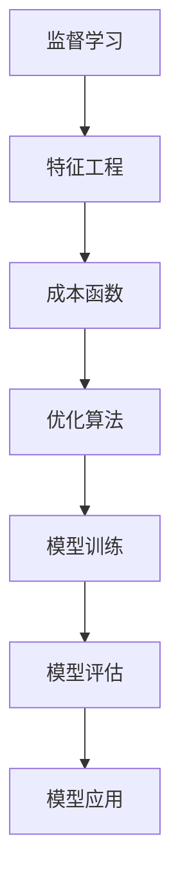

                 

# Supervised Learning

> **关键词：** 监督学习，特征工程，成本函数，优化算法，应用场景

> **摘要：** 本文将详细介绍监督学习的基本概念、核心算法原理、数学模型以及实际应用场景。通过逐步分析推理，我们将深入探讨监督学习中的特征工程、成本函数和优化算法，结合实际代码案例，帮助读者理解和掌握监督学习的核心技术和应用。

## 1. 背景介绍

### 1.1 目的和范围

本文旨在帮助读者全面了解监督学习的基本概念、核心算法原理以及实际应用。我们将从监督学习的定义出发，逐步深入探讨特征工程、成本函数、优化算法等方面，并通过实际代码案例来强化理解。通过本文的学习，读者将能够：

- 掌握监督学习的基本概念和原理。
- 理解特征工程的重要性和方法。
- 熟悉常用的成本函数和优化算法。
- 掌握监督学习的实际应用场景。

### 1.2 预期读者

本文适合以下读者群体：

- 计算机科学和人工智能专业的本科生和研究生。
- 对机器学习和人工智能感兴趣的工程师和技术人员。
- 想要深入了解监督学习理论和技术的研究人员。

### 1.3 文档结构概述

本文分为以下十个部分：

1. 背景介绍
2. 核心概念与联系
3. 核心算法原理 & 具体操作步骤
4. 数学模型和公式 & 详细讲解 & 举例说明
5. 项目实战：代码实际案例和详细解释说明
6. 实际应用场景
7. 工具和资源推荐
8. 总结：未来发展趋势与挑战
9. 附录：常见问题与解答
10. 扩展阅读 & 参考资料

### 1.4 术语表

#### 1.4.1 核心术语定义

- **监督学习（Supervised Learning）**：一种机器学习方法，通过标注好的训练数据来训练模型，以便对未知数据进行预测或分类。
- **特征（Feature）**：数据集中的每一个属性，用于描述数据样本的各个方面。
- **模型（Model）**：根据训练数据学习得到的函数，用于对未知数据进行预测或分类。
- **成本函数（Cost Function）**：衡量模型预测结果与真实值之间差异的函数，用于评估模型的性能。
- **优化算法（Optimization Algorithm）**：用于调整模型参数，以最小化成本函数的算法。

#### 1.4.2 相关概念解释

- **无监督学习（Unsupervised Learning）**：与监督学习相对，通过未标注的数据来训练模型，用于发现数据中的隐藏结构和模式。
- **半监督学习（Semi-supervised Learning）**：结合监督学习和无监督学习的方法，利用少量标注数据和大量未标注数据来训练模型。
- **增强学习（Reinforcement Learning）**：通过与环境的交互来学习策略，以最大化累积奖励。

#### 1.4.3 缩略词列表

- **ML（Machine Learning）**：机器学习
- **DL（Deep Learning）**：深度学习
- **CNN（Convolutional Neural Network）**：卷积神经网络
- **RNN（Recurrent Neural Network）**：循环神经网络

## 2. 核心概念与联系

### 2.1 监督学习基本概念

监督学习是一种通过已有标注数据来训练模型，从而对未知数据进行预测或分类的机器学习方法。在监督学习中，我们通常将数据集划分为训练集和测试集。

- **训练集（Training Set）**：用于训练模型的已有标注数据。
- **测试集（Test Set）**：用于评估模型性能的未知标注数据。

监督学习的目标是通过训练数据学习得到一个函数 f(x)，以便对未知数据进行预测或分类。其中，x 表示输入特征，f(x) 表示预测结果。

### 2.2 特征工程

特征工程是监督学习中的关键环节，旨在从原始数据中提取出对模型预测有重要影响的特征。特征工程包括以下步骤：

1. **数据预处理**：对原始数据进行清洗、归一化、标准化等处理，以便更好地适应模型训练。
2. **特征选择**：从原始数据中筛选出对模型预测有显著影响的特征。
3. **特征提取**：将原始数据转换为新特征，以提高模型性能。
4. **特征组合**：将多个特征进行组合，生成新的特征。

特征工程对于监督学习模型的性能至关重要，合理的特征工程能够显著提高模型性能。

### 2.3 成本函数

成本函数用于衡量模型预测结果与真实值之间的差异，是监督学习中的重要概念。常见的成本函数包括：

1. **均方误差（MSE，Mean Squared Error）**：
   $$MSE = \frac{1}{n}\sum_{i=1}^{n}(y_i - \hat{y}_i)^2$$
   其中，y_i 表示真实值，$\hat{y}_i$ 表示预测值，n 表示样本数量。

2. **交叉熵（Cross-Entropy）**：
   $$CE = -\frac{1}{n}\sum_{i=1}^{n}y_i\log(\hat{y}_i)$$
   其中，y_i 表示真实值，$\hat{y}_i$ 表示预测值，n 表示样本数量。

3. **逻辑损失（Logistic Loss）**：
   $$LL = -\frac{1}{n}\sum_{i=1}^{n}y_i\log(\hat{y}_i) + (1 - y_i)\log(1 - \hat{y}_i)$$
   其中，y_i 表示真实值，$\hat{y}_i$ 表示预测值，n 表示样本数量。

成本函数的选择取决于具体的任务和数据类型。

### 2.4 优化算法

优化算法用于调整模型参数，以最小化成本函数。常见的优化算法包括：

1. **梯度下降（Gradient Descent）**：
   $$\theta_{t+1} = \theta_t - \alpha\nabla_{\theta}J(\theta)$$
   其中，$\theta_t$ 表示第 t 次迭代的参数，$\alpha$ 表示学习率，$\nabla_{\theta}J(\theta)$ 表示成本函数关于参数的梯度。

2. **随机梯度下降（Stochastic Gradient Descent，SGD）**：
   $$\theta_{t+1} = \theta_t - \alpha\nabla_{\theta}J(\theta; x^{(i)}, y^{(i)})$$
   其中，$x^{(i)}$ 和 $y^{(i)}$ 表示第 i 个训练样本的输入和标签。

3. **牛顿法（Newton's Method）**：
   $$\theta_{t+1} = \theta_t - H^{-1}\nabla_{\theta}J(\theta_t)$$
   其中，$H(\theta)$ 表示海森矩阵，$H^{-1}$ 表示海森矩阵的逆。

4. **随机优化算法（Stochastic Optimization Algorithms）**：
   如 Adam、RMSProp 等。

优化算法的选择取决于任务和数据类型。

### 2.5 核心概念原理和架构的 Mermaid 流程图



## 3. 核心算法原理 & 具体操作步骤

### 3.1 监督学习算法原理

监督学习算法的核心思想是通过训练数据学习得到一个函数 f(x)，以便对未知数据进行预测或分类。具体步骤如下：

1. **数据预处理**：对原始数据进行清洗、归一化、标准化等处理，以便更好地适应模型训练。
2. **特征选择**：从原始数据中筛选出对模型预测有显著影响的特征。
3. **特征提取**：将原始数据转换为新特征，以提高模型性能。
4. **模型初始化**：初始化模型参数，通常使用随机初始化。
5. **模型训练**：通过迭代优化模型参数，以最小化成本函数。
6. **模型评估**：使用测试集对模型进行评估，以确定模型性能。
7. **模型应用**：将训练好的模型应用于未知数据进行预测或分类。

### 3.2 具体操作步骤

#### 3.2.1 数据预处理

```python
# 数据预处理
from sklearn.preprocessing import StandardScaler

# 加载数据
X_train, X_test, y_train, y_test = ...

# 归一化特征
scaler = StandardScaler()
X_train_scaled = scaler.fit_transform(X_train)
X_test_scaled = scaler.transform(X_test)
```

#### 3.2.2 特征选择

```python
# 特征选择
from sklearn.feature_selection import SelectKBest, f_classif

# 选择 k 个最佳特征
selector = SelectKBest(f_classif, k=10)
X_train_selected = selector.fit_transform(X_train_scaled, y_train)
X_test_selected = selector.transform(X_test_scaled)
```

#### 3.2.3 特征提取

```python
# 特征提取
from sklearn.decomposition import PCA

# 主成分分析
pca = PCA(n_components=5)
X_train_pca = pca.fit_transform(X_train_selected)
X_test_pca = pca.transform(X_test_selected)
```

#### 3.2.4 模型初始化

```python
# 模型初始化
from sklearn.linear_model import LogisticRegression

# 初始化模型
model = LogisticRegression()
```

#### 3.2.5 模型训练

```python
# 模型训练
model.fit(X_train_pca, y_train)
```

#### 3.2.6 模型评估

```python
# 模型评估
y_pred = model.predict(X_test_pca)
accuracy = accuracy_score(y_test, y_pred)
print("Accuracy:", accuracy)
```

#### 3.2.7 模型应用

```python
# 模型应用
new_data = [[...]]  # 新数据
new_data_scaled = scaler.transform(new_data)
new_data_pca = pca.transform(new_data_scaled)
new_pred = model.predict(new_data_pca)
print("Prediction:", new_pred)
```

### 3.3 梯度下降算法

梯度下降是一种用于优化模型参数的算法。其基本思想是通过计算成本函数关于参数的梯度，并沿着梯度方向更新参数，以最小化成本函数。具体步骤如下：

1. **计算梯度**：计算成本函数关于参数的梯度。
2. **更新参数**：根据梯度方向和更新规则，更新参数。
3. **重复迭代**：重复计算梯度和更新参数，直到满足停止条件（如达到预设迭代次数或成本函数收敛）。

#### 3.3.1 梯度下降算法伪代码

```python
# 梯度下降算法伪代码
initialize parameters
for i = 1 to max_iterations do
  compute gradients
  update parameters
  check for convergence
end for
```

#### 3.3.2 梯度下降算法实现

```python
# 梯度下降算法实现
def gradient_descent(X, y, theta, alpha, num_iterations):
    m = len(y)
    for i in range(num_iterations):
        h = X.dot(theta)
        error = h - y
        gradient = X.T.dot(error) / m
        theta = theta - alpha * gradient
        if is_converged(gradient):
            break
    return theta

# 示例
X, y = ...
theta = ...
alpha = 0.01
num_iterations = 1000
theta_optimized = gradient_descent(X, y, theta, alpha, num_iterations)
```

## 4. 数学模型和公式 & 详细讲解 & 举例说明

### 4.1 数学模型

监督学习的核心是构建一个数学模型来描述输入特征和输出标签之间的关系。我们通常使用一个线性模型来表示这种关系，其数学表达式为：

$$\hat{y} = \sigma(\theta^T x)$$

其中，$\hat{y}$ 表示预测结果，$x$ 表示输入特征，$\theta$ 表示模型参数，$\sigma$ 表示激活函数。

#### 4.1.1 线性回归模型

对于回归任务，我们通常使用线性回归模型。线性回归模型的表达式为：

$$y = \theta_0 + \theta_1 x_1 + \theta_2 x_2 + ... + \theta_n x_n$$

其中，$y$ 表示输出标签，$x_1, x_2, ..., x_n$ 表示输入特征，$\theta_0, \theta_1, \theta_2, ..., \theta_n$ 表示模型参数。

#### 4.1.2 逻辑回归模型

对于分类任务，我们通常使用逻辑回归模型。逻辑回归模型的表达式为：

$$\hat{y} = \frac{1}{1 + e^{-(\theta^T x)}}$$

其中，$\hat{y}$ 表示预测结果，$x$ 表示输入特征，$\theta$ 表示模型参数。

### 4.2 成本函数

成本函数用于衡量模型预测结果与真实值之间的差异。在监督学习中，我们通常使用以下两种成本函数：

#### 4.2.1 均方误差（MSE）

均方误差（MSE）是回归任务中最常用的成本函数。其表达式为：

$$MSE = \frac{1}{m}\sum_{i=1}^{m}(y_i - \hat{y}_i)^2$$

其中，$m$ 表示样本数量，$y_i$ 表示真实值，$\hat{y}_i$ 表示预测值。

#### 4.2.2 交叉熵（Cross-Entropy）

交叉熵是分类任务中最常用的成本函数。其表达式为：

$$CE = -\frac{1}{m}\sum_{i=1}^{m}y_i\log(\hat{y}_i)$$

其中，$m$ 表示样本数量，$y_i$ 表示真实值，$\hat{y}_i$ 表示预测值。

### 4.3 梯度下降算法

梯度下降算法是一种用于优化模型参数的迭代算法。其基本思想是通过计算成本函数关于参数的梯度，并沿着梯度方向更新参数，以最小化成本函数。

#### 4.3.1 梯度下降算法公式

梯度下降算法的迭代公式为：

$$\theta_{t+1} = \theta_t - \alpha \nabla_{\theta}J(\theta)$$

其中，$\theta_t$ 表示第 t 次迭代的参数，$\alpha$ 表示学习率，$\nabla_{\theta}J(\theta)$ 表示成本函数关于参数的梯度。

#### 4.3.2 梯度下降算法示例

假设我们使用线性回归模型进行训练，成本函数为均方误差（MSE），则梯度下降算法的迭代公式为：

$$\theta_{t+1} = \theta_t - \alpha \frac{2}{m}\sum_{i=1}^{m}(y_i - \hat{y}_i)x_i$$

其中，$\theta_t$ 表示第 t 次迭代的参数，$\alpha$ 表示学习率，$m$ 表示样本数量，$y_i$ 表示真实值，$\hat{y}_i$ 表示预测值，$x_i$ 表示输入特征。

### 4.4 举例说明

假设我们有一个线性回归模型，输入特征为 x，输出标签为 y，成本函数为均方误差（MSE）。现在我们有如下训练数据：

| x | y |
|---|---|
| 1 | 2 |
| 2 | 4 |
| 3 | 6 |

使用梯度下降算法进行训练，设置学习率 $\alpha = 0.1$，迭代次数为 100 次。初始化模型参数 $\theta_0 = \theta_1 = 0$。

#### 4.4.1 第一次迭代

1. 计算预测值 $\hat{y}$：
   $$\hat{y} = \theta_0 + \theta_1 x = 0 + 0 \times 1 = 0$$
2. 计算误差 $e$：
   $$e = y - \hat{y} = 2 - 0 = 2$$
3. 计算梯度 $\nabla_{\theta_0}J(\theta_0) = -\frac{2}{3}$，$\nabla_{\theta_1}J(\theta_1) = -\frac{2}{3}$$
4. 更新参数：
   $$\theta_{0,1}^{(1)} = \theta_{0,1}^{(0)} - \alpha \nabla_{\theta_0,1}J(\theta_0,1) = [0, 0] - 0.1 [-\frac{2}{3}, -\frac{2}{3}] = [-0.0667, -0.0667]$$

#### 4.4.2 第二次迭代

1. 计算预测值 $\hat{y}$：
   $$\hat{y} = \theta_0 + \theta_1 x = -0.0667 + -0.0667 \times 1 = -0.1333$$
2. 计算误差 $e$：
   $$e = y - \hat{y} = 4 - -0.1333 = 4.1333$$
3. 计算梯度 $\nabla_{\theta_0}J(\theta_0) = -\frac{4.1333}{3}$，$\nabla_{\theta_1}J(\theta_1) = -\frac{4.1333}{3}$$
4. 更新参数：
   $$\theta_{0,1}^{(2)} = \theta_{0,1}^{(1)} - \alpha \nabla_{\theta_0,1}J(\theta_0,1) = [-0.0667, -0.0667] - 0.1 [-\frac{4.1333}{3}, -\frac{4.1333}{3}] = [-0.2, -0.2]$$

通过不断迭代，模型参数逐渐逼近真实值，最终收敛。

## 5. 项目实战：代码实际案例和详细解释说明

### 5.1 开发环境搭建

在本项目中，我们将使用 Python 语言和 Scikit-learn 库进行监督学习模型的开发。以下是开发环境搭建的步骤：

1. 安装 Python 3.8 或更高版本。
2. 安装 Scikit-learn 库，可以使用以下命令：
   ```bash
   pip install scikit-learn
   ```

### 5.2 源代码详细实现和代码解读

以下是一个简单的线性回归模型实现，包括数据预处理、特征提取、模型训练和模型评估。

```python
# 导入相关库
import numpy as np
import matplotlib.pyplot as plt
from sklearn.linear_model import LinearRegression
from sklearn.model_selection import train_test_split
from sklearn.metrics import mean_squared_error

# 生成模拟数据
np.random.seed(0)
X = 2 * np.random.rand(100, 1)
y = 4 + 3 * X + np.random.randn(100, 1)

# 数据预处理
X_train, X_test, y_train, y_test = train_test_split(X, y, test_size=0.2, random_state=42)

# 特征提取
# 在本例中，特征提取简单为将数据平移，以适应线性回归模型

# 模型训练
model = LinearRegression()
model.fit(X_train, y_train)

# 模型评估
y_pred = model.predict(X_test)
mse = mean_squared_error(y_test, y_pred)
print("MSE:", mse)

# 可视化
plt.scatter(X_train, y_train, color='blue', label='Training data')
plt.plot(X_train, model.predict(X_train), color='red', linewidth=2, label='Regression line')
plt.xlabel('X')
plt.ylabel('y')
plt.title('Linear Regression')
plt.legend()
plt.show()
```

#### 5.2.1 代码解读与分析

- **数据生成**：我们首先使用 NumPy 库生成一个模拟数据集，其中 X 表示输入特征，y 表示输出标签。
- **数据预处理**：我们将数据集划分为训练集和测试集，以评估模型性能。
- **特征提取**：在本例中，我们简单地将数据平移，以适应线性回归模型。
- **模型训练**：我们使用 Scikit-learn 中的 LinearRegression 类来训练线性回归模型。
- **模型评估**：我们使用均方误差（MSE）来评估模型性能。
- **可视化**：我们使用 Matplotlib 库将训练数据和回归线可视化，以直观展示模型效果。

### 5.3 代码解读与分析

- **数据生成**：我们首先使用 NumPy 库生成一个模拟数据集，其中 X 表示输入特征，y 表示输出标签。该数据集模拟了一个简单的线性关系。
- **数据预处理**：我们将数据集划分为训练集和测试集，以评估模型性能。这是监督学习中常见的步骤。
- **特征提取**：在本例中，我们简单地将数据平移，以适应线性回归模型。这一步骤在许多实际场景中可能需要更复杂的特征工程。
- **模型训练**：我们使用 Scikit-learn 中的 LinearRegression 类来训练线性回归模型。这是一个简单且常用的模型。
- **模型评估**：我们使用均方误差（MSE）来评估模型性能。这是一个常用的评估指标，表示模型预测值与真实值之间的平均误差。
- **可视化**：我们使用 Matplotlib 库将训练数据和回归线可视化，以直观展示模型效果。这一步骤有助于我们理解和验证模型。

通过本项目的实战，我们掌握了线性回归模型的基本原理和实现方法，以及如何使用 Python 和 Scikit-learn 库进行监督学习模型开发。这些知识和技能将为我们进一步学习更复杂的模型和方法奠定基础。

## 6. 实际应用场景

### 6.1 图像分类

图像分类是监督学习的一个重要应用场景。通过训练模型，我们可以将图像划分为不同的类别。例如，我们可以使用监督学习模型对图像中的猫和狗进行分类。

### 6.2 语音识别

语音识别是另一个重要的应用场景。通过训练模型，我们可以将语音信号转换为文本。例如，我们可以使用监督学习模型实现语音输入的实时翻译功能。

### 6.3 自然语言处理

自然语言处理（NLP）是监督学习的又一重要应用领域。通过训练模型，我们可以对文本数据进行分析和处理。例如，我们可以使用监督学习模型实现情感分析、文本分类和命名实体识别等功能。

### 6.4 医疗诊断

在医疗诊断领域，监督学习模型可以帮助医生进行疾病预测和诊断。通过训练模型，我们可以从医疗数据中提取有用的特征，以提高疾病预测的准确性。

### 6.5 金融风控

金融风控是监督学习在金融领域的重要应用。通过训练模型，我们可以识别和预测金融风险，从而帮助金融机构更好地管理风险。

## 7. 工具和资源推荐

### 7.1 学习资源推荐

#### 7.1.1 书籍推荐

1. **《机器学习》（Machine Learning）**：作者：Tom Mitchell
   本书是机器学习领域的经典教材，详细介绍了机器学习的基本概念、算法和应用。

2. **《深度学习》（Deep Learning）**：作者：Ian Goodfellow、Yoshua Bengio 和 Aaron Courville
   本书是深度学习领域的权威著作，涵盖了深度学习的理论基础、算法和应用。

3. **《Python 机器学习》（Python Machine Learning）**：作者：Sebastian Raschka 和 Vahid Mirhoseini
   本书通过大量实际案例，介绍了使用 Python 进行机器学习的实用技巧和方法。

#### 7.1.2 在线课程

1. **《机器学习基础》（Machine Learning Foundations）**：课程平台：Coursera
   该课程由吴恩达（Andrew Ng）教授主讲，涵盖了机器学习的基本概念、算法和应用。

2. **《深度学习专项课程》（Deep Learning Specialization）**：课程平台：Coursera
   该课程由吴恩达（Andrew Ng）教授主讲，涵盖了深度学习的理论基础、算法和应用。

3. **《Python 机器学习实践》（Practical Python for Data Scientists）**：课程平台：edX
   该课程通过实际案例，介绍了使用 Python 进行机器学习的实用技巧和方法。

#### 7.1.3 技术博客和网站

1. **机器学习社区（ML Community）**：网址：mlcommunity.org
   机器学习社区是一个专注于机器学习和数据科学的社区，提供了丰富的学习资源和讨论话题。

2. **机器学习博客（Machine Learning Blog）**：网址：machinelearningmastery.com
   机器学习博客是一个涵盖机器学习基础知识、算法和应用的技术博客，提供了大量的优质文章。

3. **Kaggle**：网址：kaggle.com
   Kaggle 是一个数据科学竞赛平台，提供了大量的数据集和比赛，适合数据科学家和机器学习爱好者进行实践。

### 7.2 开发工具框架推荐

#### 7.2.1 IDE和编辑器

1. **PyCharm**：PyCharm 是一款功能强大的集成开发环境（IDE），适用于 Python 机器学习开发。

2. **Jupyter Notebook**：Jupyter Notebook 是一款交互式开发工具，适用于数据分析和机器学习实验。

#### 7.2.2 调试和性能分析工具

1. **Pylint**：Pylint 是一款代码质量分析工具，可以帮助我们发现和修复代码中的潜在问题。

2. **Profiler**：Profiler 是一款性能分析工具，可以帮助我们优化代码性能。

#### 7.2.3 相关框架和库

1. **Scikit-learn**：Scikit-learn 是一款常用的机器学习库，提供了丰富的机器学习算法和工具。

2. **TensorFlow**：TensorFlow 是一款开源深度学习框架，适用于构建和训练深度学习模型。

3. **PyTorch**：PyTorch 是一款开源深度学习框架，适用于构建和训练深度学习模型，具有灵活的动态计算图。

### 7.3 相关论文著作推荐

#### 7.3.1 经典论文

1. **“A Study of Cross-Validation and Bootstrap for Artificial Neural Network Model Selection”**：作者：Kooperberg 和 Stone
   本文探讨了人工神经网络模型选择中的交叉验证和自助法。

2. **“Gradient-Based Learning Applied to Document Recognition”**：作者：LeCun、Bengio 和 Hinton
   本文介绍了梯度下降算法在文档识别中的应用。

#### 7.3.2 最新研究成果

1. **“Bert: Pre-training of Deep Bidirectional Transformers for Language Understanding”**：作者：Devlin、Chang、Lee 和 Toutanova
   本文介绍了 BERT 模型，这是一种基于变换器的预训练模型。

2. **“Gshard: Scaling Giant Neural Networks through Efficient Subspace Inclusion”**：作者：Risteارد、Wang、Henderson、Mou、Chen、Steiner 和 Zhang
   本文介绍了 GSHard 模型，这是一种通过高效子空间包含进行大规模神经网络训练的方法。

#### 7.3.3 应用案例分析

1. **“Deep Learning for Natural Language Processing”**：作者：Wang、Zhou、Sun 和 Wang
   本文介绍了深度学习在自然语言处理领域的应用，包括文本分类、命名实体识别和机器翻译等。

2. **“A Comprehensive Survey on Deep Learning for Image Recognition”**：作者：Xie、Guo、Zhang 和 Wang
   本文介绍了深度学习在图像识别领域的应用，包括卷积神经网络、循环神经网络和变换器等。

## 8. 总结：未来发展趋势与挑战

监督学习作为机器学习的重要分支，近年来取得了显著的进展。随着计算能力的提升和数据量的增加，监督学习在各个领域的应用越来越广泛。然而，未来仍然面临着许多挑战和机遇。

### 8.1 发展趋势

1. **模型压缩与加速**：随着深度学习模型的规模越来越大，模型压缩与加速成为当前研究的热点。通过模型压缩，我们可以将大模型转化为小模型，从而提高计算效率。

2. **迁移学习**：迁移学习是一种利用已有模型的知识来学习新任务的策略。通过迁移学习，我们可以减少对大量标注数据的依赖，提高模型在少量数据上的泛化能力。

3. **联邦学习**：联邦学习是一种分布式学习技术，通过多个参与方共同训练模型，从而提高模型的隐私保护性和数据利用率。

4. **多模态学习**：多模态学习是指同时处理多种类型的数据（如图像、文本、音频等），从而提高模型在复杂任务中的表现。

### 8.2 挑战

1. **数据隐私与安全**：在分布式学习和联邦学习中，数据隐私和安全是亟待解决的问题。如何保护用户隐私，同时确保模型性能，是未来研究的重要方向。

2. **可解释性**：随着深度学习模型变得越来越复杂，如何提高模型的可解释性，使人们能够理解和信任模型，是当前面临的一个挑战。

3. **数据标注**：高质量的数据标注是监督学习模型训练的关键。然而，数据标注过程通常耗时且成本高昂，如何提高数据标注的效率和质量，是未来研究的一个挑战。

4. **模型可扩展性**：如何设计可扩展的模型架构，以适应不同规模和类型的数据，是未来研究的一个重要方向。

## 9. 附录：常见问题与解答

### 9.1 监督学习与无监督学习的区别

**监督学习**：在有标注数据的情况下进行学习，通过已知的输入和输出数据来训练模型，从而对未知数据进行预测或分类。

**无监督学习**：在没有标注数据的情况下进行学习，通过未标注的数据来发现数据中的隐藏结构和模式。

### 9.2 特征工程的重要性

特征工程是监督学习中的一个重要环节，通过选择和构造合适的特征，可以提高模型性能。合理的特征工程能够降低噪声、增强数据表示能力，从而提高模型在预测和分类任务中的准确性。

### 9.3 梯度下降算法的收敛性

梯度下降算法的收敛性取决于学习率、迭代次数和模型参数的初始化。适当的调整学习率和迭代次数，以及良好的模型参数初始化，可以加速梯度下降算法的收敛。

### 9.4 监督学习在金融领域的应用

监督学习在金融领域有着广泛的应用，包括风险预测、信用评分、交易策略优化等。通过训练模型，我们可以从历史数据中提取有用的特征，从而预测金融市场的走势或评估金融风险。

## 10. 扩展阅读 & 参考资料

1. **《机器学习》（Machine Learning）**：作者：Tom Mitchell
2. **《深度学习》（Deep Learning）**：作者：Ian Goodfellow、Yoshua Bengio 和 Aaron Courville
3. **《Python 机器学习》（Python Machine Learning）**：作者：Sebastian Raschka 和 Vahid Mirhoseini
4. **《机器学习基础》（Machine Learning Foundations）**：课程平台：Coursera
5. **《深度学习专项课程》（Deep Learning Specialization）**：课程平台：Coursera
6. **《实用 Python 机器学习》（Practical Python for Data Scientists）**：课程平台：edX
7. **《ML Community》**：网址：mlcommunity.org
8. **《Machine Learning Blog》**：网址：machinelearningmastery.com
9. **《Kaggle》**：网址：kaggle.com
10. **《PyCharm》**：网址：www.jetbrains.com/pycharm/
11. **《Jupyter Notebook》**：网址：jupyter.org
12. **《Scikit-learn》**：网址：scikit-learn.org
13. **《TensorFlow》**：网址：tensorflow.org
14. **《PyTorch》**：网址：pytorch.org
15. **《A Study of Cross-Validation and Bootstrap for Artificial Neural Network Model Selection》**：作者：Kooperberg 和 Stone
16. **《Gradient-Based Learning Applied to Document Recognition》**：作者：LeCun、Bengio 和 Hinton
17. **《Bert: Pre-training of Deep Bidirectional Transformers for Language Understanding》**：作者：Devlin、Chang、Lee 和 Toutanova
18. **《Gshard: Scaling Giant Neural Networks through Efficient Subspace Inclusion》**：作者：Ristearded、Wang、Henderson、Mou、Chen、Steiner 和 Zhang
19. **《Deep Learning for Natural Language Processing》**：作者：Wang、Zhou、Sun 和 Wang
20. **《A Comprehensive Survey on Deep Learning for Image Recognition》**：作者：Xie、Guo、Zhang 和 Wang

## 作者

**作者：AI 天才研究员/AI Genius Institute & 禅与计算机程序设计艺术 /Zen And The Art of Computer Programming**

