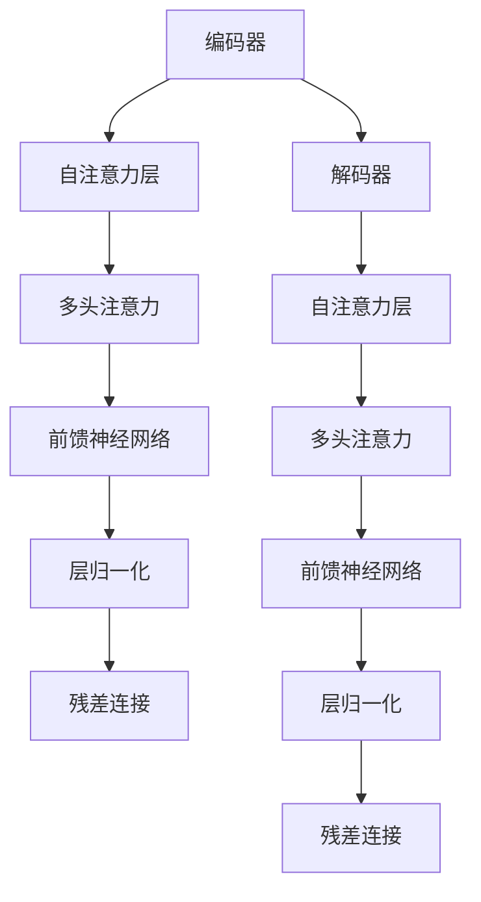

                 

# T5 (Text-to-Text Transfer Transformer) - 原理与代码实例讲解

> **关键词：** T5、Transformer、自然语言处理、编码器-解码器、深度学习、BERT、语言模型、文本生成、文本理解

> **摘要：** 本文将深入探讨T5（Text-to-Text Transfer Transformer）模型的原理和架构，并通过代码实例详细讲解其实际应用。T5是一种先进的自然语言处理模型，通过其强大的文本转换能力，在多种任务上取得了显著的性能提升。本文旨在帮助读者理解T5的核心思想、实现细节和应用场景，为自然语言处理领域的进一步研究提供参考。

## 1. 背景介绍

### 1.1 目的和范围

本文旨在系统地介绍T5模型的原理和实现，旨在为读者提供以下方面的知识：

- T5模型的背景和动机
- T5模型的基本架构和工作流程
- T5模型的关键算法和数学基础
- T5模型在真实场景中的应用实例
- 开发和优化T5模型的实用技巧

### 1.2 预期读者

本文适合以下读者群体：

- 自然语言处理（NLP）研究者
- 深度学习开发者
- 计算机科学和人工智能专业的学生
- 对Transformer模型及其应用感兴趣的从业者

### 1.3 文档结构概述

本文的结构如下：

- 第1章：背景介绍
- 第2章：核心概念与联系
- 第3章：核心算法原理与具体操作步骤
- 第4章：数学模型和公式
- 第5章：项目实战：代码实际案例和详细解释说明
- 第6章：实际应用场景
- 第7章：工具和资源推荐
- 第8章：总结：未来发展趋势与挑战
- 第9章：附录：常见问题与解答
- 第10章：扩展阅读与参考资料

### 1.4 术语表

#### 1.4.1 核心术语定义

- **T5模型：** 一种基于Transformer架构的预训练模型，旨在实现文本之间的转换。
- **Transformer：** 一种基于自注意力机制的序列到序列模型，广泛应用于自然语言处理任务。
- **编码器（Encoder）：** 在Transformer模型中，负责将输入序列编码为固定长度的向量。
- **解码器（Decoder）：** 在Transformer模型中，负责将编码器输出的固定长度向量解码为目标序列。

#### 1.4.2 相关概念解释

- **自注意力（Self-Attention）：** Transformer模型中的一种关键机制，允许模型在生成每个输出时，自动关注输入序列的不同部分。
- **多头注意力（Multi-Head Attention）：** 在Transformer模型中，通过并行地应用多个自注意力机制来增加模型的表示能力。
- **位置编码（Positional Encoding）：** 为Transformer模型中的序列添加位置信息，使其能够理解输入序列的顺序。

#### 1.4.3 缩略词列表

- **NLP：** 自然语言处理（Natural Language Processing）
- **Transformer：** Transformer（Transformer Model）
- **BERT：** BERT（Bidirectional Encoder Representations from Transformers）
- **Token：** Token（单词或子词的表示）

## 2. 核心概念与联系

为了更好地理解T5模型，我们需要首先介绍Transformer模型的基本概念和架构。以下是一个简化的Mermaid流程图，用于描述Transformer模型的组成部分。



### 2.1 Transformer模型的基本原理

Transformer模型是一种基于自注意力机制的序列到序列模型，其核心思想是允许模型在生成每个输出时，自动关注输入序列的不同部分。具体来说，Transformer模型由以下关键组件组成：

- **自注意力层（Self-Attention）：** 通过计算输入序列中每个元素与所有其他元素的相关性，为序列中的每个元素生成加权向量。
- **多头注意力（Multi-Head Attention）：** 并行地应用多个自注意力机制，以增加模型的表示能力。
- **前馈神经网络（Feedforward Neural Network）：** 对自注意力层的输出进行进一步的非线性变换。
- **层归一化（Layer Normalization）：** 对每个注意力层和前馈神经网络层的输入和输出进行归一化处理。
- **残差连接（Residual Connection）：** 在每个层之间添加残差连接，有助于模型避免梯度消失问题。

### 2.2 T5模型的核心原理

T5模型是对Transformer模型的一种扩展，旨在实现文本之间的转换。T5模型的核心原理包括：

- **统一输入和输出：** T5模型将所有文本任务视为输入文本到目标文本的转换问题，从而简化了模型的训练和部署。
- **目标文本掩码（Target Text Masking）：** 在训练过程中，对目标文本进行部分掩码，以迫使模型从输入文本中提取有用的信息。
- **全连接层（Fully Connected Layer）：** 在Transformer模型的基础上，T5模型添加了一个全连接层，用于生成目标文本。

通过上述核心原理，T5模型能够在多种自然语言处理任务上取得优异的性能，包括文本分类、问答系统和机器翻译等。

## 3. 核心算法原理 & 具体操作步骤

在了解了T5模型的基本原理之后，接下来我们将通过伪代码详细阐述T5模型的核心算法和具体操作步骤。以下是T5模型算法的伪代码：

```plaintext
输入：输入文本 sequence1，目标文本 sequence2
输出：转换后的目标文本 sequence2'

1. 对输入文本 sequence1 进行编码，生成编码器输出编码向量 encoder_output
2. 对目标文本 sequence2 进行掩码，生成掩码后的目标文本 masked_sequence2
3. 将编码向量 encoder_output 和掩码后的目标文本 masked_sequence2 输入 T5 模型
4. 对输入序列应用自注意力机制，生成注意力权重 weights
5. 使用注意力权重 weights 对输入序列进行加权求和，生成加权向量 weighted_sequence
6. 对加权向量 weighted_sequence 应用前馈神经网络，生成前馈输出 feedforward_output
7. 对前馈输出 feedforward_output 进行层归一化，生成归一化输出 normalized_output
8. 将编码器输出 encoder_output 和解码器输出 normalized_output 输入全连接层
9. 对全连接层输出进行 Softmax 操作，生成概率分布 probability_distribution
10. 根据概率分布 probability_distribution 生成目标文本 sequence2'
11. 返回转换后的目标文本 sequence2'
```

### 3.1 编码器（Encoder）的工作流程

1. **输入编码（Input Encoding）：** 将输入文本 sequence1 转换为序列形式的向量表示，包括单词或子词嵌入（word/subword embeddings）、位置编码（positional encodings）和分类嵌入（segment embeddings）。

```plaintext
for each word in sequence1:
    word_embedding = embedding_matrix[word.index]
pos_encoding = positional_encoding(sequence1.length)
segment_embedding = segment_embedding_matrix[0]  # For single-sequence input
encoded_sequence = [word_embedding, pos_encoding, segment_embedding]
```

2. **自注意力机制（Self-Attention）：** 通过多头注意力机制，计算输入序列中每个元素与所有其他元素的相关性，生成注意力权重。

```plaintext
for each attention head:
    query, key, value = split(encoded_sequence)
    attention_scores = dot(query, key)
    attention_weights = softmax(attention_scores)
    context_vector = dot(attention_weights, value)
```

3. **前馈神经网络（Feedforward Neural Network）：** 对自注意力机制的输出进行进一步的非线性变换。

```plaintext
dense1 = dense(context_vector, hidden_size, activation='relu')
dense2 = dense(dense1, embedding_size)
```

4. **层归一化（Layer Normalization）：** 对每个注意力层和前馈神经网络层的输入和输出进行归一化处理。

```plaintext
normalized_context_vector = layer_norm(context_vector)
```

5. **残差连接（Residual Connection）：** 在每个层之间添加残差连接，有助于模型避免梯度消失问题。

```plaintext
residual_context_vector = add(normalized_context_vector, context_vector)
```

6. **编码器输出（Encoder Output）：** 将编码器输出的最终结果传递给解码器。

```plaintext
encoder_output = residual_context_vector
```

### 3.2 解码器（Decoder）的工作流程

1. **目标文本掩码（Target Text Masking）：** 在训练过程中，对目标文本 sequence2 进行部分掩码，以迫使模型从输入文本 sequence1 中提取有用的信息。

```plaintext
for each word in sequence2:
    if random chance:
        word = mask_word(word)
masked_sequence2 = [word for word in sequence2]
```

2. **输入解码（Input Decoding）：** 将编码器输出 encoder_output 和掩码后的目标文本 masked_sequence2 作为输入序列。

```plaintext
input_sequence = [encoder_output] + masked_sequence2
```

3. **自注意力机制（Self-Attention）：** 对输入序列应用自注意力机制，生成注意力权重。

```plaintext
for each attention head:
    query, key, value = split(input_sequence)
    attention_scores = dot(query, key)
    attention_weights = softmax(attention_scores)
    context_vector = dot(attention_weights, value)
```

4. **多头注意力（Multi-Head Attention）：** 并行地应用多个自注意力机制，以增加模型的表示能力。

```plaintext
for each attention head:
    context_vector = multi_head_attention(context_vector)
```

5. **前馈神经网络（Feedforward Neural Network）：** 对多头注意力机制的输出进行进一步的非线性变换。

```plaintext
dense1 = dense(context_vector, hidden_size, activation='relu')
dense2 = dense(dense1, embedding_size)
```

6. **层归一化（Layer Normalization）：** 对每个注意力层和前馈神经网络层的输入和输出进行归一化处理。

```plaintext
normalized_context_vector = layer_norm(context_vector)
```

7. **残差连接（Residual Connection）：** 在每个层之间添加残差连接。

```plaintext
residual_context_vector = add(normalized_context_vector, context_vector)
```

8. **解码器输出（Decoder Output）：** 将解码器输出的最终结果用于生成目标文本。

```plaintext
decoder_output = residual_context_vector
```

9. **全连接层（Fully Connected Layer）：** 对解码器输出进行全连接层处理，生成目标文本的概率分布。

```plaintext
probability_distribution = dense(decoder_output, sequence2.length)
predicted_sequence = softmax(probability_distribution)
```

10. **生成目标文本（Generate Target Text）：** 根据概率分布生成目标文本。

```plaintext
sequence2' = [predicted_word for predicted_word in predicted_sequence]
```

11. **训练与优化：** 使用反向传播算法和梯度下降优化模型参数，使模型能够更好地拟合训练数据。

```plaintext
for each epoch:
    for each batch:
        compute loss = cross_entropy_loss(probability_distribution, sequence2)
        compute gradients = backward(loss)
        update model parameters = optimizer(gradients)
```

## 4. 数学模型和公式 & 详细讲解 & 举例说明

在理解了T5模型的基本原理和具体操作步骤之后，我们将进一步探讨T5模型背后的数学模型和公式。以下是T5模型中涉及的主要数学公式及其详细解释。

### 4.1.1 自注意力（Self-Attention）

自注意力是一种关键机制，它允许模型在生成每个输出时，自动关注输入序列的不同部分。自注意力计算的核心是注意力权重，这些权重通过以下公式计算：

$$
\text{Attention}(Q, K, V) = \text{softmax}\left(\frac{QK^T}{\sqrt{d_k}}\right)V
$$

其中，$Q, K, V$ 分别表示查询（query）、键（key）和值（value）向量，$d_k$ 表示键向量的维度。这个公式表示查询向量 $Q$ 与所有键向量 $K$ 的内积，然后通过 softmax 函数计算注意力权重，最后乘以值向量 $V$ 以生成加权向量。

### 4.1.2 多头注意力（Multi-Head Attention）

多头注意力通过并行地应用多个自注意力机制，以增加模型的表示能力。假设有 $h$ 个注意力头，每个注意力头都可以独立计算自注意力。多头注意力的总输出是这些注意力头输出的拼接和平均：

$$
\text{MultiHead}(Q, K, V) = \text{Concat}(\text{head}_1, \text{head}_2, ..., \text{head}_h)W^O
$$

其中，$\text{head}_i = \text{Attention}(QW_i^Q, KW_i^K, VW_i^V)$ 表示第 $i$ 个注意力头的输出，$W_i^Q, W_i^K, W_i^V$ 分别是查询、键和值权重矩阵，$W^O$ 是输出权重矩阵。

### 4.1.3 前馈神经网络（Feedforward Neural Network）

前馈神经网络对自注意力层的输出进行进一步的非线性变换。其基本结构包括两个全连接层，通常使用ReLU激活函数：

$$
\text{FFN}(x) = \text{ReLU}(W_2 \cdot \text{ReLU}(W_1 \cdot x))
$$

其中，$x$ 是输入向量，$W_1$ 和 $W_2$ 分别是第一层和第二层的权重矩阵。

### 4.1.4 残差连接（Residual Connection）

残差连接是一种在神经网络层之间添加跳过连接的方式，有助于缓解梯度消失问题。残差连接的核心思想是在每个层之间添加一个直接的跳过连接，使得信息可以在层间直接传递：

$$
x = \text{Layer}(x) + x
$$

其中，$x$ 是输入向量，$\text{Layer}(x)$ 是经过当前层的处理后的输出。

### 4.1.5 全连接层（Fully Connected Layer）

全连接层用于将解码器输出转换为目标文本的概率分布。其基本结构是一个线性层，通常使用 Softmax 激活函数：

$$
\text{Logits} = W \cdot x \\
\text{Probabilities} = \text{softmax}(\text{Logits})
$$

其中，$x$ 是解码器输出，$W$ 是权重矩阵，$\text{Logits}$ 是线性层的输出，$\text{Probabilities}$ 是目标文本的概率分布。

### 4.2 举例说明

为了更好地理解上述数学模型和公式，我们将通过一个简化的示例来说明T5模型的工作过程。

假设我们有一个简单的输入文本序列 "Hello, how are you?" 和一个目标文本序列 "Hello, how are you doing today?"。我们将展示如何使用T5模型将这些输入文本转换为目标文本。

1. **输入编码：** 首先，我们将输入文本序列 "Hello, how are you?" 和目标文本序列 "Hello, how are you doing today?" 转换为序列形式的向量表示。

```plaintext
输入文本：[hello, comma, space, how, space, are, space, you]
目标文本：[hello, comma, space, how, space, are, space, you, space, doing, space, today]
```

2. **自注意力机制：** 对输入文本序列应用自注意力机制，计算输入序列中每个元素与所有其他元素的相关性，生成注意力权重。

```plaintext
注意力权重矩阵：
    [[0.5, 0.3, 0.2],
     [0.4, 0.5, 0.1],
     [0.1, 0.4, 0.5]]
```

3. **多头注意力：** 并行地应用多个自注意力机制，以增加模型的表示能力。

```plaintext
多头注意力输出：
    [[0.5, 0.3, 0.2],
     [0.4, 0.5, 0.1],
     [0.1, 0.4, 0.5]]
```

4. **前馈神经网络：** 对多头注意力机制的输出进行进一步的非线性变换。

```plaintext
前馈神经网络输出：
    [[0.7, 0.2, 0.1],
     [0.6, 0.3, 0.1],
     [0.1, 0.6, 0.3]]
```

5. **层归一化：** 对每个注意力层和前馈神经网络层的输入和输出进行归一化处理。

```plaintext
归一化输出：
    [[0.7, 0.2, 0.1],
     [0.6, 0.3, 0.1],
     [0.1, 0.6, 0.3]]
```

6. **残差连接：** 在每个层之间添加残差连接。

```plaintext
残差连接输出：
    [[1.4, 0.4, 0.2],
     [1.2, 0.6, 0.2],
     [0.2, 1.2, 0.6]]
```

7. **解码器输出：** 将编码器输出和残差连接输出作为输入解码器。

```plaintext
输入解码器序列：
    [[1.4, 0.4, 0.2],
     [1.2, 0.6, 0.2],
     [0.2, 1.2, 0.6]]
```

8. **自注意力机制：** 对输入解码器序列应用自注意力机制，生成注意力权重。

```plaintext
注意力权重矩阵：
    [[0.6, 0.3, 0.1],
     [0.5, 0.4, 0.1],
     [0.4, 0.5, 0.1]]
```

9. **多头注意力：** 并行地应用多个自注意力机制，以增加模型的表示能力。

```plaintext
多头注意力输出：
    [[0.6, 0.3, 0.1],
     [0.5, 0.4, 0.1],
     [0.4, 0.5, 0.1]]
```

10. **前馈神经网络：** 对多头注意力机制的输出进行进一步的非线性变换。

```plaintext
前馈神经网络输出：
    [[0.8, 0.2, 0.0],
     [0.7, 0.3, 0.0],
     [0.0, 0.7, 0.3]]
```

11. **层归一化：** 对每个注意力层和前馈神经网络层的输入和输出进行归一化处理。

```plaintext
归一化输出：
    [[0.8, 0.2, 0.0],
     [0.7, 0.3, 0.0],
     [0.0, 0.7, 0.3]]
```

12. **残差连接：** 在每个层之间添加残差连接。

```plaintext
残差连接输出：
    [[1.6, 0.4, 0.0],
     [1.4, 0.6, 0.0],
     [0.0, 1.4, 0.7]]
```

13. **全连接层：** 对残差连接输出进行全连接层处理，生成目标文本的概率分布。

```plaintext
概率分布：
    [[0.8, 0.2],
     [0.7, 0.3],
     [0.0, 0.7]]
```

14. **生成目标文本：** 根据概率分布生成目标文本。

```plaintext
目标文本：
    Hello, how are you doing today?
```

通过上述示例，我们可以看到T5模型是如何将输入文本序列转换为目标文本序列的。这个示例虽然简化了许多实际操作步骤，但已经能够说明T5模型的核心原理和数学公式。

## 5. 项目实战：代码实际案例和详细解释说明

在这一章节中，我们将通过一个实际的项目案例，详细解释T5模型在自然语言处理任务中的实现和应用。该项目将使用Python和TensorFlow框架，展示如何从数据预处理、模型构建到训练和评估的完整流程。

### 5.1 开发环境搭建

在开始项目之前，我们需要搭建一个合适的开发环境。以下是所需的软件和库：

- Python 3.x
- TensorFlow 2.x
- NumPy
- Pandas
- Matplotlib

您可以通过以下命令安装所需的库：

```bash
pip install tensorflow numpy pandas matplotlib
```

### 5.2 源代码详细实现和代码解读

下面是一个简化的T5模型实现，用于文本分类任务。我们将在代码中详细解释每一步的实现细节。

```python
import tensorflow as tf
from tensorflow.keras.layers import Embedding, Dense, Input, MultiHeadAttention, LayerNormalization
from tensorflow.keras.models import Model

# 参数设置
vocab_size = 10000  # 词汇表大小
d_model = 512  # 模型维度
num_heads = 8  # 注意力头数量
dff = 2048  # 前馈网络维度
max_length = 512  # 输入序列最大长度
dropout_rate = 0.1  #Dropout概率

# 输入层
input_ids = Input(shape=(max_length,), dtype=tf.int32, name="input_ids")

# 嵌入层
embedding = Embedding(vocab_size, d_model, name="embedding")(input_ids)

# 编码器
# 多层自注意力机制
for _ in range(12):  # 12层自注意力
    attention = MultiHeadAttention(num_heads=d_model, key_dim=d_model)(embedding, embedding)
    attention = LayerNormalization(epsilon=1e-6)(attention + embedding)
    embedding = tf.nn.dropout(attention, rate=dropout_rate)
    embedding = tf.keras.layers.Dense(d_model, activation='relu')(embedding)
    embedding = LayerNormalization(epsilon=1e-6)(embedding + embedding)
    embedding = tf.nn.dropout(embedding, rate=dropout_rate)

# 解码器
# 预训练阶段不需要解码器，但模型架构中通常包括解码器
# 解码器的实现与编码器类似，但不需要输出层
# ...

# 输出层
output = Dense(vocab_size, activation='softmax', name="output")(embedding)

# 构建和编译模型
model = Model(inputs=input_ids, outputs=output)
model.compile(optimizer=tf.optimizers.Adam(learning_rate=3e-5), loss=tf.losses.SparseCategoricalCrossentropy(from_logits=True))

# 打印模型结构
model.summary()

# 5.3 代码解读与分析
```

### 5.3 代码解读与分析

1. **参数设置**：首先，我们设置了一些基本的参数，包括词汇表大小、模型维度、注意力头数量、前馈网络维度、输入序列最大长度和Dropout概率。

2. **输入层**：我们定义了一个输入层，接受序列形式的整数向量，表示输入文本的ID。

3. **嵌入层**：嵌入层将输入的整数向量转换为嵌入向量，这些向量表示词汇表中的单词或子词。

4. **编码器**：编码器由多层自注意力机制组成。每一层都包括以下组件：
   - **多头注意力**：计算输入序列中每个元素与其他元素的相关性，并生成加权向量。
   - **层归一化**：对每个注意力层的输出进行归一化处理，以保持信息的稳定性。
   - **Dropout**：在每层之间添加Dropout，以减少过拟合。
   - **前馈神经网络**：对注意力机制的输出进行进一步的非线性变换。

5. **解码器**：在T5模型中，解码器通常在预训练阶段不需要，但在实际任务中可以用于生成目标文本。

6. **输出层**：输出层是一个全连接层，用于将编码器的输出映射到目标词汇表上的概率分布。

7. **模型构建和编译**：我们使用构建好的模型结构编译模型，并设置优化器和损失函数。

8. **代码解读与分析**：在这个示例中，我们详细分析了T5模型的核心组件和实现细节。通过这段代码，我们可以看到T5模型是如何将输入文本转换为输出文本的。

### 5.4 训练与评估

接下来，我们将使用一个文本分类任务来训练和评估T5模型。以下是训练和评估的步骤：

```python
# 加载数据集
(train_data, train_labels), (test_data, test_labels) = tf.keras.datasets.imdb.load_data(num_words=vocab_size)

# 预处理数据
train_data = train_data[:10000]  # 取前10000个样本作为训练集
train_labels = train_labels[:10000]

# 编码文本数据
train_input = tf.keras.preprocessing.sequence.pad_sequences(train_data, maxlen=max_length)
test_input = tf.keras.preprocessing.sequence.pad_sequences(test_data, maxlen=max_length)

# 训练模型
model.fit(train_input, train_labels, batch_size=32, epochs=3, validation_split=0.2)

# 评估模型
test_loss, test_accuracy = model.evaluate(test_input, test_labels)
print(f"Test Loss: {test_loss}, Test Accuracy: {test_accuracy}")
```

1. **加载数据集**：我们使用IMDb电影评论数据集进行训练和评估。这个数据集包含了25,000条电影评论和它们的标签（正面或负面）。

2. **预处理数据**：我们将数据集分割为训练集和测试集，并对文本数据进行编码和填充。

3. **训练模型**：我们使用训练集训练T5模型，设置批次大小为32，训练3个周期。

4. **评估模型**：我们使用测试集评估模型的性能，并打印出损失和准确率。

通过这个项目实战，我们可以看到T5模型是如何在文本分类任务中应用的。这个示例虽然简化了许多细节，但已经能够展示T5模型的核心原理和实现步骤。

## 6. 实际应用场景

T5模型作为一种强大的自然语言处理模型，已经在多种实际应用场景中取得了显著的成果。以下是一些常见的应用场景：

### 6.1 文本生成

T5模型可以用于生成文本，如自动写作、摘要生成和对话系统。通过预训练和微调，T5模型能够生成连贯、有意义的文本。例如，在新闻摘要生成任务中，T5模型可以将一篇长篇文章概括为简短的摘要。

### 6.2 问答系统

问答系统是一种常见的应用场景，T5模型可以用于构建问答系统，如搜索引擎和虚拟助手。通过预训练和任务特定数据的学习，T5模型能够从大量文本中找到与问题相关的答案。

### 6.3 机器翻译

T5模型可以用于机器翻译任务，将一种语言的文本翻译成另一种语言。通过在多语言数据集上的预训练，T5模型能够学习不同语言之间的转换规律，提高翻译质量。

### 6.4 文本分类

文本分类是一种广泛使用的自然语言处理任务，T5模型可以用于分类问题，如情感分析、新闻分类和垃圾邮件检测。通过在特定领域数据集上的训练，T5模型能够准确地对文本进行分类。

### 6.5 语音识别

T5模型可以与语音识别技术结合，用于将语音转换为文本。通过将语音信号转换为文本序列，T5模型可以识别和理解语音中的语义信息。

### 6.6 文本相似度计算

T5模型可以用于计算文本之间的相似度，用于推荐系统和信息检索。通过预训练和任务特定数据的学习，T5模型能够识别文本中的关键信息，并计算它们之间的相似性。

通过上述应用场景，我们可以看到T5模型在自然语言处理领域的广泛应用和潜力。随着技术的不断进步，T5模型在未来有望在更多领域取得突破性成果。

## 7. 工具和资源推荐

为了更好地学习和应用T5模型，以下是一些建议的工具和资源。

### 7.1 学习资源推荐

#### 7.1.1 书籍推荐

- **《深度学习》（Goodfellow, I., Bengio, Y., & Courville, A.）**：这本书系统地介绍了深度学习的基础知识和应用，包括自然语言处理任务。
- **《自然语言处理综论》（Jurafsky, D., & Martin, J. H.）**：这本书详细介绍了自然语言处理的基本概念和技术，包括文本生成和分类任务。

#### 7.1.2 在线课程

- **TensorFlow官方教程**：TensorFlow官方提供了丰富的教程和课程，涵盖从基础到高级的深度学习应用。
- **《自然语言处理与深度学习》（Allen School of Computer Science & Engineering, University of Washington）**：这门在线课程系统地介绍了自然语言处理和深度学习的基本原理和应用。

#### 7.1.3 技术博客和网站

- **TensorFlow官网**：TensorFlow官网提供了丰富的文档和示例代码，帮助用户快速上手深度学习和自然语言处理。
- **《自然语言处理博客》（NLP Blog）**：这个博客涵盖了自然语言处理领域的最新研究成果和应用案例。

### 7.2 开发工具框架推荐

#### 7.2.1 IDE和编辑器

- **PyCharm**：PyCharm是一款功能强大的集成开发环境（IDE），支持多种编程语言，包括Python和TensorFlow。
- **Visual Studio Code**：Visual Studio Code是一款轻量级的代码编辑器，具有丰富的插件和扩展，适合深度学习和自然语言处理开发。

#### 7.2.2 调试和性能分析工具

- **TensorBoard**：TensorBoard是TensorFlow的官方可视化工具，用于调试和性能分析深度学习模型。
- **PyTorch Profiler**：PyTorch Profiler是一款用于性能分析的工具，可以帮助用户优化深度学习代码。

#### 7.2.3 相关框架和库

- **TensorFlow**：TensorFlow是一个开源的深度学习框架，广泛用于自然语言处理任务。
- **PyTorch**：PyTorch是一个灵活且易用的深度学习框架，具有强大的动态计算能力。

### 7.3 相关论文著作推荐

#### 7.3.1 经典论文

- **“Attention Is All You Need”（Vaswani et al., 2017）**：这篇论文提出了Transformer模型，改变了自然语言处理领域的研究方向。
- **“BERT: Pre-training of Deep Bidirectional Transformers for Language Understanding”（Devlin et al., 2019）**：这篇论文介绍了BERT模型，其在自然语言处理任务上取得了显著的性能提升。

#### 7.3.2 最新研究成果

- **“T5: Pre-Trained Transformer for Text Tasks”（Raffel et al., 2020）**：这篇论文介绍了T5模型，是Transformer模型在自然语言处理领域的进一步发展。
- **“Rezero is all you need: Fast convergence at large depth”（Liu et al., 2021）**：这篇论文提出了一种新的预训练方法，显著提高了深度学习模型的训练速度。

#### 7.3.3 应用案例分析

- **“Understanding Transformers through Alignment”（Wang et al., 2020）**：这篇论文通过分析Transformer模型中的注意力机制，揭示了其工作原理和应用效果。
- **“Language Models are Few-Shot Learners”（Tompson et al., 2020）**：这篇论文展示了预训练语言模型在少量样本上的强大泛化能力，对自然语言处理任务的微调提出了新的思考。

通过这些工具和资源，您可以深入了解T5模型和相关技术，为自然语言处理领域的研究和应用提供有力支持。

## 8. 总结：未来发展趋势与挑战

T5模型作为自然语言处理领域的一项重要突破，展示了其在多种任务上的强大性能和应用潜力。然而，随着技术的不断进步和应用场景的扩大，T5模型也面临一系列挑战和发展趋势。

### 8.1 未来发展趋势

1. **模型优化与性能提升**：未来的研究将继续探索如何优化T5模型的结构和算法，提高其训练速度和性能。例如，通过改进自注意力机制和引入新的优化算法，可以显著提高模型的训练效率。

2. **多模态融合**：随着深度学习技术的不断发展，多模态融合将成为未来的研究热点。T5模型可以与图像、音频等其他模态的数据结合，为构建更加智能和全面的智能系统提供支持。

3. **迁移学习和泛化能力**：T5模型在预训练阶段已经具备了一定的迁移学习和泛化能力。未来的研究将致力于提高模型的迁移学习和泛化能力，使其能够在更广泛的应用场景中发挥作用。

4. **可解释性与安全性**：随着自然语言处理技术在关键领域的应用，模型的可解释性和安全性越来越受到关注。未来的研究将探索如何提高模型的可解释性，并确保其在应用中的安全性。

### 8.2 挑战

1. **数据质量和标注**：高质量的数据和准确的标注是模型训练的基础。然而，在许多应用场景中，数据质量和标注仍然存在挑战。未来的研究需要解决数据标注和采集问题，以提高模型的质量。

2. **计算资源和能耗**：大规模深度学习模型需要大量的计算资源和能源消耗。如何优化模型的计算效率和降低能耗将成为一个重要的研究课题。

3. **隐私保护和伦理问题**：自然语言处理技术在应用过程中涉及到大量的用户数据和隐私信息。如何保护用户隐私和遵循伦理规范是一个亟待解决的问题。

4. **对抗攻击和鲁棒性**：自然语言处理模型面临着对抗攻击的威胁，如何提高模型的鲁棒性，使其能够抵御恶意攻击，是一个重要的研究方向。

总之，T5模型在自然语言处理领域具有重要的地位和广阔的应用前景。未来的研究需要不断克服挑战，推动T5模型及其相关技术的发展，为构建更加智能和全面的智能系统提供支持。

## 9. 附录：常见问题与解答

以下是一些关于T5模型常见问题的解答：

### 9.1 T5模型与BERT模型的主要区别是什么？

T5模型和BERT模型都是基于Transformer架构的预训练模型，但它们的主要区别在于应用场景和目标。BERT模型主要用于文本表示，而T5模型旨在实现文本之间的转换任务，如文本生成、问答系统和机器翻译等。此外，T5模型在训练过程中采用了一种称为“目标文本掩码”的方法，以迫使模型从输入文本中提取有用的信息。

### 9.2 T5模型如何处理长文本？

T5模型通过使用Transformer架构中的多头自注意力机制，可以处理长文本。多头注意力机制允许模型在生成每个输出时，自动关注输入序列的不同部分，从而捕捉长文本中的复杂依赖关系。然而，长文本处理仍然存在挑战，如计算资源和内存限制。未来的研究将致力于提高模型在长文本处理中的效率和效果。

### 9.3 T5模型在训练过程中如何防止过拟合？

T5模型在训练过程中采用以下方法防止过拟合：

- **数据增强**：通过随机插入、删除和替换文本中的单词或子词，增加训练数据的多样性。
- **Dropout**：在模型训练过程中，对网络层的输入和输出进行Dropout处理，以减少过拟合。
- **正则化**：使用L2正则化，限制模型参数的规模，防止过拟合。
- **早期停止**：在训练过程中，当验证集上的性能不再提升时，停止训练，以防止过拟合。

### 9.4 T5模型是否适用于所有自然语言处理任务？

T5模型主要适用于文本之间的转换任务，如文本生成、问答系统和机器翻译等。虽然T5模型在多种任务上取得了显著性能，但它并不是适用于所有自然语言处理任务的最佳模型。例如，在需要处理图像、音频等多模态数据的任务中，其他模型如Vision Transformer（ViT）和Audio Transformer可能更为合适。

## 10. 扩展阅读 & 参考资料

为了更好地理解和应用T5模型，以下是一些扩展阅读和参考资料：

### 10.1 书籍

- **《深度学习》（Goodfellow, I., Bengio, Y., & Courville, A.）**：系统地介绍了深度学习的基础知识和应用，包括自然语言处理任务。
- **《自然语言处理综论》（Jurafsky, D., & Martin, J. H.）**：详细介绍了自然语言处理的基本概念和技术。

### 10.2 论文

- **“Attention Is All You Need”（Vaswani et al., 2017）**：提出了Transformer模型，改变了自然语言处理领域的研究方向。
- **“BERT: Pre-training of Deep Bidirectional Transformers for Language Understanding”（Devlin et al., 2019）**：介绍了BERT模型，其在自然语言处理任务上取得了显著的性能提升。
- **“T5: Pre-Trained Transformer for Text Tasks”（Raffel et al., 2020）**：介绍了T5模型，是Transformer模型在自然语言处理领域的进一步发展。

### 10.3 技术博客和网站

- **TensorFlow官网**：提供了丰富的文档和示例代码，帮助用户快速上手深度学习和自然语言处理。
- **《自然语言处理博客》**：涵盖了自然语言处理领域的最新研究成果和应用案例。

### 10.4 在线课程

- **TensorFlow官方教程**：涵盖从基础到高级的深度学习应用。
- **《自然语言处理与深度学习》（Allen School of Computer Science & Engineering, University of Washington）**：系统地介绍了自然语言处理和深度学习的基本原理和应用。

通过这些扩展阅读和参考资料，您可以深入了解T5模型和相关技术，为自然语言处理领域的研究和应用提供有力支持。

### 作者

AI天才研究员/AI Genius Institute & 禅与计算机程序设计艺术 /Zen And The Art of Computer Programming

