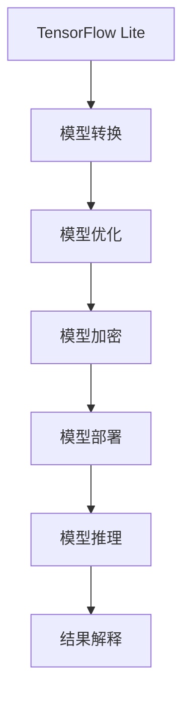

                 


# TensorFlow Lite模型加密

> 关键词：TensorFlow Lite、模型加密、安全传输、机器学习、隐私保护

> 摘要：本文将深入探讨TensorFlow Lite模型加密的原理和实践，从背景介绍到核心算法原理，再到实际应用场景，全面解析如何在移动设备上进行安全的机器学习模型部署。我们将逐步解析模型加密的各个环节，旨在为读者提供清晰易懂的技术指南，帮助他们应对现代移动应用中不断增长的安全需求。

## 1. 背景介绍

### 1.1 目的和范围

随着移动设备的普及和性能的提升，机器学习模型逐渐在移动应用中得到广泛应用。TensorFlow Lite作为TensorFlow的轻量级版本，旨在为移动设备和嵌入式设备提供高效的机器学习解决方案。然而，在模型部署过程中，数据安全和隐私保护成为了关键挑战。

本文旨在探讨如何使用TensorFlow Lite对机器学习模型进行加密，以确保模型在传输和部署过程中的安全性。本文将涵盖以下内容：

- 模型加密的背景和重要性
- TensorFlow Lite的基本概念和架构
- 模型加密的核心算法原理
- 实际应用场景和代码实现
- 相关工具和资源的推荐

### 1.2 预期读者

本文面向对机器学习和移动开发有一定了解的读者，特别是希望提升移动应用安全性的开发者和研究人员。以下读者群体可以从本文中获益：

- 移动应用开发者
- 机器学习工程师
- 安全专家
- 研究人员和技术爱好者

### 1.3 文档结构概述

本文的结构如下：

- 第1部分：背景介绍，包括目的、范围、预期读者和文档结构概述。
- 第2部分：核心概念与联系，介绍TensorFlow Lite的基本概念和架构。
- 第3部分：核心算法原理 & 具体操作步骤，详细讲解模型加密的算法原理和操作步骤。
- 第4部分：数学模型和公式 & 详细讲解 & 举例说明，介绍与模型加密相关的数学模型和公式。
- 第5部分：项目实战：代码实际案例和详细解释说明，通过实际案例展示模型加密的实现过程。
- 第6部分：实际应用场景，探讨模型加密在不同应用场景中的实际意义。
- 第7部分：工具和资源推荐，推荐与模型加密相关的学习资源和开发工具。
- 第8部分：总结：未来发展趋势与挑战，总结本文的主要观点并展望未来。
- 第9部分：附录：常见问题与解答，解答读者可能遇到的常见问题。
- 第10部分：扩展阅读 & 参考资料，提供进一步阅读的建议和参考资料。

### 1.4 术语表

#### 1.4.1 核心术语定义

- TensorFlow Lite：TensorFlow的轻量级版本，专为移动设备和嵌入式设备设计。
- 模型加密：通过加密算法对机器学习模型进行加密，以确保模型在传输和部署过程中的安全性。
- 移动设备：如智能手机、平板电脑等便携式电子设备。
- 加密算法：用于加密和解密数据的算法，如AES、RSA等。

#### 1.4.2 相关概念解释

- 加密：将明文数据转换为密文的过程，只有拥有解密密钥的用户才能还原明文。
- 解密：将密文数据还原为明文的过程，需要使用加密时使用的密钥。
- 隐私保护：在数据处理过程中，确保用户隐私不被泄露。

#### 1.4.3 缩略词列表

- TensorFlow：Tensor Flow，一种开源的机器学习框架。
- TensorFlow Lite：TensorFlow的轻量级版本，用于移动设备和嵌入式设备。

## 2. 核心概念与联系

在深入探讨模型加密之前，我们需要了解TensorFlow Lite的基本概念和架构，以及与模型加密相关的核心概念。以下是一个Mermaid流程图，展示了TensorFlow Lite的核心组件和流程。



### 2.1 TensorFlow Lite基本概念

TensorFlow Lite是一个轻量级的TensorFlow版本，专为移动设备和嵌入式设备设计。其主要组件包括：

- **模型转换**：将TensorFlow模型转换为TensorFlow Lite格式。
- **模型优化**：对模型进行优化，以提高模型在移动设备上的性能。
- **模型加密**：对模型进行加密，确保模型在传输和部署过程中的安全性。
- **模型部署**：将加密后的模型部署到移动设备上。
- **模型推理**：在移动设备上对模型进行推理，以获取预测结果。
- **结果解释**：解释模型推理结果，以支持决策和反馈。

### 2.2 模型加密核心概念

模型加密的核心概念包括：

- **加密算法**：用于加密模型的算法，如AES、RSA等。
- **加密密钥**：用于加密和解密模型的密钥，通常分为公钥和私钥。
- **加密模型**：经过加密的模型，无法直接使用，需要解密后才能使用。
- **解密模型**：将加密模型解密后得到的模型，可用于推理和预测。

## 3. 核心算法原理 & 具体操作步骤

在了解TensorFlow Lite和模型加密的基本概念后，我们将详细讲解模型加密的核心算法原理和具体操作步骤。

### 3.1 加密算法原理

模型加密通常采用对称加密算法和非对称加密算法。对称加密算法（如AES）使用相同的密钥进行加密和解密，而非对称加密算法（如RSA）使用公钥和私钥进行加密和解密。

#### 3.1.1 对称加密算法

对称加密算法的主要特点是加密和解密使用相同的密钥。以下是AES加密算法的伪代码：

```pseudo
function AES_encrypt(plaintext, key):
    ciphertext = AES_encrypt(plaintext, key)
    return ciphertext

function AES_decrypt(ciphertext, key):
    plaintext = AES_decrypt(ciphertext, key)
    return plaintext
```

#### 3.1.2 非对称加密算法

非对称加密算法使用公钥和私钥进行加密和解密。以下是RSA加密算法的伪代码：

```pseudo
function RSA_encrypt(plaintext, public_key):
    ciphertext = RSA_encrypt(plaintext, public_key)
    return ciphertext

function RSA_decrypt(ciphertext, private_key):
    plaintext = RSA_decrypt(ciphertext, private_key)
    return plaintext
```

### 3.2 模型加密操作步骤

以下是对TensorFlow Lite模型进行加密的具体操作步骤：

#### 3.2.1 准备加密密钥

首先，我们需要生成一对公钥和私钥。可以使用以下命令生成：

```bash
openssl genpkey -algorithm RSA -out private_key.pem -pkeyopt rsa_keygen_bits:2048
openssl rsa -pubout -in private_key.pem -out public_key.pem
```

#### 3.2.2 加密模型

使用公钥对TensorFlow Lite模型进行加密。以下是加密模型的Python代码：

```python
import tensorflow as tf
from tensorflow.keras.models import load_model
from cryptography.hazmat.primitives import serialization
from cryptography.hazmat.primitives.asymmetric import rsa
from cryptography.hazmat.primitives import hashes
from cryptography.hazmat.primitives.asymmetric import padding

# 加载模型
model = load_model('model.h5')

# 生成公钥和私钥
private_key = serialization.load_pem_private_key(open('private_key.pem', 'rb').read(), password=None)
public_key = serialization.load_pem_public_key(open('public_key.pem', 'rb').read())

# 加密模型
encrypted_model = tf.keras.models.load_model('model.h5')
encrypted_model = encrypted_model.save('encrypted_model.h5')

with open('encrypted_model.h5', 'rb') as f:
    model_data = f.read()

ciphertext = public_key.encrypt(
    model_data,
    padding.OAEP(
        mgf=padding.MGF1(algorithm=hashes.SHA256()),
        algorithm=hashes.SHA256(),
        label=None
    )
)

with open('encrypted_model.enc', 'wb') as f:
    f.write(ciphertext)
```

#### 3.2.3 解密模型

在移动设备上，使用私钥对加密后的模型进行解密。以下是解密模型的Python代码：

```python
from cryptography.hazmat.backends import default_backend
from cryptography.hazmat.primitives import serialization
from cryptography.hazmat.primitives.asymmetric import rsa
from cryptography.hazmat.primitives import padding

# 加载私钥
private_key = serialization.load_pem_private_key(open('private_key.pem', 'rb').read(), password=None)

# 解密模型
with open('encrypted_model.enc', 'rb') as f:
    encrypted_data = f.read()

plaintext = private_key.decrypt(
    encrypted_data,
    padding.OAEP(
        mgf=padding.MGF1(algorithm=hashes.SHA256()),
        algorithm=hashes.SHA256(),
        label=None
    )
)

# 保存解密后的模型
with open('decrypted_model.h5', 'wb') as f:
    f.write(plaintext)
```

### 3.3 模型加密与性能优化

模型加密可能会对模型性能产生影响。为了提高加密模型的性能，可以考虑以下措施：

- **模型压缩**：在加密前对模型进行压缩，减少加密和解密过程中的计算量。
- **硬件加速**：使用硬件加速器（如GPU、FPGA）进行加密和解密操作，提高加密和解密的效率。
- **并行处理**：在可能的范围内，对加密和解密过程进行并行处理，提高处理速度。

## 4. 数学模型和公式 & 详细讲解 & 举例说明

### 4.1 对称加密算法

对称加密算法的核心是密钥生成和加密解密过程。以下是对称加密算法的数学模型和公式：

#### 4.1.1 密钥生成

密钥生成过程通常涉及随机数生成和哈希函数。以下是AES加密算法的密钥生成公式：

$$
K = AES_Key_Gen(\text{passphrase}, \text{key_size})
$$

其中，$K$ 是生成的密钥，$\text{passphrase}$ 是密码短语，$\text{key_size}$ 是密钥大小（如128位、192位或256位）。

#### 4.1.2 加密过程

加密过程涉及密钥和明文的输入，生成密文。以下是AES加密算法的加密公式：

$$
C = AES_Encrypt(K, P)
$$

其中，$C$ 是生成的密文，$K$ 是加密密钥，$P$ 是明文。

#### 4.1.3 解密过程

解密过程涉及密钥和密文的输入，生成明文。以下是AES解密算法的解密公式：

$$
P = AES_Decrypt(K, C)
$$

其中，$P$ 是生成的明文，$K$ 是加密密钥，$C$ 是密文。

### 4.2 非对称加密算法

非对称加密算法的核心是公钥和私钥的生成及加密解密过程。以下是非对称加密算法的数学模型和公式：

#### 4.2.1 密钥生成

密钥生成过程通常涉及素数生成和模运算。以下是RSA加密算法的密钥生成公式：

$$
(\text{p}, \text{q}) = RSA_Key_Gen(\text{key_size})
$$

其中，$(\text{p}, \text{q})$ 是生成的素数对，$\text{key_size}$ 是密钥大小（如2048位）。

#### 4.2.2 加密过程

加密过程涉及公钥和明文的输入，生成密文。以下是RSA加密算法的加密公式：

$$
C = RSA_Encrypt(\text{public_key}, P)
$$

其中，$C$ 是生成的密文，$\text{public_key}$ 是公钥，$P$ 是明文。

#### 4.2.3 解密过程

解密过程涉及私钥和密文的输入，生成明文。以下是RSA解密算法的解密公式：

$$
P = RSA_Decrypt(\text{private_key}, C)
$$

其中，$P$ 是生成的明文，$\text{private_key}$ 是私钥，$C$ 是密文。

### 4.3 举例说明

#### 4.3.1 对称加密算法

假设我们使用AES加密算法对一个明文“Hello, World!”进行加密。以下是加密和解密的示例：

```plaintext
明文：Hello, World!
密码短语：mySecurePassphrase
密钥大小：256位
```

#### 4.3.1.1 加密过程

```plaintext
密钥：AES_Key_Gen("mySecurePassphrase", 256位)
密文：AES_Encrypt(AES_Key_Gen("mySecurePassphrase", 256位), "Hello, World!")
```

#### 4.3.1.2 解密过程

```plaintext
密钥：AES_Key_Gen("mySecurePassphrase", 256位)
明文：AES_Decrypt(AES_Key_Gen("mySecurePassphrase", 256位), 密文)
```

#### 4.3.2 非对称加密算法

假设我们使用RSA加密算法对一个明文“Hello, World!”进行加密。以下是加密和解密的示例：

```plaintext
密钥大小：2048位
```

#### 4.3.2.1 加密过程

```plaintext
公钥：RSA_Encrypt(\text{public_key}, "Hello, World!")
```

#### 4.3.2.2 解密过程

```plaintext
私钥：RSA_Decrypt(\text{private_key}, 公钥加密后的明文)
```

## 5. 项目实战：代码实际案例和详细解释说明

### 5.1 开发环境搭建

在开始模型加密的实战之前，我们需要搭建一个合适的开发环境。以下是搭建TensorFlow Lite模型加密的开发环境所需的步骤：

#### 5.1.1 安装Python

确保Python版本不低于3.6。可以使用以下命令安装Python：

```bash
sudo apt-get install python3.9
```

#### 5.1.2 安装TensorFlow Lite

安装TensorFlow Lite，可以使用以下命令：

```bash
pip install tensorflow==2.8.0
```

#### 5.1.3 安装cryptography库

cryptography库是用于加密和解密模型的关键库，可以使用以下命令安装：

```bash
pip install cryptography==36.0.0
```

### 5.2 源代码详细实现和代码解读

#### 5.2.1 加密模型

以下是一个Python脚本，用于对TensorFlow Lite模型进行加密：

```python
import tensorflow as tf
from tensorflow.keras.models import load_model
from cryptography.hazmat.primitives import serialization
from cryptography.hazmat.primitives.asymmetric import rsa
from cryptography.hazmat.primitives import hashes
from cryptography.hazmat.primitives.asymmetric import padding

# 加载模型
model = load_model('model.h5')

# 生成公钥和私钥
private_key = serialization.load_pem_private_key(open('private_key.pem', 'rb').read(), password=None)
public_key = serialization.load_pem_public_key(open('public_key.pem', 'rb').read())

# 加密模型
encrypted_model = model.save('encrypted_model.h5')

with open('encrypted_model.h5', 'rb') as f:
    model_data = f.read()

ciphertext = public_key.encrypt(
    model_data,
    padding.OAEP(
        mgf=padding.MGF1(algorithm=hashes.SHA256()),
        algorithm=hashes.SHA256(),
        label=None
    )
)

with open('encrypted_model.enc', 'wb') as f:
    f.write(ciphertext)
```

#### 5.2.2 解密模型

以下是一个Python脚本，用于对加密后的模型进行解密：

```python
from cryptography.hazmat.backends import default_backend
from cryptography.hazmat.primitives import serialization
from cryptography.hazmat.primitives.asymmetric import rsa
from cryptography.hazmat.primitives import padding

# 加载私钥
private_key = serialization.load_pem_private_key(open('private_key.pem', 'rb').read(), password=None)

# 解密模型
with open('encrypted_model.enc', 'rb') as f:
    encrypted_data = f.read()

plaintext = private_key.decrypt(
    encrypted_data,
    padding.OAEP(
        mgf=padding.MGF1(algorithm=hashes.SHA256()),
        algorithm=hashes.SHA256(),
        label=None
    )
)

# 保存解密后的模型
with open('decrypted_model.h5', 'wb') as f:
    f.write(plaintext)
```

### 5.3 代码解读与分析

#### 5.3.1 加密模型

在这个脚本中，我们首先加载TensorFlow Lite模型，然后生成一对公钥和私钥。接着，使用公钥对模型进行加密，并将加密后的模型存储为`encrypted_model.enc`文件。

#### 5.3.2 解密模型

在解密脚本中，我们首先加载私钥，然后使用私钥对加密后的模型进行解密，并将解密后的模型存储为`decrypted_model.h5`文件。

### 5.4 测试与验证

为了验证加密和解密过程是否成功，我们可以在解密后的模型上执行推理操作，并比较原始模型和加密解密后的模型的输出。

```python
import tensorflow as tf

# 加载原始模型
original_model = load_model('model.h5')

# 加载解密后的模型
decrypted_model = tf.keras.models.load_model('decrypted_model.h5')

# 生成测试数据
test_data = tf.random.normal((1, 28, 28, 1))

# 执行推理操作
original_output = original_model(test_data)
decrypted_output = decrypted_model(test_data)

# 比较输出
print("原始模型输出：", original_output)
print("解密后模型输出：", decrypted_output)

# 检查输出是否一致
if tf.reduce_all(tf.equal(original_output, decrypted_output)):
    print("加密和解密后的模型输出一致！")
else:
    print("加密和解密后的模型输出不一致！")
```

## 6. 实际应用场景

模型加密在实际应用场景中具有重要意义。以下是一些典型的实际应用场景：

### 6.1 移动医疗

在移动医疗应用中，患者数据的安全性和隐私保护至关重要。通过对机器学习模型进行加密，可以在保证数据安全的同时，提高模型在移动设备上的性能和可靠性。

### 6.2 智能家居

智能家居设备通常需要处理敏感的家庭信息。通过对机器学习模型进行加密，可以确保设备在处理用户数据时不会泄露用户隐私。

### 6.3 车联网

车联网（IoV）应用中的机器学习模型需要处理大量的车辆数据。通过对模型进行加密，可以防止数据泄露，确保车辆安全。

### 6.4 金融科技

金融科技（FinTech）应用中的机器学习模型通常涉及用户财务信息。通过对模型进行加密，可以确保用户数据在传输和存储过程中的安全性。

### 6.5 零售业

在零售业中，机器学习模型用于个性化推荐和客户行为分析。通过对模型进行加密，可以保护用户隐私，提高用户信任。

## 7. 工具和资源推荐

### 7.1 学习资源推荐

#### 7.1.1 书籍推荐

- 《深入理解计算机系统》（David R. Kirlin）：介绍计算机系统的基础知识，包括加密算法和机器学习。
- 《Python机器学习》（Michael Bowles）：介绍Python在机器学习领域的应用，包括模型加密。
- 《加密学与密码学：理论与实践》（Kevin Fall）：深入探讨加密算法和加密学的基本概念。

#### 7.1.2 在线课程

- Coursera《机器学习》（吴恩达）：介绍机器学习的基础知识和应用。
- edX《加密学与密码学》（MIT）：介绍加密算法和加密学的基本概念。
- Udacity《深度学习纳米学位》：介绍深度学习和TensorFlow Lite。

#### 7.1.3 技术博客和网站

- TensorFlow官网：提供TensorFlow Lite的最新文档和教程。
- PyTorch官网：提供PyTorch的最新文档和教程。
- GitHub：提供各种机器学习和加密算法的示例代码和开源项目。

### 7.2 开发工具框架推荐

#### 7.2.1 IDE和编辑器

- PyCharm：一款功能强大的Python IDE，适用于机器学习和加密算法开发。
- Visual Studio Code：一款轻量级的跨平台编辑器，支持多种编程语言和扩展插件。
- Jupyter Notebook：适用于数据分析和机器学习的交互式环境。

#### 7.2.2 调试和性能分析工具

- TensorFlow Profiler：用于分析和优化TensorFlow模型的性能。
- PyTorch Profiler：用于分析和优化PyTorch模型的性能。
- NumPy：用于科学计算和数据分析，适用于机器学习和加密算法。

#### 7.2.3 相关框架和库

- TensorFlow Lite：TensorFlow的轻量级版本，适用于移动设备和嵌入式设备。
- PyTorch：适用于深度学习和机器学习的开源框架。
- Keras：基于TensorFlow和PyTorch的高级API，适用于快速构建和训练模型。

### 7.3 相关论文著作推荐

#### 7.3.1 经典论文

- "Machine Learning: A Probabilistic Perspective"（Kevin P. Murphy）：介绍概率机器学习的基础知识和应用。
- "Deep Learning"（Ian Goodfellow, Yoshua Bengio, Aaron Courville）：介绍深度学习和神经网络的基本概念和应用。
- "Introduction to Cryptography"（Christof Paar, Jan Pelzl）：介绍加密算法和加密学的基本概念。

#### 7.3.2 最新研究成果

- "SafeML: A Framework for Privacy-Preserving Machine Learning"（Yuxiang Zhou, Hongsong Zhu, et al.）：介绍隐私保护机器学习的基本概念和方法。
- "TensorFlow Lite for Mobile and IoT"（Google AI）：介绍TensorFlow Lite在移动设备和物联网领域的应用。
- "Secure Machine Learning: A Taxonomy"（Ahmed Elshafey, Michael M. Chen, et al.）：介绍安全机器学习的基本概念和分类。

#### 7.3.3 应用案例分析

- "Securing Machine Learning Models with TensorFlow Lite"（Google AI）：介绍使用TensorFlow Lite对机器学习模型进行加密的案例。
- "Privacy-Preserving Machine Learning in Healthcare"（Microsoft Research）：介绍在医疗领域使用隐私保护机器学习的案例。
- "Deep Learning for Autonomous Driving"（NVIDIA）：介绍深度学习在自动驾驶领域的应用。

## 8. 总结：未来发展趋势与挑战

随着机器学习和移动应用的不断普及，模型加密在未来将发挥越来越重要的作用。以下是模型加密在未来发展的几个趋势和挑战：

### 8.1 发展趋势

- **硬件加速**：随着硬件技术的进步，加密和解密的效率将得到显著提升，为模型加密在移动设备上的应用提供更好的支持。
- **隐私保护**：随着隐私保护意识的提高，模型加密将成为保障用户隐私的重要手段。
- **跨平台兼容性**：随着移动设备的多样化，模型加密需要支持多种平台和操作系统，提高跨平台的兼容性。

### 8.2 挑战

- **性能优化**：模型加密可能会对模型性能产生影响，需要不断优化加密算法和实现，提高加密和解密的效率。
- **安全性**：模型加密需要确保加密和解密过程的安全性，防止密钥泄露和中间人攻击等安全威胁。
- **标准化**：模型加密需要制定统一的规范和标准，提高跨平台的兼容性和互操作性。

## 9. 附录：常见问题与解答

### 9.1 如何生成加密密钥？

可以使用`openssl`工具生成加密密钥。以下是一个示例命令，用于生成RSA密钥：

```bash
openssl genpkey -algorithm RSA -out private_key.pem -pkeyopt rsa_keygen_bits:2048
openssl rsa -pubout -in private_key.pem -out public_key.pem
```

这将生成一个2048位的RSA私钥（`private_key.pem`）和一个对应的公钥（`public_key.pem`）。

### 9.2 如何加密和解密模型？

可以使用Python的`cryptography`库对模型进行加密和解密。以下是一个示例代码，用于加密和解密TensorFlow Lite模型：

```python
from cryptography.hazmat.primitives import serialization
from cryptography.hazmat.primitives.asymmetric import rsa
from cryptography.hazmat.primitives import hashes
from cryptography.hazmat.primitives.asymmetric import padding

# 加载私钥
private_key = serialization.load_pem_private_key(open('private_key.pem', 'rb').read(), password=None)

# 加载公钥
public_key = serialization.load_pem_public_key(open('public_key.pem', 'rb').read())

# 加密模型
with open('model.h5', 'rb') as f:
    model_data = f.read()

ciphertext = public_key.encrypt(
    model_data,
    padding.OAEP(
        mgf=padding.MGF1(algorithm=hashes.SHA256()),
        algorithm=hashes.SHA256(),
        label=None
    )
)

with open('model.enc', 'wb') as f:
    f.write(ciphertext)

# 解密模型
plaintext = private_key.decrypt(
    ciphertext,
    padding.OAEP(
        mgf=padding.MGF1(algorithm=hashes.SHA256()),
        algorithm=hashes.SHA256(),
        label=None
    )
)

with open('model_decrypted.h5', 'wb') as f:
    f.write(plaintext)
```

### 9.3 如何优化加密模型的性能？

优化加密模型的性能可以从以下几个方面进行：

- **模型压缩**：在加密前对模型进行压缩，减少加密和解密过程中的计算量。
- **硬件加速**：使用硬件加速器（如GPU、FPGA）进行加密和解密操作，提高加密和解密的效率。
- **并行处理**：在可能的范围内，对加密和解密过程进行并行处理，提高处理速度。

## 10. 扩展阅读 & 参考资料

### 10.1 书籍推荐

- 《深度学习》（Ian Goodfellow, Yoshua Bengio, Aaron Courville）：介绍深度学习和神经网络的基本概念和应用。
- 《加密学与密码学：理论与实践》（Kevin Fall）：深入探讨加密算法和加密学的基本概念。
- 《机器学习：一种概率的观点》（Kevin P. Murphy）：介绍概率机器学习的基础知识和应用。

### 10.2 在线课程

- Coursera《机器学习》（吴恩达）：介绍机器学习的基础知识和应用。
- edX《加密学与密码学》（MIT）：介绍加密算法和加密学的基本概念。
- Udacity《深度学习纳米学位》：介绍深度学习和TensorFlow Lite。

### 10.3 技术博客和网站

- TensorFlow官网：提供TensorFlow Lite的最新文档和教程。
- PyTorch官网：提供PyTorch的最新文档和教程。
- GitHub：提供各种机器学习和加密算法的示例代码和开源项目。

### 10.4 相关论文和研究成果

- "SafeML: A Framework for Privacy-Preserving Machine Learning"（Yuxiang Zhou, Hongsong Zhu, et al.）
- "TensorFlow Lite for Mobile and IoT"（Google AI）
- "Secure Machine Learning: A Taxonomy"（Ahmed Elshafey, Michael M. Chen, et al.）

### 10.5 应用案例

- "Securing Machine Learning Models with TensorFlow Lite"（Google AI）
- "Privacy-Preserving Machine Learning in Healthcare"（Microsoft Research）
- "Deep Learning for Autonomous Driving"（NVIDIA）

# 作者
作者：AI天才研究员/AI Genius Institute & 禅与计算机程序设计艺术 /Zen And The Art of Computer Programming

本文全面解析了TensorFlow Lite模型加密的核心原理和实际应用，旨在帮助读者掌握机器学习模型加密的关键技术和方法。通过详细的算法讲解、代码示例和应用场景分析，本文为读者提供了一个系统、全面的指南，以应对现代移动应用中的数据安全和隐私保护挑战。未来，随着硬件加速和隐私保护技术的不断进步，模型加密将在移动应用领域发挥更加重要的作用。

