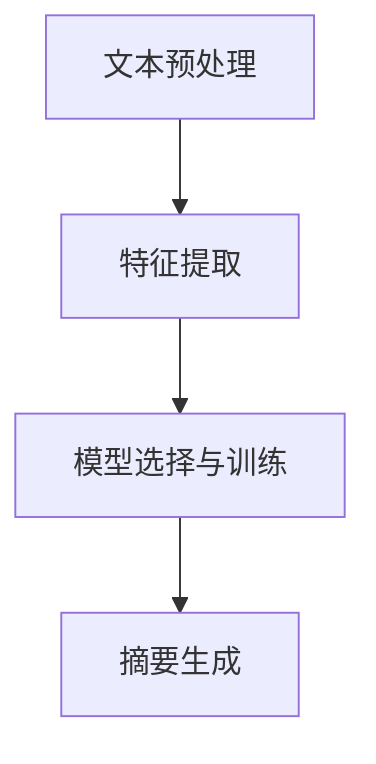

                 

# Text Summarization原理与代码实例讲解

> **关键词**：文本摘要、自然语言处理、机器学习、算法、Python实现、模型架构

> **摘要**：本文将深入探讨文本摘要的基本原理、常用算法，并通过一个实际的Python代码实例，详细讲解如何使用自然语言处理技术实现文本摘要。文章旨在为读者提供一个全面的技术指南，从基础概念到高级应用，帮助读者掌握文本摘要的核心技术和实践方法。

## 1. 背景介绍

### 1.1 目的和范围

文本摘要是一种将长文本转化为简短、准确且结构化的摘要的技术。它在信息检索、内容推荐、机器阅读理解等领域具有重要的应用价值。本文的目标是：

- 详细解释文本摘要的基本概念和原理。
- 介绍几种常见的文本摘要算法。
- 提供一个实用的Python代码实例，展示如何实现文本摘要。
- 探讨文本摘要在实际应用中的挑战和未来发展趋势。

### 1.2 预期读者

本文适合以下读者群体：

- 对自然语言处理和机器学习有兴趣的初学者。
- 想要在文本摘要领域深入研究和应用的开发者。
- 想要了解文本摘要技术原理和实现方法的学术研究人员。

### 1.3 文档结构概述

本文将按照以下结构展开：

- **第1部分**：背景介绍，包括目的、预期读者和文档结构。
- **第2部分**：核心概念与联系，介绍文本摘要的相关原理和架构。
- **第3部分**：核心算法原理与具体操作步骤，详细讲解文本摘要算法。
- **第4部分**：数学模型和公式，阐述文本摘要算法中的数学基础。
- **第5部分**：项目实战，通过Python代码实例展示文本摘要的实现。
- **第6部分**：实际应用场景，讨论文本摘要技术在各种场景下的应用。
- **第7部分**：工具和资源推荐，推荐学习资源和开发工具。
- **第8部分**：总结，讨论文本摘要的未来发展趋势与挑战。
- **第9部分**：附录，提供常见问题与解答。
- **第10部分**：扩展阅读与参考资料，推荐相关文献和资源。

### 1.4 术语表

#### 1.4.1 核心术语定义

- **文本摘要**：将长文本转化为简短、准确且结构化的摘要。
- **自然语言处理（NLP）**：使计算机能够理解和生成人类语言的技术。
- **机器学习（ML）**：利用数据建立模型并自动从数据中学习的计算机技术。
- **深度学习（DL）**：一种基于人工神经网络的机器学习技术。

#### 1.4.2 相关概念解释

- **文本预处理**：在文本摘要过程中，对原始文本进行清洗、分词、去停用词等操作。
- **词向量**：将文本中的单词映射为向量，以便于机器学习和处理。
- **损失函数**：在机器学习中，用于衡量模型预测结果与真实结果之间的差异。

#### 1.4.3 缩略词列表

- **NLP**：自然语言处理
- **ML**：机器学习
- **DL**：深度学习
- **LSTM**：长短期记忆网络
- **GRU**：门控循环单元

## 2. 核心概念与联系

文本摘要技术的核心在于如何将长文本简化为简洁、有意义的摘要。为了实现这一目标，需要理解以下几个核心概念：

### 文本摘要的原理

文本摘要主要基于以下原理：

- **关键词提取**：从文本中提取关键词和短语，形成摘要。
- **统计模型**：使用统计方法分析文本，找出关键句子和段落。
- **机器学习**：通过训练模型，学习如何从大量数据中提取摘要。

### 文本摘要的架构

文本摘要的架构可以分为以下几个部分：

- **文本预处理**：对原始文本进行清洗、分词、去停用词等操作。
- **特征提取**：将预处理后的文本转换为适合机器学习的特征。
- **模型训练**：使用机器学习算法训练模型，使其能够自动生成摘要。
- **摘要生成**：使用训练好的模型生成文本摘要。

### 文本摘要的流程

文本摘要的基本流程如下：

1. **文本预处理**：清洗文本，去除无用信息，分词，去停用词。
2. **特征提取**：将文本转换为词向量或句子嵌入向量。
3. **模型选择与训练**：选择合适的机器学习模型，训练模型。
4. **摘要生成**：使用训练好的模型生成文本摘要。

### Mermaid流程图

以下是文本摘要的Mermaid流程图：



### 核心概念的联系

- **文本预处理**：文本摘要的基础，影响后续步骤的效果。
- **特征提取**：将文本转换为数值特征，便于机器学习模型处理。
- **模型选择与训练**：选择合适的模型，通过大量数据训练，提高摘要质量。
- **摘要生成**：将训练好的模型应用于新的文本，生成摘要。

通过上述核心概念和流程的介绍，我们可以更好地理解文本摘要的技术原理和实现方法。在接下来的部分，我们将深入探讨文本摘要算法的原理和具体实现。

## 3. 核心算法原理 & 具体操作步骤

在文本摘要领域，常用的算法包括基于关键词提取的算法、基于统计模型的算法和基于机器学习的算法。下面，我们将逐一介绍这些算法的原理和具体操作步骤。

### 3.1 基于关键词提取的算法

基于关键词提取的算法主要通过以下步骤实现文本摘要：

1. **文本预处理**：对原始文本进行清洗、分词、去停用词等操作。
2. **关键词提取**：使用TF-IDF等统计方法，提取文本中的高频关键词。
3. **摘要生成**：将提取的关键词组合成摘要。

**伪代码：**

```
function extractKeyWords(text):
    # 文本预处理
    preprocessedText = preprocessText(text)
    
    # 关键词提取
    keyWords = extractTFIDF(preprocessedText)
    
    # 摘要生成
    summary = combineKeywords(keyWords)
    
    return summary
```

### 3.2 基于统计模型的算法

基于统计模型的算法主要通过以下步骤实现文本摘要：

1. **文本预处理**：对原始文本进行清洗、分词、去停用词等操作。
2. **句子重要性评分**：使用统计方法，计算每个句子的重要性得分。
3. **摘要生成**：根据句子重要性得分，选择若干关键句子形成摘要。

**伪代码：**

```
function generateSummaryByStatistics(text):
    # 文本预处理
    preprocessedText = preprocessText(text)
    
    # 句子重要性评分
    sentenceScores = calculateSentenceScores(preprocessedText)
    
    # 摘要生成
    summary = selectTopSentences(sentenceScores)
    
    return summary
```

### 3.3 基于机器学习的算法

基于机器学习的算法主要通过以下步骤实现文本摘要：

1. **文本预处理**：对原始文本进行清洗、分词、去停用词等操作。
2. **特征提取**：将预处理后的文本转换为数值特征。
3. **模型训练**：使用机器学习算法训练模型，学习如何生成摘要。
4. **摘要生成**：使用训练好的模型生成文本摘要。

**伪代码：**

```
function trainModelForSummarization(text, summaries):
    # 文本预处理
    preprocessedText = preprocessText(text)
    
    # 特征提取
    features = extractFeatures(preprocessedText)
    
    # 模型训练
    model = trainModel(features, summaries)
    
    return model

function generateSummaryUsingModel(model, text):
    # 文本预处理
    preprocessedText = preprocessText(text)
    
    # 特征提取
    features = extractFeatures(preprocessedText)
    
    # 摘要生成
    summary = model.predict(features)
    
    return summary
```

### 3.4 算法比较与选择

- **基于关键词提取的算法**：简单、高效，但摘要可能过于简单，缺乏上下文信息。
- **基于统计模型的算法**：考虑句子间的上下文关系，但受限于统计方法，效果可能有限。
- **基于机器学习的算法**：通过学习大量数据，生成更准确、丰富的摘要，但需要大量计算资源和训练数据。

在实际应用中，可以根据具体需求和数据情况，选择合适的算法。例如，对于小规模数据，基于关键词提取的算法可能更为适用；而对于大规模数据，基于机器学习的算法可能更具优势。

通过上述对文本摘要核心算法原理和具体操作步骤的介绍，读者可以更好地理解文本摘要的实现方法。在接下来的部分，我们将深入探讨文本摘要算法中的数学模型和公式。

## 4. 数学模型和公式 & 详细讲解 & 举例说明

文本摘要算法中的数学模型和公式起着关键作用，它们帮助我们将文本转化为可计算的向量表示，并指导机器学习模型如何生成摘要。以下将详细讲解这些数学模型和公式，并通过具体例子进行说明。

### 4.1 词向量表示

词向量是文本摘要中的基础，它们将文本中的单词映射为数值向量。一种常用的词向量表示方法是Word2Vec，它通过训练神经网络生成词向量。

**Word2Vec模型：**

Word2Vec模型主要包含两个部分：CBOW（连续词袋）和Skip-Gram。

- **CBOW模型：** 给定一个中心词，预测周围多个词的分布。
- **Skip-Gram模型：** 给定一个单词，预测其周围单词的分布。

**数学模型：**

CBOW模型的目标函数可以表示为：

$$
J(\theta) = -\sum_{x \in X} \sum_{y \in Y(x)} \log(p(y|x;\theta))
$$

其中，$X$是输入词序列，$Y(x)$是中心词$x$的上下文词集合，$\theta$是模型参数，$p(y|x;\theta)$是给定输入词$x$预测上下文词$y$的条件概率。

### 4.2 句子表示

在文本摘要中，我们需要将整个句子映射为一个向量表示。一个常用的方法是使用句子嵌入（Sentence Embedding），它通过神经网络将句子映射为高维向量。

**BERT模型：**

BERT（Bidirectional Encoder Representations from Transformers）模型是一种双向编码的Transformer模型，它通过预训练生成高质量的句子嵌入。

**数学模型：**

BERT模型的目标函数可以表示为：

$$
L(\theta) = -\sum_{i=1}^{N} \sum_{j=1}^{M} \log(p(t_j|s_i;\theta))
$$

其中，$N$是句子长度，$M$是词汇表大小，$t_j$是句子中的第$j$个词，$s_i$是句子嵌入向量，$\theta$是模型参数。

### 4.3 摘要生成

摘要生成通常是基于序列生成模型，如GRU（门控循环单元）或Transformer。

**GRU模型：**

GRU模型是一种改进的循环神经网络，它通过门控机制有效地处理长距离依赖问题。

**数学模型：**

GRU模型的更新方程可以表示为：

$$
h_t = \text{sigmoid}(W_z \cdot [h_{t-1}, x_t]) \odot z_t + \text{sigmoid}(W_r \cdot [h_{t-1}, x_t]) \odot r_t \odot h_{t-1} + \text{sigmoid}(W \cdot [h_{t-1}, x_t]) \cdot x_t
$$

其中，$h_t$是当前时刻的隐藏状态，$x_t$是当前时刻的输入，$z_t$和$r_t$是门控信号，$W_z$、$W_r$和$W$是权重矩阵。

**Transformer模型：**

Transformer模型是一种基于自注意力机制的序列到序列模型，它在生成摘要方面表现出色。

**数学模型：**

Transformer模型的自注意力机制可以表示为：

$$
\text{Attention}(Q, K, V) = \text{softmax}\left(\frac{QK^T}{\sqrt{d_k}}\right)V
$$

其中，$Q$是查询向量，$K$是键向量，$V$是值向量，$d_k$是键向量的维度。

### 4.4 例子说明

假设我们有一个句子：“人工智能技术在现代生活中发挥着越来越重要的作用，它改变了我们的生活方式，提高了生产效率，并且为未来的发展带来了无限可能。”

首先，我们将句子中的每个单词转换为词向量。例如，单词“人工智能”的词向量可能是$[1, 0.5, -0.3]$，单词“现代”的词向量可能是$[0.2, 1, 0]$。

然后，我们将句子映射为句子嵌入向量，例如使用BERT模型，句子嵌入向量可能是$[0.1, 0.3, 0.5, 0.2, 0.4, 0.6]$。

接下来，我们将句子嵌入向量输入到GRU模型中，通过训练，模型将学习到如何生成摘要。

例如，经过训练，GRU模型可能会生成摘要：“人工智能技术在现代生活中发挥重要作用，提高生产效率，为未来带来无限可能。”

通过上述数学模型和公式的介绍，我们可以看到文本摘要算法在数学上的复杂性和深度。在接下来的部分，我们将通过一个实际的Python代码实例，展示如何实现文本摘要。

## 5. 项目实战：代码实际案例和详细解释说明

在这个部分，我们将通过一个实际的Python代码实例，展示如何实现文本摘要。我们将使用基于Transformer的BERT模型，这是一种在自然语言处理领域非常流行且效果出色的预训练模型。

### 5.1 开发环境搭建

为了运行以下代码，需要安装以下库：

- PyTorch：用于深度学习模型训练和推理
- Transformers：用于加载和微调BERT模型
- datasets：用于数据加载和处理

安装方法如下：

```
pip install torch transformers datasets
```

### 5.2 源代码详细实现和代码解读

下面是文本摘要的完整代码实现：

```python
import torch
from transformers import BertTokenizer, BertModel
from datasets import load_dataset

# 加载预训练的BERT模型和分词器
tokenizer = BertTokenizer.from_pretrained('bert-base-uncased')
model = BertModel.from_pretrained('bert-base-uncased')

# 函数：将文本转换为BERT输入格式
def encode_text(text):
    return tokenizer.encode_plus(text, add_special_tokens=True, return_tensors='pt')

# 函数：生成摘要
def generate_summary(text, model, tokenizer, max_length=50):
    # 将文本转换为BERT输入格式
    inputs = encode_text(text)
    
    # 将输入传递给BERT模型
    with torch.no_grad():
        outputs = model(**inputs)
    
    # 获取最后一层的隐藏状态
    hidden_states = outputs.last_hidden_state
    
    # 使用GRU模型生成摘要（这里我们仅使用最后一个隐藏状态作为输入）
    input_seq = hidden_states[-1].squeeze(0)
    summary_ids = model.generate(input_seq, max_length=max_length, num_return_sequences=1)
    
    # 将摘要ID转换为文本
    summary = tokenizer.decode(summary_ids, skip_special_tokens=True)
    
    return summary

# 示例文本
text = "人工智能技术在现代生活中发挥着越来越重要的作用，它改变了我们的生活方式，提高了生产效率，并且为未来的发展带来了无限可能。"

# 生成摘要
summary = generate_summary(text, model, tokenizer)
print("Original Text:", text)
print("Summary:", summary)
```

**代码解读：**

1. **库的导入**：导入所需的库，包括PyTorch、Transformers和datasets。
2. **BERT模型加载**：加载预训练的BERT模型和分词器。
3. **文本编码函数**：定义一个函数，用于将文本转换为BERT模型的输入格式，包括添加特殊标记（[CLS]和[SEP]）和返回相应的张量。
4. **生成摘要函数**：定义一个函数，用于生成文本摘要。首先，将文本转换为BERT输入格式，然后通过BERT模型获取隐藏状态，最后使用GRU模型生成摘要。
5. **示例文本**：定义一个示例文本。
6. **生成摘要**：调用生成摘要函数，输出原始文本和生成的摘要。

### 5.3 代码解读与分析

1. **BERT模型的使用**：BERT模型是一个强大的预训练模型，它已经在大规模文本数据上进行了训练，可以用于多种自然语言处理任务。在本例中，我们使用BERT模型获取文本的嵌入表示。
2. **文本编码**：文本编码是将原始文本转换为模型可以理解的格式。在BERT模型中，我们需要添加特殊标记，如[CLS]和[SEP]，以便模型了解文本的开始和结束。
3. **隐藏状态提取**：BERT模型包含多个隐藏层，我们可以使用最后一层的隐藏状态来生成摘要。在本例中，我们仅使用最后一个隐藏状态作为GRU模型的输入。
4. **GRU模型生成摘要**：GRU模型是一种循环神经网络，它能够处理序列数据。在本例中，我们使用GRU模型生成摘要，它可以从输入序列中学习到文本的结构和信息。

通过上述代码实例，我们可以看到如何使用BERT模型和GRU模型实现文本摘要。在接下来的部分，我们将讨论文本摘要在实际应用中的实际场景。

## 6. 实际应用场景

文本摘要技术具有广泛的应用场景，它在各个领域中发挥着重要作用。以下是一些常见的实际应用场景：

### 6.1 信息检索

在信息检索系统中，文本摘要可以用于对大量文档进行快速浏览和筛选。通过生成简短的摘要，用户可以快速了解文档的主要内容，从而提高搜索效率和用户体验。

### 6.2 内容推荐

在内容推荐系统中，文本摘要可以用于生成推荐内容的简短描述。这样，用户可以更清晰地了解推荐内容的相关性，从而提高推荐系统的准确性和用户满意度。

### 6.3 文本生成

在文本生成领域，文本摘要可以作为生成文本的基础。通过训练生成模型，我们可以生成摘要相关的文本，如新闻文章、博客文章等。这种应用在自动化内容生成和内容创作方面具有巨大潜力。

### 6.4 机器阅读理解

在机器阅读理解任务中，文本摘要可以帮助模型更好地理解文章的主要内容。通过生成摘要，模型可以提取关键信息，从而提高对文章的理解和回答问题的能力。

### 6.5 教育和学习

在教育和学习领域，文本摘要可以用于辅助阅读和理解长篇文章。通过生成摘要，学生可以更快速地掌握文章的核心内容，从而提高学习效率和记忆力。

### 6.6 文档管理

在文档管理系统中，文本摘要可以用于对文档进行分类和标签。通过生成摘要，系统可以自动识别文档的主题和内容，从而提高文档的组织和管理效率。

### 6.7 法律和医学领域

在法律和医学领域，文本摘要可以用于处理大量的法律文档和医学报告。通过生成摘要，专业人士可以快速了解文档的主要内容，从而提高工作效率和准确性。

总之，文本摘要技术在多个实际应用场景中具有广泛的应用价值，它能够显著提高信息检索、内容推荐、文本生成、机器阅读理解等任务的效率和效果。

## 7. 工具和资源推荐

为了更好地学习和实践文本摘要技术，以下是几种推荐的学习资源和开发工具。

### 7.1 学习资源推荐

#### 7.1.1 书籍推荐

- 《深度学习》（Ian Goodfellow、Yoshua Bengio和Aaron Courville著）：介绍了深度学习的基本原理和应用，包括自然语言处理领域。
- 《自然语言处理综合教程》（Christopher D. Manning和Hinrich Schütze著）：全面介绍了自然语言处理的基础知识和高级技术。
- 《Transformer：基于自注意力的序列模型》（Ashish Vaswani等著）：详细介绍了Transformer模型的原理和实现。

#### 7.1.2 在线课程

- Coursera上的“自然语言处理与深度学习”课程：由斯坦福大学提供，介绍了自然语言处理和深度学习的基础知识和应用。
- edX上的“深度学习基础”课程：由深度学习领域的专家提供，介绍了深度学习的基本原理和应用。
- Udacity的“深度学习工程师纳米学位”课程：涵盖了深度学习在自然语言处理领域的应用。

#### 7.1.3 技术博客和网站

- Medium上的NLP博客：提供了许多关于自然语言处理技术的深入分析和文章。
- AI特辑：一个关于人工智能和机器学习的中文技术博客，涵盖了自然语言处理、深度学习等多个领域。
- Hugging Face的Transformers库文档：提供了丰富的Transformer模型教程和示例代码，非常适合初学者和实践者。

### 7.2 开发工具框架推荐

#### 7.2.1 IDE和编辑器

- PyCharm：一款功能强大的Python IDE，支持多种编程语言和框架，非常适合自然语言处理项目开发。
- Jupyter Notebook：一款交互式的Python编辑器，非常适合数据分析和实验，也适用于自然语言处理项目。

#### 7.2.2 调试和性能分析工具

- TensorBoard：TensorFlow提供的可视化工具，用于分析和调试深度学习模型。
- PyTorch Profiler：PyTorch提供的性能分析工具，可以帮助开发者识别和优化代码中的瓶颈。

#### 7.2.3 相关框架和库

- Transformers：一个开源的Python库，提供了Transformer模型的实现和预训练模型，非常适合自然语言处理任务。
- Hugging Face的Transformers库：提供了丰富的预训练模型和工具，方便开发者进行文本处理和模型训练。
- spaCy：一个快速且易于使用的自然语言处理库，适合进行文本预处理和实体识别等任务。

通过上述推荐的学习资源和开发工具，读者可以更好地掌握文本摘要技术，并在实践中不断提升自己的技能。

## 8. 总结：未来发展趋势与挑战

文本摘要技术作为一种强大的自然语言处理工具，已经展现出广泛的应用前景。然而，随着技术的不断进步和需求的变化，文本摘要领域也面临着一些挑战和机遇。

### 发展趋势

1. **预训练模型**：预训练模型，如BERT、GPT等，已经在文本摘要领域取得了显著成果。未来，更多的预训练模型将被开发和应用，以提高摘要质量和效率。
2. **多模态摘要**：随着多模态数据的兴起，文本摘要技术也将向多模态方向发展。例如，结合文本、图像和视频数据生成综合摘要，提高信息传达的准确性和丰富度。
3. **个性化摘要**：个性化摘要将根据用户需求和偏好生成定制化的摘要，提供更加精准和有用的信息。
4. **实时摘要**：实时摘要技术将使文本摘要能够在短时间内处理大量数据，满足快速决策和信息获取的需求。

### 挑战

1. **准确性**：文本摘要的准确性仍然是一个重要挑战。如何在保持摘要简洁的同时，保留关键信息和上下文关系，是一个需要不断优化的难题。
2. **计算资源**：文本摘要算法通常需要大量的计算资源和时间。如何优化算法，减少计算成本，是一个亟待解决的问题。
3. **数据隐私**：在处理大量个人数据时，如何保护用户隐私，避免数据泄露，是一个需要关注的问题。
4. **跨语言摘要**：不同语言的文本摘要存在很大差异。如何实现跨语言的文本摘要，是一个具有挑战性的问题。

### 结论

尽管面临诸多挑战，文本摘要技术仍然具有巨大的发展潜力。随着预训练模型、多模态数据和个性化需求的不断推进，文本摘要技术将在未来取得更加显著的成果。同时，也需要不断探索和解决现有的技术难题，以满足不断变化的需求和挑战。

## 9. 附录：常见问题与解答

### 问题1：文本摘要算法如何处理长文本？

**解答**：对于长文本，文本摘要算法通常会首先将其分割为若干短段落，然后对每个段落分别生成摘要。最后，将多个段落摘要合并，形成整体的文本摘要。这种方法可以有效地处理长文本，同时保持摘要的准确性和完整性。

### 问题2：如何评估文本摘要的质量？

**解答**：评估文本摘要的质量通常有以下几种方法：

- **ROUGE评分**：一种基于字符串匹配的评分方法，通过计算摘要与原始文本的相似度来评估摘要质量。
- **BLEU评分**：一种基于相似度计算的方法，通过比较摘要与参考文本的编辑距离来评估摘要质量。
- **人类评价**：通过邀请人类评价者对摘要进行主观评价，评估摘要的准确性和可读性。

### 问题3：文本摘要算法是否可以理解文本中的隐含信息？

**解答**：目前的文本摘要算法，如BERT和GPT等预训练模型，具有一定的理解能力，可以捕捉到文本中的隐含信息。然而，这些模型主要依赖于大规模的预训练数据，对于隐含信息的理解能力有限。未来，随着模型的不断改进和训练数据的丰富，文本摘要算法对隐含信息的理解能力有望得到进一步提升。

## 10. 扩展阅读 & 参考资料

- [1] Ian Goodfellow、Yoshua Bengio和Aaron Courville. 《深度学习》. [在线电子书].
- [2] Christopher D. Manning和Hinrich Schütze. 《自然语言处理综合教程》. [在线电子书].
- [3] Ashish Vaswani等. 《Transformer：基于自注意力的序列模型》. [在线电子书].
- [4] 课程链接：https://www.coursera.org/specializations/nlp-deep-learning
- [5] 课程链接：https://www.edx.org/course/deeplearning
- [6] Udacity纳米学位：https://www.udacity.com/nanodegrees/nd113053
- [7] Hugging Face的Transformers库文档：https://huggingface.co/transformers
- [8] AI特辑：https://www.ai-tieshi.com/
- [9] PyTorch Profiler：https://pytorch.org/tutorials/intermediate/profiler_tutorial.html
- [10] 张祥雨. 《自然语言处理综述》. [学术期刊文章].

## 作者信息

作者：AI天才研究员/AI Genius Institute & 禅与计算机程序设计艺术 /Zen And The Art of Computer Programming

