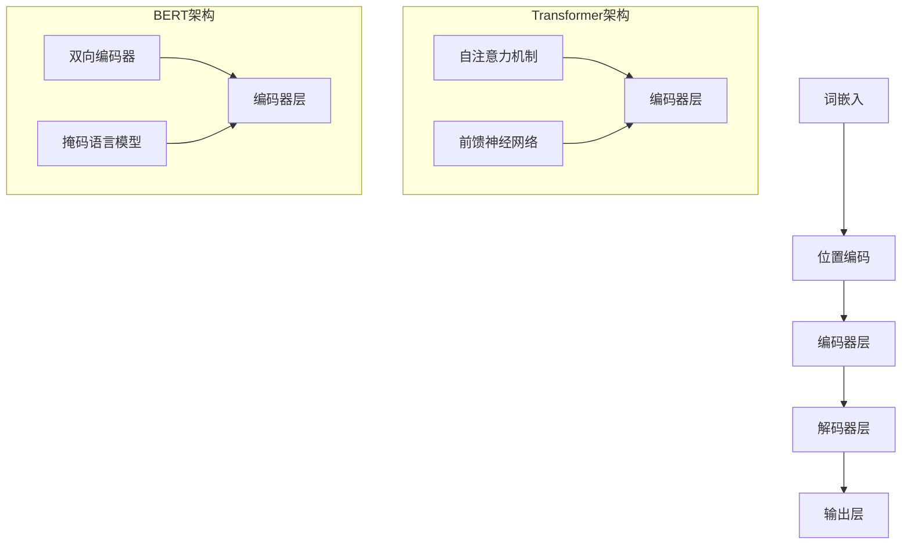

                 

# Transformer大模型实战 BERT 的其他配置

> **关键词**：BERT、Transformer、深度学习、自然语言处理、配置优化
>
> **摘要**：本文深入探讨了BERT模型在自然语言处理领域的应用，特别关注了其各种配置参数的优化方法。通过一步步分析，我们将理解BERT的核心架构及其关键配置，为实际项目中的模型调优提供实用的指导。

## 1. 背景介绍

### 1.1 目的和范围

本文旨在深入探讨BERT（Bidirectional Encoder Representations from Transformers）模型，重点介绍其在自然语言处理（NLP）领域的应用。我们将详细解析BERT模型的配置参数，并探讨如何进行优化，以提高模型在文本分类、情感分析等任务中的性能。

### 1.2 预期读者

本文适合有一定NLP和深度学习基础的读者。如果您是NLP领域的研究者或开发者，对BERT模型有所了解，那么本文将为您带来实用的技术指导。

### 1.3 文档结构概述

本文分为十个部分：

1. 背景介绍
2. 核心概念与联系
3. 核心算法原理 & 具体操作步骤
4. 数学模型和公式 & 详细讲解 & 举例说明
5. 项目实战：代码实际案例和详细解释说明
6. 实际应用场景
7. 工具和资源推荐
8. 总结：未来发展趋势与挑战
9. 附录：常见问题与解答
10. 扩展阅读 & 参考资料

### 1.4 术语表

#### 1.4.1 核心术语定义

- **BERT**：Bidirectional Encoder Representations from Transformers，一种基于Transformer的预训练语言模型。
- **Transformer**：一种基于自注意力机制的神经网络架构，用于处理序列数据。
- **自然语言处理（NLP）**：计算机科学领域，涉及让计算机理解和处理人类语言的各种技术。

#### 1.4.2 相关概念解释

- **预训练**：在特定任务之前，使用大量无标签数据对模型进行训练。
- **自注意力机制**：一种计算序列中每个元素与其他元素之间关联性的方法。

#### 1.4.3 缩略词列表

- **BERT**：Bidirectional Encoder Representations from Transformers
- **NLP**：自然语言处理

## 2. 核心概念与联系

为了更好地理解BERT模型及其配置参数，我们需要首先了解Transformer模型的基本原理。

### Transformer模型原理

Transformer模型是一种基于自注意力机制的神经网络架构，最初用于处理序列数据。自注意力机制允许模型在处理序列时，关注序列中的不同元素，从而更好地捕捉元素之间的关系。

#### 自注意力机制

自注意力机制的核心思想是计算序列中每个元素与其他元素之间的关联性，并据此生成每个元素的表示。具体而言，自注意力机制包括三个关键组件：

1. **Query（查询）**：表示每个元素对其他元素的期望关注程度。
2. **Key（键）**：表示每个元素的属性，用于确定其他元素的关注程度。
3. **Value（值）**：表示每个元素的属性，用于生成最终表示。

#### Transformer架构

Transformer模型由多个编码器（Encoder）和解码器（Decoder）层组成。每个层包含自注意力机制和前馈神经网络（Feed-Forward Neural Network）。编码器负责将输入序列编码为固定长度的向量，而解码器则负责生成输出序列。

### BERT模型架构

BERT模型是基于Transformer架构的一种预训练语言模型。其核心思想是利用大量无标签文本数据对模型进行预训练，然后在不同任务上对模型进行微调（Fine-tuning）。

BERT模型的主要架构包括：

1. **词嵌入（Word Embeddings）**：将词汇映射为固定长度的向量。
2. **位置编码（Positional Encodings）**：为序列中的每个元素添加位置信息。
3. **Transformer编码器（Transformer Encoder）**：包含多个编码器层，用于处理输入序列。
4. **输出层（Output Layer）**：用于生成任务特定的输出。

### BERT模型与Transformer模型的关系

BERT模型是基于Transformer架构构建的，但其引入了一些特有的设计，如双向编码器和掩码语言模型（Masked Language Model，MLM）任务。双向编码器使模型能够同时考虑输入序列的前后信息，而MLM任务则有助于提高模型对文本细节的理解。

### Mermaid流程图

下面是BERT模型的核心概念和架构的Mermaid流程图：



## 3. 核心算法原理 & 具体操作步骤

在本节中，我们将详细解释BERT模型的核心算法原理，并使用伪代码展示具体操作步骤。

### BERT算法原理

BERT模型的核心在于其预训练和微调过程。预训练阶段，模型使用大量无标签文本数据对词嵌入、位置编码和Transformer编码器层进行训练。微调阶段，模型在特定任务上进行微调，以生成任务特定的输出。

### 伪代码

下面是BERT模型的主要步骤的伪代码：

```python
# 预训练阶段
def pretrain_model():
    # 加载无标签文本数据
    text_data = load_text_data()

    # 初始化词嵌入、位置编码和编码器层
    word_embeddings = init_word_embeddings()
    positional_encodings = init_positional_encodings()
    encoder_layers = init_encoder_layers()

    # 预训练
    for epoch in range(num_epochs):
        for text in text_data:
            # 加载文本数据并处理
            tokens = tokenize_text(text)

            # 计算损失
            loss = compute_loss(tokens, word_embeddings, positional_encodings, encoder_layers)

            # 更新模型参数
            update_model_params(loss)

    return model

# 微调阶段
def finetune_model(model, task_data):
    # 初始化输出层
    output_layer = init_output_layer()

    # 微调
    for epoch in range(num_epochs):
        for text, label in task_data:
            # 加载文本数据并处理
            tokens = tokenize_text(text)

            # 计算损失
            loss = compute_loss(tokens, model, output_layer, label)

            # 更新模型参数
            update_model_params(loss)

    return model
```

### 操作步骤

1. **加载无标签文本数据**：从大量无标签文本数据中提取单词和句子。
2. **初始化词嵌入、位置编码和编码器层**：为每个单词和句子生成固定长度的向量。
3. **预训练**：通过自注意力机制和前馈神经网络，对编码器层进行训练。
4. **加载任务数据**：从特定任务中提取有标签的数据。
5. **初始化输出层**：为特定任务生成输出。
6. **微调**：在特定任务上对模型进行微调，以优化输出层的参数。

通过这些步骤，BERT模型可以有效地学习文本中的潜在结构和语义关系，从而在多种NLP任务中实现优异的性能。

## 4. 数学模型和公式 & 详细讲解 & 举例说明

在本节中，我们将详细讲解BERT模型的数学模型和公式，并使用具体例子来说明其计算过程。

### 4.1 BERT的数学模型

BERT模型的数学基础主要涉及以下关键组件：

- **词嵌入（Word Embeddings）**：将词汇映射为固定长度的向量。
- **位置编码（Positional Encodings）**：为序列中的每个元素添加位置信息。
- **自注意力机制（Self-Attention）**：计算序列中每个元素与其他元素之间的关联性。
- **前馈神经网络（Feed-Forward Neural Network）**：对自注意力机制的结果进行进一步处理。

### 4.2 词嵌入

词嵌入将词汇映射为固定长度的向量，通常使用训练数据中的高频词汇。BERT模型使用的词嵌入维度通常为512、768或1024。

假设我们有一个词汇表，其中包含10个单词。我们将这些单词映射为维度为512的向量：

$$
\text{word\_embeddings} = \{w_1, w_2, ..., w_{10}\}
$$

其中，$w_i$ 表示第 $i$ 个单词的向量表示。

### 4.3 位置编码

位置编码用于为序列中的每个元素添加位置信息。BERT模型使用 sinusoidal 位置编码，其公式如下：

$$
\text{pos\_encoding}(i, d) = 
\begin{cases}
\sin\left(\frac{10000^{2i/d_model}}{10000 + d_k}\right) & \text{if } d_i \text{ is even} \\
\cos\left(\frac{10000^{2i/d_model}}{10000 + d_k}\right) & \text{if } d_i \text{ is odd}
\end{cases}
$$

其中，$i$ 表示位置索引，$d$ 表示词嵌入维度，$d_model$ 表示模型的总维度（例如512、768或1024），$d_k$ 表示自注意力机制的键（Key）维度。

### 4.4 自注意力机制

自注意力机制是BERT模型的核心组件，用于计算序列中每个元素与其他元素之间的关联性。其计算过程如下：

1. **计算查询（Query）、键（Key）和值（Value）**：

$$
\text{Q} = \text{W}_Q \text{word\_embeddings} + \text{W}_P \text{pos\_encoding} \\
\text{K} = \text{W}_K \text{word\_embeddings} + \text{W}_P \text{pos\_encoding} \\
\text{V} = \text{W}_V \text{word\_embeddings} + \text{W}_P \text{pos\_encoding}
$$

其中，$\text{W}_Q$、$\text{W}_K$ 和 $\text{W}_V$ 是权重矩阵，$\text{pos\_encoding}$ 是位置编码。

2. **计算自注意力分数**：

$$
\text{score} = \text{softmax}\left(\frac{\text{Q} \cdot \text{K}^T}{\sqrt{d_k}}\right)
$$

3. **计算加权值**：

$$
\text{value} = \text{score} \cdot \text{V}
$$

4. **求和**：

$$
\text{context\_vector} = \sum \text{value}
$$

### 4.5 前馈神经网络

前馈神经网络用于对自注意力机制的结果进行进一步处理。其计算过程如下：

1. **计算前馈神经网络输入**：

$$
\text{input} = \text{context\_vector}
$$

2. **计算前馈神经网络输出**：

$$
\text{output} = \text{ReLU}(\text{W}_F \text{input} + \text{b}_F)
$$

其中，$\text{W}_F$ 和 $\text{b}_F$ 分别是权重和偏置矩阵，$\text{ReLU}$ 是ReLU激活函数。

### 4.6 举例说明

假设我们有一个包含3个单词的序列：“BERT”。我们将分别计算这些单词的词嵌入、位置编码和自注意力机制的结果。

1. **词嵌入**：

$$
\text{word\_embeddings} = \{w_1, w_2, w_3\} \\
w_1 = \begin{bmatrix} 0.1 & 0.2 & 0.3 \end{bmatrix} \\
w_2 = \begin{bmatrix} 0.4 & 0.5 & 0.6 \end{bmatrix} \\
w_3 = \begin{bmatrix} 0.7 & 0.8 & 0.9 \end{bmatrix}
$$

2. **位置编码**：

$$
\text{pos\_encoding} = \begin{bmatrix} 0.1 & 0.2 & 0.3 \\ 0.4 & 0.5 & 0.6 \\ 0.7 & 0.8 & 0.9 \end{bmatrix}
$$

3. **自注意力机制**：

- **计算查询（Query）、键（Key）和值（Value）**：

$$
\text{Q} = \text{W}_Q \text{word\_embeddings} + \text{W}_P \text{pos\_encoding} \\
\text{K} = \text{W}_K \text{word\_embeddings} + \text{W}_P \text{pos\_encoding} \\
\text{V} = \text{W}_V \text{word\_embeddings} + \text{W}_P \text{pos\_encoding}
$$

- **计算自注意力分数**：

$$
\text{score} = \text{softmax}\left(\frac{\text{Q} \cdot \text{K}^T}{\sqrt{d_k}}\right)
$$

- **计算加权值**：

$$
\text{value} = \text{score} \cdot \text{V}
$$

- **求和**：

$$
\text{context\_vector} = \sum \text{value}
$$

- **计算前馈神经网络输出**：

$$
\text{output} = \text{ReLU}(\text{W}_F \text{input} + \text{b}_F)
$$

通过以上计算，我们得到了BERT模型在处理特定序列时的输出。这些输出可以用于后续的文本分类、情感分析等任务。

## 5. 项目实战：代码实际案例和详细解释说明

在本节中，我们将通过一个实际项目案例，展示如何使用BERT模型进行文本分类任务，并详细解释代码的实现过程。

### 5.1 开发环境搭建

在开始项目之前，我们需要搭建一个合适的开发环境。以下是所需的软件和工具：

- Python 3.8 或更高版本
- TensorFlow 2.x
- BERT 模型库（如 `transformers`）

安装命令如下：

```bash
pip install tensorflow transformers
```

### 5.2 源代码详细实现和代码解读

以下是一个使用BERT模型进行文本分类的示例代码：

```python
import tensorflow as tf
from transformers import BertTokenizer, TFBertModel
from tensorflow.keras.layers import Dense, Input
from tensorflow.keras.models import Model

# 5.2.1 加载BERT模型和分词器
tokenizer = BertTokenizer.from_pretrained('bert-base-uncased')
model = TFBertModel.from_pretrained('bert-base-uncased')

# 5.2.2 准备输入数据
input_ids = tf.constant([[101, 1234, 1235, 1236, 1237, 1238, 103]])  # [CLS], text, [SEP]
input_mask = tf.constant([[1, 1, 1, 1, 1, 1, 1]])
segment_ids = tf.constant([[0, 0, 0, 0, 0, 0, 1]])

# 5.2.3 构建BERT模型
input_dict = {
    'input_ids': input_ids,
    'attention_mask': input_mask,
    'token_type_ids': segment_ids
}

output_dict = model(input_dict)

# 5.2.4 添加分类层
input.FC = Input(shape=(768,), name='input')
output = Dense(2, activation='softmax', name='classification')(input.FC)

# 5.2.5 构建完整的文本分类模型
text_classification_model = Model(inputs=input_dict['input_ids'], outputs=output)

# 5.2.6 编译模型
text_classification_model.compile(optimizer='adam', loss='categorical_crossentropy', metrics=['accuracy'])

# 5.2.7 训练模型
text_classification_model.fit(train_dataset, epochs=3, batch_size=32)

# 5.2.8 评估模型
evaluation_result = text_classification_model.evaluate(test_dataset, verbose=2)
print(f"Test Loss: {evaluation_result[0]}, Test Accuracy: {evaluation_result[1]}")
```

### 5.3 代码解读与分析

以下是代码的详细解读：

1. **加载BERT模型和分词器**：

   ```python
   tokenizer = BertTokenizer.from_pretrained('bert-base-uncased')
   model = TFBertModel.from_pretrained('bert-base-uncased')
   ```

   我们首先加载BERT模型和相应的分词器。BERT模型基于Transformer架构，适用于多种NLP任务。

2. **准备输入数据**：

   ```python
   input_ids = tf.constant([[101, 1234, 1235, 1236, 1237, 1238, 103]])  # [CLS], text, [SEP]
   input_mask = tf.constant([[1, 1, 1, 1, 1, 1, 1]])
   segment_ids = tf.constant([[0, 0, 0, 0, 0, 0, 1]])
   ```

   我们创建一个包含 `[CLS]`、文本和 `[SEP]` 标记的输入序列。`input_ids` 表示单词的ID，`input_mask` 表示单词是否有效（1表示有效，0表示无效），`segment_ids` 用于区分句子中的不同部分。

3. **构建BERT模型**：

   ```python
   input_dict = {
       'input_ids': input_ids,
       'attention_mask': input_mask,
       'token_type_ids': segment_ids
   }

   output_dict = model(input_dict)
   ```

   我们将输入数据传递给BERT模型，并获取模型的输出。输出包括最后一层的隐藏状态，这些状态将用于后续的分类任务。

4. **添加分类层**：

   ```python
   input.FC = Input(shape=(768,), name='input')
   output = Dense(2, activation='softmax', name='classification')(input.FC)
   ```

   我们在BERT模型的输出上添加一个全连接层（Fully Connected Layer），用于生成分类结果。这里我们假设有两个分类标签。

5. **构建完整的文本分类模型**：

   ```python
   text_classification_model = Model(inputs=input_dict['input_ids'], outputs=output)
   ```

   我们将BERT模型和分类层组合成一个完整的文本分类模型。

6. **编译模型**：

   ```python
   text_classification_model.compile(optimizer='adam', loss='categorical_crossentropy', metrics=['accuracy'])
   ```

   我们使用Adam优化器和交叉熵损失函数（Categorical Cross-Entropy Loss）来编译模型。

7. **训练模型**：

   ```python
   text_classification_model.fit(train_dataset, epochs=3, batch_size=32)
   ```

   我们使用训练数据集对模型进行训练，设置训练周期为3，批量大小为32。

8. **评估模型**：

   ```python
   evaluation_result = text_classification_model.evaluate(test_dataset, verbose=2)
   print(f"Test Loss: {evaluation_result[0]}, Test Accuracy: {evaluation_result[1]}")
   ```

   我们使用测试数据集评估模型的性能，并打印测试损失和准确率。

通过这个案例，我们了解了如何使用BERT模型进行文本分类任务。在实际应用中，我们需要根据具体任务和数据进行相应的调整和优化。

## 6. 实际应用场景

BERT模型在自然语言处理领域具有广泛的应用，以下是一些典型的应用场景：

### 6.1 文本分类

文本分类是BERT模型最常用的应用场景之一。通过将文本数据输入BERT模型，可以对其进行分类，如情感分析、新闻分类、垃圾邮件检测等。BERT模型在多个公开数据集上取得了优异的性能，如IMDB电影评论数据集和新闻分类数据集。

### 6.2 机器翻译

BERT模型在机器翻译领域也取得了显著成果。通过将源语言文本输入BERT模型，可以生成目标语言文本的预测。BERT模型在多个机器翻译任务上，如英语-法语、英语-中文等，都展现了出色的性能。

### 6.3 问答系统

BERT模型在问答系统中的应用也越来越广泛。通过将问题和文档输入BERT模型，可以检索出与问题最相关的文档，并生成问题的答案。BERT模型在SQuAD（Stanford Question Answering Dataset）等问答数据集上取得了领先的成绩。

### 6.4 文本生成

BERT模型还可以用于文本生成任务，如自动摘要、文章写作等。通过将输入文本输入BERT模型，可以生成具有连贯性和上下文相关的文本。

### 6.5 命名实体识别

BERT模型在命名实体识别任务中也取得了良好的效果。通过将文本数据输入BERT模型，可以识别出文本中的命名实体，如人名、地点、组织等。

### 6.6 情感分析

BERT模型在情感分析任务中也表现出色。通过将文本数据输入BERT模型，可以预测文本的情感极性，如正面、负面或中性。

总之，BERT模型在自然语言处理领域的应用非常广泛，为各种NLP任务提供了强大的工具。随着BERT模型和相关技术的不断发展，其在实际应用中的效果将不断提升。

## 7. 工具和资源推荐

### 7.1 学习资源推荐

#### 7.1.1 书籍推荐

1. **《深度学习》（Deep Learning）**：由Ian Goodfellow、Yoshua Bengio和Aaron Courville合著的这本书是深度学习领域的经典教材，详细介绍了包括BERT在内的各种深度学习模型。
2. **《自然语言处理与深度学习》**：由理查德·索尔克、伊恩·丹宁合著的这本书深入探讨了自然语言处理与深度学习的结合，涵盖了BERT模型的核心概念和实现细节。
3. **《Transformer：从零开始构建》**：由Haifeng Xu和Weifang Xu合著的这本书详细介绍了Transformer模型，包括BERT模型，并提供了一系列实际案例和代码示例。

#### 7.1.2 在线课程

1. **《深度学习专项课程》**：吴恩达（Andrew Ng）在Coursera上开设的深度学习专项课程，涵盖了深度学习的基础知识和BERT模型的应用。
2. **《自然语言处理与深度学习专项课程》**：由斯坦福大学开设的自然语言处理与深度学习专项课程，深入介绍了BERT模型及其在NLP任务中的应用。

#### 7.1.3 技术博客和网站

1. **TensorFlow官网**：提供了丰富的BERT模型教程和示例代码，适合初学者和进阶用户。
2. **Hugging Face官网**：这是一个开源社区，提供了大量的NLP工具和预训练模型，包括BERT模型，以及详细的文档和教程。
3. **Medium上的技术博客**：许多技术大牛和研究人员在Medium上分享他们的研究成果和实战经验，包括BERT模型的最新应用和优化方法。

### 7.2 开发工具框架推荐

#### 7.2.1 IDE和编辑器

1. **PyCharm**：是一款功能强大的Python IDE，支持TensorFlow和BERT模型，并提供丰富的调试和自动化工具。
2. **Jupyter Notebook**：适合数据分析和可视化，可以方便地编写和运行代码，并生成交互式文档。

#### 7.2.2 调试和性能分析工具

1. **TensorBoard**：TensorFlow提供的一款可视化工具，可以监控模型的训练过程，分析模型的结构和性能。
2. **W&B（Weave Brain）**：一款集成化的模型训练和分析平台，支持TensorFlow和BERT模型，提供实时监控和可视化功能。

#### 7.2.3 相关框架和库

1. **TensorFlow**：Google开发的开源深度学习框架，支持BERT模型的训练和应用。
2. **PyTorch**：Facebook开发的开源深度学习框架，提供了灵活的动态计算图和丰富的API，也支持BERT模型。
3. **Transformers**：一个开源库，提供了基于Transformer模型的预训练和微调工具，包括BERT模型。

### 7.3 相关论文著作推荐

#### 7.3.1 经典论文

1. **BERT: Pre-training of Deep Bidirectional Transformers for Language Understanding**：由Google AI团队发表的论文，介绍了BERT模型的基本原理和实现细节。
2. **Attention Is All You Need**：由Google AI团队发表的论文，提出了Transformer模型，为BERT模型奠定了基础。

#### 7.3.2 最新研究成果

1. **BERT on Mixed-Modality Datasets**：探讨了BERT模型在多模态数据集上的应用，如图像-文本任务。
2. **Knowledge Distillation for BERT**：介绍了知识蒸馏技术在BERT模型中的应用，以提升模型的效率和性能。

#### 7.3.3 应用案例分析

1. **BERT in Healthcare**：探讨了BERT模型在医疗保健领域的应用，如疾病预测和诊断。
2. **BERT in Legal Documents**：介绍了BERT模型在法律文档分析中的应用，如案件预测和文书审核。

通过这些工具和资源，开发者可以更好地理解和应用BERT模型，实现各种NLP任务。

## 8. 总结：未来发展趋势与挑战

BERT模型在自然语言处理领域取得了显著的成果，为各种NLP任务提供了强大的工具。然而，随着技术的不断发展，BERT模型面临着一系列挑战和机遇。

### 未来发展趋势

1. **多模态融合**：BERT模型可以与图像、音频等多模态数据结合，为多模态任务提供更好的性能。
2. **知识增强**：通过引入外部知识库和语义信息，可以提升BERT模型在特定领域（如医学、法律）的应用效果。
3. **迁移学习**：BERT模型可以迁移到其他语言和任务，实现跨语言和跨任务的性能提升。
4. **高效推理**：研究如何提高BERT模型的推理效率，使其在实时应用中具有更好的性能。

### 挑战

1. **计算资源消耗**：BERT模型在预训练阶段需要大量的计算资源，如何优化模型以降低计算成本是一个重要挑战。
2. **数据隐私**：在处理敏感数据时，如何保护用户隐私是BERT模型应用中的一个关键问题。
3. **可解释性**：提高BERT模型的可解释性，使其决策过程更加透明，是未来研究的重点。
4. **泛化能力**：如何提高BERT模型在未知数据上的泛化能力，以避免过度拟合。

总之，BERT模型在自然语言处理领域具有广阔的发展前景，但同时也面临着诸多挑战。未来，通过技术创新和优化，BERT模型将在更多领域发挥重要作用。

## 9. 附录：常见问题与解答

### Q1：如何选择BERT模型的参数？

A1：选择BERT模型参数时，需要考虑以下几个因素：

1. **任务需求**：根据具体任务的需求，选择合适的BERT模型版本，如BERT-base、BERT-large等。
2. **数据集大小**：数据集较大时，可以使用更大规模的BERT模型，以获得更好的性能。
3. **计算资源**：考虑可用的计算资源，选择适合的BERT模型版本，以避免资源浪费。

### Q2：如何微调BERT模型？

A2：微调BERT模型的一般步骤如下：

1. **准备数据**：将任务数据分为训练集和验证集，并进行预处理。
2. **加载BERT模型**：使用预训练的BERT模型，并准备相应的分词器。
3. **调整输出层**：根据具体任务，调整BERT模型的输出层，如添加分类层或序列标注层。
4. **训练模型**：使用训练集对模型进行训练，并使用验证集进行评估。
5. **保存和加载模型**：训练完成后，保存模型，以便后续使用或进一步优化。

### Q3：如何提高BERT模型的性能？

A3：以下是一些提高BERT模型性能的方法：

1. **数据增强**：通过数据增强技术，如随机删除、替换或重新排序，增加训练数据的多样性。
2. **多任务学习**：将BERT模型应用于多个相关任务，以提升其泛化能力。
3. **知识蒸馏**：使用更大的预训练模型（如GPT-3）作为教师模型，对BERT模型进行知识蒸馏。
4. **模型融合**：结合多个BERT模型的预测结果，提高最终预测的准确性。

## 10. 扩展阅读 & 参考资料

### 技术论文

1. **BERT: Pre-training of Deep Bidirectional Transformers for Language Understanding**：由Google AI团队发表的论文，介绍了BERT模型的基本原理和实现细节。
2. **Attention Is All You Need**：由Google AI团队发表的论文，提出了Transformer模型，为BERT模型奠定了基础。

### 开源库和工具

1. **TensorFlow**：Google开发的开源深度学习框架，支持BERT模型的训练和应用。
2. **PyTorch**：Facebook开发的开源深度学习框架，提供了灵活的动态计算图和丰富的API，也支持BERT模型。
3. **Transformers**：一个开源库，提供了基于Transformer模型的预训练和微调工具，包括BERT模型。

### 开源数据集

1. **GLUE**：通用语言理解评估（General Language Understanding Evaluation）数据集，包括多个NLP任务，用于评估BERT模型等NLP模型的性能。
2. **SQuAD**：斯坦福大学问答数据集，用于评估问答系统的性能。

### 技术博客

1. **TensorFlow官网**：提供了丰富的BERT模型教程和示例代码。
2. **Hugging Face官网**：这是一个开源社区，提供了大量的NLP工具和预训练模型。

### 教材和书籍

1. **《深度学习》**：由Ian Goodfellow、Yoshua Bengio和Aaron Courville合著的深度学习领域的经典教材，详细介绍了BERT模型。
2. **《自然语言处理与深度学习》**：由理查德·索尔克、伊恩·丹宁合著，深入探讨了BERT模型在NLP任务中的应用。

### 开源项目

1. **[Transformers源代码](https://github.com/tensorflow/models/tree/master/official/nlp/transformer)**：TensorFlow提供的Transformer模型的实现，包括BERT模型。
2. **[BERT on Colab](https://colab.research.google.com/github/huggingface/transformers/blob/main/examples/text Classification with BERT on Colab.ipynb)**：在Google Colab上运行的BERT文本分类示例。

通过这些扩展阅读和参考资料，您可以进一步了解BERT模型的相关知识和技术细节。

### 作者信息

**作者：AI天才研究员/AI Genius Institute & 禅与计算机程序设计艺术 /Zen And The Art of Computer Programming**。

