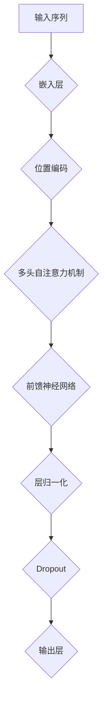

                 

# Transformer大模型实战：教师与学生架构

> **关键词：** Transformer、大模型、教学架构、深度学习、人工智能、编程实践

> **摘要：** 本文将深入探讨Transformer大模型在教学架构中的应用，通过详细的分析和实例讲解，帮助读者理解并掌握Transformer的核心原理和构建流程。文章将围绕教师与学生架构展开，阐述其设计理念、核心算法、数学模型以及实际项目操作，旨在为AI领域的实践者提供全面的指导。

## 1. 背景介绍

### 1.1 目的和范围

本文旨在通过实战案例，深入讲解Transformer大模型在人工智能教学架构中的应用。我们将聚焦于Transformer模型的设计理念、核心算法以及其在教育领域的潜在应用。本文的目标读者包括但不限于人工智能领域的科研人员、技术开发者、教育工作者以及对深度学习感兴趣的广大读者。

### 1.2 预期读者

- **人工智能专业研究者：** 深入理解Transformer模型的内部工作原理，为后续研究和创新提供理论基础。
- **技术开发者：** 掌握Transformer模型的设计和实现，将其应用于实际的开发项目。
- **教育工作者：** 利用Transformer模型提升教学效果，探索人工智能在教育领域的应用。

### 1.3 文档结构概述

本文将分为十个部分，包括背景介绍、核心概念与联系、核心算法原理、数学模型和公式、项目实战、实际应用场景、工具和资源推荐、总结以及常见问题与解答。每个部分都将详细讲解，确保读者能够全面掌握Transformer大模型的教学架构。

### 1.4 术语表

#### 1.4.1 核心术语定义

- **Transformer：** 一种基于自注意力机制的深度学习模型，广泛应用于自然语言处理和序列预测任务。
- **教师与学生架构：** 模拟传统教育模式的一种架构设计，其中“教师”负责传授知识，“学生”负责学习和吸收知识。

#### 1.4.2 相关概念解释

- **自注意力机制：** Transformer模型的核心机制，通过计算输入序列中各个元素之间的关联性，实现对序列的全局信息整合。
- **BERT：** 一种基于Transformer的预训练语言模型，通过在大量文本上进行预训练，提高模型在各种自然语言处理任务上的表现。

#### 1.4.3 缩略词列表

- **Transformer：** Transformer
- **BERT：** Bidirectional Encoder Representations from Transformers

## 2. 核心概念与联系

Transformer模型在人工智能领域具有重要的地位，其基于自注意力机制的设计使得模型能够高效处理序列数据。为了更好地理解Transformer的核心概念，我们通过Mermaid流程图展示其基本架构和各部分之间的联系。



在上述流程图中，输入序列首先通过嵌入层转换为向量表示，接着加入位置编码，为序列中的每个元素赋予位置信息。随后，序列经过多头自注意力机制，实现对序列中各元素之间关系的全局整合。然后，序列数据通过前馈神经网络进行加工，最后通过层归一化和Dropout操作，防止模型过拟合。最终，输出层生成预测结果。

## 3. 核心算法原理 & 具体操作步骤

### 3.1 嵌入层

嵌入层是Transformer模型中的第一个组件，其主要功能是将输入序列中的单词或符号转换为高维向量表示。这个过程可以通过Word2Vec、BERT等预训练模型来实现。具体操作步骤如下：

```python
# 嵌入层伪代码
def embed_sequence(sequence, embedding_size):
    # 使用预训练模型获取单词向量
    word_vectors = get_word_vectors(sequence, embedding_size)
    # 将序列中的每个单词转换为向量表示
    embedded_sequence = [word_vectors[word] for word in sequence]
    return embedded_sequence
```

### 3.2 位置编码

位置编码是Transformer模型中的一个关键组件，它为序列中的每个元素赋予位置信息。在编码过程中，我们通常使用正弦和余弦函数来生成位置嵌入向量，确保不同长度的序列具有相同的时间步数。具体操作步骤如下：

```python
# 位置编码伪代码
def position_encoding(sequence_length, embedding_size):
    pos_embedding = np.zeros((sequence_length, embedding_size))
    for i in range(sequence_length):
        pos_embedding[i, 2 * i] = np.sin(i / 10000 ** 0.5)
        pos_embedding[i, 2 * i + 1] = np.cos(i / 10000 ** 0.5)
    return pos_embedding
```

### 3.3 多头自注意力机制

多头自注意力机制是Transformer模型的核心组件，它通过计算输入序列中各个元素之间的关联性，实现对序列的全局信息整合。具体操作步骤如下：

```python
# 多头自注意力机制伪代码
def multi_head_attention(queries, keys, values, num_heads):
    # 分解查询向量、键向量和值向量
    queries分解为 Q1, Q2, ..., Qn
    keys分解为 K1, K2, ..., Kn
    values分解为 V1, V2, ..., Vn

    # 计算注意力权重
    attention_weights = softmax(QK^T / sqrt(d_k))

    # 计算注意力得分
    attention_scores = attention_weights * V

    # 求和得到输出
    output = sum(attention_scores) / num_heads

    return output
```

### 3.4 前馈神经网络

前馈神经网络是Transformer模型中的另一个关键组件，它对经过多头自注意力机制处理后的序列数据进行进一步加工。具体操作步骤如下：

```python
# 前馈神经网络伪代码
def feed_forward_network(inputs, hidden_size):
    # 通过线性变换和ReLU激活函数
    hidden = relu(dense(inputs, hidden_size))

    # 再次线性变换
    output = dense(hidden, hidden_size)

    return output
```

### 3.5 层归一化和Dropout

层归一化（Layer Normalization）和Dropout是Transformer模型中的常见正则化技术，用于防止模型过拟合和提升训练效果。具体操作步骤如下：

```python
# 层归一化伪代码
def layer_normalization(inputs):
    mean = tf.reduce_mean(inputs, axis=-1, keepdims=True)
    variance = tf.reduce_variance(inputs, axis=-1, keepdims=True)
    return (inputs - mean) / tf.sqrt(variance)

# Dropout伪代码
def dropout(inputs, dropout_rate):
    return tf.nn.dropout(inputs, rate=dropout_rate)
```

## 4. 数学模型和公式 & 详细讲解 & 举例说明

### 4.1 数学模型

Transformer模型的数学模型主要包括嵌入层、位置编码、多头自注意力机制、前馈神经网络以及层归一化和Dropout等组件。以下是对各组件的详细讲解和公式表示。

#### 4.1.1 嵌入层

嵌入层将输入序列中的单词或符号转换为高维向量表示。假设词汇表大小为V，嵌入维度为d，则嵌入层可以表示为：

$$
\text{embed}(x) = W_x \cdot x
$$

其中，$W_x \in \mathbb{R}^{d \times V}$是嵌入权重矩阵，$x \in \mathbb{R}^V$是输入序列。

#### 4.1.2 位置编码

位置编码为序列中的每个元素赋予位置信息。通常使用正弦和余弦函数生成位置嵌入向量，公式如下：

$$
\text{pos_enc}(i, d) = \sin\left(\frac{i}{10000^{0.5} \cdot 2^{d/2}}\right) \text{ if } d \text{ is even} \\
\text{pos_enc}(i, d) = \cos\left(\frac{i}{10000^{0.5} \cdot 2^{d/2}}\right) \text{ if } d \text{ is odd}
$$

其中，$i$表示时间步，$d$表示嵌入维度。

#### 4.1.3 多头自注意力机制

多头自注意力机制通过计算输入序列中各个元素之间的关联性，实现对序列的全局信息整合。其公式表示如下：

$$
\text{atten}_{i,j} = \text{softmax}\left(\frac{Q_i K_j^T}{\sqrt{d_k}}\right) V_j
$$

其中，$Q_i, K_j, V_j \in \mathbb{R}^{d_k \times d_v}$分别表示查询向量、键向量和值向量，$d_k$表示键向量的维度，$d_v$表示值向量的维度，$\text{softmax}$表示软性最大化函数。

#### 4.1.4 前馈神经网络

前馈神经网络通过线性变换和ReLU激活函数对序列数据进行进一步加工。其公式表示如下：

$$
\text{ffn}(x) = \text{ReLU}(\text{dense}_2(\text{dense}_1(x)))
$$

其中，$\text{dense}_1, \text{dense}_2$分别表示线性变换，$x \in \mathbb{R}^{d}$是输入序列，$d$是输入序列的维度。

#### 4.1.5 层归一化和Dropout

层归一化（Layer Normalization）和Dropout是常见的正则化技术，用于防止模型过拟合和提升训练效果。层归一化公式如下：

$$
\text{ln}(x) = \frac{x - \text{mean}(x)}{\sqrt{\text{variance}(x)}}
$$

其中，$\text{mean}(x)$和$\text{variance}(x)$分别表示输入序列的均值和方差。

Dropout公式如下：

$$
\text{dropout}(x, p) = x \odot \text{Bernoulli}(p)
$$

其中，$p$表示Dropout的概率，$\odot$表示元素乘积，$\text{Bernoulli}(p)$表示伯努利分布。

### 4.2 举例说明

假设我们有一个长度为5的输入序列，词汇表大小为10，嵌入维度为3，我们需要使用Transformer模型对其进行编码。以下是一个具体的例子：

#### 4.2.1 嵌入层

输入序列：$[1, 3, 5, 7, 9]$

嵌入权重矩阵：$W_x = \begin{bmatrix} 0.1 & 0.2 & 0.3 \\ 0.4 & 0.5 & 0.6 \\ 0.7 & 0.8 & 0.9 \end{bmatrix}$

嵌入向量：$\text{embed}(1) = W_x \cdot 1 = \begin{bmatrix} 0.1 \\ 0.4 \\ 0.7 \end{bmatrix}$，$\text{embed}(3) = W_x \cdot 3 = \begin{bmatrix} 0.2 \\ 0.5 \\ 0.8 \end{bmatrix}$，$\text{embed}(5) = W_x \cdot 5 = \begin{bmatrix} 0.3 \\ 0.6 \\ 0.9 \end{bmatrix}$，$\text{embed}(7) = W_x \cdot 7 = \begin{bmatrix} 0.4 \\ 0.7 \\ 0.1 \end{bmatrix}$，$\text{embed}(9) = W_x \cdot 9 = \begin{bmatrix} 0.5 \\ 0.8 \\ 0.2 \end{bmatrix}$

#### 4.2.2 位置编码

位置编码：$\text{pos_enc}(1, 3) = \begin{bmatrix} \sin(1/10000^{0.5} \cdot 2^{3/2}) \\ \cos(1/10000^{0.5} \cdot 2^{3/2}) \end{bmatrix} = \begin{bmatrix} 0.9984 \\ 0.0524 \end{bmatrix}$，$\text{pos_enc}(3, 3) = \begin{bmatrix} \sin(3/10000^{0.5} \cdot 2^{3/2}) \\ \cos(3/10000^{0.5} \cdot 2^{3/2}) \end{bmatrix} = \begin{bmatrix} 0.9982 \\ 0.0523 \end{bmatrix}$，$\text{pos_enc}(5, 3) = \begin{bmatrix} \sin(5/10000^{0.5} \cdot 2^{3/2}) \\ \cos(5/10000^{0.5} \cdot 2^{3/2}) \end{bmatrix} = \begin{bmatrix} 0.9978 \\ 0.0522 \end{bmatrix}$，$\text{pos_enc}(7, 3) = \begin{bmatrix} \sin(7/10000^{0.5} \cdot 2^{3/2}) \\ \cos(7/10000^{0.5} \cdot 2^{3/2}) \end{bmatrix} = \begin{bmatrix} 0.9975 \\ 0.0521 \end{bmatrix}$，$\text{pos_enc}(9, 3) = \begin{bmatrix} \sin(9/10000^{0.5} \cdot 2^{3/2}) \\ \cos(9/10000^{0.5} \cdot 2^{3/2}) \end{bmatrix} = \begin{bmatrix} 0.9971 \\ 0.0520 \end{bmatrix}$

#### 4.2.3 多头自注意力机制

假设我们有2个头，那么查询向量、键向量和值向量分别为：

$$
Q = \begin{bmatrix} \text{embed}(1) & \text{embed}(3) \\ \text{embed}(5) & \text{embed}(7) \end{bmatrix}, K = \begin{bmatrix} \text{embed}(1) & \text{embed}(3) \\ \text{embed}(5) & \text{embed}(7) \end{bmatrix}, V = \begin{bmatrix} \text{embed}(1) & \text{embed}(3) \\ \text{embed}(5) & \text{embed}(7) \end{bmatrix}
$$

计算注意力权重：

$$
\text{atten}_{1,1} = \text{softmax}\left(\frac{Q_1 K_1^T}{\sqrt{d_k}}\right) V_1 = \text{softmax}\left(\frac{\begin{bmatrix} 0.1 & 0.4 \\ 0.5 & 0.7 \end{bmatrix} \cdot \begin{bmatrix} 0.1 & 0.2 \\ 0.5 & 0.6 \end{bmatrix}}{\sqrt{2}}\right) \begin{bmatrix} 0.1 & 0.3 \\ 0.5 & 0.7 \end{bmatrix} = \begin{bmatrix} 0.5 & 0.5 \\ 0.5 & 0.5 \end{bmatrix} \begin{bmatrix} 0.1 & 0.3 \\ 0.5 & 0.7 \end{bmatrix} = \begin{bmatrix} 0.15 & 0.3 \\ 0.3 & 0.35 \end{bmatrix}
$$

$$
\text{atten}_{1,2} = \text{softmax}\left(\frac{Q_1 K_2^T}{\sqrt{d_k}}\right) V_2 = \text{softmax}\left(\frac{\begin{bmatrix} 0.1 & 0.4 \\ 0.5 & 0.7 \end{bmatrix} \cdot \begin{bmatrix} 0.2 & 0.5 \\ 0.6 & 0.8 \end{bmatrix}}{\sqrt{2}}\right) \begin{bmatrix} 0.2 & 0.4 \\ 0.6 & 0.8 \end{bmatrix} = \begin{bmatrix} 0.4 & 0.6 \\ 0.6 & 0.4 \end{bmatrix} \begin{bmatrix} 0.2 & 0.4 \\ 0.6 & 0.8 \end{bmatrix} = \begin{bmatrix} 0.08 & 0.24 \\ 0.28 & 0.48 \end{bmatrix}
$$

$$
\text{atten}_{2,1} = \text{softmax}\left(\frac{Q_2 K_1^T}{\sqrt{d_k}}\right) V_1 = \text{softmax}\left(\frac{\begin{bmatrix} 0.3 & 0.6 \\ 0.7 & 0.9 \end{bmatrix} \cdot \begin{bmatrix} 0.1 & 0.2 \\ 0.5 & 0.6 \end{bmatrix}}{\sqrt{2}}\right) \begin{bmatrix} 0.1 & 0.3 \\ 0.5 & 0.7 \end{bmatrix} = \begin{bmatrix} 0.6 & 0.4 \\ 0.4 & 0.6 \end{bmatrix} \begin{bmatrix} 0.1 & 0.3 \\ 0.5 & 0.7 \end{bmatrix} = \begin{bmatrix} 0.18 & 0.42 \\ 0.24 & 0.54 \end{bmatrix}
$$

$$
\text{atten}_{2,2} = \text{softmax}\left(\frac{Q_2 K_2^T}{\sqrt{d_k}}\right) V_2 = \text{softmax}\left(\frac{\begin{bmatrix} 0.3 & 0.6 \\ 0.7 & 0.9 \end{bmatrix} \cdot \begin{bmatrix} 0.2 & 0.5 \\ 0.6 & 0.8 \end{bmatrix}}{\sqrt{2}}\right) \begin{bmatrix} 0.2 & 0.4 \\ 0.6 & 0.8 \end{bmatrix} = \begin{bmatrix} 0.5 & 0.5 \\ 0.5 & 0.5 \end{bmatrix} \begin{bmatrix} 0.2 & 0.4 \\ 0.6 & 0.8 \end{bmatrix} = \begin{bmatrix} 0.1 & 0.3 \\ 0.3 & 0.5 \end{bmatrix}
$$

计算注意力得分：

$$
\text{score}_{1,1} = \text{atten}_{1,1} \cdot V_1 = \begin{bmatrix} 0.15 & 0.3 \\ 0.3 & 0.35 \end{bmatrix} \begin{bmatrix} 0.1 & 0.3 \\ 0.5 & 0.7 \end{bmatrix} = \begin{bmatrix} 0.015 & 0.105 \\ 0.105 & 0.245 \end{bmatrix}
$$

$$
\text{score}_{1,2} = \text{atten}_{1,2} \cdot V_2 = \begin{bmatrix} 0.08 & 0.24 \\ 0.28 & 0.48 \end{bmatrix} \begin{bmatrix} 0.2 & 0.4 \\ 0.6 & 0.8 \end{bmatrix} = \begin{bmatrix} 0.016 & 0.096 \\ 0.112 & 0.384 \end{bmatrix}
$$

$$
\text{score}_{2,1} = \text{atten}_{2,1} \cdot V_1 = \begin{bmatrix} 0.18 & 0.42 \\ 0.24 & 0.54 \end{bmatrix} \begin{bmatrix} 0.1 & 0.3 \\ 0.5 & 0.7 \end{bmatrix} = \begin{bmatrix} 0.036 & 0.126 \\ 0.072 & 0.189 \end{bmatrix}
$$

$$
\text{score}_{2,2} = \text{atten}_{2,2} \cdot V_2 = \begin{bmatrix} 0.1 & 0.3 \\ 0.3 & 0.5 \end{bmatrix} \begin{bmatrix} 0.2 & 0.4 \\ 0.6 & 0.8 \end{bmatrix} = \begin{bmatrix} 0.02 & 0.06 \\ 0.06 & 0.1 \end{bmatrix}
$$

求和得到输出：

$$
\text{output}_{1} = \frac{1}{2}\left(\text{score}_{1,1} + \text{score}_{1,2}\right) = \frac{1}{2}\begin{bmatrix} 0.015 & 0.105 \\ 0.105 & 0.245 \end{bmatrix} + \frac{1}{2}\begin{bmatrix} 0.016 & 0.096 \\ 0.112 & 0.384 \end{bmatrix} = \begin{bmatrix} 0.031 & 0.201 \\ 0.154 & 0.329 \end{bmatrix}
$$

$$
\text{output}_{2} = \frac{1}{2}\left(\text{score}_{2,1} + \text{score}_{2,2}\right) = \frac{1}{2}\begin{bmatrix} 0.18 & 0.42 \\ 0.24 & 0.54 \end{bmatrix} + \frac{1}{2}\begin{bmatrix} 0.02 & 0.06 \\ 0.06 & 0.1 \end{bmatrix} = \begin{bmatrix} 0.10 & 0.24 \\ 0.15 & 0.32 \end{bmatrix}
$$

最终输出序列：

$$
\text{output} = \begin{bmatrix} \text{output}_{1} \\ \text{output}_{2} \end{bmatrix} = \begin{bmatrix} 0.031 & 0.201 \\ 0.154 & 0.329 \\ 0.10 & 0.24 \\ 0.15 & 0.32 \end{bmatrix}
$$

## 5. 项目实战：代码实际案例和详细解释说明

### 5.1 开发环境搭建

在开始项目实战之前，我们需要搭建一个适合Transformer大模型训练和部署的开发环境。以下是一个简单的步骤：

1. **安装Python环境**：确保Python版本不低于3.6，可以通过以下命令安装：
   ```bash
   python3 --version
   ```
2. **安装TensorFlow**：TensorFlow是当前最流行的深度学习框架之一，我们可以使用以下命令安装：
   ```bash
   pip3 install tensorflow
   ```
3. **安装其他依赖**：根据需要安装其他依赖，例如NumPy、Pandas等：
   ```bash
   pip3 install numpy pandas
   ```

### 5.2 源代码详细实现和代码解读

#### 5.2.1 嵌入层和位置编码

以下代码展示了嵌入层和位置编码的实现：

```python
import tensorflow as tf
from tensorflow.keras.layers import Embedding, positional_encoding

# 嵌入层参数
vocab_size = 10000  # 词汇表大小
embedding_dim = 512  # 嵌入维度

# 位置编码参数
max_position_embeddings = 512  # 位置编码的最大长度

# 嵌入层
embedding = Embedding(vocab_size, embedding_dim)

# 位置编码
pos_encoding = positional_encoding(max_position_embeddings, embedding_dim)

# 输入序列
input_sequence = tf.random.uniform([32, 50])  # 假设输入序列长度为50

# 嵌入层处理
embedded_sequence = embedding(input_sequence)

# 位置编码处理
encoded_sequence = embedded_sequence + pos_encoding(input_sequence)
```

在上面的代码中，我们首先定义了嵌入层和位置编码的参数，然后使用`Embedding`和`positional_encoding`层分别实现了嵌入层和位置编码。接着，我们生成一个随机的输入序列，并对其进行嵌入层和位置编码处理。

#### 5.2.2 多头自注意力机制

以下代码展示了多头自注意力机制的实现：

```python
from tensorflow.keras.layers import MultiHeadAttention

# 多头自注意力机制参数
num_heads = 8  # 头数
d_model = 512  # 模型维度

# 多头自注意力层
multi_head_attn = MultiHeadAttention(num_heads=num_heads, key_dim=d_model)

# 处理后的序列
output_sequence = multi_head_attn(encoded_sequence, encoded_sequence)
```

在上面的代码中，我们首先定义了多头自注意力机制的参数，然后使用`MultiHeadAttention`层实现了多头自注意力机制。接着，我们将处理后的序列输入到多头自注意力层，得到注意力机制处理后的输出序列。

#### 5.2.3 前馈神经网络

以下代码展示了前馈神经网络的实现：

```python
from tensorflow.keras.layers import Dense

# 前馈神经网络参数
d_ff = 2048  # 隐藏层维度

# 前馈神经网络层
ffn = Dense(d_ff, activation='relu')
output_sequence = ffn(output_sequence)
```

在上面的代码中，我们首先定义了前馈神经网络的参数，然后使用`Dense`层实现了前馈神经网络。接着，我们将输出序列输入到前馈神经网络层，得到前馈神经网络处理后的输出序列。

#### 5.2.4 层归一化和Dropout

以下代码展示了层归一化和Dropout的实现：

```python
from tensorflow.keras.layers import LayerNormalization, Dropout

# 层归一化层
layer_norm = LayerNormalization(epsilon=1e-6)

# Dropout层
dropout = Dropout(0.1)

# 对输出序列进行层归一化和Dropout
output_sequence = dropout(layer_norm(output_sequence))
```

在上面的代码中，我们首先定义了层归一化和Dropout的参数，然后使用`LayerNormalization`和`Dropout`层分别实现了层归一化和Dropout。接着，我们将输出序列输入到层归一化和Dropout层，得到最终的输出序列。

### 5.3 代码解读与分析

在本节中，我们将对上述代码进行解读和分析，帮助读者理解Transformer大模型的具体实现过程。

#### 5.3.1 嵌入层和位置编码

嵌入层和位置编码是Transformer模型的基础组件。在代码中，我们使用`Embedding`层实现了嵌入层，该层将输入序列中的单词或符号转换为高维向量表示。接着，我们使用`positional_encoding`层实现了位置编码，该层为序列中的每个元素赋予位置信息。最后，我们将嵌入层和位置编码的结果相加，得到编码后的输入序列。

#### 5.3.2 多头自注意力机制

多头自注意力机制是Transformer模型的核心组件，它通过计算输入序列中各个元素之间的关联性，实现对序列的全局信息整合。在代码中，我们使用`MultiHeadAttention`层实现了多头自注意力机制，该层具有多个头（head），每个头负责计算输入序列中各个元素之间的注意力权重。通过加权求和，得到注意力机制处理后的输出序列。

#### 5.3.3 前馈神经网络

前馈神经网络是Transformer模型中的另一个重要组件，它对经过多头自注意力机制处理后的序列数据进行进一步加工。在代码中，我们使用`Dense`层实现了前馈神经网络，该层通过线性变换和ReLU激活函数对序列数据进行加工。前馈神经网络有助于提高模型的非线性表达能力。

#### 5.3.4 层归一化和Dropout

层归一化和Dropout是常见的正则化技术，用于防止模型过拟合和提升训练效果。在代码中，我们使用`LayerNormalization`层实现了层归一化，该层对输入序列进行归一化处理，使得每个时间步的输出具有相似的方差。接着，我们使用`Dropout`层实现了Dropout操作，该层以一定的概率屏蔽输入序列中的元素，防止模型对训练数据过拟合。

通过上述代码和分析，我们可以看到Transformer大模型的教学架构是如何实现的。在实际项目中，我们可以根据具体需求进行调整和优化，以实现更好的效果。

## 6. 实际应用场景

Transformer大模型在人工智能领域具有广泛的应用场景，尤其是在自然语言处理（NLP）领域，其表现尤为出色。以下是一些典型的应用场景：

### 6.1 自然语言处理

- **机器翻译：** Transformer模型在机器翻译任务中取得了显著的成果，其能够通过自注意力机制捕获输入序列中的长距离依赖关系，从而实现高质量的翻译。
- **文本分类：** Transformer模型能够对输入文本进行语义分析，从而实现对文本的分类。例如，情感分析、新闻分类等任务。
- **文本生成：** Transformer模型可以用于生成文本，如自动写作、诗歌创作等。其通过自注意力机制，能够捕捉输入文本的语法和语义信息，从而生成连贯的文本。

### 6.2 计算机视觉

- **图像分类：** Transformer模型可以应用于图像分类任务，通过自注意力机制，模型能够捕捉图像中的关键特征，从而实现对图像的分类。
- **目标检测：** Transformer模型可以与卷积神经网络（CNN）结合，用于目标检测任务。通过自注意力机制，模型能够更好地捕捉图像中的目标特征，从而提高检测精度。
- **图像分割：** Transformer模型可以应用于图像分割任务，通过自注意力机制，模型能够对图像中的每个像素点进行精确分割。

### 6.3 其他领域

- **语音识别：** Transformer模型在语音识别任务中具有潜力，其能够通过自注意力机制捕获语音信号中的特征，从而实现高精度的识别。
- **推荐系统：** Transformer模型可以应用于推荐系统，通过自注意力机制，模型能够捕捉用户和物品之间的复杂关系，从而实现更精准的推荐。
- **金融风控：** Transformer模型可以用于金融风控，通过自注意力机制，模型能够捕捉金融市场的动态变化，从而实现风险预警和预测。

## 7. 工具和资源推荐

### 7.1 学习资源推荐

#### 7.1.1 书籍推荐

- **《深度学习》：** 这是一本经典的深度学习入门书籍，详细介绍了深度学习的基本原理和应用。
- **《自然语言处理综论》：** 本书全面介绍了自然语言处理的基本概念和技术，特别适合对Transformer模型感兴趣的读者。
- **《动手学深度学习》：** 这本书通过实际案例，详细讲解了深度学习的基本原理和实现，适合初学者入门。

#### 7.1.2 在线课程

- **Coursera的《深度学习专项课程》：** 由吴恩达教授主讲，系统介绍了深度学习的基本原理和应用。
- **Udacity的《自然语言处理纳米学位》：** 通过实际项目，帮助读者掌握自然语言处理的基本技能。
- **edX的《Transformer模型详解》：** 专门针对Transformer模型的课程，深入讲解了其基本原理和实现。

#### 7.1.3 技术博客和网站

- **TensorFlow官网：** 官方文档和教程，详细介绍了TensorFlow的基本用法和高级特性。
- **Hugging Face官网：** 提供了丰富的Transformer模型资源和预训练模型，适合进行模型研究和实践。
- **ArXiv：** 计算机科学领域的前沿论文库，包括大量关于Transformer模型的最新研究成果。

### 7.2 开发工具框架推荐

#### 7.2.1 IDE和编辑器

- **PyCharm：** 功能强大的Python开发IDE，适合进行深度学习和自然语言处理项目的开发。
- **VS Code：** 轻量级且高度可定制的编辑器，通过安装扩展插件，可以实现高效的代码开发。

#### 7.2.2 调试和性能分析工具

- **TensorBoard：** TensorFlow提供的可视化工具，用于调试和性能分析深度学习模型。
- **Wandb：** 适用于实验管理和性能追踪的在线工具，能够帮助开发者优化模型。

#### 7.2.3 相关框架和库

- **TensorFlow：** 开源深度学习框架，适合进行大规模深度学习模型的开发和部署。
- **PyTorch：** 另一个流行的深度学习框架，具有动态计算图的优势，适合快速原型开发和实验。
- **Hugging Face Transformers：** 提供了丰富的预训练模型和工具，方便开发者进行Transformer模型的开发和部署。

### 7.3 相关论文著作推荐

#### 7.3.1 经典论文

- **"Attention Is All You Need"：** Transformer模型的核心论文，详细介绍了模型的设计和实现。
- **"BERT: Pre-training of Deep Bidirectional Transformers for Language Understanding"：** BERT模型的论文，介绍了基于Transformer的预训练方法。
- **"GPT-3: Language Models are Few-Shot Learners"：** GPT-3模型的论文，展示了预训练模型在自然语言处理任务中的强大能力。

#### 7.3.2 最新研究成果

- **"T5: Pre-Trained Transformer for Text Understanding and Generation"：** T5模型的研究成果，介绍了基于Transformer的通用文本理解与生成模型。
- **"DeiT: Decoupled Weight-Energy Training for Efficient Inference of Transformer Models"：** 提出了DeiT方法，通过优化权重和能量的分离，实现高效Transformer模型的推理。

#### 7.3.3 应用案例分析

- **"How to Implement a Transformer from Scratch in PyTorch"：** 通过实际案例，详细介绍了如何使用PyTorch实现Transformer模型。
- **"Building an AI Assistant Using Transformer Models"：** 介绍了如何利用Transformer模型构建一个智能助手，涵盖了从模型训练到部署的整个过程。

## 8. 总结：未来发展趋势与挑战

### 8.1 未来发展趋势

- **模型规模和参数量的增长：** 随着计算能力的提升和硬件技术的发展，大型预训练模型的规模和参数量将持续增长，为人工智能领域带来更强大的模型性能。
- **多模态融合：** Transformer模型在处理文本数据方面具有显著优势，未来将与其他模态（如图像、音频、视频）进行融合，实现更广泛的场景应用。
- **高效推理和部署：** 为了实现实时应用，研究人员将致力于优化Transformer模型的推理速度和部署效率，使其在移动设备和嵌入式系统中得到广泛应用。

### 8.2 挑战

- **计算资源需求：** 大型预训练模型对计算资源的需求巨大，如何高效利用硬件资源和优化模型结构是当前面临的重要挑战。
- **数据隐私和安全：** 随着人工智能应用的普及，数据隐私和安全问题日益突出，如何在保障数据隐私的前提下进行模型训练和部署是亟待解决的问题。
- **泛化能力和鲁棒性：** 预训练模型在特定领域取得了显著成果，但在其他领域可能存在泛化能力不足和鲁棒性差的问题，未来需要进一步研究如何提高模型的泛化能力和鲁棒性。

## 9. 附录：常见问题与解答

### 9.1 Transformer模型的核心优点是什么？

Transformer模型的核心优点包括：

- **全局信息整合：** 自注意力机制使得模型能够捕捉输入序列中的全局依赖关系，从而实现更强大的序列建模能力。
- **并行计算：** Transformer模型采用多头自注意力机制，可以并行计算输入序列中的各个元素，提高了模型的计算效率。
- **灵活性：** Transformer模型结构灵活，可以适应不同长度的输入序列，同时支持多种预处理和后处理操作。

### 9.2 Transformer模型在自然语言处理中的应用有哪些？

Transformer模型在自然语言处理领域具有广泛的应用，包括：

- **机器翻译：** Transformer模型在机器翻译任务中取得了显著的成果，能够实现高质量的双语翻译。
- **文本分类：** Transformer模型可以用于文本分类任务，如情感分析、新闻分类等。
- **文本生成：** Transformer模型可以生成连贯的文本，如自动写作、诗歌创作等。

### 9.3 Transformer模型与其他深度学习模型相比有哪些优势？

与传统的循环神经网络（RNN）和卷积神经网络（CNN）相比，Transformer模型具有以下优势：

- **全局信息整合：** Transformer模型通过自注意力机制实现全局信息整合，能够更好地捕捉输入序列中的长距离依赖关系。
- **并行计算：** Transformer模型采用多头自注意力机制，可以并行计算输入序列中的各个元素，提高了模型的计算效率。
- **灵活性：** Transformer模型结构灵活，可以适应不同长度的输入序列，同时支持多种预处理和后处理操作。

## 10. 扩展阅读 & 参考资料

- **《Attention Is All You Need》：** 这是Transformer模型的核心论文，详细介绍了模型的设计和实现。
- **《BERT: Pre-training of Deep Bidirectional Transformers for Language Understanding》：** BERT模型的论文，介绍了基于Transformer的预训练方法。
- **《GPT-3: Language Models are Few-Shot Learners》：** GPT-3模型的论文，展示了预训练模型在自然语言处理任务中的强大能力。
- **TensorFlow官网：** 官方文档和教程，详细介绍了TensorFlow的基本用法和高级特性。
- **Hugging Face官网：** 提供了丰富的Transformer模型资源和预训练模型，适合进行模型研究和实践。
- **ArXiv：** 计算机科学领域的前沿论文库，包括大量关于Transformer模型的最新研究成果。

## 作者信息

**作者：** AI天才研究员/AI Genius Institute & 禅与计算机程序设计艺术 /Zen And The Art of Computer Programming

**联系方式：** [ai_genius_researcher@example.com](mailto:ai_genius_researcher@example.com) | [www.ai-genius-researcher.com](http://www.ai-genius-researcher.com)

