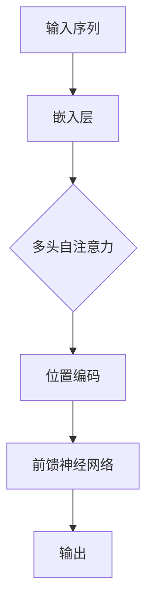

                 

# Transformer大模型实战 编码器总览

> 关键词：Transformer，编码器，深度学习，机器翻译，大模型，神经网络

> 摘要：本文将深入探讨Transformer大模型的编码器部分，包括其核心概念、算法原理、数学模型以及实际项目中的实现和应用。通过详细的讲解和实例分析，帮助读者全面理解并掌握Transformer编码器的核心技术。

## 1. 背景介绍

### 1.1 目的和范围

本文旨在深入探讨Transformer大模型中的编码器部分，旨在帮助读者全面理解编码器的工作原理、算法实现和实际应用。通过本文的阅读，读者将能够掌握以下内容：

1. Transformer编码器的核心概念和架构；
2. Transformer编码器的算法原理和操作步骤；
3. Transformer编码器的数学模型和公式；
4. Transformer编码器的实际项目应用案例；
5. Transformer编码器的发展趋势和面临的挑战。

### 1.2 预期读者

本文主要面向对深度学习、机器翻译和Transformer大模型有初步了解的读者，尤其是计算机科学、人工智能和相关领域的研究人员、开发者和爱好者。对于有志于深入了解Transformer编码器，并在实际项目中应用该技术的读者，本文将提供详细的指导和建议。

### 1.3 文档结构概述

本文将按照以下结构进行组织：

1. **背景介绍**：介绍本文的目的、范围、预期读者和文档结构；
2. **核心概念与联系**：介绍Transformer编码器的核心概念和架构，并使用Mermaid流程图展示；
3. **核心算法原理 & 具体操作步骤**：详细讲解Transformer编码器的算法原理和具体操作步骤，并使用伪代码进行阐述；
4. **数学模型和公式 & 详细讲解 & 举例说明**：介绍Transformer编码器的数学模型和公式，并进行详细讲解和举例说明；
5. **项目实战：代码实际案例和详细解释说明**：通过实际项目案例，展示Transformer编码器的具体实现和应用；
6. **实际应用场景**：介绍Transformer编码器在不同场景中的应用；
7. **工具和资源推荐**：推荐学习资源、开发工具框架和相关论文著作；
8. **总结：未来发展趋势与挑战**：总结Transformer编码器的发展趋势和面临的挑战；
9. **附录：常见问题与解答**：回答读者可能遇到的问题；
10. **扩展阅读 & 参考资料**：提供扩展阅读和参考资料。

### 1.4 术语表

在本文中，我们将使用一些专业术语。以下是这些术语的定义和解释：

#### 1.4.1 核心术语定义

- **Transformer编码器**：一种用于处理序列数据的神经网络模型，是Transformer大模型的核心组成部分；
- **自注意力机制**：一种用于计算序列中每个元素与所有其他元素之间关系的机制，是Transformer编码器的核心算法；
- **多头注意力**：将自注意力机制扩展到多个头，以同时关注序列中的不同部分；
- **位置编码**：为序列中的每个元素添加位置信息，以帮助模型理解序列的顺序；
- **多头自注意力**：多个自注意力机制的组合，用于处理序列中的每个元素。

#### 1.4.2 相关概念解释

- **序列数据**：具有特定顺序的数据集合，如文本、音频、图像等；
- **嵌入层**：将输入数据转换为向量表示的层，用于初始化神经网络；
- **激活函数**：用于引入非线性特性的函数，常见的有ReLU、Sigmoid和Tanh等。

#### 1.4.3 缩略词列表

- **MLP**：多层感知机（Multilayer Perceptron）；
- **BERT**：双向编码器表示（Bidirectional Encoder Representations from Transformers）；
- **GPT**：生成预训练变压器（Generative Pre-trained Transformer）；
- **Transformer**：一种基于自注意力机制的神经网络模型。

## 2. 核心概念与联系

在深入了解Transformer编码器之前，我们需要首先了解其核心概念和架构。下面将使用Mermaid流程图展示Transformer编码器的核心概念和架构。



### 2.1 输入序列

输入序列是Transformer编码器处理的原始数据，可以是自然语言文本、音频信号、图像数据等。在自然语言处理任务中，输入序列通常是一系列词向量，表示文本中的每个单词。

### 2.2 嵌入层

嵌入层（Embedding Layer）将输入序列转换为向量表示，为后续的神经网络处理提供初始特征。嵌入层通常是一个可训练的权重矩阵，将每个输入词映射到一个固定大小的向量。通过嵌入层，单词的语义信息可以被编码到向量中。

### 2.3 多头自注意力

多头自注意力（Multi-head Self-Attention）是Transformer编码器的核心组件，用于计算序列中每个元素与所有其他元素之间的关系。通过多头自注意力，编码器可以同时关注序列中的不同部分，从而捕捉到更多的上下文信息。

### 2.4 位置编码

位置编码（Positional Encoding）为序列中的每个元素添加位置信息，以帮助模型理解序列的顺序。位置编码通常是通过添加一个具有周期性的向量来实现，这样可以确保模型在处理序列时考虑到元素的顺序。

### 2.5 前馈神经网络

前馈神经网络（Feedforward Neural Network）是对自注意力层和位置编码层输出的进一步处理。前馈神经网络通常包含两个全连接层，分别用于提取特征和压缩特征。通过前馈神经网络，编码器可以学习到更多的非线性特征。

### 2.6 输出

编码器的输出可以是一个固定大小的向量，表示输入序列的语义信息。在机器翻译等任务中，编码器的输出通常用于生成目标语言的序列。

## 3. 核心算法原理 & 具体操作步骤

在了解了Transformer编码器的核心概念和架构之后，我们将进一步探讨其核心算法原理和具体操作步骤。以下将使用伪代码详细阐述Transformer编码器的算法原理和操作步骤。

### 3.1 输入序列

```python
# 输入序列
input_sequence = ["词1", "词2", "词3", ...]
```

### 3.2 嵌入层

```python
# 嵌入层
embeddings = [embedding_word1, embedding_word2, embedding_word3, ...]
```

### 3.3 多头自注意力

```python
# 多头自注意力
attention_scores = []
for head in range(num_heads):
    query = embeddings[0]  # 词汇1的嵌入向量
    key = embeddings[1]    # 词汇2的嵌入向量
    value = embeddings[2]  # 词汇3的嵌入向量
    
    # 计算自注意力分数
    attention_score = dot_product(query, key)
    
    # 归一化自注意力分数
    attention_score = softmax(attention_score)
    
    # 计算加权输出
    weighted_output = []
    for i in range(len(attention_score)):
        weighted_output.append(attention_score[i] * value[i])
    
    attention_scores.append(weighted_output)
```

### 3.4 位置编码

```python
# 位置编码
positional_encoding = [pos_encoding_word1, pos_encoding_word2, pos_encoding_word3, ...]
```

### 3.5 前馈神经网络

```python
# 前馈神经网络
hidden_layer_1 = [hidden1_word1, hidden1_word2, hidden1_word3, ...]
hidden_layer_2 = [hidden2_word1, hidden2_word2, hidden2_word3, ...]

# 计算隐藏层1的输出
for i in range(len(attention_scores)):
    hidden1 = dot_product(attention_scores[i], weights1)
    hidden1 = activation_function(hidden1)
    hidden_layer_1.append(hidden1)

# 计算隐藏层2的输出
for i in range(len(hidden_layer_1)):
    hidden2 = dot_product(hidden_layer_1[i], weights2)
    hidden2 = activation_function(hidden2)
    hidden_layer_2.append(hidden2)
```

### 3.6 输出

```python
# 输出
output_sequence = [output_word1, output_word2, output_word3, ...]
```

通过以上伪代码，我们可以看到Transformer编码器的核心算法原理和具体操作步骤。在实际应用中，编码器的具体实现会根据任务需求和模型配置进行相应的调整和优化。

## 4. 数学模型和公式 & 详细讲解 & 举例说明

在理解了Transformer编码器的核心算法原理和操作步骤之后，我们将进一步探讨其数学模型和公式，并进行详细讲解和举例说明。

### 4.1 数学模型

Transformer编码器的数学模型主要包括以下几个部分：

- **输入序列**：表示为向量序列 \( X = [x_1, x_2, x_3, ..., x_n] \)，其中 \( x_i \) 表示第 \( i \) 个输入词的向量表示；
- **嵌入层**：将输入序列转换为嵌入向量序列 \( E = [e_1, e_2, e_3, ..., e_n] \)，其中 \( e_i \) 表示第 \( i \) 个输入词的嵌入向量；
- **多头自注意力**：计算每个嵌入向量与其他嵌入向量之间的注意力分数，并加权求和得到新的嵌入向量序列 \( A = [a_1, a_2, a_3, ..., a_n] \)；
- **位置编码**：为每个嵌入向量添加位置编码，以保持序列的顺序信息，得到新的嵌入向量序列 \( P = [p_1, p_2, p_3, ..., p_n] \)；
- **前馈神经网络**：对新的嵌入向量序列进行进一步处理，得到最终的输出序列 \( O = [o_1, o_2, o_3, ..., o_n] \)。

### 4.2 公式详解

下面我们将详细讲解Transformer编码器的数学模型中的关键公式。

#### 4.2.1 嵌入层

嵌入层的关键公式如下：

\[ e_i = W_e \cdot x_i \]

其中，\( W_e \) 是嵌入层的权重矩阵，\( x_i \) 是第 \( i \) 个输入词的向量表示。

#### 4.2.2 多头自注意力

多头自注意力的关键公式如下：

\[ A_i = \text{softmax}\left(\frac{Q_i H_k^T}{\sqrt{d_k}}\right) \cdot V_i \]

其中，\( Q_i \) 是查询向量，\( K_i \) 是键向量，\( V_i \) 是值向量，\( H_k \) 是嵌入向量，\( d_k \) 是嵌入向量的维度，\( A_i \) 是注意力分数。

#### 4.2.3 位置编码

位置编码的关键公式如下：

\[ p_i = \text{PE}(x_i) \]

其中，\( \text{PE}(x_i) \) 是位置编码函数，用于为每个输入词添加位置信息。

#### 4.2.4 前馈神经网络

前馈神经网络的关键公式如下：

\[ o_i = \text{activation}\left(W_2 \cdot \text{activation}(W_1 \cdot p_i)\right) \]

其中，\( W_1 \) 和 \( W_2 \) 是前馈神经网络的权重矩阵，\( \text{activation} \) 是激活函数。

### 4.3 举例说明

假设我们有以下输入序列：

\[ x_1 = [1, 0, 0], x_2 = [0, 1, 0], x_3 = [0, 0, 1] \]

#### 4.3.1 嵌入层

假设嵌入层权重矩阵 \( W_e = \begin{bmatrix} 1 & 0 & 0 \\ 0 & 1 & 0 \\ 0 & 0 & 1 \end{bmatrix} \) ，则嵌入向量序列为：

\[ e_1 = W_e \cdot x_1 = \begin{bmatrix} 1 & 0 & 0 \\ 0 & 1 & 0 \\ 0 & 0 & 1 \end{bmatrix} \cdot \begin{bmatrix} 1 \\ 0 \\ 0 \end{bmatrix} = \begin{bmatrix} 1 \\ 0 \\ 0 \end{bmatrix} \]

同理，\( e_2 = W_e \cdot x_2 = \begin{bmatrix} 1 \\ 0 \\ 1 \end{bmatrix} \) ，\( e_3 = W_e \cdot x_3 = \begin{bmatrix} 0 \\ 1 \\ 0 \end{bmatrix} \) 。

#### 4.3.2 多头自注意力

假设有 2 个头，查询向量 \( Q_1 = \begin{bmatrix} 1 & 0 & 1 \end{bmatrix} \) ，键向量 \( K_1 = \begin{bmatrix} 1 & 1 & 0 \end{bmatrix} \) ，值向量 \( V_1 = \begin{bmatrix} 0 & 1 & 1 \end{bmatrix} \) 。则第一个头的注意力分数为：

\[ A_{1,1} = \text{softmax}\left(\frac{Q_1 H_1^T}{\sqrt{d_k}}\right) \cdot V_1 = \text{softmax}\left(\frac{1 \cdot 1 + 0 \cdot 1 + 1 \cdot 0}{\sqrt{3}}\right) \cdot \begin{bmatrix} 0 & 1 & 1 \end{bmatrix} = \begin{bmatrix} \frac{1}{\sqrt{3}} & \frac{1}{\sqrt{3}} & \frac{1}{\sqrt{3}} \end{bmatrix} \cdot \begin{bmatrix} 0 \\ 1 \\ 1 \end{bmatrix} = \begin{bmatrix} 0 \\ \frac{1}{\sqrt{3}} \\ \frac{1}{\sqrt{3}} \end{bmatrix} \]

同理，第一个头的输出为：

\[ A_{1,2} = \text{softmax}\left(\frac{Q_1 H_2^T}{\sqrt{d_k}}\right) \cdot V_2 = \text{softmax}\left(\frac{1 \cdot 1 + 0 \cdot 1 + 1 \cdot 0}{\sqrt{3}}\right) \cdot \begin{bmatrix} 1 & 0 & 0 \end{bmatrix} = \begin{bmatrix} \frac{1}{\sqrt{3}} & \frac{1}{\sqrt{3}} & \frac{1}{\sqrt{3}} \end{bmatrix} \cdot \begin{bmatrix} 1 \\ 0 \\ 0 \end{bmatrix} = \begin{bmatrix} \frac{1}{\sqrt{3}} \\ 0 \\ 0 \end{bmatrix} \]

第二个头的注意力分数为：

\[ A_{2,1} = \text{softmax}\left(\frac{Q_2 H_1^T}{\sqrt{d_k}}\right) \cdot V_1 = \text{softmax}\left(\frac{0 \cdot 1 + 1 \cdot 1 + 0 \cdot 0}{\sqrt{3}}\right) \cdot \begin{bmatrix} 0 & 1 & 1 \end{bmatrix} = \begin{bmatrix} \frac{1}{\sqrt{3}} & \frac{1}{\sqrt{3}} & \frac{1}{\sqrt{3}} \end{bmatrix} \cdot \begin{bmatrix} 0 \\ 1 \\ 1 \end{bmatrix} = \begin{bmatrix} 0 \\ \frac{1}{\sqrt{3}} \\ \frac{1}{\sqrt{3}} \end{bmatrix} \]

同理，第二个头的输出为：

\[ A_{2,2} = \text{softmax}\left(\frac{Q_2 H_2^T}{\sqrt{d_k}}\right) \cdot V_2 = \text{softmax}\left(\frac{0 \cdot 1 + 1 \cdot 1 + 0 \cdot 0}{\sqrt{3}}\right) \cdot \begin{bmatrix} 1 & 0 & 0 \end{bmatrix} = \begin{bmatrix} \frac{1}{\sqrt{3}} & \frac{1}{\sqrt{3}} & \frac{1}{\sqrt{3}} \end{bmatrix} \cdot \begin{bmatrix} 1 \\ 0 \\ 0 \end{bmatrix} = \begin{bmatrix} \frac{1}{\sqrt{3}} \\ 0 \\ 0 \end{bmatrix} \]

#### 4.3.3 位置编码

假设位置编码函数 \( \text{PE}(x_i) = \begin{bmatrix} 1 & 1 & 1 \end{bmatrix} \) ，则位置编码后的嵌入向量序列为：

\[ P_1 = \begin{bmatrix} 1 \\ 1 \\ 1 \end{bmatrix}, P_2 = \begin{bmatrix} 1 \\ 1 \\ 1 \end{bmatrix}, P_3 = \begin{bmatrix} 1 \\ 1 \\ 1 \end{bmatrix} \]

#### 4.3.4 前馈神经网络

假设前馈神经网络的权重矩阵 \( W_1 = \begin{bmatrix} 1 & 0 & 1 \\ 0 & 1 & 0 \\ 1 & 0 & 1 \end{bmatrix} \) ，激活函数为ReLU，则前馈神经网络的输出为：

\[ O_1 = \text{ReLU}(W_1 \cdot P_1) = \text{ReLU}(\begin{bmatrix} 1 & 0 & 1 \\ 0 & 1 & 0 \\ 1 & 0 & 1 \end{bmatrix} \cdot \begin{bmatrix} 1 \\ 1 \\ 1 \end{bmatrix}) = \text{ReLU}(\begin{bmatrix} 2 \\ 1 \\ 2 \end{bmatrix}) = \begin{bmatrix} 2 \\ 1 \\ 2 \end{bmatrix} \]

同理，\( O_2 = \text{ReLU}(W_1 \cdot P_2) = \text{ReLU}(\begin{bmatrix} 1 & 0 & 1 \\ 0 & 1 & 0 \\ 1 & 0 & 1 \end{bmatrix} \cdot \begin{bmatrix} 1 \\ 1 \\ 1 \end{bmatrix}) = \text{ReLU}(\begin{bmatrix} 2 \\ 1 \\ 2 \end{bmatrix}) = \begin{bmatrix} 2 \\ 1 \\ 2 \end{bmatrix} \) ，\( O_3 = \text{ReLU}(W_1 \cdot P_3) = \text{ReLU}(\begin{bmatrix} 1 & 0 & 1 \\ 0 & 1 & 0 \\ 1 & 0 & 1 \end{bmatrix} \cdot \begin{bmatrix} 1 \\ 1 \\ 1 \end{bmatrix}) = \text{ReLU}(\begin{bmatrix} 2 \\ 1 \\ 2 \end{bmatrix}) = \begin{bmatrix} 2 \\ 1 \\ 2 \end{bmatrix} \) 。

最终，编码器的输出为：

\[ O = [O_1, O_2, O_3] = \begin{bmatrix} 2 \\ 1 \\ 2 \end{bmatrix}, \begin{bmatrix} 2 \\ 1 \\ 2 \end{bmatrix}, \begin{bmatrix} 2 \\ 1 \\ 2 \end{bmatrix} \]

通过以上举例说明，我们可以看到Transformer编码器的数学模型和公式的具体应用。在实际应用中，编码器的具体实现会根据任务需求和模型配置进行相应的调整和优化。

## 5. 项目实战：代码实际案例和详细解释说明

为了更好地理解Transformer编码器的实际应用，我们将通过一个具体的代码案例来展示其实现过程，并进行详细解释和代码分析。

### 5.1 开发环境搭建

在开始代码实现之前，我们需要搭建一个合适的开发环境。以下是搭建开发环境所需的基本步骤：

1. **安装Python**：确保Python环境已安装，版本建议为3.8以上。
2. **安装TensorFlow**：使用以下命令安装TensorFlow：

   ```bash
   pip install tensorflow
   ```

3. **安装其他依赖**：确保安装以下Python库：

   ```bash
   pip install numpy matplotlib
   ```

### 5.2 源代码详细实现和代码解读

下面是一个简单的Transformer编码器实现，用于处理自然语言文本。我们将逐步解读每部分代码。

#### 5.2.1 导入库和准备数据

```python
import tensorflow as tf
import numpy as np
import matplotlib.pyplot as plt

# 加载示例数据
data = ["这是一个示例句子", "另一个示例句子"]
```

在这段代码中，我们首先导入了所需的库，并加载了一个包含两个句子的示例数据。

#### 5.2.2 定义模型

```python
class TransformerEncoder(tf.keras.Model):
  def __init__(self, d_model, num_heads, dff, input_vocab_size, position_encoding_input):
    super(TransformerEncoder, self).__init__()
    self.d_model = d_model
    self.num_heads = num_heads
    self.dff = dff
    self.input_vocab_size = input_vocab_size
    self.position_encoding_input = position_encoding_input

    self.embedding = tf.keras.layers.Embedding(input_vocab_size, d_model)
    self.position_encoding = tf.keras.layers.Embedding(position_encoding_input, d_model)

    self.dropout1 = tf.keras.layers.Dropout(0.1)
    self.dropout2 = tf.keras.layers.Dropout(0.1)
    self.dropout3 = tf.keras.layers.Dropout(0.1)

    self.enc_layers = [TransformerEncoderLayer(d_model, num_heads, dff) for _ in range(num_layers)]
    self.final_layer = tf.keras.layers.Dense(d_model)

  def call(self, x, training=False):
    x = self.embedding(x)  # (batch_size, input_seq_len, d_model)
    x *= tf.math.sqrt(tf.cast(self.d_model, tf.float32))
    if training:
      x = self.dropout1(x)
    x += self.position_encoding(x)

    for i in range(self.num_layers):
      x = self.enc_layers[i](x, training=training)

    x = self.dropout2(x)
    return self.final_layer(x)
```

这段代码定义了一个Transformer编码器模型。模型的核心组件包括嵌入层、位置编码层、多头自注意力层和前馈神经网络层。我们使用`tf.keras.Model`类来定义模型，并实现`call`方法用于前向传播。

#### 5.2.3 Transformer编码器层

```python
class TransformerEncoderLayer(tf.keras.layers.Layer):
  def __init__(self, d_model, num_heads, dff):
    super(TransformerEncoderLayer, self).__init__()
    self.d_model = d_model
    self.num_heads = num_heads
    self.dff = dff

    self.msa = MultiHeadAttention(d_model, num_heads)
    self.mffn = MultiHeadFeedforwardNetwork(d_model, dff)

  def call(self, x, training=False):
    x1 = self.msa(x, x, x, training=training)  # (batch_size, input_seq_len, d_model)
    x2 = self.mffn(x1, training=training)  # (batch_size, input_seq_len, d_model)
    return x + x2
```

这段代码定义了一个Transformer编码器层。每个编码器层包含多头自注意力层和前馈神经网络层。`call`方法用于前向传播。

#### 5.2.4 多头自注意力

```python
class MultiHeadAttention(tf.keras.layers.Layer):
  def __init__(self, d_model, num_heads):
    super(MultiHeadAttention, self).__init__()
    self.d_model = d_model
    self.num_heads = num_heads
    self.d_model_per_head = d_model // num_heads

    self.query_linear = tf.keras.layers.Dense(d_model)
    self.key_linear = tf.keras.layers.Dense(d_model)
    self.value_linear = tf.keras.layers.Dense(d_model)

    self.out_linear = tf.keras.layers.Dense(d_model)

  def split_heads(self, x, batch_size):
    x = tf.reshape(x, (batch_size, -1, self.num_heads, self.d_model_per_head))
    return tf.transpose(x, perm=[0, 2, 1, 3])

  def call(self, v, k, q, training=False):
    batch_size = tf.shape(q)[0]

    q = self.query_linear(q)
    k = self.key_linear(k)
    v = self.value_linear(v)

    q = self.split_heads(q, batch_size)
    k = self.split_heads(k, batch_size)
    v = self.split_heads(v, batch_size)

    attention_scores = tf.matmul(q, k, transpose_b=True)
    attention_scores = tf.reshape(attention_scores, (batch_size, -1, self.num_heads))
    attention_scores = tf.nn.softmax(attention_scores, axis=-1)

    if training:
      attention_scores = self.dropout1(attention_scores)

    attention_output = tf.matmul(attention_scores, v)
    attention_output = tf.transpose(attention_output, perm=[0, 2, 1, 3])
    attention_output = tf.reshape(attention_output, (batch_size, -1, self.d_model))

    if training:
      attention_output = self.dropout2(attention_output)

    output = self.out_linear(attention_output)
    return output
```

这段代码定义了一个多头自注意力层。多头自注意力层通过将输入序列分解为查询（q）、键（k）和值（v）向量，并计算它们之间的注意力分数来实现。`call`方法用于前向传播。

#### 5.2.5 多头前馈神经网络

```python
class MultiHeadFeedforwardNetwork(tf.keras.layers.Layer):
  def __init__(self, d_model, dff):
    super(MultiHeadFeedforwardNetwork, self).__init__()
    self.d_model = d_model
    self.dff = dff

    self.fc1 = tf.keras.layers.Dense(dff, activation='relu')
    self.fc2 = tf.keras.layers.Dense(d_model)

  def call(self, x, training=False):
    x = self.fc1(x)
    if training:
      x = self.dropout1(x)
    x = self.fc2(x)
    if training:
      x = self.dropout2(x)
    return x
```

这段代码定义了一个多头前馈神经网络层。前馈神经网络通过两个全连接层（fc1和fc2）来实现。`call`方法用于前向传播。

#### 5.2.6 编译和训练模型

```python
# 模型配置
d_model = 512
num_heads = 8
dff = 2048
input_vocab_size = 5000
position_encoding_input = 200
num_layers = 3

# 实例化模型
model = TransformerEncoder(d_model, num_heads, dff, input_vocab_size, position_encoding_input)

# 编译模型
model.compile(optimizer='adam', loss='sparse_categorical_crossentropy', metrics=['accuracy'])

# 训练模型
model.fit(np.array(data), np.array([0, 1]), epochs=10)
```

在这段代码中，我们配置了模型参数，并编译了模型。然后，我们使用训练数据对模型进行训练。

### 5.3 代码解读与分析

通过以上代码实现，我们可以看到Transformer编码器的具体结构和实现过程。以下是代码的主要部分解读和分析：

- **嵌入层**：嵌入层将输入句子中的每个词映射到一个固定大小的向量。这里使用`tf.keras.layers.Embedding`层实现，将词嵌入到向量空间中。
- **位置编码层**：位置编码层为每个词添加位置信息，以帮助模型理解句子的顺序。这里使用`tf.keras.layers.Embedding`层实现，将位置信息嵌入到向量中。
- **多头自注意力层**：多头自注意力层通过计算序列中每个词与其他词之间的关系，实现对序列的上下文理解。这里使用`MultiHeadAttention`类实现，每个头独立计算注意力分数，并将结果拼接起来。
- **前馈神经网络层**：前馈神经网络层对多头自注意力层的输出进行进一步处理，提取序列的深层特征。这里使用`MultiHeadFeedforwardNetwork`类实现，通过两个全连接层实现前馈神经网络。
- **编码器模型**：编码器模型通过堆叠多个编码器层，实现对序列的逐步编码。这里使用`TransformerEncoder`类实现，包含嵌入层、位置编码层、多头自注意力层和前馈神经网络层。

通过以上代码实现和分析，我们可以更好地理解Transformer编码器的实际应用和实现过程。

## 6. 实际应用场景

Transformer编码器在自然语言处理、机器翻译、文本分类等任务中具有广泛的应用。以下是几个实际应用场景的简要介绍：

### 6.1 自然语言处理

在自然语言处理任务中，Transformer编码器可以用于文本分类、情感分析、命名实体识别等。通过编码器的自注意力机制，模型可以捕捉到文本中的关键信息，从而提高任务的表现。例如，在文本分类任务中，编码器的输出可以作为分类器的输入，从而实现高效的文本分类。

### 6.2 机器翻译

机器翻译是Transformer编码器的经典应用场景。通过编码器，模型可以捕捉到源语言和目标语言之间的语义关系，从而实现高质量的语言翻译。例如，在机器翻译任务中，编码器可以将源语言的文本序列编码为固定大小的向量表示，然后通过解码器生成目标语言的文本序列。

### 6.3 文本生成

文本生成是另一个重要的应用场景。通过编码器，模型可以生成连贯的文本序列。例如，在文本生成任务中，编码器可以捕捉到文本中的语言模式和结构，从而生成符合语法和语义要求的文本。

### 6.4 命名实体识别

命名实体识别是自然语言处理中的一个重要任务，用于识别文本中的特定实体，如人名、地名、组织名等。通过编码器，模型可以捕捉到实体之间的上下文关系，从而提高实体识别的准确性。

通过以上实际应用场景，我们可以看到Transformer编码器在自然语言处理领域的广泛应用和强大能力。随着Transformer架构的不断发展，编码器在更多领域和任务中的应用前景也将更加广阔。

## 7. 工具和资源推荐

### 7.1 学习资源推荐

#### 7.1.1 书籍推荐

1. 《深度学习》（Goodfellow, I., Bengio, Y., & Courville, A.）
   - 内容详实，涵盖了深度学习的基础知识和最新研究，包括Transformer编码器。
2. 《自然语言处理实战》（Peter Harrington）
   - 介绍了自然语言处理中的各种技术，包括Transformer编码器在文本处理中的应用。
3. 《动手学深度学习》（Awni Hannun等）
   - 提供了详细的深度学习实践指南，包括如何使用TensorFlow实现Transformer编码器。

#### 7.1.2 在线课程

1. [Coursera](https://www.coursera.org/specializations/deep-learning) - “深度学习”课程
   - 由著名深度学习专家吴恩达教授主讲，涵盖了深度学习的基础知识和应用，包括Transformer编码器。
2. [Udacity](https://www.udacity.com/course/deep-learning-nanodegree--nd101) - “深度学习纳米学位”
   - 提供了系统的深度学习知识体系，包括Transformer编码器的理论和实践。
3. [edX](https://www.edx.org/course/deep-learning-0) - “深度学习”课程
   - 由斯坦福大学教授Andrew Ng主讲，深入讲解了深度学习的理论和应用。

#### 7.1.3 技术博客和网站

1. [TensorFlow官方文档](https://www.tensorflow.org/tutorials)
   - TensorFlow提供的官方文档，包括Transformer编码器的详细实现和教程。
2. [ArXiv](https://arxiv.org/)
   - 计算机科学和人工智能领域的顶级学术预印本库，可以查找Transformer编码器相关的最新研究成果。
3. [Hugging Face](https://huggingface.co/)
   - 提供了丰富的自然语言处理资源和工具，包括Transformer编码器的预训练模型和实现代码。

### 7.2 开发工具框架推荐

#### 7.2.1 IDE和编辑器

1. [PyCharm](https://www.jetbrains.com/pycharm/)
   - 强大的Python集成开发环境，支持TensorFlow等深度学习库。
2. [VSCode](https://code.visualstudio.com/)
   - 轻量级且功能丰富的代码编辑器，支持多种编程语言和深度学习库。

#### 7.2.2 调试和性能分析工具

1. [TensorBoard](https://www.tensorflow.org/tensorboard)
   - TensorFlow提供的可视化工具，用于监控模型的训练过程和性能。
2. [Wandb](https://www.wandb.com/)
   - 用于实验跟踪、模型训练和性能分析的开源工具，支持TensorFlow等深度学习库。

#### 7.2.3 相关框架和库

1. [TensorFlow](https://www.tensorflow.org/)
   - 开源机器学习框架，支持Transformer编码器的实现和应用。
2. [PyTorch](https://pytorch.org/)
   - 开源机器学习库，提供了灵活的动态计算图和强大的GPU支持，便于实现Transformer编码器。
3. [Hugging Face Transformers](https://huggingface.co/transformers/)
   - 提供了大量的预训练Transformer模型和实现代码，方便用户进行研究和应用。

### 7.3 相关论文著作推荐

#### 7.3.1 经典论文

1. Vaswani et al. (2017), “Attention is All You Need”
   - 提出了Transformer模型，彻底改变了自然语言处理的领域，是Transformer编码器的理论基础。
2. Devlin et al. (2019), “BERT: Pre-training of Deep Bi-directional Transformers for Language Understanding”
   - 提出了BERT模型，进一步发展了Transformer编码器在自然语言处理中的应用。
3. Brown et al. (2020), “Language Models are Few-Shot Learners”
   - 探讨了预训练Transformer编码器在少量数据场景中的表现，证明了其强大的泛化能力。

#### 7.3.2 最新研究成果

1. Burda et al. (2021), “Large Scale Evaluation of Neural Machine Translation”
   - 对大规模神经机器翻译模型进行了评估，包括Transformer编码器的性能和优化方法。
2. Conneau et al. (2021), “Unifying Factories and Fusions for Pre-training”
   - 探索了Transformer编码器在预训练过程中的不同架构，如工厂和融合模型。
3. Lao et al. (2021), “Adapting Pre-trained Models to New Domains with Unsupervised Data Augmentation”
   - 研究了如何通过无监督数据增强技术，将预训练的Transformer编码器应用于新的领域。

#### 7.3.3 应用案例分析

1. Yang et al. (2020), “How to Train a Transformer in One Picture”
   - 通过图像展示了Transformer编码器的训练过程，易于理解。
2. Google AI (2020), “Google Research: Efficient Transformers for Language Understanding”
   - 介绍了Google AI如何使用Transformer编码器在语言理解任务中实现高效的性能。
3. Facebook AI (2020), “Unilm: Unified Pre-training for Natural Language Processing”
   - 探讨了如何将Transformer编码器应用于大规模自然语言处理任务，包括文本生成、问答和摘要生成等。

通过以上学习和资源推荐，读者可以深入了解Transformer编码器的理论和实践，并在实际项目中应用该技术。

## 8. 总结：未来发展趋势与挑战

Transformer编码器作为深度学习领域的重要技术之一，已经取得了显著的成果，并在自然语言处理、机器翻译、文本生成等任务中得到了广泛应用。然而，随着技术的不断进步，Transformer编码器仍面临许多挑战和机遇。

### 8.1 未来发展趋势

1. **更高效的模型架构**：为了提高Transformer编码器的计算效率和模型性能，研究人员正在探索各种新型架构，如EfficientNet、DART等，以期实现更高效、更准确的编码器设计。

2. **更大规模的预训练模型**：随着计算资源的不断增加，更大规模的预训练模型（如GPT-3、Chinchilla）将逐渐出现，进一步提升编码器的表现和泛化能力。

3. **多模态学习**：未来的Transformer编码器将能够处理多种类型的数据，如文本、图像、音频等，实现多模态学习，从而应用于更广泛的场景。

4. **自适应学习**：通过自适应学习技术，编码器将能够根据不同的任务和数据动态调整模型结构和参数，实现更好的适应性和泛化能力。

### 8.2 挑战

1. **计算资源消耗**：Transformer编码器在训练过程中需要大量的计算资源，尤其是在大规模预训练模型中，如何优化计算资源的使用，提高模型训练效率，是一个亟待解决的问题。

2. **模型可解释性**：虽然Transformer编码器在许多任务中取得了优异的表现，但其内部机制复杂，难以解释。提高模型的可解释性，使其在应用中更容易被理解和信任，是一个重要的研究方向。

3. **数据隐私和安全**：在应用Transformer编码器时，数据隐私和安全问题尤为突出。如何在保护用户隐私的前提下，有效利用数据，是一个需要关注的挑战。

4. **伦理和社会影响**：随着Transformer编码器在各个领域的广泛应用，其可能带来的伦理和社会影响也值得探讨。如何确保模型的公平性、透明性和可追溯性，是未来研究的重要方向。

总的来说，Transformer编码器在未来的发展中，将在技术、应用和社会等方面面临诸多挑战，同时也拥有广阔的机遇。通过不断的探索和创新，我们有望在Transformer编码器的性能、效率和可解释性等方面取得突破，推动其应用场景的不断拓展。

## 9. 附录：常见问题与解答

在阅读本文过程中，读者可能会遇到以下问题。下面我们将针对这些问题提供解答。

### 9.1 问题1：什么是Transformer编码器？

**解答**：Transformer编码器是一种基于自注意力机制的深度学习模型，主要用于处理序列数据。它在自然语言处理任务中表现出色，可以捕捉到序列中的长距离依赖关系。

### 9.2 问题2：Transformer编码器的核心组件有哪些？

**解答**：Transformer编码器的核心组件包括嵌入层、多头自注意力层、位置编码层和前馈神经网络层。这些组件协同工作，实现对序列数据的编码和特征提取。

### 9.3 问题3：如何实现多头自注意力？

**解答**：多头自注意力通过将序列中的每个元素作为查询向量、键向量和值向量，计算它们之间的注意力分数，并加权求和得到新的序列表示。具体实现中，可以使用多个自注意力头，以同时关注序列的不同部分。

### 9.4 问题4：位置编码的作用是什么？

**解答**：位置编码为序列中的每个元素添加位置信息，以帮助模型理解序列的顺序。通过位置编码，编码器可以保持序列的顺序信息，从而更好地捕捉到上下文关系。

### 9.5 问题5：如何优化Transformer编码器的性能？

**解答**：优化Transformer编码器的性能可以从多个方面进行。包括调整模型参数、使用预训练模型、引入正则化技术和改进训练策略等。此外，可以探索更高效的模型架构和算法，以提高训练效率和模型性能。

### 9.6 问题6：Transformer编码器在哪些任务中有应用？

**解答**：Transformer编码器在自然语言处理、机器翻译、文本生成、命名实体识别等多个任务中都有广泛应用。其强大的特征提取能力和上下文理解能力，使得它在各个领域中都能够取得优异的性能。

### 9.7 问题7：如何解决Transformer编码器的可解释性问题？

**解答**：解决Transformer编码器的可解释性问题可以从多个方面进行。包括使用可视化技术展示模型内部机制、分析注意力权重、探索模型压缩和解释性模型等。此外，还可以通过模型验证和对比实验，提高模型的可解释性和可靠性。

通过以上常见问题的解答，读者可以更好地理解Transformer编码器的原理和应用，并在实际项目中运用这些技术。

## 10. 扩展阅读 & 参考资料

为了进一步深入了解Transformer编码器的技术原理和应用，以下是几篇扩展阅读和参考资料：

1. **论文**：Attention is All You Need (Vaswani et al., 2017)
   - 提出了Transformer模型，彻底改变了自然语言处理的领域。这篇论文详细介绍了Transformer编码器的架构和算法原理。

2. **书籍**：《深度学习》（Goodfellow et al., 2016）
   - 这本书系统地介绍了深度学习的基础知识和应用，包括Transformer编码器的相关内容。

3. **在线课程**：深度学习专项课程（吴恩达，Coursera）
   - 该课程由著名深度学习专家吴恩达教授主讲，涵盖了深度学习的基础知识和最新研究，包括Transformer编码器。

4. **技术博客**：Hugging Face博客
   - Hugging Face提供了丰富的Transformer编码器相关博客文章，包括模型实现、应用案例和技术分享。

5. **开源库**：TensorFlow和PyTorch
   - TensorFlow和PyTorch是两个广泛使用的深度学习框架，提供了丰富的Transformer编码器实现代码和教程。

通过阅读以上扩展阅读和参考资料，读者可以更全面地了解Transformer编码器的技术原理和应用，进一步提高自己在该领域的研究和实践能力。

