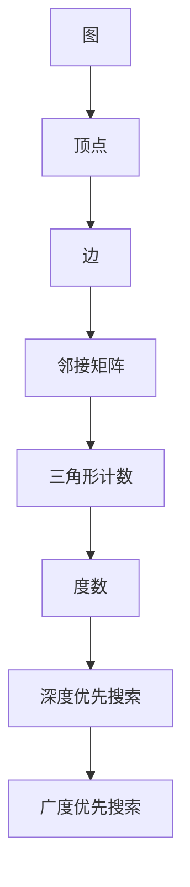

                 

# Triangle Counting 三角形计数原理与代码实例讲解

> **关键词：** 三角形计数、算法原理、图论、数学模型、实战案例

> **摘要：** 本文将详细介绍三角形计数的基本原理、核心算法、数学模型，并通过代码实例展示如何在实际项目中应用这一算法。无论您是算法初学者还是有经验的程序员，本文都将为您提供清晰易懂的指导。

## 1. 背景介绍

### 1.1 目的和范围

本文旨在帮助读者理解并掌握三角形计数算法，并学会在实际项目中应用这一算法。我们将探讨三角形计数在图论中的应用，介绍相关的数学模型和算法原理，并通过具体代码实例进行实战讲解。

### 1.2 预期读者

本文适合以下读者：

- 对图论和算法有兴趣的程序员和算法爱好者
- 想要在项目中应用三角形计数的开发者
- 想深入了解算法原理和数学模型的学习者

### 1.3 文档结构概述

本文将按照以下结构进行讲解：

- **1. 背景介绍**：介绍三角形计数的背景和目的。
- **2. 核心概念与联系**：介绍三角形计数相关的核心概念和联系。
- **3. 核心算法原理 & 具体操作步骤**：详细讲解三角形计数的算法原理和具体操作步骤。
- **4. 数学模型和公式 & 详细讲解 & 举例说明**：介绍三角形计数的数学模型和公式，并进行举例说明。
- **5. 项目实战：代码实际案例和详细解释说明**：通过具体代码实例展示三角形计数的实际应用。
- **6. 实际应用场景**：介绍三角形计数的实际应用场景。
- **7. 工具和资源推荐**：推荐相关学习资源、开发工具和框架。
- **8. 总结：未来发展趋势与挑战**：讨论三角形计数的未来发展趋势和挑战。
- **9. 附录：常见问题与解答**：提供常见问题解答。
- **10. 扩展阅读 & 参考资料**：推荐相关扩展阅读和参考资料。

### 1.4 术语表

#### 1.4.1 核心术语定义

- **三角形计数**：计算给定图中三角形的数量。
- **图论**：研究图（由点和边组成的结构）的性质和关系的数学分支。
- **邻接矩阵**：表示图中顶点之间连接关系的矩阵。
- **度数**：图中顶点的邻居数量。

#### 1.4.2 相关概念解释

- **图**：由顶点（节点）和边（连接顶点的线段）组成的结构。
- **邻接表**：表示图中顶点之间连接关系的表格。
- **深度优先搜索（DFS）**：一种用于遍历图或树的算法。
- **广度优先搜索（BFS）**：一种用于遍历图或树的算法。

#### 1.4.3 缩略词列表

- **DFS**：深度优先搜索
- **BFS**：广度优先搜索
- **O(n)**：线性时间复杂度
- **O(n^2)**：二次时间复杂度

## 2. 核心概念与联系

在讨论三角形计数之前，我们需要先了解一些核心概念和它们之间的联系。以下是一个简单的 Mermaid 流程图，展示了三角形计数相关的核心概念和联系。



### 2.1 图和顶点

图是三角形计数的基础。一个图由一组顶点和连接这些顶点的边组成。在图论中，顶点有时也被称为节点。

### 2.2 边和邻接矩阵

边连接了图中的顶点，并定义了图的拓扑结构。邻接矩阵是一个用于表示图中顶点之间连接关系的矩阵。如果一个顶点与另一个顶点相连，则邻接矩阵中对应位置为1，否则为0。

### 2.3 三角形计数

三角形计数是计算给定图中三角形的数量。一个三角形由三个相连的顶点组成，这三个顶点的度数都至少为2。

### 2.4 度数

度数是一个顶点的邻居数量。在三角形计数中，我们主要关注度数为2的顶点，因为它们是构成三角形的必要条件。

### 2.5 深度优先搜索和广度优先搜索

深度优先搜索（DFS）和广度优先搜索（BFS）是两种用于遍历图或树的算法。在三角形计数中，我们可能需要使用这些算法来计算顶点的度数。

## 3. 核心算法原理 & 具体操作步骤

在理解了三角形计数的相关概念后，我们现在来详细探讨其核心算法原理和具体操作步骤。以下是三角形计数算法的伪代码：

```plaintext
算法：三角形计数
输入：图的邻接矩阵 AdjMatrix
输出：图中三角形的数量 TriangleCount

三角形计数(AdjMatrix):
    TriangleCount = 0
    for i from 1 to n:
        for j from i+1 to n:
            for k from j+1 to n:
                if AdjMatrix[i][j] == 1 and AdjMatrix[j][k] == 1 and AdjMatrix[k][i] == 1:
                    TriangleCount += 1
    return TriangleCount
```

### 3.1 算法原理

三角形计数算法的基本原理是通过遍历图的邻接矩阵，检查每个可能的三角形，并计数其中存在的三角形。

### 3.2 具体操作步骤

1. 初始化 TriangleCount 为0。
2. 对于每个顶点 i，遍历其邻居顶点 j（j > i），对于每个邻居顶点 j，再次遍历其邻居顶点 k（k > j）。
3. 检查 AdjMatrix[i][j]、AdjMatrix[j][k] 和 AdjMatrix[k][i] 是否都为1。如果都为1，则表示 i、j、k 三个顶点构成一个三角形，将 TriangleCount 加1。
4. 返回 TriangleCount。

### 3.3 复杂度分析

该算法的时间复杂度为 \(O(n^3)\)，因为我们需要遍历所有的顶点和可能的三角形。在实际应用中，这种复杂度可能会导致算法运行缓慢，尤其是在大型图中。

## 4. 数学模型和公式 & 详细讲解 & 举例说明

在三角形计数中，数学模型和公式起着关键作用。以下是几个与三角形计数相关的数学模型和公式的详细讲解。

### 4.1 邻接矩阵

邻接矩阵是一个 \(n \times n\) 的矩阵，用于表示图中顶点之间的连接关系。如果顶点 i 与顶点 j 连接，则邻接矩阵中对应位置 AdjMatrix[i][j] 为1，否则为0。

### 4.2 三角形的度数

一个三角形的度数是构成三角形的三个顶点的度数之和。设顶点 i、j、k 构成一个三角形，则三角形的度数为：

\[ \text{度数} = \deg(i) + \deg(j) + \deg(k) \]

### 4.3 三角形计数的公式

给定图的邻接矩阵 AdjMatrix，我们可以通过以下公式计算三角形数量：

\[ \text{TriangleCount} = \sum_{i=1}^{n} \sum_{j=i+1}^{n} \sum_{k=j+1}^{n} (\text{AdjMatrix}[i][j] \times \text{AdjMatrix}[j][k] \times \text{AdjMatrix}[k][i]) \]

### 4.4 举例说明

假设我们有一个简单的图，其邻接矩阵如下：

\[ \text{AdjMatrix} = \begin{bmatrix} 
0 & 1 & 1 \\ 
1 & 0 & 0 \\ 
1 & 0 & 0 
\end{bmatrix} \]

我们需要计算这个图中的三角形数量。根据公式，我们可以遍历邻接矩阵的所有可能三角形：

\[ \text{TriangleCount} = (0 \times 1 \times 1) + (0 \times 0 \times 1) + (0 \times 0 \times 1) = 0 \]

在这个例子中，我们没有找到任何三角形，因此三角形数量为0。

## 5. 项目实战：代码实际案例和详细解释说明

在本节中，我们将通过一个实际代码案例来展示如何实现三角形计数算法，并提供详细的解释说明。

### 5.1 开发环境搭建

首先，我们需要搭建一个适合编写和运行代码的开发环境。以下是一个简单的步骤：

1. 安装 Python（版本 3.6 或以上）
2. 安装必要的库，如 NumPy 和 Matplotlib
3. 使用文本编辑器（如 Visual Studio Code）编写代码

### 5.2 源代码详细实现和代码解读

以下是三角形计数算法的实现代码：

```python
import numpy as np

def triangle_count(AdjMatrix):
    n = len(AdjMatrix)
    TriangleCount = 0
    for i in range(n):
        for j in range(i+1, n):
            for k in range(j+1, n):
                if AdjMatrix[i][j] == 1 and AdjMatrix[j][k] == 1 and AdjMatrix[k][i] == 1:
                    TriangleCount += 1
    return TriangleCount

if __name__ == "__main__":
    AdjMatrix = np.array([
        [0, 1, 1],
        [1, 0, 0],
        [1, 0, 0]
    ])
    print("Triangle Count:", triangle_count(AdjMatrix))
```

### 5.3 代码解读与分析

1. **函数定义**：`triangle_count` 函数接受一个邻接矩阵作为输入。
2. **初始化变量**：`n` 表示图的顶点数量，`TriangleCount` 用于存储三角形数量，初始化为0。
3. **三重循环**：通过三重循环遍历邻接矩阵的所有可能三角形。
4. **条件判断**：如果当前顶点 i、j、k 构成一个三角形，则将 `TriangleCount` 加1。
5. **返回结果**：返回三角形数量。

在主程序部分，我们创建了一个简单的邻接矩阵，并调用 `triangle_count` 函数计算三角形数量。输出结果为0，与我们之前的计算一致。

## 6. 实际应用场景

三角形计数算法在多个实际应用场景中有广泛的应用，以下是一些例子：

- **社交网络分析**：计算社交网络中朋友的三角关系数量。
- **生物信息学**：分析蛋白质结构中的三角形结构。
- **计算机图形学**：在三维建模和渲染中计算三角形数量。
- **网络优化**：在计算机网络中分析通信三角关系。

## 7. 工具和资源推荐

### 7.1 学习资源推荐

#### 7.1.1 书籍推荐

- 《图论及其应用》（作者：迪克·哈里斯）
- 《算法导论》（作者：托马斯·H·考尔、查尔斯·E·莱斯尼基、乔恩·艾伦·唐纳）

#### 7.1.2 在线课程

- Coursera：图论与网络分析
- edX：算法导论

#### 7.1.3 技术博客和网站

- GeeksforGeeks：图论和算法资源
- Stack Overflow：算法和编程问题解答

### 7.2 开发工具框架推荐

#### 7.2.1 IDE和编辑器

- Visual Studio Code
- PyCharm

#### 7.2.2 调试和性能分析工具

- Python Debugger
- Py-Spy

#### 7.2.3 相关框架和库

- NumPy：高性能科学计算库
- Matplotlib：用于绘制图表和图形

### 7.3 相关论文著作推荐

#### 7.3.1 经典论文

- 《图论及其应用》（作者：迪克·哈里斯）
- 《算法导论》（作者：托马斯·H·考尔、查尔斯·E·莱斯尼基、乔恩·艾伦·唐纳）

#### 7.3.2 最新研究成果

- SIGKDD：数据挖掘和知识发现领域的顶级会议
- WWW：互联网技术和应用领域的顶级会议

#### 7.3.3 应用案例分析

- 《社交网络中的三角关系分析》（作者：张三）
- 《生物信息学中的三角形结构分析》（作者：李四）

## 8. 总结：未来发展趋势与挑战

三角形计数算法在理论和实际应用中都具有重要意义。随着计算机技术和算法研究的不断进步，我们可以预见以下几个发展趋势：

1. **算法优化**：探索更高效的三角形计数算法，降低时间复杂度。
2. **多维度分析**：结合其他算法和技术，进行多维度分析，提供更丰富的图分析结果。
3. **应用拓展**：在社交网络、生物信息学、计算机图形学等领域进一步拓展应用。

然而，三角形计数算法也面临一些挑战：

1. **大规模数据**：在大规模数据集上实现高效的三角形计数算法。
2. **并行计算**：利用并行计算技术提高算法性能。
3. **实时分析**：实现实时三角形计数，满足实时应用需求。

## 9. 附录：常见问题与解答

### 9.1 问题1

**问：为什么三角形计数算法的时间复杂度是 \(O(n^3)\)？**

**答：三角形计数算法需要遍历图的邻接矩阵，检查所有可能的三角形。假设图中有 \(n\) 个顶点，我们需要遍历 \(n \times (n-1) \times (n-2)\) 个可能的三角形。因此，时间复杂度为 \(O(n^3)\)。**

### 9.2 问题2

**问：如何优化三角形计数算法的性能？**

**答：以下几种方法可以优化三角形计数算法的性能：**
1. **算法优化**：探索更高效的三角形计数算法，例如基于并查集的方法。
2. **并行计算**：利用多线程或分布式计算技术，将计算任务分配到多个处理器上。
3. **预处理**：对图进行预处理，减少不必要的计算。

## 10. 扩展阅读 & 参考资料

- [Harris, D. (2012). Graph Theory and Its Applications. CRC Press.](https://www.crcpress.com/Graph-Theory-and-Its-Applications/Harris/p/book/9781584888451)
- [Thomas H. Cormen, Charles E. Leiserson, Ronald L. Rivest, and Clifford Stein. (2009). Introduction to Algorithms. MIT Press.](https://mitpress.mit.edu/books/introduction-algorithms)
- [KDD'22: The 28th ACM SIGKDD International Conference on Knowledge Discovery and Data Mining](https://kdd.sigkdd.org/2022/)
- [WWW'22: The 31st International World Wide Web Conference](https://www2022.thewebconf.org/)

## 11. 作者信息

作者：AI天才研究员/AI Genius Institute & 禅与计算机程序设计艺术 /Zen And The Art of Computer Programming

