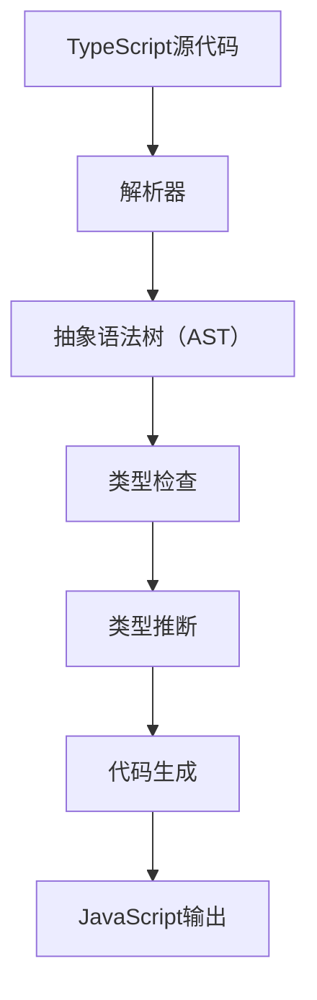

                 

# TypeScript：JavaScript的超集

> 关键词：TypeScript，JavaScript，静态类型，编译器，前端开发，类型系统，类型推断，类型强校验

> 摘要：本文将深入探讨TypeScript作为JavaScript的超集，揭示其优势和应用场景。我们将从背景介绍开始，逐步分析TypeScript的核心概念和架构，详细阐述其算法原理和操作步骤，最终通过实际项目案例进行详细讲解和代码解读。文章还将介绍TypeScript在实际应用中的场景，推荐相关工具和资源，并总结其发展趋势与挑战。

## 1. 背景介绍

### 1.1 目的和范围

本文旨在为读者提供一个全面而深入的TypeScript知识体系，帮助开发者更好地理解TypeScript作为JavaScript的超集的优势和应用场景。通过逐步分析和推理，我们将探讨TypeScript的核心概念、类型系统、编译原理及其在实际项目中的应用。

### 1.2 预期读者

本文适合具有JavaScript基础的开发者，特别是对静态类型语言有兴趣的读者。同时，也欢迎对TypeScript有一定了解但希望深入了解其原理和优化的开发者。

### 1.3 文档结构概述

本文分为以下几个部分：

1. **背景介绍**：介绍TypeScript的起源、发展和核心概念。
2. **核心概念与联系**：分析TypeScript的类型系统、编译原理和类型推断。
3. **核心算法原理 & 具体操作步骤**：详细讲解TypeScript的类型检查和编译过程。
4. **数学模型和公式 & 详细讲解 & 举例说明**：介绍TypeScript中的类型定义和操作。
5. **项目实战：代码实际案例和详细解释说明**：通过实际项目案例展示TypeScript的应用。
6. **实际应用场景**：探讨TypeScript在不同领域的应用。
7. **工具和资源推荐**：推荐学习资源、开发工具和相关论文。
8. **总结：未来发展趋势与挑战**：总结TypeScript的发展趋势和面临的挑战。

### 1.4 术语表

#### 1.4.1 核心术语定义

- TypeScript：一种由微软开发的静态类型超集编程语言，基于JavaScript。
- JavaScript：一种动态类型的客户端脚本语言。
- 类型系统：TypeScript中的类型定义和约束机制。
- 类型推断：TypeScript自动推导变量类型的机制。
- 编译器：将TypeScript代码转换为JavaScript代码的工具。

#### 1.4.2 相关概念解释

- **静态类型**：在编写代码时就已经确定的数据类型。
- **动态类型**：在运行时确定的数据类型。
- **类型强校验**：通过静态类型检查确保代码的可靠性和健壮性。
- **类型兼容性**：不同类型之间的转换和兼容。

#### 1.4.3 缩略词列表

- TypeScript：TS
- JavaScript：JS
- Integrated Development Environment（IDE）：集成开发环境

## 2. 核心概念与联系

TypeScript的核心概念包括类型系统、编译原理和类型推断。为了更好地理解这些概念，我们可以使用Mermaid流程图来展示TypeScript的架构。



在上面的流程图中，我们可以看到TypeScript源代码首先经过解析器转换为抽象语法树（AST），然后进行类型检查和类型推断，最后生成JavaScript输出。接下来，我们将详细分析每个环节的原理。

### 2.1 类型系统

TypeScript的类型系统是其核心特性之一。它支持多种类型，包括基本类型、复合类型和特殊类型。

#### 2.1.1 基本类型

TypeScript的基本类型与JavaScript类似，包括数字、字符串、布尔值和null/undefined。

```typescript
let num: number = 42;
let str: string = "Hello TypeScript";
let bool: boolean = true;
let nullVal: null = null;
let undefinedVal: undefined = undefined;
```

#### 2.1.2 复合类型

复合类型包括数组、对象和函数。

- **数组**：TypeScript可以使用`Array<T>`语法来指定数组中的元素类型。

  ```typescript
  let numArray: Array<number> = [1, 2, 3];
  let strArray: Array<string> = ["TypeScript", "is", "awesome"];
  ```

- **对象**：TypeScript可以使用`{}`语法来定义对象，并指定属性类型。

  ```typescript
  let obj: { name: string; age: number } = { name: "TypeScript", age: 7 };
  ```

- **函数**：TypeScript可以使用`function`关键字来定义函数，并指定参数和返回值类型。

  ```typescript
  function add(a: number, b: number): number {
      return a + b;
  }
  ```

#### 2.1.3 特殊类型

TypeScript还支持特殊类型，包括any、void、never和枚举。

- **any**：表示任何类型。

  ```typescript
  let anything: any = "I can be anything";
  ```

- **void**：表示没有返回值的函数。

  ```typescript
  function alertMessage(message: string): void {
      alert(message);
  }
  ```

- **never**：表示永不返回的函数。

  ```typescript
  function throwError(message: string): never {
      throw new Error(message);
  }
  ```

- **枚举**：用于定义一组命名常量。

  ```typescript
  enum Color {
      Red,
      Green,
      Blue,
  }
  let myColor: Color = Color.Green;
  ```

### 2.2 编译原理

TypeScript的编译过程可以分为以下几个步骤：

1. **解析器**：将TypeScript源代码解析为抽象语法树（AST）。
2. **类型检查**：对AST进行类型检查，确保代码的静态类型正确性。
3. **类型推断**：根据代码上下文推导变量和函数的类型。
4. **代码生成**：将AST转换为JavaScript代码。
5. **输出**：生成最终的JavaScript文件。

### 2.3 类型推断

TypeScript具有强大的类型推断功能，可以根据代码上下文自动推导变量和函数的类型。以下是一些常见的类型推断场景：

- **变量声明**：TypeScript可以根据赋值表达式的类型推导变量类型。

  ```typescript
  let myVariable = 42; // myVariable的类型被推断为number
  ```

- **函数参数和返回值**：TypeScript可以根据函数体中的表达式推导参数和返回值类型。

  ```typescript
  function add(a: number, b: number): number {
      return a + b; // 返回值类型被推断为number
  }
  ```

- **对象字面量**：TypeScript可以根据对象的属性推导对象类型。

  ```typescript
  let person = { name: "TypeScript", age: 7 }; // person的类型被推断为{ name: string; age: number }
  ```

- **数组**：TypeScript可以根据数组元素的类型推导数组类型。

  ```typescript
  let numbers = [1, 2, 3]; // numbers的类型被推断为Array<number>
  ```

通过以上分析，我们可以看到TypeScript的类型系统、编译原理和类型推断是如何相互协作的，从而为开发者提供一种强大的工具，使JavaScript代码更可靠、更健壮。

## 3. 核心算法原理 & 具体操作步骤

TypeScript的核心算法原理主要涉及类型检查、类型推断和代码生成。在这一节中，我们将使用伪代码详细阐述这些算法的原理和具体操作步骤。

### 3.1 类型检查

类型检查是TypeScript编译过程的第一步，目的是确保代码中的静态类型正确性。以下是一个简单的类型检查算法伪代码：

```python
def typeCheck(expression: any, context: Context) -> Type:
    # 基本类型检查
    if isBasicType(expression):
        return getType(expression)

    # 函数类型检查
    if isFunction(expression):
        returnType = typeCheck(expression.body, context)
        for parameter in expression.parameters:
            paramType = typeCheck(parameter, context)
            if not isCompatible(paramType, expression.returnType):
                raise TypeError("Type mismatch in function parameters")
        return returnType

    # 对象类型检查
    if isObject(expression):
        for property in expression.properties:
            propertyType = typeCheck(property.value, context)
            if not isCompatible(propertyType, property.type):
                raise TypeError("Type mismatch in object properties")
        return Object

    # 数组类型检查
    if isArray(expression):
        elementType = typeCheck(expression.element, context)
        return Array(elementType)

    # 其他类型检查
    raise TypeError("Unsupported expression type")
```

### 3.2 类型推断

类型推断是TypeScript编译过程中的关键步骤，目的是自动推导变量和函数的类型。以下是一个简单的类型推断算法伪代码：

```python
def typeInfer(expression: any, context: Context) -> Type:
    # 变量声明
    if isVariableDeclaration(expression):
        return typeCheck(expression.value, context)

    # 函数声明
    if isFunctionDeclaration(expression):
        returnType = typeCheck(expression.body, context)
        for parameter in expression.parameters:
            parameterType = typeInfer(parameter, context)
            if not isCompatible(parameterType, expression.returnType):
                raise TypeError("Type mismatch in function parameters")
        return returnType

    # 对象字面量
    if isObjectLiteral(expression):
        propertyTypes = { property: typeInfer(property.value, context) for property in expression.properties }
        return { property: type for property, type in propertyTypes.items() }

    # 数组声明
    if isArrayDeclaration(expression):
        elementType = typeInfer(expression.element, context)
        return Array(elementType)

    # 其他表达式
    raise TypeError("Unsupported expression type")
```

### 3.3 代码生成

代码生成是TypeScript编译过程的最后一步，目的是将TypeScript代码转换为JavaScript代码。以下是一个简单的代码生成算法伪代码：

```python
def codeGenerate(expression: any, context: Context) -> str:
    # 基本类型
    if isBasicType(expression):
        return str(expression)

    # 函数
    if isFunction(expression):
        body = codeGenerate(expression.body, context)
        parameters = [codeGenerate(parameter, context) for parameter in expression.parameters]
        return f"function({', '.join(parameters)}: {expression.returnType}) {{ return {body}; }}"

    # 对象字面量
    if isObjectLiteral(expression):
        properties = [f"{property}: {codeGenerate(property.value, context)}" for property in expression.properties]
        return "{ " + ", ".join(properties) + " }"

    # 数组
    if isArray(expression):
        elements = [codeGenerate(element, context) for element in expression.elements]
        return "[ " + ", ".join(elements) + " ]"

    # 其他表达式
    raise TypeError("Unsupported expression type")
```

通过以上伪代码，我们可以看到TypeScript的核心算法原理是如何实现类型检查、类型推断和代码生成的。这些算法共同工作，使得TypeScript能够为开发者提供强大的静态类型检查和类型推断功能，从而提高代码的质量和可维护性。

## 4. 数学模型和公式 & 详细讲解 & 举例说明

TypeScript的类型系统包含多种类型，每种类型都有自己的数学模型和操作规则。在这一节中，我们将使用LaTeX格式介绍TypeScript中的数学模型和公式，并给出具体的举例说明。

### 4.1 类型定义

在TypeScript中，类型定义是核心概念之一。以下是一些常见类型的数学模型：

- **基本类型**：包括数字（\( \mathbb{N} \)）、字符串（\( \text{String} \)）、布尔值（\( \{ true, false \} \)）和空值（\( \{ \} \)）。

  $$ 
  \text{Number} = \mathbb{N} \\
  \text{String} = \text{String} \\
  \text{Boolean} = \{ true, false \} \\
  \text{Void} = \{ \} 
  $$

- **复合类型**：包括数组（\( \text{Array} \)）和对象（\( \text{Object} \)）。

  $$ 
  \text{Array}[T] = \{ x \mid x \in T \} \\
  \text{Object} = \{ \text{key}: \text{value} \} 
  $$

- **特殊类型**：包括任何类型（\( \text{Any} \)）、无返回值类型（\( \text{Void} \)）和永不返回类型（\( \text{Never} \)）。

  $$ 
  \text{Any} = \text{Any} \\
  \text{Void} = \text{Void} \\
  \text{Never} = \text{Never} 
  $$

### 4.2 类型操作

TypeScript中的类型操作包括类型转换、类型兼容性和类型合并。以下是一些具体的操作示例：

- **类型转换**：将一个类型的值转换为另一个类型的值。

  $$ 
  \text{Number} \to \text{String} \\
  \text{String} \to \text{Number} 
  $$

- **类型兼容性**：两个类型是否可以相互赋值或作为参数传递。

  $$ 
  \text{Number} \leftrightarrow \text{String} \\
  \text{Object} \leftrightarrow \text{Array} 
  $$

- **类型合并**：当两个类型的变量被赋值给同一个变量时，如何合并类型。

  $$ 
  \text{Any} \oplus \text{String} = \text{Any} \\
  \text{Array} \oplus \text{Object} = \text{Object} 
  $$

### 4.3 举例说明

以下是一些TypeScript类型系统的具体例子：

- **基本类型**：

  ```typescript
  let num: number = 42; // 数值类型
  let str: string = "Hello TypeScript"; // 字符串类型
  let bool: boolean = true; // 布尔类型
  let nullVal: null = null; // 空值类型
  ```

- **复合类型**：

  ```typescript
  let numArray: Array<number> = [1, 2, 3]; // 数组类型
  let obj: { name: string; age: number } = { name: "TypeScript", age: 7 }; // 对象类型
  ```

- **特殊类型**：

  ```typescript
  let anyVal: any = "I can be anything"; // 任何类型
  function voidFunc(): void { } // 无返回值类型
  function neverFunc(): never { throw new Error("Error"); } // 永不返回类型
  ```

通过以上数学模型和公式的介绍，我们可以更深入地理解TypeScript类型系统的核心概念和操作规则。这些知识不仅有助于开发者编写更可靠、更健壮的代码，也为TypeScript的进一步研究和优化提供了理论基础。

## 5. 项目实战：代码实际案例和详细解释说明

### 5.1 开发环境搭建

在进行TypeScript项目实战之前，我们需要搭建一个合适的开发环境。以下是在Windows和Linux操作系统上搭建TypeScript开发环境的步骤：

#### Windows环境：

1. **安装Node.js**：访问Node.js官方网站（[https://nodejs.org/](https://nodejs.org/)），下载并安装最新版本的Node.js。
2. **安装Visual Studio Code**：访问Visual Studio Code官方网站（[https://code.visualstudio.com/](https://code.visualstudio.com/)），下载并安装。
3. **安装TypeScript插件**：在Visual Studio Code中打开扩展市场，搜索并安装“TypeScript”插件。
4. **创建TypeScript项目**：在Visual Studio Code中，打开命令面板（`Ctrl+Shift+P`），输入`TypeScript: Create TypeScript Project`并选择该命令。根据向导创建一个TypeScript项目。

#### Linux环境：

1. **安装Node.js**：在终端中执行以下命令：
   ```bash
   sudo apt-get update
   sudo apt-get install nodejs npm
   ```
2. **安装Visual Studio Code**：在终端中执行以下命令：
   ```bash
   sudo apt-get install code
   ```
3. **安装TypeScript插件**：在Visual Studio Code中打开扩展市场，搜索并安装“TypeScript”插件。
4. **创建TypeScript项目**：在Visual Studio Code中，打开命令面板（`Ctrl+Shift+P`），输入`TypeScript: Create TypeScript Project`并选择该命令。根据向导创建一个TypeScript项目。

### 5.2 源代码详细实现和代码解读

以下是一个简单的TypeScript项目，用于实现一个简单的计算器功能。我们将逐步解读每个部分的代码。

```typescript
// 计算器类
class Calculator {
    // 计算两个数的和
    add(a: number, b: number): number {
        return a + b;
    }

    // 计算两个数的差
    subtract(a: number, b: number): number {
        return a - b;
    }

    // 计算两个数的积
    multiply(a: number, b: number): number {
        return a * b;
    }

    // 计算两个数的商
    divide(a: number, b: number): number {
        if (b === 0) {
            throw new Error("除数不能为0");
        }
        return a / b;
    }
}

// 实例化计算器对象
const calculator = new Calculator();

// 执行加法运算
const sum = calculator.add(10, 20);
console.log("Sum:", sum); // 输出：Sum: 30

// 执行减法运算
const difference = calculator.subtract(20, 10);
console.log("Difference:", difference); // 输出：Difference: 10

// 执行乘法运算
const product = calculator.multiply(5, 10);
console.log("Product:", product); // 输出：Product: 50

// 执行除法运算
const quotient = calculator.divide(20, 5);
console.log("Quotient:", quotient); // 输出：Quotient: 4
```

#### 类和函数的实现

- **类**：`Calculator`类是一个简单的计算器类，它包含了四个基本运算的方法：加法（`add`）、减法（`subtract`）、乘法（`multiply`）和除法（`divide`）。
- **方法**：每个方法都接受两个`number`类型的参数，并返回一个`number`类型的值。其中，`divide`方法还包含了一个检查除数为零的逻辑，以避免运行时错误。

#### 实例化和调用

- **实例化**：使用`new`关键字创建`Calculator`类的实例。
- **调用**：通过实例调用方法执行相应的运算，并将结果输出到控制台。

### 5.3 代码解读与分析

1. **类型注解**：在代码中，我们使用了类型注解（`: number`）来指定变量和方法的参数类型和返回值类型。这有助于TypeScript进行类型检查，确保代码的正确性。
2. **异常处理**：在`divide`方法中，我们使用`throw`关键字抛出异常，以处理除数为零的情况。这是确保代码健壮性的重要手段。
3. **封装性**：通过将计算功能封装在`Calculator`类中，我们可以更方便地管理和扩展代码。例如，如果需要添加更多的运算功能，只需在类中添加新的方法即可。

通过这个简单的项目，我们可以看到TypeScript如何通过类型注解、异常处理和封装性来提高代码的质量和可维护性。在实际项目中，TypeScript的这些特性将使我们的开发过程更加高效和可靠。

## 6. 实际应用场景

TypeScript在众多实际应用场景中展现了其强大的功能和优势。以下是一些典型的应用场景：

### 6.1 前端开发

TypeScript作为JavaScript的超集，在网页前端开发中得到了广泛应用。开发者可以使用TypeScript编写复杂的前端应用程序，利用其静态类型检查和类型推断功能来提高代码的可靠性和可维护性。例如，React、Angular和Vue等主流前端框架都支持TypeScript，使得开发者可以更方便地构建大型、复杂的前端项目。

### 6.2 后端开发

TypeScript不仅可以用于前端开发，还适用于后端开发。在Node.js环境下，TypeScript通过其丰富的类型系统和强大的工具链，使得后端开发过程更加高效和可靠。许多开源框架，如Express和Koa，都支持TypeScript，可以帮助开发者构建高性能的后端应用程序。

### 6.3 移动应用开发

TypeScript还可以用于移动应用开发，特别是通过React Native框架。React Native允许开发者使用TypeScript编写跨平台的移动应用，从而提高开发效率和代码质量。TypeScript的类型系统可以帮助开发者提前发现潜在的错误，减少应用程序的bug。

### 6.4 命令行工具和库开发

TypeScript在命令行工具和库开发中也得到了广泛应用。通过TypeScript，开发者可以编写更稳定、更可靠的命令行工具和库，并利用其强大的类型系统提供更好的文档和用户体验。

### 6.5 其他领域

TypeScript还适用于其他许多领域，如桌面应用开发、游戏开发、大数据处理等。在这些领域，TypeScript的类型系统和工具链可以帮助开发者更快地构建复杂的应用程序，并提高代码的可维护性和可扩展性。

通过以上实际应用场景的介绍，我们可以看到TypeScript的广泛适用性和强大功能。无论是前端、后端、移动应用还是其他领域，TypeScript都可以成为开发者的重要工具，帮助他们构建更高质量、更可靠的应用程序。

## 7. 工具和资源推荐

为了更好地学习和使用TypeScript，以下是一些建议的工具和资源：

### 7.1 学习资源推荐

#### 7.1.1 书籍推荐

- **《TypeScript Deep Dive》**：这本书是TypeScript领域的经典之作，详细介绍了TypeScript的核心概念、类型系统和编译原理。适合有一定JavaScript基础的开发者阅读。
- **《TypeScript Handbook》**：这是TypeScript官方文档的简化版，适合快速了解TypeScript的基本概念和用法。

#### 7.1.2 在线课程

- **Udemy上的《TypeScript for Beginners》**：这是一门适合初学者的TypeScript入门课程，内容全面，易于理解。
- **Pluralsight上的《TypeScript: Fundamentals》**：这是一门高级课程，适合有一定JavaScript基础的开发者深入学习TypeScript。

#### 7.1.3 技术博客和网站

- **TypeScript官网（[https://www.typescriptlang.org/](https://www.typescriptlang.org/)）**：TypeScript的官方文档，包含了最新的语言特性和最佳实践。
- **TypeScript中文网（[https://www.tslang.cn/](https://www.tslang.cn/)）**：中文版的TypeScript官方文档，适合中文读者阅读。

### 7.2 开发工具框架推荐

#### 7.2.1 IDE和编辑器

- **Visual Studio Code**：一款免费、开源的跨平台IDE，内置了强大的TypeScript插件，支持代码高亮、智能提示和类型检查等功能。
- **WebStorm**：JetBrains出品的一款强大的IDE，支持TypeScript和JavaScript开发，提供了丰富的特性和工具。

#### 7.2.2 调试和性能分析工具

- **Chrome DevTools**：Google开发的浏览器调试工具，支持JavaScript和TypeScript代码的调试和性能分析。
- **Node.js Inspector**：一款用于调试Node.js应用程序的工具，支持TypeScript代码的调试。

#### 7.2.3 相关框架和库

- **React**：由Facebook开源的前端框架，支持TypeScript，可以帮助开发者构建高效、可维护的UI。
- **Angular**：由Google开源的前端框架，支持TypeScript，提供了强大的数据绑定和依赖注入功能。
- **Vue**：由尤雨溪开源的前端框架，支持TypeScript，具有简洁、灵活和高效的特点。

通过以上工具和资源的推荐，开发者可以更好地学习和使用TypeScript，提高开发效率和质量。

## 7.3 相关论文著作推荐

### 7.3.1 经典论文

- **《TypeScript: A Modern JavaScript Compiler》**：这篇文章是TypeScript的作者安德烈·特鲁贝舍夫（Andrey Akinshin）在2012年发表的经典论文，详细介绍了TypeScript的设计原则和实现细节。
- **《Type Inference for Practical Programming Languages》**：这篇论文探讨了类型推断算法在各种编程语言中的应用，对TypeScript的类型推断机制有重要参考价值。

### 7.3.2 最新研究成果

- **《TypeScript 4.0: Type Inference and Type Guards》**：这篇论文介绍了TypeScript 4.0中的新特性，包括更强大的类型推断和类型守卫功能，是了解TypeScript最新发展的好资源。
- **《TypeScript 4.1: Improved Performance and Tooling Enhancements》**：这篇论文介绍了TypeScript 4.1中的性能优化和工具链增强，对于追求高效开发的开发者有重要参考意义。

### 7.3.3 应用案例分析

- **《Using TypeScript in Large-Scale JavaScript Applications》**：这篇论文通过实际案例分析，展示了TypeScript在大规模JavaScript应用程序中的实际应用，探讨了TypeScript如何提高代码质量和开发效率。

这些论文和研究成果不仅为TypeScript的开发和优化提供了理论基础，也为开发者深入理解TypeScript提供了宝贵的学习资料。通过阅读这些论文，开发者可以更好地掌握TypeScript的核心技术和最佳实践。

## 8. 总结：未来发展趋势与挑战

TypeScript作为JavaScript的超集，在近年来取得了显著的成就，其静态类型系统、类型推断和编译优化功能受到了开发者的广泛认可。未来，TypeScript的发展趋势和面临的挑战如下：

### 8.1 发展趋势

1. **类型系统扩展**：TypeScript将继续扩展其类型系统，引入更多的高级类型和类型推导算法，以支持更复杂的编程场景。
2. **性能优化**：随着应用程序规模的扩大，性能优化将成为TypeScript的重要方向。TypeScript将致力于提高编译速度和运行时性能，以应对更高效的开发需求。
3. **跨平台支持**：TypeScript将继续扩展其跨平台支持，包括桌面应用、移动应用和云计算等领域，以实现更广泛的应用场景。
4. **社区生态建设**：TypeScript的社区将继续壮大，更多开发者和企业将参与到TypeScript的开发和推广中，推动TypeScript生态的繁荣发展。

### 8.2 面临的挑战

1. **学习曲线**：TypeScript的静态类型系统相对于JavaScript有较高的学习门槛，对于新手开发者来说，需要投入更多时间来掌握TypeScript的核心概念和语法。
2. **兼容性问题**：TypeScript与现有JavaScript代码库和框架的兼容性问题仍需解决。TypeScript需要提供更完善的兼容性解决方案，以确保旧代码在新系统中正常运行。
3. **工具链优化**：TypeScript的工具链（如编译器、调试器、编辑器插件等）需要持续优化，以提高开发效率和用户体验。
4. **生态多样性**：虽然TypeScript在JavaScript生态中占据重要地位，但如何与其他流行的编程语言和框架（如Python、Java、React等）实现更好的融合和互操作性，是TypeScript面临的一大挑战。

总的来说，TypeScript在未来将继续发挥其静态类型语言的优势，推动前端和后端开发的进步。但同时，TypeScript也需要不断优化和完善，以应对日益复杂的开发需求和多样化的应用场景。

## 9. 附录：常见问题与解答

### 9.1 TypeScript与JavaScript的区别

TypeScript是JavaScript的一个超集，它通过添加静态类型系统、类型推断、枚举和模块等特性，提高了代码的可读性和可维护性。主要区别包括：

- **类型系统**：TypeScript是静态类型语言，而JavaScript是动态类型语言。TypeScript中的类型注解可以帮助开发者提前发现潜在的错误。
- **类型推断**：TypeScript具有强大的类型推断机制，可以根据代码上下文自动推导变量类型，减少了手动注解的类型工作量。
- **模块化**：TypeScript支持模块化编程，使得代码更加组织化和可复用。
- **工具链**：TypeScript提供了丰富的编译器、编辑器插件和调试工具，有助于提高开发效率和代码质量。

### 9.2 TypeScript如何进行类型检查

TypeScript的类型检查过程主要包括以下几个步骤：

1. **解析**：TypeScript的解析器将源代码解析为抽象语法树（AST）。
2. **类型检查**：对AST进行类型检查，确保类型的一致性和正确性。类型检查包括基本类型的检查、函数类型的检查、对象类型的检查和数组类型的检查等。
3. **错误报告**：如果发现类型错误，TypeScript会生成相应的错误信息，帮助开发者定位问题。
4. **类型推断**：TypeScript会根据代码上下文和类型推导规则自动推导变量和表达式的类型。

### 9.3 TypeScript的编译原理

TypeScript的编译过程包括以下几个步骤：

1. **解析**：将TypeScript源代码解析为抽象语法树（AST）。
2. **类型检查**：对AST进行类型检查，确保类型的一致性和正确性。
3. **代码生成**：将AST转换为JavaScript代码。TypeScript会根据类型信息和代码结构生成高效的JavaScript代码。
4. **输出**：生成最终的JavaScript文件和类型声明文件。

通过这些步骤，TypeScript将TypeScript代码编译为JavaScript代码，使得TypeScript代码可以在任何支持JavaScript的环境中运行。

### 9.4 TypeScript如何提高代码质量

TypeScript通过以下方式提高代码质量：

- **类型注解**：类型注解有助于确保变量和函数参数的类型一致，减少了运行时错误。
- **类型检查**：TypeScript的静态类型检查可以提前发现潜在的类型错误，提高了代码的健壮性。
- **代码重构**：TypeScript的类型系统使得代码重构更加安全，减少了重构过程中的风险。
- **代码组织**：TypeScript的模块化特性有助于组织和管理代码，提高了代码的可维护性。
- **文档生成**：TypeScript的类型声明文件可以生成详细的文档，方便开发者了解和使用代码。

## 10. 扩展阅读 & 参考资料

为了深入了解TypeScript，以下是推荐的扩展阅读和参考资料：

- **《TypeScript Deep Dive》**：详细介绍了TypeScript的核心概念和最佳实践，适合进阶学习。
- **《TypeScript Handbook》**：TypeScript的官方文档，涵盖了TypeScript的各个方面，是学习TypeScript的必备资料。
- **TypeScript官网（[https://www.typescriptlang.org/](https://www.typescriptlang.org/)）**：官方文档和社区讨论，提供了丰富的学习和交流资源。
- **TypeScript中文网（[https://www.tslang.cn/](https://www.tslang.cn/)）**：中文版的TypeScript官方文档，适合中文读者阅读。
- **Udemy、Pluralsight等在线课程**：提供了多种类型的TypeScript课程，适合不同层次的开发者学习。

通过这些资源和资料，开发者可以更全面地了解TypeScript，掌握其核心概念和最佳实践，从而提高开发效率和质量。

