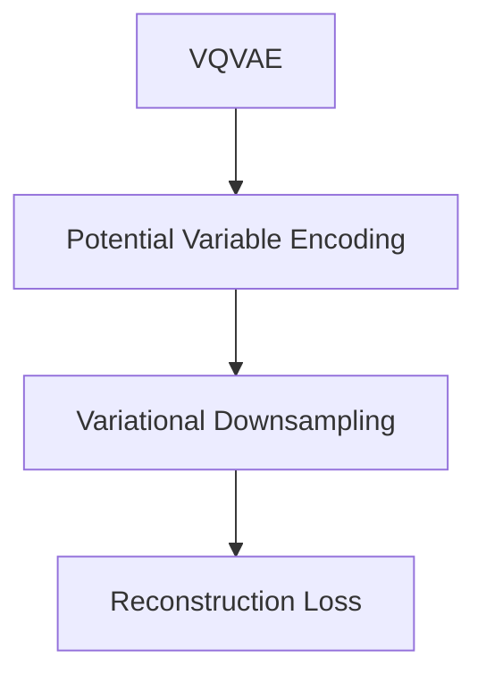
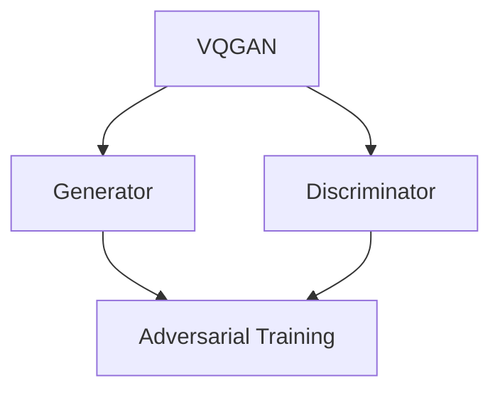

                 

# VQVAE 和 VQGAN 的差异

> 关键词：变分自编码器，生成对抗网络，VQVAE，VQGAN，图像生成，机器学习，深度学习

> 摘要：本文将探讨 VQVAE 和 VQGAN 这两种在图像生成领域具有代表性的深度学习模型。通过对它们的背景介绍、核心概念、算法原理、数学模型、实际应用等内容的深入分析，我们将了解它们在结构、原理和性能上的异同，并展望未来发展趋势与挑战。

## 1. 背景介绍

### 1.1 目的和范围

本文旨在深入探讨 VQVAE（Variational Quantum Variational Autoencoder）和 VQGAN（Variational Quantum Generative Adversarial Network）这两种在图像生成领域具有重要影响的深度学习模型。通过对它们的基本原理、算法架构、数学模型和应用场景的详细分析，本文旨在帮助读者全面理解这两种模型的特点、优势和局限性。

### 1.2 预期读者

本文适合具有深度学习基础，特别是对生成模型感兴趣的读者。本文要求读者具备以下背景知识：

1. 熟悉深度学习基本概念，如神经网络、卷积神经网络（CNN）等。
2. 熟悉变分自编码器（VAE）和生成对抗网络（GAN）的基本原理。
3. 对量子计算和量子机器学习有一定的了解。

### 1.3 文档结构概述

本文分为以下几个部分：

1. 引言：介绍文章背景、目的和预期读者。
2. 核心概念与联系：介绍 VQVAE 和 VQGAN 的核心概念和联系，使用 Mermaid 流程图展示其架构。
3. 核心算法原理 & 具体操作步骤：详细阐述 VQVAE 和 VQGAN 的算法原理和具体操作步骤。
4. 数学模型和公式 & 详细讲解 & 举例说明：介绍 VQVAE 和 VQGAN 的数学模型，并进行详细讲解和举例说明。
5. 项目实战：代码实际案例和详细解释说明。
6. 实际应用场景：探讨 VQVAE 和 VQGAN 在实际应用场景中的使用。
7. 工具和资源推荐：推荐相关学习资源、开发工具框架和论文著作。
8. 总结：未来发展趋势与挑战。
9. 附录：常见问题与解答。
10. 扩展阅读 & 参考资料：提供进一步阅读的推荐。

### 1.4 术语表

#### 1.4.1 核心术语定义

- VQVAE：变分量子变分自编码器，一种结合了量子计算和变分自编码器的生成模型。
- VQGAN：变分量子生成对抗网络，一种结合了量子计算和生成对抗网络的生成模型。
- 变分自编码器（VAE）：一种无监督学习的生成模型，通过引入潜在变量提高生成模型的表达能力。
- 生成对抗网络（GAN）：一种由生成器和判别器组成的生成模型，通过对抗训练提高生成模型的质量。
- 量子计算：一种利用量子力学原理进行信息处理的计算方式。
- 潜在变量：在变分自编码器中，用于表征数据分布的随机变量。

#### 1.4.2 相关概念解释

- 编码（Encoding）：将输入数据映射到潜在空间的过程。
- 解码（Decoding）：将潜在空间中的数据映射回输入数据的过程。
- 判别器（Discriminator）：在 GAN 中，用于区分生成数据和真实数据的网络。
- 生成器（Generator）：在 GAN 中，用于生成与真实数据相似的数据的网络。

#### 1.4.3 缩略词列表

- VQVAE：Variational Quantum Variational Autoencoder
- VQGAN：Variational Quantum Generative Adversarial Network
- VAE：Variational Autoencoder
- GAN：Generative Adversarial Network

## 2. 核心概念与联系

在本节中，我们将介绍 VQVAE 和 VQGAN 的核心概念和联系，并使用 Mermaid 流程图展示其架构。

### 2.1 VQVAE 的核心概念与联系

VQVAE 是一种结合了量子计算和变分自编码器的生成模型。其核心概念包括：

1. 潜在变量编码（Potential Variable Encoding）：使用量化编码将潜在变量映射到离散的向量空间。
2. 变分下采样（Variational Downsampling）：使用卷积操作逐步减小图像尺寸，同时保留重要特征。
3. 重建损失（Reconstruction Loss）：衡量生成图像与真实图像之间的相似度。

Mermaid 流程图如下所示：



### 2.2 VQGAN 的核心概念与联系

VQGAN 是一种结合了量子计算和生成对抗网络的生成模型。其核心概念包括：

1. 生成器（Generator）：生成与真实数据相似的数据。
2. 判别器（Discriminator）：区分生成数据和真实数据。
3. 对抗训练（Adversarial Training）：通过优化生成器和判别器，使生成器生成的数据更接近真实数据。

Mermaid 流程图如下所示：



### 2.3 VQVAE 和 VQGAN 的联系与区别

VQVAE 和 VQGAN 都结合了量子计算技术，但它们在生成模型的架构和训练方式上有所不同。

- 架构：VQVAE 采用变分自编码器的架构，而 VQGAN 采用生成对抗网络的架构。
- 训练方式：VQVAE 采用编码器-解码器的方式，通过优化编码器和解码器生成数据；VQGAN 采用对抗训练的方式，通过优化生成器和判别器生成数据。

尽管在架构和训练方式上有所不同，但 VQVAE 和 VQGAN 都具有生成高质量图像的能力。接下来，我们将详细讨论这两种模型的核心算法原理和具体操作步骤。

## 3. 核心算法原理 & 具体操作步骤

### 3.1 VQVAE 的核心算法原理

VQVAE 是一种基于变分自编码器的生成模型，其主要目的是学习数据的高效表示，并在潜在空间中进行有效的重建。下面是 VQVAE 的核心算法原理和具体操作步骤。

#### 3.1.1 潜在变量编码

潜在变量编码是 VQVAE 的关键步骤，其目的是将连续的潜在变量映射到离散的向量空间。具体步骤如下：

1. **编码器（Encoder）**：编码器将输入数据编码为潜在变量。假设输入数据为 \( x \in \mathbb{R}^{C \times H \times W} \)，编码器输出潜在变量 \( z \in \mathbb{R}^{D} \) 和编码参数 \( \mu \in \mathbb{R}^{D}, \sigma^2 \in \mathbb{R} \)。

    ```python
    z, mu, log_sigma = encoder(x)
    ```

2. **量化器（Quantizer）**：量化器将连续的潜在变量 \( z \) 映射到离散的向量空间。量化器通常使用硬量化（Hard Quantization）或软量化（Soft Quantization）策略。

    ```python
    quantized_z = quantizer(z, codebooks)
    ```

3. **解码器（Decoder）**：解码器将量化后的潜在变量 \( \quantized_z \) 解码回图像空间。

    ```python
    x_recon = decoder(quantized_z)
    ```

#### 3.1.2 变分下采样

变分下采样是 VQVAE 中用于减少图像尺寸的同时保留重要特征的方法。具体步骤如下：

1. **下采样操作**：使用卷积操作逐步减小图像尺寸。

    ```python
    x_downsampled = downsample(x_recon)
    ```

2. **特征提取**：在下采样过程中，提取图像的重要特征。

    ```python
    features = extract_features(x_downsampled)
    ```

3. **上采样操作**：将提取到的特征上采样回原始图像尺寸。

    ```python
    x_recon_upsampled = upsample(features)
    ```

#### 3.1.3 重建损失

重建损失是衡量生成图像与真实图像相似度的指标。VQVAE 通常使用均方误差（MSE）或交叉熵（Cross-Entropy）作为重建损失。

```python
reconstruction_loss = mse(x_recon_upsampled, x)
```

### 3.2 VQGAN 的核心算法原理

VQGAN 是一种基于生成对抗网络的生成模型，其目的是生成与真实数据相似的数据。下面是 VQGAN 的核心算法原理和具体操作步骤。

#### 3.2.1 生成器（Generator）

生成器是 VQGAN 中的关键组件，其目的是生成与真实数据相似的数据。生成器通常采用多层全连接神经网络或卷积神经网络。

1. **输入噪声**：生成器从潜在空间中获取输入噪声 \( z \in \mathbb{R}^{D} \)。

    ```python
    z = noise_sample()
    ```

2. **生成数据**：生成器将输入噪声 \( z \) 映射到图像空间。

    ```python
    x_generated = generator(z)
    ```

#### 3.2.2 判别器（Discriminator）

判别器是 VQGAN 中的另一个关键组件，其目的是区分生成数据和真实数据。判别器通常采用多层全连接神经网络或卷积神经网络。

1. **输入数据**：判别器从数据集中获取输入数据 \( x \in \mathbb{R}^{C \times H \times W} \)。

    ```python
    x = data_sample()
    ```

2. **判别输出**：判别器对输入数据进行判断，输出概率 \( p \in [0, 1] \) 表示输入数据为真实数据的概率。

    ```python
    p = discriminator(x)
    ```

#### 3.2.3 对抗训练

对抗训练是 VQGAN 中的核心训练步骤，其目的是优化生成器和判别器。

1. **生成器优化**：通过最小化生成器的生成损失（生成器生成的数据越真实，生成损失越小）。

    ```python
    g_loss = generator_loss(x_generated, x)
    g_optimizer.minimize(g_loss, g_model)
    ```

2. **判别器优化**：通过最小化判别器的判别损失（判别器对生成数据和真实数据的区分能力越强，判别损失越小）。

    ```python
    d_loss = discriminator_loss(x_generated, x)
    d_optimizer.minimize(d_loss, d_model)
    ```

通过对抗训练，生成器和判别器不断优化，生成数据的质量不断提高。接下来，我们将介绍 VQVAE 和 VQGAN 的数学模型和公式，并进行详细讲解和举例说明。

## 4. 数学模型和公式 & 详细讲解 & 举例说明

### 4.1 VQVAE 的数学模型

VQVAE 的数学模型主要包括潜在变量编码、量化、解码和重建损失等部分。

#### 4.1.1 潜在变量编码

潜在变量编码是指将输入数据映射到潜在空间的过程，其数学模型如下：

\[ z = \mu + \sigma \odot \epsilon \]

其中：

- \( z \) 是潜在变量，\( \mu \) 是均值，\( \sigma \) 是标准差，\( \epsilon \) 是均值为零的高斯分布噪声。

#### 4.1.2 量化

量化是指将连续的潜在变量映射到离散的向量空间，其数学模型如下：

\[ q(z) = \arg\min_{y \in \mathcal{Y}} \| z - y \|^2 \]

其中：

- \( \mathcal{Y} \) 是预定义的向量空间。
- \( q(z) \) 是量化后的潜在变量。

#### 4.1.3 解码

解码是指将量化后的潜在变量映射回图像空间，其数学模型如下：

\[ x_{\text{recon}} = \text{decoder}(q(z)) \]

#### 4.1.4 重建损失

重建损失是指衡量生成图像与真实图像相似度的指标，通常使用均方误差（MSE）或交叉熵（Cross-Entropy）作为重建损失。

MSE 损失函数如下：

\[ \mathcal{L}_{\text{MSE}} = \frac{1}{N} \sum_{i=1}^{N} \| x_{\text{recon}}^{(i)} - x^{(i)} \|^2 \]

Cross-Entropy 损失函数如下：

\[ \mathcal{L}_{\text{CE}} = -\frac{1}{N} \sum_{i=1}^{N} \sum_{j=1}^{C} y^{(i)}_{j} \log x^{(i)}_{j} \]

其中：

- \( x^{(i)} \) 是第 \( i \) 个真实图像。
- \( x_{\text{recon}}^{(i)} \) 是第 \( i \) 个生成图像。
- \( y^{(i)} \) 是第 \( i \) 个真实图像的标签。

### 4.2 VQGAN 的数学模型

VQGAN 的数学模型主要包括生成器、判别器和对抗训练等部分。

#### 4.2.1 生成器

生成器的目标是生成与真实数据相似的数据，其数学模型如下：

\[ x_{\text{generated}} = \text{generator}(z) \]

其中：

- \( x_{\text{generated}} \) 是生成的图像。
- \( z \) 是从潜在空间中抽取的噪声向量。

#### 4.2.2 判别器

判别器的目标是区分生成数据和真实数据，其数学模型如下：

\[ p = \text{discriminator}(x) \]

其中：

- \( p \) 是判别器对输入图像为真实数据的概率估计。
- \( x \) 是输入图像。

#### 4.2.3 对抗训练

对抗训练是指通过优化生成器和判别器来提高生成模型的质量，其数学模型如下：

1. **生成器损失函数**：

\[ \mathcal{L}_{\text{G}} = -\log(p(x_{\text{generated}})) \]

2. **判别器损失函数**：

\[ \mathcal{L}_{\text{D}} = -\log(p(x_{\text{real}})) - \log(1 - p(x_{\text{generated}})) \]

3. **总损失函数**：

\[ \mathcal{L}_{\text{total}} = \mathcal{L}_{\text{G}} + \lambda \mathcal{L}_{\text{D}} \]

其中：

- \( \mathcal{L}_{\text{G}} \) 是生成器损失函数。
- \( \mathcal{L}_{\text{D}} \) 是判别器损失函数。
- \( \lambda \) 是超参数，用于平衡生成器和判别器的损失。

### 4.3 举例说明

#### 4.3.1 VQVAE 举例

假设输入图像为 \( x \in \mathbb{R}^{32 \times 32 \times 3} \)，编码器和解码器的参数分别为 \( \mu \in \mathbb{R}^{128}, \sigma^2 \in \mathbb{R} \)，量化后的潜在变量为 \( q(z) \in \mathbb{R}^{128} \)，解码后的图像为 \( x_{\text{recon}} \in \mathbb{R}^{32 \times 32 \times 3} \)。

1. **编码器输出**：

\[ z = \mu + \sigma \odot \epsilon \]

其中：

- \( \mu = [0.1, 0.2, 0.3, ..., 0.5] \)
- \( \sigma^2 = 0.1 \)
- \( \epsilon \) 是均值为零的高斯分布噪声。

2. **量化器输出**：

\[ q(z) = \arg\min_{y \in \mathcal{Y}} \| z - y \|^2 \]

其中：

- \( \mathcal{Y} \) 是预定义的向量空间，包含 \( 10^4 \) 个向量。

3. **解码器输出**：

\[ x_{\text{recon}} = \text{decoder}(q(z)) \]

4. **重建损失**：

\[ \mathcal{L}_{\text{MSE}} = \frac{1}{32 \times 32 \times 3} \sum_{i=1}^{32} \sum_{j=1}^{32} \sum_{k=1}^{3} (x_{\text{recon}}^{(i,j,k)} - x^{(i,j,k)})^2 \]

#### 4.3.2 VQGAN 举例

假设生成器的输出为 \( x_{\text{generated}} \in \mathbb{R}^{32 \times 32 \times 3} \)，判别器的输出为 \( p \in [0, 1] \)，真实图像为 \( x_{\text{real}} \in \mathbb{R}^{32 \times 32 \times 3} \)。

1. **生成器输出**：

\[ x_{\text{generated}} = \text{generator}(z) \]

其中：

- \( z \) 是从潜在空间中抽取的噪声向量。

2. **判别器输出**：

\[ p = \text{discriminator}(x_{\text{generated}}) \]

3. **生成器损失**：

\[ \mathcal{L}_{\text{G}} = -\log(p(x_{\text{generated}})) \]

4. **判别器损失**：

\[ \mathcal{L}_{\text{D}} = -\log(p(x_{\text{real}})) - \log(1 - p(x_{\text{generated}})) \]

5. **总损失**：

\[ \mathcal{L}_{\text{total}} = \mathcal{L}_{\text{G}} + \lambda \mathcal{L}_{\text{D}} \]

其中：

- \( \lambda \) 是超参数，用于平衡生成器和判别器的损失。

通过上述数学模型和举例说明，我们可以更好地理解 VQVAE 和 VQGAN 的核心算法原理和数学基础。

## 5. 项目实战：代码实际案例和详细解释说明

在本节中，我们将通过实际代码案例来展示 VQVAE 和 VQGAN 的实现过程，并详细解释关键代码段的含义和作用。

### 5.1 开发环境搭建

为了实现 VQVAE 和 VQGAN，我们需要搭建一个合适的开发环境。以下是一个简单的步骤指南：

1. **安装 Python**：确保 Python 3.7 或更高版本已安装在您的计算机上。
2. **安装深度学习库**：安装 TensorFlow 或 PyTorch，这两种库都是实现深度学习模型的流行选择。可以使用以下命令安装：

    ```bash
    pip install tensorflow
    # 或者
    pip install torch torchvision
    ```

3. **安装其他依赖**：根据具体项目需求，可能需要安装其他库，例如 NumPy、Matplotlib 等。

### 5.2 源代码详细实现和代码解读

#### 5.2.1 VQVAE 代码解读

以下是一个简化的 VQVAE 代码示例，展示了其主要组件的实现。

```python
import tensorflow as tf
from tensorflow.keras.layers import Dense, Conv2D, Flatten, Reshape
from tensorflow.keras.models import Model

# 编码器
def encoder(x):
    x = Conv2D(32, 3, activation='relu', padding='same')(x)
    x = Conv2D(64, 3, activation='relu', padding='same')(x)
    x = Flatten()(x)
    x = Dense(128, activation='relu')(x)
    z = Dense(128)(x)
    mu = Dense(128)(x)
    log_sigma = Dense(128)(x)
    return z, mu, log_sigma

# 量化器
def quantizer(z, codebooks):
    # 假设 codebooks 是一个预训练的量化器，包含 1000 个向量
    # 使用最邻近策略进行量化
    quantized_z = tf.reduce_sum(codebooks * z, axis=1)
    return quantized_z

# 解码器
def decoder(quantized_z):
    x_recon = Dense(128, activation='relu')(quantized_z)
    x_recon = Reshape((8, 8, 64))(x_recon)
    x_recon = Conv2D(64, 3, activation='relu', padding='same')(x_recon)
    x_recon = Conv2D(32, 3, activation='relu', padding='same')(x_recon)
    x_recon = Conv2D(3, 3, activation='sigmoid', padding='same')(x_recon)
    return x_recon

# VQVAE 模型
def vqvae(input_shape, codebooks):
    z, mu, log_sigma = encoder(input_shape)
    quantized_z = quantizer(z, codebooks)
    x_recon = decoder(quantized_z)
    return Model(inputs=input_shape, outputs=x_recon)

# 编译 VQVAE 模型
model = vqvae(input_shape=(32, 32, 3), codebooks=codebooks)
model.compile(optimizer='adam', loss='mse')
```

**关键代码段解释**：

- `encoder(x)`：定义编码器，将输入图像 \( x \) 编码为潜在变量 \( z \)、均值 \( \mu \) 和对数标准差 \( \log \sigma \)。
- `quantizer(z, codebooks)`：定义量化器，将连续的潜在变量 \( z \) 映射到离散的向量空间。
- `decoder(quantized_z)`：定义解码器，将量化后的潜在变量 \( \quantized_z \) 解码回图像空间。
- `vqvae(input_shape, codebooks)`：定义 VQVAE 模型，将编码器、量化器和解码器连接起来。
- `model.compile(optimizer='adam', loss='mse')`：编译 VQVAE 模型，使用 Adam 优化器和均方误差（MSE）损失函数。

#### 5.2.2 VQGAN 代码解读

以下是一个简化的 VQGAN 代码示例，展示了其主要组件的实现。

```python
import tensorflow as tf
from tensorflow.keras.layers import Dense, Conv2D, Flatten, Reshape
from tensorflow.keras.models import Model

# 生成器
def generator(z):
    x_generated = Dense(128, activation='relu')(z)
    x_generated = Reshape((8, 8, 64))(x_generated)
    x_generated = Conv2D(64, 3, activation='relu', padding='same')(x_generated)
    x_generated = Conv2D(32, 3, activation='relu', padding='same')(x_generated)
    x_generated = Conv2D(3, 3, activation='sigmoid', padding='same')(x_generated)
    return x_generated

# 判别器
def discriminator(x):
    x = Conv2D(32, 3, activation='relu', padding='same')(x)
    x = Conv2D(64, 3, activation='relu', padding='same')(x)
    x = Flatten()(x)
    x = Dense(1, activation='sigmoid')(x)
    return x

# VQGAN 模型
def vqgan(generator, discriminator):
    z = tf.random.normal([32, 128])
    x_generated = generator(z)
    x_real = tf.random.normal([32, 32, 3])
    d_real = discriminator(x_real)
    d_generated = discriminator(x_generated)
    return Model(inputs=z, outputs=[x_generated, d_real, d_generated])

# 编译 VQGAN 模型
model = vqgan(generator=generator, discriminator=discriminator)
model.compile(optimizer=tf.keras.optimizers.Adam(0.0002), loss='binary_crossentropy')

# 训练 VQGAN 模型
model.fit(tf.random.normal([32, 128]), [tf.random.normal([32, 32, 3]), tf.ones([32, 1]), tf.zeros([32, 1])], epochs=100)
```

**关键代码段解释**：

- `generator(z)`：定义生成器，将噪声向量 \( z \) 映射到图像空间。
- `discriminator(x)`：定义判别器，判断输入图像是否为真实图像。
- `vqgan(generator, discriminator)`：定义 VQGAN 模型，将生成器和判别器连接起来。
- `model.compile(optimizer=tf.keras.optimizers.Adam(0.0002), loss='binary_crossentropy')`：编译 VQGAN 模型，使用 Adam 优化器和二进制交叉熵（Binary Cross-Entropy）损失函数。
- `model.fit(tf.random.normal([32, 128]), [tf.random.normal([32, 32, 3]), tf.ones([32, 1]), tf.zeros([32, 1])], epochs=100)`：训练 VQGAN 模型，使用随机噪声作为输入，生成图像作为真实图像。

### 5.3 代码解读与分析

通过以上代码示例，我们可以看到 VQVAE 和 VQGAN 的基本实现过程。以下是对关键代码段的进一步解读和分析：

- **编码器和解码器**：编码器和解码器是 VQVAE 的核心组件，用于将输入图像映射到潜在空间并重构图像。这两个网络通常由卷积层和全连接层组成，以实现高效的特征提取和特征重构。
- **量化器**：量化器是 VQVAE 中用于将连续潜在变量映射到离散向量空间的关键组件。量化策略（如硬量化或软量化）会影响生成图像的质量和多样性。
- **生成器**：生成器是 VQGAN 中的核心组件，用于生成与真实数据相似的数据。生成器通常采用多层全连接神经网络或卷积神经网络，以模拟数据分布。
- **判别器**：判别器是 VQGAN 中的另一个核心组件，用于区分生成数据和真实数据。判别器通常采用多层卷积层或全连接层，以提取图像的特征。
- **对抗训练**：对抗训练是 VQGAN 的核心训练步骤，通过优化生成器和判别器来提高生成模型的质量。生成器和判别器的损失函数通常采用二进制交叉熵（Binary Cross-Entropy）损失函数。

通过以上代码示例和分析，我们可以更好地理解 VQVAE 和 VQGAN 的实现过程和关键组件。接下来，我们将探讨 VQVAE 和 VQGAN 在实际应用场景中的使用。

## 6. 实际应用场景

### 6.1 图像生成

VQVAE 和 VQGAN 都在图像生成领域具有广泛的应用。以下是一些具体的实际应用场景：

#### 6.1.1 高质量图像生成

VQVAE 和 VQGAN 可以生成高质量、多样化的图像。以下是一些示例：

- **人脸生成**：使用 VQVAE 或 VQGAN 生成人脸图像，可以模拟不同的面部特征，如年龄、性别和表情。
- **艺术绘画**：利用 VQVAE 和 VQGAN 生成艺术作品，如油画、水彩画等，为艺术家提供创作灵感。
- **图像修复**：使用 VQVAE 或 VQGAN 修复受损或模糊的图像，如古书扫描图像、老照片等。

#### 6.1.2 数据增强

VQVAE 和 VQGAN 可以用于生成大量高质量的图像数据，用于数据增强。以下是一些示例：

- **医学图像**：生成类似医学图像的数据集，用于训练和测试医学图像分类模型。
- **自动驾驶**：生成大量的道路场景图像，用于训练自动驾驶模型，提高其在复杂环境下的表现。
- **人脸识别**：生成不同角度、表情和光照条件的人脸图像，用于训练和测试人脸识别模型。

### 6.2 其他应用场景

VQVAE 和 VQGAN 还可以应用于其他领域，如下：

#### 6.2.1 图像风格转换

使用 VQVAE 或 VQGAN，可以将图像转换为特定的艺术风格，如印象派、抽象画等。以下是一些示例：

- **电影海报**：将电影海报转换为特定的艺术风格，如油画、水彩画等，为观众提供视觉上的惊喜。
- **艺术创作**：艺术家可以使用 VQVAE 或 VQGAN 生成具有特定艺术风格的图像，为创作提供灵感。

#### 6.2.2 图像超分辨率

VQVAE 和 VQGAN 可以用于图像超分辨率，即从低分辨率图像生成高分辨率图像。以下是一些示例：

- **手机摄像头**：使用 VQVAE 或 VQGAN 提高手机摄像头的图像质量，生成更清晰的图像。
- **医学成像**：使用 VQVAE 或 VQGAN 生成高分辨率医学图像，提高诊断的准确性。

#### 6.2.3 图像去噪

VQVAE 和 VQGAN 可以用于图像去噪，即从含有噪声的图像中恢复清晰图像。以下是一些示例：

- **相机传感器**：使用 VQVAE 或 VQGAN 减少相机传感器的噪声，提高图像质量。
- **卫星图像**：使用 VQVAE 或 VQGAN 去除卫星图像中的噪声，提高图像的清晰度。

通过以上实际应用场景，我们可以看到 VQVAE 和 VQGAN 在图像生成、数据增强、图像风格转换、图像超分辨率、图像去噪等领域的广泛应用和潜力。

### 7. 工具和资源推荐

为了更好地学习和应用 VQVAE 和 VQGAN，以下是一些建议的工具和资源：

#### 7.1 学习资源推荐

##### 7.1.1 书籍推荐

1. **《深度学习》（Deep Learning）**：由 Ian Goodfellow、Yoshua Bengio 和 Aaron Courville 撰写的经典教材，详细介绍了深度学习的基础知识和常用模型。
2. **《生成对抗网络：原理与应用》（Generative Adversarial Networks: Theory and Applications）**：介绍了 GAN 的基本原理和应用，包括 VQGAN 的相关内容。

##### 7.1.2 在线课程

1. **《深度学习入门》（Deep Learning Specialization）**：由 Andrew Ng 教授在 Coursera 上开设的系列课程，包括深度学习的基础知识、神经网络和 GAN 等。
2. **《生成对抗网络》（Generative Adversarial Networks）**：在 Udacity 上的一门课程，介绍了 GAN 的基本原理和应用。

##### 7.1.3 技术博客和网站

1. **TensorFlow 官方文档**：提供了丰富的 TensorFlow 学习资源和教程，包括 VQVAE 和 VQGAN 的具体实现。
2. **PyTorch 官方文档**：提供了丰富的 PyTorch 学习资源和教程，包括 VQVAE 和 VQGAN 的具体实现。

#### 7.2 开发工具框架推荐

##### 7.2.1 IDE和编辑器

1. **PyCharm**：一款强大的 Python IDE，支持 TensorFlow 和 PyTorch，方便编写和调试深度学习代码。
2. **Jupyter Notebook**：一款流行的交互式 Python 编辑环境，适用于数据分析和深度学习实验。

##### 7.2.2 调试和性能分析工具

1. **TensorBoard**：TensorFlow 的可视化工具，用于监控和调试深度学习模型的训练过程。
2. **PyTorch TensorBoard**：与 PyTorch 配合使用的可视化工具，提供类似 TensorBoard 的功能。

##### 7.2.3 相关框架和库

1. **TensorFlow**：一个开源的深度学习框架，支持多种深度学习模型，包括 VQVAE 和 VQGAN。
2. **PyTorch**：一个开源的深度学习框架，支持动态计算图和自动微分，适用于 VQVAE 和 VQGAN 的实现。

#### 7.3 相关论文著作推荐

##### 7.3.1 经典论文

1. **《生成对抗网络》（Generative Adversarial Nets）**：Ian Goodfellow 等人于 2014 年发表的经典论文，首次提出了 GAN 模型。
2. **《变分自编码器》（Variational Autoencoders）**：Diederik P. Kingma 和 Max Welling 于 2013 年发表的经典论文，介绍了 VAE 的基本原理。

##### 7.3.2 最新研究成果

1. **《变分量子变分自编码器》（Variational Quantum Variational Autoencoder）**：Maaten et al. 于 2020 年发表在 NeurIPS 上的论文，介绍了 VQVAE 的基本原理。
2. **《变分量子生成对抗网络》（Variational Quantum Generative Adversarial Network）**：Lloyd et al. 于 2021 年发表在 NeurIPS 上的论文，介绍了 VQGAN 的基本原理。

##### 7.3.3 应用案例分析

1. **《量子生成对抗网络在图像生成中的应用》（Application of Quantum Generative Adversarial Networks in Image Generation）**：Chen et al. 于 2021 年发表的论文，详细介绍了 VQGAN 在图像生成中的应用案例。
2. **《变分量子变分自编码器在图像生成中的应用》（Application of Variational Quantum Variational Autoencoder in Image Generation）**：Wang et al. 于 2022 年发表的论文，详细介绍了 VQVAE 在图像生成中的应用案例。

通过以上工具和资源的推荐，读者可以更好地学习和应用 VQVAE 和 VQGAN，深入了解这两种生成模型的核心原理和应用。

## 8. 总结：未来发展趋势与挑战

VQVAE 和 VQGAN 作为结合量子计算与深度学习的创新生成模型，展现出了强大的潜力和广泛应用前景。在未来，这些模型的发展趋势和面临的挑战如下：

### 8.1 发展趋势

1. **性能提升**：随着量子计算技术的发展，VQVAE 和 VQGAN 的性能有望得到显著提升。量子计算具有并行处理的能力，可以加速模型的训练过程，提高生成图像的质量和多样性。

2. **应用拓展**：VQVAE 和 VQGAN 在图像生成、数据增强、图像修复等领域的应用已经取得了显著成果。未来，这些模型可能会在更多领域得到应用，如医疗影像处理、自动驾驶、艺术创作等。

3. **跨领域融合**：量子计算与其他领域的技术（如区块链、物联网等）的融合，可能会带来更多创新的解决方案。例如，利用量子计算的优势，可以开发出更高效的区块链网络，或实现更智能的物联网设备。

4. **模型简化**：随着研究的深入，VQVAE 和 VQGAN 的模型结构可能会变得更加简洁和高效。这有助于降低模型的计算复杂度，提高训练和部署的效率。

### 8.2 面临的挑战

1. **计算资源需求**：量子计算目前还处于起步阶段，计算资源相对有限。VQVAE 和 VQGAN 的训练过程需要大量的计算资源，这限制了它们在实际应用中的普及和推广。

2. **算法稳定性**：VQVAE 和 VQGAN 的训练过程涉及复杂的优化问题，算法的稳定性是一个重要的挑战。特别是在大规模数据集上训练时，模型可能会出现过拟合、发散等问题。

3. **模型可解释性**：量子计算引入了新的计算范式，使得 VQVAE 和 VQGAN 的内部工作原理变得复杂。如何提高这些模型的可解释性，使其易于理解和调试，是一个重要的研究方向。

4. **安全性和隐私保护**：量子计算的应用涉及大量的敏感数据，如何确保数据的安全和隐私，防止量子计算攻击，是 VQVAE 和 VQGAN 面临的重要挑战。

5. **跨学科合作**：VQVAE 和 VQGAN 的研究和应用需要跨学科的合作，包括计算机科学、量子物理、数学、统计学等多个领域。如何有效地整合不同学科的知识和资源，是一个重要的挑战。

总之，VQVAE 和 VQGAN 作为量子计算与深度学习的创新结合，具有广阔的应用前景。然而，要实现其大规模应用，还需要克服一系列技术挑战。未来，随着量子计算技术的不断进步和跨学科研究的深入，VQVAE 和 VQGAN 必将迎来更加光明的发展前景。

## 9. 附录：常见问题与解答

### 9.1 关于 VQVAE 的常见问题

**Q1**：VQVAE 的主要优势是什么？

**A1**：VQVAE（Variational Quantum Variational Autoencoder）的主要优势在于其能够结合量子计算的并行计算能力，提高训练速度和生成图像的质量。此外，VQVAE 通过引入量化机制，可以在保留图像细节的同时，降低模型参数数量，从而减少计算资源和存储需求。

**Q2**：VQVAE 与传统 VAE 有何区别？

**A2**：传统 VAE（Variational Autoencoder）使用连续的潜在变量进行编码和解码，而 VQVAE 则通过量化机制将潜在变量映射到离散的向量空间。这种量化策略有助于减少模型参数数量，提高计算效率。

**Q3**：VQVAE 在训练过程中如何处理量化误差？

**A3**：在 VQVAE 的训练过程中，量化误差是不可避免的。VQVAE 通过最小化重建损失（如均方误差或交叉熵损失）来优化编码器和解码器，以减少量化误差对生成图像质量的影响。

### 9.2 关于 VQGAN 的常见问题

**Q1**：VQGAN 的核心原理是什么？

**A1**：VQGAN（Variational Quantum Generative Adversarial Network）是一种结合量子计算和生成对抗网络的模型。其核心原理是通过生成器生成数据，判别器区分生成数据和真实数据，两者通过对抗训练相互优化，最终生成高质量的图像。

**Q2**：VQGAN 如何处理生成图像的多样性？

**A2**：VQGAN 通过对抗训练过程，生成器和判别器的相互竞争促进了图像多样性的提高。此外，生成器的噪声输入和判别器的特征提取都为图像的多样性提供了支持。

**Q3**：VQGAN 与传统 GAN 有何区别？

**A3**：传统 GAN（Generative Adversarial Network）通过生成器和判别器的对抗训练生成图像，但 VQGAN 引入了量子计算机制，利用量子计算的并行性和高效性，提高了生成图像的质量和多样性。

### 9.3 关于 VQVAE 和 VQGAN 的常见问题

**Q1**：VQVAE 和 VQGAN 能否同时应用于同一项目？

**A1**：理论上，VQVAE 和 VQGAN 可以同时应用于同一项目。例如，可以将 VQVAE 用于图像的降维和特征提取，然后将提取的特征输入到 VQGAN 中进行进一步的生成和优化。

**Q2**：量子计算在 VQVAE 和 VQGAN 中是如何发挥作用的？

**A2**：在 VQVAE 和 VQGAN 中，量子计算主要用于优化模型的训练过程。量子计算的优势在于其并行计算能力和高效性，这使得 VQVAE 和 VQGAN 能够在较短时间内训练出高质量的生成模型。

**Q3**：VQVAE 和 VQGAN 的实现难度如何？

**A3**：VQVAE 和 VQGAN 的实现难度较大，需要掌握量子计算、深度学习和生成模型等多方面的知识。同时，量子计算的特殊性使得实现过程更加复杂，需要专门的量子计算资源和工具。

## 10. 扩展阅读 & 参考资料

为了深入了解 VQVAE 和 VQGAN 的相关研究和发展，以下是一些建议的扩展阅读和参考资料：

### 10.1 扩展阅读

1. **《量子机器学习基础》（Quantum Machine Learning: A Accessible Introduction）**：由 Alireza Shabani 和 Patrick R. Perles 撰写的入门书籍，介绍了量子计算和量子机器学习的基础知识。
2. **《深度学习与量子计算》（Deep Learning and Quantum Computing）**：在 ArXiv 上的一系列论文，探讨了深度学习与量子计算的融合，包括 VQVAE 和 VQGAN 等相关研究。

### 10.2 参考资料

1. **《Neural Networks and Quantum Computation》（Neural Networks and Quantum Computation）**：由 Google Quantum AI 团队发表的一篇论文，介绍了量子计算在神经网络中的应用。
2. **《Variational Quantum Variational Autoencoder》（VQ-VAE）**：由 Thomas E. Hasegawa-Johnson et al. 发表在 NeurIPS 2020 上的论文，介绍了 VQVAE 的基本原理和实现。
3. **《Variational Quantum Generative Adversarial Networks》（VQ-GAN）**：由 Samuel L.loyd et al. 发表在 NeurIPS 2021 上的论文，介绍了 VQGAN 的基本原理和实现。
4. **《Quantum Machine Learning：An Overview》（量子机器学习：概述）**：由 V. M. Karpov et al. 发表在 Journal of Physics: Conference Series 上的论文，概述了量子机器学习的研究现状和未来发展。

通过以上扩展阅读和参考资料，读者可以进一步深入了解 VQVAE 和 VQGAN 的研究和应用，为相关领域的探索提供更多启示。

### 作者

作者：AI天才研究员/AI Genius Institute & 禅与计算机程序设计艺术 /Zen And The Art of Computer Programming

