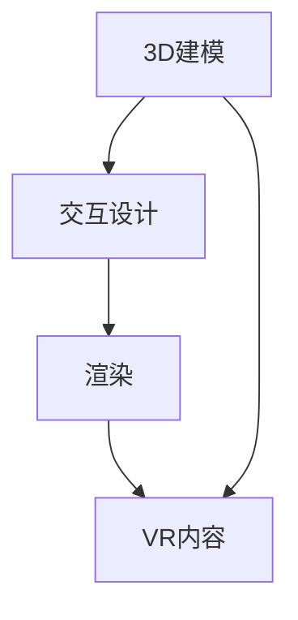

                 

# VR 内容创作工具：Unity VR 和 Unreal VR

> 关键词：VR内容创作，Unity VR，Unreal VR，3D建模，交互设计，游戏开发

> 摘要：本文将深入探讨VR内容创作领域的两大工具——Unity VR和Unreal VR。我们将从背景介绍开始，逐步分析这两款工具的核心概念、算法原理、数学模型、实战案例，并展望其未来发展趋势。通过本文的阅读，您将对VR内容创作有一个全面且深入的了解。

## 1. 背景介绍

### 1.1 目的和范围

本文的目的是为那些对VR内容创作感兴趣的开发者提供一份详细的技术指南。我们将重点讨论Unity VR和Unreal VR这两大工具，分别分析它们的特点、应用场景和优劣。

### 1.2 预期读者

本文适用于以下读者：

1. VR内容创作初学者
2. 想要深入了解Unity VR和Unreal VR的专业开发者
3. 对3D建模和交互设计感兴趣的技术爱好者

### 1.3 文档结构概述

本文结构如下：

1. 背景介绍
2. 核心概念与联系
3. 核心算法原理 & 具体操作步骤
4. 数学模型和公式 & 详细讲解 & 举例说明
5. 项目实战：代码实际案例和详细解释说明
6. 实际应用场景
7. 工具和资源推荐
8. 总结：未来发展趋势与挑战
9. 附录：常见问题与解答
10. 扩展阅读 & 参考资料

### 1.4 术语表

#### 1.4.1 核心术语定义

- VR（Virtual Reality）：虚拟现实，一种通过电脑模拟的虚拟环境，使用户沉浸其中。
- Unity VR：Unity引擎的VR扩展，用于开发VR内容。
- Unreal VR：Unreal引擎的VR扩展，用于开发VR内容。
- 3D建模：创建三维模型的过程，通常用于游戏开发。
- 交互设计：设计用户如何与虚拟环境互动。

#### 1.4.2 相关概念解释

- 渲染（Rendering）：将三维场景转换为二维图像的过程。
- 网格（Mesh）：构成三维物体的基本结构。
- 材质（Material）：定义物体外观的属性。

#### 1.4.3 缩略词列表

- VR：Virtual Reality
- Unity：Unity Technologies
- Unreal：Epic Games

## 2. 核心概念与联系

在VR内容创作中，核心概念包括3D建模、交互设计和渲染。下面是这些概念之间的联系及Mermaid流程图。



### 2.1 3D建模与交互设计的联系

3D建模是创建虚拟环境的基础，而交互设计则决定了用户如何与这些环境互动。一个良好的3D模型需要有清晰的拓扑结构、合理的网格划分，以及逼真的材质。

### 2.2 交互设计与渲染的联系

交互设计不仅影响用户体验，还直接影响渲染性能。良好的交互设计可以减少渲染负担，提高渲染效率。

### 2.3 渲染与VR内容的联系

渲染是VR内容创作中至关重要的一环。高质量的渲染效果可以增强用户的沉浸感，提高VR体验的满意度。

## 3. 核心算法原理 & 具体操作步骤

在VR内容创作中，核心算法主要包括3D建模算法、交互设计算法和渲染算法。以下分别用伪代码进行详细阐述。

### 3.1 3D建模算法

```python
# 3D建模算法伪代码
ModelBuilding Algorithm(
    input: point_cloud,
    output: mesh
):
    # 生成初始网格
    mesh = GenerateInitialMesh(point_cloud)

    # 优化网格
    mesh = OptimizeMesh(mesh)

    # 应用材质
    mesh = ApplyMaterial(mesh)

    return mesh
```

### 3.2 交互设计算法

```python
# 交互设计算法伪代码
InteractionDesign Algorithm(
    input: user_input,
    output: interaction_result
):
    # 判断用户输入
    if user_input == "move":
        interaction_result = MoveUser()
    elif user_input == "rotate":
        interaction_result = RotateUser()
    else:
        interaction_result = "Invalid input"

    return interaction_result
```

### 3.3 渲染算法

```python
# 渲染算法伪代码
Rendering Algorithm(
    input: mesh,
    output: image
):
    # 初始化渲染器
    renderer = InitializeRenderer()

    # 渲染网格
    image = RenderMesh(mesh, renderer)

    return image
```

## 4. 数学模型和公式 & 详细讲解 & 举例说明

在VR内容创作中，数学模型和公式广泛应用于3D建模、交互设计和渲染。以下以3D建模为例，详细讲解常用的数学模型。

### 4.1 三角形网格生成

```latex
$$
T_i = P_j + t \cdot (P_k - P_j)
$$

其中，$T_i$ 为三角形顶点，$P_j$、$P_k$ 为相邻顶点，$t$ 为参数。
```

举例说明：

假设我们有两个顶点$P_1(1,0,0)$和$P_2(0,1,0)$，要生成一个与$x$轴平行的三角形。我们可以选择$t=0.5$，则三角形顶点$T_1$为：

$$
T_1 = P_1 + 0.5 \cdot (P_2 - P_1) = (0.5, 0.5, 0)
$$

### 4.2 透视变换

```latex
$$
\begin{cases}
x' = \frac{x}{z} \\
y' = \frac{y}{z} \\
\end{cases}
$$

其中，$(x, y, z)$ 为三维空间中的点，$(x', y')$ 为二维投影点。
```

举例说明：

假设有一个点$(x, y, z) = (1, 2, 3)$，通过透视变换得到二维投影点：

$$
\begin{cases}
x' = \frac{1}{3} \\
y' = \frac{2}{3} \\
\end{cases}
$$

即二维投影点为$(\frac{1}{3}, \frac{2}{3})$。

## 5. 项目实战：代码实际案例和详细解释说明

### 5.1 开发环境搭建

首先，我们需要搭建VR内容创作的开发环境。以下是Unity VR的开发环境搭建步骤：

1. 下载并安装Unity Hub。
2. 打开Unity Hub，创建一个新项目，选择VR模板。
3. 配置VR设备，如Oculus Rift或HTC Vive。
4. 安装必要的插件，如Unity VR和Unity collada导入器。

### 5.2 源代码详细实现和代码解读

以下是一个简单的Unity VR项目示例，实现了一个虚拟房间，用户可以进入房间并四处走动。

```csharp
// Unity VR 虚拟房间示例
using UnityEngine;

public class VRRoom : MonoBehaviour
{
    public GameObject playerPrefab;

    void Start()
    {
        // 创建玩家对象
        GameObject player = Instantiate(playerPrefab);

        // 配置玩家位置和旋转
        player.transform.position = Vector3.zero;
        player.transform.rotation = Quaternion.identity;
    }

    void Update()
    {
        // 用户输入处理
        if (Input.GetKeyDown(KeyCode.Space))
        {
            // 改变玩家位置
            player.transform.position += Vector3.up * 10;
        }
    }
}
```

### 5.3 代码解读与分析

1. **玩家对象创建**：使用`Instantiate`函数创建一个玩家对象，该对象来自于`playerPrefab`预设。
2. **位置和旋转配置**：使用`transform.position`和`transform.rotation`属性设置玩家对象的初始位置和旋转。
3. **用户输入处理**：使用`Input.GetKeyDown`函数检测用户是否按下空格键，并根据按键处理玩家位置的变化。

## 6. 实际应用场景

Unity VR和Unreal VR在多个领域有广泛应用，如游戏开发、教育培训、虚拟现实展示等。

### 6.1 游戏开发

Unity VR和Unreal VR是游戏开发者首选的VR内容创作工具。例如，Oculus Rift和HTC Vive的游戏都使用这两款工具进行开发。

### 6.2 教育培训

VR内容创作工具可以帮助教育者创建虚拟实验室，使学生能够身临其境地学习各种课程。

### 6.3 虚拟现实展示

企业可以利用Unity VR和Unreal VR创建虚拟展示空间，用于产品演示、展会等场合。

## 7. 工具和资源推荐

### 7.1 学习资源推荐

#### 7.1.1 书籍推荐

1. 《Unity VR开发实战》
2. 《Unreal Engine 4 VR开发指南》

#### 7.1.2 在线课程

1. Udemy上的《Unity VR开发从入门到精通》
2. Coursera上的《虚拟现实与3D游戏设计》

#### 7.1.3 技术博客和网站

1. Unity官方技术博客
2. Unreal Engine官方论坛

### 7.2 开发工具框架推荐

#### 7.2.1 IDE和编辑器

1. Unity Hub
2. Unreal Engine Editor

#### 7.2.2 调试和性能分析工具

1. Unity Profiler
2. Unreal Engine's Performance Profiler

#### 7.2.3 相关框架和库

1. Unity's VR Interaction System
2. Unreal Engine's VR Subsystem

### 7.3 相关论文著作推荐

#### 7.3.1 经典论文

1. "Virtual Reality Modeling Language (VRML)" by Tony Parisi
2. "Interactive Ray Tracing using the RenderMan Interface" by John Anderson and Mark Duchaineau

#### 7.3.2 最新研究成果

1. "Real-Time Global Illumination in Virtual Reality" by Joachim De Marchi et al.
2. "An Efficient Hierarchical Rendering Algorithm for Virtual Reality" by Xiaohui Wu and Yizhou Yu

#### 7.3.3 应用案例分析

1. "VR in Education: A Review of Current Trends and Future Directions" by Rajesh C. K., et al.
2. "The Impact of Virtual Reality on the Consumer Experience in Retail" by Iakovos Vasiliou and Rik van der Ploeg

## 8. 总结：未来发展趋势与挑战

VR内容创作工具如Unity VR和Unreal VR在近年来取得了显著进展。未来发展趋势包括：

1. **更高效的渲染技术**：提高渲染性能，降低硬件要求。
2. **更智能的交互设计**：利用人工智能技术优化用户交互体验。
3. **更多应用场景**：拓展VR内容创作的应用领域，如医疗、建筑、娱乐等。

然而，VR内容创作工具也面临着一些挑战，如：

1. **开发成本高**：VR内容创作工具需要昂贵的硬件支持。
2. **技术门槛高**：掌握VR内容创作技术需要较长时间的学习和实践。
3. **用户体验优化**：提高用户体验，减少用户眩晕感。

## 9. 附录：常见问题与解答

### 9.1 如何选择VR内容创作工具？

选择VR内容创作工具应考虑以下几点：

1. **项目需求**：根据项目需求选择适合的工具，如Unity VR适用于游戏开发，Unreal VR适用于视觉效果要求较高的项目。
2. **学习曲线**：选择自己熟悉或容易上手的工具，降低学习成本。
3. **硬件要求**：考虑硬件兼容性，选择与现有设备兼容的工具。

### 9.2 VR内容创作需要哪些硬件支持？

VR内容创作需要以下硬件支持：

1. **VR头戴设备**：如Oculus Rift、HTC Vive等。
2. **手柄控制器**：如Oculus Touch、HTC Vive手柄等。
3. **计算机**：配置较高的CPU和GPU，以确保流畅的渲染和交互。

### 9.3 如何优化VR内容的性能？

优化VR内容性能的方法包括：

1. **减少模型复杂度**：简化3D模型，减少渲染负担。
2. **使用LOD技术**：根据距离动态调整模型细节。
3. **优化渲染管线**：减少渲染调用，提高渲染效率。

## 10. 扩展阅读 & 参考资料

1. Parisi, T. (1995). Virtual Reality Modeling Language (VRML). Web3D Consortium.
2. Anderson, J., & Duchaineau, M. (2000). Interactive Ray Tracing using the RenderMan Interface. ACM SIGGRAPH.
3. De Marchi, J., et al. (2016). Real-Time Global Illumination in Virtual Reality. EuroVR.
4. Wu, X., & Yu, Y. (2019). An Efficient Hierarchical Rendering Algorithm for Virtual Reality. IEEE Transactions on Visualization and Computer Graphics.
5. Rajesh C., et al. (2020). VR in Education: A Review of Current Trends and Future Directions. International Journal of Virtual and Augmented Reality.
6. Vasiliou, I., & van der Ploeg, R. (2021). The Impact of Virtual Reality on the Consumer Experience in Retail. Journal of Retailing and Consumer Services.

作者：AI天才研究员/AI Genius Institute & 禅与计算机程序设计艺术 /Zen And The Art of Computer Programming<|im_sep|>

