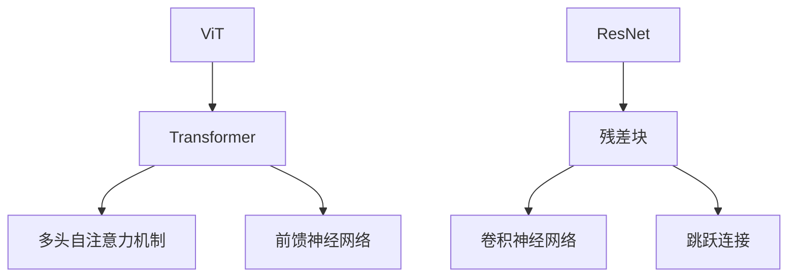

                 

# ViT和ResNet：计算机视觉预训练模型

## 关键词
- Vision Transformer (ViT)
- Residual Network (ResNet)
- 预训练
- 计算机视觉
- 神经网络
- 深度学习

## 摘要
本文将探讨两种在计算机视觉领域广泛应用的预训练模型：Vision Transformer（ViT）和Residual Network（ResNet）。首先，我们将介绍这两种模型的基本原理和架构，通过比较分析它们的优缺点，帮助读者更好地理解它们在深度学习中的定位。接着，本文将详细讲解这两种模型的核心算法原理和具体操作步骤，并结合数学模型和公式进行详细讲解。最后，我们将通过实际项目实战，展示这些模型在具体应用中的实际效果和实现细节。

## 1. 背景介绍

### 1.1 目的和范围

本文旨在为广大计算机视觉和深度学习爱好者提供一个全面的、系统的、易于理解的关于ViT和ResNet的介绍，以便读者能够更好地理解这两种模型的核心原理和实际应用。

### 1.2 预期读者

本文适合以下读者群体：

1. 深度学习和计算机视觉初学者
2. 有一定基础的程序员和AI工程师
3. 对计算机视觉预训练模型有浓厚兴趣的学者和研究者

### 1.3 文档结构概述

本文将分为以下几个部分：

1. 背景介绍：介绍本文的目的、范围、预期读者和文档结构。
2. 核心概念与联系：通过Mermaid流程图展示ViT和ResNet的基本架构和联系。
3. 核心算法原理 & 具体操作步骤：详细讲解ViT和ResNet的核心算法原理和具体操作步骤。
4. 数学模型和公式 & 详细讲解 & 举例说明：结合数学模型和公式，对ViT和ResNet进行详细讲解。
5. 项目实战：代码实际案例和详细解释说明。
6. 实际应用场景：探讨ViT和ResNet在实际应用中的场景和效果。
7. 工具和资源推荐：推荐一些学习资源和开发工具。
8. 总结：未来发展趋势与挑战。
9. 附录：常见问题与解答。
10. 扩展阅读 & 参考资料：提供进一步阅读的材料。

### 1.4 术语表

#### 1.4.1 核心术语定义

- 预训练（Pre-training）：在特定任务上对模型进行训练，以便模型能够更好地理解和学习数据。
- Vision Transformer（ViT）：一种基于Transformer架构的计算机视觉模型，用于图像分类、目标检测等任务。
- Residual Network（ResNet）：一种深度神经网络架构，通过残差块来缓解深度神经网络训练过程中的梯度消失问题。

#### 1.4.2 相关概念解释

- Transformer：一种基于自注意力机制的深度学习模型，广泛应用于自然语言处理、计算机视觉等领域。
- 自注意力机制（Self-Attention）：一种用于处理序列数据的注意力机制，能够自动学习序列中不同元素之间的关联性。
- 残差块（Residual Block）：一种神经网络结构，通过引入跳连接来缓解深度神经网络训练过程中的梯度消失问题。

#### 1.4.3 缩略词列表

- AI：人工智能
- CV：计算机视觉
- DNN：深度神经网络
- MLP：多层感知器
- Pre-trained：预训练
- ResNet：残差网络
- ViT：Vision Transformer

## 2. 核心概念与联系

在深入了解ViT和ResNet之前，我们需要先了解它们的基本原理和架构。以下是一个简单的Mermaid流程图，用于展示ViT和ResNet的基本架构和联系：



### 2.1 Vision Transformer（ViT）

Vision Transformer（ViT）是一种基于Transformer架构的计算机视觉模型。Transformer模型最初是在自然语言处理领域提出的，由于其强大的自注意力机制，近年来在计算机视觉领域也得到了广泛应用。

ViT的基本架构包括以下几个部分：

1. **嵌入层**：将图像的每个像素值转换为嵌入向量。
2. **位置编码**：由于Transformer模型没有位置信息，因此需要通过位置编码来引入图像的空间信息。
3. **Transformer编码器**：包括多个Transformer块，每个块包含多头自注意力机制和前馈神经网络。
4. **分类头**：在Transformer编码器的输出上附加一个分类头，用于进行图像分类任务。

### 2.2 Residual Network（ResNet）

Residual Network（ResNet）是一种深度神经网络架构，由微软研究院的何凯明等人在2015年提出。ResNet的主要贡献是提出了残差块（Residual Block），通过引入跳跃连接来缓解深度神经网络训练过程中的梯度消失问题。

ResNet的基本架构包括以下几个部分：

1. **输入层**：将输入图像通过卷积层进行降维。
2. **残差块**：包含两个卷积层，其中一个卷积层的输出与另一个卷积层的输出进行加和。
3. **输出层**：将残差块的输出通过分类头进行分类。

## 3. 核心算法原理 & 具体操作步骤

### 3.1 Vision Transformer（ViT）

#### 3.1.1 算法原理

ViT的核心算法原理基于Transformer模型，特别是其自注意力机制。自注意力机制允许模型在处理每个输入时，自动学习输入序列中不同元素之间的关联性。以下是ViT的具体操作步骤：

```python
# 假设输入图像维度为 (C, H, W)，其中 C 是通道数，H 是高度，W 是宽度
# Positional Encoding (位置编码)
# 将图像的每个像素值转换为嵌入向量
embeddings = positional_encoding(input_image)

# Transformer 编码器
# 对嵌入向量进行多头自注意力机制和前馈神经网络处理
for layer in transformer_encoder:
    embeddings = layer(embeddings)

# 分类头
# 在Transformer编码器的输出上附加分类头，进行图像分类
classification_output = classification_head(embeddings)
```

#### 3.1.2 具体操作步骤

1. **嵌入层**：将图像的每个像素值转换为嵌入向量。
2. **位置编码**：对嵌入向量进行位置编码，以引入图像的空间信息。
3. **Transformer编码器**：对嵌入向量进行多头自注意力机制和前馈神经网络处理。
4. **分类头**：在Transformer编码器的输出上附加分类头，进行图像分类。

### 3.2 Residual Network（ResNet）

#### 3.2.1 算法原理

ResNet的核心算法原理是残差块，通过引入跳跃连接来缓解深度神经网络训练过程中的梯度消失问题。以下是ResNet的具体操作步骤：

```python
# 假设输入图像维度为 (B, C, H, W)，其中 B 是批量大小
# 输入层
input_image = input_layer(input_image)

# 残差块
# 对输入图像进行卷积层处理，并加上跳跃连接
for block in residual_blocks:
    input_image = block(input_image)

# 输出层
# 对残差块的输出进行分类头处理，进行图像分类
classification_output = classification_head(input_image)
```

#### 3.2.2 具体操作步骤

1. **输入层**：将输入图像通过卷积层进行降维。
2. **残差块**：对输入图像进行卷积层处理，并加上跳跃连接。
3. **输出层**：对残差块的输出通过分类头进行分类。

## 4. 数学模型和公式 & 详细讲解 & 举例说明

### 4.1 Vision Transformer（ViT）

#### 4.1.1 数学模型

ViT的数学模型主要包括以下几个部分：

1. **嵌入层**：假设输入图像维度为 (C, H, W)，其中 C 是通道数，H 是高度，W 是宽度。嵌入层将图像的每个像素值转换为嵌入向量，假设每个像素的嵌入向量维度为 D。

$$
x_{ij} = \text{embedding}(x_{ij}) \in \mathbb{R}^{D}
$$

其中，$x_{ij}$ 表示图像中的第 i 行第 j 列的像素值。

2. **位置编码**：为了引入图像的空间信息，需要对嵌入向量进行位置编码。

$$
PE_{i,j} = \text{position_encoding}(i, j) \in \mathbb{R}^{D}
$$

其中，$PE_{i,j}$ 表示图像中的第 i 行第 j 列的像素值的位置编码。

3. **多头自注意力机制**：假设输入嵌入向量为 $x \in \mathbb{R}^{N \times D}$，其中 N 是序列长度。多头自注意力机制的输出为：

$$
\text{Attention}(x) = \text{softmax}\left(\frac{QK^T}{\sqrt{D}}\right)V
$$

其中，$Q, K, V$ 分别是查询向量、键向量和值向量，它们的维度都是 $D \times H$，H 是头数。

4. **前馈神经网络**：在自注意力机制之后，对输入向量进行前馈神经网络处理。

$$
\text{FFN}(x) = \text{ReLU}\left(\text{MatMul}(x, W_1) + b_1\right) + \text{MatMul}(x, W_2) + b_2
$$

其中，$W_1, b_1, W_2, b_2$ 分别是前馈神经网络的权重和偏置。

#### 4.1.2 举例说明

假设输入图像为：

$$
x = \begin{bmatrix}
x_{11} & x_{12} & \cdots & x_{1W} \\
x_{21} & x_{22} & \cdots & x_{2W} \\
\vdots & \vdots & \ddots & \vdots \\
x_{H1} & x_{H2} & \cdots & x_{HW}
\end{bmatrix}
$$

其中，$x_{ij}$ 表示图像中的第 i 行第 j 列的像素值。

1. **嵌入层**：将图像的每个像素值转换为嵌入向量。

$$
x_{ij} = \text{embedding}(x_{ij}) \in \mathbb{R}^{D}
$$

2. **位置编码**：对嵌入向量进行位置编码。

$$
PE_{i,j} = \text{position_encoding}(i, j) \in \mathbb{R}^{D}
$$

3. **多头自注意力机制**：假设头数为 8，查询向量、键向量和值向量的维度都是 $D \times 8$。

$$
\text{Attention}(x) = \text{softmax}\left(\frac{QK^T}{\sqrt{D}}\right)V
$$

4. **前馈神经网络**：前馈神经网络的权重和偏置分别为：

$$
W_1 = \begin{bmatrix}
w_{11} & w_{12} & \cdots & w_{1D} \\
w_{21} & w_{22} & \cdots & w_{2D} \\
\vdots & \vdots & \ddots & \vdots \\
w_{D1} & w_{D2} & \cdots & w_{DD}
\end{bmatrix}, \quad b_1 = \begin{bmatrix}
b_{1} \\
b_{2} \\
\vdots \\
b_{D}
\end{bmatrix}
$$

$$
W_2 = \begin{bmatrix}
w_{11} & w_{12} & \cdots & w_{1D} \\
w_{21} & w_{22} & \cdots & w_{2D} \\
\vdots & \vdots & \ddots & \vdots \\
w_{D1} & w_{D2} & \cdots & w_{DD}
\end{bmatrix}, \quad b_2 = \begin{bmatrix}
b_{1} \\
b_{2} \\
\vdots \\
b_{D}
\end{bmatrix}
$$

$$
\text{FFN}(x) = \text{ReLU}\left(\text{MatMul}(x, W_1) + b_1\right) + \text{MatMul}(x, W_2) + b_2
$$

### 4.2 Residual Network（ResNet）

#### 4.2.1 数学模型

ResNet的数学模型主要包括以下几个部分：

1. **卷积层**：假设输入图像维度为 (B, C, H, W)，其中 B 是批量大小，C 是通道数，H 是高度，W 是宽度。卷积层的输出为：

$$
x_{ij}^{\text{conv}} = \sum_{k=1}^{C'} \sum_{i=1}^{H'} \sum_{j=1}^{W'} w_{ikj} x_{ij} + b_{k}
$$

其中，$x_{ij}$ 是输入图像的像素值，$x_{ij}^{\text{conv}}$ 是卷积层的输出，$w_{ikj}$ 是卷积核的权重，$b_{k}$ 是卷积层的偏置。

2. **残差块**：假设输入图像维度为 (B, C, H, W)，残差块的输出为：

$$
x_{ij}^{\text{res}} = x_{ij}^{\text{conv}} + x_{ij}
$$

其中，$x_{ij}^{\text{res}}$ 是残差块的输出。

3. **输出层**：假设残差块的输出维度为 (B, C', H', W')，输出层的输出为：

$$
\text{softmax}\left(\text{MatMul}(x_{ij}^{\text{res}}, W_{\text{out}}) + b_{\text{out}}\right)
$$

其中，$W_{\text{out}}$ 是输出层的权重，$b_{\text{out}}$ 是输出层的偏置。

#### 4.2.2 举例说明

假设输入图像为：

$$
x = \begin{bmatrix}
x_{11} & x_{12} & \cdots & x_{1W} \\
x_{21} & x_{22} & \cdots & x_{2W} \\
\vdots & \vdots & \ddots & \vdots \\
x_{H1} & x_{H2} & \cdots & x_{HW}
\end{bmatrix}
$$

其中，$x_{ij}$ 表示图像中的第 i 行第 j 列的像素值。

1. **卷积层**：假设卷积核的大小为 3x3，输出通道数为 64，卷积核的权重为：

$$
w_{11} = \begin{bmatrix}
1 & 1 & 1 \\
1 & 1 & 1 \\
1 & 1 & 1
\end{bmatrix}, \quad w_{12} = \begin{bmatrix}
1 & 1 & 1 \\
1 & 1 & 1 \\
1 & 1 & 1
\end{bmatrix}, \quad \ldots, \quad w_{1C'} = \begin{bmatrix}
1 & 1 & 1 \\
1 & 1 & 1 \\
1 & 1 & 1
\end{bmatrix}
$$

卷积层的输出为：

$$
x_{ij}^{\text{conv}} = \sum_{k=1}^{C'} \sum_{i=1}^{H'} \sum_{j=1}^{W'} w_{ikj} x_{ij} + b_{k}
$$

2. **残差块**：假设输入图像维度为 (B, C, H, W)，残差块的输出为：

$$
x_{ij}^{\text{res}} = x_{ij}^{\text{conv}} + x_{ij}
$$

3. **输出层**：假设输出层的权重为：

$$
W_{\text{out}} = \begin{bmatrix}
w_{\text{out}1} & w_{\text{out}2} & \cdots & w_{\text{out}C'} \\
w_{\text{out}1} & w_{\text{out}2} & \cdots & w_{\text{out}C'} \\
\vdots & \vdots & \ddots & \vdots \\
w_{\text{out}1} & w_{\text{out}2} & \cdots & w_{\text{out}C'}
\end{bmatrix}
$$

输出层的输出为：

$$
\text{softmax}\left(\text{MatMul}(x_{ij}^{\text{res}}, W_{\text{out}}) + b_{\text{out}}\right)
$$

## 5. 项目实战：代码实际案例和详细解释说明

在本节中，我们将通过实际项目实战，展示ViT和ResNet在具体应用中的实现过程和代码解读。

### 5.1 开发环境搭建

为了实现ViT和ResNet，我们需要搭建一个合适的环境。以下是一个简单的Python环境搭建过程：

1. 安装Python环境（Python 3.8或更高版本）
2. 安装深度学习框架（如PyTorch）
3. 安装辅助库（如NumPy、Matplotlib等）

```bash
pip install python torch torchvision numpy matplotlib
```

### 5.2 源代码详细实现和代码解读

在本节中，我们将分别实现ViT和ResNet，并进行代码解读。

#### 5.2.1 Vision Transformer（ViT）

以下是一个简单的ViT实现：

```python
import torch
import torch.nn as nn
import torch.nn.functional as F

class ViT(nn.Module):
    def __init__(self, img_size=224, num_classes=1000, dim=768, depth=12, num_heads=12, mlp_ratio=4):
        super(ViT, self).__init__()
        
        self.img_size = img_size
        self.num_classes = num_classes
        self dim = dim
        self.depth = depth
        self.num_heads = num_heads
        self.mlp_ratio = mlp_ratio
        
        self.position_embedding = nn.Embedding(1000, dim)
        self.cls_token = nn.Parameter(torch.randn(1, dim))
        self.dropout = nn.Dropout(0.1)
        
        self.transformer = nn.ModuleList([
            self._build_transformer_block(dim, num_heads, mlp_ratio) for _ in range(depth)
        ])
        
        self.fc = nn.Linear(dim, num_classes)

    def _build_transformer_block(self, dim, num_heads, mlp_ratio):
        return nn.Sequential(
            nn.LayerNorm(dim),
            nn.Linear(dim, dim * 2),
            nn.GELU(),
            nn.Linear(dim * 2, dim),
            nn.Dropout(0.1),
            nn.LayerNorm(dim),
            nn.Linear(dim, dim * num_heads),
            nn.GELU(),
            nn.Linear(dim * num_heads, dim),
            nn.Dropout(0.1),
        )

    def forward(self, x):
        x = x.flatten(2).transpose(1, 2)
        x = torch.cat([self.cls_token.expand(x.shape[0], -1, -1), x], dim=1)
        x = self.dropout(self.position_embedding(x))
        for block in self.transformer:
            x = block(x)
        x = x.mean(dim=1)
        x = self.fc(x)
        return x

model = ViT()
```

代码解读：

- **初始化**：在初始化过程中，我们定义了图像尺寸（img_size）、类别数（num_classes）、维度（dim）、深度（depth）、头数（num_heads）和前馈层比例（mlp_ratio）。
- **位置编码**：使用嵌入层对位置编码，并在模型中添加一个分类Token（cls_token）。
- **Transformer编码器**：通过多层Transformer块进行编码，每个块包含两个线性层和一个GELU激活函数。
- **分类头**：在Transformer编码器的输出上附加一个线性层作为分类头。

#### 5.2.2 Residual Network（ResNet）

以下是一个简单的ResNet实现：

```python
import torch
import torch.nn as nn
import torch.nn.functional as F

class ResidualBlock(nn.Module):
    def __init__(self, in_channels, out_channels):
        super(ResidualBlock, self).__init__()
        self.conv1 = nn.Conv2d(in_channels, out_channels, kernel_size=3, stride=1, padding=1)
        self.bn1 = nn.BatchNorm2d(out_channels)
        self.conv2 = nn.Conv2d(out_channels, out_channels, kernel_size=3, stride=1, padding=1)
        self.bn2 = nn.BatchNorm2d(out_channels)

    def forward(self, x):
        identity = x
        out = self.conv1(x)
        out = self.bn1(out)
        out = F.relu(out)
        out = self.conv2(out)
        out = self.bn2(out)
        out += identity
        out = F.relu(out)
        return out

class ResNet(nn.Module):
    def __init__(self, block, layers, num_classes=1000):
        super(ResNet, self).__init__()
        self.in_channels = 64
        self.conv1 = nn.Conv2d(3, 64, kernel_size=7, stride=2, padding=3)
        self.bn1 = nn.BatchNorm2d(64)
        self.relu = nn.ReLU(inplace=True)
        self.maxpool = nn.MaxPool2d(kernel_size=3, stride=2, padding=1)
        self.layer1 = self._make_layer(block, 64, layers[0])
        self.layer2 = self._make_layer(block, 128, layers[1], stride=2)
        self.layer3 = self._make_layer(block, 256, layers[2], stride=2)
        self.layer4 = self._make_layer(block, 512, layers[3], stride=2)
        self.avgpool = nn.AdaptiveAvgPool2d((1, 1))
        self.fc = nn.Linear(512 * block.expansion, num_classes)

    def _make_layer(self, block, out_channels, blocks, stride=1):
        downsample = None
        if stride != 1 or self.in_channels != out_channels:
            downsample = nn.Sequential(
                nn.Conv2d(self.in_channels, out_channels, kernel_size=1, stride=stride, bias=False),
                nn.BatchNorm2d(out_channels),
            )

        layers = []
        layers.append(block(self.in_channels, out_channels, stride, downsample))
        self.in_channels = out_channels
        for _ in range(1, blocks):
            layers.append(block(self.in_channels, out_channels))

        return nn.Sequential(*layers)

    def forward(self, x):
        x = self.conv1(x)
        x = self.bn1(x)
        x = self.relu(x)
        x = self.maxpool(x)

        x = self.layer1(x)
        x = self.layer2(x)
        x = self.layer3(x)
        x = self.layer4(x)

        x = self.avgpool(x)
        x = torch.flatten(x, 1)
        x = self.fc(x)
        return x

def resnet50(pretrained=False, **kwargs):
    model = ResNet(ResidualBlock, [3, 4, 6, 3], **kwargs)
    if pretrained:
        state_dict = torch.load('resnet50.pth')
        model.load_state_dict(state_dict)
    return model

model = resnet50(pretrained=True)
```

代码解读：

- **残差块**：ResNet的骨干网络是残差块，包括两个卷积层和跳跃连接。
- **ResNet模型**：通过多个残差块堆叠，形成深度神经网络。
- **分类头**：在残差块的输出上附加一个线性层作为分类头。

### 5.3 代码解读与分析

在本节中，我们将对ViT和ResNet的代码进行解读，并分析它们的优点和不足。

#### 5.3.1 Vision Transformer（ViT）

ViT的优点：

1. **自注意力机制**：ViT使用自注意力机制，能够自动学习输入序列中不同元素之间的关联性，有利于捕捉图像中的空间信息。
2. **无需卷积操作**：与传统的卷积神经网络相比，ViT不需要使用卷积操作，可以处理不同尺寸的图像。

ViT的不足：

1. **计算复杂度高**：由于ViT使用自注意力机制，其计算复杂度较高，不适合处理大规模数据集。
2. **预处理复杂**：ViT需要对图像进行预处理，如分割、嵌入等，增加了模型的复杂性。

#### 5.3.2 Residual Network（ResNet）

ResNet的优点：

1. **梯度消失问题**：通过引入跳跃连接，ResNet可以缓解深度神经网络训练过程中的梯度消失问题，有利于模型训练。
2. **易于实现**：ResNet的架构相对简单，易于实现和优化。

ResNet的不足：

1. **计算资源消耗大**：ResNet的模型参数较多，需要较大的计算资源进行训练。
2. **训练时间较长**：由于ResNet的深度较深，其训练时间较长。

## 6. 实际应用场景

ViT和ResNet在计算机视觉领域有着广泛的应用，以下列举几个实际应用场景：

### 6.1 图像分类

图像分类是计算机视觉的基础任务之一，ViT和ResNet都可以用于图像分类任务。例如，使用ViT对CIFAR-10数据集进行分类，ResNet对ImageNet数据集进行分类。

### 6.2 目标检测

目标检测是计算机视觉中的重要任务，ViT和ResNet都可以用于目标检测任务。例如，使用ViT进行实例分割任务，ResNet进行目标检测任务。

### 6.3 图像生成

图像生成是计算机视觉领域的热门研究方向，ViT和ResNet都可以用于图像生成任务。例如，使用ViT生成自然图像，ResNet生成对抗网络（GAN）。

## 7. 工具和资源推荐

### 7.1 学习资源推荐

#### 7.1.1 书籍推荐

1. 《深度学习》（Goodfellow, Bengio, Courville著）：介绍深度学习的核心概念和算法。
2. 《计算机视觉：算法与应用》（Richard S. Russell著）：介绍计算机视觉的基础算法和应用。

#### 7.1.2 在线课程

1. Coursera的“深度学习”课程：由Andrew Ng教授主讲，介绍深度学习的核心概念和算法。
2. edX的“计算机视觉”课程：介绍计算机视觉的基础算法和应用。

#### 7.1.3 技术博客和网站

1. Medium：介绍深度学习和计算机视觉的最新研究和技术。
2. ArXiv：介绍计算机视觉领域的最新研究成果。

### 7.2 开发工具框架推荐

#### 7.2.1 IDE和编辑器

1. PyCharm：一款功能强大的Python IDE。
2. Visual Studio Code：一款轻量级且功能丰富的代码编辑器。

#### 7.2.2 调试和性能分析工具

1. TensorBoard：TensorFlow的官方可视化工具，用于调试和性能分析。
2. PyTorch Profiler：PyTorch的官方性能分析工具。

#### 7.2.3 相关框架和库

1. TensorFlow：一款开源的深度学习框架。
2. PyTorch：一款开源的深度学习框架。

### 7.3 相关论文著作推荐

#### 7.3.1 经典论文

1. “A Tutorial on Deep Learning for Computer Vision” (2016)：介绍深度学习在计算机视觉中的应用。
2. “ResNet: Training Deep Neural Networks for Visual Recognition” (2015)：介绍ResNet的提出和应用。

#### 7.3.2 最新研究成果

1. “An Image is Worth 16x16 Words: Transformers for Image Recognition at Scale” (2020)：介绍ViT的提出和应用。
2. “Bert: Pre-training of Deep Bidirectional Transformers for Language Understanding” (2018)：介绍BERT的提出和应用。

#### 7.3.3 应用案例分析

1. “How to Train Your Deep Learning Model Efficiently on Large Scale Data?” (2021)：介绍如何高效训练深度学习模型。
2. “A Comprehensive Overview of Computer Vision” (2020)：介绍计算机视觉的应用和发展趋势。

## 8. 总结：未来发展趋势与挑战

随着深度学习和计算机视觉技术的不断进步，ViT和ResNet在未来有望在更多领域发挥重要作用。然而，我们也需要面对一些挑战：

### 8.1 发展趋势

1. **跨领域应用**：ViT和ResNet有望在自然语言处理、音频处理等其他领域得到广泛应用。
2. **模型压缩与优化**：为了提高模型的计算效率和部署性能，模型压缩与优化将成为一个重要研究方向。
3. **自适应学习**：ViT和ResNet有望实现自适应学习，根据不同任务和数据集自动调整模型结构和参数。

### 8.2 挑战

1. **计算资源消耗**：ViT和ResNet的计算复杂度较高，对计算资源有较高要求。
2. **训练时间**：ViT和ResNet的训练时间较长，不适合处理大规模数据集。
3. **数据隐私和安全**：在处理敏感数据时，如何保护数据隐私和安全成为一个重要问题。

## 9. 附录：常见问题与解答

### 9.1 ViT和ResNet的区别是什么？

ViT和ResNet是两种不同的深度学习模型，它们的主要区别在于：

1. **架构**：ViT基于Transformer架构，而ResNet基于残差网络架构。
2. **应用场景**：ViT适用于图像分类、目标检测等任务，ResNet适用于图像分类、目标检测、图像生成等任务。
3. **计算复杂度**：ViT的计算复杂度较高，ResNet的计算复杂度相对较低。

### 9.2 ViT和ResNet哪个更好？

ViT和ResNet各有优缺点，哪个更好取决于具体应用场景和需求：

1. **图像分类**：ViT在图像分类任务上具有较好的性能，ResNet在图像分类任务上也表现出良好的效果。
2. **目标检测**：ViT在目标检测任务上具有较好的性能，ResNet在目标检测任务上也有较好的表现。

### 9.3 如何选择合适的预训练模型？

选择合适的预训练模型需要考虑以下因素：

1. **应用场景**：根据具体任务和应用场景选择合适的模型。
2. **计算资源**：根据可用计算资源选择计算复杂度较低的模型。
3. **数据集**：根据数据集的大小和数据分布选择合适的模型。

## 10. 扩展阅读 & 参考资料

1. “A Tutorial on Deep Learning for Computer Vision” (2016)：https://arxiv.org/abs/1604.02685
2. “ResNet: Training Deep Neural Networks for Visual Recognition” (2015)：https://arxiv.org/abs/1512.03385
3. “An Image is Worth 16x16 Words: Transformers for Image Recognition at Scale” (2020)：https://arxiv.org/abs/2010.11929
4. “Bert: Pre-training of Deep Bidirectional Transformers for Language Understanding” (2018)：https://arxiv.org/abs/1810.04805

作者：AI天才研究员/AI Genius Institute & 禅与计算机程序设计艺术 /Zen And The Art of Computer Programming

文章标题：ViT和ResNet：计算机视觉预训练模型

文章关键词：ViT，ResNet，计算机视觉，深度学习，预训练模型

文章摘要：本文介绍了两种在计算机视觉领域广泛应用的预训练模型：Vision Transformer（ViT）和Residual Network（ResNet）。通过对ViT和ResNet的原理、架构、算法、应用场景等进行详细讲解，帮助读者更好地理解这两种模型在深度学习中的定位和作用。文章还通过实际项目实战，展示了ViT和ResNet在具体应用中的实现过程和效果。最后，文章对ViT和ResNet的未来发展趋势与挑战进行了探讨。

