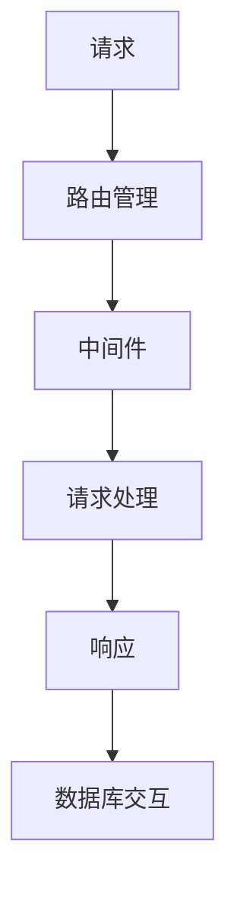

                 

# Web 后端框架：Express、Django 和 Flask

> **关键词：**Web 后端框架、Express、Django、Flask、比较分析、技术选择

> **摘要：**本文将对三个流行的 Web 后端框架——Express、Django 和 Flask 进行深入探讨，对比分析它们的特点、适用场景和优缺点，帮助开发者更好地选择适合自己项目的框架。文章将首先介绍这三个框架的基本概念和特点，然后深入探讨它们的架构设计、核心功能和应用实例，最后总结这些框架在实际开发中的应用前景和挑战。

## 1. 背景介绍

### 1.1 目的和范围

本文旨在对比分析 Express、Django 和 Flask 这三个流行的 Web 后端框架，帮助开发者理解它们的基本概念、特点、适用场景和优缺点。通过对这三个框架的深入探讨，读者可以从中了解到如何选择适合自己项目的框架，以及如何在实际开发中充分利用这些框架的优势。

### 1.2 预期读者

本文适合具有基础的 Web 开发经验的开发者阅读，特别是那些希望了解不同后端框架差异和适用场景的程序员。此外，对于准备进入 Web 开发领域的初学者，本文也具有一定的参考价值。

### 1.3 文档结构概述

本文结构如下：

1. **背景介绍**：介绍本文的目的和范围，以及预期读者。
2. **核心概念与联系**：讲解 Web 后端框架的基本概念和架构设计。
3. **核心算法原理 & 具体操作步骤**：分析这三个框架的核心算法原理和操作步骤。
4. **数学模型和公式 & 详细讲解 & 举例说明**：介绍相关数学模型和公式，并提供具体案例说明。
5. **项目实战：代码实际案例和详细解释说明**：通过实际案例展示框架的应用。
6. **实际应用场景**：讨论这些框架在实际开发中的应用场景。
7. **工具和资源推荐**：推荐学习资源和开发工具。
8. **总结：未来发展趋势与挑战**：总结未来发展趋势和挑战。
9. **附录：常见问题与解答**：解答读者可能遇到的问题。
10. **扩展阅读 & 参考资料**：提供进一步学习的资源。

### 1.4 术语表

#### 1.4.1 核心术语定义

- **Web 后端框架**：一种用于构建 Web 应用的软件框架，提供了一套标准化的开发模式，帮助开发者快速开发后端服务。
- **Express**：由 Node.js 开发的一个快速、无束缚的 Web 应用框架，用于构建 Web 应用和 API。
- **Django**：一个高度可扩展的 Python Web 框架，遵循 MVC 设计模式，适用于快速开发和部署 Web 应用。
- **Flask**：一个轻量级的 Python Web 应用框架，适用于小型到中型 Web 应用，强调灵活性和可扩展性。

#### 1.4.2 相关概念解释

- **MVC（Model-View-Controller）**：一种软件设计模式，用于分离数据和业务逻辑，提高代码的可维护性和可扩展性。
- **RESTful API**：一种 Web 服务设计风格，通过 HTTP 协议传输数据，遵循 REST 原则，提供资源的创建、读取、更新和删除操作。
- **ORM（Object-Relational Mapping）**：一种用于数据库操作的中间件，将数据库表映射到对象模型，简化了数据库操作。

#### 1.4.3 缩略词列表

- **MVC**：Model-View-Controller
- **RESTful**：Representational State Transfer
- **ORM**：Object-Relational Mapping

## 2. 核心概念与联系

### 2.1 Web 后端框架的基本概念

Web 后端框架是一种用于构建 Web 应用的软件框架，它提供了一套标准化的开发模式，帮助开发者快速开发后端服务。这些框架通常包括路由管理、中间件支持、请求处理、数据库交互等功能。

### 2.2 Web 后端框架的架构设计

Web 后端框架的架构设计通常包括以下几个部分：

1. **请求处理**：框架接收 HTTP 请求，将其路由到相应的处理函数。
2. **中间件**：中间件是处理请求的函数集合，可以拦截、修改请求和响应，提供额外的功能。
3. **路由管理**：框架根据请求的 URL 和 HTTP 方法，将请求路由到相应的处理函数。
4. **数据库交互**：框架提供 ORM 功能，简化数据库操作，将数据库表映射到对象模型。

### 2.3 Express、Django 和 Flask 的关系

Express、Django 和 Flask 都是流行的 Web 后端框架，但它们的设计理念和适用场景有所不同。Express 适用于 Node.js 开发，具有快速、灵活的特点；Django 是一个高度可扩展的 Python 框架，适用于快速开发和部署 Web 应用；Flask 是一个轻量级的 Python 框架，适用于小型到中型 Web 应用。

### 2.4 Mermaid 流程图

以下是一个简单的 Mermaid 流程图，展示了 Web 后端框架的基本架构设计：



### 2.5 核心概念与联系的总结

Web 后端框架的基本概念包括请求处理、中间件、路由管理和数据库交互。Express、Django 和 Flask 作为流行的 Web 后端框架，各自具有独特的特点和应用场景。通过 Mermaid 流程图，我们可以清晰地展示 Web 后端框架的基本架构设计。

## 3. 核心算法原理 & 具体操作步骤

### 3.1 Express 的核心算法原理

Express 是一个基于 Node.js 的 Web 应用框架，它的核心算法原理主要包括以下几个方面：

1. **请求处理**：Express 使用中间件来处理 HTTP 请求，每个请求都会经过一系列中间件函数的处理，最终得到响应。
2. **路由管理**：Express 使用路由表来管理 URL 和对应的处理函数，根据请求的 URL 和 HTTP 方法，将请求路由到相应的处理函数。
3. **中间件**：Express 的中间件是一个函数集合，可以拦截、修改请求和响应，提供额外的功能。

以下是一个简单的 Express 应用示例：

```javascript
const express = require('express');
const app = express();

// 中间件函数
const logger = (req, res, next) => {
  console.log(`Request URL: ${req.url}`);
  next();
};

// 路由函数
const home = (req, res) => {
  res.send('Hello, World!');
};

// 使用中间件和路由函数
app.use(logger);
app.get('/', home);

// 启动服务器
app.listen(3000, () => {
  console.log('Server is running on port 3000');
});
```

### 3.2 Django 的核心算法原理

Django 是一个高度可扩展的 Python Web 框架，它的核心算法原理主要包括以下几个方面：

1. **ORM**：Django 使用 ORM（对象关系映射）来简化数据库操作，将数据库表映射到对象模型。
2. **请求处理**：Django 使用视图函数来处理 HTTP 请求，将请求路由到相应的视图函数，并返回 HTTP 响应。
3. **中间件**：Django 的中间件是一个函数集合，可以拦截、修改请求和响应，提供额外的功能。

以下是一个简单的 Django 应用示例：

```python
# 引入 Django 模块
from django.http import HttpResponse
from django.views import View

# 视图函数
class HomeView(View):
    def get(self, request):
        return HttpResponse('Hello, Django!')

# 路由配置
from django.urls import path
urlpatterns = [
    path('', HomeView.as_view()),
]
```

### 3.3 Flask 的核心算法原理

Flask 是一个轻量级的 Python Web 应用框架，它的核心算法原理主要包括以下几个方面：

1. **请求处理**：Flask 使用视图函数来处理 HTTP 请求，将请求路由到相应的视图函数，并返回 HTTP 响应。
2. **中间件**：Flask 的中间件是一个函数集合，可以拦截、修改请求和响应，提供额外的功能。
3. **扩展功能**：Flask 提供了一系列扩展功能，如 ORM、表单处理、认证等。

以下是一个简单的 Flask 应用示例：

```python
from flask import Flask, jsonify, request

# 创建 Flask 应用
app = Flask(__name__)

# 视图函数
@app.route('/')
def home():
    return jsonify(message='Hello, Flask!')

# 使用中间件
@app.before_request
def before_request():
    print('Request is coming...')

# 启动服务器
if __name__ == '__main__':
    app.run(debug=True)
```

### 3.4 核心算法原理与具体操作步骤的总结

Express、Django 和 Flask 的核心算法原理各有特色，但它们都遵循类似的请求处理流程：接收 HTTP 请求，路由到处理函数，返回 HTTP 响应。通过中间件，这三个框架可以扩展额外的功能，提高代码的可维护性和可扩展性。在实际开发中，开发者可以根据项目需求选择合适的框架，并熟练掌握其核心算法原理和操作步骤。

## 4. 数学模型和公式 & 详细讲解 & 举例说明

### 4.1 数学模型和公式

在 Web 后端框架的设计与实现过程中，某些核心功能依赖于数学模型和公式。以下是几个常用的数学模型和公式，以及它们的详细讲解和举例说明。

#### 4.1.1 HTTP 状态码

HTTP 状态码是 Web 应用中用于表示请求响应结果的标准编码。以下是一些常用的 HTTP 状态码及其含义：

- **200 OK**：表示请求成功，服务器返回请求的内容。
- **400 Bad Request**：表示请求无效，服务器无法理解请求。
- **401 Unauthorized**：表示请求需要身份验证。
- **404 Not Found**：表示请求的资源不存在。
- **500 Internal Server Error**：表示服务器内部错误。

#### 4.1.2 RESTful API

RESTful API 是一种用于构建 Web 服务的标准设计风格。以下是一个简单的 RESTful API 示例：

```plaintext
GET /users/1  # 获取用户信息
POST /users   # 创建新用户
GET /users/1/avatar  # 获取用户头像
PUT /users/1  # 更新用户信息
DELETE /users/1  # 删除用户
```

#### 4.1.3 ORM 模型

ORM（对象关系映射）是 Web 后端框架中用于数据库操作的核心组件。以下是一个简单的 ORM 模型示例：

```python
# Python 示例
class User(Model):
    id = Column(Integer, primary_key=True)
    username = Column(String(50), unique=True)
    email = Column(String(50), unique=True)
    password = Column(String(50))
    created_at = Column(DateTime, default=datetime.utcnow)

# SQL 示例
CREATE TABLE users (
    id SERIAL PRIMARY KEY,
    username VARCHAR(50) UNIQUE,
    email VARCHAR(50) UNIQUE,
    password VARCHAR(50),
    created_at TIMESTAMP DEFAULT CURRENT_TIMESTAMP
);
```

### 4.2 举例说明

以下是一个简单的 Express 应用示例，展示了如何使用 HTTP 状态码和 RESTful API：

```javascript
const express = require('express');
const app = express();

// 使用 HTTP 状态码
app.get('/users', (req, res) => {
    res.status(200).json({ message: '用户列表' });
});

// 使用 RESTful API
app.post('/users', (req, res) => {
    const { username, email, password } = req.body;
    // 处理创建用户的逻辑
    res.status(201).json({ message: '用户创建成功' });
});

// 监听端口
app.listen(3000, () => {
    console.log('Server is running on port 3000');
});
```

通过上述示例，我们可以看到如何在实际应用中运用数学模型和公式，构建高效的 Web 后端服务。在实际开发过程中，开发者需要根据项目需求灵活运用这些模型和公式，提高代码的可维护性和可扩展性。

## 5. 项目实战：代码实际案例和详细解释说明

### 5.1 开发环境搭建

在开始项目实战之前，我们需要搭建一个合适的开发环境。以下是搭建 Express、Django 和 Flask 开发环境的步骤：

#### 5.1.1 Express 开发环境

1. 安装 Node.js（版本 10.0.0 以上）：[https://nodejs.org/](https://nodejs.org/)
2. 安装 Express：在终端执行 `npm install express --save`
3. 创建一个名为 `express-app` 的新目录，并进入该目录
4. 在该目录下创建一个名为 `app.js` 的文件

#### 5.1.2 Django 开发环境

1. 安装 Python（版本 3.6.0 以上）：[https://www.python.org/downloads/](https://www.python.org/downloads/)
2. 安装 Django：在终端执行 `pip install django`
3. 创建一个名为 `mydjangoproject` 的新目录，并进入该目录
4. 在该目录下创建一个名为 `mydjangoapp` 的新 Django 项目，执行 `django-admin startproject mydjangoapp`
5. 在项目目录下创建一个名为 `myapp` 的新 Django 应用，执行 `python manage.py startapp myapp`

#### 5.1.3 Flask 开发环境

1. 安装 Python（版本 3.6.0 以上）：[https://www.python.org/downloads/](https://www.python.org/downloads/)
2. 安装 Flask：在终端执行 `pip install flask`
3. 创建一个名为 `flask-app` 的新目录，并进入该目录
4. 在该目录下创建一个名为 `app.py` 的文件

### 5.2 源代码详细实现和代码解读

以下将分别展示 Express、Django 和 Flask 的源代码，并进行详细解读。

#### 5.2.1 Express 应用示例

`app.js`：

```javascript
const express = require('express');
const app = express();

// 中间件
app.use(express.json());

// 路由
app.get('/', (req, res) => {
  res.send('Hello, Express!');
});

app.post('/users', (req, res) => {
  const { username, email, password } = req.body;
  // 处理用户创建逻辑
  res.status(201).json({ message: 'User created' });
});

// 监听端口
app.listen(3000, () => {
  console.log('Server is running on port 3000');
});
```

**解读**：

1. 引入 Express 模块并创建一个 Express 应用实例。
2. 使用 `express.json()` 中间件解析 JSON 数据。
3. 定义一个路由，当访问根路径时返回 "Hello, Express!"。
4. 定义一个 POST 路由，用于处理用户创建请求。

#### 5.2.2 Django 应用示例

`myapp/views.py`：

```python
from django.http import HttpResponse
from django.views import View

class HomeView(View):
    def get(self, request):
        return HttpResponse('Hello, Django!')

class UserCreateView(View):
    def post(self, request):
        # 处理用户创建逻辑
        return HttpResponse('User created')
```

`myapp/urls.py`：

```python
from django.urls import path
from .views import HomeView, UserCreateView

urlpatterns = [
    path('', HomeView.as_view()),
    path('users/', UserCreateView.as_view()),
]
```

**解读**：

1. 定义一个视图类 `HomeView`，处理 GET 请求，返回 "Hello, Django!"。
2. 定义一个视图类 `UserCreateView`，处理 POST 请求，处理用户创建逻辑。
3. 在 `urls.py` 中配置路由，将请求路由到相应的视图类。

#### 5.2.3 Flask 应用示例

`app.py`：

```python
from flask import Flask, jsonify, request

app = Flask(__name__)

# 路由
@app.route('/')
def home():
    return jsonify(message='Hello, Flask!')

@app.route('/users', methods=['POST'])
def create_user():
    username = request.json.get('username')
    email = request.json.get('email')
    # 处理用户创建逻辑
    return jsonify(message='User created')

if __name__ == '__main__':
    app.run(debug=True)
```

**解读**：

1. 引入 Flask 模块并创建一个 Flask 应用实例。
2. 定义一个路由，当访问根路径时返回 "Hello, Flask!"。
3. 定义一个 POST 路由，用于处理用户创建请求。

### 5.3 代码解读与分析

通过上述代码示例，我们可以看到 Express、Django 和 Flask 分别如何处理 HTTP 请求。以下是三个框架在代码层面上的对比分析：

1. **代码结构**：
   - **Express**：使用回调函数处理请求，代码结构较为扁平。
   - **Django**：使用类和方法的组合，代码结构更加清晰。
   - **Flask**：使用装饰器处理请求，代码结构简洁。

2. **路由管理**：
   - **Express**：使用路由表手动配置路由。
   - **Django**：使用 URL 模式和视图函数自动配置路由。
   - **Flask**：使用路由规则和装饰器自动配置路由。

3. **中间件**：
   - **Express**：使用中间件处理请求，扩展性强。
   - **Django**：内置了一些中间件，扩展性较弱。
   - **Flask**：使用扩展模块处理中间件，扩展性强。

4. **ORM**：
   - **Express**：无内置 ORM，需要使用第三方库。
   - **Django**：内置 ORM，简化数据库操作。
   - **Flask**：需要使用扩展模块，如 Flask-SQLAlchemy。

5. **调试**：
   - **Express**：使用 Node.js 内置调试工具。
   - **Django**：使用 Django 内置调试工具。
   - **Flask**：使用 Flask 内置调试工具。

通过对比分析，我们可以看到 Express、Django 和 Flask 在代码层面上的差异。开发者可以根据项目需求和自身偏好选择合适的框架，并掌握其核心用法。

## 6. 实际应用场景

Express、Django 和 Flask 作为流行的 Web 后端框架，在实际开发中有着广泛的应用。以下是它们在不同场景下的适用性：

### 6.1 Express 的应用场景

1. **实时应用**：Express 是 Node.js 的官方 Web 框架，适用于构建实时应用，如聊天应用、在线游戏等。它的高性能和异步 I/O 处理能力使其在这些场景下具有优势。
2. **微服务架构**：Express 适用于构建微服务架构，通过独立部署和扩展单个服务，提高系统的可维护性和可扩展性。
3. **API 开发**：Express 适用于构建 RESTful API，它提供了强大的中间件支持，可以方便地实现身份验证、日志记录、错误处理等功能。

### 6.2 Django 的应用场景

1. **大型项目**：Django 适用于构建大型项目，如电商平台、内容管理系统等。它的高度可扩展性和内置 ORM 功能可以显著提高开发效率。
2. **快速开发**：Django 提供了一套完整的开发工具和库，可以帮助开发者快速构建项目，降低开发难度。
3. **后台管理**：Django 的 admin 界面提供了强大的后台管理功能，适用于构建后台管理系统。

### 6.3 Flask 的应用场景

1. **小型项目**：Flask 适用于构建小型项目，如博客、个人网站等。它轻量级、灵活，可以满足这些项目的需求。
2. **定制化开发**：Flask 支持高度定制化开发，开发者可以根据项目需求自由选择和组合扩展模块。
3. **API 开发**：Flask 适用于构建 RESTful API，它的简单易用的特性使得开发者可以快速实现 API 功能。

### 6.4 总结

Express、Django 和 Flask 各具特色，适用于不同的应用场景。开发者可以根据项目需求、团队技能和开发经验选择合适的框架。在实际开发中，灵活运用这些框架的优势，可以显著提高开发效率和项目质量。

## 7. 工具和资源推荐

### 7.1 学习资源推荐

为了更好地学习和掌握 Express、Django 和 Flask，以下是一些推荐的学习资源：

#### 7.1.1 书籍推荐

1. **《Node.js实战》**：详细介绍了 Node.js 和 Express 的应用，适合初学者和有经验的开发者。
2. **《Django 官方文档》**：官方文档是学习 Django 的最佳资源，内容全面、详实。
3. **《Flask Web 开发实战》**：系统地介绍了 Flask 的应用，适合初学者和有经验的开发者。

#### 7.1.2 在线课程

1. **Node.js 入门与实践**：网易云课堂的免费课程，适合初学者入门 Node.js 和 Express。
2. **Django 快速入门教程**：极客时间的付费课程，由经验丰富的开发者讲授。
3. **Flask 微项目实战**：极客时间的付费课程，通过实际项目帮助开发者掌握 Flask。

#### 7.1.3 技术博客和网站

1. **Node.js 官方网站**：提供最新的 Node.js 版本和文档，[https://nodejs.org/](https://nodejs.org/)
2. **Django 官方网站**：提供最新的 Django 版本和文档，[https://www.djangoproject.com/](https://www.djangoproject.com/)
3. **Flask 官方网站**：提供最新的 Flask 版本和文档，[https://flask.palletsprojects.com/](https://flask.palletsprojects.com/)

### 7.2 开发工具框架推荐

为了提高开发效率和代码质量，以下是一些推荐的开发工具和框架：

#### 7.2.1 IDE和编辑器

1. **Visual Studio Code**：一款开源的跨平台编辑器，支持多种编程语言，具有丰富的插件和扩展。
2. **PyCharm**：一款专业的 Python IDE，提供了强大的代码分析、调试和自动化工具。
3. **WebStorm**：一款专业的 Web 开发 IDE，支持多种 Web 框架，提供了强大的代码编辑和调试功能。

#### 7.2.2 调试和性能分析工具

1. **Node.js Inspector**：一款用于调试 Node.js 应用的工具，支持远程调试和实时性能分析。
2. **Django Debug Toolbar**：一款用于调试 Django 应用的扩展，提供了实时日志记录、性能分析等功能。
3. **Flask-DebugToolbar**：一款用于调试 Flask 应用的扩展，提供了实时性能分析、请求日志等功能。

#### 7.2.3 相关框架和库

1. **Express-Generator**：一款用于快速生成 Express 应用的脚手架工具，提供了丰富的模板和配置。
2. **Django-REST-framework**：一款用于构建 RESTful API 的 Django 扩展，提供了强大的 API 功能和认证机制。
3. **Flask-SQLAlchemy**：一款用于 ORM 操作的 Flask 扩展，提供了强大的数据库操作功能和迁移工具。

### 7.3 相关论文著作推荐

为了深入理解 Web 后端框架的设计原理和最佳实践，以下是一些相关的论文和著作推荐：

1. **《RESTful Web Services》**：介绍了 RESTful API 的设计原则和实现方法，是学习 API 开发的经典著作。
2. **《Building Microservices》**：介绍了微服务架构的设计原则和最佳实践，适用于构建高性能、可扩展的系统。
3. **《Django by Example》**：通过实际项目介绍了 Django 的应用和开发方法，适合 Django 初学者。

通过以上推荐的学习资源和工具，开发者可以更加全面地了解 Express、Django 和 Flask，提高开发技能和项目质量。

## 8. 总结：未来发展趋势与挑战

Express、Django 和 Flask 作为流行的 Web 后端框架，在未来仍将扮演重要角色。随着云计算、物联网和人工智能等技术的发展，Web 应用将变得越来越复杂，对后端框架提出了更高的要求。

### 8.1 未来发展趋势

1. **微服务架构**：微服务架构逐渐成为主流，后端框架需要支持模块化、独立部署和快速迭代。Express、Django 和 Flask 都在不断发展，以适应微服务架构的需求。
2. **云原生应用**：随着容器技术（如 Docker、Kubernetes）的普及，云原生应用将成为趋势。后端框架需要具备良好的容器支持，提高部署和扩展的效率。
3. **自动化和智能化**：人工智能和自动化技术的发展将带来更多的自动化工具和框架，如自动代码生成、自动化测试等，提高开发效率和代码质量。
4. **安全和隐私**：随着网络安全和隐私保护的重要性日益凸显，后端框架需要提供更强的安全性和隐私保护功能，如加密、访问控制等。

### 8.2 未来挑战

1. **性能优化**：随着应用复杂度的增加，性能优化将成为重要挑战。后端框架需要提供高效的算法和优化策略，确保应用在高峰期仍然能够稳定运行。
2. **安全性**：网络安全和隐私保护将成为重要挑战。后端框架需要提供更全面的安全功能和防范措施，以应对日益复杂的网络攻击。
3. **开发者体验**：开发者体验是框架成功的关键因素。后端框架需要提供简洁、易用的开发工具和文档，降低学习曲线，提高开发效率。
4. **跨平台兼容性**：随着跨平台应用的兴起，后端框架需要提供更好的跨平台兼容性，支持多种操作系统和硬件环境。

### 8.3 未来展望

Express、Django 和 Flask 将继续在 Web 后端领域发挥重要作用。通过不断优化和改进，这些框架将更好地应对未来发展的挑战，为开发者带来更高的价值。同时，新的框架和技术也将不断涌现，推动 Web 后端技术的发展。

## 9. 附录：常见问题与解答

### 9.1 Express、Django 和 Flask 的主要区别是什么？

Express 是一个基于 Node.js 的快速、无束缚的 Web 应用框架，适用于构建实时应用和微服务。Django 是一个高度可扩展的 Python Web 框架，适用于快速开发和部署 Web 应用，遵循 MVC 设计模式。Flask 是一个轻量级的 Python Web 应用框架，适用于小型到中型 Web 应用，强调灵活性和可扩展性。

### 9.2 如何选择合适的 Web 后端框架？

选择合适的 Web 后端框架取决于项目需求、团队技能和开发经验。Express 适用于实时应用和微服务架构，Django 适用于大型项目和快速开发，Flask 适用于小型项目和定制化开发。此外，开发者可以根据技术栈偏好和社区支持情况做出选择。

### 9.3 Express、Django 和 Flask 的性能如何？

Express 依赖于 Node.js 的异步 I/O 特性，在处理高并发请求时具有优势。Django 和 Flask 则依赖于 Python 的性能，虽然不如 Node.js 高效，但在大多数场景下仍能提供良好的性能。具体性能取决于应用的具体需求和架构设计。

### 9.4 Express、Django 和 Flask 的安全性如何？

Express、Django 和 Flask 都提供了丰富的安全功能和防范措施，如身份验证、加密、访问控制等。开发者需要根据具体应用场景和需求，合理配置和使用这些功能，确保应用的安全性。

## 10. 扩展阅读 & 参考资料

为了深入了解 Express、Django 和 Flask，以下是一些扩展阅读和参考资料：

1. **Node.js 官方文档**：[https://nodejs.org/docs/latest-v14.x/api/](https://nodejs.org/docs/latest-v14.x/api/)
2. **Django 官方文档**：[https://docs.djangoproject.com/en/4.0/](https://docs.djangoproject.com/en/4.0/)
3. **Flask 官方文档**：[https://flask.palletsprojects.com/](https://flask.palletsprojects.com/)
4. **《Node.js 实战》**：[https://www.oreilly.com/library/view/node-js-best-practices/9781449368742/](https://www.oreilly.com/library/view/node-js-best-practices/9781449368742/)
5. **《Django by Example》**：[https://www.packtpub.com/application-development/django-by-example](https://www.packtpub.com/application-development/django-by-example)
6. **《Flask Web 开发实战》**：[https://www.packtpub.com/application-development/flask-web-development-blueprint](https://www.packtpub.com/application-development/flask-web-development-blueprint)
7. **《RESTful Web Services》**：[https://www.oreilly.com/library/view/restful-web-services/9780596101118/](https://www.oreilly.com/library/view/restful-web-services/9780596101118/)
8. **《Building Microservices》**：[https://www.oreilly.com/library/view/building-microservices/9781449325861/](https://www.oreilly.com/library/view/building-microservices/9781449325861/)

通过这些参考资料，开发者可以深入了解 Express、Django 和 Flask 的核心概念、设计原理和应用实践，提高自己的开发技能。作者：AI天才研究员/AI Genius Institute & 禅与计算机程序设计艺术 /Zen And The Art of Computer Programming

