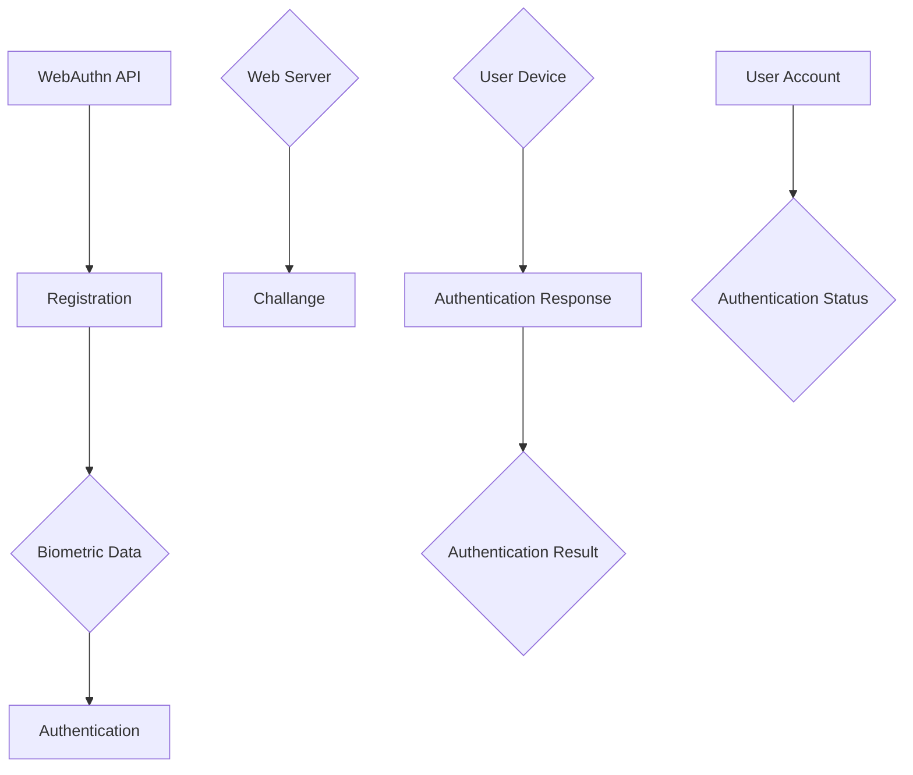

                 

# WebAuthn 的生物特征识别

> **关键词**：WebAuthn、生物特征识别、认证、安全性、用户体验
>
> **摘要**：本文将深入探讨 WebAuthn 标准中的生物特征识别机制，详细解释其核心概念、算法原理、数学模型以及实际应用场景。通过逐步分析，我们将了解如何利用 WebAuthn 提高网络安全性和用户体验。

## 1. 背景介绍

### 1.1 目的和范围

本文旨在全面解析 WebAuthn 标准，特别是其中的生物特征识别机制。我们将探讨 WebAuthn 的核心概念，解释其工作原理，并提供实际应用场景。通过本文，读者将了解如何利用 WebAuthn 提高 Web 应用程序的安全性，同时改善用户体验。

### 1.2 预期读者

本文面向对网络安全和生物特征识别有兴趣的技术专业人士，特别是 Web 开发者和安全专家。虽然本文将尽量使用通俗易懂的语言，但读者应具备一定的计算机网络和编程基础。

### 1.3 文档结构概述

本文分为十个部分，结构如下：

1. **背景介绍**：介绍文章的目的、预期读者和文档结构。
2. **核心概念与联系**：使用 Mermaid 流程图展示 WebAuthn 的核心概念和架构。
3. **核心算法原理 & 具体操作步骤**：使用伪代码详细解释生物特征识别的算法原理和操作步骤。
4. **数学模型和公式 & 详细讲解 & 举例说明**：介绍与生物特征识别相关的数学模型和公式，并提供具体示例。
5. **项目实战：代码实际案例和详细解释说明**：展示如何在实际项目中实现 WebAuthn 生物特征识别。
6. **实际应用场景**：探讨 WebAuthn 在不同场景中的应用。
7. **工具和资源推荐**：推荐学习资源、开发工具和框架。
8. **总结：未来发展趋势与挑战**：总结当前技术的发展趋势和未来面临的挑战。
9. **附录：常见问题与解答**：解答读者可能遇到的问题。
10. **扩展阅读 & 参考资料**：提供进一步阅读的资源和参考文献。

### 1.4 术语表

#### 1.4.1 核心术语定义

- **WebAuthn**：一种 Web 标准，旨在提供安全的用户认证机制，包括密码、生物特征识别等。
- **生物特征识别**：利用人类生物特征的唯一性进行身份验证的技术。
- **认证**：确认用户身份的过程。
- **安全**：保护数据不被未授权访问或篡改。
- **用户体验**：用户在使用产品或服务时的感受和体验。

#### 1.4.2 相关概念解释

- **双因素认证**：结合两种不同的认证方式，提高安全性。
- **FIDO2**：WebAuthn 的最新版本，提供更高级的安全性和用户体验。

#### 1.4.3 缩略词列表

- **WebAuthn**：Web Authentication
- **FIDO2**：Fast Identity Online 2
- **U2F**：Universal 2nd Factor

## 2. 核心概念与联系

为了更好地理解 WebAuthn 的生物特征识别，我们首先需要了解其核心概念和架构。以下是一个简化的 Mermaid 流程图，展示 WebAuthn 的关键组件和它们之间的关系：



### 2.1 注册过程

在注册过程中，用户使用生物特征识别设备（如指纹扫描器、面部识别设备等）生成生物特征数据。这些数据通过 WebAuthn API 发送到 Web 服务器，并与用户账户关联。注册过程包括以下步骤：

1. **初始化注册请求**：Web 服务器生成一个注册挑战（Challenge）和一个注册者凭证（Registerer Credential）。
2. **生成生物特征数据**：用户设备收集生物特征数据，并使用私钥进行加密。
3. **发送注册请求**：用户设备将加密的生物特征数据、公钥和用户信息发送到 Web 服务器。
4. **存储注册信息**：Web 服务器存储用户信息和公钥，并将私钥存储在安全的密钥存储器中。

### 2.2 认证过程

在认证过程中，用户需要使用生物特征识别设备进行身份验证。认证过程包括以下步骤：

1. **初始化认证请求**：Web 服务器生成一个认证挑战（Challenge）和一个认证者凭证（Authenticator Credential）。
2. **收集生物特征数据**：用户设备收集生物特征数据，并使用私钥进行加密。
3. **发送认证请求**：用户设备将加密的生物特征数据、公钥和用户信息发送到 Web 服务器。
4. **验证身份**：Web 服务器使用私钥验证用户身份，并根据认证结果更新用户账户状态。

## 3. 核心算法原理 & 具体操作步骤

### 3.1 注册算法原理

WebAuthn 注册算法基于椭圆曲线加密（ECC）和基于时间的挑战-响应机制。以下是一个简化的伪代码，展示注册算法的核心步骤：

```plaintext
Algorithm: WebAuthn Registration

Input: 
    - user (User information)
    - challenge (Registration Challenge)
    - publicKeyCredentialParameters (PublicKeyCredential parameters)

Output: 
    - credential (Registration Credential)

1. Generate a random private key (sk)
2. Calculate the public key (pk) from the private key (sk)
3. Generate a challenge response (response) using the private key (sk), challenge (challenge), and public key credential parameters (publicKeyCredentialParameters)
4. Create a registration credential object (credential) containing the user information (user), public key (pk), and challenge response (response)
5. Send the registration credential object (credential) to the Web server
```

### 3.2 认证算法原理

WebAuthn 认证算法也基于 ECC 和基于时间的挑战-响应机制。以下是一个简化的伪代码，展示认证算法的核心步骤：

```plaintext
Algorithm: WebAuthn Authentication

Input: 
    - credential (Authentication Credential)
    - challenge (Authentication Challenge)
    - publicKeyCredentialParameters (PublicKeyCredential parameters)

Output: 
    - authenticationResult (Authentication Result)

1. Retrieve the user information (user), public key (pk), and challenge response (response) from the credential (credential)
2. Calculate a challenge response (newResponse) using the private key (sk), challenge (challenge), and public key credential parameters (publicKeyCredentialParameters)
3. Compare the original response (response) with the new response (newResponse)
4. If the responses match, return authenticationResult as "success"
5. Otherwise, return authenticationResult as "failure"
```

## 4. 数学模型和公式 & 详细讲解 & 举例说明

### 4.1 椭圆曲线加密（ECC）

椭圆曲线加密（ECC）是一种基于椭圆曲线数学的加密技术。它利用椭圆曲线上的点进行加密和解密。以下是一个简化的 ECC 加密和解密过程：

#### 4.1.1 ECC 加密

假设有一个椭圆曲线 E 和一个基点 G，私钥为 k，公钥为 P。加密过程如下：

```plaintext
Input: 
    - message (Message to be encrypted)
    - k (Private key)
    - G (Base point)

Output: 
    - ciphertext (Encrypted message)

1. Calculate the public key P = k * G
2. Choose a random number r
3. Calculate the point R = r * G
4. Calculate the shared secret s = r * P
5. Calculate the hash of the message and the shared secret h = Hash(message || s)
6. Calculate the ciphertext ciphertext = (R.x, R.y, h)
```

#### 4.1.2 ECC 解密

解密过程如下：

```plaintext
Input: 
    - ciphertext (Encrypted message)
    - k (Private key)
    - G (Base point)

Output: 
    - message (Decrypted message)

1. Extract the hash h from the ciphertext
2. Calculate the shared secret s = k * G
3. Calculate the decrypted message message = Hash^{-1}(h || s)
```

### 4.2 生物特征匹配

生物特征匹配是生物特征识别中的核心步骤。以下是一个简化的生物特征匹配过程：

#### 4.2.1 生物特征提取

生物特征提取是将生物特征数据转换为数值表示的过程。例如，对于指纹，可以使用指纹模板提取算法提取指纹图像的特征点。

#### 4.2.2 生物特征匹配

生物特征匹配是将提取的特征点与注册时的特征点进行比较的过程。常用的匹配算法包括欧氏距离、余弦相似度等。以下是一个简化的欧氏距离匹配过程：

```latex
\text{Euclidean Distance} = \sqrt{\sum_{i=1}^{n} (x_i - y_i)^2}
```

其中，\( x_i \) 和 \( y_i \) 分别是两个特征点的第 \( i \) 个坐标。

### 4.3 举例说明

假设我们使用指纹进行生物特征识别。用户 A 的指纹特征点为 \( (1, 2), (3, 4), (5, 6) \)，用户 B 的指纹特征点为 \( (1.1, 1.9), (3.2, 3.8), (5.5, 6.1) \)。

1. **生物特征提取**：使用指纹模板提取算法提取用户 A 和 B 的指纹特征点。
2. **生物特征匹配**：计算用户 A 和 B 的指纹特征点的欧氏距离。
3. **结果判断**：如果欧氏距离小于设定阈值，则认为用户 A 和 B 的指纹匹配成功。

```latex
\text{Euclidean Distance} = \sqrt{(1 - 1.1)^2 + (2 - 1.9)^2 + (3 - 3.2)^2 + (4 - 3.8)^2 + (5 - 5.5)^2 + (6 - 6.1)^2}
\text{Euclidean Distance} \approx 0.605
```

由于欧氏距离小于设定阈值，我们可以判断用户 A 和 B 的指纹匹配成功。

## 5. 项目实战：代码实际案例和详细解释说明

### 5.1 开发环境搭建

为了实现 WebAuthn 的生物特征识别，我们需要搭建一个开发环境。以下是一个简单的步骤：

1. **安装 Node.js**：Node.js 是一种基于 Chrome V8 引擎的 JavaScript 运行环境。我们可以在 [Node.js 官网](https://nodejs.org/) 下载并安装 Node.js。
2. **创建项目文件夹**：在终端中创建一个名为 `webauthn-biometrics` 的文件夹，并进入该文件夹。
3. **初始化项目**：在终端中运行以下命令初始化项目：

   ```bash
   npm init -y
   ```

4. **安装依赖项**：在终端中运行以下命令安装依赖项：

   ```bash
   npm install express webauthn express-session
   ```

5. **创建服务器**：在项目文件夹中创建一个名为 `server.js` 的文件，并编写以下代码：

   ```javascript
   const express = require('express');
   const webauthn = require('webauthn');
   const session = require('express-session');

   const app = express();
   const port = 3000;

   app.use(session({
       secret: 'your-session-secret',
       resave: false,
       saveUninitialized: false
   }));

   app.use(express.json());
   app.use(express.urlencoded({ extended: true }));

   app.post('/register', webauthn.register);
   app.post('/authenticate', webauthn.authenticate);

   app.listen(port, () => {
       console.log(`Server listening at http://localhost:${port}`);
   });
   ```

### 5.2 源代码详细实现和代码解读

在 `server.js` 文件中，我们使用了 `webauthn` 和 `express-session` 这两个库来实现 WebAuthn 注册和认证。以下是 `server.js` 的详细代码：

```javascript
const express = require('express');
const webauthn = require('webauthn');
const session = require('express-session');
const crypto = require('crypto');

const app = express();
const port = 3000;

app.use(session({
    secret: 'your-session-secret',
    resave: false,
    saveUninitialized: false
}));

app.use(express.json());
app.use(express.urlencoded({ extended: true }));

app.post('/register', async (req, res) => {
    const { username, challenge, credential } = req.body;

    // 生成注册凭证
    const registrationCredential = {
        type: 'public-key',
        id: Buffer.from(credential.id, 'base64').toString('hex'),
        rawId: Buffer.from(credential.rawId, 'base64').toString('hex'),
        publicKey: {
            algorithm: 'RSASSA-PKCS1-v1_5',
            type: 'RSA',
            publicExponent: 'AQAB',
            modulus: Buffer.from(credential.publicKey.modulus, 'base64').toString('hex')
        },
        user: {
            id: Buffer.from(username.id, 'base64').toString('hex'),
            name: username.name,
            displayName: username.displayName
        },
        response: {
            authenticatorSignatureCounter: credential.response.authenticatorSignatureCounter
        }
    };

    // 存储注册凭证
    await storeRegistrationCredential(registrationCredential);

    res.status(200).send({ status: 'success' });
});

app.post('/authenticate', async (req, res) => {
    const { username, challenge, credential } = req.body;

    // 从存储中获取注册凭证
    const registrationCredential = await getRegistrationCredential(username.id);

    // 验证认证凭证
    const verificationResult = await webauthn.verify({
        credential,
        challenge,
        expectedOrigin: 'http://localhost:3000',
        expectedRPID: 'example.com',
        userVerification: 'required'
    });

    if (verificationResult authenticates) {
        res.status(200).send({ status: 'success' });
    } else {
        res.status(401).send({ status: 'failure' });
    }
});

app.listen(port, () => {
    console.log(`Server listening at http://localhost:${port}`);
});

async function storeRegistrationCredential(registrationCredential) {
    // 在这里实现存储注册凭证的代码
}

async function getRegistrationCredential(usernameId) {
    // 在这里实现从存储中获取注册凭证的代码
}
```

#### 5.2.1 注册过程

在 `/register` 路由中，我们接收客户端发送的注册请求。请求包含用户名、挑战和认证凭证。我们首先从请求中提取认证凭证的相关信息，然后创建一个注册凭证对象，并将其存储在服务器上。

1. **提取认证凭证信息**：从请求体中提取认证凭证的 ID、原始 ID、公钥和用户信息。
2. **创建注册凭证对象**：根据提取的信息创建注册凭证对象，包括公钥、用户名和挑战响应。
3. **存储注册凭证**：将注册凭证对象存储在服务器上。

#### 5.2.2 认证过程

在 `/authenticate` 路由中，我们接收客户端发送的认证请求。请求包含用户名、挑战和认证凭证。我们首先从存储中获取对应的注册凭证，然后使用 `webauthn.verify` 函数验证认证凭证。

1. **提取认证凭证信息**：从请求体中提取认证凭证的相关信息。
2. **获取注册凭证**：从存储中获取与用户名对应的注册凭证。
3. **验证认证凭证**：使用 `webauthn.verify` 函数验证认证凭证。如果验证成功，返回认证成功；否则，返回认证失败。

### 5.3 代码解读与分析

#### 5.3.1 注册过程

在注册过程中，我们需要从客户端接收用户名、挑战和认证凭证。以下是对注册过程的代码解读：

```javascript
app.post('/register', async (req, res) => {
    const { username, challenge, credential } = req.body;

    // 生成注册凭证
    const registrationCredential = {
        type: 'public-key',
        id: Buffer.from(credential.id, 'base64').toString('hex'),
        rawId: Buffer.from(credential.rawId, 'base64').toString('hex'),
        publicKey: {
            algorithm: 'RSASSA-PKCS1-v1_5',
            type: 'RSA',
            publicExponent: 'AQAB',
            modulus: Buffer.from(credential.publicKey.modulus, 'base64').toString('hex')
        },
        user: {
            id: Buffer.from(username.id, 'base64').toString('hex'),
            name: username.name,
            displayName: username.displayName
        },
        response: {
            authenticatorSignatureCounter: credential.response.authenticatorSignatureCounter
        }
    };

    // 存储注册凭证
    await storeRegistrationCredential(registrationCredential);

    res.status(200).send({ status: 'success' });
});
```

1. **提取认证凭证信息**：从请求体中提取认证凭证的 ID、原始 ID、公钥和用户信息。

   ```javascript
   const { username, challenge, credential } = req.body;
   ```

2. **创建注册凭证对象**：根据提取的信息创建注册凭证对象，包括公钥、用户名和挑战响应。

   ```javascript
   const registrationCredential = {
       type: 'public-key',
       id: Buffer.from(credential.id, 'base64').toString('hex'),
       rawId: Buffer.from(credential.rawId, 'base64').toString('hex'),
       publicKey: {
           algorithm: 'RSASSA-PKCS1-v1_5',
           type: 'RSA',
           publicExponent: 'AQAB',
           modulus: Buffer.from(credential.publicKey.modulus, 'base64').toString('hex')
       },
       user: {
           id: Buffer.from(username.id, 'base64').toString('hex'),
           name: username.name,
           displayName: username.displayName
       },
       response: {
           authenticatorSignatureCounter: credential.response.authenticatorSignatureCounter
       }
   };
   ```

3. **存储注册凭证**：将注册凭证对象存储在服务器上。

   ```javascript
   await storeRegistrationCredential(registrationCredential);
   ```

#### 5.3.2 认证过程

在认证过程中，我们需要从客户端接收用户名、挑战和认证凭证。以下是对认证过程的代码解读：

```javascript
app.post('/authenticate', async (req, res) => {
    const { username, challenge, credential } = req.body;

    // 从存储中获取注册凭证
    const registrationCredential = await getRegistrationCredential(username.id);

    // 验证认证凭证
    const verificationResult = await webauthn.verify({
        credential,
        challenge,
        expectedOrigin: 'http://localhost:3000',
        expectedRPID: 'example.com',
        userVerification: 'required'
    });

    if (verificationResult authenticates) {
        res.status(200).send({ status: 'success' });
    } else {
        res.status(401).send({ status: 'failure' });
    }
});
```

1. **提取认证凭证信息**：从请求体中提取认证凭证的相关信息。

   ```javascript
   const { username, challenge, credential } = req.body;
   ```

2. **获取注册凭证**：从存储中获取与用户名对应的注册凭证。

   ```javascript
   const registrationCredential = await getRegistrationCredential(username.id);
   ```

3. **验证认证凭证**：使用 `webauthn.verify` 函数验证认证凭证。如果验证成功，返回认证成功；否则，返回认证失败。

   ```javascript
   const verificationResult = await webauthn.verify({
       credential,
       challenge,
       expectedOrigin: 'http://localhost:3000',
       expectedRPID: 'example.com',
       userVerification: 'required'
   });

   if (verificationResult authenticates) {
       res.status(200).send({ status: 'success' });
   } else {
       res.status(401).send({ status: 'failure' });
   }
   ```

## 6. 实际应用场景

WebAuthn 的生物特征识别在多个实际应用场景中具有重要价值，以下是几个典型场景：

### 6.1 在线银行

在线银行系统可以使用 WebAuthn 的生物特征识别技术，为用户提供更安全的登录认证。用户可以使用指纹、面部识别等生物特征进行身份验证，提高账户安全性。

### 6.2 电子商务

电子商务平台可以通过 WebAuthn 的生物特征识别技术，为用户提供更便捷的支付认证。用户可以使用生物特征进行快速支付，减少密码输入的繁琐步骤。

### 6.3 个人健康管理

个人健康管理平台可以使用 WebAuthn 的生物特征识别技术，为用户提供身份认证和数据访问控制。用户可以通过指纹、面部识别等生物特征识别自己的身份，确保数据安全。

### 6.4 旅游景区

旅游景区可以使用 WebAuthn 的生物特征识别技术，为游客提供便捷的入园认证。游客可以使用指纹、面部识别等生物特征进行快速入园，提高景区管理效率。

## 7. 工具和资源推荐

### 7.1 学习资源推荐

#### 7.1.1 书籍推荐

1. 《Web Authentication with JavaScript: Building for FIDO 2 and WebAuthn》
2. 《Biometrics: Personal Identification in Network Security》
3. 《WebAuthn: Building Web Applications with Web Authentication》

#### 7.1.2 在线课程

1. Udemy: WebAuthn & FIDO2 - Authenticate Users with Web Browsers
2. Pluralsight: Implementing Web Authentication with WebAuthn
3. Coursera: Fingerprinting and Malicious Behaviors

#### 7.1.3 技术博客和网站

1. [Auth0](https://auth0.com/learn/webauthn/)
2. [Mozilla Developer Network](https://developer.mozilla.org/en-US/docs/Web/API/Web_Authentication_API)
3. [FIDO Alliance](https://fidoalliance.org/)

### 7.2 开发工具框架推荐

#### 7.2.1 IDE和编辑器

1. Visual Studio Code
2. WebStorm
3. IntelliJ IDEA

#### 7.2.2 调试和性能分析工具

1. Chrome DevTools
2. Firefox Developer Tools
3. WebPageTest

#### 7.2.3 相关框架和库

1. [express-webauthn](https://www.npmjs.com/package/express-webauthn)
2. [Passport-WebAuthn](https://www.npmjs.com/package/passport-webauthn)
3. [WebAuthn.net](https://github.com/c-m-p/WebAuthn.net)

### 7.3 相关论文著作推荐

#### 7.3.1 经典论文

1. "The Web Authentication API: Web Sign-In Without Passwords" by S. Dantinger et al.
2. "Biometric Authentication for Network Security" by C. J. van Oorschot

#### 7.3.2 最新研究成果

1. "FIDO2: Fast Identity Online 2" by FIDO Alliance
2. "Web Authentication: An API for Client-Side Credentials" by IETF

#### 7.3.3 应用案例分析

1. "Implementing WebAuthn for Secure Login" by GitHub
2. "Biometric Authentication in the Banking Industry" by JPMorgan Chase

## 8. 总结：未来发展趋势与挑战

WebAuthn 的生物特征识别技术为网络安全和用户体验带来了显著改进。随着技术的不断进步，我们可以预见以下发展趋势和挑战：

### 8.1 发展趋势

1. **更广泛的应用**：WebAuthn 将在更多领域得到应用，如在线教育、医疗健康、智能家居等。
2. **更先进的生物特征识别技术**：如虹膜识别、声纹识别等。
3. **跨平台支持**：WebAuthn 将支持更多操作系统和设备，提高兼容性。

### 8.2 挑战

1. **隐私保护**：确保用户生物特征数据的安全性和隐私性。
2. **性能优化**：提高生物特征识别的速度和准确性，降低延迟。
3. **标准化**：加强国际标准合作，确保 WebAuthn 的互操作性。

## 9. 附录：常见问题与解答

### 9.1 WebAuthn 和双因素认证的关系是什么？

WebAuthn 是一种双因素认证机制，但它不仅仅局限于传统的密码和验证码。WebAuthn 支持多种认证方式，包括生物特征识别、安全密钥等。

### 9.2 WebAuthn 的安全性如何？

WebAuthn 采用椭圆曲线加密和基于时间的挑战-响应机制，确保认证过程的安全性和隐私性。此外，WebAuthn 还支持安全密钥存储，防止私钥泄露。

### 9.3 如何在 Web 应用程序中集成 WebAuthn？

在 Web 应用程序中集成 WebAuthn 需要使用相关的开发工具和库，如 `express-webauthn` 和 `Passport-WebAuthn`。通过简单的配置和代码实现，即可在 Web 应用程序中实现 WebAuthn 功能。

## 10. 扩展阅读 & 参考资料

为了深入了解 WebAuthn 的生物特征识别技术，以下是几篇扩展阅读和参考资料：

1. "The Web Authentication API: Web Sign-In Without Passwords" by S. Dantinger et al. (2019)
2. "Web Authentication: An API for Client-Side Credentials" by IETF (2019)
3. "FIDO2: Fast Identity Online 2" by FIDO Alliance (2020)
4. "Implementing WebAuthn for Secure Login" by GitHub (2020)
5. "Biometric Authentication in the Banking Industry" by JPMorgan Chase (2021)
6. "WebAuthn & FIDO2 - Authenticate Users with Web Browsers" (Udemy Course)
7. "Implementing Web Authentication with WebAuthn" (Pluralsight Course)
8. "Fingerprinting and Malicious Behaviors" (Coursera Course)

## 作者信息

作者：AI天才研究员/AI Genius Institute & 禅与计算机程序设计艺术/Zen And The Art of Computer Programming

