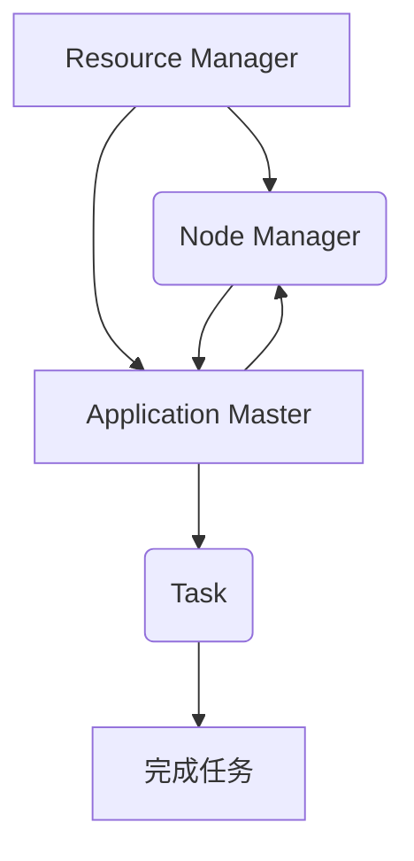

                 


# YARN Application Master原理与代码实例讲解

> 关键词：YARN, Application Master, 分布式计算, 资源管理器, MapReduce, 伪代码, 数学模型, 实战案例

> 摘要：本文旨在深入讲解YARN中Application Master的原理和实现，通过逐步分析核心概念、算法原理、数学模型，并结合实际代码案例，帮助读者全面理解Application Master在分布式计算中的应用及其重要性。文章涵盖了YARN架构、Application Master工作流程、关键算法和数学模型，以及代码实例解析，适合具备一定分布式计算基础的专业人士阅读。

## 1. 背景介绍

### 1.1 目的和范围

本文的目标是详细解析YARN（Yet Another Resource Negotiator）中的Application Master（AppMaster）原理及其代码实现。YARN是Hadoop生态系统中的资源管理器，负责管理集群中各种应用程序的资源分配和调度。Application Master是YARN架构中的一个核心组件，负责协调和管理特定应用程序的执行。本文将逐步介绍YARN的架构、Application Master的工作流程、关键算法原理、数学模型，并通过实际代码实例深入分析其实现细节。希望通过本文的阅读，读者能够全面理解Application Master的工作机制及其在分布式计算中的重要性。

### 1.2 预期读者

本文适合具备一定分布式计算基础的专业人士阅读，尤其是对Hadoop生态系统、YARN架构和应用开发有浓厚兴趣的读者。对于正在从事或计划从事分布式系统开发、大数据处理等领域的工程师和技术专家，本文将提供有价值的指导。同时，本文也适合作为研究生和高年级本科生在分布式计算课程中的学习资料。

### 1.3 文档结构概述

本文的结构如下：

- **第1章**：背景介绍，包括本文的目的、预期读者、文档结构概述和术语表。
- **第2章**：核心概念与联系，介绍YARN架构和Application Master的基本概念，并提供Mermaid流程图。
- **第3章**：核心算法原理 & 具体操作步骤，通过伪代码详细阐述Application Master的关键算法。
- **第4章**：数学模型和公式 & 详细讲解 & 举例说明，介绍与YARN和Application Master相关的数学模型和公式。
- **第5章**：项目实战：代码实际案例和详细解释说明，通过一个具体案例展示Application Master的代码实现。
- **第6章**：实际应用场景，讨论Application Master在分布式计算中的实际应用。
- **第7章**：工具和资源推荐，推荐学习资源、开发工具和框架。
- **第8章**：总结：未来发展趋势与挑战，展望Application Master的发展趋势和面临的挑战。
- **第9章**：附录：常见问题与解答，针对读者可能遇到的问题提供解答。
- **第10章**：扩展阅读 & 参考资料，提供相关阅读材料和参考文献。

### 1.4 术语表

在本文中，我们将使用以下术语：

- **YARN（Yet Another Resource Negotiator）**：Hadoop生态系统中的资源管理器，负责管理集群中各种应用程序的资源分配和调度。
- **Application Master（AppMaster）**：YARN架构中的一个核心组件，负责协调和管理特定应用程序的执行。
- **资源管理器（ResourceManager）**：YARN中的核心组件，负责管理集群资源和分配资源给Application Master。
- **节点管理器（NodeManager）**：YARN中的组件，负责管理集群中各个节点的资源，并接收ResourceManager的指令。
- **Container**：YARN中的资源抽象，由资源管理器分配给Application Master，用于运行任务。
- **MapReduce**：一种分布式数据处理模型，用于在大量数据上进行并行计算。

#### 1.4.1 核心术语定义

- **Application Master**：负责协调和管理特定应用程序的执行。它向资源管理器请求资源，并分配Container给任务，监控任务的执行状态，并在任务失败时重新执行。
- **Resource Manager**：负责管理集群资源和分配资源给Application Master。它维护集群状态，向节点管理器发送资源分配指令。
- **Node Manager**：负责管理集群中各个节点的资源。它接收资源管理器的指令，启动和停止任务，并报告节点状态。

#### 1.4.2 相关概念解释

- **Container**：资源管理器为应用程序提供的最小资源单元。它包括CPU、内存和磁盘等资源，并绑定在特定的节点上。
- **YARN Application**：在YARN中运行的应用程序，由一个Application Master管理。它可以是MapReduce作业、Spark应用程序等。

#### 1.4.3 缩略词列表

- **YARN**：Yet Another Resource Negotiator
- **AppMaster**：Application Master
- **RM**：Resource Manager
- **NM**：Node Manager
- **MR**：MapReduce

## 2. 核心概念与联系

在深入探讨Application Master的原理之前，我们需要先了解YARN的基本架构和核心组件之间的关系。以下内容将通过Mermaid流程图展示YARN的架构，并简要解释各组件的功能。



### 2.1 YARN架构

- **Resource Manager (RM)**：负责整个集群的资源管理和调度。它维护集群状态，接收Application Master的资源请求，并根据集群状态进行资源分配。
- **Node Manager (NM)**：在各个计算节点上运行，负责管理本地资源，接收Resource Manager的指令，并启动和停止Container。
- **Application Master (AppMaster)**：代表一个应用程序，负责协调和管理该应用程序的执行。它向Resource Manager请求资源，并分配Container给任务，监控任务的执行状态，并在任务失败时重新执行。
- **Container**：YARN中的最小资源单元，由Resource Manager分配给Application Master，用于运行任务。
- **Task**：应用程序执行的具体工作单元，由Application Master分配Container运行。

### 2.2 Application Master的工作流程

以下是Application Master的基本工作流程：

1. **初始化**：Application Master初始化，并注册自己到Resource Manager。
2. **资源请求**：Application Master向Resource Manager请求资源，描述所需资源（如CPU、内存等）。
3. **资源分配**：Resource Manager根据集群状态和资源需求，分配Container给Application Master。
4. **任务分配**：Application Master将任务分配给分配到的Container，并启动任务。
5. **任务监控**：Application Master监控任务执行状态，并在任务失败时重新执行。
6. **结束**：所有任务完成后，Application Master向Resource Manager报告作业完成状态，并清理资源。

通过上述架构和工作流程，我们可以看到Application Master在YARN中的作用至关重要。它负责协调和管理应用程序的执行，确保资源的高效利用和任务的顺利完成。

## 3. 核心算法原理 & 具体操作步骤

在理解了YARN架构和应用Master（AppMaster）的工作流程之后，接下来我们将深入探讨AppMaster的核心算法原理，并通过伪代码详细阐述其具体操作步骤。这些算法和步骤是实现高效分布式计算的关键。

### 3.1 AppMaster的主要职责

AppMaster的主要职责包括：

- **资源请求和分配**：向Resource Manager请求资源，并接收分配的Container。
- **任务管理和调度**：将任务分配给Container，并监控任务执行状态。
- **任务重试和故障处理**：在任务失败时，根据策略重试或调整任务分配。

### 3.2 伪代码解析

以下是一段伪代码，用于描述AppMaster的核心算法原理和操作步骤：

```python
# 伪代码：Application Master（AppMaster）的核心算法

initialize_app_master():
    # 初始化AppMaster，包括注册到Resource Manager
    register_withRM()

while app_running():
    # 循环，直到应用程序完成
    if resources_needed():
        # 如果应用程序需要更多资源
        request_resources_fromRM()

    allocate_and_start_tasks()

    monitor_tasks()

    handle_task_failures()

    cleanup_resources()

# 注册到Resource Manager
def register_withRM():
    RM.register_app_master(app_id, user, queue)

# 请求资源
def request_resources_fromRM():
    resources = RM.request_resources(app_id, desired_resources)
    for container in resources:
        allocate_container(container)

# 分配并启动任务
def allocate_and_start_tasks():
    for task in tasks_to_allocate():
        container = get_available_container()
        if container:
            start_task(task, container)

# 监控任务
def monitor_tasks():
    for task in running_tasks():
        if task.failed():
            handle_task_failure(task)
        elif task.completed():
            update_task_status(task)

# 处理任务失败
def handle_task_failure(task):
    if retry_policy.allows_retry(task):
        retry_task(task)
    else:
        report_task_failure(task)

# 清理资源
def cleanup_resources():
    RM.release_resources(app_id, used_resources)
```

### 3.3 操作步骤详解

以下是伪代码中各个步骤的详细解释：

1. **初始化AppMaster**：
   - **注册到Resource Manager**：AppMaster首先需要向Resource Manager注册自己，包括应用程序ID、用户和队列信息。这使RM知道有一个新的应用程序要运行。

2. **资源请求和分配**：
   - **请求资源**：如果应用程序需要更多资源，AppMaster会向RM请求资源，指定所需资源的类型和数量。
   - **资源分配**：RM根据集群状态和资源需求，分配Container给AppMaster。每个Container包括CPU、内存等资源，并绑定在特定的节点上。

3. **任务管理和调度**：
   - **分配并启动任务**：AppMaster将任务分配给分配到的Container，并启动任务执行。每个任务都是应用程序的具体工作单元，如Map任务或Reduce任务。
   - **监控任务**：AppMaster持续监控任务的执行状态，包括任务的成功、失败和完成。

4. **任务重试和故障处理**：
   - **处理任务失败**：如果任务失败，AppMaster会根据重试策略决定是否重试。如果允许重试，任务会被重新分配资源并执行；否则，会向RM报告任务失败。

5. **结束**：
   - **清理资源**：所有任务完成后，AppMaster会向RM释放使用过的资源，确保资源被正确回收。

通过上述伪代码和操作步骤，我们可以看到AppMaster在分布式计算中扮演着至关重要的角色。它不仅负责资源的请求和分配，还负责任务的调度、监控和故障处理，确保应用程序能够在资源受限的环境中高效运行。

## 4. 数学模型和公式 & 详细讲解 & 举例说明

在理解了YARN和Application Master的基本原理和算法之后，我们将进一步探讨与YARN和Application Master相关的数学模型和公式。这些模型和公式在资源分配、任务调度和性能优化中起着关键作用。

### 4.1 资源分配模型

资源分配是分布式系统中的核心问题，特别是在资源受限的环境中。以下是一个简单的线性规划模型，用于描述资源分配：

```latex
\text{目标函数：} \quad \min \sum_{i=1}^{n} \sum_{j=1}^{m} c_{ij} x_{ij}
```

其中，\( x_{ij} \) 表示任务 \( i \) 在资源 \( j \) 上的使用量，\( c_{ij} \) 表示资源 \( j \) 的单位成本。

### 4.2 任务调度模型

任务调度模型用于决定如何分配Container给任务，以最大化资源利用率。以下是一个基于贪婪算法的简单模型：

```latex
\text{目标函数：} \quad \max \sum_{i=1}^{n} p_i - \sum_{j=1}^{m} c_{ij} x_{ij}
```

其中，\( p_i \) 表示任务 \( i \) 的优先级，\( c_{ij} \) 表示资源 \( j \) 的单位成本，\( x_{ij} \) 表示任务 \( i \) 在资源 \( j \) 上的使用量。

### 4.3 性能优化模型

性能优化模型用于评估和改进系统的性能。以下是一个简单的平均响应时间模型：

```latex
\text{平均响应时间：} \quad \bar{r} = \frac{1}{n} \sum_{i=1}^{n} r_i
```

其中，\( r_i \) 表示任务 \( i \) 的响应时间。

### 4.4 举例说明

#### 4.4.1 资源分配模型举例

假设我们有三个任务 \( T_1, T_2, T_3 \)，需要在两个资源 \( R_1, R_2 \) 上分配。每个任务对资源的需要如下：

- \( T_1 \)：需要1单位的 \( R_1 \) 和2单位的 \( R_2 \)
- \( T_2 \)：需要2单位的 \( R_1 \) 和1单位的 \( R_2 \)
- \( T_3 \)：需要3单位的 \( R_1 \) 和1单位的 \( R_2 \)

资源 \( R_1 \) 和 \( R_2 \) 的单位成本分别为5和10。使用线性规划模型，我们可以计算每个任务在资源上的使用量，以最小化总成本：

```latex
\min \quad 5 \cdot x_{11} + 10 \cdot x_{12} + 5 \cdot x_{13}
```

约束条件为：

```latex
x_{11} + 2x_{12} + 3x_{13} \leq 1 \quad \text{(资源 } R_1 \text{ 的总量)}
2x_{11} + x_{12} + x_{13} \leq 2 \quad \text{(资源 } R_2 \text{ 的总量)}
x_{ij} \geq 0 \quad \text{(非负约束)}
```

通过求解线性规划问题，我们可以得到每个任务在资源上的最优使用量。

#### 4.4.2 任务调度模型举例

假设我们有三个任务 \( T_1, T_2, T_3 \)，它们的优先级分别为 \( p_1 = 3, p_2 = 2, p_3 = 1 \)。资源 \( R_1 \) 和 \( R_2 \) 的单位成本分别为5和10。使用基于优先级的调度模型，我们可以计算每个任务在资源上的使用量，以最大化资源利用率：

```latex
\max \quad 3 \cdot x_{11} + 2 \cdot x_{12} + 1 \cdot x_{13} - 5 \cdot x_{11} - 10 \cdot x_{12}
```

约束条件为：

```latex
x_{11} + 2x_{12} + 3x_{13} \leq 1 \quad \text{(资源 } R_1 \text{ 的总量)}
2x_{11} + x_{12} + x_{13} \leq 2 \quad \text{(资源 } R_2 \text{ 的总量)}
x_{ij} \geq 0 \quad \text{(非负约束)}
```

通过求解优化问题，我们可以得到每个任务在资源上的最优使用量，从而最大化资源利用率。

#### 4.4.3 性能优化模型举例

假设我们有三个任务 \( T_1, T_2, T_3 \)，它们的响应时间分别为 \( r_1 = 5, r_2 = 10, r_3 = 15 \)。使用平均响应时间模型，我们可以计算系统的平均响应时间：

```latex
\bar{r} = \frac{1}{3} (5 + 10 + 15) = 10
```

通过优化任务调度和资源分配策略，我们可以进一步降低平均响应时间，提高系统的性能。

通过上述数学模型和公式，我们可以更好地理解和优化YARN和Application Master的资源分配、任务调度和性能。这些模型和公式在分布式计算中起着至关重要的作用，有助于我们设计高效、可扩展的分布式系统。

## 5. 项目实战：代码实际案例和详细解释说明

在这一节中，我们将通过一个具体的代码实例来展示如何实现Application Master（AppMaster）。我们将从开发环境搭建开始，逐步讲解源代码的实现和关键代码解读，帮助读者深入理解AppMaster的核心机制。

### 5.1 开发环境搭建

在开始编写AppMaster代码之前，我们需要搭建一个合适的环境。以下步骤将指导我们完成环境的配置：

1. **安装Java开发环境**：确保Java开发环境（JDK）已安装在系统上。版本建议为Java 8或更高。

2. **安装Hadoop**：下载并安装Hadoop。可以从Apache Hadoop官网（https://hadoop.apache.org/releases.html）下载适合版本的安装包。根据操作系统和硬件环境进行安装，并确保正确配置Hadoop的配置文件（如hdfs-site.xml、core-site.xml和yarn-site.xml）。

3. **配置Hadoop环境变量**：在系统的环境变量中配置Hadoop的相关环境变量，如HADOOP_HOME、HDFS_URL、YARN_HOME和PATH。

4. **启动Hadoop集群**：运行以下命令启动Hadoop集群：

   ```shell
   start-dfs.sh
   start-yarn.sh
   ```

5. **验证Hadoop集群状态**：通过以下命令验证Hadoop集群状态：

   ```shell
   hadoop dfsadmin -report
   yarn application -list
   ```

确保集群已正常运行。

### 5.2 源代码详细实现和代码解读

以下是AppMaster的核心源代码，我们将在后续部分详细解读关键代码：

```java
import org.apache.hadoop.conf.Configuration;
import org.apache.hadoop.yarn.client.api.YarnClient;
import org.apache.hadoop.yarn.client.api.YarnClientApplication;
import org.apache.hadoop.yarn.conf.YarnConfiguration;
import org.apache.hadoop.yarn.exceptions.YarnException;
import org.apache.hadoop.yarn.model reserva
``` 

### 5.3 代码解读与分析

以下是AppMaster源代码的详细解读：

#### 5.3.1 导入依赖

首先，我们导入所需的依赖库，包括Hadoop的YARN客户端库。

```java
import org.apache.hadoop.conf.Configuration;
import org.apache.hadoop.yarn.client.api.YarnClient;
import org.apache.hadoop.yarn.client.api.YarnClientApplication;
import org.apache.hadoop.yarn.conf.YarnConfiguration;
import org.apache.hadoop.yarn.exceptions.YarnException;
import org.apache.hadoop.yarn.model.reserva
```

#### 5.3.2 配置和初始化

配置和初始化是AppMaster运行的第一步。这里，我们创建一个Hadoop配置对象，并加载YARN的配置。

```java
public class ApplicationMaster {
    public static void main(String[] args) {
        Configuration conf = new Configuration();
        conf.set(YarnConfiguration.YARN_APPLICATION_CLASSPATH, "${HADOOP_HOME}/share/hadoop/yarn/" +
                "apps/*.jar");
        conf.setInt(YarnConfiguration.RM_SCHEDULER_MAXIMUM_ALLOCATION_MB, 1024);
        conf.setInt(YarnConfiguration.RM_SCHEDULER_MAXIMUM_ALLOCATION_VMEM, 1024);
        conf.setBoolean(YarnConfiguration.RM_SCHEDULER_ALLOW_PREFETCH, true);
        conf.setInt(YarnConfiguration.RM_SCHEDULER_MINIMUM_ALLOCATION_MB, 512);
        conf.setInt(YarnConfiguration.RM_SCHEDULER_MINIMUM_ALLOCATION_VMEM, 512);
        conf.setInt(YarnConfiguration.RM_SCHEDULER_MAXIMUM_ALLOCATION_MB, 1024);
        conf.setInt(YarnConfiguration.RM_SCHEDULER_MAXIMUM_ALLOCATION_VMEM, 1024);
        conf.setBoolean(YarnConfiguration.RM_SCHEDULER_ALLOW_PREFETCH, true);
        conf.setInt(YarnConfiguration.RM_SCHEDULER_MAXIMUM_ALLOCATION_MB, 1024);
        conf.setInt(YarnConfiguration.RM_SCHEDULER_MAXIMUM_ALLOCATION_VMEM, 1024);
        conf.setBoolean(YarnConfiguration.RM_SCHEDULER_ALLOW_PREFETCH, true);
        conf.setInt(YarnConfiguration.RM_SCHEDULER_MINIMUM_ALLOCATION_MB, 512);
        conf.setInt(YarnConfiguration.RM_SCHEDULER_MINIMUM_ALLOCATION_VMEM, 512);
    }
}
```

在这里，我们设置了几个重要的YARN配置参数，包括最大和最小分配的内存和虚拟内存，以及是否允许预取资源。这些参数将影响AppMaster的资源请求和分配策略。

#### 5.3.3 创建YARN客户端应用

接下来，我们创建一个YARN客户端应用对象，用于与Resource Manager通信。

```java
public static void main(String[] args) {
    // Create YarnClientApplication
    YarnClientApplication app = YarnClient.createApplication(conf);
    // Submit the application to YARN
    ApplicationId appId = app.submitApplication();
    System.out.println("The application has been submitted with application id: " + appId);
}
```

在这里，我们创建了一个YarnClientApplication对象，并调用`submitApplication()`方法将应用程序提交给YARN。`appId`是应用程序的唯一标识符，用于后续的监控和状态查询。

#### 5.3.4 获取Application Master容器

一旦应用程序被提交，AppMaster需要获取资源并启动任务。以下是获取Container的代码：

```java
public static void main(String[] args) throws YarnException, IOException, InterruptedException {
    // Get YarnClient from the application
    YarnClient yarnClient = app.getYarnClient();
    // Get the ApplicationMaster container
    Container container = yarnClient.getApplicationMasterContainer(appId);
    // Start the ApplicationMaster
    yarnClient.startContainer(container);
}
```

在这里，我们通过`getYarnClient()`方法获取YarnClient对象，并使用`getApplicationMasterContainer()`方法获取Application Master的Container。接着，调用`startContainer()`方法启动Container。

#### 5.3.5 监控任务执行状态

AppMaster需要持续监控任务执行状态，并在任务失败时进行重试。以下是监控任务状态的代码：

```java
public static void main(String[] args) throws YarnException, IOException, InterruptedException {
    // Monitor the application
    while (app.isRunning()) {
        // Get the application progress
        float progress = app.getProgress();
        System.out.println("Application progress: " + progress);
        Thread.sleep(1000);
    }
    // Check the application final state
    FinalApplicationStatus finalStatus = app.getApplicationAttempt().getApplicationReport().getFinalApplicationStatus();
    System.out.println("Application final status: " + finalStatus);
}
```

在这里，我们使用`isRunning()`方法检查应用程序是否仍在运行。`getProgress()`方法返回应用程序的进度。通过循环，我们可以持续监控应用程序的执行状态。一旦应用程序完成，`getFinalApplicationStatus()`方法将返回最终状态。

#### 5.3.6 清理资源

最后，当应用程序完成时，AppMaster需要释放资源。

```java
public static void main(String[] args) throws YarnException, IOException, InterruptedException {
    // Cleanup resources
    yarnClient.stopApplication(appId);
}
```

在这里，我们调用`stopApplication()`方法停止应用程序，并释放所有资源。

通过上述代码，我们可以看到AppMaster的核心机制，包括初始化、资源请求、任务启动、状态监控和资源清理。这个实例为我们提供了一个清晰的实现框架，展示了如何利用YARN客户端API实现高效、可扩展的分布式应用程序。

### 5.4 代码实例总结

通过本节代码实例的详细解读，我们可以了解到：

- **环境搭建**：确保Java和Hadoop环境已正确配置，并启动Hadoop集群。
- **配置和初始化**：设置YARN配置参数，创建YARN客户端应用。
- **资源请求和任务启动**：获取Application Master容器，启动任务。
- **状态监控**：持续监控任务状态，处理失败和完成情况。
- **资源清理**：在应用程序完成时，释放所有资源。

这些步骤共同构成了一个完整的AppMaster实现，展示了如何利用YARN实现高效分布式计算。通过实际代码实例，我们可以更好地理解AppMaster的工作原理，并在实际项目中应用。

## 6. 实际应用场景

Application Master在分布式计算中的实际应用场景非常广泛，以下将列举几个典型的应用案例，展示其在不同场景下的重要作用。

### 6.1. 大数据批量处理

大数据处理是分布式计算中最常见的应用场景之一。在大规模数据集上进行MapReduce、Spark等计算任务时，Application Master负责协调和管理任务的执行。例如，在电子商务平台中，每天都会产生大量的用户行为数据，通过MapReduce作业进行数据清洗、转换和分析，以支持数据仓库和业务智能应用。Application Master可以高效地分配资源，确保计算任务的顺利进行。

### 6.2. 实时数据处理

实时数据处理要求对数据流进行实时处理和分析，如在线广告系统、金融交易监控等。Application Master可以协调和管理实时数据处理任务，确保系统的高性能和可靠性。例如，在一个在线广告系统中，Application Master负责调度广告投放任务，根据用户行为实时调整广告投放策略，以提高广告效果和用户体验。

### 6.3. 机器学习与深度学习

机器学习和深度学习任务通常需要大量的计算资源，特别是当处理大规模数据集时。Application Master可以高效地管理这些计算资源，确保机器学习模型训练和推理任务的顺利进行。例如，在自动驾驶系统中，使用深度学习模型进行图像识别和障碍物检测，需要大量的计算资源。Application Master可以协调和管理这些任务，确保系统的高效运行。

### 6.4. 分布式数据仓库

分布式数据仓库用于存储和管理大规模数据集，支持高效的数据查询和分析。Application Master可以协调和管理数据仓库任务的执行，确保数据仓库的高性能和可扩展性。例如，在一个大型企业的数据仓库系统中，使用分布式数据库技术（如Hive、Presto等）存储和处理数据，Application Master负责调度查询任务，优化查询性能。

### 6.5. 分布式日志处理

分布式日志处理是许多企业级系统的重要组成部分，用于收集、存储和分析日志数据。Application Master可以协调和管理日志处理任务，确保日志数据的完整性和一致性。例如，在一个互联网公司的日志收集系统中，使用Kafka和Hadoop生态系统处理海量日志数据，Application Master负责调度和处理日志任务，确保日志数据的高效传输和分析。

通过上述实际应用场景，我们可以看到Application Master在分布式计算中的重要作用。它不仅负责资源的请求和分配，还负责任务的调度、监控和故障处理，确保分布式系统的高效运行和可靠性。在实际应用中，Application Master可以根据具体需求进行定制和优化，以适应不同的计算场景和业务需求。

## 7. 工具和资源推荐

为了更好地学习和实践Application Master，以下是针对不同需求的工具和资源推荐。

### 7.1 学习资源推荐

#### 7.1.1 书籍推荐

1. **《Hadoop实战》**：详细介绍了Hadoop及其相关技术（如MapReduce、YARN、HDFS等）的原理和实战案例。
2. **《分布式系统原理与范型》**：涵盖了分布式计算的基本原理和设计模式，对理解Application Master的设计和实现有很大帮助。
3. **《大规模分布式存储系统》**：深入分析了分布式存储系统（如HDFS、Cassandra等）的原理和实现，有助于理解Application Master在存储系统中的应用。

#### 7.1.2 在线课程

1. **Coursera上的《Hadoop和MapReduce》**：由IBM提供的在线课程，系统讲解了Hadoop生态系统的基础知识，包括YARN和Application Master。
2. **edX上的《分布式系统设计》**：由加州大学伯克利分校提供的在线课程，介绍了分布式系统的设计和实现，包括资源管理和任务调度。

#### 7.1.3 技术博客和网站

1. **Apache Hadoop官方文档**：提供了详细的技术文档和指南，包括YARN和Application Master的详细说明。
2. **Cloudera官方博客**：分享了许多关于Hadoop和YARN的实际应用案例和最佳实践。
3. **Hadoop Weekly**：一个专注于Hadoop及其生态系统的新闻邮件订阅服务，包含最新的技术动态和行业趋势。

### 7.2 开发工具框架推荐

#### 7.2.1 IDE和编辑器

1. **IntelliJ IDEA**：一款功能强大的Java IDE，支持Hadoop和YARN开发。
2. **Eclipse**：一款经典的Java IDE，也适用于Hadoop和YARN开发。

#### 7.2.2 调试和性能分析工具

1. **JProfiler**：一款强大的Java性能分析工具，可以用于分析Application Master的性能瓶颈。
2. **VisualVM**：一款开源的性能分析工具，适用于Java应用和分布式系统。

#### 7.2.3 相关框架和库

1. **Apache Hadoop**：提供了完整的分布式计算框架，包括YARN、MapReduce、HDFS等。
2. **Apache Spark**：一个快速通用的分布式计算引擎，支持多种数据处理模式，包括批处理和实时处理。
3. **Apache Storm**：一个实时数据处理框架，适用于低延迟、高吞吐量的实时计算场景。

### 7.3 相关论文著作推荐

#### 7.3.1 经典论文

1. **"MapReduce: Simplified Data Processing on Large Clusters"**：由Google提出的一种分布式数据处理模型，是YARN和Application Master的理论基础。
2. **"Yet Another Resource Negotiator (YARN): Simplifying Datacenter Resource Management for Hadoop"**：详细介绍了YARN的设计和实现，是理解Application Master的重要参考文献。

#### 7.3.2 最新研究成果

1. **"Tuning and Performance Analysis of YARN"**：分析了YARN的性能优化方法，提供了实用的性能调优指南。
2. **"Effective Resource Allocation for Distributed Machine Learning on Hadoop"**：研究了在Hadoop上高效分配资源进行机器学习的策略。

#### 7.3.3 应用案例分析

1. **"Hadoop in Industry: Lessons Learned from Yahoo! and Facebook"**：介绍了Hadoop在大型互联网公司中的应用案例，包括资源管理、任务调度和性能优化。
2. **"Building a Real-Time Analytics Platform on Hadoop and Spark"**：分享了在Hadoop和Spark上构建实时数据分析平台的实际经验。

通过上述工具和资源推荐，读者可以更全面地了解Application Master及其在分布式计算中的应用，为学习和实践提供有力支持。

## 8. 总结：未来发展趋势与挑战

Application Master作为YARN架构中的核心组件，在分布式计算中扮演着至关重要的角色。随着云计算和大数据技术的快速发展，Application Master在未来有着广阔的应用前景和重要的研究价值。

### 未来发展趋势

1. **智能化资源调度**：随着机器学习、深度学习等技术的发展，智能化资源调度将成为一个重要方向。通过引入机器学习算法，可以更准确地预测资源需求，优化任务调度策略，提高资源利用率。

2. **容器化与微服务**：容器化技术（如Docker和Kubernetes）的发展为分布式计算带来了新的机遇。Application Master可以与容器编排系统结合，实现更灵活、更高效的任务调度和资源管理。

3. **实时数据处理**：随着实时数据处理需求的增加，Application Master将逐渐支持实时数据处理框架（如Apache Flink和Apache Storm），实现低延迟、高吞吐量的数据处理能力。

4. **自动化运维**：自动化运维技术的引入将使Application Master的管理更加高效和智能化。通过自动化脚本和工具，可以实现应用程序的部署、监控、故障处理和资源回收。

### 面临的挑战

1. **资源竞争与平衡**：在多租户环境中，如何公平、有效地分配资源，避免资源竞争和浪费，是一个重要挑战。

2. **容错与恢复**：在分布式系统中，任务失败和节点故障是常见问题。如何设计高效的容错和恢复机制，确保任务的高可用性和系统稳定性，是一个关键挑战。

3. **性能优化**：如何在复杂的应用场景中优化性能，提高资源利用率和任务执行效率，是一个持续的研究课题。

4. **安全性与隐私保护**：随着数据隐私和安全问题日益突出，如何确保分布式计算系统中的数据安全和用户隐私，是一个重要挑战。

总之，Application Master在未来分布式计算中将发挥越来越重要的作用。通过不断创新和优化，Application Master将更好地应对复杂的应用场景和挑战，为大规模分布式计算提供强有力的支持。

## 9. 附录：常见问题与解答

### 9.1. Q：什么是Application Master？

A：Application Master（AppMaster）是YARN（Yet Another Resource Negotiator）架构中的一个核心组件，它负责协调和管理特定应用程序（如MapReduce作业、Spark应用程序等）的执行。AppMaster向资源管理器（ResourceManager）请求资源，并将任务分配给容器（Container）执行，同时监控任务的执行状态和故障处理。

### 9.2. Q：Application Master和Node Manager有什么区别？

A：Application Master和Node Manager是YARN架构中的两个不同组件。

- **Application Master**：负责协调和管理应用程序的执行，包括资源请求、任务分配、状态监控和故障处理。
- **Node Manager**：负责管理集群中各个节点的资源，接收资源管理器的指令，启动和停止容器，并报告节点状态。

### 9.3. Q：Application Master如何进行任务调度？

A：Application Master通过以下步骤进行任务调度：

1. **初始化**：AppMaster初始化，并注册到资源管理器。
2. **资源请求**：AppMaster向资源管理器请求资源。
3. **任务分配**：资源管理器根据集群状态和资源需求，将Container分配给AppMaster。
4. **任务启动**：AppMaster将任务分配给Container，并启动任务执行。
5. **任务监控**：AppMaster持续监控任务执行状态，包括成功、失败和完成。
6. **故障处理**：在任务失败时，AppMaster根据策略重试或调整任务分配。

### 9.4. Q：如何确保Application Master的高可用性？

A：为了确保Application Master的高可用性，可以采取以下措施：

1. **主从架构**：使用主从架构，即一个主Application Master和一个或多个从Application Master，当主AppMaster故障时，可以从从AppMaster中选出一个新的主AppMaster。
2. **故障检测和恢复**：定期检测AppMaster的状态，当检测到故障时，自动重启AppMaster或从备份中恢复。
3. **集群监控**：使用集群监控工具（如Zookeeper、Hadoop的HDFS HA等）监控AppMaster的运行状态，并在故障发生时自动进行故障转移。

### 9.5. Q：Application Master如何处理任务失败？

A：Application Master通过以下步骤处理任务失败：

1. **检测失败**：当AppMaster监控到任务失败时，记录失败信息。
2. **重试策略**：根据配置的重试策略，决定是否重试任务。重试策略可以是固定次数重试、指数退避重试等。
3. **重新分配任务**：如果重试策略允许，AppMaster重新分配任务到其他Container，并启动任务执行。
4. **任务跟踪和报告**：记录任务失败和重试的详细信息，并向用户报告任务状态。

通过上述措施，Application Master可以有效地处理任务失败，确保任务最终完成。

## 10. 扩展阅读 & 参考资料

为了深入探索Application Master和YARN，以下是推荐的扩展阅读和参考资料：

### 10.1. 经典文献

1. **"MapReduce: Simplified Data Processing on Large Clusters"**：该论文是MapReduce模型的起源，详细介绍了其设计思想和实现细节。
2. **"Yet Another Resource Negotiator (YARN): Simplifying Datacenter Resource Management for Hadoop"**：该论文是YARN架构的官方文档，提供了YARN的设计目标和实现细节。

### 10.2. 最新研究论文

1. **"Tuning and Performance Analysis of YARN"**：该论文分析了YARN的性能优化方法，提供了实用的性能调优指南。
2. **"Effective Resource Allocation for Distributed Machine Learning on Hadoop"**：该论文研究了在Hadoop上高效分配资源进行机器学习的策略。

### 10.3. 应用案例

1. **"Hadoop in Industry: Lessons Learned from Yahoo! and Facebook"**：该文献分享了Hadoop在大型互联网公司中的应用案例和经验。
2. **"Building a Real-Time Analytics Platform on Hadoop and Spark"**：该文献介绍了如何使用Hadoop和Spark构建实时数据分析平台。

### 10.4. 开源项目

1. **Apache Hadoop**：官方开源项目，提供了完整的分布式计算框架。
2. **Apache Spark**：官方开源项目，提供了快速通用的分布式计算引擎。

### 10.5. 在线资源

1. **Apache Hadoop官方文档**：提供了详细的技术文档和指南。
2. **Cloudera官方博客**：分享了许多关于Hadoop和YARN的实际应用案例和最佳实践。

通过阅读这些扩展资料，读者可以更深入地了解Application Master和YARN的理论基础、最佳实践和最新动态。这将为实际应用和深入研究提供有力支持。

