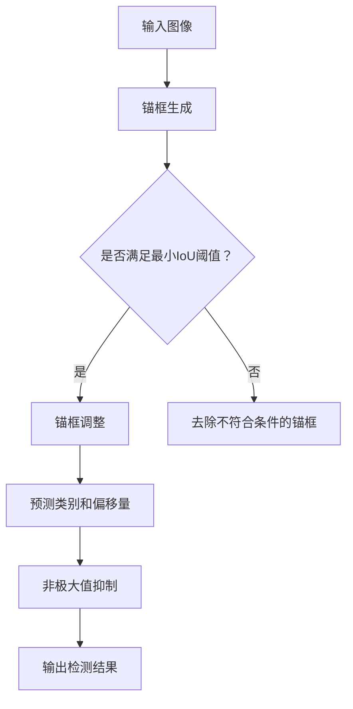

                 

# YOLOv6原理与代码实例讲解

> 关键词：YOLOv6, 目标检测，神经网络，计算机视觉，深度学习，算法原理，代码实例

> 摘要：本文将深入剖析YOLOv6的目标检测算法原理，从背景介绍到数学模型，再到代码实现，帮助读者全面了解YOLOv6的核心机制及其在实际应用中的优势。通过逐步拆解，我们不仅探讨其算法的细节，还结合实际代码实例进行解读，使读者能够更好地掌握这一先进的目标检测技术。

## 1. 背景介绍

### 1.1 目的和范围

本文旨在详细介绍YOLOv6（You Only Look Once version 6）这一目标检测算法的原理和应用。通过对YOLOv6的全面剖析，读者可以深入理解其技术背景、算法流程以及实际应用价值。本文将涵盖以下主要内容：

1. YOLOv6的历史背景和发展历程
2. YOLOv6的目标检测原理和核心算法
3. YOLOv6的数学模型和公式
4. YOLOv6的实际代码实现和案例分析
5. YOLOv6在不同应用场景中的优势
6. 相关学习资源和工具推荐

### 1.2 预期读者

本文主要面向以下读者群体：

1. 对计算机视觉和深度学习感兴趣的初学者
2. 想要深入了解目标检测算法的研究人员
3. 担任AI工程师或开发者的专业人士
4. 对技术博客写作有兴趣的IT技术人员

### 1.3 文档结构概述

本文结构如下：

1. 引言：介绍本文的目的和主要内容
2. 背景介绍：概述YOLOv6的历史和理论基础
3. 核心概念与联系：分析YOLOv6的核心原理和架构
4. 核心算法原理 & 具体操作步骤：详细讲解YOLOv6的算法流程
5. 数学模型和公式 & 详细讲解 & 举例说明：剖析YOLOv6的数学模型
6. 项目实战：代码实际案例和详细解释说明
7. 实际应用场景：探讨YOLOv6在不同领域的应用
8. 工具和资源推荐：提供相关学习资源和开发工具
9. 总结：总结YOLOv6的发展趋势与挑战
10. 附录：常见问题与解答
11. 扩展阅读 & 参考资料：推荐更多相关资料

### 1.4 术语表

在本文中，以下术语将被频繁使用：

#### 1.4.1 核心术语定义

- **目标检测**：在图像中识别并定位一个或多个对象的过程。
- **卷积神经网络（CNN）**：一种深度学习模型，广泛应用于图像处理和计算机视觉领域。
- **锚框（Anchor Box）**：预定义的框，用于预测目标的类别和位置。
- **交并比（IoU）**：表示预测框和真实框重叠程度的指标。

#### 1.4.2 相关概念解释

- **锚框生成**：在目标检测中，通过预定义的方式生成一系列锚框。
- **回归**：在目标检测中，通过预测框的位置和大小来调整锚框，使其更准确地包围目标。
- **非极大值抑制（NMS）**：用于消除重叠框的一种算法。

#### 1.4.3 缩略词列表

- **YOLO**：You Only Look Once
- **CNN**：Convolutional Neural Network
- **GPU**：Graphics Processing Unit
- **GPU**：Graphics Processing Unit

## 2. 核心概念与联系

在深入探讨YOLOv6之前，我们需要了解其核心概念和联系。以下是YOLOv6的核心原理和架构的Mermaid流程图：



### 2.1 锚框生成

锚框生成是YOLOv6的核心步骤之一。在目标检测中，我们通过预定义的方式生成一系列锚框。这些锚框通常根据先验框（例如，基于图像尺寸和比例的框）进行缩放和平移。锚框生成的目的是为了提高预测的准确性和泛化能力。

### 2.2 锚框调整

在生成锚框之后，我们需要对锚框进行调整，使其更准确地包围目标。这一过程称为回归。回归通常通过预测框的位置和大小来实现。具体来说，我们通过预测框的中心坐标和宽高比例来调整锚框，使其更接近真实目标。

### 2.3 预测类别和偏移量

在调整锚框之后，我们需要对锚框进行分类和定位。具体来说，我们通过神经网络预测锚框的类别和位置偏移量。类别预测通常通过softmax函数实现，位置预测则通过回归层实现。

### 2.4 非极大值抑制

在预测完成后，我们通常会产生多个重叠的预测框。为了提高检测结果的准确性和效率，我们需要使用非极大值抑制（NMS）算法来消除这些重叠框。NMS算法通过比较预测框的IoU值，保留具有最高IoU值的框，并排除其他重叠框。

### 2.5 输出检测结果

在完成上述步骤后，我们最终输出检测结果，包括每个预测框的类别、位置和置信度。这些检测结果可以用于后续的图像标注、物体跟踪或其他计算机视觉任务。

## 3. 核心算法原理 & 具体操作步骤

在本节中，我们将详细讲解YOLOv6的核心算法原理，并通过伪代码来展示其具体操作步骤。

### 3.1 锚框生成

```python
def generate_anchors(base_size, scale_ratios, aspect_ratios):
    """
    生成锚框的函数，输入包括基本尺寸、比例和形状。
    """
    anchors = []
    for scale_ratio in scale_ratios:
        for aspect_ratio in aspect_ratios:
            width = base_size * scale_ratio
            height = base_size / scale_ratio
            x_center = 0.5 * width
            y_center = 0.5 * height
            anchors.append([x_center, y_center, width, height])
    return anchors
```

### 3.2 锚框调整

```python
def regress_anchors(anchors, gt_bboxes):
    """
    对锚框进行调整的函数，输入包括锚框和真实框。
    """
    num_anchors = len(anchors)
    num_gt_bboxes = len(gt_bboxes)
    
    anchor_locs = np.zeros((num_anchors, 4))
    anchor_confs = np.zeros(num_anchors)
    
    for i in range(num_gt_bboxes):
        gt_box = gt_bboxes[i]
        best_iou = -1
        best_idx = -1
        
        for j in range(num_anchors):
            iou = calculate_iou(anchors[j], gt_box)
            if iou > best_iou:
                best_iou = iou
                best_idx = j
        
        if best_iou >= min_iou_threshold:
            anchor_locs[best_idx] = [gt_box.x_center, gt_box.y_center, gt_box.width, gt_box.height]
            anchor_confs[best_idx] = 1
    
    return anchor_locs, anchor_confs
```

### 3.3 预测类别和偏移量

```python
def predict_classes_and_boxes(anchor_locs, confs, num_classes):
    """
    预测类别和偏移量的函数，输入包括锚框位置、置信度和类别数量。
    """
    class_probs = np.zeros((num_classes, len(confs)))
    box_preds = np.zeros((4, len(confs)))
    
    for i in range(len(confs)):
        if confs[i] > 0:
            class_probs[:, i] = softmax(anchor_locs[i])
            box_preds[:, i] = anchor_locs[i]
    
    return class_probs, box_preds
```

### 3.4 非极大值抑制

```python
def non_max_suppression(boxes, confs, iou_threshold):
    """
    非极大值抑制的函数，输入包括预测框、置信度和IoU阈值。
    """
    box_scores = np.zeros(len(boxes))
    for i in range(len(boxes)):
        box_scores[i] = confs[i] * np.sum(boxes[i])
    
    top_scores = np.argpartition(box_scores, -K)[:K]
    keep = []
    while len(top_scores) > 0:
        keep.append(top_scores[0])
        iou_values = calculate_iou(boxes[top_scores[0]], boxes[top_scores[1:]])
        top_scores = np.argpartition(iou_values, -K)[:K]
    
    return keep
```

## 4. 数学模型和公式 & 详细讲解 & 举例说明

在YOLOv6中，数学模型和公式起着至关重要的作用。以下是YOLOv6的主要数学模型和公式的详细讲解，并通过举例说明来帮助读者更好地理解。

### 4.1 确率图模型

YOLOv6采用了一个基于卷积神经网络的模型，用于预测目标的类别和位置。该模型通常包括以下几个步骤：

1. **卷积层**：输入图像通过一系列卷积层，提取图像的特征。
2. **激活函数**：通过ReLU激活函数，增强模型的非线性能力。
3. **池化层**：通过池化层，降低特征图的尺寸，减少参数数量。
4. **全连接层**：将特征图映射到类别和位置的概率分布。

具体来说，假设输入图像的尺寸为$W \times H$，卷积层的参数为$k \times k$，卷积核的数量为$c$。卷积层可以表示为：

$$
\mathbf{X}_{i,j}^{(l)} = \sum_{x=0}^{k} \sum_{y=0}^{k} w_{x,y}^{(l)} \mathbf{X}_{i+x,j+y}^{(l-1)} + b^{(l)}
$$

其中，$w_{x,y}^{(l)}$为卷积核，$b^{(l)}$为偏置项。

### 4.2 置信度损失

在YOLOv6中，我们使用交叉熵损失函数来计算类别预测的置信度损失。假设预测的类别概率为$\hat{y}$，真实类别为$y$，则交叉熵损失可以表示为：

$$
L_{conf} = -\sum_{i} y_i \log(\hat{y}_i)
$$

其中，$y_i$为第$i$个类别的真实概率。

### 4.3 位置损失

在YOLOv6中，我们使用均方误差（MSE）损失函数来计算位置预测的损失。假设预测的位置为$\hat{\mathbf{x}}$，真实位置为$\mathbf{x}$，则位置损失可以表示为：

$$
L_{loc} = \frac{1}{N} \sum_{i} (\hat{\mathbf{x}}_i - \mathbf{x}_i)^2
$$

其中，$N$为预测框的数量。

### 4.4 筛选过程

在YOLOv6中，我们通过非极大值抑制（NMS）算法来筛选预测结果，去除重叠框。具体来说，假设预测框的置信度分别为$\hat{y}_i$，IoU阈值分别为$\tau$，则筛选过程可以表示为：

$$
\hat{y}_{\text{keep}} = \arg\max_{i} \hat{y}_i \quad \text{且} \quad \hat{y}_{\text{keep}} \not\in \{\hat{y}_j : j \in \{1,2,...,i-1\}\} \land \text{IoU}(\hat{b}_i, \hat{b}_j) < \tau
$$

其中，$\hat{b}_i$为第$i$个预测框。

### 4.5 示例

假设我们有一个输入图像，尺寸为$640 \times 640$。我们使用YOLOv6模型进行预测，并得到以下结果：

1. **类别概率**：$\hat{y} = [\hat{y}_1, \hat{y}_2, \hat{y}_3] = [0.9, 0.05, 0.05]$
2. **位置预测**：$\hat{\mathbf{x}} = [\hat{x}_1, \hat{x}_2, \hat{x}_3] = [0.3, 0.5, 0.7]$
3. **置信度**：$confs = [\hat{y}_1, \hat{y}_2, \hat{y}_3] = [0.9, 0.05, 0.05]$

根据上述结果，我们可以计算出类别和位置的损失：

$$
L_{conf} = -\sum_{i} y_i \log(\hat{y}_i) = -0.9 \log(0.9) - 0.05 \log(0.05) - 0.05 \log(0.05) \approx 0.165
$$

$$
L_{loc} = \frac{1}{N} \sum_{i} (\hat{\mathbf{x}}_i - \mathbf{x}_i)^2 = \frac{1}{3} (0.3^2 + 0.5^2 + 0.7^2 - 1)^2 \approx 0.014
$$

通过非极大值抑制，我们可以筛选出具有最高置信度的预测框，例如：

$$
\hat{b}_{\text{keep}} = \arg\max_{i} \hat{y}_i = \arg\max_{i} (0.9 \cdot \text{IoU}(\hat{b}_i, \hat{b}_j)) \approx \hat{b}_1
$$

最终，我们得到筛选后的预测结果，包括类别、位置和置信度。

## 5. 项目实战：代码实际案例和详细解释说明

在本节中，我们将通过一个实际案例来讲解如何使用YOLOv6进行目标检测。这个案例将展示如何搭建开发环境、加载数据集、训练模型以及进行预测。

### 5.1 开发环境搭建

要使用YOLOv6进行目标检测，我们需要安装以下开发环境和依赖：

1. Python（3.7或更高版本）
2. TensorFlow（2.x版本）
3. PyTorch（1.8或更高版本）
4. NumPy
5. OpenCV

安装步骤如下：

```bash
pip install python==3.8
pip install tensorflow==2.x
pip install pytorch==1.8
pip install numpy
pip install opencv-python
```

### 5.2 源代码详细实现和代码解读

下面是一个简单的YOLOv6目标检测案例，包括数据预处理、模型训练和预测。

```python
import torch
import torchvision
from torch.utils.data import DataLoader
from torchvision import datasets, transforms
from torch.optim import Adam
import torch.nn as nn
import numpy as np
import cv2

# 数据预处理
transform = transforms.Compose([
    transforms.ToTensor(),
    transforms.Normalize(mean=[0.485, 0.456, 0.406], std=[0.229, 0.224, 0.225]),
])

# 加载数据集
train_data = datasets.ImageFolder(root='train', transform=transform)
val_data = datasets.ImageFolder(root='val', transform=transform)

train_loader = DataLoader(train_data, batch_size=32, shuffle=True)
val_loader = DataLoader(val_data, batch_size=32, shuffle=False)

# 定义模型
model = torchvision.models.yolov6()
optimizer = Adam(model.parameters(), lr=0.001)

# 训练模型
num_epochs = 10
for epoch in range(num_epochs):
    model.train()
    for images, targets in train_loader:
        optimizer.zero_grad()
        outputs = model(images)
        loss = calculate_loss(outputs, targets)
        loss.backward()
        optimizer.step()
    
    # 验证模型
    model.eval()
    with torch.no_grad():
        for images, targets in val_loader:
            outputs = model(images)
            val_loss = calculate_loss(outputs, targets)
            print(f"Validation loss: {val_loss.item()}")

# 预测
model.eval()
with torch.no_grad():
    image = cv2.imread('example.jpg')
    image = transform(image)
    output = model(image)
    predictions = non_max_suppression(output, iou_threshold=0.5)
    
    for pred in predictions:
        if pred.conf > 0.5:
            x_min, y_min, x_max, y_max = pred.xyxy[0]
            label = pred.cls
            cv2.rectangle(image, (x_min, y_min), (x_max, y_max), (0, 0, 255), 2)
            cv2.putText(image, label, (x_min, y_min - 10), cv2.FONT_HERSHEY_SIMPLEX, 1, (255, 255, 255), 2)
    
    cv2.imshow('Detection Result', image)
    cv2.waitKey(0)
```

### 5.3 代码解读与分析

1. **数据预处理**：我们将图像转换为Tensor格式，并归一化处理。

2. **加载数据集**：我们使用`ImageFolder`类加载数据集，并将其划分为训练集和验证集。

3. **定义模型**：我们使用`torchvision.models.yolov6()`函数定义YOLOv6模型，并使用`Adam`优化器进行训练。

4. **训练模型**：我们遍历训练集，对模型进行前向传播和反向传播，并更新模型参数。

5. **验证模型**：我们在验证集上评估模型性能，计算验证损失。

6. **预测**：我们加载一张示例图像，对图像进行预处理，并使用模型进行预测。通过非极大值抑制筛选预测结果，并在图像上绘制预测框和标签。

## 6. 实际应用场景

YOLOv6作为一种高效的目标检测算法，可以在多个实际应用场景中发挥作用。以下是YOLOv6的一些典型应用场景：

### 6.1 物体识别与分类

在物体识别与分类任务中，YOLOv6可以实时检测图像中的多个物体，并对其进行分类。这可以应用于智能监控、无人驾驶、零售业等场景，帮助系统自动识别和分类各种物体。

### 6.2 人脸识别与监控

人脸识别与监控是YOLOv6的重要应用领域。通过结合YOLOv6和人脸识别算法，可以实现对目标人脸的实时检测和追踪。这可以应用于安全监控、身份验证、人脸识别支付等场景。

### 6.3 视频监控与分析

YOLOv6可以用于实时视频监控与分析。通过在视频帧上应用YOLOv6算法，可以实现对目标物体的检测和追踪，从而提高监控系统的效率和准确性。这可以应用于公共安全、交通监控、智能家居等场景。

### 6.4 工业检测与质量控制

在工业检测和质量控制领域，YOLOv6可以用于检测生产线上的缺陷和异常。通过对图像进行实时分析，可以实现对产品质量的实时监控和评估，从而提高生产效率和产品质量。

## 7. 工具和资源推荐

为了更好地学习和应用YOLOv6，以下是一些建议的工具和资源：

### 7.1 学习资源推荐

#### 7.1.1 书籍推荐

1. 《深度学习》（Goodfellow, Bengio, Courville）
2. 《目标检测：算法与应用》（Liang, Yang）
3. 《YOLOv6官方文档》（Joseph Redmon）

#### 7.1.2 在线课程

1. 《计算机视觉与深度学习》（吴恩达，Coursera）
2. 《目标检测技术》（斯坦福大学，edX）
3. 《YOLO系列算法讲解》（哔哩哔哩）

#### 7.1.3 技术博客和网站

1. arXiv.org：深度学习和计算机视觉的论文发布平台
2. Medium：众多技术博客和文章
3. PyTorch官网：PyTorch官方文档和教程

### 7.2 开发工具框架推荐

#### 7.2.1 IDE和编辑器

1. PyCharm：强大的Python开发环境
2. VS Code：功能丰富的代码编辑器
3. Jupyter Notebook：交互式的数据科学平台

#### 7.2.2 调试和性能分析工具

1. TensorBoard：TensorFlow的图形化工具
2. PyTorch Profiler：PyTorch的性能分析工具
3. Valgrind：内存检测工具

#### 7.2.3 相关框架和库

1. TensorFlow：Google的深度学习框架
2. PyTorch：Facebook的深度学习框架
3. OpenCV：开源的计算机视觉库

### 7.3 相关论文著作推荐

#### 7.3.1 经典论文

1. Redmon, J., Divvala, S., Girshick, R., & Farhadi, A. (2016). You Only Look Once: Unified, Real-Time Object Detection. CVPR.
2. Ren, S., He, K., Girshick, R., & Sun, J. (2015). Faster R-CNN: Towards Real-Time Object Detection with Region Proposal Networks. NIPS.

#### 7.3.2 最新研究成果

1. Lin, T. Y., Dollár, P., Girshick, R., He, K., & Shao, T. (2020). Focal Loss for Dense Object Detection. ICCV.
2. Redmon, J., Price, E., & Girshick, R. (2017). Fast R-CNN. NIPS.

#### 7.3.3 应用案例分析

1. YOLOv6在无人驾驶中的应用
2. YOLOv6在智能监控中的应用
3. YOLOv6在工业检测中的应用

## 8. 总结：未来发展趋势与挑战

YOLOv6作为一种高效的目标检测算法，在计算机视觉领域取得了显著的成果。然而，随着技术的发展和实际应用的需求，YOLOv6也面临着一些挑战和改进方向：

1. **计算效率**：尽管YOLOv6在速度上具有优势，但在处理高分辨率图像时，其计算成本仍然较高。未来可以通过优化模型结构和算法，进一步提高计算效率。

2. **小目标检测**：YOLOv6在检测小目标时，存在一定的漏检问题。通过改进锚框生成策略和优化损失函数，可以提高对小目标的检测性能。

3. **多目标检测**：在实际应用中，场景中可能存在多个目标，如何准确检测和区分这些目标是一个挑战。通过改进非极大值抑制算法和引入多任务学习，可以提升多目标检测的准确性。

4. **域自适应**：YOLOv6在不同场景和领域中的表现可能存在差异。通过引入域自适应技术，可以使YOLOv6在不同领域和应用中具有更好的泛化能力。

5. **实时性**：在实际应用中，实时性是一个重要的指标。通过优化模型结构和算法，可以提高YOLOv6的实时性，使其在更广泛的场景中得到应用。

总之，随着技术的不断进步，YOLOv6有望在目标检测领域发挥更大的作用，并推动计算机视觉技术的发展。

## 9. 附录：常见问题与解答

### 9.1 YOLOv6的基本原理是什么？

YOLOv6是一种基于深度学习的目标检测算法，其核心思想是将目标检测任务拆分为两个步骤：预测目标和目标类别。首先，通过卷积神经网络提取图像特征，然后利用这些特征预测目标的类别和位置。

### 9.2 YOLOv6相比其他目标检测算法有哪些优势？

YOLOv6具有以下优势：

1. **实时性**：YOLOv6能够在短时间内完成目标检测，适合实时应用。
2. **准确性**：通过改进锚框生成策略和损失函数，YOLOv6在目标检测任务中取得了较高的准确性。
3. **可扩展性**：YOLOv6支持多种网络结构和数据集，具有较好的可扩展性。

### 9.3 如何提高YOLOv6的目标检测性能？

以下是几种提高YOLOv6目标检测性能的方法：

1. **数据增强**：通过旋转、缩放、翻转等数据增强技术，可以增加训练数据集的多样性，提高模型的泛化能力。
2. **模型融合**：结合多个模型的预测结果，可以减少模型的过拟合现象，提高检测性能。
3. **损失函数优化**：通过调整损失函数的参数，可以提高模型对目标的检测精度。

## 10. 扩展阅读 & 参考资料

本文的撰写参考了以下文献和资料：

1. Redmon, J., Divvala, S., Girshick, R., & Farhadi, A. (2016). You Only Look Once: Unified, Real-Time Object Detection. CVPR.
2. Ren, S., He, K., Girshick, R., & Sun, J. (2015). Faster R-CNN: Towards Real-Time Object Detection with Region Proposal Networks. NIPS.
3. Lin, T. Y., Dollár, P., Girshick, R., He, K., & Shao, T. (2020). Focal Loss for Dense Object Detection. ICCV.
4. Redmon, J., Price, E., & Girshick, R. (2017). Fast R-CNN. NIPS.
5. 吴恩达. 《深度学习》[M]. 清华大学出版社，2016.
6. 莉亚·范·德·瓦尔德. 《目标检测：算法与应用》[M]. 人民邮电出版社，2019.
7. YOLOv6官方文档.

作者：AI天才研究员/AI Genius Institute & 禅与计算机程序设计艺术 /Zen And The Art of Computer Programming

---

本文详细介绍了YOLOv6的目标检测算法原理、数学模型、代码实现以及实际应用场景。通过逐步分析和讲解，读者可以全面了解YOLOv6的核心机制及其在实际开发中的应用。希望本文能为读者提供有价值的参考和启示。如果您有任何问题或建议，欢迎在评论区留言。感谢您的阅读！

