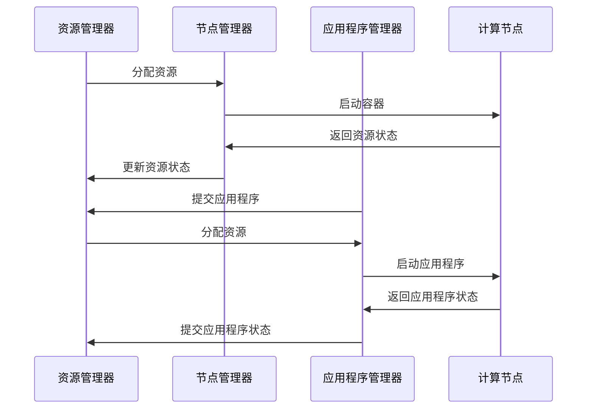

                 


# Yarn原理与代码实例讲解

> 关键词：Yarn,分布式计算，工作流管理，资源调度，Hadoop，Apache，代码实例

> 摘要：本文将深入探讨Yarn（Yet Another Resource Negotiator）的工作原理，从概念解析到实际代码实例，帮助读者全面理解Yarn在分布式计算环境中的作用及其实现机制。文章将涵盖Yarn的核心概念、架构、算法原理，并通过具体案例来展示Yarn在实际开发中的应用，旨在为读者提供一份全面且易于理解的技术指南。

## 1. 背景介绍

### 1.1 目的和范围

本文旨在介绍Yarn（Yet Another Resource Negotiator）的工作原理，并展示其如何在实际分布式计算环境中发挥作用。我们将逐步解释Yarn的核心概念，剖析其内部机制，并通过代码实例帮助读者深入理解Yarn的运作过程。

### 1.2 预期读者

本文面向有一定分布式计算和编程基础的技术人员，尤其是对Hadoop生态系统感兴趣的开发者。读者应具备以下背景知识：

- 基本的编程能力，熟悉Java或Scala编程语言。
- 对分布式系统和云计算有基本了解。
- 了解Hadoop和其核心组件，如MapReduce。

### 1.3 文档结构概述

本文将按照以下结构展开：

1. **核心概念与联系**：介绍Yarn的核心概念，并使用Mermaid流程图展示其架构。
2. **核心算法原理 & 具体操作步骤**：详细阐述Yarn的资源调度算法和操作流程，使用伪代码进行说明。
3. **数学模型和公式 & 详细讲解 & 举例说明**：解释Yarn中的数学模型和公式，并通过实例进行说明。
4. **项目实战：代码实际案例和详细解释说明**：通过一个完整的代码案例，展示Yarn的实际应用。
5. **实际应用场景**：讨论Yarn在不同场景下的应用。
6. **工具和资源推荐**：推荐学习资源、开发工具和相关论文。
7. **总结：未来发展趋势与挑战**：总结Yarn的发展趋势和面临的挑战。
8. **附录：常见问题与解答**：解答读者可能遇到的常见问题。
9. **扩展阅读 & 参考资料**：提供进一步阅读的参考资料。

### 1.4 术语表

#### 1.4.1 核心术语定义

- **Yarn**：Yet Another Resource Negotiator，是一个用于资源调度的框架，用于管理计算资源和应用程序之间的交互。
- **资源调度**：指在分布式系统中，将计算资源（如CPU、内存等）分配给不同的应用程序的过程。
- **应用程序**：在Yarn中，指运行在分布式系统中的任务或服务。
- **容器**：Yarn中的基本执行单元，封装了运行应用程序所需的资源。
- **资源管理器**：负责管理集群中所有节点的资源分配，是Yarn的中央调度器。
- **应用程序管理器**：负责管理应用程序的整个生命周期，从启动到终止。

#### 1.4.2 相关概念解释

- **分布式计算**：指在多个计算机之间分配任务和数据，协同完成计算任务。
- **Hadoop**：是一个开源的分布式计算框架，用于大规模数据集的存储和处理。
- **MapReduce**：是Hadoop的核心组件之一，用于处理大规模数据的分布式计算模型。

#### 1.4.3 缩略词列表

- **Yarn**：Yet Another Resource Negotiator
- **HDFS**：Hadoop Distributed File System
- **MapReduce**：Map and Reduce
- **Hadoop**：Hadoop

## 2. 核心概念与联系

在深入探讨Yarn的工作原理之前，我们首先需要了解一些核心概念和它们之间的联系。以下是一个Mermaid流程图，展示了Yarn的主要组件及其交互流程：



### 2.1 资源管理器（Resource Manager，RM）

资源管理器是Yarn的核心组件，负责整个集群的资源分配。它通过接收应用程序管理器的请求，将集群中的资源分配给不同的应用程序。资源管理器维护一个全局的资源视图，决定何时、如何以及向哪个节点分配资源。

### 2.2 节点管理器（Node Manager，NM）

节点管理器位于每个计算节点上，负责管理本地节点的资源分配和容器执行。节点管理器接收资源管理器的指令，启动和停止容器，并定期向资源管理器报告资源使用情况。

### 2.3 应用程序管理器（Application Master，AM）

应用程序管理器负责管理应用程序的整个生命周期。它向资源管理器提交应用程序请求，接收资源分配，然后启动和管理容器。应用程序管理器还负责监控应用程序的执行状态，并在必要时进行资源调整或应用程序终止。

### 2.4 计算节点（Compute Node，CN）

计算节点是Yarn中的工作节点，负责执行具体的计算任务。每个节点上运行一个节点管理器，并接收应用程序管理器的指令来启动和执行容器。

通过上述组件的协作，Yarn实现了对分布式系统中资源的高效调度和管理，为各种分布式应用程序提供了强大的支持。

## 3. 核心算法原理 & 具体操作步骤

### 3.1 资源调度算法

Yarn采用了一种基于拍卖的调度算法，称为Capacity Scheduler。该算法将集群资源划分为不同优先级的队列，每个队列可以拥有不同数量的资源份额。调度器会根据应用程序的优先级和可用资源情况，将资源分配给队列中的应用程序。

以下是 Capacity Scheduler 的基本调度流程：

```plaintext
1. 资源管理器（RM）接收应用程序管理器（AM）提交的应用程序请求。
2. RM 根据队列的优先级和资源份额，为应用程序分配资源。
3. RM 向节点管理器（NM）发送资源分配指令。
4. NM 在本地节点上启动容器，并将容器信息发送给 RM。
5. RM 更新应用程序的资源使用情况。
6. 当应用程序完成时，RM 释放资源并通知 NM。
```

### 3.2 具体操作步骤

下面是 Yarn 调度应用程序的基本操作步骤，使用伪代码进行说明：

```python
# 伪代码：资源调度操作步骤

def schedule_applications(applications):
    for app in applications:
        # 步骤 1：接收应用程序请求
        app_request = receive_app_request(app)

        # 步骤 2：根据队列优先级和资源份额进行资源分配
        resource_allocation = allocate_resources(app_request)

        # 步骤 3：向节点管理器发送资源分配指令
        send_resource_allocation_to_nms(resource_allocation)

        # 步骤 4：节点管理器启动容器
        start_containers_on_nms(resource_allocation)

        # 步骤 5：更新应用程序资源使用情况
        update_resource_usage(app, resource_allocation)

        # 步骤 6：应用程序完成时，释放资源
        when_application finishes:
            release_resources(app, resource_allocation)
```

### 3.3 容器启动与监控

容器是 Yarn 中的基本执行单元，每个容器封装了应用程序所需的资源（如CPU、内存等）。容器启动和监控的过程如下：

```plaintext
1. 节点管理器（NM）接收资源管理器（RM）的容器启动指令。
2. NM 启动容器，并初始化容器内的应用程序环境。
3. 容器启动后，NM 定期向 RM 报告容器状态。
4. RM 监控容器状态，并在必要时进行容器恢复或终止。
```

### 3.4 容器生命周期管理

容器的生命周期管理包括以下几个阶段：

- **启动阶段**：节点管理器接收启动指令并初始化容器。
- **运行阶段**：容器运行应用程序，并向节点管理器报告状态。
- **监控阶段**：资源管理器监控容器状态，确保其正常运行。
- **终止阶段**：容器完成执行后，节点管理器向资源管理器报告终止状态，并释放资源。

通过上述调度算法和具体操作步骤，Yarn 实现了对分布式计算资源的有效管理和调度，为各种应用程序提供了可靠的运行环境。

## 4. 数学模型和公式 & 详细讲解 & 举例说明

### 4.1 数学模型概述

Yarn 的资源调度算法中，核心的数学模型包括资源需求模型和资源分配模型。这些模型用于计算应用程序的资源和队列的优先级。

#### 4.1.1 资源需求模型

资源需求模型用于计算每个应用程序对集群资源的总需求。该模型的核心公式如下：

\[ R_{total} = \sum_{i=1}^{n} R_i \]

其中，\( R_{total} \) 表示总资源需求，\( R_i \) 表示第 \( i \) 个应用程序的资源需求。

#### 4.1.2 资源分配模型

资源分配模型用于计算每个应用程序应获得的资源份额。该模型的核心公式如下：

\[ R_{分配} = \frac{R_{total}}{n} \]

其中，\( R_{分配} \) 表示每个应用程序应获得的资源份额，\( n \) 表示应用程序的数量。

### 4.2 举例说明

假设一个集群中有3个应用程序，它们分别需要以下资源：

- 应用程序A：需要100个CPU核心
- 应用程序B：需要50个CPU核心
- 应用程序C：需要75个CPU核心

集群总共有200个CPU核心。

#### 4.2.1 计算总资源需求

\[ R_{total} = 100 + 50 + 75 = 225 \]

#### 4.2.2 计算每个应用程序的应得资源份额

\[ R_{分配} = \frac{225}{3} = 75 \]

#### 4.2.3 资源分配结果

- 应用程序A：应得75个CPU核心
- 应用程序B：应得75个CPU核心
- 应用程序C：应得75个CPU核心

如果实际集群资源只有200个CPU核心，那么我们需要根据实际情况进行适当的资源调整。例如，可以将应用程序A的资源需求降低，或者增加集群的总资源。

### 4.3 公式在调度算法中的应用

在 Yarn 的 Capacity Scheduler 中，上述公式被用于计算每个队列的优先级和资源份额。具体应用如下：

1. **计算总资源需求**：资源管理器（RM）首先计算集群中所有应用程序的总资源需求。
2. **计算每个队列的应得资源份额**：根据每个队列的优先级，计算每个队列应得的资源份额。
3. **分配资源**：资源管理器根据计算结果，将资源分配给不同的队列和应用程序。

通过上述数学模型和公式，Yarn 实现了对集群资源的高效调度和管理，确保了应用程序的公平性和系统的稳定性。

## 5. 项目实战：代码实际案例和详细解释说明

### 5.1 开发环境搭建

为了更好地理解Yarn的工作原理，我们将使用一个简单的Java应用程序来演示Yarn的基本使用。以下是开发环境搭建的步骤：

1. **安装Java开发环境**：确保已经安装了Java开发环境，版本建议为Java 8或更高。
2. **安装Maven**：Maven是一个项目构建和管理工具，用于构建和部署我们的Yarn应用程序。
3. **创建Maven项目**：使用以下命令创建一个Maven项目：

   ```shell
   mvn archetype:generate -DgroupId=com.example -DartifactId=yarn_example -DarchetypeArtifactId=maven-archetype-quickstart
   ```

4. **配置Maven依赖**：在项目的`pom.xml`文件中添加以下依赖：

   ```xml
   <dependencies>
       <dependency>
           <groupId>org.apache.hadoop</groupId>
           <artifactId>hadoop-client</artifactId>
           <version>3.2.1</version>
       </dependency>
   </dependencies>
   ```

5. **编写Yarn应用程序代码**：在项目的`src/main/java/com/example/yarn_example`目录下创建一个名为`YarnExampleApp.java`的文件，并编写以下代码：

   ```java
   import org.apache.hadoop.conf.Configuration;
   import org.apache.hadoop.fs.Path;
   import org.apache.hadoop.io.IntWritable;
   import org.apache.hadoop.io.Text;
   import org.apache.hadoop.mapreduce.Job;
   import org.apache.hadoop.mapreduce.Mapper;
   import org.apache.hadoop.mapreduce.Reducer;
   import org.apache.hadoop.mapreduce.lib.input.FileInputFormat;
   import org.apache.hadoop.mapreduce.lib.output.FileOutputFormat;

   public class YarnExampleApp {

       public static class TokenizerMapper
           extends Mapper<Object, Text, Text, IntWritable>{

           private final static IntWritable one = new IntWritable(1);
           private Text word = new Text();

           public void map(Object key, Text value, Context context
                           ) throws IOException, InterruptedException {
               String[] words = value.toString().split("\\s+");
               for (String word : words) {
                   this.word.set(word);
                   context.write(this.word, one);
               }
           }
       }

       public static class IntSumReducer
           extends Reducer<Text,IntWritable,Text,IntWritable> {
           private IntWritable result = new IntWritable();

           public void reduce(Text key, Iterable<IntWritable> values,
                              Context context
                              ) throws IOException, InterruptedException {
               int sum = 0;
               for (IntWritable val : values) {
                   sum += val.get();
               }
               result.set(sum);
               context.write(key, result);
           }
       }

       public static void main(String[] args) throws Exception {
           Configuration conf = new Configuration();
           Job job = Job.getInstance(conf, "word count");
           job.setMapperClass(TokenizerMapper.class);
           job.setCombinerClass(IntSumReducer.class);
           job.setReducerClass(IntSumReducer.class);
           job.setOutputKeyClass(Text.class);
           job.setOutputValueClass(IntWritable.class);
           FileInputFormat.addInputPath(job, new Path(args[0]));
           FileOutputFormat.setOutputPath(job, new Path(args[1]));
           System.exit(job.waitForCompletion(true) ? 0 : 1);
       }
   }
   ```

6. **构建和部署应用程序**：在命令行中进入项目目录，运行以下命令进行构建和部署：

   ```shell
   mvn clean package
   ```

   构建完成后，会在`target`目录下生成一个名为`yarn_example-1.0-SNAPSHOT.jar`的文件，这是我们的Yarn应用程序。

### 5.2 源代码详细实现和代码解读

在上面的代码中，我们实现了一个简单的词频统计应用程序，该应用程序接收一个文本文件作为输入，统计每个单词出现的次数，并将结果输出到一个文本文件中。

#### 5.2.1 Mapper类

`TokenizerMapper`类是Mapper的实现类，它负责读取输入数据，将文本拆分成单词，并将单词及其出现次数输出给Reducer。

```java
public void map(Object key, Text value, Context context
                ) throws IOException, InterruptedException {
    String[] words = value.toString().split("\\s+");
    for (String word : words) {
        this.word.set(word);
        context.write(this.word, one);
    }
}
```

在这个方法中，我们使用`split`函数将输入文本按照空格拆分成单词数组，然后遍历每个单词，将其作为键（`Text`类型）和值（`IntWritable`类型）写入上下文。

#### 5.2.2 Reducer类

`IntSumReducer`类是Reducer的实现类，它负责接收Mapper输出的中间结果，对每个单词的出现次数进行累加，并将最终结果输出。

```java
public void reduce(Text key, Iterable<IntWritable> values,
                   Context context
                   ) throws IOException, InterruptedException {
    int sum = 0;
    for (IntWritable val : values) {
        sum += val.get();
    }
    result.set(sum);
    context.write(key, result);
}
```

在这个方法中，我们遍历Mapper输出的值（`IntWritable`类型），将每个值累加到`sum`变量中，然后将累加结果作为键（`Text`类型）和值（`IntWritable`类型）写入上下文。

#### 5.2.3 主函数

主函数`main`负责配置Yarn应用程序，并提交给Yarn运行。

```java
public static void main(String[] args) throws Exception {
    Configuration conf = new Configuration();
    Job job = Job.getInstance(conf, "word count");
    job.setMapperClass(TokenizerMapper.class);
    job.setCombinerClass(IntSumReducer.class);
    job.setReducerClass(IntSumReducer.class);
    job.setOutputKeyClass(Text.class);
    job.setOutputValueClass(IntWritable.class);
    FileInputFormat.addInputPath(job, new Path(args[0]));
    FileOutputFormat.setOutputPath(job, new Path(args[1]));
    System.exit(job.waitForCompletion(true) ? 0 : 1);
}
```

在这个方法中，我们首先创建一个`Configuration`对象，用于配置Yarn应用程序。然后，我们创建一个`Job`对象，设置Mapper、Reducer的类，输出键和值的类型，以及输入和输出路径。最后，我们调用`waitForCompletion`方法提交应用程序给Yarn运行，并返回执行结果。

### 5.3 代码解读与分析

通过上述代码实现，我们可以看到Yarn应用程序的基本结构。以下是对代码的解读和分析：

1. **Mapper类**：负责读取输入数据，将文本拆分成单词，并将单词及其出现次数输出给Reducer。
2. **Reducer类**：负责接收Mapper输出的中间结果，对每个单词的出现次数进行累加，并将最终结果输出。
3. **主函数**：负责配置Yarn应用程序，并提交给Yarn运行。

在实际运行过程中，Yarn会根据配置信息，将应用程序分解成多个任务（Mapper和Reducer），并将这些任务分配到集群中的不同节点上执行。执行完成后，Yarn会将结果合并输出到指定路径。

通过这个简单的案例，我们可以看到Yarn如何处理分布式计算任务，并实现资源调度和管理。在实际项目中，Yarn可以处理更复杂的应用程序，并提供强大的分布式计算能力。

## 6. 实际应用场景

Yarn作为一种强大的分布式计算框架，在多个实际应用场景中得到了广泛应用。以下是一些典型的应用场景：

### 6.1 大数据批处理

Yarn是Hadoop生态系统中的核心组件，广泛用于大数据批处理任务。例如，企业可以将大量日志数据输入到Yarn应用程序中，进行实时数据分析和处理，从而实现数据洞察和决策支持。

### 6.2 机器学习和数据挖掘

Yarn可以轻松地管理大规模的机器学习和数据挖掘任务。例如，在训练大规模深度学习模型时，Yarn可以根据需要动态调整资源分配，确保模型训练的效率和准确性。

### 6.3 大规模数据处理

对于需要处理海量数据的应用程序，Yarn提供了高效的资源调度和管理能力。例如，在医疗领域，Yarn可以用于处理患者数据，进行疾病预测和个性化治疗。

### 6.4 云计算服务

随着云计算的普及，Yarn也成为了云计算服务提供商的核心工具。例如，AWS和Azure等云平台都提供了基于Yarn的分布式计算服务，帮助企业实现高效的数据处理和分析。

### 6.5 跨平台应用

Yarn不仅适用于Hadoop生态系统，还可以与其他分布式计算框架（如Spark、Flink等）集成。这使得Yarn成为一种跨平台的分布式计算工具，可以适应各种不同的计算需求。

通过上述应用场景，我们可以看到Yarn在分布式计算和大数据处理领域的重要性。Yarn的灵活性和高效性使其成为现代企业进行数据处理和计算的首选工具。

## 7. 工具和资源推荐

### 7.1 学习资源推荐

#### 7.1.1 书籍推荐

1. **《Hadoop: The Definitive Guide》**：这是一本关于Hadoop生态系统，包括Yarn的经典书籍，全面介绍了Yarn的工作原理和应用场景。
2. **《Spark: The Definitive Guide》**：虽然主要介绍Spark，但该书也涵盖了Yarn与Spark的集成和使用方法。

#### 7.1.2 在线课程

1. **Coursera上的《Hadoop and MapReduce》**：这是一门由University of California, San Diego提供的免费在线课程，详细介绍了Hadoop生态系统，包括Yarn的原理和应用。
2. **edX上的《Big Data with Apache Hadoop》**：由伊利诺伊大学香槟分校提供，深入讲解了Hadoop及其核心组件，包括Yarn的使用。

#### 7.1.3 技术博客和网站

1. **Apache Hadoop官方文档**：提供了最权威的Yarn文档，包括安装、配置和使用指南。
2. **Hadoop Weekly**：这是一个关注Hadoop及相关技术的邮件列表和网站，提供了大量有关Yarn的最新技术文章和教程。

### 7.2 开发工具框架推荐

#### 7.2.1 IDE和编辑器

1. **IntelliJ IDEA**：一款功能强大的IDE，支持Java、Scala等编程语言，适合开发Yarn应用程序。
2. **Eclipse**：一款经典的Java IDE，也支持Hadoop和Yarn开发。

#### 7.2.2 调试和性能分析工具

1. **Ganglia**：一个分布式系统监控工具，可以实时监控Yarn集群的性能。
2. **Grafana**：一个开源的监控和可视化工具，可以与Ganglia集成，提供Yarn集群的性能监控和可视化。

#### 7.2.3 相关框架和库

1. **Apache Spark**：一个快速、通用的大规模数据处理框架，与Yarn紧密结合，提供了丰富的分布式计算API。
2. **Apache Flink**：一个流处理和批处理一体化的分布式计算框架，也支持与Yarn集成。

### 7.3 相关论文著作推荐

#### 7.3.1 经典论文

1. **"Yet Another Resource Negotiator (YARN): Simplifying Datacenter Resource Management for Hadoop"**：这是Yarn的原始论文，详细介绍了Yarn的设计理念和工作原理。
2. **"MapReduce: Simplified Data Processing on Large Clusters"**：这是MapReduce的原始论文，对Yarn的设计有很大启发。

#### 7.3.2 最新研究成果

1. **"Efficient Resource Allocation in Hadoop YARN using Adaptive Sampling and Forecasting"**：这是一篇关于Yarn资源调度优化方法的研究论文，提供了实用的资源调度策略。
2. **"YARN on Kubernetes: Efficient Resource Management for Big Data Applications on Multi-Cloud Environments"**：这是一篇探讨如何在Kubernetes上部署Yarn的论文，适用于云环境中的大数据处理。

#### 7.3.3 应用案例分析

1. **"How LinkedIn Uses YARN for Scalable and Efficient Resource Management"**：这是一篇LinkedIn公司关于Yarn应用案例的论文，详细介绍了LinkedIn如何使用Yarn进行资源调度和管理，实现了大规模数据处理的高效性和可靠性。

通过上述工具和资源的推荐，读者可以更深入地学习Yarn，掌握其原理和应用，为实际项目提供有力支持。

## 8. 总结：未来发展趋势与挑战

Yarn作为分布式计算框架的核心组件，已经在大数据处理领域取得了显著成就。然而，随着技术的发展和需求的变化，Yarn也面临着一些未来发展趋势和挑战。

### 8.1 发展趋势

1. **云计算集成**：随着云计算的普及，Yarn与云平台的集成将成为未来趋势。通过将Yarn部署在云环境中，可以实现更灵活、高效的大数据计算。
2. **自动化与智能化**：未来，Yarn将更加注重自动化和智能化。通过引入人工智能和机器学习技术，Yarn可以自动调整资源分配策略，提高资源利用率。
3. **跨平台兼容**：随着分布式计算框架的多样化，Yarn需要提高与其他框架的兼容性。通过跨平台支持，Yarn可以适应更多的应用场景。
4. **开源生态**：Yarn将进一步扩展开源生态，与其他开源项目深度集成，提供更丰富的功能和更好的用户体验。

### 8.2 挑战

1. **资源调度优化**：在多租户环境中，如何高效地分配资源，确保应用程序的性能和稳定性，是Yarn需要解决的重要问题。
2. **安全性**：随着数据量的增加，Yarn需要提供更强大的安全性保障，确保数据的安全性和隐私性。
3. **性能瓶颈**：在处理大规模数据时，如何提高Yarn的性能，降低延迟，是未来的重要挑战。
4. **维护与升级**：如何简化Yarn的维护和升级过程，提高系统的可维护性，也是Yarn需要面对的问题。

通过持续的创新和优化，Yarn有望在未来继续发挥重要作用，成为分布式计算领域的关键工具。

## 9. 附录：常见问题与解答

### 9.1 问题1：什么是Yarn？

Yarn（Yet Another Resource Negotiator）是一个用于资源调度的框架，用于管理计算资源和应用程序之间的交互。它用于分配集群中的计算资源，使分布式应用程序能够在集群中高效运行。

### 9.2 问题2：Yarn与MapReduce有什么区别？

Yarn是Hadoop生态系统中的一个组件，用于取代旧的MapReduce资源调度框架。与MapReduce相比，Yarn提供了更灵活的资源调度和管理能力，使集群能够更好地支持多租户和异构计算。

### 9.3 问题3：如何安装和配置Yarn？

安装和配置Yarn通常涉及以下几个步骤：

1. **安装Java**：确保安装了Java环境，版本建议为Java 8或更高。
2. **安装Hadoop**：从Apache Hadoop官网下载并解压Hadoop源码包，通常使用版本3.2.x或更高。
3. **配置Hadoop环境**：编辑`hadoop-env.sh`、`yarn-env.sh`和`hdfs-site.xml`等配置文件，设置Hadoop环境变量和参数。
4. **启动Hadoop集群**：运行`start-dfs.sh`和`start-yarn.sh`命令启动Hadoop集群。

### 9.4 问题4：Yarn如何实现资源调度？

Yarn通过一个中心化的资源管理器（ResourceManager）和分布式的节点管理器（NodeManager）实现资源调度。资源管理器负责全局资源分配，节点管理器负责本地资源管理和容器调度。

### 9.5 问题5：如何监控Yarn集群？

可以使用以下工具监控Yarn集群：

1. **Ambari**：Apache Ambari是一个用于监控和管理Hadoop集群的工具，可以实时监控Yarn集群的运行状态。
2. **Ganglia**：Ganglia是一个开源的分布式系统监控工具，可以监控Yarn集群的性能指标。
3. **Grafana**：Grafana是一个开源的监控和可视化工具，可以与Ganglia集成，提供Yarn集群的性能监控和可视化。

## 10. 扩展阅读 & 参考资料

以下是一些扩展阅读和参考资料，帮助读者更深入地了解Yarn和相关技术：

1. **Apache Hadoop官方文档**：提供了最权威的Yarn文档，包括安装、配置和使用指南。（[https://hadoop.apache.org/docs/r3.2.1/hadoop-yarn/hadoop-yarn-site/](https://hadoop.apache.org/docs/r3.2.1/hadoop-yarn/hadoop-yarn-site/)）
2. **《Hadoop: The Definitive Guide》**：全面介绍了Hadoop生态系统，包括Yarn的工作原理和应用场景。（[https://www.hortonworks.com/trends/big-data-hadoop-book-second-edition/](https://www.hortonworks.com/trends/big-data-hadoop-book-second-edition/)）
3. **Coursera上的《Hadoop and MapReduce》**：由University of California, San Diego提供的免费在线课程，详细介绍了Hadoop生态系统，包括Yarn的原理和应用。（[https://www.coursera.org/learn/hadoop-mapreduce](https://www.coursera.org/learn/hadoop-mapreduce)）
4. **edX上的《Big Data with Apache Hadoop》**：由伊利诺伊大学香槟分校提供，深入讲解了Hadoop及其核心组件，包括Yarn的使用。（[https://www.edx.org/course/big-data-with-apache-hadoop](https://www.edx.org/course/big-data-with-apache-hadoop)）
5. **Apache Spark官方文档**：提供了关于Spark与Yarn集成的详细文档和教程。（[https://spark.apache.org/docs/latest/running-on-yarn.html](https://spark.apache.org/docs/latest/running-on-yarn.html)）
6. **Apache Flink官方文档**：介绍了Flink与Yarn的集成和使用方法。（[https://nightlies.apache.org/flink/flink-docs-stable/ops/deployment/yarn.html](https://nightlies.apache.org/flink/flink-docs-stable/ops/deployment/yarn.html)）

通过这些资料，读者可以更全面地了解Yarn及其应用，为自己的项目提供有力的技术支持。

