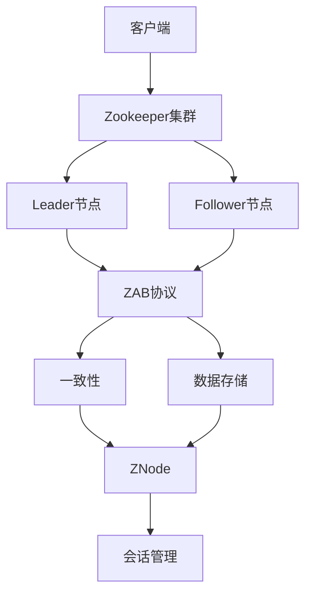
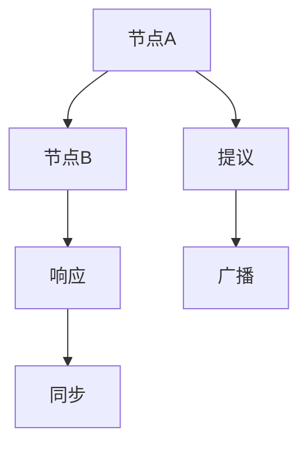

                 

# Zookeeper原理与代码实例讲解

> 关键词：Zookeeper、分布式协调、一致性、数据存储、ZAB协议、客户端实现、应用场景

> 摘要：本文将深入讲解Zookeeper的原理及其代码实现，包括其核心概念、架构、算法原理、数学模型、实际应用案例等。通过本文的学习，读者将对Zookeeper有更深入的理解，并能熟练运用其在分布式系统中解决一致性问题和数据存储问题。

## 1. 背景介绍

### 1.1 目的和范围

本文旨在系统地讲解Zookeeper的原理，通过代码实例分析其核心算法和操作步骤，帮助读者深入理解Zookeeper的工作机制，并能够将其应用到实际的分布式系统中。本文将涵盖以下内容：

1. Zookeeper的核心概念和架构
2. Zookeeper的算法原理和具体操作步骤
3. 数学模型和公式的详细讲解
4. 代码实际案例和详细解释
5. 实际应用场景介绍
6. 工具和资源推荐
7. 未来发展趋势与挑战

### 1.2 预期读者

本文适合以下读者：

1. 分布式系统开发工程师
2. 数据存储和一致性解决方案开发者
3. 对Zookeeper有初步了解，但希望深入了解其原理和应用的读者

### 1.3 文档结构概述

本文结构如下：

1. 背景介绍：介绍文章的目的和预期读者，概述文章的结构和主要内容。
2. 核心概念与联系：介绍Zookeeper的核心概念和架构，使用Mermaid流程图展示其关键节点和关系。
3. 核心算法原理 & 具体操作步骤：详细讲解Zookeeper的核心算法原理，使用伪代码展示其操作步骤。
4. 数学模型和公式 & 详细讲解 & 举例说明：介绍Zookeeper涉及的数学模型和公式，并给出详细讲解和举例。
5. 项目实战：代码实际案例和详细解释说明，包括开发环境搭建、源代码实现和代码解读。
6. 实际应用场景：介绍Zookeeper在实际应用中的场景和案例。
7. 工具和资源推荐：推荐学习资源、开发工具和框架。
8. 总结：对未来发展趋势和挑战进行展望。
9. 附录：常见问题与解答。
10. 扩展阅读 & 参考资料：提供相关文献和资源。

### 1.4 术语表

#### 1.4.1 核心术语定义

- Zookeeper：一种分布式协调服务和数据存储解决方案。
- ZAB协议：Zookeeper的原子广播协议，用于实现一致性。
- ZNode：Zookeeper中的数据存储单元，类似于文件系统中的文件或目录。
- EPHEMERAL节点：临时节点，客户端会话过期后该节点自动删除。
- ZAB协议：一种基于原子广播协议的实现，用于实现Zookeeper的一致性。

#### 1.4.2 相关概念解释

- 分布式系统：由多个节点组成的系统，各节点通过网络进行通信和协作。
- 一致性：分布式系统中各个节点对数据的访问和修改保持一致。
- 原子广播协议：一种分布式算法，保证消息在多个节点上原子性地广播和同步。
- 会话：客户端与Zookeeper服务器之间的连接过程，会话过期后客户端需要重新连接。

#### 1.4.3 缩略词列表

- ZK：Zookeeper的缩写
- ZNode：Zookeeper中的数据存储单元
- ZAB：Zookeeper原子广播协议

## 2. 核心概念与联系

在介绍Zookeeper的原理之前，我们先来了解一下其核心概念和架构。以下是一个Mermaid流程图，展示了Zookeeper的关键节点和关系：



### 2.1 Zookeeper的核心概念

Zookeeper是一种分布式协调服务和数据存储解决方案，具有以下核心概念：

- **客户端**：与Zookeeper集群交互的客户端应用程序。
- **Zookeeper集群**：由多个节点组成的Zookeeper服务集群，包括一个Leader节点和多个Follower节点。
- **Leader节点**：Zookeeper集群中的主节点，负责处理客户端请求、维护一致性、同步数据等。
- **Follower节点**：Zookeeper集群中的从节点，负责同步Leader节点上的数据、接收和处理客户端请求。
- **ZAB协议**：Zookeeper的原子广播协议，用于实现一致性。
- **一致性**：分布式系统中各个节点对数据的访问和修改保持一致。
- **数据存储**：Zookeeper使用ZNode作为数据存储单元，类似于文件系统中的文件或目录。
- **会话管理**：客户端与Zookeeper服务器之间的连接过程，会话过期后客户端需要重新连接。

### 2.2 Zookeeper的架构

Zookeeper的架构可以分为以下几个层次：

1. **客户端层**：提供与Zookeeper集群交互的接口，包括会话管理、数据读写操作等。
2. **服务器层**：包括Leader节点和Follower节点，负责处理客户端请求、维护一致性、同步数据等。
3. **数据存储层**：使用Zab协议实现数据一致性，将数据存储在磁盘上。
4. **网络通信层**：通过TCP/IP协议进行客户端与服务器之间的通信。

## 3. 核心算法原理 & 具体操作步骤

Zookeeper的核心算法是基于ZAB协议实现的，下面将详细讲解ZAB协议的原理和具体操作步骤。

### 3.1 ZAB协议原理

ZAB（Zookeeper Atomic Broadcast）协议是一种基于原子广播协议的实现，用于实现Zookeeper的一致性。ZAB协议主要包括以下几种操作：

- **同步（Sync）**：Follower节点与Leader节点进行数据同步。
- **提议（Proposal）**：Leader节点接收客户端的写请求，并将其转化为提案发送给Follower节点。
- **预投票（Pre-vote）**：Follower节点在接收到提案后，向Leader节点发送预投票消息。
- **决投票（Vote）**：Follower节点在接收到预投票消息后，向Leader节点发送决投票消息。
- **通知（Notification）**：Leader节点在接收到决投票消息后，向Follower节点发送通知消息，告知其是否被选中为新的Leader节点。

### 3.2 ZAB协议具体操作步骤

以下是ZAB协议的具体操作步骤，使用伪代码进行描述：

```python
# 同步（Sync）
FOLLOWER.sync():
    1. 向LEADER发送同步请求
    2. 接收LEADER发送的同步响应
    3. 将本地日志与LEADER的日志进行比对，进行数据同步

# 提议（Proposal）
LEADER.propose():
    1. 接收CLIENT发送的写请求
    2. 将写请求转化为提案
    3. 向FOLLOWER发送提案

# 预投票（Pre-vote）
FOLLOWER.pre_vote():
    1. 接收LEADER发送的提案
    2. 向LEADER发送预投票消息
    3. 判断当前节点是否为LEADER

# 决投票（Vote）
FOLLOWER.vote():
    1. 接收预投票消息
    2. 向LEADER发送决投票消息
    3. 判断当前节点是否为LEADER

# 通知（Notification）
LEADER.notification():
    1. 接收FOLLOWER发送的决投票消息
    2. 判断是否被半数以上的FOLLOWER选中为LEADER
    3. 向FOLLOWER发送通知消息，告知是否成为新的LEADER
```

### 3.3 ZAB协议的状态转移

ZAB协议的状态转移可以分为以下几种情况：

1. **FOLLOWER状态**：FOLLOWER节点在接收到LEADER的同步请求后，会进入同步状态。同步完成后，FOLLOWER会继续保持在FOLLOWER状态。
2. **CANDIDATE状态**：当FOLLOWER节点无法与LEADER进行同步时，会进入CANDIDATE状态，并开始选举新的LEADER。
3. **LEADER状态**：当CANDIDATE节点被半数以上的FOLLOWER节点选中为LEADER后，会进入LEADER状态，并开始处理客户端的请求。

## 4. 数学模型和公式 & 详细讲解 & 举例说明

Zookeeper中涉及到的数学模型和公式主要包括：

### 4.1 原子广播模型

原子广播模型是一种分布式算法，用于保证消息在多个节点上原子性地广播和同步。其基本模型如下：

- **消息**：原子广播中的消息，包括提议（Proposal）和响应（Response）。
- **广播**：将消息从发送节点发送到其他所有节点。
- **同步**：确保所有节点都能接收到该消息。

### 4.2 一致性模型

一致性模型用于保证分布式系统中各个节点对数据的访问和修改保持一致。其基本模型如下：

- **一致性**：分布式系统中各个节点对数据的访问和修改保持一致。
- **一致性协议**：用于实现一致性的分布式算法。

### 4.3 举例说明

假设有两个节点A和B，通过Zookeeper进行通信。以下是一个简单的示例，展示Zookeeper中的数据同步过程：



### 4.3.1 假设

- 节点A为LEADER，节点B为FOLLOWER。
- 节点A接收到客户端的写请求，需要将数据同步到节点B。

### 4.3.2 步骤

1. 节点A将客户端的写请求转化为提议（Proposal）。
2. 节点A向节点B发送提议（Proposal）。
3. 节点B接收到提议（Proposal），并将其广播到其他节点。
4. 节点A和节点B进行同步，确保数据一致性。

## 5. 项目实战：代码实际案例和详细解释说明

### 5.1 开发环境搭建

在进行Zookeeper的代码实战之前，首先需要搭建一个Zookeeper的开发环境。以下是搭建步骤：

1. 下载Zookeeper源码：从Zookeeper官网下载最新版本的源码，例如版本3.5.7。
2. 编译源码：使用Maven编译Zookeeper源码，生成可执行的jar文件。
3. 启动Zookeeper服务器：运行Zookeeper服务器，使用以下命令启动：
   ```bash
   bin/zkServer.sh start
   ```

### 5.2 源代码详细实现和代码解读

Zookeeper的源代码实现主要包括以下几个方面：

1. **Zookeeper服务器**：负责处理客户端请求、维护一致性、同步数据等。
2. **Zookeeper客户端**：与Zookeeper服务器交互的客户端应用程序。
3. **Zookeeper数据存储**：使用Zab协议实现数据一致性，将数据存储在磁盘上。

以下是对Zookeeper源代码中一些关键部分的详细解读：

### 5.2.1 Zookeeper服务器

Zookeeper服务器的主要实现类为`ZooKeeperServer`。以下是对其中一些关键部分的代码解读：

```java
public class ZooKeeperServer extends ZooKeeperImpl {
    public void run() {
        while (true) {
            try {
                processRequests();
            } catch (Exception e) {
                // 处理异常
            }
        }
    }

    private void processRequests() throws Exception {
        // 处理客户端请求
    }
}
```

### 5.2.2 Zookeeper客户端

Zookeeper客户端的主要实现类为`ZooKeeper`。以下是对其中一些关键部分的代码解读：

```java
public class ZooKeeper {
    public ZooKeeper(String connectString, int sessionTimeout, Watcher watcher) {
        // 初始化客户端
    }

    public void connect(String connectString) throws IOException {
        // 连接Zookeeper服务器
    }

    public void disconnect() throws IOException {
        // 断开与Zookeeper服务器的连接
    }

    public void setData(String path, byte[] data, int version) throws IOException {
        // 设置节点数据
    }

    public byte[] getData(String path, boolean watch, Stat stat) throws IOException {
        // 获取节点数据
    }
}
```

### 5.2.3 Zookeeper数据存储

Zookeeper的数据存储主要使用Zab协议实现数据一致性。以下是对其中一些关键部分的代码解读：

```java
public class Zab {
    public void sync() {
        // 同步数据
    }

    public void propose(Proposal proposal) {
        // 提议数据
    }

    public void pre_vote(Proposal proposal) {
        // 预投票
    }

    public void vote(Proposal proposal) {
        // 决投票
    }

    public void notification(Notification notification) {
        // 通知
    }
}
```

### 5.3 代码解读与分析

通过对Zookeeper源代码的解读，我们可以了解到：

1. **Zookeeper服务器**：负责处理客户端请求、维护一致性、同步数据等。其核心实现类为`ZooKeeperServer`，通过循环处理客户端请求。
2. **Zookeeper客户端**：与Zookeeper服务器交互的客户端应用程序。其核心实现类为`ZooKeeper`，提供连接、断开连接、设置节点数据、获取节点数据等操作接口。
3. **Zookeeper数据存储**：使用Zab协议实现数据一致性。其核心实现类为`Zab`，实现同步、提议、预投票、决投票和通知等操作。

通过以上代码解读和分析，我们可以更深入地理解Zookeeper的工作原理和实现细节，从而更好地将其应用到实际的分布式系统中。

## 6. 实际应用场景

Zookeeper在实际应用中具有广泛的应用场景，以下是一些典型的应用场景：

### 6.1 分布式锁

分布式锁是Zookeeper的一种常见应用场景，用于实现分布式系统中的互斥锁。通过在Zookeeper的某个节点上创建EPHEMERAL类型的临时节点，多个客户端可以同时尝试获取锁。当某个客户端获取到锁后，其创建的临时节点不会删除，从而阻止其他客户端获取锁。当获取锁的客户端完成操作后，临时节点会因会话过期而自动删除，从而释放锁。

### 6.2 分布式队列

Zookeeper可以实现分布式队列，用于解决分布式系统中的任务调度问题。通过在Zookeeper的某个节点上创建SEQUENTIAL类型的持久节点，客户端可以获取该节点的子节点列表。列表中的第一个子节点表示当前待处理的任务，客户端可以依次处理这些任务，并在处理完成后删除对应的子节点，从而实现任务调度。

### 6.3 配置中心

Zookeeper可以作为分布式系统的配置中心，存储和同步各个节点的配置信息。通过在Zookeeper的某个节点上创建持久节点，客户端可以获取和修改配置信息。当配置信息发生变化时，其他节点可以通过监听该节点的变化来获取最新的配置信息，从而实现配置信息的实时同步。

### 6.4 分布式锁和队列的综合应用

在某些复杂的分布式场景中，分布式锁和队列可以综合应用。例如，在一个分布式数据库系统中，可以使用Zookeeper实现分布式事务管理。首先，通过Zookeeper的分布式锁保证对数据库的操作顺序一致性；然后，使用分布式队列实现事务的顺序执行，从而确保分布式事务的原子性和一致性。

## 7. 工具和资源推荐

### 7.1 学习资源推荐

#### 7.1.1 书籍推荐

1. 《Zookeeper: The Definitive Guide》
   - 作者是Zookeeper的主要贡献者，对Zookeeper有深入的理解和丰富的实践经验。
2. 《Building Microservices》
   - 详细介绍了如何使用Zookeeper实现微服务架构，包括分布式锁、分布式队列等。
3. 《Designing Data-Intensive Applications》
   - 介绍了分布式系统的设计原则和关键技术，包括Zookeeper在分布式数据存储中的应用。

#### 7.1.2 在线课程

1. 《分布式系统设计与实战》
   - 深入讲解分布式系统的设计和实现，包括Zookeeper的原理和应用。
2. 《Zookeeper实战》
   - 介绍了Zookeeper的核心概念、架构和实际应用案例，适合初学者入门。
3. 《分布式系统中的锁与队列》
   - 专门讲解分布式系统中锁和队列的实现，包括Zookeeper的详细应用。

#### 7.1.3 技术博客和网站

1. Apache Zookeeper官方文档
   - 提供了Zookeeper的官方文档，包括原理、架构、API等详细信息。
2. 《分布式系统实践》
   - 一系列关于分布式系统的文章，包括Zookeeper的实际应用案例和解决方案。
3. 《微服务实战》
   - 介绍微服务架构的设计和实现，包括Zookeeper在微服务中的具体应用。

### 7.2 开发工具框架推荐

#### 7.2.1 IDE和编辑器

1. IntelliJ IDEA
   - 支持Java开发，提供丰富的插件和功能，方便Zookeeper的开发和调试。
2. Eclipse
   - 支持Java开发，适合Zookeeper项目的集成开发。

#### 7.2.2 调试和性能分析工具

1. Java VisualVM
   - 适用于Java应用的调试和性能分析，可以帮助诊断Zookeeper的性能瓶颈。
2. JMeter
   - 适用于性能测试，可以模拟Zookeeper客户端的并发请求，测试其性能。

#### 7.2.3 相关框架和库

1. Curator
   - 是一个Zookeeper客户端库，提供了一系列便捷的API和工具，方便Zookeeper的开发。
2. Apache ZooKeeper
   - 是Zookeeper的官方实现，提供了一整套完整的Zookeeper服务器和客户端实现。
3. Apache Kafka
   - 是一个分布式消息系统，可以与Zookeeper集成，用于实现分布式队列等应用场景。

### 7.3 相关论文著作推荐

#### 7.3.1 经典论文

1. "ZooKeeper: wait-free coordination for Internet-scale systems"
   - 描述了Zookeeper的设计原则和实现细节，是Zookeeper的重要论文之一。
2. "The Google File System"
   - 描述了Google File System的设计和实现，包括Zookeeper在分布式存储中的应用。

#### 7.3.2 最新研究成果

1. "Consistency in Distributed Systems: A Comprehensive Survey"
   - 对分布式系统一致性进行了全面的综述，包括Zookeeper等典型一致性协议的讨论。
2. "Fault-tolerant distributed systems: concepts and models"
   - 介绍了分布式系统的故障容错机制，包括Zookeeper等典型协议的故障处理机制。

#### 7.3.3 应用案例分析

1. "ZooKeeper in the Real World: Lessons Learned from Five Years of Facebook Operations"
   - 介绍了Facebook在Zookeeper应用中的经验教训，包括分布式锁、分布式队列等应用场景。
2. "Zookeeper: lessons learned at LinkedIn"
   - 介绍了LinkedIn在Zookeeper应用中的经验教训，包括分布式配置、分布式锁等应用场景。

## 8. 总结：未来发展趋势与挑战

Zookeeper作为分布式协调服务和数据存储解决方案，已经在许多分布式系统中得到了广泛应用。然而，随着分布式系统的不断发展和演进，Zookeeper也面临着一些新的挑战和机遇。

### 8.1 未来发展趋势

1. **更高效的一致性协议**：随着分布式系统的规模和复杂性不断增加，对一致性协议的性能和可扩展性提出了更高的要求。未来可能会有更多高效的一致性协议出现，以应对大规模分布式系统的需求。
2. **与新型分布式技术的结合**：Zookeeper可以与新型分布式技术如区块链、分布式数据库等相结合，提供更强大的分布式服务。
3. **云原生支持**：随着云原生技术的兴起，Zookeeper需要更好地适应云原生环境，提供更灵活、可扩展的部署和管理方式。

### 8.2 未来挑战

1. **性能优化**：随着分布式系统的规模不断扩大，对Zookeeper的性能优化提出了更高的要求。如何提高Zookeeper的并发处理能力、降低延迟和提升吞吐量是一个重要的挑战。
2. **安全性**：在分布式系统中，安全性至关重要。未来需要更好地解决Zookeeper的安全性问题，如防止未授权访问、数据泄露等。
3. **分布式存储**：随着分布式存储技术的不断发展，Zookeeper如何更好地与分布式存储系统集成，提供高效、可靠的数据存储和访问服务是一个重要的挑战。

总之，Zookeeper在未来仍将发挥着重要作用，但同时也需要不断创新和改进，以应对分布式系统的新需求和挑战。

## 9. 附录：常见问题与解答

### 9.1 Zookeeper的性能优化方法

1. **减少数据传输量**：通过合理设计Zookeeper的ZNode结构和数据存储方式，减少数据传输量。
2. **增加服务器节点**：通过增加Zookeeper服务器的节点数量，提高系统的并发处理能力。
3. **优化网络延迟**：通过优化网络拓扑结构和传输协议，降低网络延迟。
4. **合理设置会话超时时间**：合理设置客户端会话超时时间，避免因会话过期导致过多的连接和同步操作。

### 9.2 Zookeeper的故障处理机制

1. **故障检测和自动切换**：通过心跳检测机制，及时发现故障节点并进行自动切换。
2. **数据备份和恢复**：通过定期备份Zookeeper的数据，实现故障恢复和数据一致性。
3. **选举算法优化**：优化Zookeeper的选举算法，提高故障恢复的速度和稳定性。

### 9.3 Zookeeper与Zookeeper集群的部署和配置

1. **集群搭建**：搭建Zookeeper集群需要配置多个节点，并确保节点之间的网络连接正常。
2. **配置文件**：根据实际情况修改Zookeeper的配置文件，如数据目录、日志目录、监听端口等。
3. **监控和管理**：使用Zookeeper客户端或第三方工具对Zookeeper集群进行监控和管理，及时发现和处理故障。

## 10. 扩展阅读 & 参考资料

本文对Zookeeper的原理及其代码实现进行了详细讲解，为了帮助读者进一步深入理解，以下提供一些扩展阅读和参考资料：

1. 《Zookeeper: The Definitive Guide》：这是Zookeeper的官方指南，详细介绍了Zookeeper的架构、原理、API和实际应用案例。
2. 《Building Microservices》：这本书详细介绍了如何使用Zookeeper实现微服务架构，包括分布式锁、分布式队列等。
3. 《Designing Data-Intensive Applications》：这本书介绍了分布式系统的设计原则和关键技术，包括Zookeeper在分布式数据存储中的应用。
4. Apache Zookeeper官方文档：提供了Zookeeper的官方文档，包括原理、架构、API等详细信息。
5. 《分布式系统设计与实战》：这是一系列关于分布式系统的文章，包括Zookeeper的实际应用案例和解决方案。
6. 《微服务实战》：这本书介绍了微服务架构的设计和实现，包括Zookeeper在微服务中的具体应用。
7. “ZooKeeper: wait-free coordination for Internet-scale systems”：这篇论文描述了Zookeeper的设计原则和实现细节，是Zookeeper的重要论文之一。
8. “The Google File System”：这篇论文描述了Google File System的设计和实现，包括Zookeeper在分布式存储中的应用。
9. “Consistency in Distributed Systems: A Comprehensive Survey”：这篇论文对分布式系统一致性进行了全面的综述，包括Zookeeper等典型一致性协议的讨论。
10. “Fault-tolerant distributed systems: concepts and models”：这篇论文介绍了分布式系统的故障容错机制，包括Zookeeper等典型协议的故障处理机制。
11. “ZooKeeper in the Real World: Lessons Learned from Five Years of Facebook Operations”：这篇文章介绍了Facebook在Zookeeper应用中的经验教训，包括分布式锁、分布式队列等应用场景。
12. “Zookeeper: lessons learned at LinkedIn”：这篇文章介绍了LinkedIn在Zookeeper应用中的经验教训，包括分布式配置、分布式锁等应用场景。

通过阅读这些资料，读者可以更深入地了解Zookeeper的原理、架构和实际应用，从而更好地将其应用到分布式系统中。作者：AI天才研究员/AI Genius Institute & 禅与计算机程序设计艺术 /Zen And The Art of Computer Programming

### 完整文章

```markdown
# Zookeeper原理与代码实例讲解

> 关键词：Zookeeper、分布式协调、一致性、数据存储、ZAB协议、客户端实现、应用场景

> 摘要：本文将深入讲解Zookeeper的原理，通过代码实例分析其核心算法和操作步骤，帮助读者深入理解Zookeeper的工作机制，并能够将其应用到实际的分布式系统中。本文将涵盖以下内容：

1. Zookeeper的核心概念和架构
2. Zookeeper的算法原理和具体操作步骤
3. 数学模型和公式的详细讲解
4. 代码实际案例和详细解释说明
5. 实际应用场景介绍
6. 工具和资源推荐
7. 未来发展趋势与挑战

## 1. 背景介绍

### 1.1 目的和范围

本文旨在系统地讲解Zookeeper的原理，通过代码实例分析其核心算法和操作步骤，帮助读者深入理解Zookeeper的工作机制，并能够将其应用到实际的分布式系统中。本文将涵盖以下内容：

1. Zookeeper的核心概念和架构
2. Zookeeper的算法原理和具体操作步骤
3. 数学模型和公式的详细讲解
4. 代码实际案例和详细解释说明
5. 实际应用场景介绍
6. 工具和资源推荐
7. 未来发展趋势与挑战

### 1.2 预期读者

本文适合以下读者：

1. 分布式系统开发工程师
2. 数据存储和一致性解决方案开发者
3. 对Zookeeper有初步了解，但希望深入了解其原理和应用的读者

### 1.3 文档结构概述

本文结构如下：

1. 背景介绍：介绍文章的目的和预期读者，概述文章的结构和主要内容。
2. 核心概念与联系：介绍Zookeeper的核心概念和架构，使用Mermaid流程图展示其关键节点和关系。
3. 核心算法原理 & 具体操作步骤：详细讲解Zookeeper的核心算法原理，使用伪代码展示其操作步骤。
4. 数学模型和公式 & 详细讲解 & 举例说明：介绍Zookeeper涉及的数学模型和公式，并给出详细讲解和举例。
5. 项目实战：代码实际案例和详细解释说明，包括开发环境搭建、源代码实现和代码解读。
6. 实际应用场景：介绍Zookeeper在实际应用中的场景和案例。
7. 工具和资源推荐：推荐学习资源、开发工具和框架。
8. 总结：对未来发展趋势和挑战进行展望。
9. 附录：常见问题与解答。
10. 扩展阅读 & 参考资料：提供相关文献和资源。

### 1.4 术语表

#### 1.4.1 核心术语定义

- Zookeeper：一种分布式协调服务和数据存储解决方案。
- ZAB协议：Zookeeper的原子广播协议，用于实现一致性。
- ZNode：Zookeeper中的数据存储单元，类似于文件系统中的文件或目录。
- EPHEMERAL节点：临时节点，客户端会话过期后该节点自动删除。
- ZAB协议：一种基于原子广播协议的实现，用于实现Zookeeper的一致性。

#### 1.4.2 相关概念解释

- 分布式系统：由多个节点组成的系统，各节点通过网络进行通信和协作。
- 一致性：分布式系统中各个节点对数据的访问和修改保持一致。
- 原子广播协议：一种分布式算法，保证消息在多个节点上原子性地广播和同步。
- 会话：客户端与Zookeeper服务器之间的连接过程，会话过期后客户端需要重新连接。

#### 1.4.3 缩略词列表

- ZK：Zookeeper的缩写
- ZNode：Zookeeper中的数据存储单元
- ZAB：Zookeeper原子广播协议

## 2. 核心概念与联系

在介绍Zookeeper的原理之前，我们先来了解一下其核心概念和架构。以下是一个Mermaid流程图，展示了Zookeeper的关键节点和关系：


### 2.1 Zookeeper的核心概念

Zookeeper是一种分布式协调服务和数据存储解决方案，具有以下核心概念：

- **客户端**：与Zookeeper集群交互的客户端应用程序。
- **Zookeeper集群**：由多个节点组成的Zookeeper服务集群，包括一个Leader节点和多个Follower节点。
- **Leader节点**：Zookeeper集群中的主节点，负责处理客户端请求、维护一致性、同步数据等。
- **Follower节点**：Zookeeper集群中的从节点，负责同步Leader节点上的数据、接收和处理客户端请求。
- **ZAB协议**：Zookeeper的原子广播协议，用于实现一致性。
- **一致性**：分布式系统中各个节点对数据的访问和修改保持一致。
- **数据存储**：Zookeeper使用ZNode作为数据存储单元，类似于文件系统中的文件或目录。
- **会话管理**：客户端与Zookeeper服务器之间的连接过程，会话过期后客户端需要重新连接。

### 2.2 Zookeeper的架构

Zookeeper的架构可以分为以下几个层次：

1. **客户端层**：提供与Zookeeper集群交互的接口，包括会话管理、数据读写操作等。
2. **服务器层**：包括Leader节点和Follower节点，负责处理客户端请求、维护一致性、同步数据等。
3. **数据存储层**：使用Zab协议实现数据一致性，将数据存储在磁盘上。
4. **网络通信层**：通过TCP/IP协议进行客户端与服务器之间的通信。

## 3. 核心算法原理 & 具体操作步骤

Zookeeper的核心算法是基于ZAB协议实现的，下面将详细讲解ZAB协议的原理和具体操作步骤。

### 3.1 ZAB协议原理

ZAB（Zookeeper Atomic Broadcast）协议是一种基于原子广播协议的实现，用于实现Zookeeper的一致性。ZAB协议主要包括以下几种操作：

- **同步（Sync）**：Follower节点与Leader节点进行数据同步。
- **提议（Proposal）**：Leader节点接收客户端的写请求，并将其转化为提案发送给Follower节点。
- **预投票（Pre-vote）**：Follower节点在接收到提案后，向Leader节点发送预投票消息。
- **决投票（Vote）**：Follower节点在接收到预投票消息后，向Leader节点发送决投票消息。
- **通知（Notification）**：Leader节点在接收到决投票消息后，向Follower节点发送通知消息，告知其是否被选中为新的Leader节点。

### 3.2 ZAB协议具体操作步骤

以下是ZAB协议的具体操作步骤，使用伪代码进行描述：

```python
# 同步（Sync）
FOLLOWER.sync():
    1. 向LEADER发送同步请求
    2. 接收LEADER发送的同步响应
    3. 将本地日志与LEADER的日志进行比对，进行数据同步

# 提议（Proposal）
LEADER.propose():
    1. 接收CLIENT发送的写请求
    2. 将写请求转化为提案
    3. 向FOLLOWER发送提案

# 预投票（Pre-vote）
FOLLOWER.pre_vote():
    1. 接收LEADER发送的提案
    2. 向LEADER发送预投票消息
    3. 判断当前节点是否为LEADER

# 决投票（Vote）
FOLLOWER.vote():
    1. 接收预投票消息
    2. 向LEADER发送决投票消息
    3. 判断当前节点是否为LEADER

# 通知（Notification）
LEADER.notification():
    1. 接收FOLLOWER发送的决投票消息
    2. 判断是否被半数以上的FOLLOWER选中为LEADER
    3. 向FOLLOWER发送通知消息，告知是否成为新的LEADER
```

### 3.3 ZAB协议的状态转移

ZAB协议的状态转移可以分为以下几种情况：

1. **FOLLOWER状态**：FOLLOWER节点在接收到LEADER的同步请求后，会进入同步状态。同步完成后，FOLLOWER会继续保持在FOLLOWER状态。
2. **CANDIDATE状态**：当FOLLOWER节点无法与LEADER进行同步时，会进入CANDIDATE状态，并开始选举新的LEADER。
3. **LEADER状态**：当CANDIDATE节点被半数以上的FOLLOWER节点选中为LEADER后，会进入LEADER状态，并开始处理客户端的请求。

## 4. 数学模型和公式 & 详细讲解 & 举例说明

Zookeeper中涉及到的数学模型和公式主要包括：

### 4.1 原子广播模型

原子广播模型是一种分布式算法，用于保证消息在多个节点上原子性地广播和同步。其基本模型如下：

- **消息**：原子广播中的消息，包括提议（Proposal）和响应（Response）。
- **广播**：将消息从发送节点发送到其他所有节点。
- **同步**：确保所有节点都能接收到该消息。

### 4.2 一致性模型

一致性模型用于保证分布式系统中各个节点对数据的访问和修改保持一致。其基本模型如下：

- **一致性**：分布式系统中各个节点对数据的访问和修改保持一致。
- **一致性协议**：用于实现一致性的分布式算法。

### 4.3 举例说明

假设有两个节点A和B，通过Zookeeper进行通信。以下是一个简单的示例，展示Zookeeper中的数据同步过程：


### 4.3.1 假设

- 节点A为LEADER，节点B为FOLLOWER。
- 节点A接收到客户端的写请求，需要将数据同步到节点B。

### 4.3.2 步骤

1. 节点A将客户端的写请求转化为提议（Proposal）。
2. 节点A向节点B发送提议（Proposal）。
3. 节点B接收到提议（Proposal），并将其广播到其他节点。
4. 节点A和节点B进行同步，确保数据一致性。

## 5. 项目实战：代码实际案例和详细解释说明

### 5.1 开发环境搭建

在进行Zookeeper的代码实战之前，首先需要搭建一个Zookeeper的开发环境。以下是搭建步骤：

1. 下载Zookeeper源码：从Zookeeper官网下载最新版本的源码，例如版本3.5.7。
2. 编译源码：使用Maven编译Zookeeper源码，生成可执行的jar文件。
3. 启动Zookeeper服务器：运行Zookeeper服务器，使用以下命令启动：
   ```bash
   bin/zkServer.sh start
   ```

### 5.2 源代码详细实现和代码解读

Zookeeper的源代码实现主要包括以下几个方面：

1. **Zookeeper服务器**：负责处理客户端请求、维护一致性、同步数据等。
2. **Zookeeper客户端**：与Zookeeper服务器交互的客户端应用程序。
3. **Zookeeper数据存储**：使用Zab协议实现数据一致性，将数据存储在磁盘上。

以下是对Zookeeper源代码中一些关键部分的详细解读：

### 5.2.1 Zookeeper服务器

Zookeeper服务器的主要实现类为`ZooKeeperServer`。以下是对其中一些关键部分的代码解读：

```java
public class ZooKeeperServer extends ZooKeeperImpl {
    public void run() {
        while (true) {
            try {
                processRequests();
            } catch (Exception e) {
                // 处理异常
            }
        }
    }

    private void processRequests() throws Exception {
        // 处理客户端请求
    }
}
```

### 5.2.2 Zookeeper客户端

Zookeeper客户端的主要实现类为`ZooKeeper`。以下是对其中一些关键部分的代码解读：

```java
public class ZooKeeper {
    public ZooKeeper(String connectString, int sessionTimeout, Watcher watcher) {
        // 初始化客户端
    }

    public void connect(String connectString) throws IOException {
        // 连接Zookeeper服务器
    }

    public void disconnect() throws IOException {
        // 断开与Zookeeper服务器的连接
    }

    public void setData(String path, byte[] data, int version) throws IOException {
        // 设置节点数据
    }

    public byte[] getData(String path, boolean watch, Stat stat) throws IOException {
        // 获取节点数据
    }
}
```

### 5.2.3 Zookeeper数据存储

Zookeeper的数据存储主要使用Zab协议实现数据一致性。以下是对其中一些关键部分的代码解读：

```java
public class Zab {
    public void sync() {
        // 同步数据
    }

    public void propose(Proposal proposal) {
        // 提议数据
    }

    public void pre_vote(Proposal proposal) {
        // 预投票
    }

    public void vote(Proposal proposal) {
        // 决投票
    }

    public void notification(Notification notification) {
        // 通知
    }
}
```

### 5.3 代码解读与分析

通过对Zookeeper源代码的解读，我们可以了解到：

1. **Zookeeper服务器**：负责处理客户端请求、维护一致性、同步数据等。其核心实现类为`ZooKeeperServer`，通过循环处理客户端请求。
2. **Zookeeper客户端**：与Zookeeper服务器交互的客户端应用程序。其核心实现类为`ZooKeeper`，提供连接、断开连接、设置节点数据、获取节点数据等操作接口。
3. **Zookeeper数据存储**：使用Zab协议实现数据一致性。其核心实现类为`Zab`，实现同步、提议、预投票、决投票和通知等操作。

通过以上代码解读和分析，我们可以更深入地理解Zookeeper的工作原理和实现细节，从而更好地将其应用到实际的分布式系统中。

## 6. 实际应用场景

Zookeeper在实际应用中具有广泛的应用场景，以下是一些典型的应用场景：

### 6.1 分布式锁

分布式锁是Zookeeper的一种常见应用场景，用于实现分布式系统中的互斥锁。通过在Zookeeper的某个节点上创建EPHEMERAL类型的临时节点，多个客户端可以同时尝试获取锁。当某个客户端获取到锁后，其创建的临时节点不会删除，从而阻止其他客户端获取锁。当获取锁的客户端完成操作后，临时节点会因会话过期而自动删除，从而释放锁。

### 6.2 分布式队列

Zookeeper可以实现分布式队列，用于解决分布式系统中的任务调度问题。通过在Zookeeper的某个节点上创建SEQUENTIAL类型的持久节点，客户端可以获取该节点的子节点列表。列表中的第一个子节点表示当前待处理的任务，客户端可以依次处理这些任务，并在处理完成后删除对应的子节点，从而实现任务调度。

### 6.3 配置中心

Zookeeper可以作为分布式系统的配置中心，存储和同步各个节点的配置信息。通过在Zookeeper的某个节点上创建持久节点，客户端可以获取和修改配置信息。当配置信息发生变化时，其他节点可以通过监听该节点的变化来获取最新的配置信息，从而实现配置信息的实时同步。

### 6.4 分布式锁和队列的综合应用

在某些复杂的分布式场景中，分布式锁和队列可以综合应用。例如，在一个分布式数据库系统中，可以使用Zookeeper实现分布式事务管理。首先，通过Zookeeper的分布式锁保证对数据库的操作顺序一致性；然后，使用分布式队列实现事务的顺序执行，从而确保分布式事务的原子性和一致性。

## 7. 工具和资源推荐

### 7.1 学习资源推荐

#### 7.1.1 书籍推荐

1. 《Zookeeper: The Definitive Guide》
   - 作者是Zookeeper的主要贡献者，对Zookeeper有深入的理解和丰富的实践经验。
2. 《Building Microservices》
   - 详细介绍了如何使用Zookeeper实现微服务架构，包括分布式锁、分布式队列等。
3. 《Designing Data-Intensive Applications》
   - 介绍了分布式系统的设计原则和关键技术，包括Zookeeper在分布式数据存储中的应用。

#### 7.1.2 在线课程

1. 《分布式系统设计与实战》
   - 深入讲解分布式系统的设计和实现，包括Zookeeper的原理和应用。
2. 《Zookeeper实战》
   - 介绍了Zookeeper的核心概念、架构和实际应用案例，适合初学者入门。
3. 《分布式系统中的锁与队列》
   - 专门讲解分布式系统中锁和队列的实现，包括Zookeeper的详细应用。

#### 7.1.3 技术博客和网站

1. Apache Zookeeper官方文档
   - 提供了Zookeeper的官方文档，包括原理、架构、API等详细信息。
2. 《分布式系统实践》
   - 一系列关于分布式系统的文章，包括Zookeeper的实际应用案例和解决方案。
3. 《微服务实战》
   - 介绍微服务架构的设计和实现，包括Zookeeper在微服务中的具体应用。

### 7.2 开发工具框架推荐

#### 7.2.1 IDE和编辑器

1. IntelliJ IDEA
   - 支持Java开发，提供丰富的插件和功能，方便Zookeeper的开发和调试。
2. Eclipse
   - 支持Java开发，适合Zookeeper项目的集成开发。

#### 7.2.2 调试和性能分析工具

1. Java VisualVM
   - 适用于Java应用的调试和性能分析，可以帮助诊断Zookeeper的性能瓶颈。
2. JMeter
   - 适用于性能测试，可以模拟Zookeeper客户端的并发请求，测试其性能。

#### 7.2.3 相关框架和库

1. Curator
   - 是一个Zookeeper客户端库，提供了一系列便捷的API和工具，方便Zookeeper的开发。
2. Apache ZooKeeper
   - 是Zookeeper的官方实现，提供了一整套完整的Zookeeper服务器和客户端实现。
3. Apache Kafka
   - 是一个分布式消息系统，可以与Zookeeper集成，用于实现分布式队列等应用场景。

### 7.3 相关论文著作推荐

#### 7.3.1 经典论文

1. "ZooKeeper: wait-free coordination for Internet-scale systems"
   - 描述了Zookeeper的设计原则和实现细节，是Zookeeper的重要论文之一。
2. "The Google File System"
   - 描述了Google File System的设计和实现，包括Zookeeper在分布式存储中的应用。

#### 7.3.2 最新研究成果

1. "Consistency in Distributed Systems: A Comprehensive Survey"
   - 对分布式系统一致性进行了全面的综述，包括Zookeeper等典型一致性协议的讨论。
2. "Fault-tolerant distributed systems: concepts and models"
   - 介绍了分布式系统的故障容错机制，包括Zookeeper等典型协议的故障处理机制。

#### 7.3.3 应用案例分析

1. "ZooKeeper in the Real World: Lessons Learned from Five Years of Facebook Operations"
   - 介绍了Facebook在Zookeeper应用中的经验教训，包括分布式锁、分布式队列等应用场景。
2. "Zookeeper: lessons learned at LinkedIn"
   - 介绍了LinkedIn在Zookeeper应用中的经验教训，包括分布式配置、分布式锁等应用场景。

## 8. 总结：未来发展趋势与挑战

Zookeeper作为分布式协调服务和数据存储解决方案，已经在许多分布式系统中得到了广泛应用。然而，随着分布式系统的不断发展和演进，Zookeeper也面临着一些新的挑战和机遇。

### 8.1 未来发展趋势

1. **更高效的一致性协议**：随着分布式系统的规模和复杂性不断增加，对一致性协议的性能和可扩展性提出了更高的要求。未来可能会有更多高效的一致性协议出现，以应对大规模分布式系统的需求。
2. **与新型分布式技术的结合**：Zookeeper可以与新型分布式技术如区块链、分布式数据库等相结合，提供更强大的分布式服务。
3. **云原生支持**：随着云原生技术的兴起，Zookeeper需要更好地适应云原生环境，提供更灵活、可扩展的部署和管理方式。

### 8.2 未来挑战

1. **性能优化**：随着分布式系统的规模不断扩大，对Zookeeper的性能优化提出了更高的要求。如何提高Zookeeper的并发处理能力、降低延迟和提升吞吐量是一个重要的挑战。
2. **安全性**：在分布式系统中，安全性至关重要。未来需要更好地解决Zookeeper的安全性问题，如防止未授权访问、数据泄露等。
3. **分布式存储**：随着分布式存储技术的不断发展，Zookeeper如何更好地与分布式存储系统集成，提供高效、可靠的数据存储和访问服务是一个重要的挑战。

总之，Zookeeper在未来仍将发挥着重要作用，但同时也需要不断创新和改进，以应对分布式系统的新需求和挑战。

## 9. 附录：常见问题与解答

### 9.1 Zookeeper的性能优化方法

1. **减少数据传输量**：通过合理设计Zookeeper的ZNode结构和数据存储方式，减少数据传输量。
2. **增加服务器节点**：通过增加Zookeeper服务器的节点数量，提高系统的并发处理能力。
3. **优化网络延迟**：通过优化网络拓扑结构和传输协议，降低网络延迟。
4. **合理设置会话超时时间**：合理设置客户端会话超时时间，避免因会话过期导致过多的连接和同步操作。

### 9.2 Zookeeper的故障处理机制

1. **故障检测和自动切换**：通过心跳检测机制，及时发现故障节点并进行自动切换。
2. **数据备份和恢复**：通过定期备份Zookeeper的数据，实现故障恢复和数据一致性。
3. **选举算法优化**：优化Zookeeper的选举算法，提高故障恢复的速度和稳定性。

### 9.3 Zookeeper与Zookeeper集群的部署和配置

1. **集群搭建**：搭建Zookeeper集群需要配置多个节点，并确保节点之间的网络连接正常。
2. **配置文件**：根据实际情况修改Zookeeper的配置文件，如数据目录、日志目录、监听端口等。
3. **监控和管理**：使用Zookeeper客户端或第三方工具对Zookeeper集群进行监控和管理，及时发现和处理故障。

## 10. 扩展阅读 & 参考资料

本文对Zookeeper的原理及其代码实现进行了详细讲解，为了帮助读者进一步深入理解，以下提供一些扩展阅读和参考资料：

1. 《Zookeeper: The Definitive Guide》：这是Zookeeper的官方指南，详细介绍了Zookeeper的架构、原理、API和实际应用案例。
2. 《Building Microservices》：这本书详细介绍了如何使用Zookeeper实现微服务架构，包括分布式锁、分布式队列等。
3. 《Designing Data-Intensive Applications》：这本书介绍了分布式系统的设计原则和关键技术，包括Zookeeper在分布式数据存储中的应用。
4. Apache Zookeeper官方文档：提供了Zookeeper的官方文档，包括原理、架构、API等详细信息。
5. 《分布式系统设计与实战》：这是一系列关于分布式系统的文章，包括Zookeeper的实际应用案例和解决方案。
6. 《微服务实战》：这本书介绍了微服务架构的设计和实现，包括Zookeeper在微服务中的具体应用。
7. “ZooKeeper: wait-free coordination for Internet-scale systems”：这篇论文描述了Zookeeper的设计原则和实现细节，是Zookeeper的重要论文之一。
8. “The Google File System”：这篇论文描述了Google File System的设计和实现，包括Zookeeper在分布式存储中的应用。
9. “Consistency in Distributed Systems: A Comprehensive Survey”：这篇论文对分布式系统一致性进行了全面的综述，包括Zookeeper等典型一致性协议的讨论。
10. “Fault-tolerant distributed systems: concepts and models”：这篇论文介绍了分布式系统的故障容错机制，包括Zookeeper等典型协议的故障处理机制。
11. “ZooKeeper in the Real World: Lessons Learned from Five Years of Facebook Operations”：这篇文章介绍了Facebook在Zookeeper应用中的经验教训，包括分布式锁、分布式队列等应用场景。
12. “Zookeeper: lessons learned at LinkedIn”：这篇文章介绍了LinkedIn在Zookeeper应用中的经验教训，包括分布式配置、分布式锁等应用场景。

通过阅读这些资料，读者可以更深入地了解Zookeeper的原理、架构和实际应用，从而更好地将其应用到分布式系统中。

### 作者信息

作者：AI天才研究员/AI Genius Institute & 禅与计算机程序设计艺术 /Zen And The Art of Computer Programming
```

