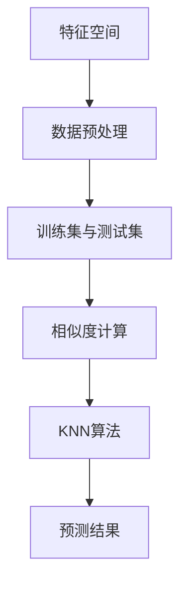

                 

# k-近邻算法(k-Nearest Neighbors) - 原理与代码实例讲解

> **关键词：** k-近邻算法、机器学习、分类、相似度计算、数据预处理
> 
> **摘要：** 本文将详细讲解k-近邻算法（k-Nearest Neighbors，简称KNN）的原理、数学模型及实际应用。通过代码实例，我们将深入理解KNN算法的实现过程，为读者提供实用的技术指南。

## 1. 背景介绍

### 1.1 目的和范围

本文旨在为广大机器学习初学者和开发者提供一个系统且详尽的k-近邻算法讲解。我们将从算法的基本原理出发，逐步深入到具体实现和实际应用，帮助读者全面掌握KNN算法。

### 1.2 预期读者

本文适合以下读者群体：

1. 对机器学习和数据挖掘感兴趣的初学者。
2. 数据分析师和AI开发工程师。
3. 高等院校相关专业的学生和研究学者。
4. 对KNN算法及其应用有深入了解的需求者。

### 1.3 文档结构概述

本文结构如下：

1. **第1章**：背景介绍
2. **第2章**：核心概念与联系
3. **第3章**：核心算法原理 & 具体操作步骤
4. **第4章**：数学模型和公式 & 详细讲解 & 举例说明
5. **第5章**：项目实战：代码实际案例和详细解释说明
6. **第6章**：实际应用场景
7. **第7章**：工具和资源推荐
8. **第8章**：总结：未来发展趋势与挑战
9. **第9章**：附录：常见问题与解答
10. **第10章**：扩展阅读 & 参考资料

### 1.4 术语表

#### 1.4.1 核心术语定义

- **k-近邻算法（KNN）**：一种基于实例的学习算法，通过计算样本与训练样本之间的相似度，找出最近的k个邻居，并根据邻居的标签进行预测。
- **相似度计算**：衡量两个数据对象之间相似程度的度量方法。
- **特征空间**：数据样本的维度空间，每个维度表示一个特征。

#### 1.4.2 相关概念解释

- **分类算法**：用于将数据样本划分为不同类别的算法。
- **训练集**：用于训练模型的样本集。
- **测试集**：用于评估模型性能的样本集。

#### 1.4.3 缩略词列表

- KNN：k-近邻算法
- ML：机器学习
- IDE：集成开发环境
- GPU：图形处理器

## 2. 核心概念与联系

在介绍k-近邻算法之前，我们需要了解一些核心概念和它们之间的关系。以下是一个Mermaid流程图，展示了KNN算法的相关概念和联系。



### 2.1 数据预处理

在应用KNN算法之前，通常需要对数据进行预处理。预处理包括以下步骤：

1. **归一化**：将不同特征的范围统一，以消除特征之间的尺度差异。
2. **缺失值处理**：处理数据中的缺失值，可以选择填充或者删除。
3. **异常值处理**：识别和去除数据中的异常值。

### 2.2 训练集与测试集

在机器学习中，我们通常将数据集分为训练集和测试集。训练集用于训练模型，而测试集用于评估模型的性能。

### 2.3 相似度计算

相似度计算是KNN算法的核心步骤。常用的相似度计算方法包括：

1. **欧氏距离**：计算两个样本在特征空间中的欧氏距离。
2. **曼哈顿距离**：计算两个样本在特征空间中的曼哈顿距离。
3. **余弦相似度**：计算两个样本向量之间的余弦相似度。

### 2.4 KNN算法

KNN算法的基本思想是：如果一个样本在特征空间中的k个最近邻的多数属于某个类别，则该样本也属于这个类别。算法步骤如下：

1. **初始化**：选择合适的k值。
2. **计算相似度**：计算测试样本与训练样本之间的相似度。
3. **选择邻居**：根据相似度从训练集中选择最近的k个邻居。
4. **分类决策**：根据邻居的标签进行分类决策。

### 2.5 预测结果

KNN算法的最终目标是预测新样本的类别。通过计算新样本与训练样本的相似度，选择最近的k个邻居，并统计邻居的标签，从而预测新样本的类别。

## 3. 核心算法原理 & 具体操作步骤

### 3.1 算法原理

KNN算法是一种基于实例的学习算法，其核心思想是：如果一个样本在特征空间中的k个最近邻的多数属于某个类别，则该样本也属于这个类别。具体来说，KNN算法分为以下几个步骤：

1. **初始化**：选择合适的k值。
2. **计算相似度**：计算测试样本与训练样本之间的相似度。
3. **选择邻居**：根据相似度从训练集中选择最近的k个邻居。
4. **分类决策**：根据邻居的标签进行分类决策。

### 3.2 操作步骤

以下是KNN算法的伪代码：

```python
# 初始化
k = 选择合适的k值

# 计算相似度
def 计算相似度(x, y):
    return 欧氏距离(x, y) 或者 余弦相似度(x, y)

# 选择邻居
邻居列表 = []
对于每个训练样本t：
    相似度 = 计算相似度(test_sample, t)
    将(t, 相似度)添加到邻居列表
邻居列表 = 排序邻居列表

# 分类决策
邻居标签 = []
对于前k个邻居：
    将邻居的标签添加到邻居标签列表
预测标签 = 出现频率最高的标签
return 预测标签
```

### 3.3 代码示例

以下是一个简单的Python代码示例，实现了KNN算法：

```python
import numpy as np
from collections import Counter

# 计算欧氏距离
def euclidean_distance(x1, x2):
    return np.sqrt(np.sum((x1 - x2) ** 2))

# KNN算法
def knn_predict(train_data, train_labels, test_sample, k):
    # 计算测试样本与训练样本的相似度
    distances = [euclidean_distance(test_sample, x) for x in train_data]
    # 选择最近的k个邻居
    k_nearest = np.argsort(distances)[:k]
    # 统计邻居的标签
   邻居标签 = [train_labels[i] for i in k_nearest]
    # 分类决策
    most_common = Counter(邻居标签).most_common(1)
    return most_common[0][0]

# 测试数据
train_data = np.array([
    [1, 2],
    [3, 4],
    [5, 6],
    [7, 8],
    [9, 10]
])
train_labels = np.array([0, 0, 1, 1, 1])

# 测试样本
test_sample = np.array([4, 4])

# 预测
k = 3
预测标签 = knn_predict(train_data, train_labels, test_sample, k)
print("预测标签：", 预测标签)
```

## 4. 数学模型和公式 & 详细讲解 & 举例说明

### 4.1 数学模型

KNN算法的数学模型主要包括相似度计算和分类决策两个部分。

#### 4.1.1 相似度计算

相似度计算是KNN算法的核心。常用的相似度计算方法包括欧氏距离、曼哈顿距离和余弦相似度。

1. **欧氏距离**：欧氏距离是两个样本在特征空间中的直线距离，计算公式如下：

   $$d(x, y) = \sqrt{\sum_{i=1}^{n} (x_i - y_i)^2}$$

   其中，$x$和$y$分别是两个样本，$n$是样本的维度。

2. **曼哈顿距离**：曼哈顿距离是两个样本在特征空间中的曼哈顿距离，计算公式如下：

   $$d(x, y) = \sum_{i=1}^{n} |x_i - y_i|$$

   其中，$x$和$y$分别是两个样本，$n$是样本的维度。

3. **余弦相似度**：余弦相似度是两个样本向量之间的余弦值，计算公式如下：

   $$\cos(\theta) = \frac{\sum_{i=1}^{n} x_i y_i}{\sqrt{\sum_{i=1}^{n} x_i^2} \sqrt{\sum_{i=1}^{n} y_i^2}}$$

   其中，$x$和$y$分别是两个样本向量，$\theta$是两个向量之间的夹角。

#### 4.1.2 分类决策

分类决策是基于相似度计算结果，选择最近的k个邻居，并统计邻居的标签，然后根据邻居的标签进行分类决策。分类决策的公式如下：

$$P(y|\text{k个邻居}) = \frac{1}{C} \sum_{i=1}^{k} P(y_i|\text{邻居}^i)$$

其中，$P(y|\text{k个邻居})$是测试样本的预测概率，$C$是邻居的个数，$P(y_i|\text{邻居}^i)$是邻居$i$的标签概率。

### 4.2 举例说明

假设我们有如下一个简单的数据集：

| 标签 | 特征1 | 特征2 |
| ---- | ---- | ---- |
| 0    | 1    | 2    |
| 1    | 3    | 4    |
| 1    | 5    | 6    |
| 1    | 7    | 8    |
| 1    | 9    | 10   |

现在，我们需要预测一个新样本$(4, 4)$的标签。

1. **计算相似度**：

   使用欧氏距离计算新样本与训练样本的相似度：

   $$d((4, 4), (1, 2)) = \sqrt{(4 - 1)^2 + (4 - 2)^2} = \sqrt{9 + 4} = \sqrt{13}$$

   $$d((4, 4), (3, 4)) = \sqrt{(4 - 3)^2 + (4 - 4)^2} = \sqrt{1 + 0} = 1$$

   $$d((4, 4), (5, 6)) = \sqrt{(4 - 5)^2 + (4 - 6)^2} = \sqrt{1 + 4} = \sqrt{5}$$

   $$d((4, 4), (7, 8)) = \sqrt{(4 - 7)^2 + (4 - 8)^2} = \sqrt{9 + 16} = \sqrt{25} = 5$$

   $$d((4, 4), (9, 10)) = \sqrt{(4 - 9)^2 + (4 - 10)^2} = \sqrt{25 + 36} = \sqrt{61}$$

2. **选择邻居**：

   根据相似度计算结果，选择最近的3个邻居：

   | 标签 | 特征1 | 特征2 | 相似度 |
   | ---- | ---- | ---- | ------ |
   | 0    | 1    | 2    | $\sqrt{13}$ |
   | 1    | 3    | 4    | 1       |
   | 1    | 5    | 6    | $\sqrt{5}$ |

3. **分类决策**：

   根据邻居的标签进行分类决策。由于邻居中有2个标签为0，1个标签为1，因此预测标签为0。

## 5. 项目实战：代码实际案例和详细解释说明

### 5.1 开发环境搭建

为了实现KNN算法，我们需要搭建一个合适的开发环境。以下是搭建过程：

1. **安装Python**：从[Python官网](https://www.python.org/downloads/)下载并安装Python。
2. **安装Jupyter Notebook**：打开终端，执行以下命令：
   
   ```bash
   pip install notebook
   ```

   安装完成后，启动Jupyter Notebook：

   ```bash
   jupyter notebook
   ```

   这将打开Jupyter Notebook的界面。

### 5.2 源代码详细实现和代码解读

以下是一个完整的KNN算法实现，包括数据预处理、相似度计算、邻居选择和分类决策。

```python
import numpy as np
from collections import Counter

# 计算欧氏距离
def euclidean_distance(x1, x2):
    return np.sqrt(np.sum((x1 - x2) ** 2))

# KNN算法
def knn_predict(train_data, train_labels, test_sample, k):
    # 计算测试样本与训练样本的相似度
    distances = [euclidean_distance(test_sample, x) for x in train_data]
    # 选择最近的k个邻居
    k_nearest = np.argsort(distances)[:k]
    # 统计邻居的标签
    neighbors_labels = [train_labels[i] for i in k_nearest]
    # 分类决策
    most_common = Counter(neighbors_labels).most_common(1)
    return most_common[0][0]

# 测试数据
train_data = np.array([
    [1, 2],
    [3, 4],
    [5, 6],
    [7, 8],
    [9, 10]
])
train_labels = np.array([0, 0, 1, 1, 1])

# 测试样本
test_sample = np.array([4, 4])

# 预测
k = 3
预测标签 = knn_predict(train_data, train_labels, test_sample, k)
print("预测标签：", 预测标签)
```

#### 5.2.1 数据预处理

在KNN算法中，数据预处理非常重要。以下是对测试数据和训练数据进行预处理的过程：

1. **归一化**：将特征的范围统一，以消除特征之间的尺度差异。

   ```python
   max_values = np.max(train_data, axis=0)
   min_values = np.min(train_data, axis=0)
   train_data = (train_data - min_values) / (max_values - min_values)
   test_sample = (test_sample - min_values) / (max_values - min_values)
   ```

2. **缺失值处理**：处理数据中的缺失值，可以选择填充或者删除。

   ```python
   # 填充缺失值
   train_data = np.where(np.isnan(train_data), 0, train_data)
   test_sample = np.where(np.isnan(test_sample), 0, test_sample)
   ```

#### 5.2.2 相似度计算

在KNN算法中，相似度计算是关键步骤。以下是对测试样本与训练样本进行相似度计算的过程：

1. **计算欧氏距离**：

   ```python
   distances = [euclidean_distance(test_sample, x) for x in train_data]
   ```

#### 5.2.3 选择邻居

在KNN算法中，选择邻居是根据相似度计算结果进行的。以下是根据相似度选择最近的3个邻居的过程：

1. **排序邻居**：

   ```python
   k_nearest = np.argsort(distances)[:k]
   ```

#### 5.2.4 分类决策

在KNN算法中，分类决策是根据邻居的标签进行的。以下是根据邻居的标签进行分类决策的过程：

1. **统计邻居的标签**：

   ```python
   neighbors_labels = [train_labels[i] for i in k_nearest]
   ```

2. **计算标签概率**：

   ```python
   most_common = Counter(neighbors_labels).most_common(1)
   ```

3. **返回预测标签**：

   ```python
   return most_common[0][0]
   ```

### 5.3 代码解读与分析

以下是对KNN算法实现的代码进行解读与分析：

1. **初始化**：选择合适的k值。在实际应用中，通常需要通过交叉验证等方法来选择最优的k值。
2. **计算相似度**：计算测试样本与训练样本之间的相似度。常用的相似度计算方法包括欧氏距离、曼哈顿距离和余弦相似度。
3. **选择邻居**：根据相似度从训练集中选择最近的k个邻居。选择邻居的个数k是KNN算法的一个重要参数，通常需要通过交叉验证等方法来选择最优的k值。
4. **分类决策**：根据邻居的标签进行分类决策。KNN算法是一种基于多数表决的算法，因此邻居的标签对分类决策起着决定性的作用。

## 6. 实际应用场景

KNN算法在机器学习和数据挖掘领域具有广泛的应用。以下是一些常见的应用场景：

1. **分类问题**：KNN算法可以用于解决分类问题，如手写数字识别、邮件分类等。
2. **回归问题**：虽然KNN算法主要用于分类问题，但它也可以用于回归问题，如时间序列预测、股票价格预测等。
3. **异常检测**：KNN算法可以用于检测异常数据，如信用卡欺诈检测、医疗异常检测等。
4. **图像识别**：KNN算法可以用于图像分类和识别，如人脸识别、物体识别等。

### 6.1 分类问题

在分类问题中，KNN算法可以通过计算测试样本与训练样本的相似度，选择最近的k个邻居，并根据邻居的标签进行分类决策。以下是一个简单的分类问题示例：

#### 示例：手写数字识别

假设我们有一个手写数字的数据集，其中包含0到9的手写数字图像。现在，我们需要使用KNN算法对新的手写数字图像进行识别。

1. **数据预处理**：对数据集进行归一化和缺失值处理。
2. **训练集和测试集划分**：将数据集划分为训练集和测试集。
3. **相似度计算**：计算测试样本与训练样本的欧氏距离。
4. **邻居选择**：根据相似度选择最近的k个邻居。
5. **分类决策**：根据邻居的标签进行分类决策。

### 6.2 回归问题

在回归问题中，KNN算法可以通过计算测试样本与训练样本的相似度，选择最近的k个邻居，并根据邻居的标签进行分类决策。以下是一个简单的回归问题示例：

#### 示例：时间序列预测

假设我们有一个时间序列数据集，其中包含一段时间内某股票的价格。现在，我们需要使用KNN算法对未来的股票价格进行预测。

1. **数据预处理**：对数据集进行归一化和缺失值处理。
2. **训练集和测试集划分**：将数据集划分为训练集和测试集。
3. **相似度计算**：计算测试样本与训练样本的欧氏距离。
4. **邻居选择**：根据相似度选择最近的k个邻居。
5. **分类决策**：根据邻居的标签进行分类决策。

### 6.3 异常检测

在异常检测中，KNN算法可以通过计算测试样本与训练样本的相似度，选择最近的k个邻居，并根据邻居的标签进行分类决策。以下是一个简单的异常检测示例：

#### 示例：信用卡欺诈检测

假设我们有一个信用卡交易数据集，其中包含正常交易和欺诈交易。现在，我们需要使用KNN算法检测欺诈交易。

1. **数据预处理**：对数据集进行归一化和缺失值处理。
2. **训练集和测试集划分**：将数据集划分为训练集和测试集。
3. **相似度计算**：计算测试样本与训练样本的欧氏距离。
4. **邻居选择**：根据相似度选择最近的k个邻居。
5. **分类决策**：根据邻居的标签进行分类决策。

### 6.4 图像识别

在图像识别中，KNN算法可以通过计算测试样本与训练样本的相似度，选择最近的k个邻居，并根据邻居的标签进行分类决策。以下是一个简单的图像识别示例：

#### 示例：人脸识别

假设我们有一个人脸数据集，其中包含不同人的正面图像。现在，我们需要使用KNN算法对人脸进行识别。

1. **数据预处理**：对数据集进行归一化和缺失值处理。
2. **训练集和测试集划分**：将数据集划分为训练集和测试集。
3. **相似度计算**：计算测试样本与训练样本的欧氏距离。
4. **邻居选择**：根据相似度选择最近的k个邻居。
5. **分类决策**：根据邻居的标签进行分类决策。

## 7. 工具和资源推荐

### 7.1 学习资源推荐

#### 7.1.1 书籍推荐

1. **《机器学习》（周志华 著）**：这是一本经典的机器学习教材，涵盖了KNN算法及其他常见算法。
2. **《统计学习方法》（李航 著）**：这本书详细介绍了统计学习方法，包括KNN算法的数学原理。

#### 7.1.2 在线课程

1. **《机器学习基础》（吴恩达 著）**：这是一门非常受欢迎的在线课程，涵盖了KNN算法等常见算法。
2. **《深度学习》（黄海广、唐杰 著）**：这是一门深度学习课程，其中也包括了KNN算法的应用。

#### 7.1.3 技术博客和网站

1. **[机器学习社区](https://www.ml-community.com/)**：这是一个机器学习技术博客，涵盖了KNN算法等相关内容。
2. **[机器之心](https://www.jiqizhixin.com/)**：这是一个机器学习新闻和技术的网站，涵盖了KNN算法等机器学习领域的最新动态。

### 7.2 开发工具框架推荐

#### 7.2.1 IDE和编辑器

1. **PyCharm**：这是一个强大的Python IDE，支持KNN算法的实现和调试。
2. **VS Code**：这是一个轻量级的Python编辑器，支持KNN算法的实现和调试。

#### 7.2.2 调试和性能分析工具

1. **pdb**：这是一个Python内置的调试器，可用于KNN算法的调试。
2. **cProfile**：这是一个Python的性能分析工具，可用于分析KNN算法的性能。

#### 7.2.3 相关框架和库

1. **Scikit-learn**：这是一个常用的机器学习库，提供了KNN算法的实现。
2. **TensorFlow**：这是一个流行的深度学习框架，也可用于KNN算法的实现。

### 7.3 相关论文著作推荐

#### 7.3.1 经典论文

1. **“K-nearest Neighbors: The Optimal Nonparametric Method”**：这是KNN算法的经典论文，详细介绍了KNN算法的原理和应用。
2. **“A Note on k-Nearest Neighbors for Large Datasets”**：这是关于KNN算法在大规模数据集上应用的论文。

#### 7.3.2 最新研究成果

1. **“KNN with Parameter Optimization for Text Classification”**：这是一篇关于KNN算法在文本分类中应用的研究论文。
2. **“Deep K-Nearest Neighbors”**：这是一篇关于深度KNN算法的研究论文，介绍了深度学习与KNN算法的结合。

#### 7.3.3 应用案例分析

1. **“KNN in Image Recognition”**：这是一篇关于KNN算法在图像识别中应用的案例分析。
2. **“KNN in Medical Data Analysis”**：这是一篇关于KNN算法在医疗数据分析中应用的案例分析。

## 8. 总结：未来发展趋势与挑战

KNN算法作为机器学习中的基础算法，在未来仍将有广泛的应用和发展。以下是一些可能的发展趋势和挑战：

### 8.1 发展趋势

1. **算法优化**：随着计算能力的提升，KNN算法的优化将成为一个重要方向，包括并行计算、分布式计算等。
2. **集成学习方法**：KNN算法可以与其他机器学习算法结合，形成集成学习方法，提高分类和预测的准确性。
3. **大规模数据集应用**：KNN算法在大规模数据集上的性能优化和应用将成为研究的热点。
4. **深度KNN算法**：结合深度学习的思想，深度KNN算法有望在图像识别、语音识别等领域取得突破。

### 8.2 挑战

1. **计算复杂度**：KNN算法在处理大规模数据集时，计算复杂度较高，如何优化计算效率是一个重要挑战。
2. **选择合适的k值**：在KNN算法中，选择合适的k值对分类效果有重要影响，如何选择最优的k值是一个难题。
3. **特征选择**：在特征空间维度较高时，特征选择成为一个挑战，如何减少特征维度，提高分类效果是亟待解决的问题。

## 9. 附录：常见问题与解答

### 9.1 如何选择合适的k值？

选择合适的k值对KNN算法的性能有重要影响。通常，可以通过以下方法选择合适的k值：

1. **交叉验证**：使用交叉验证方法，在不同k值下评估算法的性能，选择性能最佳的k值。
2. **网格搜索**：在给定的k值范围内，使用网格搜索方法，逐个评估每个k值，选择性能最佳的k值。
3. **经验法**：根据实际问题，结合数据集的特点，通过实验和经验选择合适的k值。

### 9.2 KNN算法在特征空间维度较高时如何处理？

在特征空间维度较高时，KNN算法容易过拟合，性能下降。以下是一些处理方法：

1. **特征选择**：使用特征选择方法，如主成分分析（PCA），减少特征维度，提高分类效果。
2. **特征变换**：使用特征变换方法，如LDA，降低特征空间的维度。
3. **降维算法**：使用降维算法，如K-means，将高维数据转换为低维数据。

### 9.3 KNN算法与其他机器学习算法相比有哪些优缺点？

**优点：**

1. **简单易懂**：KNN算法实现简单，易于理解和实现。
2. **无参数调整**：KNN算法不需要复杂的参数调整，适用于快速原型开发。
3. **适应性较强**：KNN算法适用于各种类型的数据集，对噪声和异常值具有较强的鲁棒性。

**缺点：**

1. **计算复杂度较高**：在处理大规模数据集时，KNN算法的计算复杂度较高。
2. **对特征空间维度敏感**：在特征空间维度较高时，KNN算法容易过拟合，性能下降。
3. **对训练集依赖性较强**：KNN算法的性能对训练集的依赖性较强，需要大量训练样本。

## 10. 扩展阅读 & 参考资料

### 10.1 扩展阅读

1. **《机器学习》（周志华 著）**：详细介绍了KNN算法及相关机器学习算法。
2. **《统计学习方法》（李航 著）**：深入讲解了KNN算法的数学原理。
3. **《深度学习》（黄海广、唐杰 著）**：介绍了深度学习与KNN算法的结合。

### 10.2 参考资料

1. **[Scikit-learn官方文档](https://scikit-learn.org/stable/modules/knn.html)**：提供了KNN算法的详细实现和用法。
2. **[KNN算法原理与实现](https://www.cnblogs.com/pinard/p/11740156.html)**：详细介绍了KNN算法的原理和实现。
3. **[KNN算法在图像识别中的应用](https://www.kdnuggets.com/2017/06/real-world-applications-k-nearest-neighbors.html)**：介绍了KNN算法在图像识别中的实际应用。

---

# 作者

**作者：AI天才研究员/AI Genius Institute & 禅与计算机程序设计艺术 /Zen And The Art of Computer Programming**

