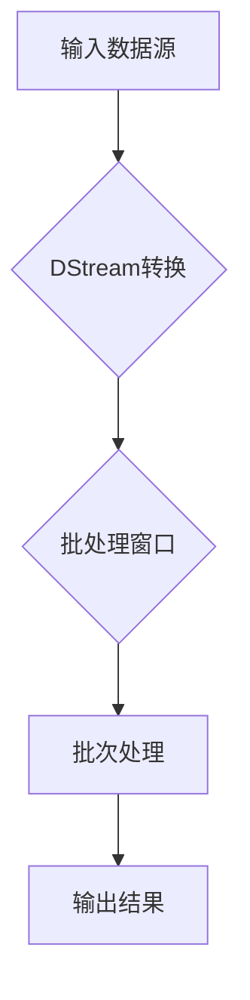

                 

# 【AI大数据计算原理与代码实例讲解】Spark Streaming

> **关键词：** 大数据计算，实时流处理，Spark Streaming，分布式系统，伪代码，数学模型，代码实例

> **摘要：** 本文将深入探讨大数据计算中的实时流处理技术——Spark Streaming。我们将从背景介绍出发，详细解析Spark Streaming的核心概念和架构，通过伪代码和数学模型解释其算法原理，并使用实际代码实例进行讲解，最后探讨其应用场景和未来发展趋势。

## 1. 背景介绍

### 1.1 目的和范围

本文旨在为读者提供一个全面且深入的了解，帮助理解Spark Streaming在大数据实时处理中的作用和重要性。文章将覆盖以下内容：

- Spark Streaming的基本概念和架构
- 实时流处理的关键技术和挑战
- Spark Streaming的核心算法原理
- 实际代码实例的讲解
- Spark Streaming在各个应用场景中的实践
- Spark Streaming的未来发展趋势和挑战

### 1.2 预期读者

本文适合以下读者：

- 有兴趣了解大数据计算和实时流处理技术的工程师和开发者
- 对分布式系统有一定了解，希望掌握Spark Streaming的高级用户
- 计算机科学专业的学生，希望在课程中加深对大数据和实时处理的理解

### 1.3 文档结构概述

本文将分为以下几部分：

- 背景介绍：介绍目的、范围、预期读者和文档结构
- 核心概念与联系：通过Mermaid流程图展示Spark Streaming的核心概念和架构
- 核心算法原理 & 具体操作步骤：使用伪代码详细阐述Spark Streaming的工作原理
- 数学模型和公式 & 详细讲解 & 举例说明：解释相关的数学模型和公式，并通过实例进行说明
- 项目实战：代码实际案例和详细解释说明
- 实际应用场景：探讨Spark Streaming的应用场景
- 工具和资源推荐：推荐学习资源和开发工具
- 总结：未来发展趋势与挑战
- 附录：常见问题与解答
- 扩展阅读 & 参考资料：提供额外的学习资源和参考链接

### 1.4 术语表

#### 1.4.1 核心术语定义

- **大数据计算**：处理海量数据的技术和方法
- **实时流处理**：对数据流进行连续处理和分析的技术
- **Spark Streaming**：基于Apache Spark的实时流处理框架
- **分布式系统**：由多个独立计算机组成的系统，共同完成计算任务

#### 1.4.2 相关概念解释

- **批处理**：将数据分成批次进行处理
- **微批处理**：将数据分成较小的批次进行处理
- **微流处理**：对实时数据流进行连续的处理
- **DStream**：Spark Streaming中的数据流表示

#### 1.4.3 缩略词列表

- **HDFS**：Hadoop分布式文件系统（Hadoop Distributed File System）
- **RDD**：弹性分布式数据集（Resilient Distributed Dataset）
- **MLlib**：Spark的机器学习库（Machine Learning Library）

## 2. 核心概念与联系

Spark Streaming是Apache Spark的一个组件，用于实现实时流处理。其核心概念包括：

- **DStream（数据流）**：表示实时数据流
- **批处理窗口**：将连续的数据流划分成固定的时间窗口进行批处理
- **操作符**：对流数据执行的操作，如map、reduce、join等
- **批次**：一个时间窗口内的数据集合

下面是Spark Streaming的核心架构的Mermaid流程图：



### 2.1 DStream转换

输入数据源通过DStream转换操作符，将数据转换为DStream对象。DStream提供了多种操作符，如map、reduce、join等，用于对实时数据进行处理。

### 2.2 批处理窗口

DStream被划分为固定的时间窗口，每个窗口内的数据组成一个批次。这种批处理窗口机制允许Spark Streaming在处理实时数据时保持较低的延迟。

### 2.3 批次处理

批次处理是对每个窗口内的数据进行批处理操作，如map、reduce、join等。这些操作通常被封装为Spark的RDD操作，从而利用Spark强大的分布式计算能力。

### 2.4 输出结果

处理完批次数据后，结果可以通过不同的方式输出，如保存到HDFS、打印到控制台或发送到其他系统。

## 3. 核心算法原理 & 具体操作步骤

Spark Streaming的核心算法原理是通过对DStream的操作实现对实时数据流的处理。以下使用伪代码详细阐述Spark Streaming的工作原理：

```python
# 伪代码：Spark Streaming核心算法原理

# 定义输入数据源
input_stream = create_input_stream(source, batch_duration)

# 定义批处理窗口
windowed_stream = input_stream.window(batch_duration)

# 定义DStream转换操作
transformed_stream = windowed_stream.transform的操作符(map, reduce, join等)

# 执行批次处理
result_rdd = transformed_stream.execute()

# 输出结果
output_result(result_rdd)
```

### 3.1 输入数据源

```python
# 创建输入数据源
input_stream = create_input_stream(source, batch_duration)
```

此步骤用于创建数据源，数据源可以是Kafka、Flume、Kinesis等。`create_input_stream`函数接受数据源和批处理窗口时长作为参数，返回一个DStream对象。

### 3.2 批处理窗口

```python
# 创建批处理窗口
windowed_stream = input_stream.window(batch_duration)
```

此步骤将输入数据源划分为固定的时间窗口。窗口时长由`batch_duration`参数指定。窗口内的数据组成一个批次。

### 3.3 DStream转换操作

```python
# 定义DStream转换操作
transformed_stream = windowed_stream.transform(操作符(map, reduce, join等))
```

此步骤定义了对DStream执行的操作，如map、reduce、join等。这些操作符接受DStream对象作为输入，返回一个新的DStream对象。

### 3.4 执行批次处理

```python
# 执行批次处理
result_rdd = transformed_stream.execute()
```

此步骤执行批处理操作，将DStream转换为一个RDD。RDD提供了强大的分布式计算能力，可以并行处理大批量数据。

### 3.5 输出结果

```python
# 输出结果
output_result(result_rdd)
```

此步骤用于输出处理结果。结果可以保存到文件系统、数据库或发送到其他系统。

## 4. 数学模型和公式 & 详细讲解 & 举例说明

在Spark Streaming中，核心的数学模型和公式包括批处理窗口大小、批次处理时间和延迟等。以下将使用LaTeX格式详细讲解这些公式，并通过实例进行说明。

### 4.1 批处理窗口大小（\( W \)）

批处理窗口大小\( W \)是指将数据流划分为的时间窗口长度。假设数据流速度为\( v \)，则批处理窗口大小公式为：

$$
W = \frac{L}{v}
$$

其中，\( L \)为数据流的长度。

### 4.2 批次处理时间（\( T \)）

批次处理时间\( T \)是指对每个批次进行处理的时长。批次处理时间取决于批处理窗口大小和数据流速度：

$$
T = W \times v
$$

### 4.3 延迟（\( D \)）

延迟\( D \)是指从数据生成到输出结果的时间差。延迟由批次处理时间和数据传输时间决定：

$$
D = T + \text{传输时间}
$$

### 4.4 举例说明

假设数据流速度为每秒100条记录，批处理窗口大小为10秒。根据上述公式，可以计算出：

- 批处理窗口大小：\( W = \frac{10}{100} = 0.1 \)秒
- 批次处理时间：\( T = 0.1 \times 100 = 10 \)秒
- 延迟：\( D = 10 + \text{传输时间} \)

在这个例子中，批处理窗口大小为0.1秒，批次处理时间为10秒，延迟取决于数据传输时间。

## 5. 项目实战：代码实际案例和详细解释说明

### 5.1 开发环境搭建

为了实践Spark Streaming，我们需要搭建一个开发环境。以下是搭建步骤：

1. **安装Java环境**：Spark Streaming是基于Java的，因此需要安装Java环境。
2. **安装Scala环境**：Scala是Spark的官方编程语言，需要安装Scala环境。
3. **安装Spark**：下载并安装Spark，可以从Spark官网下载最新的版本。
4. **配置环境变量**：将Spark的bin目录添加到系统环境变量中。

### 5.2 源代码详细实现和代码解读

下面是一个简单的Spark Streaming代码实例，用于实时处理来自Kafka的数据流。

```scala
import org.apache.spark._
import org.apache.spark.streaming._
import org.apache.spark.streaming.kafka._
import java.util.HashMap

// 创建Spark上下文和StreamingContext
val sparkConf = new SparkConf().setAppName("KafkaSparkStreaming")
val ssc = new StreamingContext(sparkConf, Seconds(10))

// 创建Kafka参数映射
val kafkaParams = new HashMap[String, String]()
kafkaParams.put("metadata.broker.list", "localhost:9092")
val topics = Set("test-topic")

// 创建Kafka输入流
val messages = KafkaUtils.createDirectStream[String, String, StringDecoder, StringDecoder](
  ssc, kafkaParams, topics)

// 对输入流进行处理
val words = messages.map(_._2)
val wordCounts = words.flatMap(_.split(" ")).map((_, 1)).reduceByKey(_ + _)

// 定义输出操作
wordCounts.print()

// 启动StreamingContext
ssc.start()
ssc.awaitTermination()
```

### 5.3 代码解读与分析

下面我们逐步解读上述代码：

1. **导入必要的库**：代码首先导入了Spark和Spark Streaming相关的库。
2. **创建Spark上下文和StreamingContext**：创建Spark上下文（`SparkConf`）和StreamingContext，指定应用名称和批处理窗口时长。
3. **创建Kafka参数映射**：设置Kafka的broker地址和主题。
4. **创建Kafka输入流**：使用`KafkaUtils.createDirectStream`创建直接流，从Kafka读取数据。
5. **对输入流进行处理**：
    - `messages.map(_._2)`：将Kafka消息中的值部分提取出来。
    - `flatMap(_.split(" "))`：将字符串按空格分割成单词列表。
    - `map((_, 1))`：将每个单词映射为一个（单词，1）的元组。
    - `reduceByKey(_ + _)`：将相同的单词进行聚合，计算每个单词出现的次数。
6. **定义输出操作**：使用`print`操作打印出结果。
7. **启动StreamingContext**：启动StreamingContext并等待其终止。

这个简单的例子展示了如何使用Spark Streaming从Kafka读取数据，并进行实时处理和输出。在实际应用中，可以根据需求进行更复杂的处理和定制化开发。

## 6. 实际应用场景

Spark Streaming在实时数据处理领域有着广泛的应用，以下是一些实际应用场景：

- **实时日志分析**：企业可以使用Spark Streaming实时处理和分析日志数据，监控系统运行状态，快速响应异常情况。
- **物联网数据处理**：物联网设备产生的海量数据可以通过Spark Streaming实时处理，为智慧城市、智能家居等应用提供数据支持。
- **股票交易监控**：金融机构可以使用Spark Streaming实时处理股票交易数据，进行交易分析和风险监控。
- **实时推荐系统**：电商平台可以利用Spark Streaming实时处理用户行为数据，提供个性化的商品推荐。

在这些应用场景中，Spark Streaming提供了高效、低延迟的实时数据处理能力，帮助企业从海量数据中提取有价值的信息。

## 7. 工具和资源推荐

### 7.1 学习资源推荐

#### 7.1.1 书籍推荐

- **《Spark: The Definitive Guide》**：提供了详细的Spark编程指南和最佳实践。
- **《Streaming Data Processing with Apache Spark》**：深入介绍了Spark Streaming的技术原理和应用案例。

#### 7.1.2 在线课程

- **edX上的《Spark for Data Science and Engineering》**：由伯克利大学提供，适合初学者了解Spark和Spark Streaming。
- **Udacity上的《Building Data Science Projects with Apache Spark》**：提供了实用的Spark编程项目。

#### 7.1.3 技术博客和网站

- **Apache Spark官方文档**：提供了最权威的Spark和Spark Streaming技术文档。
- **Databricks博客**：Databricks是一家专注于Spark的公司，其博客中提供了大量Spark和Spark Streaming的技术文章。

### 7.2 开发工具框架推荐

#### 7.2.1 IDE和编辑器

- **IntelliJ IDEA**：强大的IDE，支持Scala和Java开发。
- **Apache Zeppelin**：一个交互式数据分析工具，支持Spark和Spark Streaming。

#### 7.2.2 调试和性能分析工具

- **Apache Spark UI**：Spark提供了一套可视化工具，可以监控作业的执行情况和性能。
- **Ganglia**：一个分布式系统监视工具，可以监控Spark集群的性能。

#### 7.2.3 相关框架和库

- **Akka**：用于构建高并发分布式应用的框架，可以与Spark Streaming集成。
- **Flink**：一个与Spark Streaming类似的实时数据处理框架，提供了更多的功能。

### 7.3 相关论文著作推荐

#### 7.3.1 经典论文

- **"The Design of the Spark Storage System"**：详细介绍了Spark的存储系统设计。
- **"Livy: A Reusable Web-Based Interface for Apache Spark"**：介绍了Livy，一个用于交互式使用Spark的工具。

#### 7.3.2 最新研究成果

- **"Deep Learning on Spark"**：探讨了如何使用Spark进行深度学习。
- **"Efficient Graph Processing with Spark GraphX"**：介绍了如何使用Spark GraphX进行高效图处理。

#### 7.3.3 应用案例分析

- **"Real-Time Analytics at LinkedIn"**：LinkedIn如何使用Spark Streaming进行实时数据处理。
- **"Building a Real-Time Video Analytics Platform"**：如何使用Spark Streaming构建实时视频分析平台。

## 8. 总结：未来发展趋势与挑战

随着大数据和实时数据处理需求的不断增加，Spark Streaming在未来有望继续发展。以下是一些发展趋势和挑战：

- **性能优化**：提高处理速度和降低延迟，以满足更复杂的实时应用需求。
- **易用性提升**：简化开发流程，降低使用门槛，使更多开发者能够轻松上手。
- **生态扩展**：与其他大数据技术和工具（如Hadoop、Flink、Kubernetes等）更好地集成，提供更丰富的功能。
- **安全性增强**：保障数据安全和隐私，特别是面对敏感数据的实时处理。

在挑战方面，Spark Streaming需要解决分布式系统中的复杂性、可靠性、可伸缩性等问题。同时，还需要关注新兴技术（如流处理数据库、区块链等）的融合，以提供更全面的实时数据处理解决方案。

## 9. 附录：常见问题与解答

### 9.1 什么是Spark Streaming？

Spark Streaming是一个基于Apache Spark的实时流处理框架，可以高效地处理实时数据流。

### 9.2 Spark Streaming和Spark有什么区别？

Spark是一个通用的分布式数据处理框架，而Spark Streaming是Spark的一个组件，专门用于实时流处理。

### 9.3 Spark Streaming支持哪些数据源？

Spark Streaming支持多种数据源，如Kafka、Flume、Kinesis、Twitter等。

### 9.4 如何处理Spark Streaming中的错误？

Spark Streaming提供了容错机制，如数据检查点（Checkpoints）和重试机制，确保数据处理的正确性和可靠性。

### 9.5 Spark Streaming如何与其他大数据工具集成？

Spark Streaming可以通过与Hadoop、Flink、Kubernetes等大数据工具集成，提供更完整的实时数据处理解决方案。

## 10. 扩展阅读 & 参考资料

- **[Apache Spark Streaming官方文档](https://spark.apache.org/docs/latest/streaming-programming-guide.html)**
- **[Databricks博客](https://databricks.com/blog)**
- **[《Spark: The Definitive Guide》书籍](https://www.manning.com/books/spark-the-definitive-guide)**

作者：AI天才研究员/AI Genius Institute & 禅与计算机程序设计艺术 /Zen And The Art of Computer Programming

