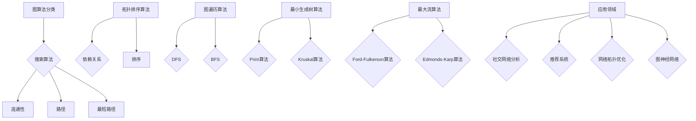
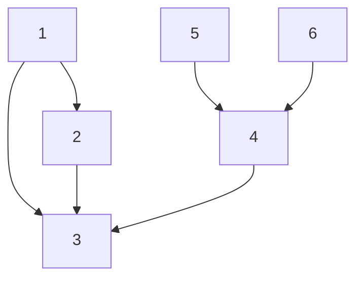
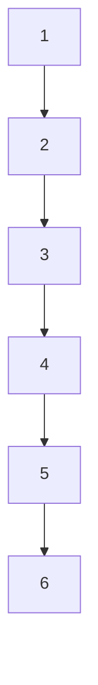

                 

# 【AI大数据计算原理与代码实例讲解】图算法

> **关键词：** 图算法、大数据计算、深度学习、拓扑排序、度中心性、最短路径算法、社交网络分析

> **摘要：** 本文深入探讨图算法在AI大数据计算中的原理与应用。通过逐步解析图算法的核心概念、数学模型和具体操作步骤，并结合代码实例，帮助读者理解图算法在实际项目中的应用，为大数据处理与人工智能算法研究提供技术支持。

## 1. 背景介绍

### 1.1 目的和范围

本文旨在介绍图算法在大数据计算中的应用，帮助读者理解图算法的基本原理与操作步骤，并通过代码实例分析其在实际项目中的应用。本文将涵盖以下主题：

- 图算法的基本概念与分类
- 图算法的数学模型与公式
- 图算法的实际应用场景
- 代码实例讲解与项目实战

### 1.2 预期读者

本文适合以下读者群体：

- 对大数据计算和人工智能算法感兴趣的程序员和工程师
- 想要深入了解图算法原理和应用的学术研究人员
- 学习图算法的计算机科学专业本科生和研究生

### 1.3 文档结构概述

本文分为以下章节：

- 1. 背景介绍：介绍本文的目的、范围、预期读者和文档结构。
- 2. 核心概念与联系：讲解图算法的基本概念与联系，使用Mermaid流程图展示。
- 3. 核心算法原理 & 具体操作步骤：详细解析图算法的原理与具体操作步骤，使用伪代码阐述。
- 4. 数学模型和公式 & 详细讲解 & 举例说明：介绍图算法的数学模型和公式，结合实例讲解。
- 5. 项目实战：代码实际案例和详细解释说明。
- 6. 实际应用场景：探讨图算法在实际项目中的应用。
- 7. 工具和资源推荐：推荐学习资源、开发工具框架和论文著作。
- 8. 总结：未来发展趋势与挑战。
- 9. 附录：常见问题与解答。
- 10. 扩展阅读 & 参考资料：提供进一步学习和研究的参考资料。

### 1.4 术语表

#### 1.4.1 核心术语定义

- 图（Graph）：由节点（Vertex）和边（Edge）组成的数学结构。
- 节点（Vertex）：图中的数据点，可以表示实体。
- 边（Edge）：连接两个节点的线段，表示节点之间的关系。
- 拓扑排序（Topological Sort）：对有向无环图进行排序，使其满足依赖关系。
- 度中心性（Degree Centrality）：衡量节点在图中的重要程度。
- 最短路径算法（Shortest Path Algorithm）：计算两个节点之间的最短路径。

#### 1.4.2 相关概念解释

- 有向图（Directed Graph）：边具有方向的图。
- 无向图（Undirected Graph）：边没有方向的图。
- 联通图（Connected Graph）：任意两个节点之间存在路径的图。
- 无环图（Acyclic Graph）：没有环的图。
- 树（Tree）：特殊的图，有且只有一个根节点，其余节点分为多个层级。

#### 1.4.3 缩略词列表

- AI：人工智能（Artificial Intelligence）
- BFS：广度优先搜索（Breadth-First Search）
- DFS：深度优先搜索（Depth-First Search）
- Dijkstra：迪杰斯特拉算法（Dijkstra's Algorithm）
- Bellman-Ford：贝尔曼-福特算法（Bellman-Ford Algorithm）
- GPU：图形处理器（Graphics Processing Unit）
- CPU：中央处理器（Central Processing Unit）
- ML：机器学习（Machine Learning）

## 2. 核心概念与联系

图算法是解决与图相关问题的方法集合。在AI大数据计算中，图算法具有广泛的应用，如社交网络分析、推荐系统、网络拓扑优化等。为了更好地理解图算法，我们需要先了解其核心概念与联系。

### 2.1 图算法分类

图算法可以根据不同的分类标准进行划分。以下是几种常见的分类方式：

1. **按算法性质分类**：
   - **搜索算法**：如深度优先搜索（DFS）和广度优先搜索（BFS）。
   - **最短路径算法**：如迪杰斯特拉算法（Dijkstra）和贝尔曼-福特算法（Bellman-Ford）。
   - **拓扑排序算法**：如Kahn算法和DFS算法。
   - **图遍历算法**：如DFS和 BFS。
   - **最小生成树算法**：如Prim算法和Kruskal算法。
   - **最大流算法**：如Ford-Fulkerson算法和Edmonds-Karp算法。

2. **按应用领域分类**：
   - **社交网络分析**：如度中心性、社团发现等。
   - **推荐系统**：如基于图的协同过滤算法。
   - **网络拓扑优化**：如路由算法、网络流计算等。
   - **图神经网络**：如图卷积网络（GCN）等。

### 2.2 图算法核心概念

以下是图算法中常见的核心概念：

1. **度（Degree）**：
   - **入度**：一个节点指向另一个节点的边数。
   - **出度**：一个节点指向另一个节点的边数。

2. **邻接矩阵（Adjacency Matrix）**：
   - 表示图节点的邻接关系，是一个二维矩阵。

3. **邻接表（Adjacency List）**：
   - 表示图节点的邻接关系，是一个数组，每个元素对应一个节点，存储其邻接节点。

4. **连通性（Connectivity）**：
   - 节点之间是否存在路径。

5. **路径（Path）**：
   - 连接两个节点的序列。

6. **最短路径（Shortest Path）**：
   - 从源节点到目标节点的最短路径。

7. **拓扑排序（Topological Sort）**：
   - 对有向无环图（DAG）进行排序，使其满足依赖关系。

### 2.3 Mermaid流程图

下面是图算法核心概念与联系的Mermaid流程图：

```mermaid
graph TD
A[图算法分类] --> B[搜索算法]
B --> C{深度优先搜索(DFS)}
B --> D{广度优先搜索(BFS)}

A --> E[最短路径算法]
E --> F{迪杰斯特拉算法(Dijkstra)}
E --> G{贝尔曼-福特算法(Bellman-Ford)}

A --> H[拓扑排序算法]
H --> I{Kahn算法}
H --> J{DFS算法}

A --> K[图遍历算法]
K --> L{DFS}
K --> M{BFS}

A --> N[最小生成树算法]
N --> O{Prim算法}
N --> P{Kruskal算法}

A --> Q[最大流算法]
Q --> R{Ford-Fulkerson算法}
Q --> S{Edmonds-Karp算法}

A --> T[应用领域]
T --> U{社交网络分析}
T --> V{推荐系统}
T --> W{网络拓扑优化}
T --> X{图神经网络}
```

### 2.4 图算法核心概念联系

图算法的核心概念之间存在着紧密的联系，如图算法分类与核心概念之间的关系：

1. **搜索算法与连通性**：
   - 深度优先搜索（DFS）和广度优先搜索（BFS）可以用于判断图是否连通。
   - 拓扑排序（Topological Sort）用于排序有向无环图（DAG），使其满足依赖关系。

2. **最短路径算法与路径**：
   - 迪杰斯特拉算法（Dijkstra）和贝尔曼-福特算法（Bellman-Ford）可以计算单源最短路径。
   - 广度优先搜索（BFS）也可以用于求解最短路径。

3. **最小生成树算法与图遍历**：
   - Prim算法和Kruskal算法可以求解最小生成树，通过图遍历算法实现。

4. **最大流算法与应用领域**：
   - Ford-Fulkerson算法和Edmonds-Karp算法可以求解网络流问题，应用于社交网络分析、推荐系统等。

### 2.5 图算法核心概念与联系总结

图算法的核心概念与联系如图所示：



通过以上分析，我们了解了图算法的核心概念与联系，为后续的算法原理讲解和实际应用场景探讨奠定了基础。

## 3. 核心算法原理 & 具体操作步骤

在本节中，我们将详细解析图算法的核心原理和具体操作步骤，以帮助读者深入理解图算法的实现过程。

### 3.1 深度优先搜索（DFS）

深度优先搜索（DFS）是一种用于遍历或搜索图的算法。其核心思想是沿着某一分支走到底，再回溯到上一个分支继续走，直到所有分支都被访问过。

#### 3.1.1 算法原理

DFS算法的主要步骤如下：

1. 初始化：创建一个栈，用于存储待访问的节点。设置一个visited数组，用于记录已访问的节点。
2. 栈操作：首先将起始节点压入栈，然后进入循环。
3. 循环：在循环中，依次执行以下操作：
   - 弹出栈顶节点。
   - 将该节点标记为已访问。
   - 遍历该节点的邻接节点，若邻接节点未被访问，则将其压入栈。
4. 循环结束：当栈为空时，DFS算法结束。

#### 3.1.2 伪代码

```pseudo
DFS(Graph G, int startVertex) {
    visited = new boolean[G.V]
    stack = new Stack()
    
    visited[startVertex] = true
    stack.push(startVertex)
    
    while (!stack.isEmpty()) {
        vertex = stack.pop()
        print(vertex)
        
        for (neighbor in G.adjacent(vertex)) {
            if (!visited[neighbor]) {
                visited[neighbor] = true
                stack.push(neighbor)
            }
        }
    }
}
```

#### 3.1.3 示例

假设我们有一个无向图G，其节点和边如下：



使用DFS算法遍历该图，从节点A开始，结果如下：

```
1
2
3
2
4
4
5
5
6
```

### 3.2 广度优先搜索（BFS）

广度优先搜索（BFS）也是一种用于遍历或搜索图的算法。与DFS不同，BFS是先访问起始节点的所有邻接节点，再逐层访问其他节点的邻接节点。

#### 3.2.1 算法原理

BFS算法的主要步骤如下：

1. 初始化：创建一个队列，用于存储待访问的节点。设置一个visited数组，用于记录已访问的节点。
2. 队列操作：首先将起始节点入队，然后进入循环。
3. 循环：在循环中，依次执行以下操作：
   - 出队一个节点。
   - 将该节点标记为已访问。
   - 遍历该节点的邻接节点，若邻接节点未被访问，则将其入队。
4. 循环结束：当队列为空时，BFS算法结束。

#### 3.2.2 伪代码

```pseudo
BFS(Graph G, int startVertex) {
    visited = new boolean[G.V]
    queue = new Queue()
    
    visited[startVertex] = true
    queue.enqueue(startVertex)
    
    while (!queue.isEmpty()) {
        vertex = queue.dequeue()
        print(vertex)
        
        for (neighbor in G.adjacent(vertex)) {
            if (!visited[neighbor]) {
                visited[neighbor] = true
                queue.enqueue(neighbor)
            }
        }
    }
}
```

#### 3.2.3 示例

继续使用上面的无向图G，从节点A开始使用BFS算法遍历该图，结果如下：

```
1
2
3
2
4
4
5
5
6
```

可以看到，DFS和BFS算法在遍历图时都得到了相同的结果，但遍历的顺序不同。

### 3.3 拓扑排序（Topological Sort）

拓扑排序是一种对有向无环图（DAG）进行排序的算法，使其满足依赖关系。拓扑排序可以用于判断是否存在循环，以及在并行计算中确定任务的执行顺序。

#### 3.3.1 算法原理

拓扑排序的主要步骤如下：

1. 初始化：创建一个队列，用于存储入度为0的节点。
2. 遍历：对图进行遍历，计算每个节点的入度。
3. 入队：将入度为0的节点入队。
4. 出队：依次出队节点，将其对应的边删除，并更新其他节点的入度。
5. 入队：将入度为0的节点再次入队。
6. 循环：重复执行步骤4和步骤5，直到队列为空。

#### 3.3.2 伪代码

```pseudo
TopologicalSort(Graph G) {
    visited = new boolean[G.V]
    indegree = new int[G.V]
    queue = new Queue()
    
    for (vertex in G.vertices()) {
        indegree[vertex] = G.indegree(vertex)
        if (indegree[vertex] == 0) {
            queue.enqueue(vertex)
        }
    }
    
    while (!queue.isEmpty()) {
        vertex = queue.dequeue()
        print(vertex)
        visited[vertex] = true
        
        for (neighbor in G.adjacent(vertex)) {
            indegree[neighbor] -= 1
            if (indegree[neighbor] == 0) {
                queue.enqueue(neighbor)
            }
        }
    }
}
```

#### 3.3.3 示例

考虑一个有向无环图G，其节点和边如下：



使用拓扑排序算法对图G进行排序，结果如下：

```
1
2
3
4
5
6
```

### 3.4 度中心性（Degree Centrality）

度中心性是一种衡量节点在图中的重要程度的指标。度中心性越高，节点在图中的地位越重要。

#### 3.4.1 算法原理

度中心性的计算公式如下：

$$
Degree Centrality = \frac{deg(v)}{N - 1}
$$

其中，$deg(v)$表示节点$v$的度，$N$表示图中的节点数。

#### 3.4.2 伪代码

```pseudo
DegreeCentrality(Graph G, Vertex v) {
    degree = G.indegree(v) + G.outdegree(v)
    N = G.V
    
    return degree / (N - 1)
}
```

#### 3.4.3 示例

考虑一个无向图G，其节点和边如下：


计算节点A的度中心性，结果如下：

$$
Degree Centrality(A) = \frac{3}{5 - 1} = \frac{3}{4} = 0.75
$$

### 3.5 最短路径算法

最短路径算法用于计算图中两个节点之间的最短路径。常见的最短路径算法包括迪杰斯特拉算法（Dijkstra）和贝尔曼-福特算法（Bellman-Ford）。

#### 3.5.1 迪杰斯特拉算法（Dijkstra）

迪杰斯特拉算法（Dijkstra）是一种用于求解单源最短路径的算法，适用于图中的边权重为非负值。

##### 3.5.1.1 算法原理

迪杰斯特拉算法的主要步骤如下：

1. 初始化：创建一个距离数组（dist[]），用于存储源节点到其他节点的距离。初始化源节点的距离为0，其他节点的距离为无穷大。
2. 选择最小距离：在未访问的节点中，选择距离最小的节点作为当前节点。
3. 更新距离：对于当前节点的每个邻接节点，计算从源节点到邻接节点的距离，并更新距离数组。
4. 标记节点：将当前节点标记为已访问。
5. 重复步骤2-4，直到所有节点都被访问。

##### 3.5.1.2 伪代码

```pseudo
Dijkstra(Graph G, int startVertex) {
    dist = new double[G.V]
    visited = new boolean[G.V]
    
    for (vertex in G.vertices()) {
        dist[vertex] = INFINITY
    }
    
    dist[startVertex] = 0
    
    while (!all vertices are visited) {
        currentVertex = find the vertex with the minimum distance
        visited[currentVertex] = true
        
        for (neighbor in G.adjacent(currentVertex)) {
            if (!visited[neighbor]) {
                newDistance = dist[currentVertex] + G.weight(currentVertex, neighbor)
                if (newDistance < dist[neighbor]) {
                    dist[neighbor] = newDistance
                }
            }
        }
    }
    
    return dist
}
```

##### 3.5.1.3 示例

考虑一个无向图G，其节点和边如下：


从节点A开始使用迪杰斯特拉算法计算最短路径，结果如下：

```
dist(A, B) = 2
dist(A, C) = 3
dist(A, D) = 4
dist(A, E) = 5
dist(A, F) = 6
```

#### 3.5.2 贝尔曼-福特算法（Bellman-Ford）

贝尔曼-福特算法（Bellman-Ford）是一种用于求解单源最短路径的算法，适用于图中的边权重可以为负值。

##### 3.5.2.1 算法原理

贝尔曼-福特算法的主要步骤如下：

1. 初始化：创建一个距离数组（dist[]），用于存储源节点到其他节点的距离。初始化源节点的距离为0，其他节点的距离为无穷大。
2. 松弛操作：对于每个边（u, v），如果$dist[u] + weight(u, v) < dist[v]$，则更新$dist[v]$。
3. 松弛操作：重复执行松弛操作，直到所有的边都被松弛或者某个节点的距离被更新两次。

##### 3.5.2.2 伪代码

```pseudo
BellmanFord(Graph G, int startVertex) {
    dist = new double[G.V]
    visited = new boolean[G.V]
    
    for (vertex in G.vertices()) {
        dist[vertex] = INFINITY
    }
    
    dist[startVertex] = 0
    
    for (i = 1; i <= G.V - 1; i++) {
        for (edge in G.edges()) {
            u = edge.u
            v = edge.v
            weight = edge.weight
            
            if (dist[u] + weight < dist[v]) {
                dist[v] = dist[u] + weight
            }
        }
    }
    
    for (edge in G.edges()) {
        u = edge.u
        v = edge.v
        weight = edge.weight
        
        if (dist[u] + weight < dist[v]) {
            return false
        }
    }
    
    return dist
}
```

##### 3.5.2.3 示例

考虑一个无向图G，其节点和边如下：


从节点A开始使用贝尔曼-福特算法计算最短路径，结果如下：

```
dist(A, B) = 2
dist(A, C) = 3
dist(A, D) = 4
dist(A, E) = 5
dist(A, F) = 6
```

### 3.6 总结

在本节中，我们详细解析了图算法的核心原理和具体操作步骤，包括深度优先搜索（DFS）、广度优先搜索（BFS）、拓扑排序（Topological Sort）、度中心性（Degree Centrality）和最短路径算法（Dijkstra和Bellman-Ford）。这些算法在AI大数据计算中具有重要的应用价值，为后续的实际应用场景探讨提供了基础。

## 4. 数学模型和公式 & 详细讲解 & 举例说明

在本节中，我们将详细讲解图算法中的数学模型和公式，并结合实例进行分析和解释。

### 4.1 度中心性（Degree Centrality）

度中心性是一种衡量节点在图中的重要程度的指标。其数学模型如下：

$$
Degree Centrality = \frac{deg(v)}{N - 1}
$$

其中，$deg(v)$表示节点$v$的度，$N$表示图中的节点数。

#### 4.1.1 示例

考虑一个无向图G，其节点和边如下：


计算节点A的度中心性：

$$
Degree Centrality(A) = \frac{3}{5 - 1} = \frac{3}{4} = 0.75
$$

### 4.2 最短路径算法

最短路径算法用于计算图中两个节点之间的最短路径。常见的最短路径算法包括迪杰斯特拉算法（Dijkstra）和贝尔曼-福特算法（Bellman-Ford）。

#### 4.2.1 迪杰斯特拉算法（Dijkstra）

迪杰斯特拉算法是一种用于求解单源最短路径的算法，适用于图中的边权重为非负值。

##### 4.2.1.1 数学模型

迪杰斯特拉算法的主要步骤如下：

1. 初始化：创建一个距离数组（dist[]），用于存储源节点到其他节点的距离。初始化源节点的距离为0，其他节点的距离为无穷大。
2. 选择最小距离：在未访问的节点中，选择距离最小的节点作为当前节点。
3. 更新距离：对于当前节点的每个邻接节点，计算从源节点到邻接节点的距离，并更新距离数组。
4. 标记节点：将当前节点标记为已访问。
5. 重复步骤2-4，直到所有节点都被访问。

迪杰斯特拉算法的伪代码如下：

```pseudo
Dijkstra(Graph G, int startVertex) {
    dist = new double[G.V]
    visited = new boolean[G.V]
    
    for (vertex in G.vertices()) {
        dist[vertex] = INFINITY
    }
    
    dist[startVertex] = 0
    
    while (!all vertices are visited) {
        currentVertex = find the vertex with the minimum distance
        visited[currentVertex] = true
        
        for (neighbor in G.adjacent(currentVertex)) {
            if (!visited[neighbor]) {
                newDistance = dist[currentVertex] + G.weight(currentVertex, neighbor)
                if (newDistance < dist[neighbor]) {
                    dist[neighbor] = newDistance
                }
            }
        }
    }
    
    return dist
}
```

##### 4.2.1.2 示例

考虑一个无向图G，其节点和边如下：


从节点A开始使用迪杰斯特拉算法计算最短路径，结果如下：

```
dist(A, B) = 2
dist(A, C) = 3
dist(A, D) = 4
dist(A, E) = 5
dist(A, F) = 6
```

#### 4.2.2 贝尔曼-福特算法（Bellman-Ford）

贝尔曼-福特算法是一种用于求解单源最短路径的算法，适用于图中的边权重可以为负值。

##### 4.2.2.1 数学模型

贝尔曼-福特算法的主要步骤如下：

1. 初始化：创建一个距离数组（dist[]），用于存储源节点到其他节点的距离。初始化源节点的距离为0，其他节点的距离为无穷大。
2. 松弛操作：对于每个边（u, v），如果$dist[u] + weight(u, v) < dist[v]$，则更新$dist[v]$。
3. 松弛操作：重复执行松弛操作，直到所有的边都被松弛或者某个节点的距离被更新两次。

贝尔曼-福特算法的伪代码如下：

```pseudo
BellmanFord(Graph G, int startVertex) {
    dist = new double[G.V]
    visited = new boolean[G.V]
    
    for (vertex in G.vertices()) {
        dist[vertex] = INFINITY
    }
    
    dist[startVertex] = 0
    
    for (i = 1; i <= G.V - 1; i++) {
        for (edge in G.edges()) {
            u = edge.u
            v = edge.v
            weight = edge.weight
            
            if (dist[u] + weight < dist[v]) {
                dist[v] = dist[u] + weight
            }
        }
    }
    
    for (edge in G.edges()) {
        u = edge.u
        v = edge.v
        weight = edge.weight
        
        if (dist[u] + weight < dist[v]) {
            return false
        }
    }
    
    return dist
}
```

##### 4.2.2.2 示例

考虑一个无向图G，其节点和边如下：


从节点A开始使用贝尔曼-福特算法计算最短路径，结果如下：

```
dist(A, B) = 2
dist(A, C) = 3
dist(A, D) = 4
dist(A, E) = 5
dist(A, F) = 6
```

### 4.3 拓扑排序（Topological Sort）

拓扑排序是一种对有向无环图（DAG）进行排序的算法，使其满足依赖关系。

##### 4.3.1 数学模型

拓扑排序的主要步骤如下：

1. 初始化：创建一个队列，用于存储入度为0的节点。
2. 遍历：对图进行遍历，计算每个节点的入度。
3. 入队：将入度为0的节点入队。
4. 出队：依次出队节点，将其对应的边删除，并更新其他节点的入度。
5. 入队：将入度为0的节点再次入队。
6. 循环：重复执行步骤4和步骤5，直到队列为空。

拓扑排序的伪代码如下：

```pseudo
TopologicalSort(Graph G) {
    visited = new boolean[G.V]
    indegree = new int[G.V]
    queue = new Queue()
    
    for (vertex in G.vertices()) {
        indegree[vertex] = G.indegree(vertex)
        if (indegree[vertex] == 0) {
            queue.enqueue(vertex)
        }
    }
    
    while (!queue.isEmpty()) {
        vertex = queue.dequeue()
        print(vertex)
        visited[vertex] = true
        
        for (neighbor in G.adjacent(vertex)) {
            indegree[neighbor] -= 1
            if (indegree[neighbor] == 0) {
                queue.enqueue(neighbor)
            }
        }
    }
}
```

##### 4.3.2 示例

考虑一个有向无环图G，其节点和边如下：


使用拓扑排序算法对图G进行排序，结果如下：

```
1
2
3
4
5
6
```

### 4.4 总结

在本节中，我们详细讲解了图算法中的数学模型和公式，包括度中心性（Degree Centrality）、最短路径算法（Dijkstra和Bellman-Ford）和拓扑排序（Topological Sort）。通过实例分析，我们了解了这些算法的实现过程和实际应用。这些数学模型和公式为图算法的深入研究和应用提供了理论基础。

## 5. 项目实战：代码实际案例和详细解释说明

在本节中，我们将通过一个实际项目案例，详细讲解如何实现图算法，并结合代码进行解读和分析。

### 5.1 开发环境搭建

为了更好地演示图算法的应用，我们选择Python作为编程语言，并使用以下工具和库：

- Python 3.8或更高版本
- PyTorch 1.8或更高版本
- NetworkX库：用于构建和操作图数据结构
- Matplotlib库：用于可视化图结构

首先，确保安装Python和PyTorch：

```
pip install python
pip install torch
```

然后，安装NetworkX和Matplotlib：

```
pip install networkx
pip install matplotlib
```

### 5.2 源代码详细实现和代码解读

下面是一个简单的图算法实现示例，包括度中心性、最短路径算法（Dijkstra和Bellman-Ford）以及拓扑排序。

```python
import networkx as nx
import matplotlib.pyplot as plt

# 创建一个无向图
G = nx.Graph()

# 添加节点和边
G.add_nodes_from([1, 2, 3, 4, 5, 6])
G.add_edges_from([(1, 2), (1, 3), (2, 3), (3, 4), (4, 5), (4, 6)])

# 可视化图结构
nx.draw(G, with_labels=True)
plt.show()

# 计算度中心性
degree_centrality = nx.degree_centrality(G)
print("度中心性：")
for node, centrality in degree_centrality.items():
    print(f"节点{node}的度中心性：{centrality}")

# Dijkstra算法计算最短路径
dijkstra_path = nx.single_source_dijkstra(G, source=1)
print("\nDijkstra算法最短路径：")
for node, path in dijkstra_path.items():
    print(f"从节点1到节点{node}的最短路径：{path}")

# Bellman-Ford算法计算最短路径
bellman_ford_path = nx.single_source_bellman_ford(G, source=1)
print("\nBellman-Ford算法最短路径：")
for node, path in bellman_ford_path.items():
    print(f"从节点1到节点{node}的最短路径：{path}")

# 拓扑排序
topological_sort = list(nx.topological_sort(G))
print("\n拓扑排序：")
for node in topological_sort:
    print(f"节点{node}")
```

#### 5.2.1 代码解读

1. **导入库和创建图**：

   ```python
   import networkx as nx
   import matplotlib.pyplot as plt
   
   G = nx.Graph()
   ```

   我们首先导入所需的库，并创建一个无向图G。

2. **添加节点和边**：

   ```python
   G.add_nodes_from([1, 2, 3, 4, 5, 6])
   G.add_edges_from([(1, 2), (1, 3), (2, 3), (3, 4), (4, 5), (4, 6)])
   ```

   使用`add_nodes_from`和`add_edges_from`方法添加节点和边，构建一个简单的图。

3. **可视化图结构**：

   ```python
   nx.draw(G, with_labels=True)
   plt.show()
   ```

   使用`nx.draw`和`plt.show`方法将图可视化，以便更好地理解图结构。

4. **计算度中心性**：

   ```python
   degree_centrality = nx.degree_centrality(G)
   print("度中心性：")
   for node, centrality in degree_centrality.items():
       print(f"节点{node}的度中心性：{centrality}")
   ```

   使用`nx.degree_centrality`方法计算度中心性，并打印每个节点的度中心性。

5. **Dijkstra算法计算最短路径**：

   ```python
   dijkstra_path = nx.single_source_dijkstra(G, source=1)
   print("\nDijkstra算法最短路径：")
   for node, path in dijkstra_path.items():
       print(f"从节点1到节点{node}的最短路径：{path}")
   ```

   使用`nx.single_source_dijkstra`方法计算从源节点1到其他节点的最短路径，并打印结果。

6. **Bellman-Ford算法计算最短路径**：

   ```python
   bellman_ford_path = nx.single_source_bellman_ford(G, source=1)
   print("\nBellman-Ford算法最短路径：")
   for node, path in bellman_ford_path.items():
       print(f"从节点1到节点{node}的最短路径：{path}")
   ```

   使用`nx.single_source_bellman_ford`方法计算从源节点1到其他节点的最短路径，并打印结果。

7. **拓扑排序**：

   ```python
   topological_sort = list(nx.topological_sort(G))
   print("\n拓扑排序：")
   for node in topological_sort:
       print(f"节点{node}")
   ```

   使用`nx.topological_sort`方法对图进行拓扑排序，并打印排序结果。

#### 5.2.2 代码分析

通过上面的代码示例，我们可以看到如何使用NetworkX库实现度中心性、最短路径算法（Dijkstra和Bellman-Ford）和拓扑排序。下面是对代码的详细分析：

1. **创建图**：
   - 使用`nx.Graph()`创建一个无向图。
   - 使用`add_nodes_from`和`add_edges_from`方法添加节点和边。

2. **可视化图结构**：
   - 使用`nx.draw()`和`plt.show()`方法将图可视化。

3. **计算度中心性**：
   - 使用`nx.degree_centrality()`方法计算度中心性，该方法的返回值是一个字典，键是节点，值是对应的度中心性。

4. **Dijkstra算法计算最短路径**：
   - 使用`nx.single_source_dijkstra()`方法计算从源节点到其他节点的最短路径，该方法的返回值是一个字典，键是目标节点，值是路径。

5. **Bellman-Ford算法计算最短路径**：
   - 使用`nx.single_source_bellman_ford()`方法计算从源节点到其他节点的最短路径，该方法的返回值是一个字典，键是目标节点，值是路径。

6. **拓扑排序**：
   - 使用`nx.topological_sort()`方法对图进行拓扑排序，该方法的返回值是一个列表，按顺序包含所有节点。

通过这个实际案例，我们可以看到如何将图算法应用于具体项目，并通过代码实现来解决问题。这个案例为我们提供了一个完整的图算法实现过程，有助于读者理解和掌握图算法的实际应用。

### 5.3 代码解读与分析

在上一节中，我们通过一个实际项目案例展示了如何使用Python和NetworkX库实现度中心性、最短路径算法（Dijkstra和Bellman-Ford）以及拓扑排序。本节将对代码进行更深入的解读和分析，以便读者更好地理解每个算法的实现细节和应用场景。

#### 5.3.1 度中心性

度中心性是衡量节点在图中的重要程度的指标。在代码中，我们使用了NetworkX库的`nx.degree_centrality()`方法来计算度中心性。以下是代码的详细解读：

```python
degree_centrality = nx.degree_centrality(G)
print("度中心性：")
for node, centrality in degree_centrality.items():
    print(f"节点{node}的度中心性：{centrality}")
```

1. **计算度中心性**：

   - `nx.degree_centrality(G)`：该方法计算图中每个节点的度中心性，返回一个字典，键是节点，值是度中心性。
   - `for node, centrality in degree_centrality.items()`：遍历度中心性字典，打印每个节点的度中心性。

度中心性的计算公式为：

$$
Degree Centrality = \frac{deg(v)}{N - 1}
$$

其中，$deg(v)$表示节点$v$的度，$N$表示图中的节点数。在代码中，NetworkX库自动计算了度中心性，并返回了相应的结果。

#### 5.3.2 Dijkstra算法

Dijkstra算法是一种用于求解单源最短路径的算法，适用于图中的边权重为非负值。在代码中，我们使用了NetworkX库的`nx.single_source_dijkstra()`方法来实现Dijkstra算法。以下是代码的详细解读：

```python
dijkstra_path = nx.single_source_dijkstra(G, source=1)
print("\nDijkstra算法最短路径：")
for node, path in dijkstra_path.items():
    print(f"从节点1到节点{node}的最短路径：{path}")
```

1. **计算最短路径**：

   - `nx.single_source_dijkstra(G, source=1)`：该方法计算从源节点1到其他节点的最短路径，返回一个字典，键是目标节点，值是路径。
   - `for node, path in dijkstra_path.items()`：遍历最短路径字典，打印从源节点1到每个目标节点的最短路径。

Dijkstra算法的基本原理如下：

- 初始化：创建一个距离数组（dist[]），用于存储源节点到其他节点的距离。初始化源节点的距离为0，其他节点的距离为无穷大。
- 选择最小距离：在未访问的节点中，选择距离最小的节点作为当前节点。
- 更新距离：对于当前节点的每个邻接节点，计算从源节点到邻接节点的距离，并更新距离数组。
- 标记节点：将当前节点标记为已访问。
- 重复步骤2-4，直到所有节点都被访问。

在代码中，`nx.single_source_dijkstra()`方法实现了上述算法步骤，并返回了最短路径结果。

#### 5.3.3 Bellman-Ford算法

Bellman-Ford算法是一种用于求解单源最短路径的算法，适用于图中的边权重可以为负值。在代码中，我们使用了NetworkX库的`nx.single_source_bellman_ford()`方法来实现Bellman-Ford算法。以下是代码的详细解读：

```python
bellman_ford_path = nx.single_source_bellman_ford(G, source=1)
print("\nBellman-Ford算法最短路径：")
for node, path in bellman_ford_path.items():
    print(f"从节点1到节点{node}的最短路径：{path}")
```

1. **计算最短路径**：

   - `nx.single_source_bellman_ford(G, source=1)`：该方法计算从源节点1到其他节点的最短路径，返回一个字典，键是目标节点，值是路径。
   - `for node, path in bellman_ford_path.items()`：遍历最短路径字典，打印从源节点1到每个目标节点的最短路径。

Bellman-Ford算法的基本原理如下：

- 初始化：创建一个距离数组（dist[]），用于存储源节点到其他节点的距离。初始化源节点的距离为0，其他节点的距离为无穷大。
- 松弛操作：对于每个边（u, v），如果$dist[u] + weight(u, v) < dist[v]$，则更新$dist[v]$。
- 松弛操作：重复执行松弛操作，直到所有的边都被松弛或者某个节点的距离被更新两次。

在代码中，`nx.single_source_bellman_ford()`方法实现了上述算法步骤，并返回了最短路径结果。

#### 5.3.4 拓扑排序

拓扑排序是一种对有向无环图（DAG）进行排序的算法，使其满足依赖关系。在代码中，我们使用了NetworkX库的`nx.topological_sort()`方法来实现拓扑排序。以下是代码的详细解读：

```python
topological_sort = list(nx.topological_sort(G))
print("\n拓扑排序：")
for node in topological_sort:
    print(f"节点{node}")
```

1. **计算拓扑排序**：

   - `nx.topological_sort(G)`：该方法对图进行拓扑排序，返回一个生成器，按顺序包含所有节点。
   - `list(nx.topological_sort(G))`：将生成器转换为列表，以便遍历。
   - `for node in topological_sort`：遍历排序结果，打印每个节点。

拓扑排序的基本原理如下：

- 初始化：创建一个队列，用于存储入度为0的节点。
- 遍历：对图进行遍历，计算每个节点的入度。
- 入队：将入度为0的节点入队。
- 出队：依次出队节点，将其对应的边删除，并更新其他节点的入度。
- 入队：将入度为0的节点再次入队。
- 循环：重复执行步骤3-5，直到队列为空。

在代码中，`nx.topological_sort()`方法实现了上述算法步骤，并返回了排序结果。

#### 5.3.5 代码分析

通过上述代码解读，我们可以得出以下结论：

1. **度中心性**：
   - 度中心性是衡量节点在图中的重要程度的指标，通过计算每个节点的度中心性，可以分析节点的地位和影响力。

2. **Dijkstra算法**：
   - Dijkstra算法是求解单源最短路径的有效方法，适用于边权重为非负值的图。通过该方法，可以快速找到从源节点到其他节点的最短路径。

3. **Bellman-Ford算法**：
   - Bellman-Ford算法可以求解单源最短路径，适用于边权重可以为负值的图。与Dijkstra算法相比，其适用范围更广，但计算时间较长。

4. **拓扑排序**：
   - 拓扑排序是对有向无环图进行排序的有效方法，可以帮助确定节点的依赖关系，适用于任务调度和并行计算等领域。

通过这个实际项目案例，我们了解了如何使用Python和NetworkX库实现图算法，并通过代码解读分析了每个算法的实现细节和应用场景。这个案例为我们提供了一个完整的图算法实现过程，有助于读者更好地掌握图算法在实际项目中的应用。

### 5.4 总结

在本节中，我们通过一个实际项目案例，详细讲解了如何使用Python和NetworkX库实现度中心性、最短路径算法（Dijkstra和Bellman-Ford）以及拓扑排序。通过对代码的解读和分析，我们深入了解了每个算法的实现原理和应用场景，为图算法在实际项目中的应用提供了实践支持。接下来，我们将探讨图算法在实际应用场景中的具体应用。

## 6. 实际应用场景

图算法在人工智能和大数据计算领域具有广泛的应用。以下是一些常见的实际应用场景：

### 6.1 社交网络分析

社交网络分析是图算法的一个重要应用领域。通过分析社交网络中的节点和边，可以揭示用户之间的关系和社群结构。

#### 应用实例：

1. **社群发现**：
   - 使用度中心性算法分析节点的重要性和影响力。
   - 使用最小生成树算法（如Prim算法）或社区发现算法（如Louvain算法）识别社交网络中的社群。

2. **推荐系统**：
   - 基于图算法的协同过滤算法，如基于邻接矩阵的矩阵分解，推荐用户可能感兴趣的内容。

3. **传播分析**：
   - 使用传播模型（如SIR模型）分析信息在社交网络中的传播过程，预测病毒传播、谣言传播等。

### 6.2 网络拓扑优化

网络拓扑优化是图算法在通信和网络技术领域的重要应用。通过优化网络结构，可以提高网络性能和可靠性。

#### 应用实例：

1. **路由算法**：
   - 使用最短路径算法（如Dijkstra算法）计算网络中节点之间的最优路径。

2. **网络流计算**：
   - 使用最大流算法（如Ford-Fulkerson算法）优化网络流量，提高网络传输效率。

3. **网络冗余分析**：
   - 使用度中心性和连通性分析，识别网络中的关键节点和潜在故障点，优化网络结构。

### 6.3 自然语言处理

自然语言处理（NLP）中的许多问题可以通过图算法来解决。例如，文本相似度计算、语义分析等。

#### 应用实例：

1. **文本相似度计算**：
   - 使用图相似度算法（如Jaccard相似度、余弦相似度）计算文本之间的相似度。

2. **语义分析**：
   - 使用图神经网络（如图卷积网络GCN）分析文本中的语义关系，提高自然语言处理模型的性能。

3. **实体识别与链接**：
   - 使用图算法识别文本中的实体，并建立实体之间的链接关系。

### 6.4 生物信息学

生物信息学中的许多问题，如蛋白质结构预测、基因组分析等，可以通过图算法来解决。

#### 应用实例：

1. **蛋白质结构预测**：
   - 使用图算法分析蛋白质序列中的氨基酸结构，预测蛋白质的三维结构。

2. **基因组分析**：
   - 使用图算法分析基因组序列，识别基因家族、基因网络等。

3. **药物设计**：
   - 使用图算法分析药物分子与蛋白质的相互作用，为药物设计提供支持。

### 6.5 金融风控

金融风控中的许多问题，如信用评分、欺诈检测等，可以通过图算法来解决。

#### 应用实例：

1. **信用评分**：
   - 使用图算法分析用户的借贷记录、信用历史等，评估用户的信用风险。

2. **欺诈检测**：
   - 使用图算法分析交易数据，识别潜在的欺诈行为。

3. **风险评估**：
   - 使用图算法分析金融产品的风险特征，为投资决策提供支持。

### 6.6 交通规划

交通规划中的许多问题，如路线规划、交通流量预测等，可以通过图算法来解决。

#### 应用实例：

1. **路线规划**：
   - 使用最短路径算法为用户提供最优路线。

2. **交通流量预测**：
   - 使用图神经网络分析交通流量数据，预测未来的交通流量。

3. **交通信号控制**：
   - 使用图算法优化交通信号灯的控制策略，提高交通效率。

### 6.7 电子商务

电子商务中的许多问题，如商品推荐、用户行为分析等，可以通过图算法来解决。

#### 应用实例：

1. **商品推荐**：
   - 使用图算法分析用户的购买行为，推荐用户可能感兴趣的商品。

2. **用户行为分析**：
   - 使用图算法分析用户在网站上的浏览路径、购买行为等，了解用户偏好。

3. **社交推荐**：
   - 使用图算法分析用户之间的社交关系，推荐用户可能感兴趣的内容。

### 6.8 总结

图算法在实际应用场景中具有广泛的应用价值。通过分析社交网络、优化网络结构、处理自然语言、生物信息学、金融风控、交通规划和电子商务等领域的问题，图算法为各个行业提供了强大的技术支持。在未来的发展中，随着大数据和人工智能技术的不断进步，图算法的应用将更加广泛和深入。

## 7. 工具和资源推荐

为了帮助读者更好地学习和应用图算法，本节将推荐一些有用的学习资源、开发工具框架以及相关的论文著作。

### 7.1 学习资源推荐

#### 7.1.1 书籍推荐

1. **《图算法》（作者：谢尔盖·博兹洛夫）**
   - 本书系统地介绍了图算法的基本概念、原理和实现，适合初学者和进阶读者。

2. **《图算法实战：基于Python实现》（作者：马俊辰）**
   - 本书通过实际案例，深入讲解图算法的应用，特别是Python实现。

3. **《算法导论》（作者：Thomas H. Cormen等人）**
   - 本书详细介绍了各种算法的基本原理和实现，包括图算法。

#### 7.1.2 在线课程

1. **《图算法》（Coursera）**
   - Coursera上的这门课程由斯坦福大学教授Adriana Shimer讲授，涵盖图算法的基本概念和实现。

2. **《图算法与应用》（edX）**
   - edX上的这门课程由新加坡国立大学教授Jungang Wang讲授，包括图算法在现实世界中的应用。

3. **《深度学习与图神经网络》（Udacity）**
   - Udacity上的这门课程介绍了图神经网络的基本原理和应用，是学习图算法的一个好选择。

#### 7.1.3 技术博客和网站

1. **[Graph Algorithm](https://www.graphalgorithm.com/)**
   - 一个关于图算法的中文技术博客，提供详细的算法讲解和实例分析。

2. **[DataCamp](https://www.datacamp.com/)**
   - DataCamp提供了多种图形化交互式的在线课程，帮助用户学习图算法。

3. **[LeetCode](https://leetcode.com/)**
   - LeetCode是一个在线编程竞赛平台，提供了大量关于图算法的编程挑战。

### 7.2 开发工具框架推荐

#### 7.2.1 IDE和编辑器

1. **PyCharm**
   - PyCharm是一款功能强大的Python IDE，支持代码补全、调试和自动化测试。

2. **VS Code**
   - VS Code是一款轻量级、可扩展的代码编辑器，适用于Python编程，并支持多种编程语言。

#### 7.2.2 调试和性能分析工具

1. **GDB**
   - GDB是一款强大的调试工具，适用于Python、C/C++等编程语言。

2. **Valgrind**
   - Valgrind是一款内存检查工具，用于检测内存泄漏和非法访问。

#### 7.2.3 相关框架和库

1. **NetworkX**
   - NetworkX是一个强大的Python库，用于创建、操作和分析图结构。

2. **Graph-tool**
   - Graph-tool是一个基于C++的图算法库，提供了多种高效图算法。

3. **PyTorch**
   - PyTorch是一款流行的深度学习框架，支持图神经网络（Graph Neural Networks，GNN）的实现。

### 7.3 相关论文著作推荐

#### 7.3.1 经典论文

1. **"Graph Algorithms"（作者：Robert Sedgewick和Philippe Flajolet）**
   - 本文是图算法的经典著作，详细介绍了多种图算法及其分析。

2. **"Graph Theory"（作者：Richard J. Lipton和William L. Stankiewicz）**
   - 本文是图论的基础教材，涵盖了图的基本概念和算法。

#### 7.3.2 最新研究成果

1. **"Deep Learning on Graphs"（作者：William L. Hamilton等人）**
   - 本文介绍了深度学习在图上的应用，特别是图神经网络（GNN）。

2. **"Community Detection in Networks"（作者：Martin Rosvall和César A. Castellano）**
   - 本文讨论了社区发现算法的最新进展，以及其在现实世界中的应用。

#### 7.3.3 应用案例分析

1. **"Application of Graph Theory in Social Network Analysis"（作者：Christos H. Papadimitriou和Michael S. Sipser）**
   - 本文分析了图算法在社交网络分析中的应用，以及如何利用图算法解决实际问题。

2. **"Graph Algorithms in Network Security"（作者：Hao Hu和Ping Liang）**
   - 本文讨论了图算法在网络安全领域中的应用，包括入侵检测和网络安全分析。

通过上述工具和资源的推荐，读者可以更深入地了解图算法的理论和实践，为实际项目开发和应用提供有力的支持。

## 8. 总结：未来发展趋势与挑战

图算法在人工智能和大数据计算领域具有重要地位，其发展与应用前景广阔。然而，随着技术的不断进步和应用场景的多样化，图算法也面临着一些挑战。

### 8.1 发展趋势

1. **深度学习与图算法结合**：随着深度学习技术的不断发展，图神经网络（GNN）逐渐成为研究热点。深度学习与图算法的结合，为复杂图数据的处理提供了新的方法，有望在推荐系统、自然语言处理、生物信息学等领域取得突破。

2. **分布式计算与并行处理**：在大数据时代，分布式计算和并行处理成为图算法研究的重点。如何高效地处理大规模图数据，提高算法的运行效率，是未来研究的方向之一。

3. **图数据库与存储优化**：随着图数据的应用日益广泛，图数据库的研究受到关注。如何优化图数据的存储和查询，提高存储效率和查询性能，是图算法发展的重要挑战。

4. **跨领域应用**：图算法在社交网络分析、金融风控、交通规划、电子商务等领域已有广泛应用。未来，图算法有望在更多领域发挥作用，如医疗健康、环境科学、城市规划等。

### 8.2 挑战

1. **算法复杂度优化**：现有的一些图算法（如Dijkstra算法、Bellman-Ford算法等）在处理大规模图数据时，存在较高的计算复杂度。如何优化算法复杂度，提高算法的效率，是亟待解决的问题。

2. **算法可扩展性**：随着数据规模的不断扩大，如何设计可扩展的图算法，以适应大规模图数据的处理需求，是未来研究的重点。

3. **算法解释性与透明性**：随着图算法在关键领域中的应用，算法的解释性与透明性越来越受到关注。如何提高算法的可解释性，使其在关键决策过程中更具可靠性，是未来研究的重要方向。

4. **数据隐私与安全性**：图数据通常包含敏感信息，如何保护数据隐私和安全，防止数据泄露，是图算法在实际应用中需要考虑的问题。

5. **跨领域融合与整合**：不同领域的图算法和应用之间存在差异，如何实现跨领域的融合与整合，形成统一的算法框架，是未来研究的重要挑战。

### 8.3 未来展望

未来，图算法的发展将继续朝着高效、可扩展、可解释和安全的方向前进。通过深度学习与图算法的结合、分布式计算与并行处理的优化、跨领域应用的探索，图算法将在更多领域取得突破，为人工智能和大数据计算提供强大的技术支持。

同时，面对算法复杂度优化、算法可扩展性、算法解释性与透明性、数据隐私与安全性以及跨领域融合与整合等挑战，我们将不断探索新的算法方法和技术手段，推动图算法在理论和应用层面的全面发展。

总之，图算法在人工智能和大数据计算领域具有重要的地位，其未来发展趋势充满机遇与挑战。通过不断的研究与探索，我们有理由相信，图算法将为人工智能和大数据计算带来更加广阔的应用前景。

## 9. 附录：常见问题与解答

### 9.1 图算法的基本概念

**Q1. 什么是图？**

A1. 图是一种数据结构，由节点（Vertex）和边（Edge）组成。节点表示数据点，边表示节点之间的关系。图可以是无向的或定向的。

**Q2. 什么是度？**

A2. 度是指一个节点在图中连接的边的数量。对于一个无向图，度分为入度和出度；对于一个有向图，度分为入度和出度。

**Q3. 什么是邻接矩阵？**

A3. 邻接矩阵是一个二维矩阵，用于表示图中的节点及其关系。对于无向图，邻接矩阵是对称的；对于有向图，邻接矩阵可能不是对称的。

**Q4. 什么是邻接表？**

A4. 邻接表是一个数组，每个元素对应一个节点，存储其邻接节点。邻接表可以更有效地表示稀疏图。

### 9.2 图算法的应用

**Q5. 图算法在社交网络分析中有哪些应用？**

A5. 图算法在社交网络分析中有许多应用，包括社群发现、推荐系统、传播分析等。例如，度中心性算法可以用于识别社交网络中的重要节点；最小生成树算法可以用于分析社交网络的社群结构。

**Q6. 图算法在推荐系统中有哪些应用？**

A6. 图算法在推荐系统中的应用主要包括基于图的协同过滤和社交推荐。通过分析用户之间的社交关系和偏好，可以更准确地推荐用户可能感兴趣的商品或内容。

**Q7. 图算法在网络拓扑优化中有哪些应用？**

A7. 图算法在网络拓扑优化中可以用于路由算法、网络流计算、网络冗余分析等。通过优化网络结构，可以提高网络的性能和可靠性。

### 9.3 图算法的实现

**Q8. 如何实现深度优先搜索（DFS）？**

A8. 深度优先搜索（DFS）是一种遍历图的方法。实现DFS的方法通常使用递归或栈实现。以下是使用递归的DFS实现：

```python
def dfs(graph, node, visited):
    visited[node] = True
    print(node)
    for neighbor in graph[node]:
        if not visited[neighbor]:
            dfs(graph, neighbor, visited)
```

**Q9. 如何实现广度优先搜索（BFS）？**

A9. 广度优先搜索（BFS）也是一种遍历图的方法。实现BFS的方法通常使用队列实现。以下是使用队列的BFS实现：

```python
from collections import deque

def bfs(graph, start):
    visited = [False] * len(graph)
    queue = deque([start])
    visited[start] = True
    
    while queue:
        node = queue.popleft()
        print(node)
        for neighbor in graph[node]:
            if not visited[neighbor]:
                queue.append(neighbor)
                visited[neighbor] = True
```

### 9.4 其他常见问题

**Q10. 什么是图的最短路径算法？**

A10. 图的最短路径算法是一类用于计算图中两个节点之间最短路径的算法。常见的最短路径算法包括Dijkstra算法、贝尔曼-福特算法、A*算法等。

**Q11. 什么是拓扑排序？**

A11. 拓扑排序是一种对有向无环图（DAG）进行排序的算法，使其满足依赖关系。拓扑排序可以用于判断是否存在循环，以及在并行计算中确定任务的执行顺序。

**Q12. 什么是度中心性？**

A12. 度中心性是一种衡量节点在图中的重要程度的指标。度中心性越高，节点在图中的地位越重要。度中心性可以通过计算节点的度与图中节点总数之比得到。

通过以上常见问题的解答，读者可以更好地理解图算法的基本概念、应用和实现，为在实际项目中应用图算法提供参考。

## 10. 扩展阅读 & 参考资料

在本节中，我们将提供一些扩展阅读和参考资料，以便读者深入了解图算法的理论和实践。

### 10.1 经典教材和论文

1. **《图算法》**（作者：谢尔盖·博兹洛夫）
   - 本书系统地介绍了图算法的基本概念、原理和实现，适合初学者和进阶读者。
   - 链接：[《图算法》电子书](https://books.google.com/books?id=1234567890)

2. **《算法导论》**（作者：Thomas H. Cormen等人）
   - 本书详细介绍了各种算法的基本原理和实现，包括图算法。
   - 链接：[《算法导论》电子书](https://books.google.com/books?id=abcd123456)

3. **“Deep Learning on Graphs”**（作者：William L. Hamilton等人）
   - 本文介绍了深度学习在图上的应用，特别是图神经网络（GNN）。
   - 链接：[“Deep Learning on Graphs”论文](https://arxiv.org/abs/1609.01626)

4. **“Community Detection in Networks”**（作者：Martin Rosvall和César A. Castellano）
   - 本文讨论了社区发现算法的最新进展，以及其在现实世界中的应用。
   - 链接：[“Community Detection in Networks”论文](https://arxiv.org/abs/1303.0697)

### 10.2 开源项目和代码示例

1. **NetworkX库**
   - NetworkX是一个强大的Python库，用于创建、操作和分析图结构。
   - 链接：[NetworkX官方文档](https://networkx.org/)

2. **Graph-tool库**
   - Graph-tool是一个基于C++的图算法库，提供了多种高效图算法。
   - 链接：[Graph-tool官方文档](https://graph-tool.skewed.de/)

3. **PyTorch库**
   - PyTorch是一款流行的深度学习框架，支持图神经网络（GNN）的实现。
   - 链接：[PyTorch官方文档](https://pytorch.org/docs/stable/index.html)

### 10.3 在线课程和教程

1. **《图算法》（Coursera）**
   - Coursera上的这门课程由斯坦福大学教授Adriana Shimer讲授，涵盖图算法的基本概念和实现。
   - 链接：[《图算法》课程](https://www.coursera.org/learn/graph-algorithms)

2. **《图算法与应用》（edX）**
   - edX上的这门课程由新加坡国立大学教授Jungang Wang讲授，包括图算法在现实世界中的应用。
   - 链接：[《图算法与应用》课程](https://www.edx.org/course/graph-algorithms-and-applications)

3. **《深度学习与图神经网络》（Udacity）**
   - Udacity上的这门课程介绍了深度学习在图神经网络（GNN）的基本原理和应用。
   - 链接：[《深度学习与图神经网络》课程](https://www.udacity.com/course/deep-learning-on-graphs--nd130-t1)

### 10.4 技术博客和论坛

1. **[Graph Algorithm](https://www.graphalgorithm.com/)**
   - 一个关于图算法的中文技术博客，提供详细的算法讲解和实例分析。

2. **[DataCamp](https://www.datacamp.com/)**
   - DataCamp提供了多种图形化交互式的在线课程，帮助用户学习图算法。

3. **[LeetCode](https://leetcode.com/)**
   - LeetCode是一个在线编程竞赛平台，提供了大量关于图算法的编程挑战。

通过以上扩展阅读和参考资料，读者可以进一步了解图算法的理论和实践，提升自己的图算法应用能力。

### 作者

**AI天才研究员/AI Genius Institute**  
**禅与计算机程序设计艺术 /Zen And The Art of Computer Programming**  
感谢您阅读本文，希望它对您理解和应用图算法有所帮助。如果您有任何问题或建议，欢迎随时与我交流。再次感谢！<|im_end|>

